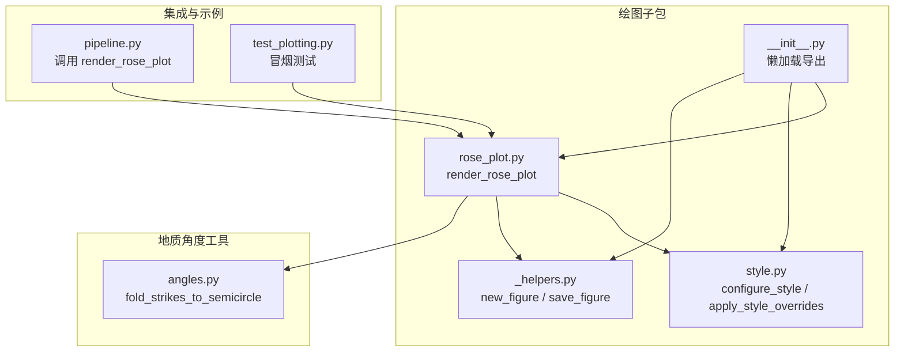
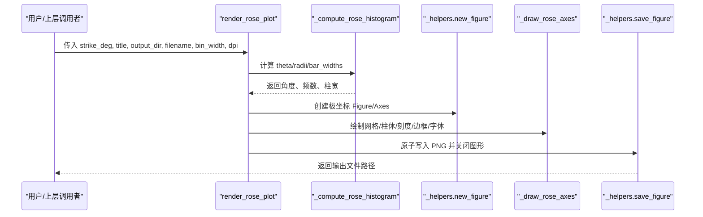
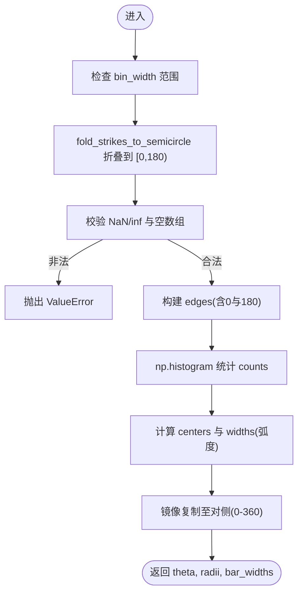
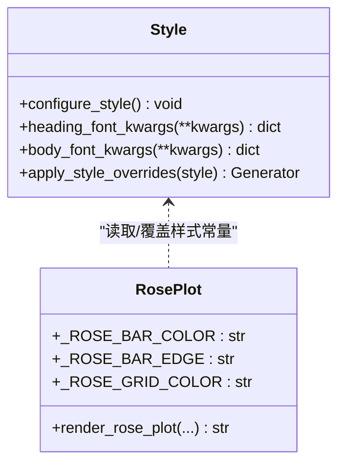
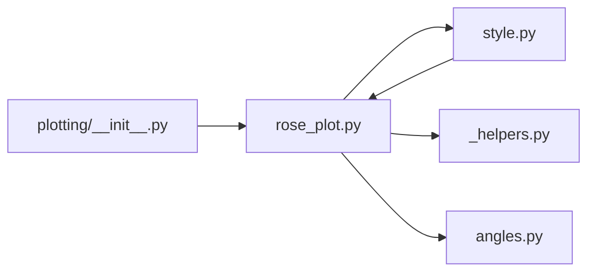

# 玫瑰图绘制API

<cite>
**本文引用的文件**
- [rose_plot.py](file://trace_pipeline/plotting/rose_plot.py)
- [style.py](file://trace_pipeline/plotting/style.py)
- [_helpers.py](file://trace_pipeline/plotting/_helpers.py)
- [angles.py](file://trace_pipeline/geology/angles.py)
- [__init__.py](file://trace_pipeline/plotting/__init__.py)
- [pipeline.py](file://trace_pipeline/pipeline.py)
- [test_plotting.py](file://tests/test_plotting.py)
</cite>

## 目录
1. [简介](#简介)
2. [项目结构](#项目结构)
3. [核心组件](#核心组件)
4. [架构总览](#架构总览)
5. [详细组件分析](#详细组件分析)
6. [依赖关系分析](#依赖关系分析)
7. [性能与输出特性](#性能与输出特性)
8. [故障排查指南](#故障排查指南)
9. [结论](#结论)
10. [附录：参数与样式清单](#附录参数与样式清单)

## 简介
本文件面向需要绘制“节理走向玫瑰花瓣图”的用户，聚焦于绘图子包中的玫瑰图 API。文档将深入说明：
- rose_plot 模块对外暴露的函数 render_rose_plot 的参数配置与数据格式要求
- 方位角统计数据的折叠、分箱与柱状图绘制流程
- 颜色主题、网格设置、标签格式化等样式的定制方法
- 极坐标轴的配置方法与刻度显示策略
- 与迹线图联动的综合可视化思路与批量生成方法

## 项目结构
与玫瑰图绘制相关的代码位于 trace_pipeline/plotting 子包中，并通过 __init__.py 提供懒加载导出；样式与通用辅助分别由 style.py 与 _helpers.py 提供；角度处理逻辑在 geology/angles.py 中实现；pipeline.py 展示了在完整管线中调用玫瑰图绘制的典型用法；测试用例 test_plotting.py 提供了最小可运行示例。

图表来源
- [rose_plot.py:1-140](file://trace_pipeline/plotting/rose_plot.py#L1-L140)
- [style.py:1-296](file://trace_pipeline/plotting/style.py#L1-L296)
- [_helpers.py:1-192](file://trace_pipeline/plotting/_helpers.py#L1-L192)
- [angles.py:1-168](file://trace_pipeline/geology/angles.py#L1-L168)
- [__init__.py:1-36](file://trace_pipeline/plotting/__init__.py#L1-L36)
- [pipeline.py:200-226](file://trace_pipeline/pipeline.py#L200-L226)
- [test_plotting.py:1-98](file://tests/test_plotting.py#L1-L98)

章节来源
- [__init__.py:1-36](file://trace_pipeline/plotting/__init__.py#L1-L36)
- [rose_plot.py:1-140](file://trace_pipeline/plotting/rose_plot.py#L1-L140)

## 核心组件
- render_rose_plot：对外主入口，负责计算直方图、创建极坐标图、绘制柱体与网格、保存图像并返回路径。
- _compute_rose_histogram：将走向角度折叠到半圆区间，进行分箱统计，得到柱体的角度、半径（频数）与宽度。
- _draw_rose_axes：统一绘制极坐标背景、网格、柱体、径向刻度与边框，并应用字体样式。
- style.configure_style：全局样式初始化（字体族、字号、线宽、DPI 等），幂等执行。
- style.apply_style_overrides：线程安全地临时覆盖绘图样式常量（如柱色、边色、网格色、字号）。
- _helpers.new_figure / save_figure：创建指定尺寸的 Figure 与原子化保存策略。
- angles.fold_strikes_to_semicircle：将走向角折叠到 [0°, 180°)，用于对称合并。

章节来源
- [rose_plot.py:76-140](file://trace_pipeline/plotting/rose_plot.py#L76-L140)
- [style.py:187-296](file://trace_pipeline/plotting/style.py#L187-L296)
- [_helpers.py:26-93](file://trace_pipeline/plotting/_helpers.py#L26-L93)
- [angles.py:154-168](file://trace_pipeline/geology/angles.py#L154-L168)

## 架构总览
下图展示从输入走向数组到最终 PNG 输出的关键调用链与数据流。

图表来源
- [rose_plot.py:106-140](file://trace_pipeline/plotting/rose_plot.py#L106-L140)
- [rose_plot.py:76-104](file://trace_pipeline/plotting/rose_plot.py#L76-L104)
- [_helpers.py:26-93](file://trace_pipeline/plotting/_helpers.py#L26-L93)

## 详细组件分析

### 函数接口：render_rose_plot
- 功能：根据走向角度数组绘制玫瑰花瓣图，保存到指定目录并返回文件路径。
- 输入参数
  - strike_deg：一维浮点数组，单位度，表示每条节理的走向角度。
  - title：字符串，作为图片标题。
  - output_dir：字符串，输出目录路径。
  - filename：字符串，输出文件名（建议以 .png 结尾）。
  - bin_width：浮点数，分箱宽度（度），必须在 (0, 180] 范围内。
  - dpi：整数，输出分辨率。
  - figsize_cm：元组，画布尺寸（厘米），默认正方形。
- 返回值：输出文件的绝对路径字符串。
- 行为要点
  - 自动调用 configure_style() 完成全局样式初始化。
  - 内部使用 fold_strikes_to_semicircle 将走向折叠到半圆，再进行分箱统计。
  - 极坐标轴按北为 0°、顺时针方向绘制，径向刻度自适应最大值。
  - 通过 new_figure/save_figure 创建与保存图像，支持透明或白色背景。

章节来源
- [rose_plot.py:106-140](file://trace_pipeline/plotting/rose_plot.py#L106-L140)
- [angles.py:154-168](file://trace_pipeline/geology/angles.py#L154-L168)
- [_helpers.py:26-93](file://trace_pipeline/plotting/_helpers.py#L26-L93)

### 数据处理：_compute_rose_histogram
- 输入：strike_deg（度）、bin_width（度）。
- 步骤
  - 校验 bin_width 范围。
  - 调用 fold_strikes_to_semicircle 将走向折叠到 [0°, 180°)。
  - 构造 edges 边界，确保包含 0 与 180。
  - 使用 np.histogram 统计各区间频数 counts。
  - 计算中心角度 centers 与柱宽 widths（弧度）。
  - 将半圆结果镜像复制到对侧，得到完整的 0–360° 分布。
- 输出：theta（弧度）、radii（频数）、bar_widths（弧度）。
- 复杂度
  - 时间 O(N + B)，N 为样本量，B 为分箱数。
  - 空间 O(B)。

图表来源
- [rose_plot.py:76-104](file://trace_pipeline/plotting/rose_plot.py#L76-L104)
- [angles.py:154-168](file://trace_pipeline/geology/angles.py#L154-L168)

章节来源
- [rose_plot.py:76-104](file://trace_pipeline/plotting/rose_plot.py#L76-L104)
- [angles.py:154-168](file://trace_pipeline/geology/angles.py#L154-L168)

### 绘图渲染：_draw_rose_axes
- 职责：在极坐标轴上绘制背景、网格、柱体、径向刻度与边框，并应用字体样式。
- 关键点
  - 设置 0° 朝北、顺时针方向。
  - 角度刻度每 30° 标注一次。
  - 网格颜色、透明度、线宽可调。
  - 柱体颜色、边色、透明度、对齐方式可配置。
  - 径向刻度自适应最大值，标签位置固定于 45°。
  - 调用 apply_axis_text_fonts 统一刻度字体。

章节来源
- [rose_plot.py:26-74](file://trace_pipeline/plotting/rose_plot.py#L26-L74)
- [style.py:181-185](file://trace_pipeline/plotting/style.py#L181-L185)

### 样式系统：style.py
- configure_style：一次性配置 matplotlib 全局样式（字体族、字号、线宽、DPI、数学文本字体等），幂等执行。
- heading_font_kwargs / body_font_kwargs：返回标题/正文字体族列表，避免 CJK 字体缺失字重导致的警告。
- apply_style_overrides：线程安全地临时覆盖绘图模块级样式常量，退出时恢复。
  - 支持的键包括 rose_bar_color、rose_bar_edge、rose_grid_color 以及 label_font_size/global_font_size。
  - 内部通过反射访问 rose_plot 模块常量并动态替换。

图表来源
- [style.py:187-296](file://trace_pipeline/plotting/style.py#L187-L296)
- [rose_plot.py:19-24](file://trace_pipeline/plotting/rose_plot.py#L19-L24)

章节来源
- [style.py:187-296](file://trace_pipeline/plotting/style.py#L187-L296)
- [rose_plot.py:19-24](file://trace_pipeline/plotting/rose_plot.py#L19-L24)

### 通用辅助：_helpers.py
- new_figure：按厘米尺寸创建 Figure 与 Axes，支持 subplot_kw（例如 projection="polar"）。
- save_figure：原子写入 PNG（先写临时文件再重命名），自动关闭图形，记录保存耗时日志。

章节来源
- [_helpers.py:26-93](file://trace_pipeline/plotting/_helpers.py#L26-L93)

### 角度工具：angles.py
- fold_strikes_to_semicircle：将走向角模 180°，并将接近 180° 的值归零，保证对称走向合并。

章节来源
- [angles.py:154-168](file://trace_pipeline/geology/angles.py#L154-L168)

## 依赖关系分析
- 模块耦合
  - rose_plot 依赖 style 与 _helpers 完成样式与图形生命周期管理。
  - rose_plot 依赖 geology.angles 完成走向折叠。
  - plotting.__init__ 通过懒加载导出 render_rose_plot，避免提前导入 pyplot。
- 外部依赖
  - numpy：数值计算与直方图统计。
  - matplotlib：极坐标绘图与样式控制。
- 潜在循环依赖
  - style.apply_style_overrides 在运行时按需导入 rose_plot 与 trace_plot，避免循环导入。

图表来源
- [rose_plot.py:1-140](file://trace_pipeline/plotting/rose_plot.py#L1-L140)
- [style.py:258-296](file://trace_pipeline/plotting/style.py#L258-L296)
- [__init__.py:1-36](file://trace_pipeline/plotting/__init__.py#L1-L36)

章节来源
- [__init__.py:1-36](file://trace_pipeline/plotting/__init__.py#L1-L36)
- [style.py:258-296](file://trace_pipeline/plotting/style.py#L258-L296)

## 性能与输出特性
- 分箱统计复杂度 O(N+B)，适合大规模走向数据快速出图。
- 径向刻度自适应最大值，减少多余空白区域。
- 原子写入策略避免异常中断导致的不完整文件。
- DPI 与画布尺寸可配置，便于不同出版需求。

[本节为通用指导，不直接分析具体文件]

## 故障排查指南
- 常见错误
  - bin_width 不在 (0, 180]：会抛出 ValueError。请调整分箱宽度。
  - 输入包含 NaN/inf：会抛出 ValueError。请在调用前清理数据。
  - 空数组：不会崩溃，但仅绘制空图（径向刻度固定为 0–1）。
- 定位方法
  - 查看保存日志（savefig 阶段）确认输出路径与耗时。
  - 使用测试用例验证基本流程是否可用。

章节来源
- [rose_plot.py:76-104](file://trace_pipeline/plotting/rose_plot.py#L76-L104)
- [_helpers.py:42-93](file://trace_pipeline/plotting/_helpers.py#L42-L93)
- [test_plotting.py:18-42](file://tests/test_plotting.py#L18-L42)

## 结论
render_rose_plot 提供了简洁而健壮的玫瑰图绘制能力，涵盖数据折叠、分箱统计、极坐标渲染与高质量输出。结合样式覆盖与通用辅助，可在复杂管线中稳定批量生成符合出版规范的玫瑰图。

[本节为总结性内容，不直接分析具体文件]

## 附录：参数与样式清单

### 函数参数一览
- strike_deg：numpy.ndarray，单位度，走向角度数组。
- title：str，图片标题。
- output_dir：str，输出目录。
- filename：str，输出文件名。
- bin_width：float，分箱宽度（度），取值范围 (0, 180]。
- dpi：int，输出分辨率。
- figsize_cm：tuple[float,float]，画布尺寸（厘米）。

章节来源
- [rose_plot.py:106-140](file://trace_pipeline/plotting/rose_plot.py#L106-L140)

### 样式覆盖键（通过 apply_style_overrides）
- rose_bar_color：柱体填充色（十六进制）。
- rose_bar_edge：柱体边框色（十六进制）。
- rose_grid_color：网格线颜色（十六进制）。
- label_font_size 或 global_font_size：全局字号覆盖。

章节来源
- [style.py:23-35](file://trace_pipeline/plotting/style.py#L23-L35)
- [style.py:258-296](file://trace_pipeline/plotting/style.py#L258-L296)

### 极坐标轴配置要点
- 0° 朝北，顺时针方向。
- 角度刻度每 30° 标注一次。
- 径向刻度自适应最大值，标签位置固定于 45°。
- 网格颜色、透明度、线宽可通过样式覆盖或内部常量调整。

章节来源
- [rose_plot.py:26-74](file://trace_pipeline/plotting/rose_plot.py#L26-L74)

### 与迹线图联动与批量生成
- 联动思路
  - 在同一批次处理中，先计算统计数据与变换后的坐标，再并行或顺序调用 render_trace_plot 与 render_rose_plot，统一输出目录与 DPI。
  - 使用 apply_style_overrides 在单次批处理中统一外观风格（如柱色、网格色、字号）。
- 批量生成
  - 遍历多个 outcrop 或数据集，复用同一份样式覆盖与输出路径模板，依次调用 render_rose_plot。
  - 参考 pipeline.py 中对玫瑰图的调用方式，结合日志记录与计时，形成稳定的批处理脚本。

章节来源
- [pipeline.py:200-226](file://trace_pipeline/pipeline.py#L200-L226)
- [test_plotting.py:18-42](file://tests/test_plotting.py#L18-L42)