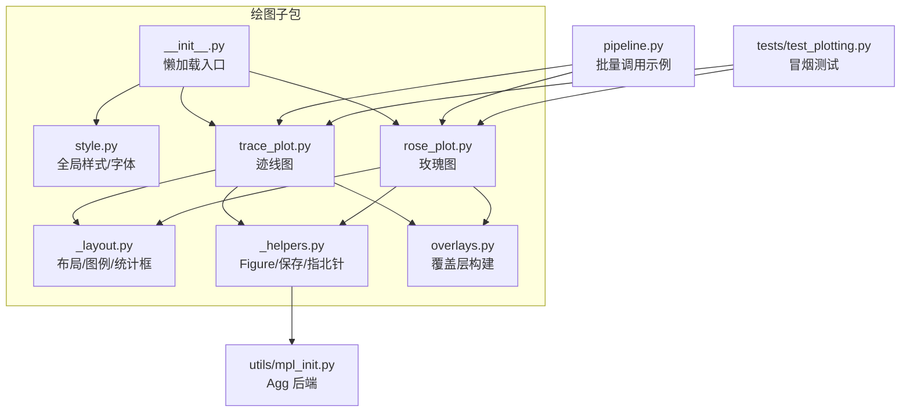
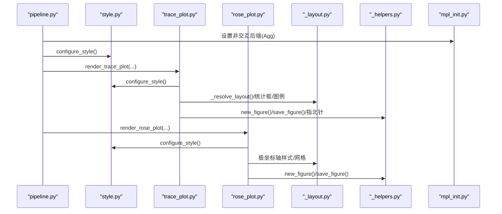
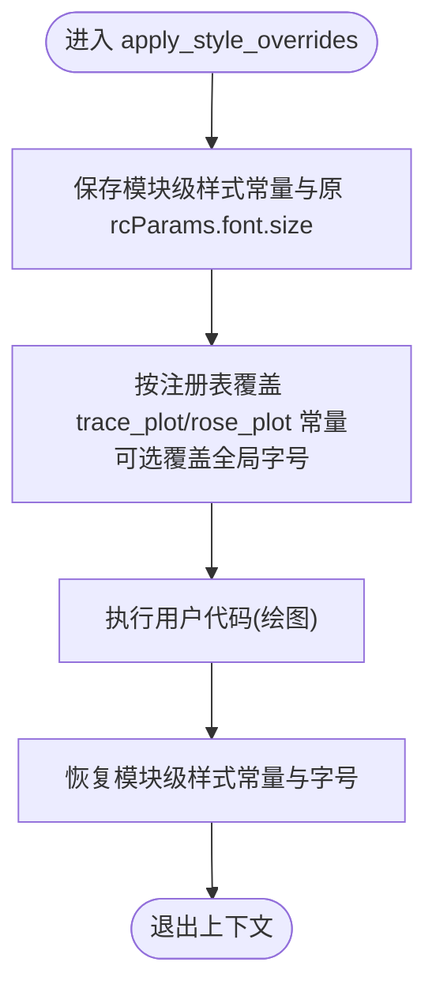
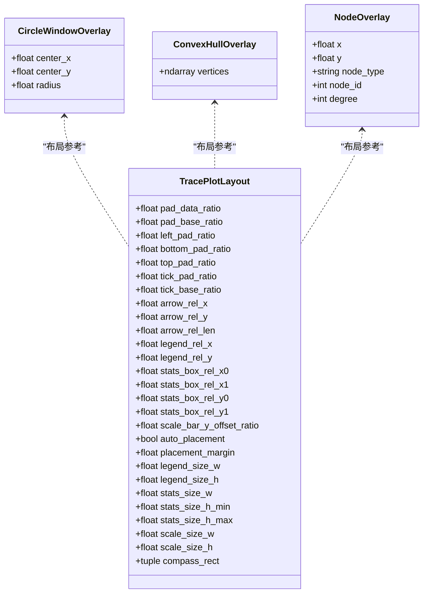
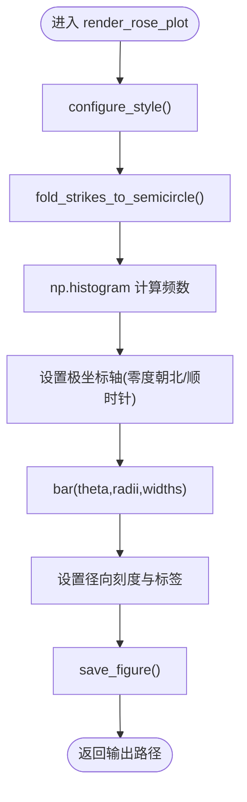
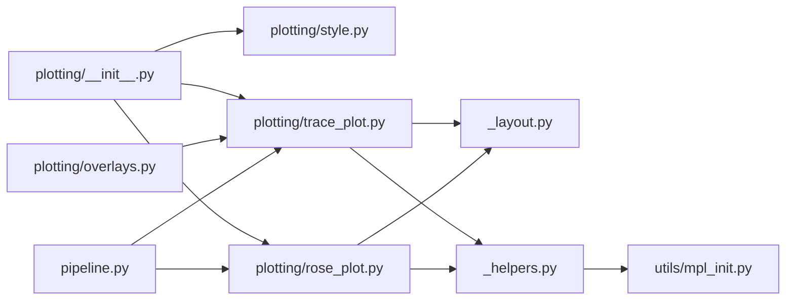

# 绘图可视化API

<cite>
**本文引用的文件**   
- [trace_pipeline/plotting/__init__.py](file://trace_pipeline/plotting/__init__.py)
- [trace_pipeline/plotting/style.py](file://trace_pipeline/plotting/style.py)
- [trace_pipeline/plotting/rose_plot.py](file://trace_pipeline/plotting/rose_plot.py)
- [trace_pipeline/plotting/trace_plot.py](file://trace_pipeline/plotting/trace_plot.py)
- [trace_pipeline/plotting/_layout.py](file://trace_pipeline/plotting/_layout.py)
- [trace_pipeline/plotting/_helpers.py](file://trace_pipeline/plotting/_helpers.py)
- [trace_pipeline/plotting/overlays.py](file://trace_pipeline/plotting/overlays.py)
- [trace_pipeline/utils/mpl_init.py](file://trace_pipeline/utils/mpl_init.py)
- [trace_pipeline/pipeline.py](file://trace_pipeline/pipeline.py)
- [tests/test_plotting.py](file://tests/test_plotting.py)
</cite>

## 目录
1. [简介](#简介)
2. [项目结构](#项目结构)
3. [核心组件](#核心组件)
4. [架构总览](#架构总览)
5. [详细组件分析](#详细组件分析)
6. [依赖关系分析](#依赖关系分析)
7. [性能与输出质量](#性能与输出质量)
8. [故障排查指南](#故障排查指南)
9. [结论](#结论)
10. [附录：批量绘图与自动化报告最佳实践](#附录批量绘图与自动化报告最佳实践)

## 简介
本指南面向需要生成高质量地质迹线与产状统计图表的用户，聚焦于以下能力：
- 样式配置函数 configure_style 的作用域、字体策略与全局 rcParams 设置
- 迹线图 render_trace_plot 的参数、图层控制与布局细节
- 玫瑰图 render_rose_plot 的直方分箱、极坐标轴与标题排版
- 覆盖层（圆窗、凸包、节点）的构建与叠加方式
- 批量绘图与自动化报告生成的流程建议
- matplotlib 后端的高级定制方法（非交互后端、透明背景、原子写入等）

## 项目结构
绘图子系统位于 trace_pipeline.plotting 下，采用“入口导出 + 模块内聚”的组织方式：
- __init__.py 提供按需懒加载的公共入口，避免提前导入 pyplot
- style.py 负责全局样式与 CJK 字体栈、数学文本字体、论文风格默认值
- trace_plot.py 实现迹线长度图绘制、布局计算、装饰元素与保存
- rose_plot.py 实现走向玫瑰花瓣图绘制与极坐标轴渲染
- _layout.py 提取布局、比例尺、统计框、图例等共享逻辑
- _helpers.py 封装 Figure 创建、保存、指北针几何与数据边界计算
- overlays.py 提供覆盖层（圆窗、凸包、节点）的构建工具
- utils/mpl_init.py 强制使用 Agg 非交互后端，保证多进程安全

图示来源
- [trace_pipeline/plotting/__init__.py:1-36](file://trace_pipeline/plotting/__init__.py#L1-L36)
- [trace_pipeline/plotting/style.py:187-256](file://trace_pipeline/plotting/style.py#L187-L256)
- [trace_pipeline/plotting/trace_plot.py:443-565](file://trace_pipeline/plotting/trace_plot.py#L443-L565)
- [trace_pipeline/plotting/rose_plot.py:106-140](file://trace_pipeline/plotting/rose_plot.py#L106-L140)
- [trace_pipeline/plotting/_layout.py:362-392](file://trace_pipeline/plotting/_layout.py#L362-L392)
- [trace_pipeline/plotting/_helpers.py:26-93](file://trace_pipeline/plotting/_helpers.py#L26-L93)
- [trace_pipeline/plotting/overlays.py:33-156](file://trace_pipeline/plotting/overlays.py#L33-L156)
- [trace_pipeline/utils/mpl_init.py:12-24](file://trace_pipeline/utils/mpl_init.py#L12-L24)
- [trace_pipeline/pipeline.py:150-227](file://trace_pipeline/pipeline.py#L150-L227)
- [tests/test_plotting.py:18-98](file://tests/test_plotting.py#L18-L98)

章节来源
- [trace_pipeline/plotting/__init__.py:1-36](file://trace_pipeline/plotting/__init__.py#L1-L36)

## 核心组件
- 样式配置
  - configure_style：幂等初始化，设置字体族、数学文本字体、字号、线宽、DPI、边框粗细等；检测并回退可用字体，记录缺失警告。
  - apply_style_overrides：线程安全的上下文管理器，临时覆盖模块级样式常量与全局字号，退出自动恢复。
- 迹线图
  - render_trace_plot：支持原始/旋转坐标系、面积来源（实测/圆窗/凸包）、节点覆盖层、统计信息框、比例尺带、指北针、自适应 figure 尺寸与背景透明。
- 玫瑰图
  - render_rose_plot：将走向折叠为半圆后做直方统计，极坐标柱体绘制，网格与刻度统一样式。
- 覆盖层
  - CircleWindowOverlay / ConvexHullOverlay / NodeOverlay：用于在迹线图上叠加圆窗、凸包与节点标记。
  - overlays.py：从统计数据与端点信息构建覆盖层，并提供旋转到测线坐标系的工具。
- 通用辅助
  - new_figure/save_figure：创建/保存图形，支持透明背景与原子写入。
  - add_data_north_arrow/compute_data_bounds：指北针几何与数据范围计算。
  - _layout：布局解析、比例尺选择、统计框与图例绘制。

章节来源
- [trace_pipeline/plotting/style.py:187-296](file://trace_pipeline/plotting/style.py#L187-L296)
- [trace_pipeline/plotting/trace_plot.py:72-133](file://trace_pipeline/plotting/trace_plot.py#L72-L133)
- [trace_pipeline/plotting/trace_plot.py:443-565](file://trace_pipeline/plotting/trace_plot.py#L443-L565)
- [trace_pipeline/plotting/rose_plot.py:106-140](file://trace_pipeline/plotting/rose_plot.py#L106-L140)
- [trace_pipeline/plotting/overlays.py:33-156](file://trace_pipeline/plotting/overlays.py#L33-L156)
- [trace_pipeline/plotting/_helpers.py:26-93](file://trace_pipeline/plotting/_helpers.py#L26-L93)
- [trace_pipeline/plotting/_layout.py:362-392](file://trace_pipeline/plotting/_layout.py#L362-L392)

## 架构总览
下图展示了从 pipeline 到具体绘图函数的调用链，以及样式与布局的依赖关系。

图示来源
- [trace_pipeline/pipeline.py:150-227](file://trace_pipeline/pipeline.py#L150-L227)
- [trace_pipeline/plotting/style.py:187-256](file://trace_pipeline/plotting/style.py#L187-L256)
- [trace_pipeline/plotting/trace_plot.py:443-565](file://trace_pipeline/plotting/trace_plot.py#L443-L565)
- [trace_pipeline/plotting/rose_plot.py:106-140](file://trace_pipeline/plotting/rose_plot.py#L106-L140)
- [trace_pipeline/plotting/_layout.py:362-392](file://trace_pipeline/plotting/_layout.py#L362-L392)
- [trace_pipeline/plotting/_helpers.py:26-93](file://trace_pipeline/plotting/_helpers.py#L26-L93)
- [trace_pipeline/utils/mpl_init.py:12-24](file://trace_pipeline/utils/mpl_init.py#L12-L24)

## 详细组件分析

### 样式配置：configure_style 与 apply_style_overrides
- configure_style
  - 作用：一次性配置 matplotlib 全局样式，确保中英文混排、数学公式字体一致、线条与刻度宽度符合论文规范。
  - 关键点：
    - 字体族优先顺序：西文 Times New Roman → 中文宋体/黑体 → 可用候选集 → serif/sans-serif 回退
    - 数学文本 mathtext 自定义字体映射，避免粗体缺失导致的 findfont 噪声
    - 全局 DPI=300、保存 DPI=300、白底、细线宽与小字号
    - 幂等保护与线程锁，防止重复初始化与竞态
- apply_style_overrides
  - 作用：在 with 块中临时覆盖模块级样式常量（如迹线颜色、宽度、凸包/圆窗填充与透明度、玫瑰图柱色等），以及全局字号。
  - 机制：通过注册表 _STYLE_CONSTANTS 动态定位目标模块属性，保存原值并在 finally 中恢复。

图示来源
- [trace_pipeline/plotting/style.py:259-296](file://trace_pipeline/plotting/style.py#L259-L296)
- [trace_pipeline/plotting/style.py:23-35](file://trace_pipeline/plotting/style.py#L23-L35)

章节来源
- [trace_pipeline/plotting/style.py:187-296](file://trace_pipeline/plotting/style.py#L187-L296)

### 迹线图：render_trace_plot
- 输入参数要点
  - segments：(N,4) 线段数组，表示迹线端点坐标
  - title：标题字符串，可包含换行影响外框顶部位置
  - output_dir/filename：输出路径与文件名
  - dpi：输出分辨率
  - figsize_cm：若为 None，则根据数据跨度自适应计算，使不同图之间物理尺度一致
  - north_angle_deg：指北针方向角
  - statistics_lines：统计信息列表，格式为“标签：数值”，支持单位规范化
  - circle_windows/hull_overlay/node_overlays：覆盖层对象序列
  - area_source：面积来源（measured/window/hull/hull_buffered/window_equivalent），决定显示哪些覆盖层
  - include_*：布尔开关，控制是否绘制迹线、凸包、圆窗、节点、装饰元素
  - background_color：背景色，支持 white/transparent/none
- 处理流程
  - 配置样式 → 转换线段为 x/y 序列（NaN 分隔）→ 计算装饰布局与自适应 figure 尺寸 → 创建空白 axes → 绘制底层覆盖层 → 绘制迹线 → 节点覆盖层 → 设置坐标轴样式与范围 → 添加指北针、比例尺带、图例、统计框 → 保存
- 关键特性
  - 自适应 figure 尺寸：基于数据跨度与目标比例尺，限制最小/最大尺寸
  - 背景透明：便于后续叠加或合成
  - 原子写入：先写临时文件再重命名，避免中断导致损坏
  - 节点样式预设：default/solid/hollow/dark，可通过 style.node_style 切换

图示来源
- [trace_pipeline/plotting/trace_plot.py:72-133](file://trace_pipeline/plotting/trace_plot.py#L72-L133)

章节来源
- [trace_pipeline/plotting/trace_plot.py:443-565](file://trace_pipeline/plotting/trace_plot.py#L443-L565)
- [trace_pipeline/plotting/_layout.py:362-392](file://trace_pipeline/plotting/_layout.py#L362-L392)
- [trace_pipeline/plotting/_helpers.py:26-93](file://trace_pipeline/plotting/_helpers.py#L26-L93)

### 玫瑰图：render_rose_plot
- 输入参数要点
  - strike_deg：走向角度数组（度）
  - bin_width：直方分箱宽度（度），必须在 (0, 180]
  - dpi：输出分辨率
  - figsize_cm：固定正方形尺寸
- 处理流程
  - 配置样式 → 折叠走向至半圆 → 计算直方统计（中心、频数、柱宽）→ 极坐标轴设置（零度朝北、顺时针、网格、刻度）→ 绘制柱体 → 设置径向刻度与标签 → 保存
- 注意事项
  - 空数据时仍会输出有效 PNG（空柱体）
  - 非法 bin_width 或含 NaN/inf 的输入会抛出异常

图示来源
- [trace_pipeline/plotting/rose_plot.py:76-104](file://trace_pipeline/plotting/rose_plot.py#L76-L104)
- [trace_pipeline/plotting/rose_plot.py:106-140](file://trace_pipeline/plotting/rose_plot.py#L106-L140)

章节来源
- [trace_pipeline/plotting/rose_plot.py:106-140](file://trace_pipeline/plotting/rose_plot.py#L106-L140)

### 覆盖层构建：overlays.py
- 功能
  - build_raw_circle_overlays：从诊断结果构建原始坐标系下的圆窗
  - build_rotated_circle_overlays：将圆窗旋转到测线坐标系
  - build_selected_hull_overlays：根据面积来源选择原始/缓冲凸包顶点并旋转
  - build_node_overlays/build_rotated_node_overlays：节点识别结果转覆盖层并旋转
- 用途
  - 供 pipeline 与预览服务统一调用，避免重复逻辑

章节来源
- [trace_pipeline/plotting/overlays.py:33-156](file://trace_pipeline/plotting/overlays.py#L33-L156)

### 布局与装饰：_layout.py
- 布局解析
  - _resolve_layout：根据标题行数调整外框顶部，统计框占据右上区域，图例高度自适应，比例尺带固定底部
- 比例尺
  - _choose_scale_length：依据数据跨度选择 1/2/5×10ⁿ 规整长度
  - _add_scale_bar_band：在独立面板绘制与数据轴同尺度的比例尺
- 统计框
  - _add_statistics_box：半透明白底矩形，标题+分割线+键值对，单位文本经 mathtext 规范化
- 图例
  - _render_legend：根据 items 与 styles 绘制图标与说明文本，支持迹线、凸包、圆窗与节点类型

章节来源
- [trace_pipeline/plotting/_layout.py:362-392](file://trace_pipeline/plotting/_layout.py#L362-L392)
- [trace_pipeline/plotting/_layout.py:179-201](file://trace_pipeline/plotting/_layout.py#L179-L201)
- [trace_pipeline/plotting/_layout.py:262-357](file://trace_pipeline/plotting/_layout.py#L262-L357)
- [trace_pipeline/plotting/_layout.py:447-569](file://trace_pipeline/plotting/_layout.py#L447-L569)

### 通用辅助：_helpers.py
- new_figure：以厘米为单位创建 figure，背景白色
- save_figure：原子写入、透明背景保持、关闭与清理临时文件
- add_data_north_arrow：在数据坐标下绘制指北针箭头与 N 标签
- compute_data_bounds：向量化计算数据范围，支持额外 X/Y 集合（凸包/圆窗/节点）

章节来源
- [trace_pipeline/plotting/_helpers.py:26-93](file://trace_pipeline/plotting/_helpers.py#L26-L93)
- [trace_pipeline/plotting/_helpers.py:121-158](file://trace_pipeline/plotting/_helpers.py#L121-L158)
- [trace_pipeline/plotting/_helpers.py:160-192](file://trace_pipeline/plotting/_helpers.py#L160-L192)

## 依赖关系分析
- 模块耦合
  - plotting.__init__ 仅暴露懒加载入口，降低导入成本
  - trace_plot 与 rose_plot 均依赖 style 与 _layout/_helpers
  - overlays 依赖 trace_plot 的数据类定义，供上层 pipeline 使用
- 外部依赖
  - matplotlib（Agg 后端）
  - numpy（数值计算）
  - os/pathlib/time（文件操作与计时）

图示来源
- [trace_pipeline/plotting/__init__.py:1-36](file://trace_pipeline/plotting/__init__.py#L1-L36)
- [trace_pipeline/plotting/trace_plot.py:1-30](file://trace_pipeline/plotting/trace_plot.py#L1-L30)
- [trace_pipeline/plotting/rose_plot.py:1-17](file://trace_pipeline/plotting/rose_plot.py#L1-L17)
- [trace_pipeline/plotting/_layout.py:1-35](file://trace_pipeline/plotting/_layout.py#L1-L35)
- [trace_pipeline/plotting/_helpers.py:1-22](file://trace_pipeline/plotting/_helpers.py#L1-L22)
- [trace_pipeline/plotting/overlays.py:1-31](file://trace_pipeline/plotting/overlays.py#L1-L31)
- [trace_pipeline/pipeline.py:150-227](file://trace_pipeline/pipeline.py#L150-L227)
- [trace_pipeline/utils/mpl_init.py:12-24](file://trace_pipeline/utils/mpl_init.py#L12-L24)

章节来源
- [trace_pipeline/plotting/__init__.py:1-36](file://trace_pipeline/plotting/__init__.py#L1-L36)
- [trace_pipeline/pipeline.py:150-227](file://trace_pipeline/pipeline.py#L150-L227)

## 性能与输出质量
- 性能
  - 懒加载：仅在首次访问时导入具体模块，减少启动开销
  - 原子写入：save_figure 先写临时文件再替换，避免并发写入冲突
  - 节点批量 scatter：按类型分组绘制，减少多次 plot 调用
  - 自适应 figure 尺寸：避免过大画布导致渲染缓慢
- 输出质量
  - 默认 DPI=300，适合出版与报告
  - 数学文本使用自定义字体映射，单位上标与英文数字一致
  - 标题与正文字体分离，避免粗体缺失导致的回退告警
  - 透明背景支持，便于后期叠加或合成

[本节为通用指导，不直接分析具体文件]

## 故障排查指南
- 常见问题
  - 中文显示异常：确认系统已安装宋体/黑体或候选字体；configure_style 会记录缺失警告
  - 数学符号乱码：检查 mathtext 字体映射是否生效（Times New Roman 优先）
  - 多进程崩溃：确保在子进程中调用 force_noninteractive_backend() 后再绘图
  - 输出文件损坏：检查 save_figure 的原子写入是否被外部进程占用
- 调试建议
  - 使用 apply_style_overrides 隔离样式变更，避免污染全局
  - 打印日志中的 stage 与 duration_ms 字段定位耗时步骤
  - 对于空数据或非法输入，捕获 ValueError 并给出友好提示

章节来源
- [trace_pipeline/plotting/style.py:216-220](file://trace_pipeline/plotting/style.py#L216-L220)
- [trace_pipeline/plotting/_helpers.py:42-93](file://trace_pipeline/plotting/_helpers.py#L42-L93)
- [trace_pipeline/utils/mpl_init.py:12-24](file://trace_pipeline/utils/mpl_init.py#L12-L24)
- [tests/test_plotting.py:31-41](file://tests/test_plotting.py#L31-L41)

## 结论
该绘图 API 围绕“样式统一、布局稳定、输出可靠”的目标设计，通过懒加载、原子写入、自适应布局与字体回退策略，兼顾了易用性与高质量输出。配合 overlays 与 layout 工具，可在迹线图与玫瑰图中灵活叠加多种视觉层，满足科研与工程报告的多样化需求。

[本节为总结性内容，不直接分析具体文件]

## 附录：批量绘图与自动化报告最佳实践
- 批量绘图
  - 在 pipeline 中使用 apply_style_overrides 包裹绘图阶段，确保样式覆盖不影响其他任务
  - 为每个 outcrop 生成原始与旋转两套迹线图，并可选生成玫瑰图
  - 使用 statistics_lines 自动生成统计框，单位文本自动规范化
- 自动化报告
  - 将 PNG 路径与元数据（DPI、时间、统计量）写入报告模板
  - 利用透明背景与统一 DPI，确保多图拼接一致性
  - 在 CI 环境中运行 tests/test_plotting.py 进行冒烟测试，确保无回归
- 示例参考
  - 批量调用见 pipeline.py 的绘图阶段
  - 单图用法见 tests/test_plotting.py 的测试用例

章节来源
- [trace_pipeline/pipeline.py:150-227](file://trace_pipeline/pipeline.py#L150-L227)
- [tests/test_plotting.py:18-98](file://tests/test_plotting.py#L18-L98)