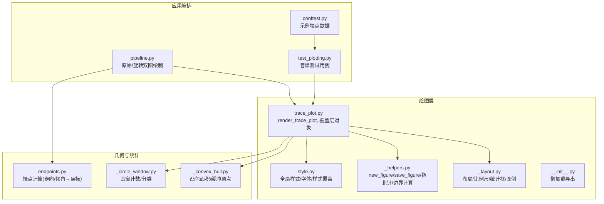
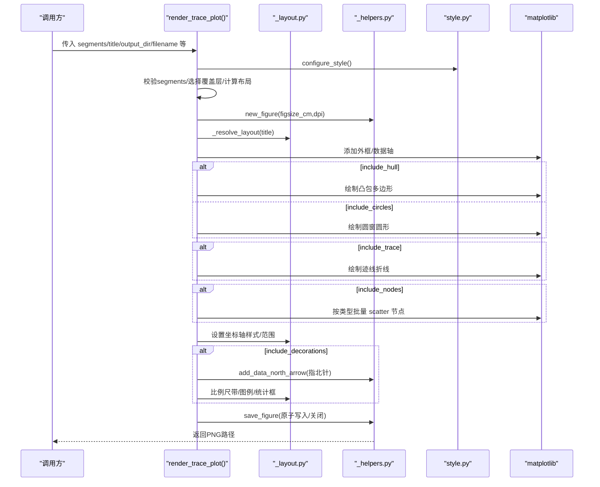
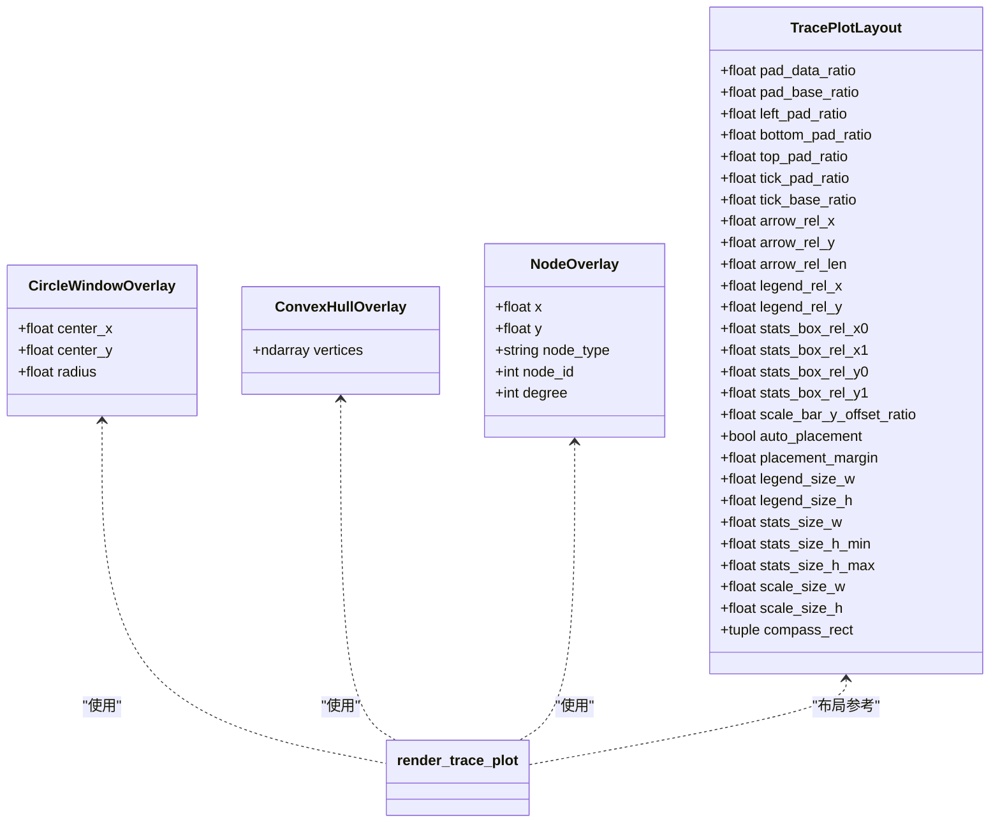
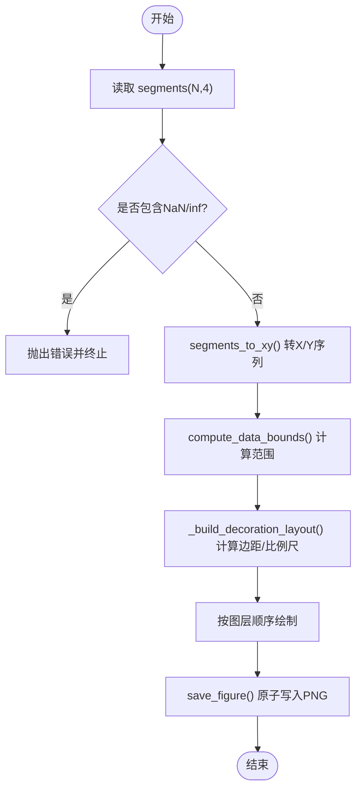
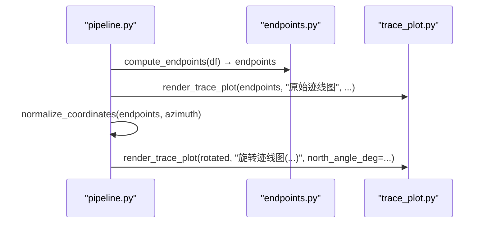
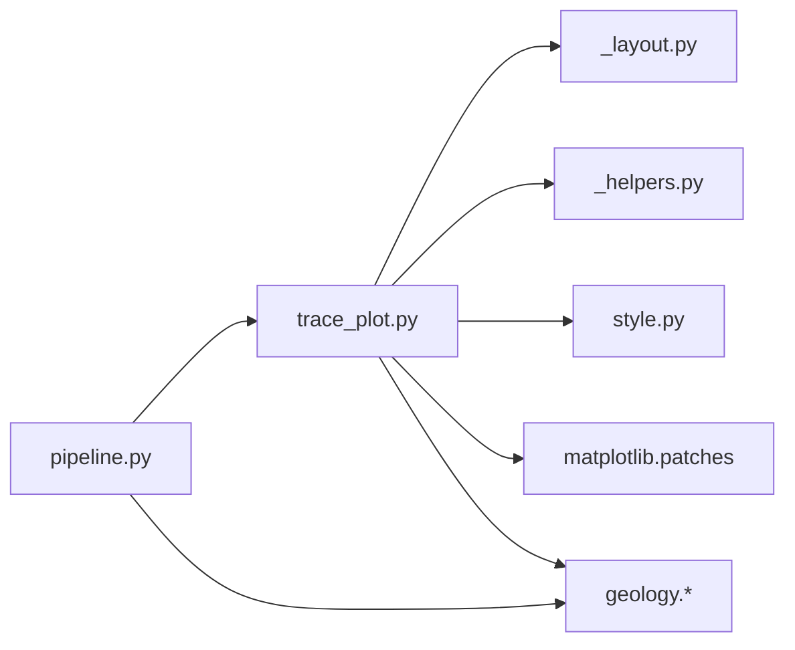

# 迹线图绘制API

<cite>
**本文引用的文件**   
- [trace_plot.py](file://trace_pipeline/plotting/trace_plot.py)
- [_layout.py](file://trace_pipeline/plotting/_layout.py)
- [_helpers.py](file://trace_pipeline/plotting/_helpers.py)
- [style.py](file://trace_pipeline/plotting/style.py)
- [__init__.py](file://trace_pipeline/plotting/__init__.py)
- [endpoints.py](file://trace_pipeline/geology/endpoints.py)
- [_convex_hull.py](file://trace_pipeline/geology/_convex_hull.py)
- [_circle_window.py](file://trace_pipeline/geology/_circle_window.py)
- [pipeline.py](file://trace_pipeline/pipeline.py)
- [test_plotting.py](file://tests/test_plotting.py)
- [conftest.py](file://tests/conftest.py)
</cite>

## 目录
1. [简介](#简介)
2. [项目结构](#项目结构)
3. [核心组件](#核心组件)
4. [架构总览](#架构总览)
5. [详细组件分析](#详细组件分析)
6. [依赖关系分析](#依赖关系分析)
7. [性能与输出质量](#性能与输出质量)
8. [故障排查指南](#故障排查指南)
9. [结论](#结论)
10. [附录：参数与用法速查](#附录参数与用法速查)

## 简介
本指南面向需要高质量地质迹线长度图输出的用户，系统讲解 trace_pipeline.plotting 子包中的迹线图绘制 API。重点围绕主函数 render_trace_plot() 的参数、数据输入格式、坐标变换配合、可视化选项（凸包填充、圆窗标记、节点覆盖层）、线型/颜色/透明度配置、批量处理与自动化报告生成最佳实践展开，并提供原始坐标系与旋转坐标系的完整绘图流程说明。

## 项目结构
迹线图绘制相关代码集中在 plotting 子包中，并与 geology 模块的几何计算能力协作，最终由 pipeline 编排调用。

图表来源
- [trace_plot.py:443-565](file://trace_pipeline/plotting/trace_plot.py#L443-L565)
- [_layout.py:362-420](file://trace_pipeline/plotting/_layout.py#L362-L420)
- [_helpers.py:26-93](file://trace_pipeline/plotting/_helpers.py#L26-L93)
- [style.py:187-256](file://trace_pipeline/plotting/style.py#L187-L256)
- [endpoints.py:295-411](file://trace_pipeline/geology/endpoints.py#L295-L411)
- [_convex_hull.py:17-85](file://trace_pipeline/geology/_convex_hull.py#L17-L85)
- [_circle_window.py:71-216](file://trace_pipeline/geology/_circle_window.py#L71-L216)
- [pipeline.py:150-202](file://trace_pipeline/pipeline.py#L150-L202)
- [test_plotting.py:44-98](file://tests/test_plotting.py#L44-L98)
- [conftest.py:9-23](file://tests/conftest.py#L9-L23)

章节来源
- [trace_plot.py:443-565](file://trace_pipeline/plotting/trace_plot.py#L443-L565)
- [_layout.py:362-420](file://trace_pipeline/plotting/_layout.py#L362-L420)
- [_helpers.py:26-93](file://trace_pipeline/plotting/_helpers.py#L26-L93)
- [style.py:187-256](file://trace_pipeline/plotting/style.py#L187-L256)
- [endpoints.py:295-411](file://trace_pipeline/geology/endpoints.py#L295-L411)
- [_convex_hull.py:17-85](file://trace_pipeline/geology/_convex_hull.py#L17-L85)
- [_circle_window.py:71-216](file://trace_pipeline/geology/_circle_window.py#L71-L216)
- [pipeline.py:150-202](file://trace_pipeline/pipeline.py#L150-L202)
- [test_plotting.py:44-98](file://tests/test_plotting.py#L44-L98)
- [conftest.py:9-23](file://tests/conftest.py#L9-L23)

## 核心组件
- 主渲染入口
  - render_trace_plot(): 负责从线段数组到最终 PNG 的端到端绘制，支持图层开关、背景透明、自适应尺寸等。
- 覆盖层数据结构
  - CircleWindowOverlay: 圆窗中心与半径。
  - ConvexHullOverlay: 凸包顶点序列。
  - NodeOverlay: 节点位置与类型（I/Y/X）。
- 布局与装饰
  - _layout.py: 统一布局解析、外框、比例尺带、统计信息框、图例、节点样式预设。
- 通用辅助
  - _helpers.py: Figure 创建/保存、指北针绘制、数据范围计算。
- 样式系统
  - style.py: 全局字体/数学文本/论文风格默认值；线程安全的样式覆盖上下文管理器。
- 几何与统计
  - endpoints.py: 从 Excel 表头与数值矩阵计算端点坐标 (N,4)。
  - _convex_hull.py: 凸包构建、面积、缓冲近似。
  - _circle_window.py: 圆窗相交计数与诊断。

章节来源
- [trace_plot.py:72-133](file://trace_pipeline/plotting/trace_plot.py#L72-L133)
- [trace_plot.py:443-565](file://trace_pipeline/plotting/trace_plot.py#L443-L565)
- [_layout.py:362-420](file://trace_pipeline/plotting/_layout.py#L362-L420)
- [_helpers.py:26-93](file://trace_pipeline/plotting/_helpers.py#L26-L93)
- [style.py:187-256](file://trace_pipeline/plotting/style.py#L187-L256)
- [endpoints.py:295-411](file://trace_pipeline/geology/endpoints.py#L295-L411)
- [_convex_hull.py:17-85](file://trace_pipeline/geology/_convex_hull.py#L17-L85)
- [_circle_window.py:71-216](file://trace_pipeline/geology/_circle_window.py#L71-L216)

## 架构总览
下图展示一次典型绘制的调用链与数据流：从端点数据到最终图像输出，包含图层叠加顺序与装饰元素插入点。

图表来源
- [trace_plot.py:443-565](file://trace_pipeline/plotting/trace_plot.py#L443-L565)
- [_layout.py:362-420](file://trace_pipeline/plotting/_layout.py#L362-L420)
- [_helpers.py:26-93](file://trace_pipeline/plotting/_helpers.py#L26-L93)
- [style.py:187-256](file://trace_pipeline/plotting/style.py#L187-L256)

## 详细组件分析

### 主函数 render_trace_plot()
- 功能概述
  - 将 (N,4) 线段数组转换为可绘制的 X/Y 序列，按图层顺序绘制（底层为凸包或圆窗，顶层为迹线与节点），并添加指北针、比例尺、图例与统计框，最后以高 DPI 保存 PNG。
- 关键参数
  - segments: np.ndarray，形状 (N,4)，列序 [x1,y1,x2,y2]。
  - title: str，用于标题与布局解析。
  - output_dir: str，输出目录。
  - filename: str，输出文件名。
  - dpi: int，默认 300。
  - figsize_cm: tuple|None，若 None 则根据数据跨度自适应，确保不同图之间 1m 物理长度一致。
  - north_angle_deg: float，指北针角度（度）。
  - statistics_lines: Sequence[str]|None，统计信息行列表（如“P10 = ...”）。
  - circle_windows: Sequence[CircleWindowOverlay]|None，圆窗覆盖层。
  - hull_overlay: ConvexHullOverlay|None，凸包覆盖层。
  - area_source: str，控制面积来源显示（影响图例文案）。
  - node_overlays: Sequence[NodeOverlay]|None，节点覆盖层。
  - style: dict|None，样式覆盖（见样式系统）。
  - include_trace/include_hull/include_circles/include_nodes/include_decorations: bool，图层开关。
  - background_color: str，背景色；支持 "none"/"transparent" 实现透明背景。
- 返回值
  - 输出文件的绝对路径字符串。
- 重要行为
  - 自动选择覆盖层：当 area_source 为 hull/hull_buffered 且存在有效凸包时优先绘制凸包；否则在 window/window_equivalent 下绘制圆窗。
  - 自适应 figure 尺寸：依据数据跨度与目标比例尺计算，限制在最小/最大厘米区间内。
  - 图层顺序：凸包/圆窗 → 迹线 → 节点 → 装饰元素。
  - 保存策略：原子写入临时文件后重命名，避免中断导致损坏。

章节来源
- [trace_plot.py:443-565](file://trace_pipeline/plotting/trace_plot.py#L443-L565)
- [trace_plot.py:151-169](file://trace_pipeline/plotting/trace_plot.py#L151-L169)
- [trace_plot.py:420-441](file://trace_pipeline/plotting/trace_plot.py#L420-L441)
- [_helpers.py:42-93](file://trace_pipeline/plotting/_helpers.py#L42-L93)

#### 类与数据结构

图表来源
- [trace_plot.py:72-133](file://trace_pipeline/plotting/trace_plot.py#L72-L133)

章节来源
- [trace_plot.py:72-133](file://trace_pipeline/plotting/trace_plot.py#L72-L133)

### 数据输入与坐标变换
- 输入格式
  - segments: (N,4) 浮点数组，列序 [x1,y1,x2,y2]。
  - 可通过 geology.endpoints.compute_endpoints() 从 Excel 表头与数值矩阵计算得到。
- 坐标变换
  - 原始坐标系：直接使用 compute_endpoints() 输出的端点坐标。
  - 旋转坐标系：对端点进行归一化旋转，使测线方向对齐，便于对比与统计。
- 常用工具
  - segments_to_xy(): 将 (N,4) 转为带 NaN 分隔的一维 X/Y 序列，供 matplotlib 分段绘制。
  - compute_data_bounds(): 计算数据范围，考虑额外元素（凸包、圆窗、节点）以扩展边界。

图表来源
- [trace_plot.py:151-169](file://trace_pipeline/plotting/trace_plot.py#L151-L169)
- [trace_plot.py:198-222](file://trace_pipeline/plotting/trace_plot.py#L198-L222)
- [trace_plot.py:225-266](file://trace_pipeline/plotting/trace_plot.py#L225-L266)
- [_helpers.py:160-192](file://trace_pipeline/plotting/_helpers.py#L160-L192)

章节来源
- [endpoints.py:295-411](file://trace_pipeline/geology/endpoints.py#L295-L411)
- [trace_plot.py:151-169](file://trace_pipeline/plotting/trace_plot.py#L151-L169)
- [trace_plot.py:198-222](file://trace_pipeline/plotting/trace_plot.py#L198-L222)
- [trace_plot.py:225-266](file://trace_pipeline/plotting/trace_plot.py#L225-L266)
- [_helpers.py:160-192](file://trace_pipeline/plotting/_helpers.py#L160-L192)

### 可视化选项与自定义配置
- 图层开关
  - include_trace/include_hull/include_circles/include_nodes/include_decorations 控制各层可见性，便于生成独立视觉层进行叠加合成。
- 背景与透明
  - background_color="white" 默认不透明；设为 "none" 或 "transparent" 启用透明背景，适合叠加到其他底图上。
- 线型/颜色/透明度
  - 迹线：颜色、线宽由内部常量定义，可通过样式覆盖修改。
  - 凸包：虚线边框+浅蓝填充，透明度可调。
  - 圆窗：虚线边框+橙色填充，透明度可调。
  - 节点：按类型（I/Y/X）分组批量 scatter，支持 marker、facecolor、edgecolor、linewidth 等。
- 样式覆盖
  - 使用 apply_style_overrides(style_dict) 上下文管理器，线程安全地临时覆盖绘图常量与字号，退出自动恢复。
  - 支持的键包括 trace_line_color、trace_line_width、hull_*、circle_window_* 等。
- 图例与统计框
  - 图例根据 area_source 与图层存在情况动态生成。
  - 统计框支持单位规范化（m⁻¹/m² 等）与紧凑排版。

章节来源
- [trace_plot.py:443-565](file://trace_pipeline/plotting/trace_plot.py#L443-L565)
- [trace_plot.py:302-317](file://trace_pipeline/plotting/trace_plot.py#L302-L317)
- [trace_plot.py:283-299](file://trace_pipeline/plotting/trace_plot.py#L283-L299)
- [trace_plot.py:320-357](file://trace_pipeline/plotting/trace_plot.py#L320-L357)
- [style.py:258-296](file://trace_pipeline/plotting/style.py#L258-L296)
- [_layout.py:447-569](file://trace_pipeline/plotting/_layout.py#L447-L569)
- [_layout.py:262-357](file://trace_pipeline/plotting/_layout.py#L262-L357)

### 端点连接、凸包填充与圆窗标记
- 端点连接
  - segments_to_xy() 将每条线段两端点拼接，并以 NaN 分隔，使 matplotlib 正确断开绘制。
- 凸包填充
  - 基于凸包顶点构造 Polygon，虚线边框+半透明填充；支持缓冲凸包近似（Minkowski和折线近似）。
- 圆窗标记
  - 使用 Circle patch 绘制，支持填充与虚线边框；仅保留几何有效的圆窗（有限坐标且正半径）。

章节来源
- [trace_plot.py:151-169](file://trace_pipeline/plotting/trace_plot.py#L151-L169)
- [trace_plot.py:302-317](file://trace_pipeline/plotting/trace_plot.py#L302-L317)
- [trace_plot.py:283-299](file://trace_pipeline/plotting/trace_plot.py#L283-L299)
- [_convex_hull.py:17-85](file://trace_pipeline/geology/_convex_hull.py#L17-L85)
- [_convex_hull.py:116-183](file://trace_pipeline/geology/_convex_hull.py#L116-L183)
- [_circle_window.py:71-216](file://trace_pipeline/geology/_circle_window.py#L71-L216)

### 原始坐标系与旋转坐标系绘图
- 原始坐标系
  - 直接使用 compute_endpoints() 输出的端点坐标绘制，标题通常为“原始迹线图”。
- 旋转坐标系
  - 对端点进行归一化旋转，使测线方向对齐；调整 north_angle_deg 以反映真实北向。
- 实际编排
  - pipeline.py 在同一 outcrop 下分别生成 raw 与 rotated 两张图，并可附加玫瑰图。

图表来源
- [pipeline.py:150-202](file://trace_pipeline/pipeline.py#L150-L202)
- [endpoints.py:295-411](file://trace_pipeline/geology/endpoints.py#L295-L411)
- [trace_plot.py:443-565](file://trace_pipeline/plotting/trace_plot.py#L443-L565)

章节来源
- [pipeline.py:150-202](file://trace_pipeline/pipeline.py#L150-L202)
- [endpoints.py:295-411](file://trace_pipeline/geology/endpoints.py#L295-L411)
- [trace_plot.py:443-565](file://trace_pipeline/plotting/trace_plot.py#L443-L565)

### 高质量输出与批处理最佳实践
- 高质量输出
  - 使用较高 DPI（如 600），结合自适应 figsize_cm，保证 1m 物理长度在不同图中一致。
  - 开启 include_decorations 以获得完整的比例尺、图例与统计框。
  - 如需透明背景叠加，设置 background_color="transparent"。
- 批处理与自动化
  - 通过 pipeline.py 循环多个 outcrop，统一 style 覆盖，记录耗时与路径。
  - 使用 apply_style_overrides 在进程内安全切换样式，避免全局污染。
  - 保存采用原子写入，降低异常中断导致的文件损坏风险。

章节来源
- [trace_plot.py:420-441](file://trace_pipeline/plotting/trace_plot.py#L420-L441)
- [trace_plot.py:443-565](file://trace_pipeline/plotting/trace_plot.py#L443-L565)
- [style.py:258-296](file://trace_pipeline/plotting/style.py#L258-L296)
- [pipeline.py:150-202](file://trace_pipeline/pipeline.py#L150-L202)
- [_helpers.py:42-93](file://trace_pipeline/plotting/_helpers.py#L42-L93)

## 依赖关系分析
- 模块耦合
  - trace_plot.py 依赖 _layout.py（布局/图例/统计框）、_helpers.py（Figure/保存/指北针/边界）、style.py（全局样式与覆盖）。
  - 覆盖层绘制依赖 matplotlib.patches.Circle/Polygon。
  - 几何计算依赖 geology 模块（凸包、圆窗、端点）。
- 外部依赖
  - numpy、matplotlib、pandas（端点计算阶段）。
- 潜在循环依赖
  - 通过 __init__.py 懒加载导出，避免导入时提前加载 pyplot，减少启动开销与循环引用风险。

图表来源
- [trace_plot.py:1-30](file://trace_pipeline/plotting/trace_plot.py#L1-L30)
- [trace_plot.py:443-565](file://trace_pipeline/plotting/trace_plot.py#L443-L565)
- [__init__.py:1-36](file://trace_pipeline/plotting/__init__.py#L1-L36)
- [pipeline.py:150-202](file://trace_pipeline/pipeline.py#L150-L202)

章节来源
- [trace_plot.py:1-30](file://trace_pipeline/plotting/trace_plot.py#L1-L30)
- [trace_plot.py:443-565](file://trace_pipeline/plotting/trace_plot.py#L443-L565)
- [__init__.py:1-36](file://trace_pipeline/plotting/__init__.py#L1-L36)
- [pipeline.py:150-202](file://trace_pipeline/pipeline.py#L150-L202)

## 性能与输出质量
- 性能要点
  - 节点绘制按类型分组批量 scatter，减少多次调用开销。
  - 圆窗相交统计使用广播与向量化距离计算，避免 Python 级循环。
  - 保存过程计时与日志，便于定位瓶颈。
- 输出质量
  - 默认 DPI 300，建议批处理时使用更高 DPI（如 600）以满足出版要求。
  - 自适应 figsize_cm 确保跨图可比性与一致性。
  - 原子写入保障文件完整性。

章节来源
- [trace_plot.py:320-357](file://trace_pipeline/plotting/trace_plot.py#L320-L357)
- [_circle_window.py:71-216](file://trace_pipeline/geology/_circle_window.py#L71-L216)
- [_helpers.py:42-93](file://trace_pipeline/plotting/_helpers.py#L42-L93)
- [trace_plot.py:420-441](file://trace_pipeline/plotting/trace_plot.py#L420-L441)

## 故障排查指南
- 常见错误
  - segments 包含 NaN/inf：compute_data_bounds() 会抛出错误，需检查数据清洗。
  - 表头解析失败：endpoints.py 对走向角度与迹线条数进行严格校验，非法值会报错。
  - 圆窗无效：半径非正或坐标非有限将被过滤。
- 调试建议
  - 使用测试 fixture sample_endpoints 快速验证渲染流程。
  - 通过 apply_style_overrides 局部覆盖样式，隔离问题。
  - 查看保存日志中的 duration_ms 与路径，确认输出是否成功。

章节来源
- [_helpers.py:160-192](file://trace_pipeline/plotting/_helpers.py#L160-L192)
- [endpoints.py:113-153](file://trace_pipeline/geology/endpoints.py#L113-L153)
- [trace_plot.py:172-180](file://trace_pipeline/plotting/trace_plot.py#L172-L180)
- [test_plotting.py:44-98](file://tests/test_plotting.py#L44-L98)
- [conftest.py:9-23](file://tests/conftest.py#L9-L23)

## 结论
render_trace_plot() 提供了从数据到高质量图像的完整链路，支持灵活的图层控制、样式覆盖与透明背景，适配原始与旋转坐标系的双图输出。结合 geology 模块的几何与统计能力，以及 pipeline 的编排，可实现高效、稳定的批量出图与自动化报告生成。

## 附录：参数与用法速查
- 主函数参数摘要
  - segments: (N,4) 浮点数组，列序 [x1,y1,x2,y2]。
  - title: str，标题。
  - output_dir: str，输出目录。
  - filename: str，输出文件名。
  - dpi: int，默认 300。
  - figsize_cm: tuple|None，自适应尺寸。
  - north_angle_deg: float，指北针角度。
  - statistics_lines: Sequence[str]|None，统计行。
  - circle_windows: Sequence[CircleWindowOverlay]|None，圆窗。
  - hull_overlay: ConvexHullOverlay|None，凸包。
  - area_source: str，面积来源（影响图例）。
  - node_overlays: Sequence[NodeOverlay]|None，节点。
  - style: dict|None，样式覆盖。
  - include_trace/include_hull/include_circles/include_nodes/include_decorations: bool，图层开关。
  - background_color: str，背景色（支持透明）。
- 常用组合
  - 原始图：直接传入 endpoints。
  - 旋转图：先 normalize_coordinates，再传入 rotated，并设置 north_angle_deg。
  - 凸包面积：area_source="hull" 或 "hull_buffered"，提供 hull_overlay。
  - 圆窗面积：area_source="window" 或 "window_equivalent"，提供 circle_windows。
  - 节点标注：提供 node_overlays 与 style.node_style 预设。
- 样式覆盖键（部分）
  - trace_line_color、trace_line_width
  - hull_line_color、hull_fill_color、hull_fill_alpha
  - circle_window_line_color、circle_window_fill_color、circle_window_fill_alpha
  - label_font_size（向后兼容 global_font_size）

章节来源
- [trace_plot.py:443-565](file://trace_pipeline/plotting/trace_plot.py#L443-L565)
- [style.py:23-35](file://trace_pipeline/plotting/style.py#L23-L35)
- [style.py:258-296](file://trace_pipeline/plotting/style.py#L258-L296)
- [pipeline.py:150-202](file://trace_pipeline/pipeline.py#L150-L202)
- [test_plotting.py:44-98](file://tests/test_plotting.py#L44-L98)