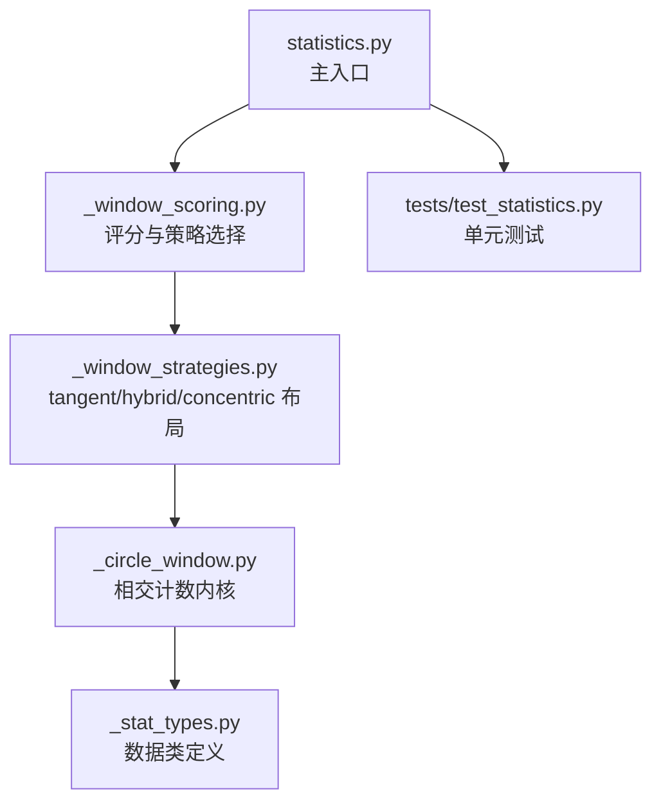
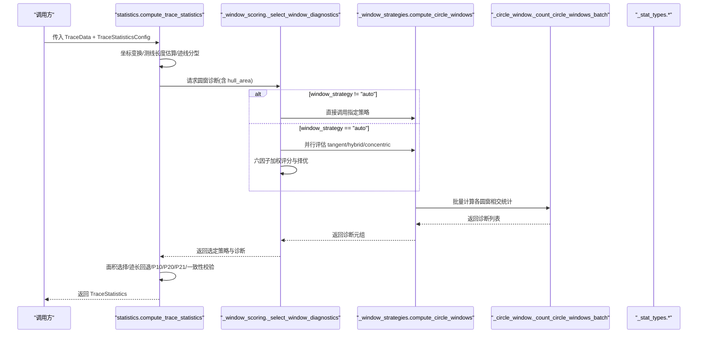
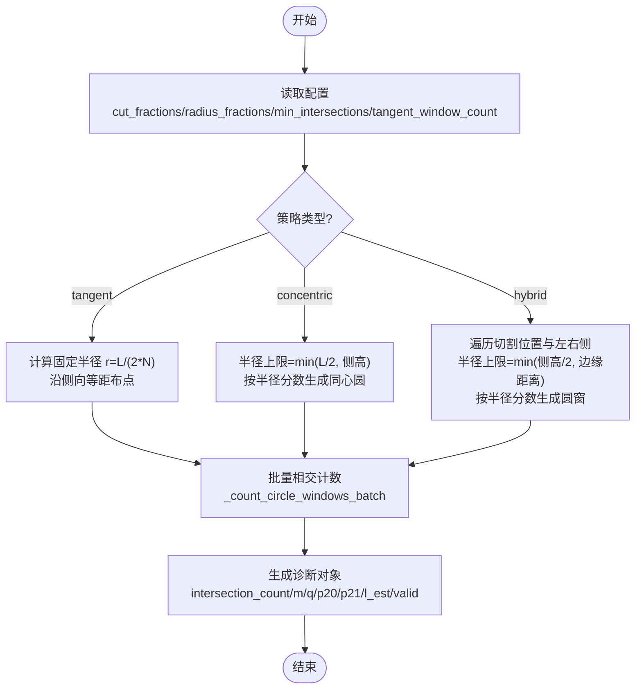
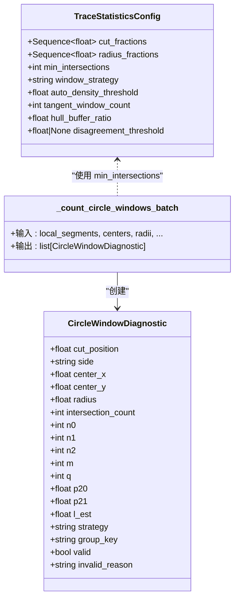
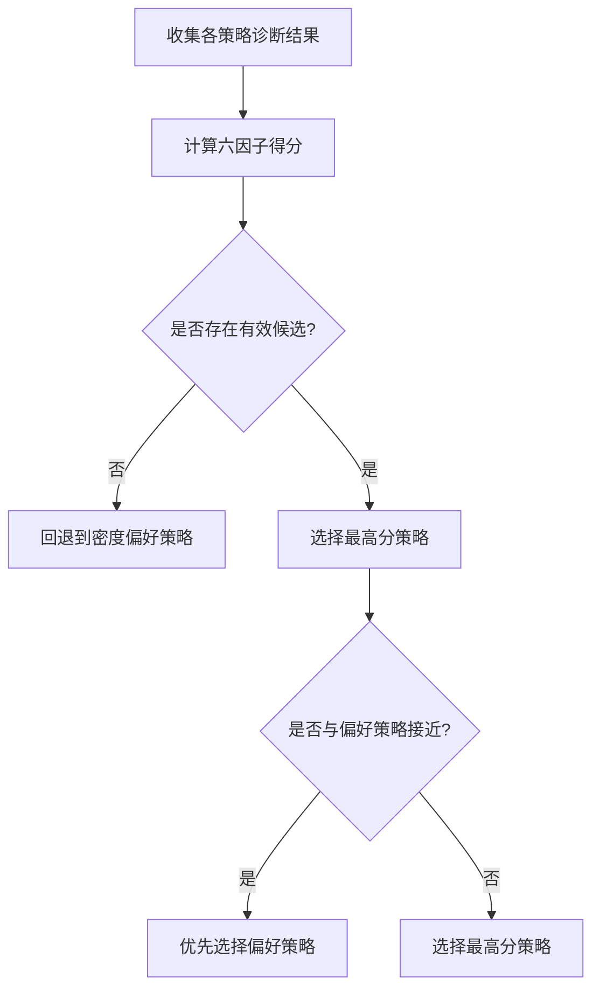

# 固定半径策略

<cite>
**本文引用的文件**   
- [trace_pipeline/geology/_circle_window.py](file://trace_pipeline/geology/_circle_window.py)
- [trace_pipeline/geology/_window_strategies.py](file://trace_pipeline/geology/_window_strategies.py)
- [trace_pipeline/geology/_stat_types.py](file://trace_pipeline/geology/_stat_types.py)
- [trace_pipeline/geology/_window_scoring.py](file://trace_pipeline/geology/_window_scoring.py)
- [trace_pipeline/geology/statistics.py](file://trace_pipeline/geology/statistics.py)
- [tests/test_statistics.py](file://tests/test_statistics.py)
</cite>

## 目录
1. [简介](#简介)
2. [项目结构](#项目结构)
3. [核心组件](#核心组件)
4. [架构总览](#架构总览)
5. [详细组件分析](#详细组件分析)
6. [依赖关系分析](#依赖关系分析)
7. [性能考量](#性能考量)
8. [故障排查指南](#故障排查指南)
9. [结论](#结论)
10. [附录：使用示例与最佳实践](#附录使用示例与最佳实践)

## 简介
本文件围绕“固定半径圆窗策略”展开，系统阐述其实现原理、适用场景、参数配置方法与性能特点，并提供面向统计分析的使用示例与半径选择最佳实践。需要特别说明的是：在当前代码库中并未提供名为 fixed_radius 的策略；但“固定半径”的几何思想已在现有策略中以不同形式落地，例如：
- 切线策略（tangent）：基于测线长度与切线窗口数量计算固定半径，沿侧向等间距布置多个固定半径圆窗。
- 同心策略（concentric）：以测线中心为圆心，按配置的半径分数生成一组固定半径的同心圆窗。
- 混合策略（hybrid）：在多个切割位置与左右两侧分别计算最大可用半径，再乘以半径分数得到一组固定半径圆窗。

上述三种策略均通过统一的批量计数内核进行相交统计与指标估计，从而形成可比较的“固定半径”取样方案。

## 项目结构
与固定半径圆窗相关的核心模块位于 geology 子包内，关键文件职责如下：
- _stat_types.py：定义统计配置、诊断结果与总体统计的数据类。
- _circle_window.py：实现迹线分型与圆窗相交计数的向量化内核。
- _window_strategies.py：实现 tangent/hybrid/concentric 三种策略的布局与分发。
- _window_scoring.py：对多种策略的诊断结果进行评分与自动选择。
- statistics.py：主入口，串联坐标变换、面积选择、P10/P20/P21 计算与一致性校验。
- tests/test_statistics.py：覆盖圆窗计数、分型、面积回退等关键路径的单元测试。

图示来源
- [trace_pipeline/geology/statistics.py:212-391](file://trace_pipeline/geology/statistics.py#L212-L391)
- [trace_pipeline/geology/_window_scoring.py:235-323](file://trace_pipeline/geology/_window_scoring.py#L235-L323)
- [trace_pipeline/geology/_window_strategies.py:173-185](file://trace_pipeline/geology/_window_strategies.py#L173-L185)
- [trace_pipeline/geology/_circle_window.py:71-216](file://trace_pipeline/geology/_circle_window.py#L71-L216)
- [trace_pipeline/geology/_stat_types.py:14-125](file://trace_pipeline/geology/_stat_types.py#L14-L125)
- [tests/test_statistics.py:142-192](file://tests/test_statistics.py#L142-L192)

章节来源
- [trace_pipeline/geology/statistics.py:212-391](file://trace_pipeline/geology/statistics.py#L212-L391)
- [trace_pipeline/geology/_window_scoring.py:235-323](file://trace_pipeline/geology/_window_scoring.py#L235-L323)
- [trace_pipeline/geology/_window_strategies.py:173-185](file://trace_pipeline/geology/_window_strategies.py#L173-L185)
- [trace_pipeline/geology/_circle_window.py:71-216](file://trace_pipeline/geology/_circle_window.py#L71-L216)
- [trace_pipeline/geology/_stat_types.py:14-125](file://trace_pipeline/geology/_stat_types.py#L14-L125)
- [tests/test_statistics.py:142-192](file://tests/test_statistics.py#L142-L192)

## 核心组件
- TraceStatisticsConfig：统一定义圆窗策略相关参数，包括 cut_fractions、radius_fractions、min_intersections、window_strategy、auto_density_threshold、tangent_window_count、hull_buffer_ratio 等，并在构造时完成严格校验。
- CircleWindowDiagnostic：记录单个圆窗的几何信息、相交计数、m/q 统计量、p20/p21/l_est 估计值以及有效性标志与原因。
- _count_circle_windows_batch：向量化批量计算多个圆窗与线段集合的相交情况，并输出诊断对象列表。
- compute_circle_windows：根据 strategy 分发到具体策略函数，返回诊断元组。
- _select_window_diagnostics：当 window_strategy=auto 时，综合评分选择最优策略；否则直接调用指定策略。

章节来源
- [trace_pipeline/geology/_stat_types.py:14-125](file://trace_pipeline/geology/_stat_types.py#L14-L125)
- [trace_pipeline/geology/_circle_window.py:71-216](file://trace_pipeline/geology/_circle_window.py#L71-L216)
- [trace_pipeline/geology/_window_strategies.py:173-185](file://trace_pipeline/geology/_window_strategies.py#L173-L185)
- [trace_pipeline/geology/_window_scoring.py:235-323](file://trace_pipeline/geology/_window_scoring.py#L235-L323)

## 架构总览
下图展示了从输入迹线数据到最终统计结果的端到端流程，突出固定半径圆窗策略在其中的作用位置。

图示来源
- [trace_pipeline/geology/statistics.py:212-391](file://trace_pipeline/geology/statistics.py#L212-L391)
- [trace_pipeline/geology/_window_scoring.py:235-323](file://trace_pipeline/geology/_window_scoring.py#L235-L323)
- [trace_pipeline/geology/_window_strategies.py:173-185](file://trace_pipeline/geology/_window_strategies.py#L173-L185)
- [trace_pipeline/geology/_circle_window.py:71-216](file://trace_pipeline/geology/_circle_window.py#L71-L216)
- [trace_pipeline/geology/_stat_types.py:14-125](file://trace_pipeline/geology/_stat_types.py#L14-L125)

## 详细组件分析

### 固定半径策略的实现原理
- 切线策略（tangent）：依据测线长度与 tangent_window_count 计算固定半径 r = L / (2 * N)，沿左右两侧等间距放置 N 个圆窗，圆心 y 坐标为 ±r，x 坐标随索引递增。若侧向高度不足或半径无效则标记为无效。
- 同心策略（concentric）：以测线中心为圆心，取半径上限为 min(L/2, 侧向高度)，按 radius_fractions 生成一组固定半径的同心圆窗。
- 混合策略（hybrid）：遍历 cut_fractions 确定切割位置，对左右两侧分别计算侧向高度与边缘距离的最小值作为半径上限，再乘以 radius_fractions 得到多组固定半径圆窗。

三者共同点：
- 半径由“固定规则”决定（测线长度、侧向高度、半径分数），不随局部密度自适应变化，属于“固定半径”范式。
- 统一通过 _count_circle_windows_batch 进行向量化相交计数与指标估计。

图示来源
- [trace_pipeline/geology/_window_strategies.py:87-130](file://trace_pipeline/geology/_window_strategies.py#L87-L130)
- [trace_pipeline/geology/_window_strategies.py:132-171](file://trace_pipeline/geology/_window_strategies.py#L132-L171)
- [trace_pipeline/geology/_window_strategies.py:52-85](file://trace_pipeline/geology/_window_strategies.py#L52-L85)
- [trace_pipeline/geology/_circle_window.py:71-216](file://trace_pipeline/geology/_circle_window.py#L71-L216)

章节来源
- [trace_pipeline/geology/_window_strategies.py:87-130](file://trace_pipeline/geology/_window_strategies.py#L87-L130)
- [trace_pipeline/geology/_window_strategies.py:132-171](file://trace_pipeline/geology/_window_strategies.py#L132-L171)
- [trace_pipeline/geology/_window_strategies.py:52-85](file://trace_pipeline/geology/_window_strategies.py#L52-L85)
- [trace_pipeline/geology/_circle_window.py:71-216](file://trace_pipeline/geology/_circle_window.py#L71-L216)

### 圆窗相交计数内核
- 输入：局部坐标系下的线段集、圆心矩阵、半径向量、最少相交数、切割位置、侧向标签、策略与分组键。
- 核心步骤：
  - 广播计算线段端点到各圆心的距离 d1/d2。
  - 计算线段向量与最近点投影 t，得到最近点与圆心距离 dist_to_seg。
  - 判定相交：端点在圆内或最近点距离小于阈值（半径+容差）。
  - 统计 n0/n1/n2，推导 m/q，估计 p20/p21/l_est，并判断有效性。
- 复杂度：O(N×M) 内存与时间（N 为线段数，M 为窗口数），利用 NumPy 广播避免 Python 循环开销。

图示来源
- [trace_pipeline/geology/_circle_window.py:71-216](file://trace_pipeline/geology/_circle_window.py#L71-L216)
- [trace_pipeline/geology/_stat_types.py:67-125](file://trace_pipeline/geology/_stat_types.py#L67-L125)

章节来源
- [trace_pipeline/geology/_circle_window.py:71-216](file://trace_pipeline/geology/_circle_window.py#L71-L216)
- [trace_pipeline/geology/_stat_types.py:67-125](file://trace_pipeline/geology/_stat_types.py#L67-L125)

### 自动策略选择与评分
- 当 window_strategy=auto 时，系统会并行评估 tangent/hybrid/concentric 三种策略，采用六因子加权评分：
  - 有效分组得分权重最高，保证统计可信度前提。
  - 空间覆盖（侧向+沿测线）确保代表性。
  - 稳定性与样本充分性控制方差与可靠性。
  - 半径大小偏好鼓励更大半径带来的代表性提升。
- 若所有策略得分非正或无有效候选，回退到密度偏好策略（通常更保守的 tangent）。

图示来源
- [trace_pipeline/geology/_window_scoring.py:178-206](file://trace_pipeline/geology/_window_scoring.py#L178-L206)
- [trace_pipeline/geology/_window_scoring.py:209-233](file://trace_pipeline/geology/_window_scoring.py#L209-L233)
- [trace_pipeline/geology/_window_scoring.py:235-323](file://trace_pipeline/geology/_window_scoring.py#L235-L323)

章节来源
- [trace_pipeline/geology/_window_scoring.py:178-206](file://trace_pipeline/geology/_window_scoring.py#L178-L206)
- [trace_pipeline/geology/_window_scoring.py:209-233](file://trace_pipeline/geology/_window_scoring.py#L209-L233)
- [trace_pipeline/geology/_window_scoring.py:235-323](file://trace_pipeline/geology/_window_scoring.py#L235-L323)

## 依赖关系分析
- statistics.py 依赖 _window_scoring.py 进行策略选择与聚合，后者依赖 _window_strategies.py 生成圆窗布局，最终由 _circle_window.py 执行相交计数。
- 数据模型集中在 _stat_types.py，贯穿整个流水线。
- 测试用例覆盖圆窗计数、迹线分型、面积回退等关键路径，保障正确性与鲁棒性。

图示来源
- [trace_pipeline/geology/statistics.py:212-391](file://trace_pipeline/geology/statistics.py#L212-L391)
- [trace_pipeline/geology/_window_scoring.py:235-323](file://trace_pipeline/geology/_window_scoring.py#L235-L323)
- [trace_pipeline/geology/_window_strategies.py:173-185](file://trace_pipeline/geology/_window_strategies.py#L173-L185)
- [trace_pipeline/geology/_circle_window.py:71-216](file://trace_pipeline/geology/_circle_window.py#L71-L216)
- [trace_pipeline/geology/_stat_types.py:14-125](file://trace_pipeline/geology/_stat_types.py#L14-L125)
- [tests/test_statistics.py:142-192](file://tests/test_statistics.py#L142-L192)

章节来源
- [trace_pipeline/geology/statistics.py:212-391](file://trace_pipeline/geology/statistics.py#L212-L391)
- [trace_pipeline/geology/_window_scoring.py:235-323](file://trace_pipeline/geology/_window_scoring.py#L235-L323)
- [trace_pipeline/geology/_window_strategies.py:173-185](file://trace_pipeline/geology/_window_strategies.py#L173-L185)
- [trace_pipeline/geology/_circle_window.py:71-216](file://trace_pipeline/geology/_circle_window.py#L71-L216)
- [trace_pipeline/geology/_stat_types.py:14-125](file://trace_pipeline/geology/_stat_types.py#L14-L125)
- [tests/test_statistics.py:142-192](file://tests/test_statistics.py#L142-L192)

## 性能考量
- 向量化相交计数：通过广播一次性计算 N×M 的距离矩阵，显著降低 Python 层循环开销。
- 批量处理：同一批次的圆窗共享数据结构，减少重复计算与内存分配。
- 复杂度与内存：时间与空间复杂度均为 O(N×M)，在 M 较大时需关注内存占用。
- 数值稳定性：使用小容差 _EPS 避免除零与退化情形，提高鲁棒性。

章节来源
- [trace_pipeline/geology/_circle_window.py:71-216](file://trace_pipeline/geology/_circle_window.py#L71-L216)
- [trace_pipeline/geology/_stat_types.py:11-11](file://trace_pipeline/geology/_stat_types.py#L11-L11)

## 故障排查指南
- 无效窗口常见原因：
  - 相交迹线数不足：检查 min_intersections 是否过高或数据稀疏。
  - 侧向高度不足：调整 cut_fractions 或增大测线长度，或改用 tangent/concentric 策略。
  - 半径无效：确认 tangent_window_count 与测线长度匹配，避免过小半径导致数值不稳定。
- 一致性告警：
  - 主 P20/P21 与圆窗估计差异过大时，检查面积来源与缓冲比例，必要时调整 hull_buffer_ratio 或手动指定 window_strategy。
- 调试建议：
  - 查看 diagnostics 中的 invalid_reason 与 valid 字段定位问题。
  - 使用测试用例中的构造方法快速复现边界条件。

章节来源
- [trace_pipeline/geology/_circle_window.py:219-249](file://trace_pipeline/geology/_circle_window.py#L219-L249)
- [trace_pipeline/geology/statistics.py:313-336](file://trace_pipeline/geology/statistics.py#L313-L336)
- [tests/test_statistics.py:179-192](file://tests/test_statistics.py#L179-L192)

## 结论
固定半径圆窗策略通过明确的几何规则生成稳定、可解释的取样窗口，适用于需要对空间代表性、稳定性与样本充分性进行权衡的场景。当前代码库虽未提供名为 fixed_radius 的策略，但 tangent/hybrid/concentric 三类策略均以固定半径为核心思想，并通过统一内核高效实现。结合自动评分机制，可在不同数据条件下稳健选择最优策略，获得可靠的 P10/P20/P21 估计。

## 附录：使用示例与最佳实践

### 使用示例（概念性步骤）
- 准备 TraceData：包含端点坐标、测线方位角、可选的实测长度与面积等。
- 配置 TraceStatisticsConfig：设置 window_strategy（如 "tangent"/"concentric"/"hybrid"）、radius_fractions、min_intersections、tangent_window_count 等。
- 调用 compute_trace_statistics：获取 TraceStatistics，其中 diagnostics 包含各圆窗的诊断详情。
- 解读结果：关注 valid_window_count、p20_source、p21_source 与 window_validation_warning。

参考路径
- [trace_pipeline/geology/statistics.py:212-391](file://trace_pipeline/geology/statistics.py#L212-L391)
- [trace_pipeline/geology/_stat_types.py:14-125](file://trace_pipeline/geology/_stat_types.py#L14-L125)
- [tests/test_statistics.py:34-57](file://tests/test_statistics.py#L34-L57)

### 半径选择的最佳实践与注意事项
- tangent 策略：
  - 合理设置 tangent_window_count，使半径与测线长度匹配，避免过小半径导致数值不稳定。
  - 注意侧向高度限制，若高度不足将产生无效窗口。
- concentric 策略：
  - 半径上限受限于测线半长与侧向高度，radius_fractions 应反映期望的相对尺度。
- hybrid 策略：
  - 通过 cut_fractions 控制沿测线的分布，radius_fractions 控制相对半径，兼顾空间覆盖与代表性。
- 通用建议：
  - min_intersections 不宜过高，以免大量窗口被判定无效。
  - 在低密度区域倾向 tangent，在高密度区域可考虑 concentric 或 hybrid。
  - 结合自动评分与一致性告警，动态调整策略与参数。

参考路径
- [trace_pipeline/geology/_window_strategies.py:87-130](file://trace_pipeline/geology/_window_strategies.py#L87-L130)
- [trace_pipeline/geology/_window_strategies.py:132-171](file://trace_pipeline/geology/_window_strategies.py#L132-L171)
- [trace_pipeline/geology/_window_strategies.py:52-85](file://trace_pipeline/geology/_window_strategies.py#L52-L85)
- [trace_pipeline/geology/_stat_types.py:14-64](file://trace_pipeline/geology/_stat_types.py#L14-L64)
- [trace_pipeline/geology/_window_scoring.py:209-233](file://trace_pipeline/geology/_window_scoring.py#L209-L233)