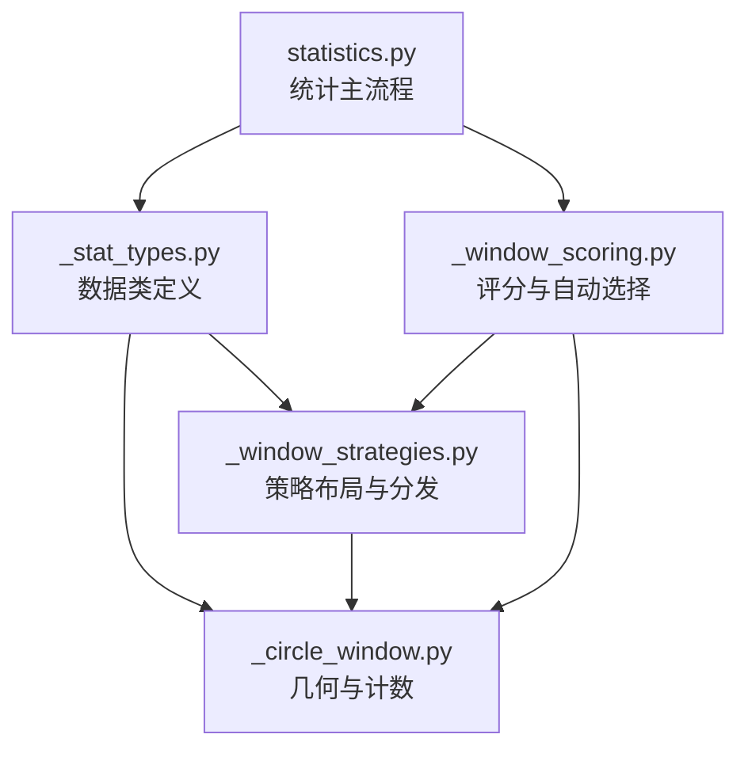
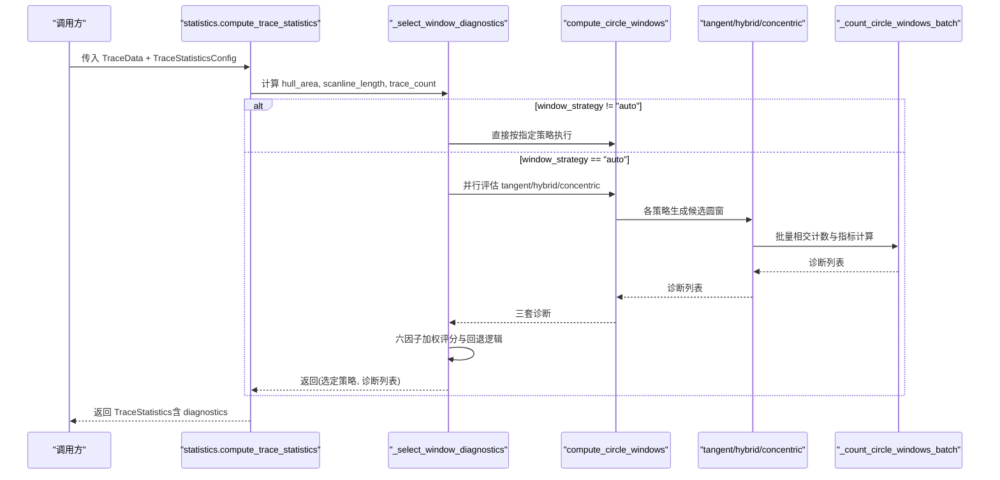
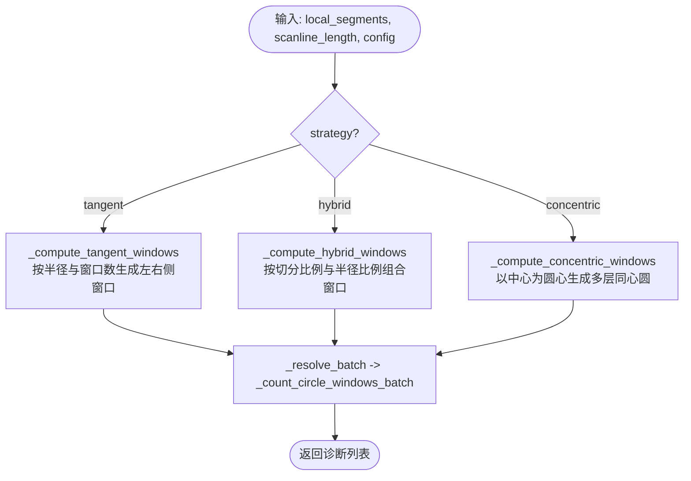
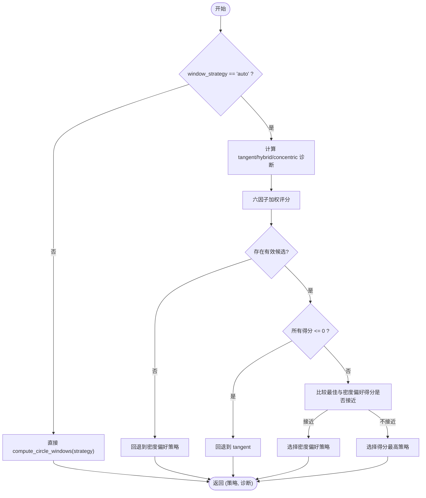
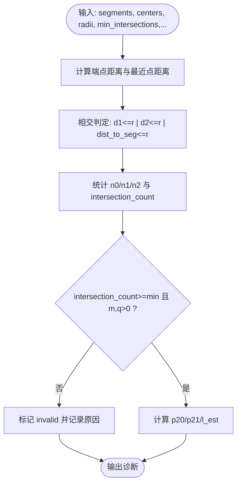
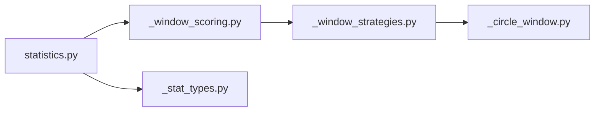

# 圆窗策略API

<cite>
**本文引用的文件**   
- [trace_pipeline/geology/_stat_types.py](file://trace_pipeline/geology/_stat_types.py)
- [trace_pipeline/geology/_circle_window.py](file://trace_pipeline/geology/_circle_window.py)
- [trace_pipeline/geology/_window_strategies.py](file://trace_pipeline/geology/_window_strategies.py)
- [trace_pipeline/geology/_window_scoring.py](file://trace_pipeline/geology/_window_scoring.py)
- [trace_pipeline/geology/statistics.py](file://trace_pipeline/geology/statistics.py)
- [tests/test_statistics.py](file://tests/test_statistics.py)
</cite>

## 目录
1. [简介](#简介)
2. [项目结构](#项目结构)
3. [核心组件](#核心组件)
4. [架构总览](#架构总览)
5. [详细组件分析](#详细组件分析)
6. [依赖关系分析](#依赖关系分析)
7. [性能考量](#性能考量)
8. [故障排查指南](#故障排查指南)
9. [结论](#结论)
10. [附录](#附录)

## 简介
本指南聚焦于“圆窗策略API”，围绕圆形取样窗的布局、计数与评分机制，系统阐述：
- 三种内置策略（tangent、hybrid、concentric）的实现原理与适用场景
- _select_window_diagnostics 的策略选择逻辑与六因子加权评分机制
- CircleWindowDiagnostic 数据结构的使用方法与诊断信息解读
- 参数配置要点与不同策略的性能对比建议

说明：仓库中未出现 fixed_radius、adaptive_radius、adaptive_area、adaptive_count 四种命名。当前实现提供 tangent、hybrid、concentric 三种策略，以及 auto 自动选择模式。若需扩展为固定半径或自适应面积/数量等策略，可参考现有接口进行二次开发。

## 项目结构
与圆窗策略相关的核心代码位于 geology 子包内，分层清晰：
- 数据类型定义：_stat_types.py
- 圆窗几何与批量计数：_circle_window.py
- 策略布局与分发：_window_strategies.py
- 评分与自动策略选择：_window_scoring.py
- 统计主流程集成：statistics.py
- 测试用例：tests/test_statistics.py

图表来源
- [trace_pipeline/geology/_stat_types.py:14-125](file://trace_pipeline/geology/_stat_types.py#L14-L125)
- [trace_pipeline/geology/_circle_window.py:71-216](file://trace_pipeline/geology/_circle_window.py#L71-L216)
- [trace_pipeline/geology/_window_strategies.py:172-185](file://trace_pipeline/geology/_window_strategies.py#L172-L185)
- [trace_pipeline/geology/_window_scoring.py:235-323](file://trace_pipeline/geology/_window_scoring.py#L235-L323)
- [trace_pipeline/geology/statistics.py:212-391](file://trace_pipeline/geology/statistics.py#L212-L391)

章节来源
- [trace_pipeline/geology/_stat_types.py:14-125](file://trace_pipeline/geology/_stat_types.py#L14-L125)
- [trace_pipeline/geology/_circle_window.py:71-216](file://trace_pipeline/geology/_circle_window.py#L71-L216)
- [trace_pipeline/geology/_window_strategies.py:172-185](file://trace_pipeline/geology/_window_strategies.py#L172-L185)
- [trace_pipeline/geology/_window_scoring.py:235-323](file://trace_pipeline/geology/_window_scoring.py#L235-L323)
- [trace_pipeline/geology/statistics.py:212-391](file://trace_pipeline/geology/statistics.py#L212-L391)

## 核心组件
- TraceStatisticsConfig：统一定义圆窗策略与相关阈值、窗口数量、密度阈值等参数，并提供严格校验。
- CircleWindowDiagnostic：单个圆窗的诊断结果，包含相交计数、端点分布、面密度与长度密度估计、有效性标志及原因。
- compute_circle_windows：按指定策略生成一组圆窗并返回诊断列表。
- _select_window_diagnostics：在 auto 模式下对 tangent/hybrid/concentric 三套候选进行评分并选择最佳策略；非 auto 时直接调用 compute_circle_windows。

章节来源
- [trace_pipeline/geology/_stat_types.py:14-125](file://trace_pipeline/geology/_stat_types.py#L14-L125)
- [trace_pipeline/geology/_window_strategies.py:172-185](file://trace_pipeline/geology/_window_strategies.py#L172-L185)
- [trace_pipeline/geology/_window_scoring.py:235-323](file://trace_pipeline/geology/_window_scoring.py#L235-L323)

## 架构总览
下图展示从主统计入口到策略选择与执行的完整调用链。

图表来源
- [trace_pipeline/geology/statistics.py:212-391](file://trace_pipeline/geology/statistics.py#L212-L391)
- [trace_pipeline/geology/_window_scoring.py:235-323](file://trace_pipeline/geology/_window_scoring.py#L235-L323)
- [trace_pipeline/geology/_window_strategies.py:172-185](file://trace_pipeline/geology/_window_strategies.py#L172-L185)
- [trace_pipeline/geology/_circle_window.py:71-216](file://trace_pipeline/geology/_circle_window.py#L71-L216)

## 详细组件分析

### 一、CircleWindowDiagnostic 数据结构与使用
- 字段含义
  - cut_position/side：切分位置与侧向（left/right/center），用于空间覆盖评分
  - center_x/center_y/radius：圆心坐标与半径
  - intersection_count/n0/n1/n2/m/q：相交迹线数与端点分布统计量
  - p20/p21/l_est：面密度、长度密度与平均迹长估计
  - strategy/group_key：策略名与分组键，便于聚合评分
  - valid/invalid_reason：有效性标志与失效原因
- 使用方法
  - 通过 statistics.compute_trace_statistics 返回的 TraceStatistics.diagnostics 获取
  - 可按 group_key 聚合同一策略下的有效窗口，计算均值/方差以评估稳定性
  - 结合 invalid_reason 定位失败原因（如“相交迹线数不足”“可用侧向高度不足”等）

章节来源
- [trace_pipeline/geology/_stat_types.py:67-89](file://trace_pipeline/geology/_stat_types.py#L67-L89)
- [trace_pipeline/geology/_circle_window.py:193-216](file://trace_pipeline/geology/_circle_window.py#L193-L216)
- [trace_pipeline/geology/statistics.py:358-391](file://trace_pipeline/geology/statistics.py#L358-L391)

### 二、策略布局与分发（tangent / hybrid / concentric）
- tangent（相切式）
  - 基于测线长度与 tangent_window_count 推导半径，沿测线方向等间距放置多个窗口，左右两侧分别布置
  - 适用于低密度或需要稳定采样位置的场景
- hybrid（混合式）
  - 遍历 cut_fractions 与 radius_fractions，在左右两侧组合出多组候选窗口
  - 适合中等密度、需要兼顾空间覆盖与样本量的场景
- concentric（同心式）
  - 以测线中心为圆心，按 radius_fractions 生成多层同心圆
  - 适合高密度、希望最大化利用局部密度的场景

图表来源
- [trace_pipeline/geology/_window_strategies.py:52-185](file://trace_pipeline/geology/_window_strategies.py#L52-L185)
- [trace_pipeline/geology/_circle_window.py:71-216](file://trace_pipeline/geology/_circle_window.py#L71-L216)

章节来源
- [trace_pipeline/geology/_window_strategies.py:52-185](file://trace_pipeline/geology/_window_strategies.py#L52-L185)
- [trace_pipeline/geology/_circle_window.py:71-216](file://trace_pipeline/geology/_circle_window.py#L71-L216)

### 三、_select_window_diagnostics 策略选择与评分机制
- 选择流程
  - 若 window_strategy 非 auto：直接调用 compute_circle_windows 返回对应策略的诊断
  - 若为 auto：并行计算 tangent/hybrid/concentric 三套诊断，再依据六因子加权评分选择最佳策略
- 六因子加权评分
  - 有效分组得分（权重最高）：保证统计可信度前提
  - 有效分组占比：衡量策略产出质量
  - 空间覆盖：侧向覆盖（左/右/中心）与沿测线覆盖（前/中/后三段）
  - 稳定性：l_est/p20/p21 在各分组内的变异系数倒数
  - 半径大小：中位数半径相对最大半径的比例
  - 样本充分性：相交迹线数相对目标值（min_intersections 的两倍）的满足程度
- 回退与平局处理
  - 若无任何有效候选：回退到密度偏好策略（根据 rough_density 与 expected_intersections 判断）
  - 若所有得分非正：回退到最保守策略 tangent
  - 当最佳策略与密度偏好策略得分接近（容差）：优先密度偏好策略

图表来源
- [trace_pipeline/geology/_window_scoring.py:235-323](file://trace_pipeline/geology/_window_scoring.py#L235-L323)
- [trace_pipeline/geology/_window_scoring.py:178-206](file://trace_pipeline/geology/_window_scoring.py#L178-L206)
- [trace_pipeline/geology/_window_scoring.py:209-233](file://trace_pipeline/geology/_window_scoring.py#L209-L233)

章节来源
- [trace_pipeline/geology/_window_scoring.py:235-323](file://trace_pipeline/geology/_window_scoring.py#L235-L323)
- [trace_pipeline/geology/_window_scoring.py:178-206](file://trace_pipeline/geology/_window_scoring.py#L178-L206)
- [trace_pipeline/geology/_window_scoring.py:209-233](file://trace_pipeline/geology/_window_scoring.py#L209-L233)

### 四、批量相交计数与指标计算（_count_circle_windows_batch）
- 向量化广播：一次性计算 N 条线段到 M 个圆心的距离矩阵，避免多次 Python 函数调用开销
- 相交判定：端点距离或最近点到线段距离小于等于半径（带小量容差）
- 统计量：n0/n1/n2 → m/q → p20/p21/l_est
- 无效窗口：当相交迹线数不足或 m/q 不合法时标记 invalid 并记录原因

图表来源
- [trace_pipeline/geology/_circle_window.py:71-216](file://trace_pipeline/geology/_circle_window.py#L71-L216)

章节来源
- [trace_pipeline/geology/_circle_window.py:71-216](file://trace_pipeline/geology/_circle_window.py#L71-L216)

### 五、参数配置与适用场景
- TraceStatisticsConfig 关键参数
  - cut_fractions：切分比例序列（用于 hybrid 策略）
  - radius_fractions：半径比例序列（用于 hybrid/concentric）
  - min_intersections：最少相交迹线数（影响有效性判定与样本充分性评分）
  - window_strategy：auto/tangent/hybrid/concentric
  - auto_density_threshold：自动密度阈值（影响密度偏好策略选择）
  - tangent_window_count：tangent 策略的窗口个数
  - hull_buffer_ratio：缓冲凸包面积时的缓冲比例（与面积选择相关）
- 适用场景建议
  - tangent：低密度、需要稳定位置与较少窗口数量的场景
  - hybrid：中等密度、需要兼顾空间覆盖与样本量的场景
  - concentric：高密度、希望充分利用局部密度的场景
  - auto：不确定密度时，让系统自动选择并给出评分依据

章节来源
- [trace_pipeline/geology/_stat_types.py:14-65](file://trace_pipeline/geology/_stat_types.py#L14-L65)
- [trace_pipeline/geology/_window_scoring.py:209-233](file://trace_pipeline/geology/_window_scoring.py#L209-L233)

### 六、性能对比与分析
- 计算复杂度
  - _count_circle_windows_batch 采用广播矩阵运算，时间复杂度近似 O(N×M)，其中 N 为线段数，M 为窗口数
  - tangent 策略通常产生固定数量的窗口（与 tangent_window_count 线性相关）
  - hybrid 策略窗口数量为 len(cut_fractions) × len(radius_fractions) × 2（左右侧）
  - concentric 策略窗口数量为 len(radius_fractions)
- 内存占用
  - 主要消耗在距离矩阵与中间广播数组，M 较大时需关注内存峰值
- 优化建议
  - 合理设置 radius_fractions 与 cut_fractions，避免过多候选窗口
  - 在 auto 模式下，若数据规模大，可适当增大 min_intersections 以减少无效窗口数量
  - 对于极高密度场景，优先考虑 concentric 策略以降低窗口总数

章节来源
- [trace_pipeline/geology/_circle_window.py:71-216](file://trace_pipeline/geology/_circle_window.py#L71-L216)
- [trace_pipeline/geology/_window_strategies.py:52-185](file://trace_pipeline/geology/_window_strategies.py#L52-L185)

## 依赖关系分析
- 模块耦合
  - statistics.py 作为主入口，依赖 _window_scoring 与 _stat_types
  - _window_scoring 依赖 _window_strategies 与 _circle_window
  - _window_strategies 依赖 _circle_window 的几何与计数能力
- 外部依赖
  - numpy 用于向量化计算
  - logging 用于调试与回退日志

图表来源
- [trace_pipeline/geology/statistics.py:212-391](file://trace_pipeline/geology/statistics.py#L212-L391)
- [trace_pipeline/geology/_window_scoring.py:235-323](file://trace_pipeline/geology/_window_scoring.py#L235-L323)
- [trace_pipeline/geology/_window_strategies.py:172-185](file://trace_pipeline/geology/_window_strategies.py#L172-L185)
- [trace_pipeline/geology/_circle_window.py:71-216](file://trace_pipeline/geology/_circle_window.py#L71-L216)
- [trace_pipeline/geology/_stat_types.py:14-125](file://trace_pipeline/geology/_stat_types.py#L14-L125)

章节来源
- [trace_pipeline/geology/statistics.py:212-391](file://trace_pipeline/geology/statistics.py#L212-L391)
- [trace_pipeline/geology/_window_scoring.py:235-323](file://trace_pipeline/geology/_window_scoring.py#L235-L323)
- [trace_pipeline/geology/_window_strategies.py:172-185](file://trace_pipeline/geology/_window_strategies.py#L172-L185)
- [trace_pipeline/geology/_circle_window.py:71-216](file://trace_pipeline/geology/_circle_window.py#L71-L216)
- [trace_pipeline/geology/_stat_types.py:14-125](file://trace_pipeline/geology/_stat_types.py#L14-L125)

## 性能考量
- 向量化设计显著降低 Python 层循环开销，适合大规模线段与窗口组合
- 合理控制候选窗口数量，避免 M 过大导致内存压力
- 在 auto 模式下，评分计算涉及多次聚合与统计，建议在大数据集上缓存中间结果或减少 radius_fractions/cut_fractions 的数量

[本节为通用指导，无需特定文件引用]

## 故障排查指南
- 常见无效原因
  - “相交迹线数不足”：提高 min_intersections 或调整策略/参数
  - “可用侧向高度不足”：检查数据范围与 tangent_window_count
  - “测线长度不足”：确保 scanline_length 有效且大于阈值
- 诊断信息解读
  - 查看 invalid_reason 快速定位问题
  - 观察 valid 标志与 intersection_count，确认样本量是否达标
  - 通过 group_key 聚合同策略下有效窗口，评估稳定性与一致性
- 日志与回退
  - auto 模式会记录评分与回退决策，便于审计与调参

章节来源
- [trace_pipeline/geology/_circle_window.py:219-249](file://trace_pipeline/geology/_circle_window.py#L219-L249)
- [trace_pipeline/geology/_window_scoring.py:288-323](file://trace_pipeline/geology/_window_scoring.py#L288-L323)
- [tests/test_statistics.py:214-251](file://tests/test_statistics.py#L214-L251)

## 结论
- 当前 API 提供 tangent/hybrid/concentric 三种策略与 auto 自动选择，具备完善的评分与回退机制
- CircleWindowDiagnostic 提供了丰富的诊断字段，便于用户理解与调优
- 向量化实现保证了较好的性能表现，但需注意候选窗口数量对内存的影响
- 若需 fixed_radius/adaptive_radius/adaptive_area/adaptive_count 等策略，可在现有 compute_circle_windows 基础上扩展布局逻辑，复用评分与选择框架

[本节为总结性内容，无需特定文件引用]

## 附录
- 使用示例路径
  - 策略选择测试：[tests/test_statistics.py:214-251](file://tests/test_statistics.py#L214-L251)
  - 主统计入口与集成：[trace_pipeline/geology/statistics.py:212-391](file://trace_pipeline/geology/statistics.py#L212-L391)
  - 数据类定义：[trace_pipeline/geology/_stat_types.py:14-125](file://trace_pipeline/geology/_stat_types.py#L14-L125)
  - 策略布局与分发：[trace_pipeline/geology/_window_strategies.py:52-185](file://trace_pipeline/geology/_window_strategies.py#L52-L185)
  - 评分与自动选择：[trace_pipeline/geology/_window_scoring.py:235-323](file://trace_pipeline/geology/_window_scoring.py#L235-L323)
  - 批量相交计数：[trace_pipeline/geology/_circle_window.py:71-216](file://trace_pipeline/geology/_circle_window.py#L71-L216)