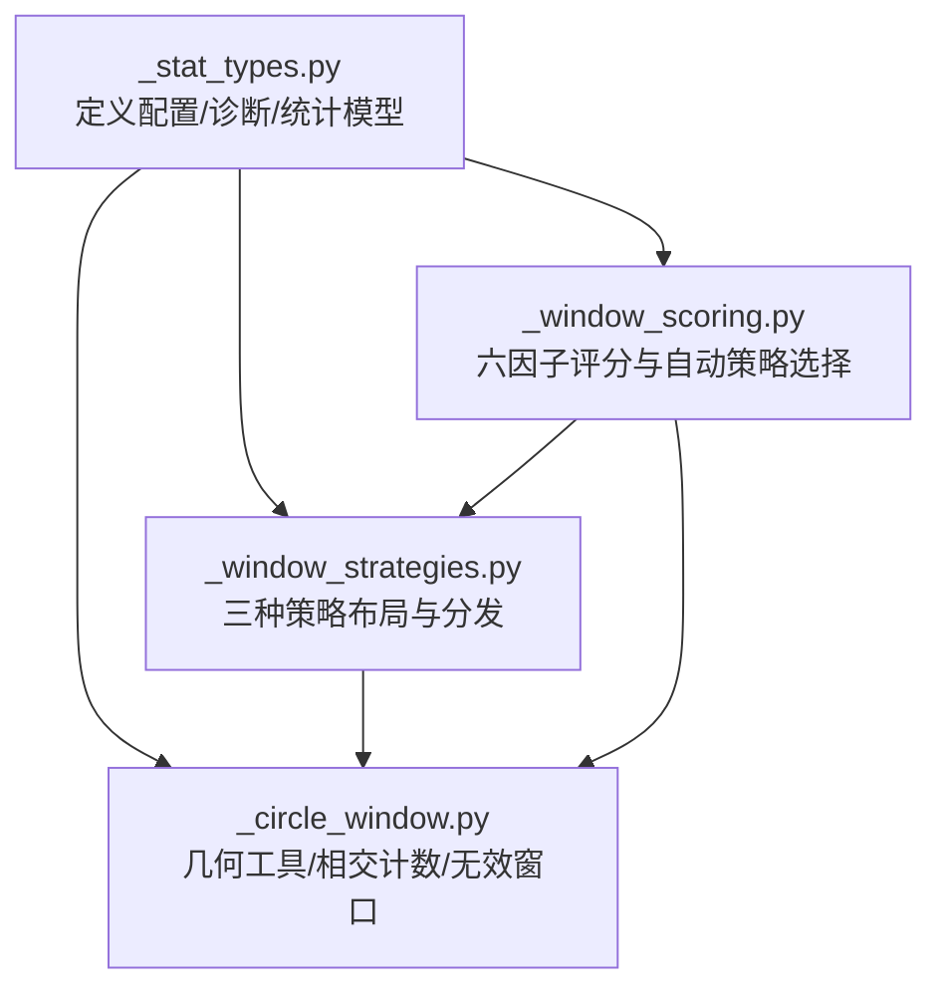
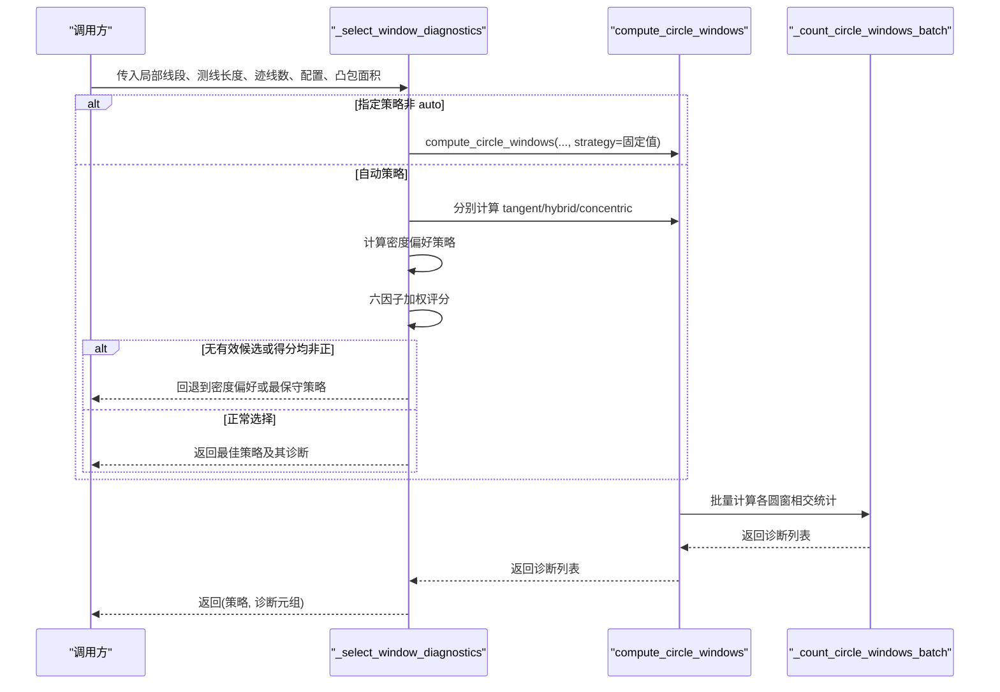
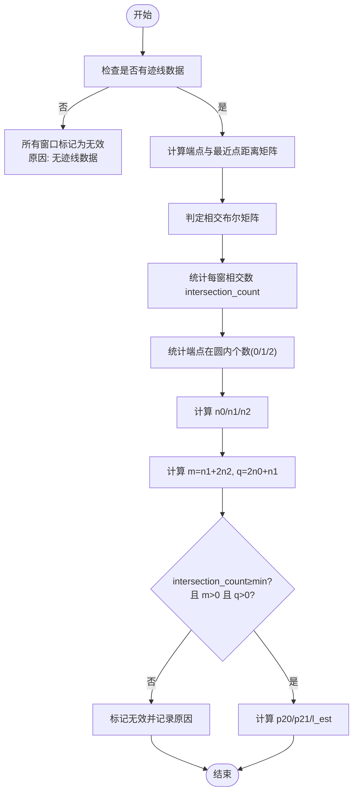
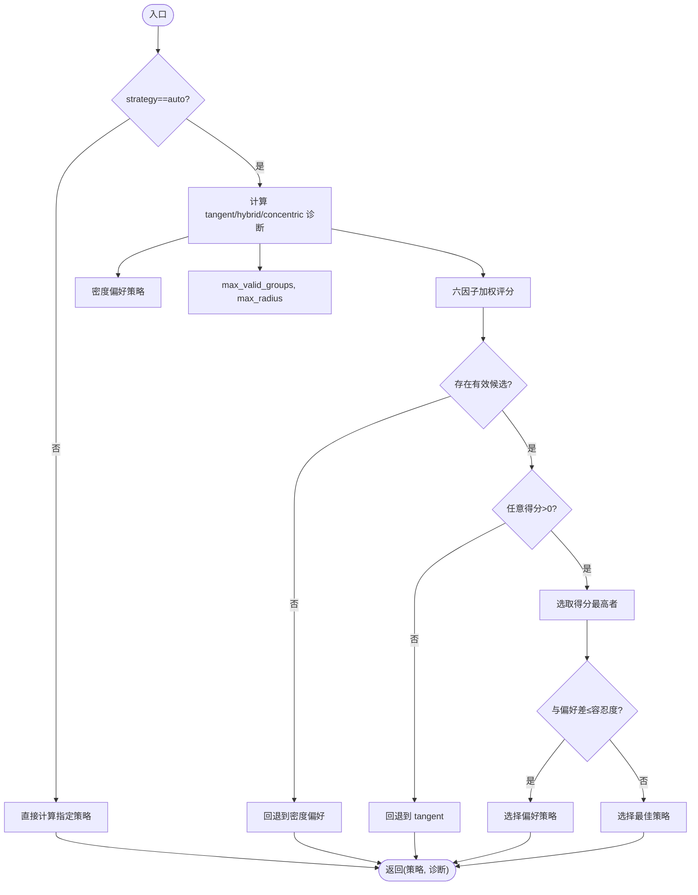
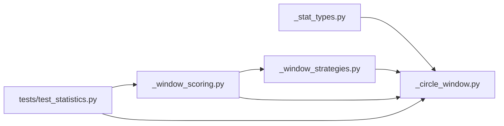

# 窗口诊断系统

<cite>
**本文引用的文件**   
- [trace_pipeline/geology/_stat_types.py](file://trace_pipeline/geology/_stat_types.py)
- [trace_pipeline/geology/_circle_window.py](file://trace_pipeline/geology/_circle_window.py)
- [trace_pipeline/geology/_window_strategies.py](file://trace_pipeline/geology/_window_strategies.py)
- [trace_pipeline/geology/_window_scoring.py](file://trace_pipeline/geology/_window_scoring.py)
- [tests/test_statistics.py](file://tests/test_statistics.py)
</cite>

## 目录
1. [简介](#简介)
2. [项目结构](#项目结构)
3. [核心组件](#核心组件)
4. [架构总览](#架构总览)
5. [详细组件分析](#详细组件分析)
6. [依赖关系分析](#依赖关系分析)
7. [性能考量](#性能考量)
8. [故障排查指南](#故障排查指南)
9. [结论](#结论)
10. [附录：诊断输出解读与示例](#附录：诊断输出解读与示例)

## 简介
本文件面向“圆窗诊断系统”，聚焦以下目标：
- 深入解释 CircleWindowDiagnostic 数据结构各字段含义、计算来源与使用方式。
- 详解 _select_window_diagnostics 的诊断逻辑与评分机制，包括自动策略选择流程。
- 提供诊断信息的解读指南：有效性判断、错误原因分析与结果质量评估。
- 给出实际诊断输出示例与分析方法（以测试用例为参考）。

该系统通过三种圆窗策略（切线式 tangent、混合式 hybrid、同心式 concentric）对迹线数据进行采样统计，并以六因子加权评分自动选择最优策略，最终输出每个圆窗的诊断记录与总体统计指标。

## 项目结构
围绕圆窗诊断的核心代码位于 geology 子包中，主要文件职责如下：
- _stat_types.py：定义配置 TraceStatisticsConfig、诊断数据 CircleWindowDiagnostic 与统计结果 TraceStatistics。
- _circle_window.py：实现迹线分型、圆窗相交计数、无效窗口构造等几何与统计核心。
- _window_strategies.py：按策略生成圆窗布局并批量计算诊断。
- _window_scoring.py：基于六因子加权评分自动选择最佳策略。

图表来源
- [trace_pipeline/geology/_stat_types.py:1-125](file://trace_pipeline/geology/_stat_types.py#L1-L125)
- [trace_pipeline/geology/_circle_window.py:1-269](file://trace_pipeline/geology/_circle_window.py#L1-L269)
- [trace_pipeline/geology/_window_strategies.py:1-185](file://trace_pipeline/geology/_window_strategies.py#L1-L185)
- [trace_pipeline/geology/_window_scoring.py:1-323](file://trace_pipeline/geology/_window_scoring.py#L1-L323)

章节来源
- [trace_pipeline/geology/_stat_types.py:1-125](file://trace_pipeline/geology/_stat_types.py#L1-L125)
- [trace_pipeline/geology/_circle_window.py:1-269](file://trace_pipeline/geology/_circle_window.py#L1-L269)
- [trace_pipeline/geology/_window_strategies.py:1-185](file://trace_pipeline/geology/_window_strategies.py#L1-L185)
- [trace_pipeline/geology/_window_scoring.py:1-323](file://trace_pipeline/geology/_window_scoring.py#L1-L323)

## 核心组件
- CircleWindowDiagnostic：单个圆形取样窗的计数与有效性诊断记录，包含位置、半径、相交统计、密度估计、策略与分组键、有效性标志及失效原因等。
- TraceStatisticsConfig：控制圆窗采样与评分的参数集合，如 cut_fractions、radius_fractions、min_intersections、window_strategy、auto_density_threshold、tangent_window_count、hull_buffer_ratio 等。
- TraceStatistics：整条测线的统计汇总，包含 p10/p20/p21、平均迹长、面积来源、所选策略、诊断列表等。

关键要点
- CircleWindowDiagnostic.valid 表示该窗是否满足最小相交数与 m/q 正性条件；invalid_reason 描述失败原因。
- p20、p21、l_est 在有效时由 n0/n1/n2 与半径推导得到；否则为 NaN。
- group_key 用于将同一策略下的多个窗进行分组聚合，便于稳定性与覆盖度评分。

章节来源
- [trace_pipeline/geology/_stat_types.py:14-88](file://trace_pipeline/geology/_stat_types.py#L14-L88)
- [trace_pipeline/geology/_stat_types.py:91-125](file://trace_pipeline/geology/_stat_types.py#L91-L125)

## 架构总览
下图展示了从输入到输出的整体流程：策略选择 → 布局生成 → 相交计数 → 评分与回退 → 输出诊断。

图表来源
- [trace_pipeline/geology/_window_scoring.py:235-323](file://trace_pipeline/geology/_window_scoring.py#L235-L323)
- [trace_pipeline/geology/_window_strategies.py:173-185](file://trace_pipeline/geology/_window_strategies.py#L173-L185)
- [trace_pipeline/geology/_circle_window.py:71-216](file://trace_pipeline/geology/_circle_window.py#L71-L216)

## 详细组件分析

### CircleWindowDiagnostic 数据结构与字段说明
- cut_position：圆窗中心沿测线的 x 坐标（切割位置）。
- side：侧向标识，left/right/center。
- center_x / center_y：圆心坐标。
- radius：圆半径。
- intersection_count：与该圆相交的迹线数量。
- n0：两端点均在圆外的相交迹线数。
- n1：一端在圆内的相交迹线数。
- n2：两端均在圆内的相交迹线数。
- m = n1 + 2*n2：累计长度相关计数。
- q = 2*n0 + n1：端点对数相关计数。
- p20：面密度估计（仅当有效时），q/(2πr²)。
- p21：累计长度密度估计（仅当有效时），m/(4r)。
- l_est：平均迹长估计（仅当有效时），πr/2 * (m/q)。
- strategy：所属策略名（tangent/hybrid/concentric）。
- group_key：分组键，用于同策略下多窗聚合。
- valid：是否有效（满足 min_intersections 且 m>0、q>0）。
- invalid_reason：失效原因文本。

计算来源
- 相交计数与 n0/n1/n2/m/q 来自批量相交判定与端点内外判断。
- p20/p21/l_est 仅在有效时由上述计数与半径推导。
- valid 与 invalid_reason 由相交数阈值与 m/q 正性决定。

章节来源
- [trace_pipeline/geology/_stat_types.py:67-88](file://trace_pipeline/geology/_stat_types.py#L67-L88)
- [trace_pipeline/geology/_circle_window.py:159-216](file://trace_pipeline/geology/_circle_window.py#L159-L216)
- [trace_pipeline/geology/_circle_window.py:219-249](file://trace_pipeline/geology/_circle_window.py#L219-L249)

### 圆窗策略与布局
- tangent（切线式）：根据测线长度与 tangent_window_count 确定半径，左右两侧滑动放置若干窗口。
- hybrid（混合式）：按 cut_fractions 选取切割位置，结合左右侧可用高度与端部距离限制，再按 radius_fractions 生成多半径窗口。
- concentric（同心式）：以测线中点为中心，按 radius_fractions 生成不同半径的同心圆。

布局生成后统一进入批量相交计数流程。

章节来源
- [trace_pipeline/geology/_window_strategies.py:52-84](file://trace_pipeline/geology/_window_strategies.py#L52-L84)
- [trace_pipeline/geology/_window_strategies.py:87-129](file://trace_pipeline/geology/_window_strategies.py#L87-L129)
- [trace_pipeline/geology/_window_strategies.py:132-170](file://trace_pipeline/geology/_window_strategies.py#L132-L170)
- [trace_pipeline/geology/_window_strategies.py:173-185](file://trace_pipeline/geology/_window_strategies.py#L173-L185)

### 相交计数与有效性判定
- 批量相交判定采用广播矩阵计算，同时考虑端点距离与线段到圆心最近点距离。
- 有效性条件：intersection_count ≥ min_intersections，且 m>0、q>0。
- 无效情况会设置 invalid_reason 并置对应统计量为 NaN。

图表来源
- [trace_pipeline/geology/_circle_window.py:71-216](file://trace_pipeline/geology/_circle_window.py#L71-L216)

章节来源
- [trace_pipeline/geology/_circle_window.py:71-216](file://trace_pipeline/geology/_circle_window.py#L71-L216)

### 自动策略选择与评分机制（_select_window_diagnostics）
- 若 window_strategy 非 auto，直接执行指定策略。
- 若为 auto：
  - 并行计算三种策略的诊断结果。
  - 依据密度偏好函数选择首选策略（考虑 hull_area、trace_count、min_intersections）。
  - 计算最大有效分组数与最大有限半径，作为评分归一化基准。
  - 六因子加权评分：
    - 有效分组占比权重最高，保证可信度前提。
    - 空间覆盖（侧向与沿测线）、稳定性（l_est/p20/p21 变异系数倒数）、半径中位数相对最大半径、样本充分性（与 2×min_intersections 的目标比值）。
  - 回退规则：
    - 若无任何策略产生有效分组，回退到密度偏好策略。
    - 若所有策略得分均非正，回退到最保守策略 tangent。
  - 平局处理：在最佳策略与密度偏好策略之间比较，若差值小于容忍度则优先密度偏好。

图表来源
- [trace_pipeline/geology/_window_scoring.py:235-323](file://trace_pipeline/geology/_window_scoring.py#L235-L323)
- [trace_pipeline/geology/_window_scoring.py:178-206](file://trace_pipeline/geology/_window_scoring.py#L178-L206)
- [trace_pipeline/geology/_window_scoring.py:209-232](file://trace_pipeline/geology/_window_scoring.py#L209-L232)

章节来源
- [trace_pipeline/geology/_window_scoring.py:17-30](file://trace_pipeline/geology/_window_scoring.py#L17-L30)
- [trace_pipeline/geology/_window_scoring.py:178-206](file://trace_pipeline/geology/_window_scoring.py#L178-L206)
- [trace_pipeline/geology/_window_scoring.py:209-232](file://trace_pipeline/geology/_window_scoring.py#L209-L232)
- [trace_pipeline/geology/_window_scoring.py:235-323](file://trace_pipeline/geology/_window_scoring.py#L235-L323)

## 依赖关系分析
- _window_scoring 依赖 _window_strategies 与 _circle_window。
- _window_strategies 依赖 _circle_window 的几何工具与批量计数。
- _circle_window 依赖 _stat_types 中的常量与数据类。
- 测试文件验证了分类、计数、策略选择与主统计入口的行为。

图表来源
- [trace_pipeline/geology/_stat_types.py:1-125](file://trace_pipeline/geology/_stat_types.py#L1-L125)
- [trace_pipeline/geology/_circle_window.py:1-269](file://trace_pipeline/geology/_circle_window.py#L1-L269)
- [trace_pipeline/geology/_window_strategies.py:1-185](file://trace_pipeline/geology/_window_strategies.py#L1-L185)
- [trace_pipeline/geology/_window_scoring.py:1-323](file://trace_pipeline/geology/_window_scoring.py#L1-L323)
- [tests/test_statistics.py:1-292](file://tests/test_statistics.py#L1-L292)

章节来源
- [trace_pipeline/geology/_stat_types.py:1-125](file://trace_pipeline/geology/_stat_types.py#L1-L125)
- [trace_pipeline/geology/_circle_window.py:1-269](file://trace_pipeline/geology/_circle_window.py#L1-L269)
- [trace_pipeline/geology/_window_strategies.py:1-185](file://trace_pipeline/geology/_window_strategies.py#L1-L185)
- [trace_pipeline/geology/_window_scoring.py:1-323](file://trace_pipeline/geology/_window_scoring.py#L1-L323)
- [tests/test_statistics.py:1-292](file://tests/test_statistics.py#L1-L292)

## 性能考量
- 批量相交计数采用广播矩阵与向量化运算，避免多次 Python 循环开销，适合大规模线段与多窗口场景。
- 评分阶段对有效分组与指标进行均值与变异系数计算，复杂度与有效窗口数量线性相关。
- 自动策略会在 auto 模式下并行计算三种策略，注意在极端大数据集上可能带来额外计算成本。

[本节为通用指导，不直接分析具体文件]

## 故障排查指南
常见问题与定位建议：
- 无效窗口过多
  - 检查 min_intersections 是否过高导致多数窗口不满足相交数阈值。
  - 查看 invalid_reason 是否为“相交迹线数不足”、“可用侧向高度不足”、“测线长度不足”等。
- 策略选择不符合预期
  - 确认 window_strategy 是否为 auto；若为固定策略，不会触发评分与回退。
  - 观察日志输出（调试级别）了解评分细节与回退路径。
- 统计量 p20/p21/l_est 为 NaN
  - 通常因 valid=False 导致；需提升相交数或调整半径/布局参数。
- 空间覆盖与稳定性评分偏低
  - 检查 cut_fractions 与 radius_fractions 是否合理；确保左右侧与沿测线分布均衡。

章节来源
- [trace_pipeline/geology/_circle_window.py:177-216](file://trace_pipeline/geology/_circle_window.py#L177-L216)
- [trace_pipeline/geology/_window_strategies.py:66-84](file://trace_pipeline/geology/_window_strategies.py#L66-L84)
- [trace_pipeline/geology/_window_strategies.py:101-129](file://trace_pipeline/geology/_window_strategies.py#L101-L129)
- [trace_pipeline/geology/_window_scoring.py:289-296](file://trace_pipeline/geology/_window_scoring.py#L289-L296)

## 结论
圆窗诊断系统通过明确的几何与统计模型、可配置的采样策略以及稳健的自动选择与回退机制，能够在不同密度与形态的迹线数据上提供可靠的 p20/p21/l_est 估计。CircleWindowDiagnostic 提供了细粒度的诊断信息，便于用户进行有效性判断与结果质量评估。

[本节为总结性内容，不直接分析具体文件]

## 附录：诊断输出解读与示例

### 诊断字段解读清单
- 有效性
  - valid=True：满足相交数阈值且 m>0、q>0。
  - valid=False：查看 invalid_reason 定位原因（相交数不足、侧向高度不足、测线长度不足、无迹线数据等）。
- 统计量
  - p20、p21、l_est：仅在 valid=True 时有效；NaN 表示不可用。
- 布局与覆盖
  - side 与 cut_position：反映侧向与沿测线分布；有助于评估空间覆盖。
  - group_key：用于同策略下多窗聚合，评估稳定性与代表性。

### 示例与验证（基于测试用例）
- 单窗相交计数
  - 给定一条部分穿过圆的线段，期望结果为 valid=True 且 intersection_count≥1。
  - 参考路径：[tests/test_statistics.py:143-162](file://tests/test_statistics.py#L143-L162)
- 无相交导致无效
  - 圆远离测线时，intersection_count=0，valid=False。
  - 参考路径：[tests/test_statistics.py:163-178](file://tests/test_statistics.py#L163-L178)
- 空数据回退
  - 无迹线数据时，所有窗口标记为无效。
  - 参考路径：[tests/test_statistics.py:179-192](file://tests/test_statistics.py#L179-L192)
- 策略选择
  - 固定策略（tangent/concentric）应返回对应策略名与诊断列表。
  - auto 模式应返回三种策略之一，且诊断列表非空。
  - 参考路径：[tests/test_statistics.py:214-251](file://tests/test_statistics.py#L214-L251)

### 分析方法建议
- 先筛选 valid=True 的窗口，统计其 p20/p21/l_est 的均值与变异系数，评估稳定性。
- 检查 side 与 cut_position 的分布，确保左右侧与沿测线覆盖均衡。
- 对比不同策略的评分与有效分组数，理解自动选择的合理性。
- 若出现大量无效窗口，优先调整 min_intersections、cut_fractions、radius_fractions 或 tangent_window_count。

章节来源
- [tests/test_statistics.py:143-192](file://tests/test_statistics.py#L143-L192)
- [tests/test_statistics.py:214-251](file://tests/test_statistics.py#L214-L251)