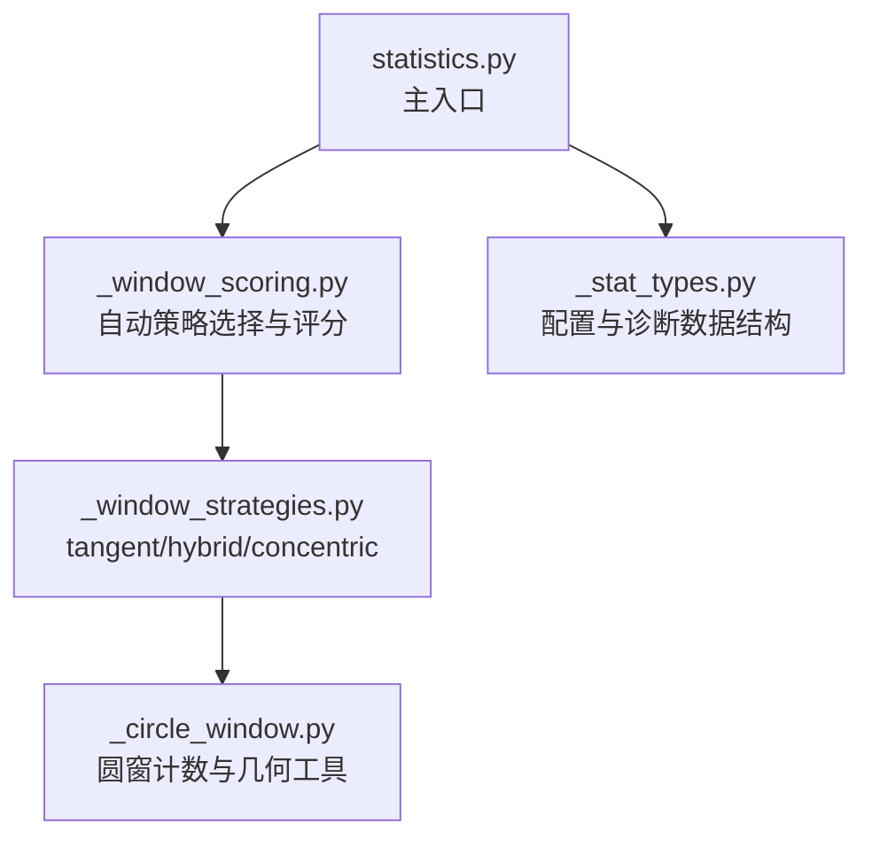
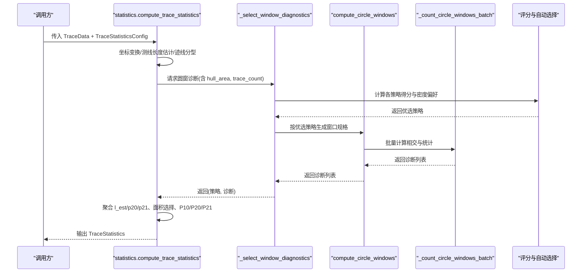
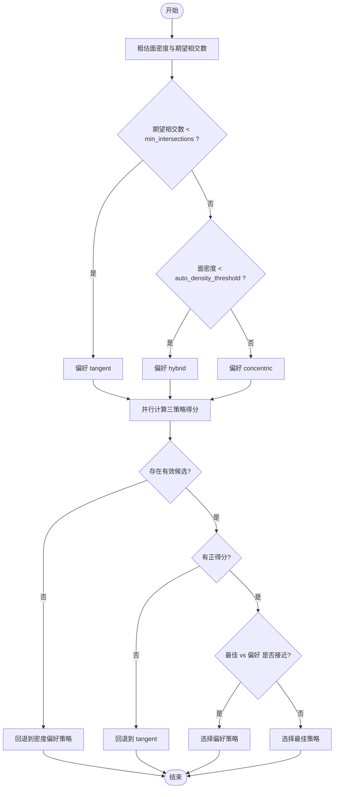
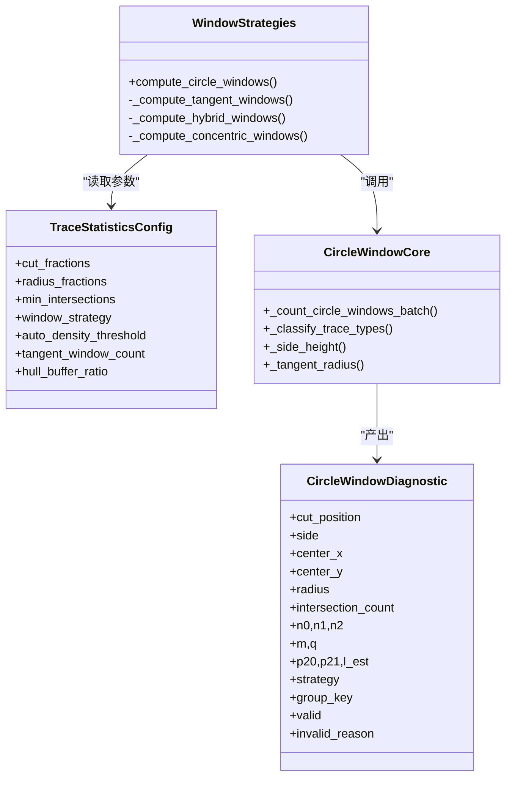
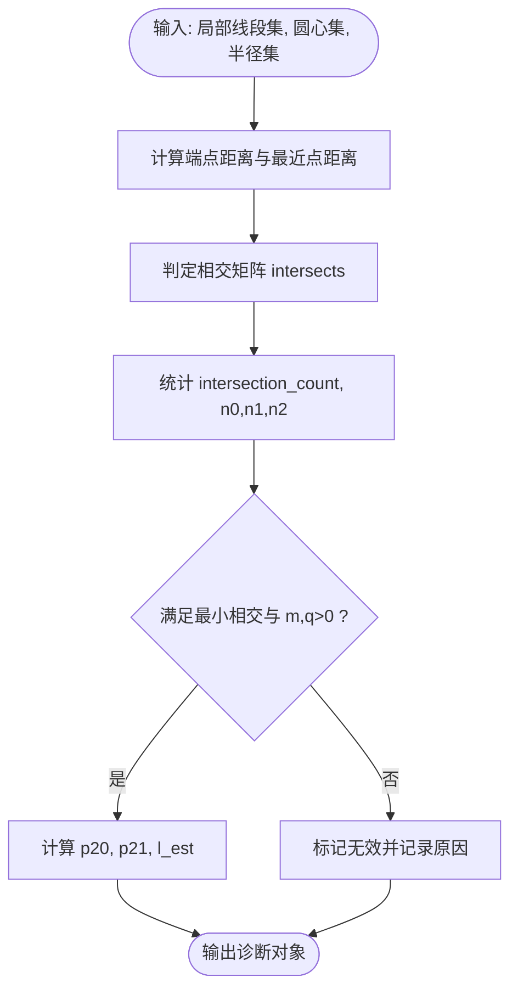
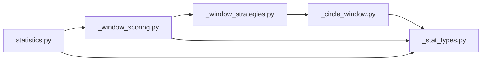

# 自适应半径策略

<cite>
**本文引用的文件**   
- [trace_pipeline/geology/_stat_types.py](file://trace_pipeline/geology/_stat_types.py)
- [trace_pipeline/geology/_circle_window.py](file://trace_pipeline/geology/_circle_window.py)
- [trace_pipeline/geology/_window_strategies.py](file://trace_pipeline/geology/_window_strategies.py)
- [trace_pipeline/geology/_window_scoring.py](file://trace_pipeline/geology/_window_scoring.py)
- [trace_pipeline/geology/statistics.py](file://trace_pipeline/geology/statistics.py)
- [tests/test_statistics.py](file://tests/test_statistics.py)
</cite>

## 目录
1. [引言](#引言)
2. [项目结构](#项目结构)
3. [核心组件](#核心组件)
4. [架构总览](#架构总览)
5. [详细组件分析](#详细组件分析)
6. [依赖关系分析](#依赖关系分析)
7. [性能与复杂度](#性能与复杂度)
8. [使用示例与参数调优](#使用示例与参数调优)
9. [故障排查指南](#故障排查指南)
10. [结论](#结论)

## 引言
本文件围绕“自适应半径圆窗策略”展开，聚焦于系统如何通过数据分布（迹线密度、测线长度、侧向高度等）自动选择并调整圆窗半径与布局，从而稳定估计面密度 P20、线密度 P21 与平均迹长。需要特别说明的是：当前代码库并未实现“逐迭代收敛”的自适应半径算法；其“自适应”体现在两点：
- 自动策略选择：根据粗估面密度与期望相交数，在 tangent/hybrid/concentric 三种布局策略中择优或回退。
- 面积降级与一致性校验：基于圆窗等效面积与凸包/缓冲凸包的差异，结合样本量自适应阈值进行面积来源降级与一致性告警。

因此，本文对“自适应半径”的解释将严格对应现有实现，避免臆造不存在的迭代收敛流程。

## 项目结构
与自适应半径圆窗相关的核心模块位于 geology 子包内，关键文件职责如下：
- _stat_types.py：配置类 TraceStatisticsConfig 与诊断结果 CircleWindowDiagnostic 的数据模型定义。
- _circle_window.py：圆窗几何计数、迹线分型、辅助度量（如切圆半径）。
- _window_strategies.py：三种圆窗布局策略的实现与分发。
- _window_scoring.py：六因子加权评分与自动策略选择逻辑。
- statistics.py：统计主入口，串联坐标变换、圆窗诊断、面积选择、P10/P20/P21 计算与一致性校验。

图表来源
- [trace_pipeline/geology/statistics.py:212-391](file://trace_pipeline/geology/statistics.py#L212-L391)
- [trace_pipeline/geology/_window_scoring.py:235-323](file://trace_pipeline/geology/_window_scoring.py#L235-L323)
- [trace_pipeline/geology/_window_strategies.py:173-185](file://trace_pipeline/geology/_window_strategies.py#L173-L185)
- [trace_pipeline/geology/_circle_window.py:71-216](file://trace_pipeline/geology/_circle_window.py#L71-L216)
- [trace_pipeline/geology/_stat_types.py:14-65](file://trace_pipeline/geology/_stat_types.py#L14-L65)

章节来源
- [trace_pipeline/geology/statistics.py:212-391](file://trace_pipeline/geology/statistics.py#L212-L391)
- [trace_pipeline/geology/_window_scoring.py:235-323](file://trace_pipeline/geology/_window_scoring.py#L235-L323)
- [trace_pipeline/geology/_window_strategies.py:173-185](file://trace_pipeline/geology/_window_strategies.py#L173-L185)
- [trace_pipeline/geology/_circle_window.py:71-216](file://trace_pipeline/geology/_circle_window.py#L71-L216)
- [trace_pipeline/geology/_stat_types.py:14-65](file://trace_pipeline/geology/_stat_types.py#L14-L65)

## 核心组件
- 配置对象 TraceStatisticsConfig
  - 控制 cut_fractions、radius_fractions、min_intersections、auto_density_threshold、tangent_window_count、hull_buffer_ratio 等关键参数。
  - 提供严格的参数校验，确保输入合法。
- 诊断对象 CircleWindowDiagnostic
  - 记录每个圆窗的几何位置、相交计数、端点内外分布、m/q 统计量、p20/p21/l_est 估计值及有效性标志。
- 圆窗计数与几何工具
  - 批量计算多个圆窗与局部线段的相交情况，向量化广播以提升性能。
  - 提供侧高提取、切圆半径估算等辅助函数。
- 策略与评分
  - 三种布局策略：切圆(tangent)、混合(hybrid)、同心(concentric)。
  - 六因子加权评分：有效分组数量、有效比例、空间覆盖、稳定性、半径大小、样本充分性。
  - 自动策略选择：先按密度偏好初选，再比较评分，必要时回退到保守策略。

章节来源
- [trace_pipeline/geology/_stat_types.py:14-65](file://trace_pipeline/geology/_stat_types.py#L14-L65)
- [trace_pipeline/geology/_stat_types.py:67-125](file://trace_pipeline/geology/_stat_types.py#L67-L125)
- [trace_pipeline/geology/_circle_window.py:71-216](file://trace_pipeline/geology/_circle_window.py#L71-L216)
- [trace_pipeline/geology/_window_strategies.py:52-185](file://trace_pipeline/geology/_window_strategies.py#L52-L185)
- [trace_pipeline/geology/_window_scoring.py:178-206](file://trace_pipeline/geology/_window_scoring.py#L178-L206)

## 架构总览
下图展示了从输入迹线到最终统计指标与自适应策略选择的整体流程。

图表来源
- [trace_pipeline/geology/statistics.py:212-391](file://trace_pipeline/geology/statistics.py#L212-L391)
- [trace_pipeline/geology/_window_scoring.py:235-323](file://trace_pipeline/geology/_window_scoring.py#L235-L323)
- [trace_pipeline/geology/_window_strategies.py:173-185](file://trace_pipeline/geology/_window_strategies.py#L173-L185)
- [trace_pipeline/geology/_circle_window.py:71-216](file://trace_pipeline/geology/_circle_window.py#L71-L216)

## 详细组件分析

### 自动策略选择与“自适应半径”机制
- 密度偏好初选
  - 通过测线长度与切圆半径估算期望相交数，若低于 min_intersections，则倾向 tangent；否则依据 auto_density_threshold 决定 hybrid 或 concentric。
- 多策略并行评估
  - 同时运行 tangent/hybrid/concentric 三套窗口布局，得到各自的诊断集合。
- 六因子加权评分
  - 有效分组数量与比例、空间覆盖（侧向+沿测线）、稳定性（l_est/p20/p21 组间变异系数）、半径大小（中位数相对最大半径）、样本充分性（相交数相对目标）。
- 回退与容差
  - 若无有效候选，回退到密度偏好策略；若所有得分非正，回退到最保守 tangent；当最佳策略与密度偏好接近时，优先密度偏好。

图表来源
- [trace_pipeline/geology/_window_scoring.py:209-233](file://trace_pipeline/geology/_window_scoring.py#L209-L233)
- [trace_pipeline/geology/_window_scoring.py:235-323](file://trace_pipeline/geology/_window_scoring.py#L235-L323)

章节来源
- [trace_pipeline/geology/_window_scoring.py:209-233](file://trace_pipeline/geology/_window_scoring.py#L209-L233)
- [trace_pipeline/geology/_window_scoring.py:235-323](file://trace_pipeline/geology/_window_scoring.py#L235-L323)

### 三种圆窗布局策略
- 切圆(tangent)
  - 半径由测线长度与切圆窗口数确定；沿测线方向等间距放置若干窗口，左右两侧分别生成。
  - 适用场景：低密度或测线较短时，保证足够的相交样本。
- 混合(hybrid)
  - 在多个切割位置处，以侧向高度与边缘距离限制最大半径，再按 radius_fractions 缩放生成多组窗口。
  - 适用场景：中等密度，兼顾空间覆盖与样本量。
- 同心(concentric)
  - 以测线中心为圆心，按 radius_fractions 生成不同半径的同心圆窗。
  - 适用场景：高密度区域，便于捕捉尺度变化。

图表来源
- [trace_pipeline/geology/_stat_types.py:14-65](file://trace_pipeline/geology/_stat_types.py#L14-L65)
- [trace_pipeline/geology/_stat_types.py:67-125](file://trace_pipeline/geology/_stat_types.py#L67-L125)
- [trace_pipeline/geology/_window_strategies.py:52-185](file://trace_pipeline/geology/_window_strategies.py#L52-L185)
- [trace_pipeline/geology/_circle_window.py:71-216](file://trace_pipeline/geology/_circle_window.py#L71-L216)

章节来源
- [trace_pipeline/geology/_window_strategies.py:52-185](file://trace_pipeline/geology/_window_strategies.py#L52-L185)
- [trace_pipeline/geology/_circle_window.py:71-216](file://trace_pipeline/geology/_circle_window.py#L71-L216)
- [trace_pipeline/geology/_stat_types.py:14-65](file://trace_pipeline/geology/_stat_types.py#L14-L65)
- [trace_pipeline/geology/_stat_types.py:67-125](file://trace_pipeline/geology/_stat_types.py#L67-L125)

### 圆窗计数与统计量估计
- 相交判定
  - 利用广播矩阵计算线段端点到圆心距离、线段上最近点到圆心距离，判断是否与圆相交。
- 统计量
  - m = n1 + 2*n2，q = 2*n0 + n1；p20 = q/(2πr²)，p21 = m/(4r)；l_est = (πr/2)*(m/q)。
- 有效性
  - 要求相交数不低于 min_intersections，且 m>0、q>0。

图表来源
- [trace_pipeline/geology/_circle_window.py:71-216](file://trace_pipeline/geology/_circle_window.py#L71-L216)

章节来源
- [trace_pipeline/geology/_circle_window.py:71-216](file://trace_pipeline/geology/_circle_window.py#L71-L216)

### 面积选择与一致性校验（自适应阈值）
- 四层回退：实测面积 → 原始凸包 → 缓冲凸包 → 圆窗等效面积。
- 自适应阈值：随样本量增加而收紧，用于判断凸包与圆窗等效面积的差异是否可接受。
- 一致性校验：比较主 P20/P21 与圆窗估计值的差异，超过自适应阈值则发出警告。

章节来源
- [trace_pipeline/geology/statistics.py:84-94](file://trace_pipeline/geology/statistics.py#L84-L94)
- [trace_pipeline/geology/statistics.py:106-166](file://trace_pipeline/geology/statistics.py#L106-L166)
- [trace_pipeline/geology/statistics.py:313-336](file://trace_pipeline/geology/statistics.py#L313-L336)

## 依赖关系分析
- 模块耦合
  - statistics.py 作为编排层，依赖 _window_scoring.py 的策略选择与评分，后者依赖 _window_strategies.py 的布局实现，最终落到 _circle_window.py 的几何计数。
  - _stat_types.py 被多处引用，提供统一的数据结构与常量。
- 外部依赖
  - numpy 用于向量化计算与数值处理。
- 潜在循环
  - 当前模块间为单向依赖，未发现循环导入。

图表来源
- [trace_pipeline/geology/statistics.py:212-391](file://trace_pipeline/geology/statistics.py#L212-L391)
- [trace_pipeline/geology/_window_scoring.py:235-323](file://trace_pipeline/geology/_window_scoring.py#L235-L323)
- [trace_pipeline/geology/_window_strategies.py:173-185](file://trace_pipeline/geology/_window_strategies.py#L173-L185)
- [trace_pipeline/geology/_circle_window.py:71-216](file://trace_pipeline/geology/_circle_window.py#L71-L216)
- [trace_pipeline/geology/_stat_types.py:14-65](file://trace_pipeline/geology/_stat_types.py#L14-L65)

章节来源
- [trace_pipeline/geology/statistics.py:212-391](file://trace_pipeline/geology/statistics.py#L212-L391)
- [trace_pipeline/geology/_window_scoring.py:235-323](file://trace_pipeline/geology/_window_scoring.py#L235-L323)
- [trace_pipeline/geology/_window_strategies.py:173-185](file://trace_pipeline/geology/_window_strategies.py#L173-L185)
- [trace_pipeline/geology/_circle_window.py:71-216](file://trace_pipeline/geology/_circle_window.py#L71-L216)
- [trace_pipeline/geology/_stat_types.py:14-65](file://trace_pipeline/geology/_stat_types.py#L14-L65)

## 性能与复杂度
- 时间复杂度
  - 圆窗批处理：N 条线段 × M 个窗口，主要开销在距离矩阵与最近点投影计算，O(NM)。
  - 策略选择：并行计算三套布局，总体 O(N·(M_t + M_h + M_c))。
- 空间复杂度
  - 中间矩阵维度为 N×M，内存占用与窗口数量线性相关。
- 优化建议
  - 合理设置 radius_fractions 与 cut_fractions，控制窗口总数。
  - 在高密度场景下优先 concentric，减少不必要的多位置扫描。
  - 使用合理的 min_intersections 避免过多无效窗口参与评分。

[本节为通用性能讨论，无需具体文件分析]

## 使用示例与参数调优

### 基本用法
- 构造 TraceData 与 TraceStatisticsConfig，调用 compute_trace_statistics 获取统计结果与所选策略。
- 示例参考测试用例中的构造方式与断言。

章节来源
- [tests/test_statistics.py:256-292](file://tests/test_statistics.py#L256-L292)

### 参数调优指南
- window_strategy
  - 设为 "auto" 启用自动选择；也可固定为 "tangent"/"hybrid"/"concentric" 进行对比实验。
- auto_density_threshold
  - 控制密度偏好切换的阈值，较小值更倾向 hybrid，较大值更倾向 concentric。
- min_intersections
  - 提高该值可提升统计稳健性，但会减少有效窗口数量；需权衡。
- tangent_window_count
  - 影响切圆策略的窗口数量，更多窗口有助于覆盖但增加计算量。
- radius_fractions / cut_fractions
  - 控制窗口半径与切割位置的采样粒度，过密会增加计算负担，过疏可能遗漏重要尺度信息。

章节来源
- [trace_pipeline/geology/_stat_types.py:14-65](file://trace_pipeline/geology/_stat_types.py#L14-L65)
- [trace_pipeline/geology/_window_scoring.py:209-233](file://trace_pipeline/geology/_window_scoring.py#L209-L233)
- [trace_pipeline/geology/_window_strategies.py:87-129](file://trace_pipeline/geology/_window_strategies.py#L87-L129)

### 与固定半径策略的性能对比分析
- 固定半径策略通常指仅使用单一半径或固定半径序列的布局（例如仅 concentric 或仅 tangent），缺乏对数据分布的响应。
- 自适应策略的优势
  - 自动选择：根据密度与期望相交数选择合适布局，避免低密度下的不足样本或高密度下的过度采样。
  - 评分择优：综合空间覆盖、稳定性、样本充分性等指标，提升估计稳健性。
  - 面积降级：在凸包不可信或差异过大时，回退到圆窗等效面积，降低偏差。
- 对比方法
  - 固定 window_strategy 为 "tangent" 或 "concentric"，对比自动模式下的策略选择与统计指标稳定性。
  - 观察有效窗口数量、p20/p21 的组间变异系数以及面积来源与一致性告警。

章节来源
- [trace_pipeline/geology/_window_scoring.py:178-206](file://trace_pipeline/geology/_window_scoring.py#L178-L206)
- [trace_pipeline/geology/statistics.py:212-391](file://trace_pipeline/geology/statistics.py#L212-L391)

## 故障排查指南
- 常见无效原因
  - 无迹线数据、可用侧向高度或端部距离不足、测线长度不足、相交迹线数不足、m≤0 或 q≤0。
- 定位方法
  - 检查 diagnostics 中 invalid_reason 字段，确认具体失败原因。
  - 调整 min_intersections、radius_fractions、cut_fractions 或 window_strategy。
- 一致性告警
  - 若出现主 P20/P21 与圆窗估计差异较大的告警，考虑增大样本量或调整面积来源与缓冲比例。

章节来源
- [trace_pipeline/geology/_circle_window.py:219-249](file://trace_pipeline/geology/_circle_window.py#L219-L249)
- [trace_pipeline/geology/statistics.py:313-336](file://trace_pipeline/geology/statistics.py#L313-L336)

## 结论
本项目的“自适应半径圆窗策略”并非传统意义上的迭代收敛算法，而是通过数据驱动的自动策略选择与多维评分机制，动态适配不同密度与几何条件下的圆窗布局与半径范围。配合面积降级与一致性校验，系统在多种数据分布下均能给出稳健的 P20/P21 与平均迹长估计。实际使用中，建议以 "auto" 模式为主，辅以参数微调与对比实验，以获得最优的统计质量与计算效率平衡。