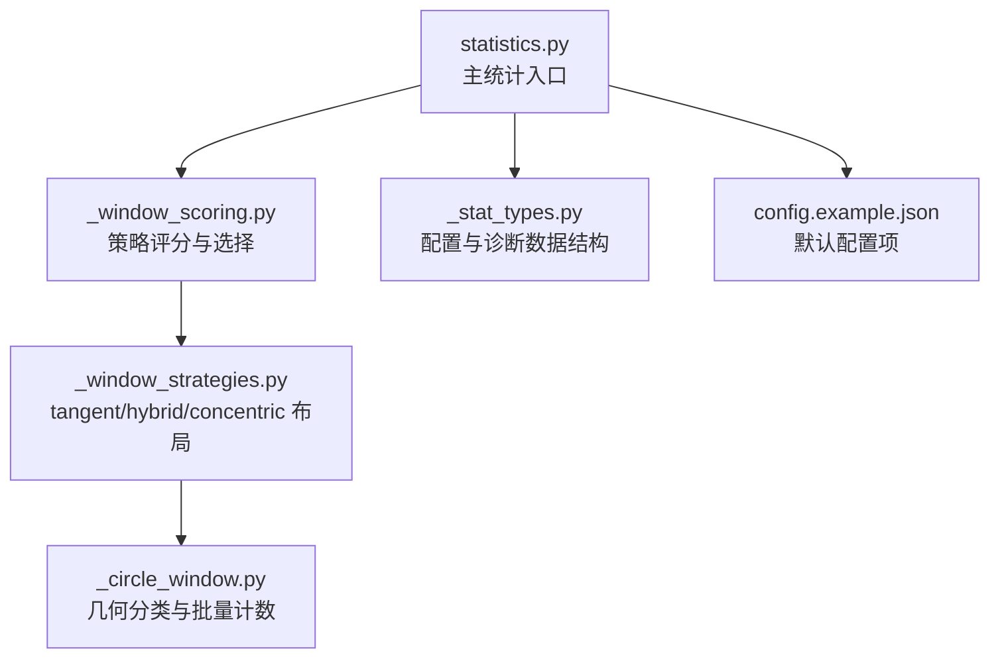
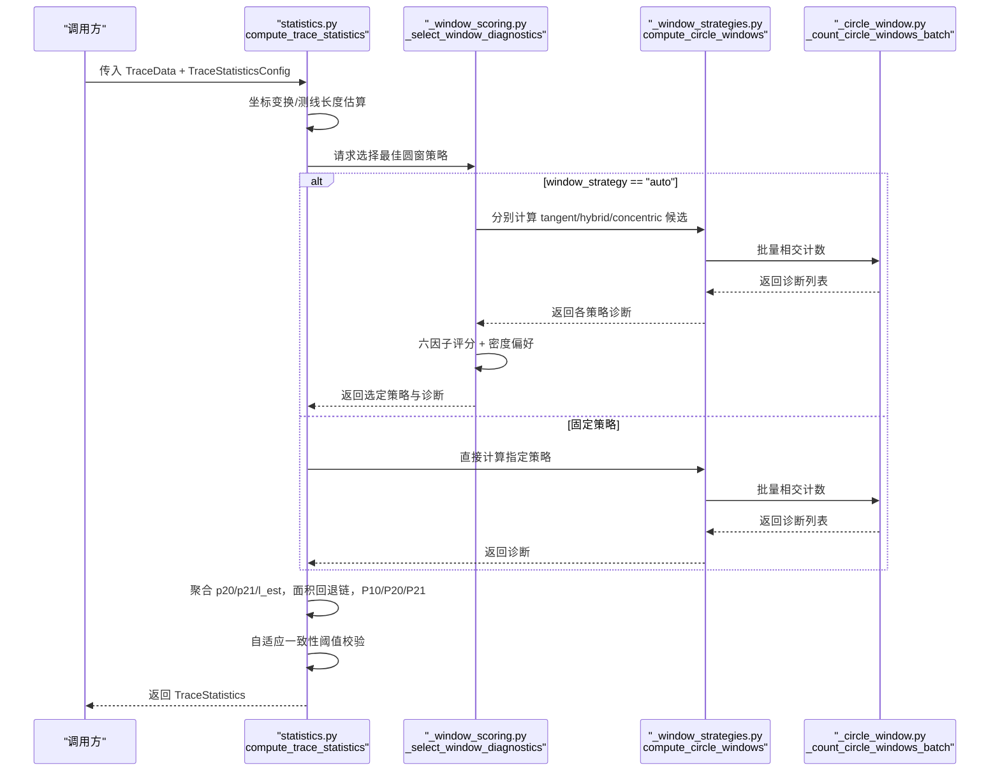
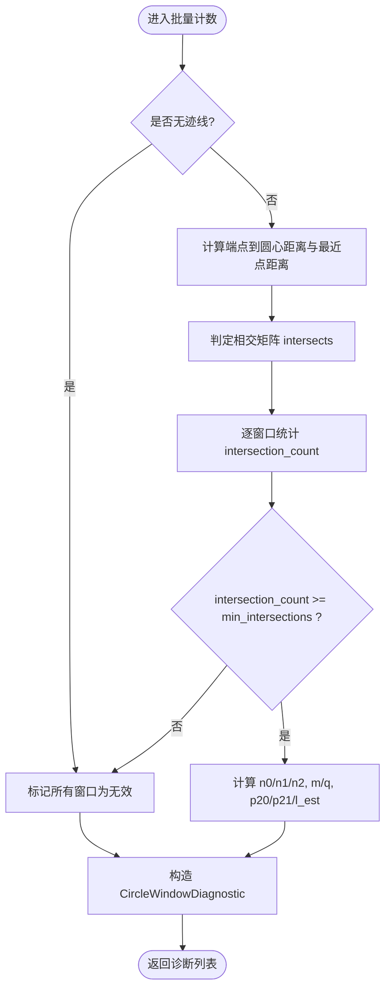
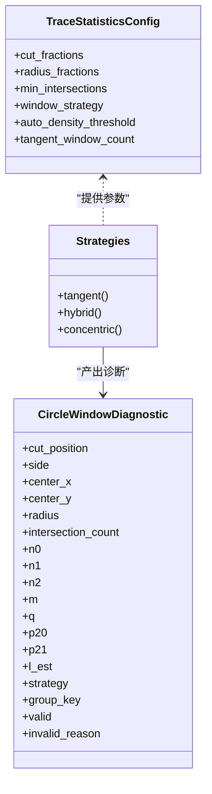
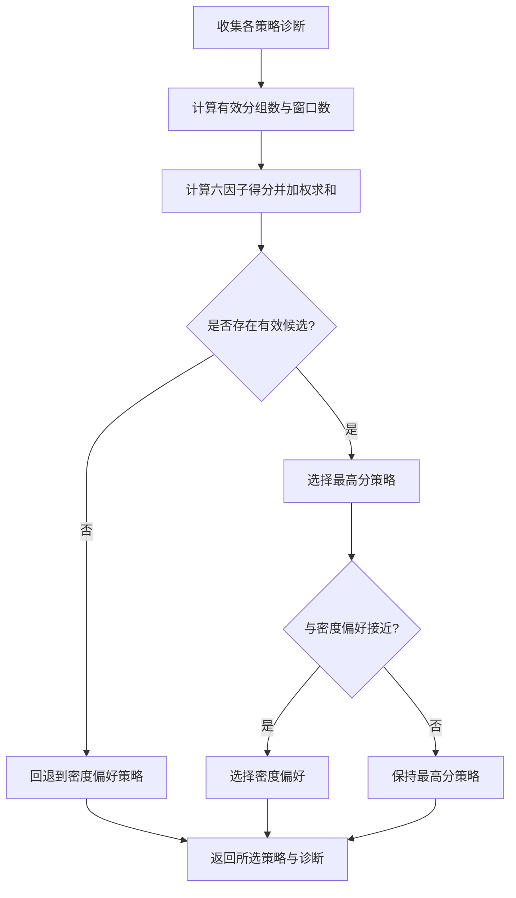
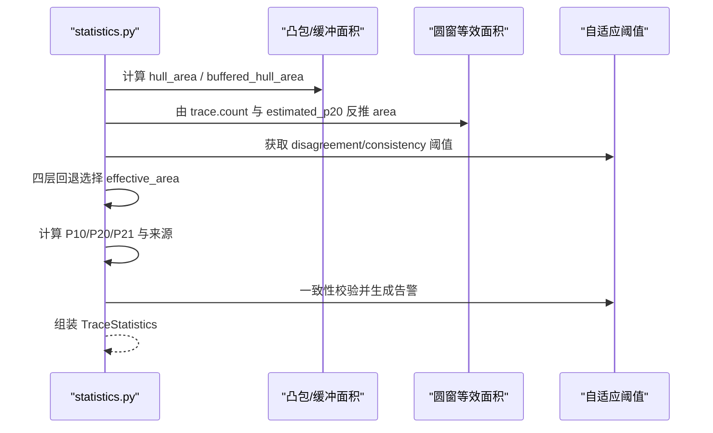
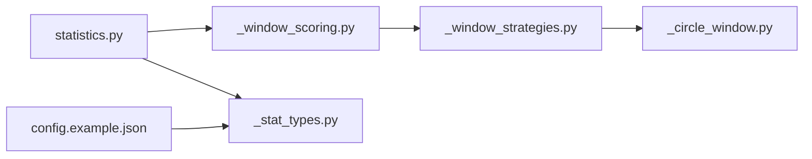

# 自适应计数策略

<cite>
**本文引用的文件**   
- [trace_pipeline/geology/_stat_types.py](file://trace_pipeline/geology/_stat_types.py)
- [trace_pipeline/geology/_circle_window.py](file://trace_pipeline/geology/_circle_window.py)
- [trace_pipeline/geology/_window_strategies.py](file://trace_pipeline/geology/_window_strategies.py)
- [trace_pipeline/geology/_window_scoring.py](file://trace_pipeline/geology/_window_scoring.py)
- [trace_pipeline/geology/statistics.py](file://trace_pipeline/geology/statistics.py)
- [config.example.json](file://config.example.json)
- [tests/test_statistics.py](file://tests/test_statistics.py)
</cite>

## 目录
1. [简介](#简介)
2. [项目结构](#项目结构)
3. [核心组件](#核心组件)
4. [架构总览](#架构总览)
5. [详细组件分析](#详细组件分析)
6. [依赖关系分析](#依赖关系分析)
7. [性能与复杂度](#性能与复杂度)
8. [配置示例与最佳实践](#配置示例与最佳实践)
9. [统计显著性与可靠性评估](#统计显著性与可靠性评估)
10. [故障排查指南](#故障排查指南)
11. [结论](#结论)

## 简介
本文件围绕“自适应计数圆窗策略”展开，重点解释 adaptive_count 策略的工作机制：通过控制相交迹线数量来确定合适的圆窗大小，并结合多策略评分与密度偏好进行自动选择。文档涵盖最小相交数设置、统计显著性检验思路与结果可靠性评估方法，并提供不同数据密度下的参数调整策略与最佳实践。

## 项目结构
与自适应计数圆窗策略相关的核心代码位于 geology 子包中，主要包含以下模块：
- 数据类型与配置：_stat_types.py
- 圆窗几何与计数：_circle_window.py
- 三种圆窗布局策略：_window_strategies.py
- 策略评分与自动选择：_window_scoring.py
- 主统计流程与自适应阈值：statistics.py
- 配置模板：config.example.json
- 单元测试覆盖关键路径：tests/test_statistics.py

图表来源
- [trace_pipeline/geology/statistics.py:212-391](file://trace_pipeline/geology/statistics.py#L212-L391)
- [trace_pipeline/geology/_window_scoring.py:178-323](file://trace_pipeline/geology/_window_scoring.py#L178-L323)
- [trace_pipeline/geology/_window_strategies.py:173-185](file://trace_pipeline/geology/_window_strategies.py#L173-L185)
- [trace_pipeline/geology/_circle_window.py:71-216](file://trace_pipeline/geology/_circle_window.py#L71-L216)
- [trace_pipeline/geology/_stat_types.py:15-65](file://trace_pipeline/geology/_stat_types.py#L15-L65)
- [config.example.json:14-17](file://config.example.json#L14-L17)

章节来源
- [trace_pipeline/geology/statistics.py:212-391](file://trace_pipeline/geology/statistics.py#L212-L391)
- [trace_pipeline/geology/_window_scoring.py:178-323](file://trace_pipeline/geology/_window_scoring.py#L178-L323)
- [trace_pipeline/geology/_window_strategies.py:173-185](file://trace_pipeline/geology/_window_strategies.py#L173-L185)
- [trace_pipeline/geology/_circle_window.py:71-216](file://trace_pipeline/geology/_circle_window.py#L71-L216)
- [trace_pipeline/geology/_stat_types.py:15-65](file://trace_pipeline/geology/_stat_types.py#L15-L65)
- [config.example.json:14-17](file://config.example.json#L14-L17)

## 核心组件
- TraceStatisticsConfig：定义自适应计数相关的关键参数，包括 min_intersections（最少相交迹线数）、auto_density_threshold（自动密度阈值）、window_strategy（策略选择模式）等。
- CircleWindowDiagnostic：记录每个圆窗的相交统计、有效性标志及无效原因。
- _count_circle_windows_batch：向量化批量计算多个圆窗的相交情况，并输出诊断对象。
- compute_circle_windows：按指定策略生成候选圆窗集合。
- _select_window_diagnostics：在 auto 模式下对 tangent/hybrid/concentric 三套候选进行评分与选择。
- statistics.compute_trace_statistics：整合测线长度、面积回退链、P10/P20/P21 估计与一致性校验。

章节来源
- [trace_pipeline/geology/_stat_types.py:15-65](file://trace_pipeline/geology/_stat_types.py#L15-L65)
- [trace_pipeline/geology/_stat_types.py:67-89](file://trace_pipeline/geology/_stat_types.py#L67-L89)
- [trace_pipeline/geology/_circle_window.py:71-216](file://trace_pipeline/geology/_circle_window.py#L71-L216)
- [trace_pipeline/geology/_window_strategies.py:173-185](file://trace_pipeline/geology/_window_strategies.py#L173-L185)
- [trace_pipeline/geology/_window_scoring.py:235-323](file://trace_pipeline/geology/_window_scoring.py#L235-L323)
- [trace_pipeline/geology/statistics.py:212-391](file://trace_pipeline/geology/statistics.py#L212-L391)

## 架构总览
自适应计数策略的核心流程如下：
- 输入：迹线端点、测线方位、可选实测测线长度/露头面积、配置参数。
- 步骤：
  1) 坐标变换到局部坐标系；
  2) 根据策略生成候选圆窗（tangent/hybrid/concentric），并进行批量相交计数；
  3) 若 window_strategy=auto，则基于六因子加权评分与密度偏好选择最优策略；
  4) 聚合各窗口的 p20/p21/l_est 指标，结合面积回退链得到最终 P10/P20/P21；
  5) 使用自适应阈值进行一致性校验与告警。

图表来源
- [trace_pipeline/geology/statistics.py:212-391](file://trace_pipeline/geology/statistics.py#L212-L391)
- [trace_pipeline/geology/_window_scoring.py:235-323](file://trace_pipeline/geology/_window_scoring.py#L235-L323)
- [trace_pipeline/geology/_window_strategies.py:173-185](file://trace_pipeline/geology/_window_strategies.py#L173-L185)
- [trace_pipeline/geology/_circle_window.py:71-216](file://trace_pipeline/geology/_circle_window.py#L71-L216)

## 详细组件分析

### 自适应计数与最小相交数
- 最小相交数 min_intersections：用于过滤有效圆窗。当某圆窗的相交迹线数小于该阈值时，该窗口被标记为无效，不参与后续聚合。
- 相交计数实现：_count_circle_windows_batch 采用向量化距离矩阵与最近点投影，高效判定线段与圆窗的相交关系，并统计 n0/n1/n2 以计算 m/q 与 p20/p21/l_est。

图表来源
- [trace_pipeline/geology/_circle_window.py:71-216](file://trace_pipeline/geology/_circle_window.py#L71-L216)
- [trace_pipeline/geology/_stat_types.py:15-65](file://trace_pipeline/geology/_stat_types.py#L15-L65)

章节来源
- [trace_pipeline/geology/_circle_window.py:71-216](file://trace_pipeline/geology/_circle_window.py#L71-L216)
- [trace_pipeline/geology/_stat_types.py:15-65](file://trace_pipeline/geology/_stat_types.py#L15-L65)

### 三种圆窗布局策略
- tangent：沿测线切线方向生成等间距圆窗，半径由测线长度与 tangent_window_count 决定。
- hybrid：在多个 cut_fraction 位置与左右两侧组合，按 radius_fractions 缩放最大可用半径。
- concentric：以测线中心为圆心，按 radius_fractions 生成同心圆窗。

图表来源
- [trace_pipeline/geology/_stat_types.py:15-65](file://trace_pipeline/geology/_stat_types.py#L15-L65)
- [trace_pipeline/geology/_stat_types.py:67-89](file://trace_pipeline/geology/_stat_types.py#L67-L89)
- [trace_pipeline/geology/_window_strategies.py:52-185](file://trace_pipeline/geology/_window_strategies.py#L52-L185)

章节来源
- [trace_pipeline/geology/_window_strategies.py:52-185](file://trace_pipeline/geology/_window_strategies.py#L52-L185)
- [trace_pipeline/geology/_stat_types.py:15-65](file://trace_pipeline/geology/_stat_types.py#L15-L65)
- [trace_pipeline/geology/_stat_types.py:67-89](file://trace_pipeline/geology/_stat_types.py#L67-L89)

### 自动策略选择与密度偏好
- 六因子加权评分：有效分组得分、有效组占比、空间覆盖（侧向+沿测线）、稳定性（跨组变异系数倒数）、半径代表性、样本充分性（相对目标相交数的比例）。
- 密度偏好：根据粗略密度与期望相交数判断首选策略；低密度倾向 tangent，高密度倾向 concentric，中等密度倾向 hybrid。
- 平局容忍：当最佳策略与密度偏好得分接近时，优先密度偏好。

图表来源
- [trace_pipeline/geology/_window_scoring.py:178-323](file://trace_pipeline/geology/_window_scoring.py#L178-L323)

章节来源
- [trace_pipeline/geology/_window_scoring.py:178-323](file://trace_pipeline/geology/_window_scoring.py#L178-L323)

### 主统计流程与自适应阈值
- 面积回退链：实测面积 → 原始凸包 → 缓冲凸包 → 圆窗等效面积。
- 自适应阈值：随样本量增大而收紧，用于面积降级与 P20/P21 一致性校验。
- 输出：TraceStatistics 包含策略选择、各指标来源与一致性告警。

图表来源
- [trace_pipeline/geology/statistics.py:83-94](file://trace_pipeline/geology/statistics.py#L83-L94)
- [trace_pipeline/geology/statistics.py:106-166](file://trace_pipeline/geology/statistics.py#L106-L166)
- [trace_pipeline/geology/statistics.py:212-391](file://trace_pipeline/geology/statistics.py#L212-L391)

章节来源
- [trace_pipeline/geology/statistics.py:83-94](file://trace_pipeline/geology/statistics.py#L83-L94)
- [trace_pipeline/geology/statistics.py:106-166](file://trace_pipeline/geology/statistics.py#L106-L166)
- [trace_pipeline/geology/statistics.py:212-391](file://trace_pipeline/geology/statistics.py#L212-L391)

## 依赖关系分析
- statistics.py 依赖 _window_scoring.py 进行策略选择，后者再调用 _window_strategies.py 生成候选，最终由 _circle_window.py 完成几何与计数。
- _stat_types.py 提供全局配置与诊断数据结构，贯穿整个流程。
- config.example.json 暴露用户可配置的 key，如 window_strategy、auto_density_threshold、tangent_window_count、min_intersections。

图表来源
- [trace_pipeline/geology/statistics.py:212-391](file://trace_pipeline/geology/statistics.py#L212-L391)
- [trace_pipeline/geology/_window_scoring.py:178-323](file://trace_pipeline/geology/_window_scoring.py#L178-L323)
- [trace_pipeline/geology/_window_strategies.py:173-185](file://trace_pipeline/geology/_window_strategies.py#L173-L185)
- [trace_pipeline/geology/_circle_window.py:71-216](file://trace_pipeline/geology/_circle_window.py#L71-L216)
- [trace_pipeline/geology/_stat_types.py:15-65](file://trace_pipeline/geology/_stat_types.py#L15-L65)
- [config.example.json:14-17](file://config.example.json#L14-L17)

章节来源
- [trace_pipeline/geology/statistics.py:212-391](file://trace_pipeline/geology/statistics.py#L212-L391)
- [trace_pipeline/geology/_window_scoring.py:178-323](file://trace_pipeline/geology/_window_scoring.py#L178-L323)
- [trace_pipeline/geology/_window_strategies.py:173-185](file://trace_pipeline/geology/_window_strategies.py#L173-L185)
- [trace_pipeline/geology/_circle_window.py:71-216](file://trace_pipeline/geology/_circle_window.py#L71-L216)
- [trace_pipeline/geology/_stat_types.py:15-65](file://trace_pipeline/geology/_stat_types.py#L15-L65)
- [config.example.json:14-17](file://config.example.json#L14-L17)

## 性能与复杂度
- 批量相交计数采用广播与矩阵运算，时间复杂度近似 O(N×M)，其中 N 为迹线数，M 为候选圆窗数；空间复杂度受 centers/radii 矩阵影响。
- 策略评分与聚合操作为线性扫描，开销较小。
- 建议：
  - 合理设置 radius_fractions 与 cut_fractions，避免 M 过大导致内存与计算压力。
  - 在高密度场景下，适当提高 min_intersections 以减少无效窗口数量。

[本节为通用性能讨论，不直接分析具体文件]

## 配置示例与最佳实践
- 基本配置项（来自配置模板）：
  - window_strategy：推荐 auto，让系统依据密度与评分自动选择。
  - auto_density_threshold：控制密度偏好的切换阈值，默认 5.0。
  - tangent_window_count：切线策略的窗口数量，默认 3。
  - min_intersections：最少相交迹线数，默认 5。
- 不同数据密度下的参数调整策略：
  - 低密度（期望相交数不足）：
    - 降低 min_intersections（例如降至 3–5），确保有足够有效窗口参与评分。
    - 适当增加 tangent_window_count，提升空间覆盖。
    - 保持或略降 auto_density_threshold，使系统更倾向 tangent。
  - 中等密度：
    - 维持默认 min_intersections=5。
    - 使用 auto 策略，让 hybrid 获得更高评分。
  - 高密度：
    - 可适当提高 min_intersections（例如 5–10），增强稳定性。
    - 减小 radius_fractions 的最大值，避免过大圆窗引入边界效应。
    - 提高 auto_density_threshold，促使系统选择 concentric。
- 最佳实践：
  - 始终启用 auto 策略，配合合理的 auto_density_threshold 与 min_intersections。
  - 关注 diagnostics.valid 与 invalid_reason，定位无效窗口原因（如相交数不足、侧向高度不足等）。
  - 结合一致性告警（window_validation_warning）检查 P20/P21 差异，必要时调整面积回退链参数（hull_buffer_ratio）。

章节来源
- [config.example.json:14-17](file://config.example.json#L14-L17)
- [trace_pipeline/geology/_stat_types.py:15-65](file://trace_pipeline/geology/_stat_types.py#L15-L65)
- [trace_pipeline/geology/_window_scoring.py:209-233](file://trace_pipeline/geology/_window_scoring.py#L209-L233)
- [trace_pipeline/geology/_circle_window.py:176-186](file://trace_pipeline/geology/_circle_window.py#L176-L186)

## 统计显著性与可靠性评估
- 最小相交数与样本充分性：
  - min_intersections 作为硬性门槛，保证每个有效窗口具备足够的相交样本。
  - 评分函数中的样本充分性因子将实际相交数与目标值（2×min_intersections）比较，鼓励更高的样本量。
- 稳定性评估：
  - 对 l_est/p20/p21 在各组内的变异系数取倒数，作为稳定性得分，抑制高波动结果。
- 一致性校验：
  - 使用自适应一致性阈值比较主 P20/P21 与圆窗估计值，差异超过阈值时发出警告，提示可能存在的偏差。
- 面积降级与差异阈值：
  - 面积回退链在凸包与圆窗等效面积之间权衡，差异阈值随样本量自适应收紧，保障结果稳健性。

章节来源
- [trace_pipeline/geology/_window_scoring.py:142-168](file://trace_pipeline/geology/_window_scoring.py#L142-L168)
- [trace_pipeline/geology/_window_scoring.py:125-140](file://trace_pipeline/geology/_window_scoring.py#L125-L140)
- [trace_pipeline/geology/statistics.py:83-94](file://trace_pipeline/geology/statistics.py#L83-L94)
- [trace_pipeline/geology/statistics.py:313-336](file://trace_pipeline/geology/statistics.py#L313-L336)
- [trace_pipeline/geology/statistics.py:106-166](file://trace_pipeline/geology/statistics.py#L106-L166)

## 故障排查指南
- 常见无效原因：
  - 相交迹线数不足：检查 min_intersections 是否过高，或数据稀疏导致无法达到阈值。
  - 可用侧向高度不足：调整 cut_fractions 与 radius_fractions，或增大 tangent_window_count。
  - 测线长度不足：确认 scanline_length 估算正确，或提供 measured_scanline_length。
- 调试建议：
  - 查看 diagnostics.invalid_reason 与 valid 标志，定位问题窗口。
  - 观察 window_validation_warning，评估 P20/P21 一致性。
  - 在测试用例中验证关键路径行为（如空数据、单窗口相交、策略选择确定性）。

章节来源
- [trace_pipeline/geology/_circle_window.py:219-249](file://trace_pipeline/geology/_circle_window.py#L219-L249)
- [trace_pipeline/geology/_window_strategies.py:66-129](file://trace_pipeline/geology/_window_strategies.py#L66-L129)
- [tests/test_statistics.py:142-192](file://tests/test_statistics.py#L142-L192)
- [tests/test_statistics.py:213-251](file://tests/test_statistics.py#L213-L251)

## 结论
自适应计数圆窗策略通过“最小相交数 + 多策略评分 + 密度偏好”的组合，实现了在不同数据密度下自动选择合适圆窗布局的能力。配合面积回退链与自适应一致性阈值，系统在结果可靠性与鲁棒性方面提供了有力保障。实践中应结合数据特征调整 min_intersections、auto_density_threshold 与窗口布局参数，并持续关注诊断与告警信息，以确保统计指标的准确性与稳定性。