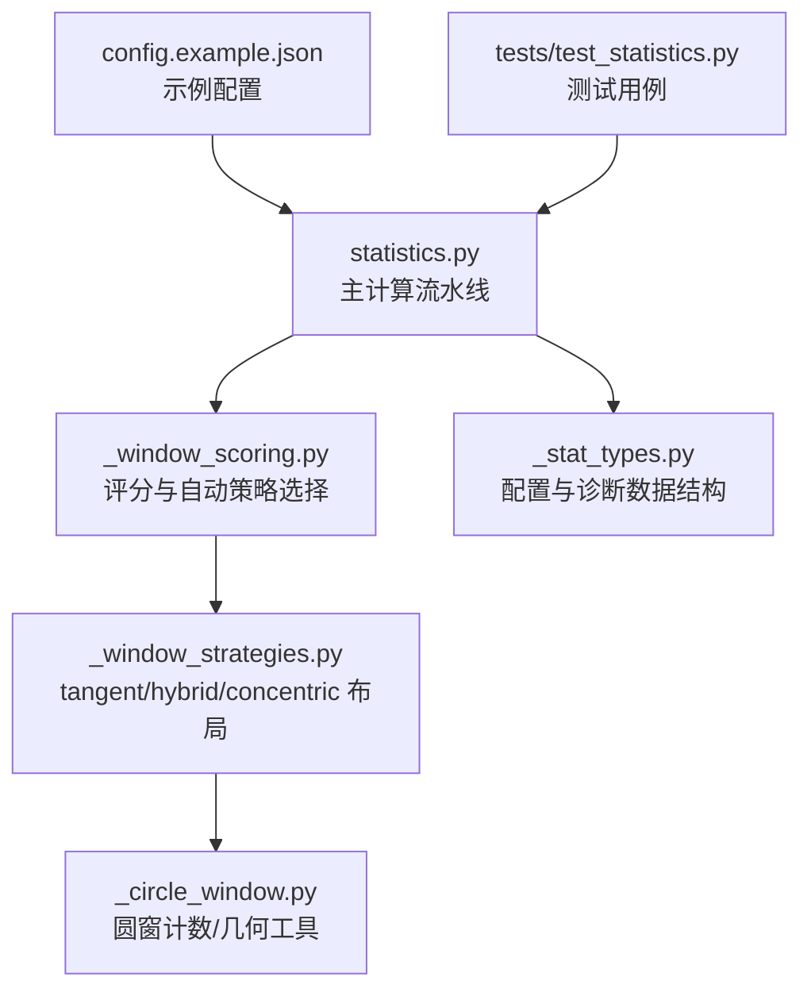
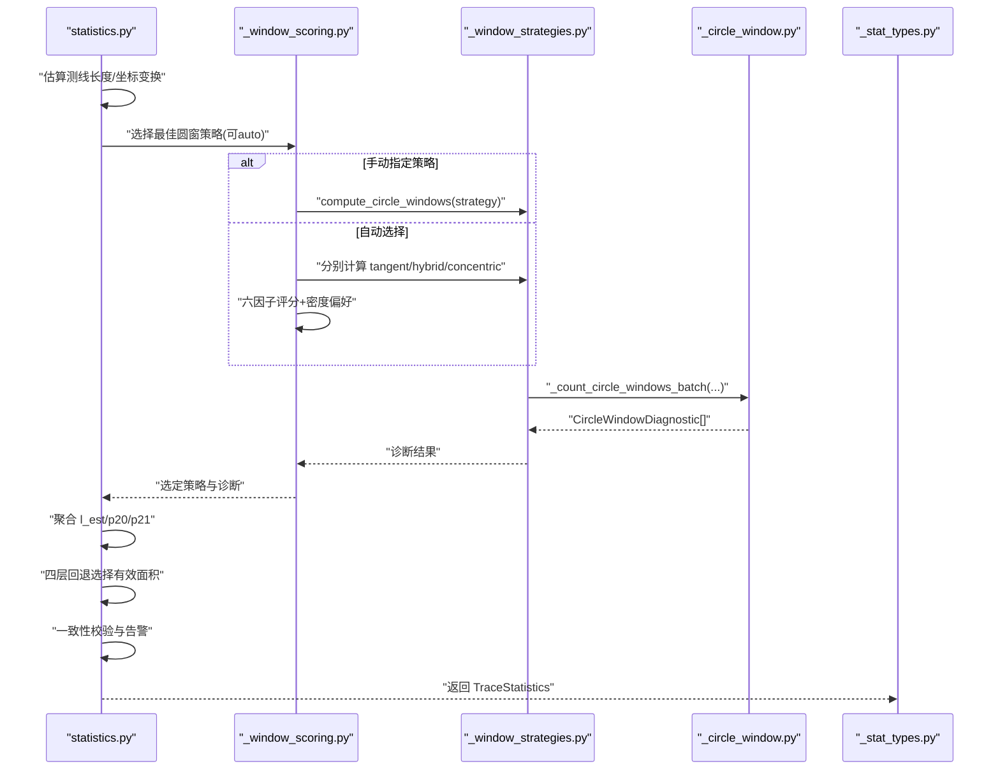
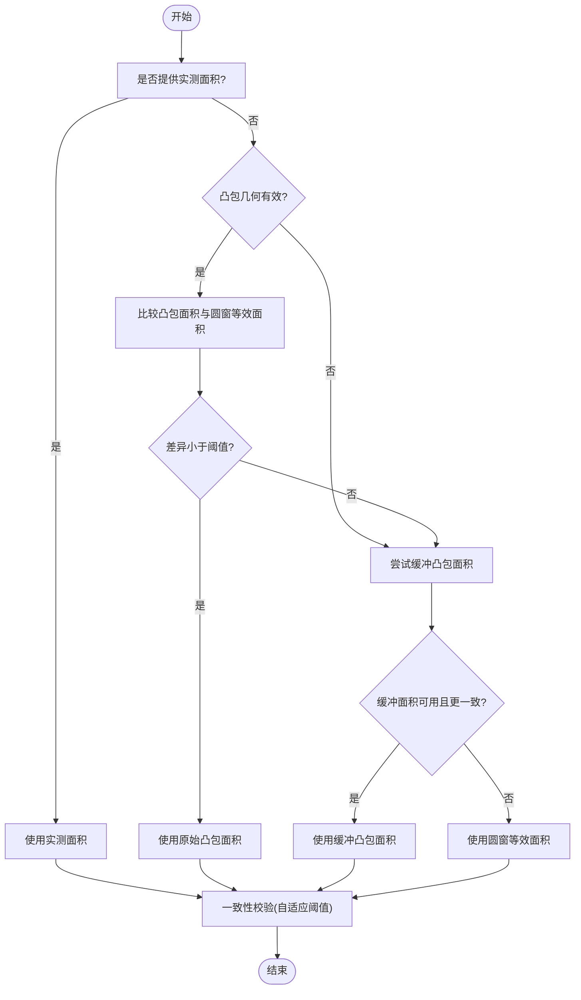
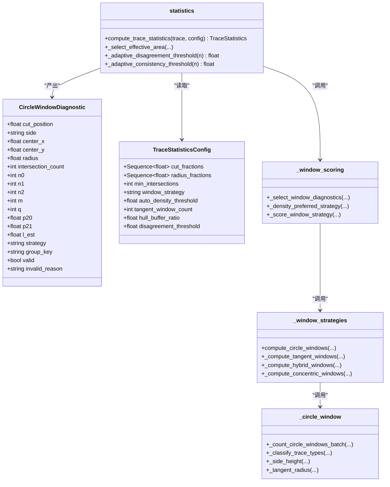
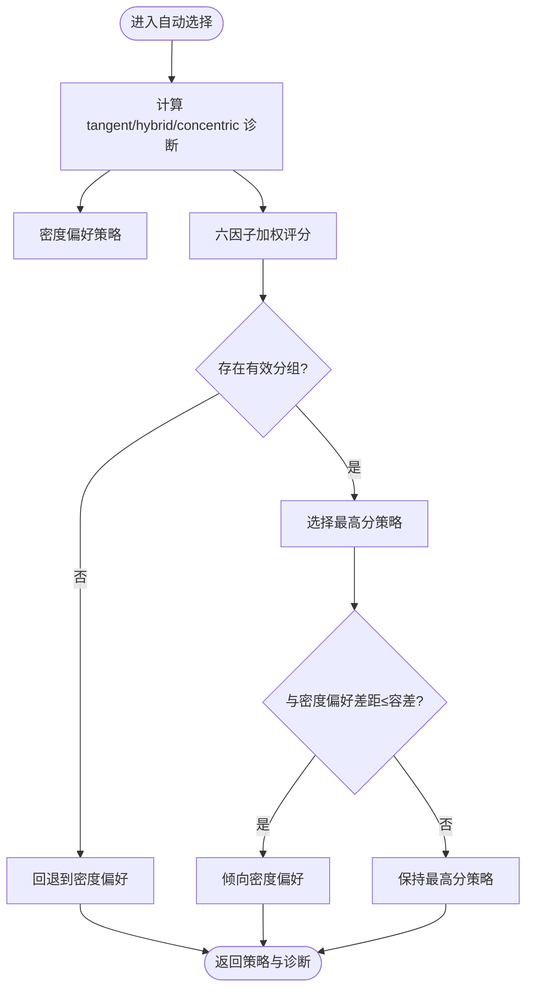
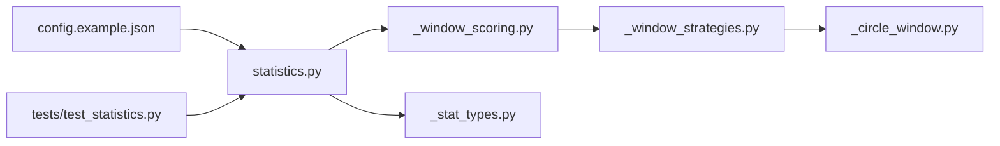

# 自适应面积策略

<cite>
**本文引用的文件**   
- [trace_pipeline/geology/statistics.py](file://trace_pipeline/geology/statistics.py)
- [trace_pipeline/geology/_stat_types.py](file://trace_pipeline/geology/_stat_types.py)
- [trace_pipeline/geology/_window_scoring.py](file://trace_pipeline/geology/_window_scoring.py)
- [trace_pipeline/geology/_window_strategies.py](file://trace_pipeline/geology/_window_strategies.py)
- [trace_pipeline/geology/_circle_window.py](file://trace_pipeline/geology/_circle_window.py)
- [config.example.json](file://config.example.json)
- [tests/test_statistics.py](file://tests/test_statistics.py)
</cite>

## 目录
1. [引言](#引言)
2. [项目结构](#项目结构)
3. [核心组件](#核心组件)
4. [架构总览](#架构总览)
5. [详细组件分析](#详细组件分析)
6. [依赖关系分析](#依赖关系分析)
7. [性能考量](#性能考量)
8. [故障排查指南](#故障排查指南)
9. [结论](#结论)
10. [附录：配置与参数说明](#附录配置与参数说明)

## 引言
本文件围绕“自适应面积圆窗策略”展开，系统阐述其核心思想：通过控制圆窗面积来保证统计结果的可靠性。重点包括：
- 面积计算公式与来源（实测、凸包、缓冲凸包、圆窗等效面积）
- 采样密度要求与自动策略选择机制
- 质量控制与一致性校验流程
- 实际应用场景与不同地质条件下的面积选择建议
- 配置参数的详细说明与推荐设置

## 项目结构
与自适应面积策略相关的代码主要位于 geology 子模块中，按职责拆分为：
- 数据类型与配置：_stat_types.py
- 圆窗计数与几何工具：_circle_window.py
- 三种圆窗布局策略：_window_strategies.py
- 评分与自动策略选择：_window_scoring.py
- 主计算流水线与面积回退逻辑：statistics.py
- 示例配置：config.example.json
- 单元测试覆盖关键路径：tests/test_statistics.py

图表来源
- [trace_pipeline/geology/statistics.py:212-391](file://trace_pipeline/geology/statistics.py#L212-L391)
- [trace_pipeline/geology/_window_scoring.py:235-323](file://trace_pipeline/geology/_window_scoring.py#L235-L323)
- [trace_pipeline/geology/_window_strategies.py:173-185](file://trace_pipeline/geology/_window_strategies.py#L173-L185)
- [trace_pipeline/geology/_circle_window.py:71-216](file://trace_pipeline/geology/_circle_window.py#L71-L216)
- [trace_pipeline/geology/_stat_types.py:14-65](file://trace_pipeline/geology/_stat_types.py#L14-L65)
- [config.example.json:14-17](file://config.example.json#L14-L17)
- [tests/test_statistics.py:142-192](file://tests/test_statistics.py#L142-L192)

章节来源
- [trace_pipeline/geology/statistics.py:212-391](file://trace_pipeline/geology/statistics.py#L212-L391)
- [trace_pipeline/geology/_window_scoring.py:235-323](file://trace_pipeline/geology/_window_scoring.py#L235-L323)
- [trace_pipeline/geology/_window_strategies.py:173-185](file://trace_pipeline/geology/_window_strategies.py#L173-L185)
- [trace_pipeline/geology/_circle_window.py:71-216](file://trace_pipeline/geology/_circle_window.py#L71-L216)
- [trace_pipeline/geology/_stat_types.py:14-65](file://trace_pipeline/geology/_stat_types.py#L14-L65)
- [config.example.json:14-17](file://config.example.json#L14-L17)
- [tests/test_statistics.py:142-192](file://tests/test_statistics.py#L142-L192)

## 核心组件
- TraceStatisticsConfig：定义自适应面积策略所需的关键参数，如最小相交数、自动密度阈值、切线窗数量、缓冲比例、不一致阈值等。
- CircleWindowDiagnostic：记录单个圆窗的相交计数、端点分布、P20/P21/l_est 估计值及有效性标志。
- _count_circle_windows_batch：向量化批量计算多个圆窗的相交统计，输出诊断结果。
- _select_effective_area：四层回退选择有效面积（实测→原始凸包→缓冲凸包→圆窗等效面积），并引入自适应阈值进行一致性判断。
- _density_preferred_strategy：基于粗略密度与期望相交数的策略偏好（tangent/hybrid/concentric）。
- _score_window_strategy：六因子加权评分，用于在 auto 模式下择优策略。

章节来源
- [trace_pipeline/geology/_stat_types.py:14-65](file://trace_pipeline/geology/_stat_types.py#L14-L65)
- [trace_pipeline/geology/_stat_types.py:67-125](file://trace_pipeline/geology/_stat_types.py#L67-L125)
- [trace_pipeline/geology/_circle_window.py:71-216](file://trace_pipeline/geology/_circle_window.py#L71-L216)
- [trace_pipeline/geology/statistics.py:106-166](file://trace_pipeline/geology/statistics.py#L106-L166)
- [trace_pipeline/geology/_window_scoring.py:209-233](file://trace_pipeline/geology/_window_scoring.py#L209-L233)
- [trace_pipeline/geology/_window_scoring.py:178-206](file://trace_pipeline/geology/_window_scoring.py#L178-L206)

## 架构总览
自适应面积策略的计算流程如下：
- 输入迹线数据与配置，估算测线长度，转换到局部坐标系
- 独立执行圆窗诊断（不依赖凸包面积），得到各策略的诊断集合
- 根据样本量与空间覆盖对策略进行评分，或依据密度偏好选择策略
- 计算 P20/P21 与平均迹长，结合观测迹长与圆窗估计进行回退
- 采用四层回退选择最终有效面积，并进行一致性校验与告警

图表来源
- [trace_pipeline/geology/statistics.py:212-391](file://trace_pipeline/geology/statistics.py#L212-L391)
- [trace_pipeline/geology/_window_scoring.py:235-323](file://trace_pipeline/geology/_window_scoring.py#L235-L323)
- [trace_pipeline/geology/_window_strategies.py:173-185](file://trace_pipeline/geology/_window_strategies.py#L173-L185)
- [trace_pipeline/geology/_circle_window.py:71-216](file://trace_pipeline/geology/_circle_window.py#L71-L216)
- [trace_pipeline/geology/_stat_types.py:67-125](file://trace_pipeline/geology/_stat_types.py#L67-L125)

## 详细组件分析

### 自适应面积回退与质量控制
- 四层回退顺序：实测露头面积 → 原始凸包面积 → 缓冲凸包面积 → 圆窗等效面积
- 当使用凸包面积时，需满足几何质量合格；若与圆窗等效面积差异过大，则尝试缓冲修正；仍不一致则降级为圆窗等效面积
- 一致性校验：比较主 P20/P21 与圆窗估计值，超过自适应阈值则发出警告

图表来源
- [trace_pipeline/geology/statistics.py:106-166](file://trace_pipeline/geology/statistics.py#L106-L166)
- [trace_pipeline/geology/statistics.py:313-336](file://trace_pipeline/geology/statistics.py#L313-L336)

章节来源
- [trace_pipeline/geology/statistics.py:106-166](file://trace_pipeline/geology/statistics.py#L106-L166)
- [trace_pipeline/geology/statistics.py:313-336](file://trace_pipeline/geology/statistics.py#L313-L336)

### 圆窗计数与面积估计
- 相交判定：利用向量投影与最近点距离，高效判断线段与圆窗相交
- 分类计数：n0/n1/n2 表示两端均在圆外、一端在内、两端在内的相交迹线数
- 指标估计：
  - p20 = q / (2πr²)，其中 q = 2n0 + n1，表示单位面积的端点对密度
  - p21 = m / (4r)，其中 m = n1 + 2n2，表示累计长度密度
  - l_est = πr/2 × (m/q)，估计平均迹长
- 有效性条件：相交迹线数不少于 min_intersections，且 m>0、q>0

图表来源
- [trace_pipeline/geology/_stat_types.py:67-125](file://trace_pipeline/geology/_stat_types.py#L67-125)
- [trace_pipeline/geology/_stat_types.py:14-65](file://trace_pipeline/geology/_stat_types.py#L14-65)
- [trace_pipeline/geology/statistics.py:212-391](file://trace_pipeline/geology/statistics.py#L212-L391)
- [trace_pipeline/geology/_window_scoring.py:235-323](file://trace_pipeline/geology/_window_scoring.py#L235-L323)
- [trace_pipeline/geology/_window_strategies.py:173-185](file://trace_pipeline/geology/_window_strategies.py#L173-L185)
- [trace_pipeline/geology/_circle_window.py:71-216](file://trace_pipeline/geology/_circle_window.py#L71-L216)

章节来源
- [trace_pipeline/geology/_circle_window.py:71-216](file://trace_pipeline/geology/_circle_window.py#L71-L216)
- [trace_pipeline/geology/_stat_types.py:67-125](file://trace_pipeline/geology/_stat_types.py#L67-125)
- [trace_pipeline/geology/statistics.py:212-391](file://trace_pipeline/geology/statistics.py#L212-L391)

### 自动策略选择与密度偏好
- 密度偏好：基于粗略密度与期望相交数决定首选策略
  - 若期望相交数不足，优先 tangent（切线窗）
  - 否则若密度低于阈值，优先 hybrid（混合窗）
  - 否则优先 concentric（同心窗）
- 自动评分：在 auto 模式下，对三种策略分别计算六因子加权得分，并结合密度偏好进行最终选择

图表来源
- [trace_pipeline/geology/_window_scoring.py:209-233](file://trace_pipeline/geology/_window_scoring.py#L209-L233)
- [trace_pipeline/geology/_window_scoring.py:235-323](file://trace_pipeline/geology/_window_scoring.py#L235-L323)

章节来源
- [trace_pipeline/geology/_window_scoring.py:209-233](file://trace_pipeline/geology/_window_scoring.py#L209-L233)
- [trace_pipeline/geology/_window_scoring.py:235-323](file://trace_pipeline/geology/_window_scoring.py#L235-L323)

### 采样密度要求与质量控制
- 最小相交数：min_intersections 控制每个圆窗的最小相交迹线数，保障统计稳定性
- 自适应阈值：
  - 不一致阈值随样本量增大而降低，避免小样本误判
  - 一致性阈值同样随样本量变化，用于主指标与圆窗估计的一致性检查
- 空间覆盖与稳定性评分：考虑侧向与沿测线覆盖度、指标变异系数等，提升代表性

章节来源
- [trace_pipeline/geology/_stat_types.py:14-65](file://trace_pipeline/geology/_stat_types.py#L14-65)
- [trace_pipeline/geology/statistics.py:84-94](file://trace_pipeline/geology/statistics.py#L84-L94)
- [trace_pipeline/geology/_window_scoring.py:72-168](file://trace_pipeline/geology/_window_scoring.py#L72-L168)

## 依赖关系分析
- statistics.py 作为主入口，依赖 _window_scoring.py 的策略选择与 _circle_window.py 的几何计数
- _window_strategies.py 实现三种布局策略，均调用 _circle_window.py 的批量计数
- _stat_types.py 提供配置与诊断的数据结构，贯穿整个流程
- 示例配置与测试用例验证关键路径与边界情况

图表来源
- [trace_pipeline/geology/statistics.py:212-391](file://trace_pipeline/geology/statistics.py#L212-L391)
- [trace_pipeline/geology/_window_scoring.py:235-323](file://trace_pipeline/geology/_window_scoring.py#L235-L323)
- [trace_pipeline/geology/_window_strategies.py:173-185](file://trace_pipeline/geology/_window_strategies.py#L173-L185)
- [trace_pipeline/geology/_circle_window.py:71-216](file://trace_pipeline/geology/_circle_window.py#L71-L216)
- [trace_pipeline/geology/_stat_types.py:14-65](file://trace_pipeline/geology/_stat_types.py#L14-L65)
- [config.example.json:14-17](file://config.example.json#L14-L17)
- [tests/test_statistics.py:142-192](file://tests/test_statistics.py#L142-L192)

章节来源
- [trace_pipeline/geology/statistics.py:212-391](file://trace_pipeline/geology/statistics.py#L212-L391)
- [trace_pipeline/geology/_window_scoring.py:235-323](file://trace_pipeline/geology/_window_scoring.py#L235-L323)
- [trace_pipeline/geology/_window_strategies.py:173-185](file://trace_pipeline/geology/_window_strategies.py#L173-L185)
- [trace_pipeline/geology/_circle_window.py:71-216](file://trace_pipeline/geology/_circle_window.py#L71-L216)
- [trace_pipeline/geology/_stat_types.py:14-65](file://trace_pipeline/geology/_stat_types.py#L14-L65)
- [config.example.json:14-17](file://config.example.json#L14-L17)
- [tests/test_statistics.py:142-192](file://tests/test_statistics.py#L142-L192)

## 性能考量
- 向量化批量计数：通过广播与矩阵运算一次性计算所有线段到所有圆心的距离，减少 Python 循环开销
- 策略并行评估：在 auto 模式下同时计算三种策略的诊断，再统一评分选择
- 内存与数值稳定性：使用安全分母与裁剪操作避免除零与溢出风险

[本节为通用指导，无需具体文件分析]

## 故障排查指南
- 无迹线数据：当本地段为空时，所有窗口标记为无效，需检查输入数据完整性
- 相交迹线数不足：调整 min_intersections 或扩大半径分数，确保足够的样本支撑
- 侧向高度不足：hybrid/tangent 策略需要足够侧向空间，必要时调整 cut_fractions 或 scanline 方向
- 面积不一致告警：若主 P20/P21 与圆窗估计差异较大，检查数据质量与配置阈值

章节来源
- [trace_pipeline/geology/_circle_window.py:102-115](file://trace_pipeline/geology/_circle_window.py#L102-L115)
- [trace_pipeline/geology/_circle_window.py:177-186](file://trace_pipeline/geology/_circle_window.py#L177-L186)
- [trace_pipeline/geology/statistics.py:313-336](file://trace_pipeline/geology/statistics.py#L313-L336)

## 结论
自适应面积圆窗策略通过“面积回退 + 密度偏好 + 多因子评分 + 一致性校验”的组合，在保证统计可靠性的同时兼顾了不同地质条件下的适用性。合理配置参数与理解各策略特点，有助于获得稳健的 P10/P20/P21 估计。

[本节为总结性内容，无需具体文件分析]

## 附录：配置与参数说明
- cut_fractions：切分位置分数序列，用于 hybrid 策略的沿测线布局
- radius_fractions：半径分数序列，用于确定各窗口的相对大小
- min_intersections：最小相交迹线数，控制统计稳定性
- window_strategy：策略选择模式（auto/tangent/hybrid/concentric）
- auto_density_threshold：自动密度阈值，影响 hybrid 与 concentric 的选择
- tangent_window_count：切线窗数量，影响 tangent 策略的空间覆盖
- hull_buffer_ratio：缓冲凸包比例，用于缓冲面积计算
- disagreement_threshold：不一致阈值（可为 None，启用自适应）

章节来源
- [trace_pipeline/geology/_stat_types.py:14-65](file://trace_pipeline/geology/_stat_types.py#L14-L65)
- [config.example.json:14-17](file://config.example.json#L14-L17)