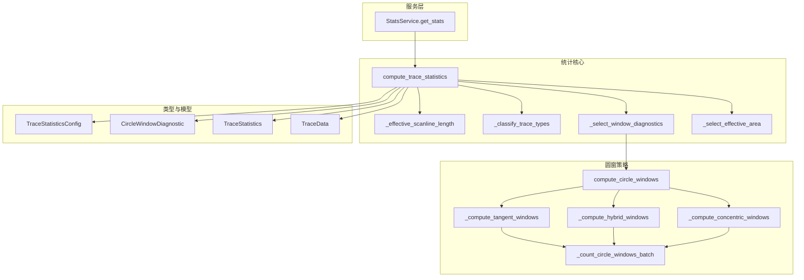
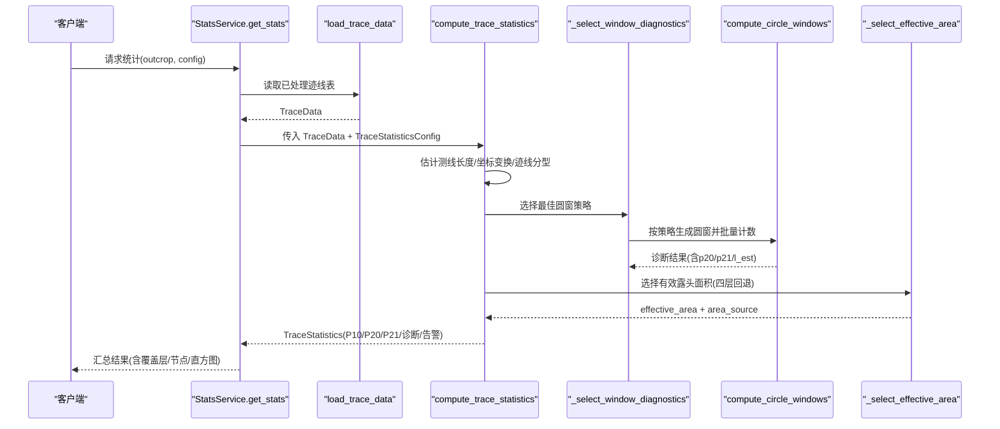
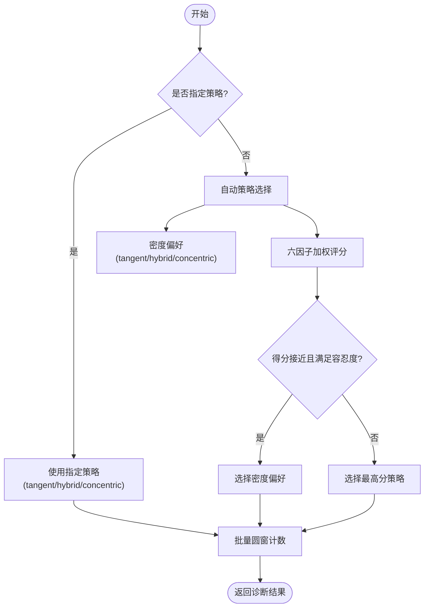
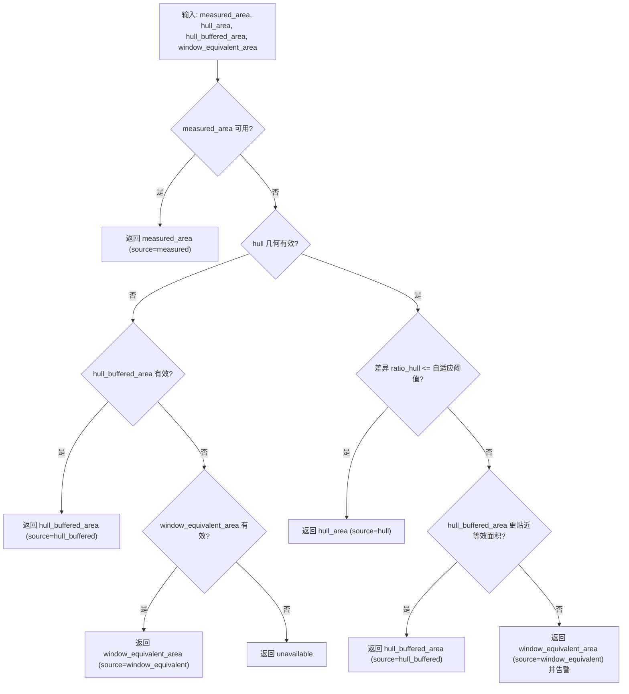
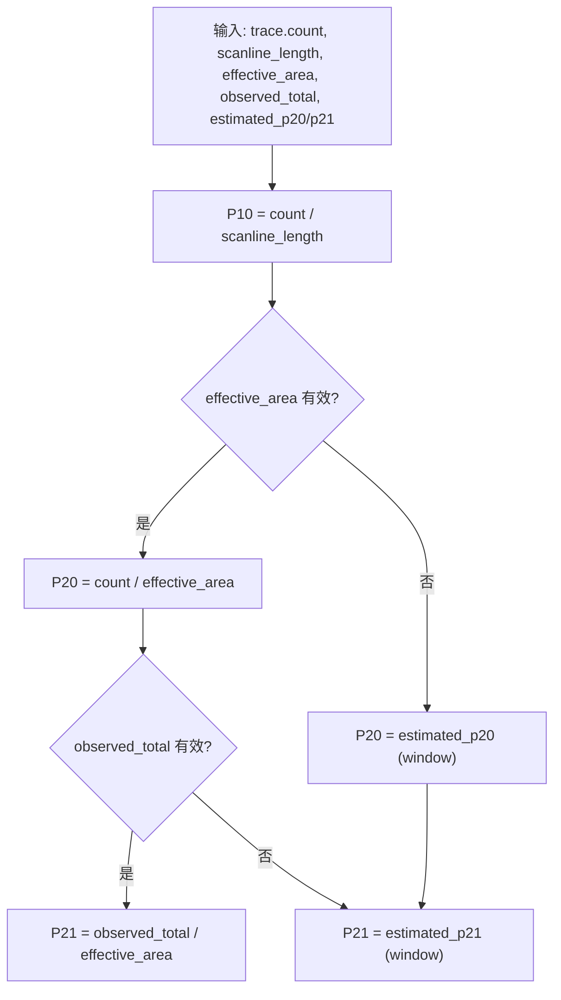
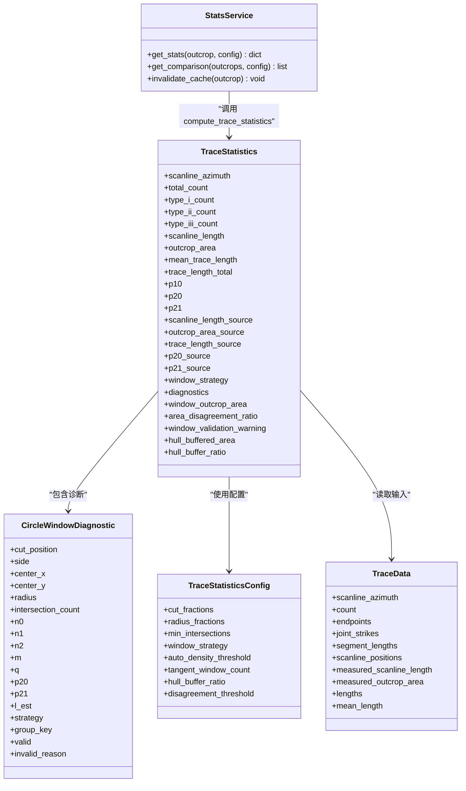

# 密度统计API

<cite>
**本文引用的文件列表**
- [stats_service.py](file://backend/services/stats_service.py)
- [statistics.py](file://trace_pipeline/geology/statistics.py)
- [_stat_types.py](file://trace_pipeline/geology/_stat_types.py)
- [_circle_window.py](file://trace_pipeline/geology/_circle_window.py)
- [_window_scoring.py](file://trace_pipeline/geology/_window_scoring.py)
- [_window_strategies.py](file://trace_pipeline/geology/_window_strategies.py)
- [models.py](file://trace_pipeline/models.py)
- [test_statistics.py](file://tests/test_statistics.py)
</cite>

## 目录
1. [简介](#简介)
2. [项目结构](#项目结构)
3. [核心组件](#核心组件)
4. [架构总览](#架构总览)
5. [详细组件分析](#详细组件分析)
6. [依赖关系分析](#依赖关系分析)
7. [性能与实现特性](#性能与实现特性)
8. [使用示例与场景](#使用示例与场景)
9. [结果解释与质量评估](#结果解释与质量评估)
10. [故障排查指南](#故障排查指南)
11. [结论](#结论)

## 简介
本指南面向需要调用“密度统计API”的用户，聚焦 P₁₀、P₂₀、P₂₁ 三项密度的计算方法、参数配置与回退策略。文档深入解析 compute_trace_statistics 函数的实现逻辑，包括测线长度估计、露头面积选择策略（实测→凸包→缓冲凸包→圆窗等效面积）以及自适应阈值机制，并提供不同数据场景下的计算示例与结果解读方法。

## 项目结构
与密度统计相关的核心代码位于 geology 子模块与后端服务中：
- 服务层：提供带缓存的统计数据接口，封装 compute_trace_statistics 调用并返回前端可用的结构化结果。
- 统计核心：compute_trace_statistics 作为主入口，串联测线长度估计、迹线分型、圆窗诊断、面积选择与指标聚合。
- 圆窗策略：三种布局（切圆、混合、同心）及自动评分选择。
- 数据类型：TraceStatisticsConfig、CircleWindowDiagnostic、TraceStatistics 等不可变数据结构。

图表来源
- [stats_service.py:101-342](file://backend/services/stats_service.py#L101-L342)
- [statistics.py:212-391](file://trace_pipeline/geology/statistics.py#L212-L391)
- [_window_scoring.py:235-323](file://trace_pipeline/geology/_window_scoring.py#L235-L323)
- [_window_strategies.py:173-185](file://trace_pipeline/geology/_window_strategies.py#L173-L185)
- [_circle_window.py:71-216](file://trace_pipeline/geology/_circle_window.py#L71-L216)
- [_stat_types.py:14-125](file://trace_pipeline/geology/_stat_types.py#L14-L125)
- [models.py:41-157](file://trace_pipeline/models.py#L41-L157)

章节来源
- [stats_service.py:101-342](file://backend/services/stats_service.py#L101-L342)
- [statistics.py:212-391](file://trace_pipeline/geology/statistics.py#L212-L391)

## 核心组件
- TraceStatisticsConfig：控制窗口策略、半径分数、最小相交数、自动密度阈值、切圆数量、凸包缓冲比例、不一致阈值等。
- CircleWindowDiagnostic：单个圆窗的诊断结果，包含相交计数、n0/n1/n2、m/q、p20/p21/l_est、有效性标志与原因。
- TraceStatistics：最终统计输出，包含 P₁₀/P₂₀/P₂₁、平均迹长、测线长度、露头面积及其来源、窗口策略、诊断信息、一致性告警等。
- StatsService.get_stats：对外暴露的统计接口，负责加载数据、构造配置、调用 compute_trace_statistics、组装可视化覆盖层与节点识别结果，并带缓存。

章节来源
- [_stat_types.py:14-125](file://trace_pipeline/geology/_stat_types.py#L14-L125)
- [statistics.py:212-391](file://trace_pipeline/geology/statistics.py#L212-L391)
- [stats_service.py:101-342](file://backend/services/stats_service.py#L101-L342)

## 架构总览
下图展示从 API 到统计计算的完整流程，包括关键分支与回退路径。

图表来源
- [stats_service.py:101-342](file://backend/services/stats_service.py#L101-L342)
- [statistics.py:212-391](file://trace_pipeline/geology/statistics.py#L212-L391)
- [_window_scoring.py:235-323](file://trace_pipeline/geology/_window_scoring.py#L235-L323)
- [_window_strategies.py:173-185](file://trace_pipeline/geology/_window_strategies.py#L173-L185)

## 详细组件分析

### 测线长度估计与坐标变换
- 优先使用实测测线长度；缺失时基于 scanline_positions 的间距中位数估算末端位置，得到有限段 [0, L_hat]。
- 将端点坐标旋转到以测线方向为 x 轴的局部坐标系，便于后续几何判断与圆窗布局。

章节来源
- [statistics.py:51-78](file://trace_pipeline/geology/statistics.py#L51-L78)

### 迹线分型（I/II/III）
- I 型：迹线段与测线实际相交。
- II 型：迹线延长线与测线延长线相交但迹线段不穿过测线。
- III 型：平行且不穿过测线。
- 该分类用于后续圆窗计数中的 n0/n1/n2 统计与 l_est 估计。

章节来源
- [_circle_window.py:12-66](file://trace_pipeline/geology/_circle_window.py#L12-L66)

### 圆窗策略与自动选择
- 三种策略：
  - tangent：沿测线两侧放置切圆，数量由 tangent_window_count 控制。
  - hybrid：在多个切割位置与左右侧组合，按 radius_fractions 生成多组窗口。
  - concentric：以测线中点为中心，按 radius_fractions 生成同心圆。
- 自动选择：
  - 先根据粗略面密度与期望相交数进行偏好选择（tangent/hybrid/concentric）。
  - 对三种策略分别打分（有效分组数、空间覆盖、稳定性、样本充分性、半径大小），择优；若存在并列，倾向密度偏好策略。
- 批量计数：向量化计算所有线段到所有圆心的距离矩阵，一次性得出相交情况与 p20/p21/l_est。

图表来源
- [_window_scoring.py:209-323](file://trace_pipeline/geology/_window_scoring.py#L209-L323)
- [_window_strategies.py:52-185](file://trace_pipeline/geology/_window_strategies.py#L52-L185)
- [_circle_window.py:71-216](file://trace_pipeline/geology/_circle_window.py#L71-L216)

章节来源
- [_window_scoring.py:178-323](file://trace_pipeline/geology/_window_scoring.py#L178-L323)
- [_window_strategies.py:173-185](file://trace_pipeline/geology/_window_strategies.py#L173-L185)
- [_circle_window.py:71-216](file://trace_pipeline/geology/_circle_window.py#L71-L216)

### 露头面积选择策略（四层回退）
- 层1：实测面积（最可靠，绝不降级）。
- 层2：原始凸包面积（需几何质量合格），并与圆窗等效面积比较差异；若差异小于自适应阈值则采用凸包，否则尝试缓冲凸包。
- 层3：缓冲凸包面积（以 mean_trace_length × hull_buffer_ratio 为缓冲距离）。
- 层4：圆窗等效面积（由 trace_count / window_p20 反推）。
- 当凸包与圆窗等效面积差异较大时，给出降级告警。

图表来源
- [statistics.py:106-166](file://trace_pipeline/geology/statistics.py#L106-L166)

章节来源
- [statistics.py:106-166](file://trace_pipeline/geology/statistics.py#L106-L166)

### 自适应阈值机制
- 面积降级阈值：随迹线数量增加而降低，避免小样本下过度严格。
- P20/P21 一致性校验阈值：同样随样本量衰减，用于比较主指标与圆窗估计值的一致性。

章节来源
- [statistics.py:84-94](file://trace_pipeline/geology/statistics.py#L84-L94)

### P₁₀/P₂₀/P₂₁ 计算与来源优先级
- P₁₀（线密度）：trace_count / scanline_length。
- P₂₀（面密度）：
  - 首选：trace_count / effective_area（effective_area 来自四层回退）。
  - 次选：圆窗估计的 p20（当 effective_area 不可用）。
- P₂₁（累计长度密度）：
  - 首选：observed_total / effective_area（observed_total 优先 segment_lengths，其次 endpoint lengths）。
  - 次选：圆窗估计的 p21（当 observed_total 不可用或 effective_area 不可用）。
- 观测迹长总长度回退链：segment(r5+r7) → endpoint(欧氏距离) → window(l_est × count)。

图表来源
- [statistics.py:289-312](file://trace_pipeline/geology/statistics.py#L289-L312)

章节来源
- [statistics.py:289-312](file://trace_pipeline/geology/statistics.py#L289-L312)

### 一致性校验与告警
- 当主 P20/P21 与圆窗估计值差异超过自适应阈值时，生成 window_validation_warning，提示潜在的不一致。

章节来源
- [statistics.py:313-336](file://trace_pipeline/geology/statistics.py#L313-L336)

## 依赖关系分析
- 服务层依赖统计核心与可视化覆盖层构建函数，同时集成节点识别。
- 统计核心依赖圆窗策略与评分模块，后者再依赖具体策略实现与批量计数。
- 数据类型集中在 _stat_types.py，TraceData 定义于 models.py。

图表来源
- [_stat_types.py:14-125](file://trace_pipeline/geology/_stat_types.py#L14-L125)
- [models.py:41-157](file://trace_pipeline/models.py#L41-L157)
- [stats_service.py:101-342](file://backend/services/stats_service.py#L101-L342)

章节来源
- [_stat_types.py:14-125](file://trace_pipeline/geology/_stat_types.py#L14-L125)
- [models.py:41-157](file://trace_pipeline/models.py#L41-L157)
- [stats_service.py:101-342](file://backend/services/stats_service.py#L101-L342)

## 性能与实现特性
- 向量化批量圆窗计数：通过广播计算距离矩阵，减少 Python 循环开销。
- 缓存：StatsService 使用 TTLCache，键仅包含影响统计的关键配置与输入文件指纹，避免无关字段导致缓存失效。
- 日志与调试：关键步骤记录策略、来源与耗时，便于定位问题。

章节来源
- [_circle_window.py:71-216](file://trace_pipeline/geology/_circle_window.py#L71-L216)
- [stats_service.py:35-100](file://backend/services/stats_service.py#L35-L100)

## 使用示例与场景
以下示例说明在不同数据条件下，P₁₀/P₂₀/P₂₁ 的来源优先级与回退链。

- 场景A：具备实测测线长度与实测露头面积
  - P₁₀：使用实测测线长度。
  - P₂₀：使用实测面积。
  - P₂₁：使用观测迹长总和（segment 优先，否则 endpoint）。
  - 预期：area_source="measured"，无降级告警。

- 场景B：仅有实测测线长度，无实测面积
  - P₁₀：使用实测测线长度。
  - P₂₀：优先使用凸包面积；若与圆窗等效面积差异过大，可能降级至缓冲凸包或圆窗等效面积。
  - P₂₁：同上，结合观测迹长总和。
  - 预期：area_source 可能为 "hull"/"hull_buffered"/"window_equivalent"，可能出现降级告警。

- 场景C：无实测测线长度，仅有迹线端点与扫描位置
  - P₁₀：使用估计测线长度。
  - P₂₀/P₂₁：遵循上述面积与迹长回退链。
  - 预期：scanline_length_source="estimated"。

- 场景D：低密度数据（期望相交数不足）
  - 自动策略偏好 tangent；若仍无效，回退到最保守策略。
  - 预期：window_strategy="tangent"，诊断中 valid_window_count 较低。

- 场景E：高密度数据
  - 自动策略偏好 concentric；若评分更高，可能选择 hybrid。
  - 预期：window_strategy 可能为 "concentric" 或 "hybrid"。

章节来源
- [test_statistics.py:256-292](file://tests/test_statistics.py#L256-L292)
- [_window_scoring.py:209-323](file://trace_pipeline/geology/_window_scoring.py#L209-L323)

## 结果解释与质量评估
- 关键输出字段
  - p10/p20/p21：线密度、面密度、累计长度密度。
  - outcrop_area/outcrop_area_source：有效露头面积及其来源。
  - scanline_length/scanline_length_source：测线长度及其来源。
  - trace_length_total/trace_length_source：观测迹长总和及其来源。
  - window_strategy：所选圆窗策略。
  - diagnostics：各圆窗的诊断详情（可用于可视化与回溯）。
  - window_validation_warning：一致性校验告警。
- 质量评估建议
  - 检查 area_source 是否为 "measured"；若非实测，关注降级告警与 area_disagreement_ratio。
  - 观察 valid_window_count 与 intersection_count，确保样本充分性。
  - 对比主 P20/P21 与圆窗估计值，若出现一致性告警，应复核数据质量或调整 min_intersections/auto_density_threshold。
  - 对于低密度场景，优先使用 tangent 策略并确保足够的切圆数量。

章节来源
- [statistics.py:358-391](file://trace_pipeline/geology/statistics.py#L358-L391)
- [stats_service.py:229-342](file://backend/services/stats_service.py#L229-L342)

## 故障排查指南
- 常见问题
  - 输入为空或不含迹线：返回错误提示，需检查数据加载与文件名匹配。
  - NaN/Inf 数据：在测线长度估计或数据校验阶段抛出异常，需清理数据。
  - 圆窗无效：相交数不足或 m/q 不合法，需调整 min_intersections 或扩大半径分数。
  - 面积不一致告警：凸包与圆窗等效面积差异大，考虑改用缓冲凸包或接受圆窗等效面积。
- 定位手段
  - 查看日志中的 stage 与 key 字段，确认缓存命中与计算耗时。
  - 检查 diagnostics 中的 invalid_reason 与 group_key，定位失败窗口。
  - 调整配置后重新计算，验证 window_strategy 与 area_source 的变化。

章节来源
- [stats_service.py:101-142](file://backend/services/stats_service.py#L101-L142)
- [_circle_window.py:219-249](file://trace_pipeline/geology/_circle_window.py#L219-L249)
- [statistics.py:336-356](file://trace_pipeline/geology/statistics.py#L336-L356)

## 结论
密度统计API通过稳健的回退链与自适应阈值机制，在多种数据条件下稳定输出 P₁₀/P₂₀/P₂₁。用户可通过合理配置 window_strategy、auto_density_threshold、min_intersections 等参数，优化不同场景下的计算质量。结合 diagnostics 与一致性告警，可进一步评估结果可靠性并进行针对性调优。