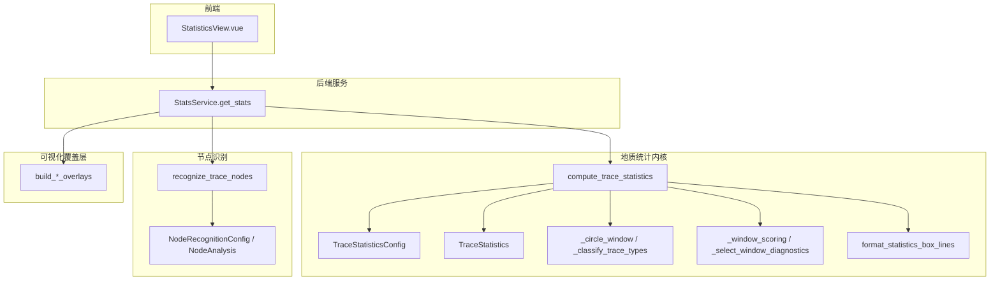
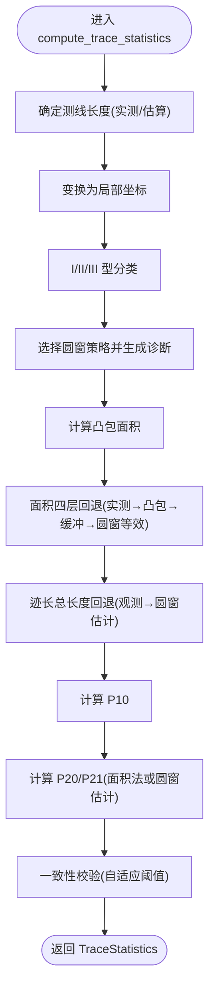
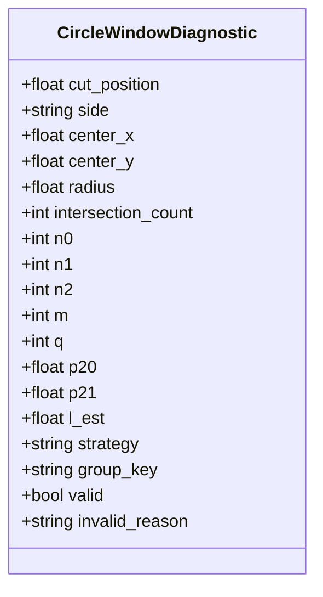
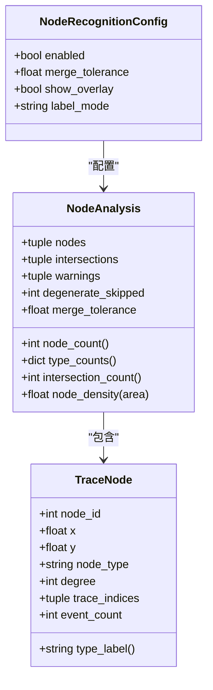
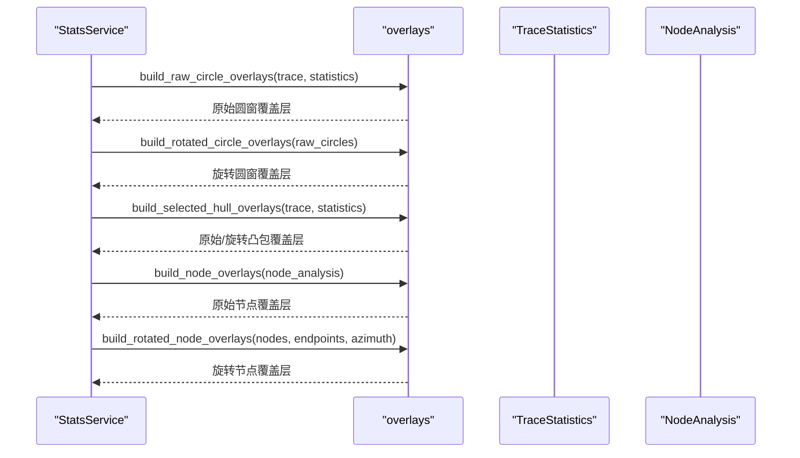
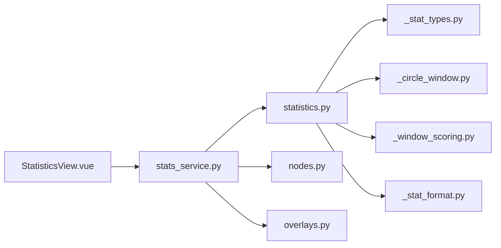

# 统计分析API

<cite>
**本文引用的文件**   
- [statistics.py](file://trace_pipeline/geology/statistics.py)
- [_stat_types.py](file://trace_pipeline/geology/_stat_types.py)
- [_stat_format.py](file://trace_pipeline/geology/_stat_format.py)
- [_circle_window.py](file://trace_pipeline/geology/_circle_window.py)
- [_window_scoring.py](file://trace_pipeline/geology/_window_scoring.py)
- [nodes.py](file://trace_pipeline/analysis/nodes.py)
- [models.py](file://trace_pipeline/analysis/models.py)
- [overlays.py](file://trace_pipeline/plotting/overlays.py)
- [stats_service.py](file://backend/services/stats_service.py)
- [StatisticsView.vue](file://frontend/src/views/StatisticsView.vue)
- [test_statistics.py](file://tests/test_statistics.py)
</cite>

## 目录
1. [简介](#简介)
2. [项目结构](#项目结构)
3. [核心组件](#核心组件)
4. [架构总览](#架构总览)
5. [详细组件分析](#详细组件分析)
6. [依赖关系分析](#依赖关系分析)
7. [性能与稳定性](#性能与稳定性)
8. [可视化与导出](#可视化与导出)
9. [故障排查](#故障排查)
10. [结论](#结论)
11. [附录：配置项速查](#附录配置项速查)

## 简介
本指南面向需要调用和集成“统计分析API”的开发者与地质数据分析师，聚焦以下目标：
- 深入介绍 compute_trace_statistics、format_statistics_box_lines 等统计计算函数的使用方法
- 详细说明 TraceStatistics 与 TraceStatisticsConfig 的配置选项与计算参数
- 提供密度统计（P₁₀/P₂₀/P₂₁）、平均迹长估计、圆窗策略选择的完整示例路径
- 说明节点识别算法的参数配置与结果解读
- 给出统计结果的可视化与导出方法

## 项目结构
统计分析能力由后端服务层、地质统计内核、绘图覆盖层与前端展示共同组成。关键模块如下：
- 后端服务：StatsService 负责加载数据、构建配置、调用统计内核、缓存结果并组装可视化所需几何
- 地质统计内核：statistics.py 为主入口；_stat_types.py 定义数据模型；_circle_window.py 实现圆窗计数与分型；_window_scoring.py 实现策略评分与自动选择；_stat_format.py 提供格式化输出
- 节点识别：analysis/nodes.py 与 analysis/models.py 提供节点检测与类型标注
- 可视化覆盖层：plotting/overlays.py 将统计结果转换为原始/旋转坐标系下的覆盖层几何
- 前端展示：frontend/src/views/StatisticsView.vue 渲染卡片、直方图、饼图与图片查看器



图表来源
- [stats_service.py:101-150](file://backend/services/stats_service.py#L101-L150)
- [statistics.py:212-391](file://trace_pipeline/geology/statistics.py#L212-L391)
- [_stat_types.py:14-65](file://trace_pipeline/geology/_stat_types.py#L14-L65)
- [_circle_window.py:12-66](file://trace_pipeline/geology/_circle_window.py#L12-L66)
- [_window_scoring.py:235-323](file://trace_pipeline/geology/_window_scoring.py#L235-L323)
- [_stat_format.py:29-42](file://trace_pipeline/geology/_stat_format.py#L29-L42)
- [nodes.py:160-210](file://trace_pipeline/analysis/nodes.py#L160-L210)
- [models.py:22-36](file://trace_pipeline/analysis/models.py#L22-L36)
- [overlays.py:33-114](file://trace_pipeline/plotting/overlays.py#L33-L114)
- [StatisticsView.vue:1-120](file://frontend/src/views/StatisticsView.vue#L1-L120)

章节来源
- [stats_service.py:101-150](file://backend/services/stats_service.py#L101-L150)
- [statistics.py:212-391](file://trace_pipeline/geology/statistics.py#L212-L391)
- [_stat_types.py:14-65](file://trace_pipeline/geology/_stat_types.py#L14-L65)
- [_circle_window.py:12-66](file://trace_pipeline/geology/_circle_window.py#L12-L66)
- [_window_scoring.py:235-323](file://trace_pipeline/geology/_window_scoring.py#L235-L323)
- [_stat_format.py:29-42](file://trace_pipeline/geology/_stat_format.py#L29-L42)
- [nodes.py:160-210](file://trace_pipeline/analysis/nodes.py#L160-L210)
- [models.py:22-36](file://trace_pipeline/analysis/models.py#L22-L36)
- [overlays.py:33-114](file://trace_pipeline/plotting/overlays.py#L33-L114)
- [StatisticsView.vue:1-120](file://frontend/src/views/StatisticsView.vue#L1-L120)

## 核心组件
- 主计算函数
  - compute_trace_statistics(trace, config=None): 基于测线局部坐标系计算 I/II/III 型裂隙数、测线长度、露头面积、平均迹长、P₁₀/P₂₀/P₂₁ 等指标，并返回 TraceStatistics
  - format_statistics_box_lines(stats): 将统计结果格式化为文本框显示的核心指标行
- 数据类型
  - TraceStatisticsConfig: 控制圆窗策略、半径/切点数量、最小相交数、凸包缓冲比例、不一致阈值等
  - TraceStatistics: 包含所有统计指标、来源标记、诊断信息、窗口策略等
  - CircleWindowDiagnostic: 单个圆窗的计数与有效性诊断
- 节点识别
  - recognize_trace_nodes(endpoints, config): 识别 I/Y/X 三类节点，返回 NodeAnalysis
  - NodeRecognitionConfig: 控制是否启用、合并容差、标签模式等

章节来源
- [statistics.py:212-391](file://trace_pipeline/geology/statistics.py#L212-L391)
- [_stat_types.py:14-125](file://trace_pipeline/geology/_stat_types.py#L14-L125)
- [_stat_format.py:29-42](file://trace_pipeline/geology/_stat_format.py#L29-L42)
- [nodes.py:160-210](file://trace_pipeline/analysis/nodes.py#L160-L210)
- [models.py:22-36](file://trace_pipeline/analysis/models.py#L22-L36)

## 架构总览
下图展示了从后端服务到统计内核、节点识别与可视化覆盖层的调用链。

```mermaid
sequenceDiagram
participant Client as "前端/客户端"
participant Service as "StatsService"
participant Geo as "compute_trace_statistics"
participant Win as "_select_window_diagnostics"
participant CWin as "_classify_trace_types"
participant Hull as "凸包/缓冲面积"
participant Nodes as "recognize_trace_nodes"
participant Over as "build_*_overlays"
Client->>Service : get_stats(outcrop, config)
Service->>Geo : 构造 TraceStatisticsConfig 并调用
Geo->>CWin : 分类 I/II/III 型
Geo->>Win : 选择最佳圆窗策略并生成诊断
Geo->>Hull : 计算凸包/缓冲面积
Geo-->>Service : 返回 TraceStatistics
Service->>Nodes : 识别节点
Service->>Over : 构建原始/旋转覆盖层
Service-->>Client : 返回统计+直方图+覆盖层+节点
```

图表来源
- [stats_service.py:101-150](file://backend/services/stats_service.py#L101-L150)
- [statistics.py:212-391](file://trace_pipeline/geology/statistics.py#L212-L391)
- [_window_scoring.py:235-323](file://trace_pipeline/geology/_window_scoring.py#L235-L323)
- [_circle_window.py:12-66](file://trace_pipeline/geology/_circle_window.py#L12-L66)
- [nodes.py:160-210](file://trace_pipeline/analysis/nodes.py#L160-L210)
- [overlays.py:33-114](file://trace_pipeline/plotting/overlays.py#L33-L114)

## 详细组件分析

### 统计主流程与关键指标
- 输入
  - trace: TraceData（包含端点、走向、测线方位角、可选实测测线长度与露头面积）
  - config: TraceStatisticsConfig（圆窗策略、半径分数、切点数量、最小相交数、凸包缓冲比例、不一致阈值等）
- 处理要点
  - 测线长度优先使用实测值，否则按位置间距估算
  - 坐标变换至测线局部坐标系，进行 I/II/III 型分类
  - 圆窗策略自动或指定：tangent/hybrid/concentric，依据六因子加权评分选择
  - 露头面积四层回退：实测 → 凸包 → 缓冲凸包 → 圆窗等效面积
  - 迹长总长度回退链：观测段长/端点距离 → 圆窗估计均值×数量
  - P₁₀ = 迹线数/测线长度；P₂₀/P₂₁ 根据有效面积或圆窗估计得出
  - 一致性校验：主 P₂₀/P₂₁ 与圆窗估计差异超过自适应阈值时发出警告
- 输出
  - TraceStatistics：包含各指标、来源标记、诊断、窗口策略、缓冲面积等



图表来源
- [statistics.py:212-391](file://trace_pipeline/geology/statistics.py#L212-L391)
- [_window_scoring.py:235-323](file://trace_pipeline/geology/_window_scoring.py#L235-L323)
- [_circle_window.py:12-66](file://trace_pipeline/geology/_circle_window.py#L12-L66)

章节来源
- [statistics.py:212-391](file://trace_pipeline/geology/statistics.py#L212-L391)
- [_stat_types.py:14-125](file://trace_pipeline/geology/_stat_types.py#L14-L125)
- [_stat_format.py:29-42](file://trace_pipeline/geology/_stat_format.py#L29-L42)

### 圆窗策略与诊断
- 策略族
  - tangent：沿测线切点布置圆窗
  - hybrid：混合策略
  - concentric：同心圆窗
- 自动选择
  - 先按密度偏好预筛选，再对三种策略分别生成诊断，采用六因子加权评分（有效分组、空间覆盖、稳定性、样本充分性、半径等）择优
  - 当无有效候选或非正得分时回退到最保守策略
- 诊断字段
  - 每个圆窗包含中心、半径、相交数、n0/n1/n2、m/q、p20/p21/l_est、有效性及原因



图表来源
- [_stat_types.py:67-89](file://trace_pipeline/geology/_stat_types.py#L67-L89)
- [_circle_window.py:71-216](file://trace_pipeline/geology/_circle_window.py#L71-L216)
- [_window_scoring.py:178-206](file://trace_pipeline/geology/_window_scoring.py#L178-L206)

章节来源
- [_circle_window.py:71-216](file://trace_pipeline/geology/_circle_window.py#L71-L216)
- [_window_scoring.py:235-323](file://trace_pipeline/geology/_window_scoring.py#L235-L323)

### 节点识别算法
- 功能
  - 识别 I 型（孤立端点）、Y 型（三叉节点）、X 型（交叉节点）
  - 支持端点接近聚类合并，输出节点列表与相交事件
- 关键参数
  - enabled：是否启用
  - merge_tolerance：合并容差（影响聚类网格大小与退化过滤）
  - label_mode：标签模式（none/type/id）
  - show_overlay：是否生成覆盖层
- 输出
  - NodeAnalysis：包含 nodes、intersections、warnings、degenerate_skipped、merge_tolerance 等



图表来源
- [models.py:22-98](file://trace_pipeline/analysis/models.py#L22-L98)
- [nodes.py:160-210](file://trace_pipeline/analysis/nodes.py#L160-L210)

章节来源
- [nodes.py:160-210](file://trace_pipeline/analysis/nodes.py#L160-L210)
- [models.py:22-98](file://trace_pipeline/analysis/models.py#L22-L98)

### 可视化覆盖层
- 作用
  - 将统计诊断中的圆窗、选定的凸包（含缓冲）以及节点识别结果转换为原始/旋转坐标系下的覆盖层几何
- 主要函数
  - build_raw_circle_overlays / build_rotated_circle_overlays
  - build_selected_hull_overlays
  - build_node_overlays / build_rotated_node_overlays



图表来源
- [overlays.py:33-156](file://trace_pipeline/plotting/overlays.py#L33-L156)
- [stats_service.py:170-215](file://backend/services/stats_service.py#L170-L215)

章节来源
- [overlays.py:33-156](file://trace_pipeline/plotting/overlays.py#L33-L156)
- [stats_service.py:170-215](file://backend/services/stats_service.py#L170-L215)

## 依赖关系分析
- 耦合与内聚
  - stats_service.py 作为编排层，低耦合地组合统计内核、节点识别与覆盖层构建
  - statistics.py 内部通过子模块划分职责（圆窗、评分、格式化），内聚良好
- 外部依赖
  - numpy 用于向量化计算
  - 前端通过 API 获取统计数据与覆盖层几何，渲染图表与图片
- 潜在循环依赖
  - overlays.py 在类型检查中引用 models/statistics，但运行时通过延迟导入避免循环



图表来源
- [stats_service.py:101-150](file://backend/services/stats_service.py#L101-L150)
- [statistics.py:212-391](file://trace_pipeline/geology/statistics.py#L212-L391)
- [_stat_types.py:14-65](file://trace_pipeline/geology/_stat_types.py#L14-L65)
- [_circle_window.py:12-66](file://trace_pipeline/geology/_circle_window.py#L12-L66)
- [_window_scoring.py:235-323](file://trace_pipeline/geology/_window_scoring.py#L235-L323)
- [_stat_format.py:29-42](file://trace_pipeline/geology/_stat_format.py#L29-L42)
- [nodes.py:160-210](file://trace_pipeline/analysis/nodes.py#L160-L210)
- [overlays.py:33-114](file://trace_pipeline/plotting/overlays.py#L33-L114)
- [StatisticsView.vue:1-120](file://frontend/src/views/StatisticsView.vue#L1-L120)

章节来源
- [stats_service.py:101-150](file://backend/services/stats_service.py#L101-L150)
- [statistics.py:212-391](file://trace_pipeline/geology/statistics.py#L212-L391)
- [_stat_types.py:14-65](file://trace_pipeline/geology/_stat_types.py#L14-L65)
- [_circle_window.py:12-66](file://trace_pipeline/geology/_circle_window.py#L12-L66)
- [_window_scoring.py:235-323](file://trace_pipeline/geology/_window_scoring.py#L235-L323)
- [_stat_format.py:29-42](file://trace_pipeline/geology/_stat_format.py#L29-L42)
- [nodes.py:160-210](file://trace_pipeline/analysis/nodes.py#L160-L210)
- [overlays.py:33-114](file://trace_pipeline/plotting/overlays.py#L33-L114)
- [StatisticsView.vue:1-120](file://frontend/src/views/StatisticsView.vue#L1-L120)

## 性能与稳定性
- 向量化优化
  - 圆窗计数批量计算利用广播矩阵，减少 Python 循环开销
  - 节点识别采用包围盒快速筛选与网格聚类，降低 O(N²) 精确检测成本
- 自适应阈值
  - 面积降级与一致性校验阈值随样本量衰减，提升小样本稳健性与大样本严格性
- 缓存机制
  - StatsService 内置 TTL 缓存，键仅包含影响统计的关键配置与输入文件指纹，避免无关字段导致失效

[本节为通用指导，不直接分析具体文件]

## 可视化与导出
- 前端展示
  - 统计卡片：显示 P₁₀/P₂₀/P₂₁、平均迹长、I/II/III 型计数等
  - 直方图与饼图：迹长分布与类型占比
  - 图片面板：原始/旋转迹线图与玫瑰图（若已导出）
  - 告警提示：根据 area_source 与 warning 动态显示面积来源变更与一致性告警
- 覆盖层叠加
  - 圆窗、凸包（含缓冲）与节点在原始与旋转坐标系下均可叠加显示
- 报告导出
  - 前端提供“导出统计报告”按钮，触发后端生成报告（进度条与状态反馈）

章节来源
- [StatisticsView.vue:1-200](file://frontend/src/views/StatisticsView.vue#L1-L200)
- [overlays.py:33-156](file://trace_pipeline/plotting/overlays.py#L33-L156)

## 故障排查
- 常见问题
  - 测线长度为 NaN/inf：会抛出异常，需检查 scanline_positions 数据质量
  - 无迹线数据：返回错误提示，确认输入 Excel 是否存在且包含迹线
  - 面积来源降级：当凸包与圆窗等效面积差异过大或几何无效时，会自动降级并记录警告
  - 一致性告警：主 P₂₀/P₂₁ 与圆窗估计差异超过自适应阈值时，前端会显示告警
- 定位建议
  - 查看 diagnostics 中 valid 与 invalid_reason，判断圆窗策略与样本充分性
  - 检查 outcrop_area_source 与 window_strategy，理解面积与策略选择逻辑
  - 关注 nodes_summary 与 warnings，了解退化线段跳过与聚类容差设置

章节来源
- [statistics.py:212-391](file://trace_pipeline/geology/statistics.py#L212-L391)
- [stats_service.py:101-150](file://backend/services/stats_service.py#L101-L150)
- [StatisticsView.vue:138-153](file://frontend/src/views/StatisticsView.vue#L138-L153)

## 结论
统计分析API以可配置的圆窗策略为核心，结合自适应阈值与多层回退机制，稳定输出 P₁₀/P₂₀/P₂₁ 与平均迹长等关键指标。配合节点识别与覆盖层构建，形成从数据加载、统计计算、可视化到导出的完整闭环。合理配置 TraceStatisticsConfig 与 NodeRecognitionConfig，可在不同密度与几何条件下获得可靠结果。

[本节为总结，不直接分析具体文件]

## 附录：配置项速查
- TraceStatisticsConfig
  - cut_fractions：切割分数序列（位于 (0,1)）
  - radius_fractions：半径分数序列（正数）
  - min_intersections：最少相交迹线数（正整数）
  - window_strategy：auto/tangent/hybrid/concentric
  - auto_density_threshold：自动密度阈值（正数）
  - tangent_window_count：切点圆窗数量（正整数）
  - hull_buffer_ratio：凸包缓冲比例（非负）
  - disagreement_threshold：不一致阈值（正数或 None）
- NodeRecognitionConfig
  - enabled：是否启用节点识别
  - merge_tolerance：合并容差（正数）
  - show_overlay：是否生成覆盖层
  - label_mode：none/type/id

章节来源
- [_stat_types.py:14-65](file://trace_pipeline/geology/_stat_types.py#L14-L65)
- [models.py:22-36](file://trace_pipeline/analysis/models.py#L22-L36)