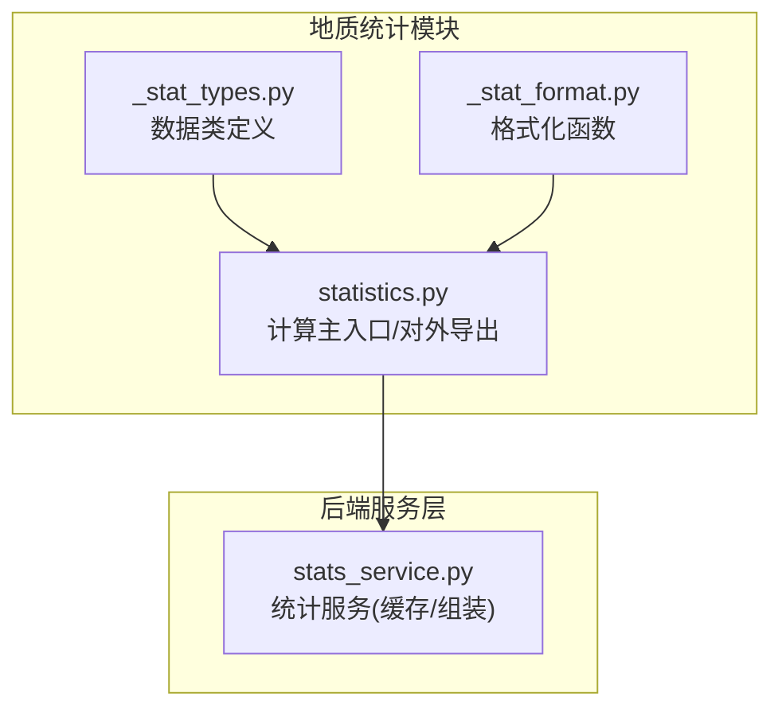
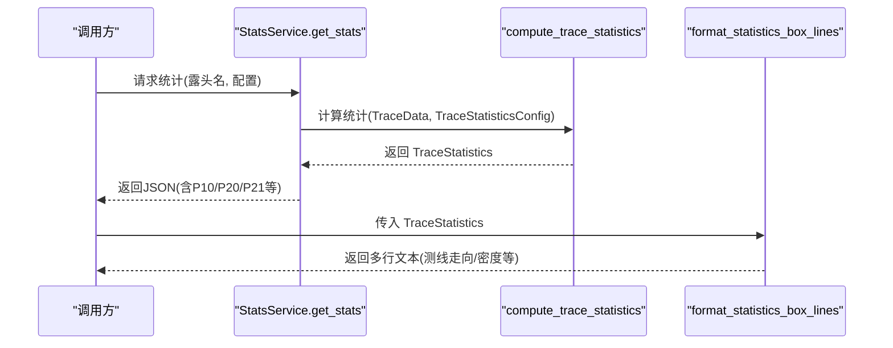
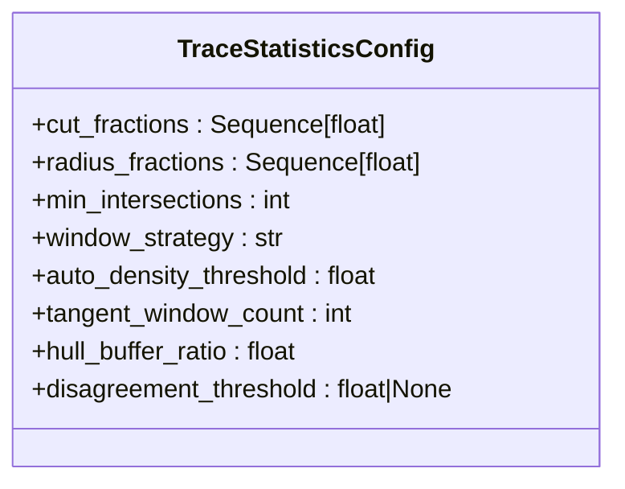
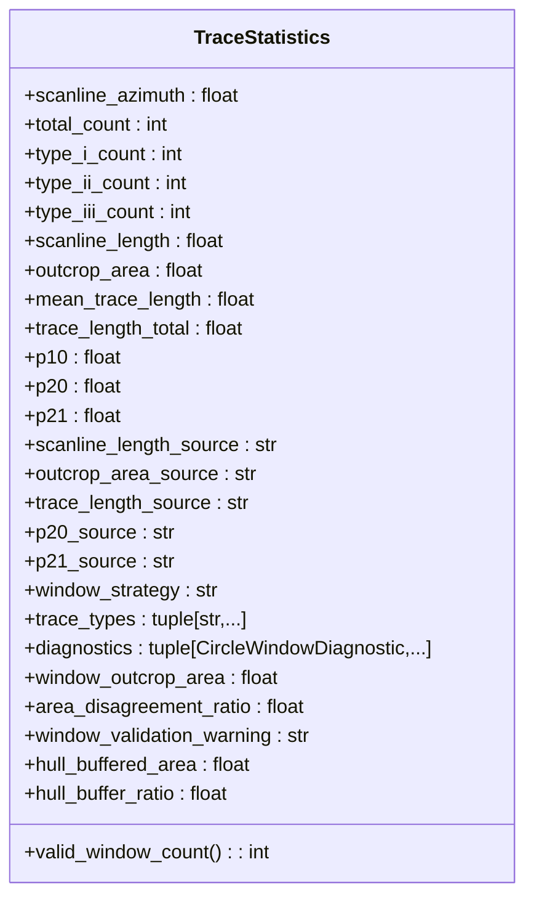
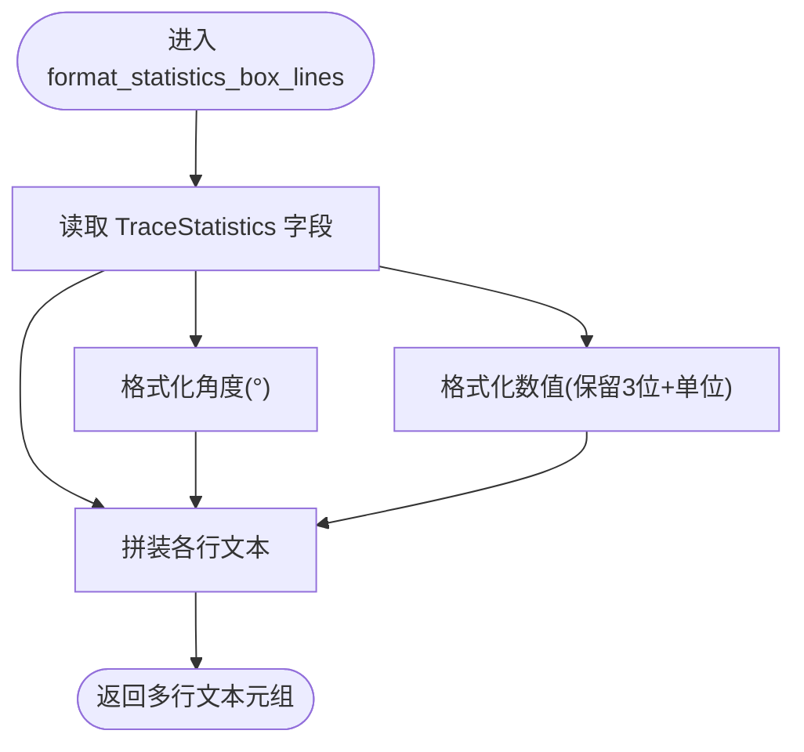
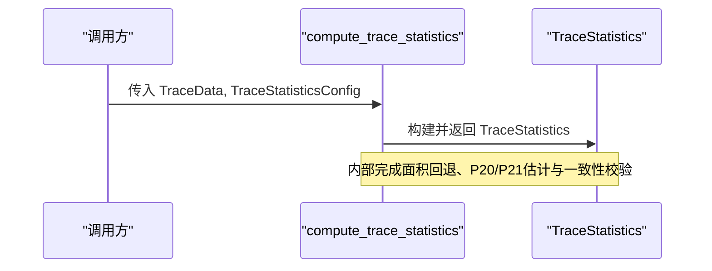
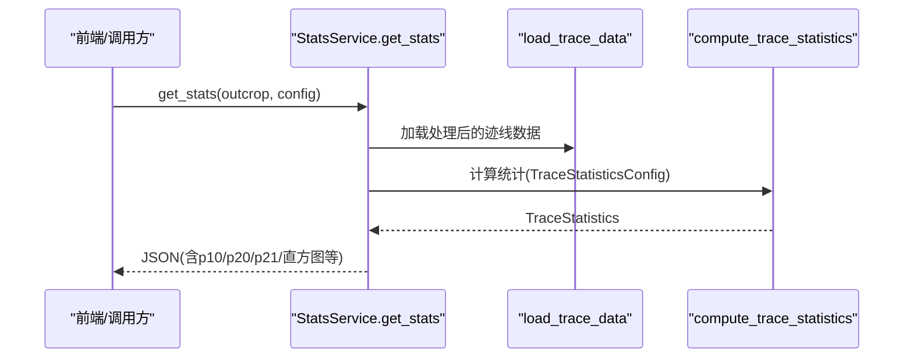
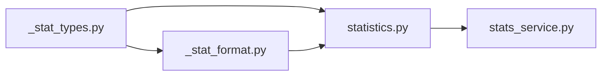

# 统计格式化API

<cite>
**本文引用的文件**   
- [trace_pipeline/geology/_stat_format.py](file://trace_pipeline/geology/_stat_format.py)
- [trace_pipeline/geology/_stat_types.py](file://trace_pipeline/geology/_stat_types.py)
- [trace_pipeline/geology/statistics.py](file://trace_pipeline/geology/statistics.py)
- [backend/services/stats_service.py](file://backend/services/stats_service.py)
</cite>

## 目录
1. [简介](#简介)
2. [项目结构](#项目结构)
3. [核心组件](#核心组件)
4. [架构总览](#架构总览)
5. [详细组件分析](#详细组件分析)
6. [依赖关系分析](#依赖关系分析)
7. [性能考虑](#性能考虑)
8. [故障排查指南](#故障排查指南)
9. [结论](#结论)
10. [附录](#附录)

## 简介
本指南聚焦于“统计格式化API”，围绕以下目标展开：
- 深入介绍 format_statistics_box_lines 函数的输出格式与字段定义
- 详细说明 TraceStatistics 与 TraceStatisticsConfig 数据类的属性与配置选项
- 提供统计结果的表格化输出与报告生成方法
- 包含自定义格式化模板与导出格式的扩展方法

该API位于地质统计模块中，负责将计算得到的迹线统计数据以简洁、可读的文本框形式呈现，同时为上层服务与前端展示提供结构化数据。

## 项目结构
与统计格式化相关的核心代码分布在 geology 子包与后端服务中：
- trace_pipeline/geology/_stat_format.py：统计结果格式化（文本行）
- trace_pipeline/geology/_stat_types.py：统计相关数据类型定义（TraceStatistics、TraceStatisticsConfig 等）
- trace_pipeline/geology/statistics.py：统计指标计算主入口（compute_trace_statistics），并对外暴露 format_statistics_box_lines
- backend/services/stats_service.py：后端统计服务，封装缓存、数据加载、统计计算与结果组装

图表来源
- [trace_pipeline/geology/_stat_types.py:1-125](file://trace_pipeline/geology/_stat_types.py#L1-L125)
- [trace_pipeline/geology/_stat_format.py:1-42](file://trace_pipeline/geology/_stat_format.py#L1-L42)
- [trace_pipeline/geology/statistics.py:1-45](file://trace_pipeline/geology/statistics.py#L1-L45)
- [backend/services/stats_service.py:1-40](file://backend/services/stats_service.py#L1-L40)

章节来源
- [trace_pipeline/geology/_stat_types.py:1-125](file://trace_pipeline/geology/_stat_types.py#L1-L125)
- [trace_pipeline/geology/_stat_format.py:1-42](file://trace_pipeline/geology/_stat_format.py#L1-L42)
- [trace_pipeline/geology/statistics.py:1-45](file://trace_pipeline/geology/statistics.py#L1-L45)
- [backend/services/stats_service.py:1-40](file://backend/services/stats_service.py#L1-L40)

## 核心组件
本节聚焦三个关键对象/函数：
- TraceStatisticsConfig：统计计算参数配置
- TraceStatistics：统计结果数据结构
- format_statistics_box_lines：将 TraceStatistics 转换为多行文本（用于统计框显示）

章节来源
- [trace_pipeline/geology/_stat_types.py:14-65](file://trace_pipeline/geology/_stat_types.py#L14-L65)
- [trace_pipeline/geology/_stat_types.py:91-125](file://trace_pipeline/geology/_stat_types.py#L91-L125)
- [trace_pipeline/geology/_stat_format.py:28-42](file://trace_pipeline/geology/_stat_format.py#L28-L42)

## 架构总览
从调用链看，format_statistics_box_lines 通常由上层逻辑在需要“统计框文本”时调用；而 compute_trace_statistics 负责产出 TraceStatistics 实例，供格式化函数消费。后端服务 stats_service.get_stats 则进一步将 TraceStatistics 映射为前端可用的 JSON 结构。

图表来源
- [backend/services/stats_service.py:101-150](file://backend/services/stats_service.py#L101-L150)
- [trace_pipeline/geology/statistics.py:212-240](file://trace_pipeline/geology/statistics.py#L212-L240)
- [trace_pipeline/geology/_stat_format.py:28-42](file://trace_pipeline/geology/_stat_format.py#L28-L42)

## 详细组件分析

### 组件A：TraceStatisticsConfig（统计计算参数）
- 作用：控制圆窗策略、阈值、最小相交数、凸包缓冲比例等
- 关键字段与默认值要点：
  - cut_fractions：切分比例序列，必须非空且取值在(0,1)
  - radius_fractions：半径比例序列，必须为正数
  - min_intersections：最小相交数，正整数
  - window_strategy：窗口策略，允许 auto/tangent/hybrid/concentric
  - auto_density_threshold：自动密度阈值，正数
  - tangent_window_count：切线窗数量，正整数
  - hull_buffer_ratio：凸包缓冲比例，非负数
  - disagreement_threshold：面积分歧阈值，正数或None（None表示自适应）
- 校验行为：在构造后对各项进行范围与类型校验，不合法将抛出异常

图表来源
- [trace_pipeline/geology/_stat_types.py:14-65](file://trace_pipeline/geology/_stat_types.py#L14-L65)

章节来源
- [trace_pipeline/geology/_stat_types.py:14-65](file://trace_pipeline/geology/_stat_types.py#L14-L65)

### 组件B：TraceStatistics（统计结果）
- 作用：承载一次统计计算的完整结果，包括计数、密度、面积来源、诊断信息等
- 核心字段（节选）：
  - scanline_azimuth：测线方位角
  - total_count / type_i_count / type_ii_count / type_iii_count：迹线总数与I/II/III型计数
  - scanline_length / outcrop_area：测线长度与露头面积
  - mean_trace_length / trace_length_total：平均迹长与总迹长
  - p10 / p20 / p21：线密度、面密度、累计长度密度
  - 各指标的 source 字段（如 scanline_length_source、outcrop_area_source、p20_source、p21_source）
  - window_strategy：实际采用的窗口策略
  - diagnostics：圆窗诊断明细
  - 校验告警与缓冲信息：window_validation_warning、hull_buffered_area、hull_buffer_ratio 等
- 便捷属性：
  - valid_window_count：有效圆窗数量

图表来源
- [trace_pipeline/geology/_stat_types.py:91-125](file://trace_pipeline/geology/_stat_types.py#L91-L125)

章节来源
- [trace_pipeline/geology/_stat_types.py:91-125](file://trace_pipeline/geology/_stat_types.py#L91-L125)

### 组件C：format_statistics_box_lines（统计框文本格式化）
- 输入：TraceStatistics 实例
- 输出：元组形式的多行字符串，每行一个“标签: 值”项
- 输出字段（顺序固定）：
  - 测线走向：角度（°）
  - 迹线数量：整数
  - 平均迹线长度：米（m），保留三位小数
  - I/II/III型裂隙数：三段计数拼接
  - 测线长度：米（m）
  - 露头面积：平方米（m²）
  - 线密度（P10）：单位 m⁻¹
  - 面密度（P20）：单位 m⁻²
  - 面累计长度密度（P21）：单位 m⁻¹
- 数值处理：
  - 非有限值统一显示为“N/A”
  - 角度保留一位小数并带度符号
  - 其他数值保留三位小数并附带单位

图表来源
- [trace_pipeline/geology/_stat_format.py:28-42](file://trace_pipeline/geology/_stat_format.py#L28-L42)

章节来源
- [trace_pipeline/geology/_stat_format.py:17-42](file://trace_pipeline/geology/_stat_format.py#L17-L42)

### 组件D：compute_trace_statistics（统计计算主入口）
- 职责：基于 TraceData 与 TraceStatisticsConfig 计算 P10/P20/P21、面积来源、一致性校验告警等，并返回 TraceStatistics
- 对外导出：statistics.py 将 format_statistics_box_lines 一并导出，便于外部直接调用

图表来源
- [trace_pipeline/geology/statistics.py:212-391](file://trace_pipeline/geology/statistics.py#L212-L391)

章节来源
- [trace_pipeline/geology/statistics.py:212-391](file://trace_pipeline/geology/statistics.py#L212-L391)

### 组件E：StatsService.get_stats（后端统计服务）
- 职责：
  - 根据露头名与配置计算统计，带TTL缓存
  - 将 TraceStatistics 映射为前端友好的 JSON（含直方图、覆盖层几何、节点摘要等）
- 注意：get_stats 返回的是 JSON 结构，不包含 format_statistics_box_lines 的多行文本；如需文本框内容，可在调用端自行调用 format_statistics_box_lines

图表来源
- [backend/services/stats_service.py:101-150](file://backend/services/stats_service.py#L101-L150)
- [trace_pipeline/geology/statistics.py:212-240](file://trace_pipeline/geology/statistics.py#L212-L240)

章节来源
- [backend/services/stats_service.py:101-150](file://backend/services/stats_service.py#L101-L150)

## 依赖关系分析
- _stat_types.py 被 statistics.py 与 _stat_format.py 引用
- _stat_format.py 仅依赖 _stat_types.py 中的 TraceStatistics
- statistics.py 聚合多个内部子模块（圆窗、凸包、评分等），并导出 format_statistics_box_lines
- stats_service.py 依赖 statistics.py 的计算能力，并将结果转为JSON

图表来源
- [trace_pipeline/geology/_stat_types.py:1-10](file://trace_pipeline/geology/_stat_types.py#L1-L10)
- [trace_pipeline/geology/_stat_format.py:1-10](file://trace_pipeline/geology/_stat_format.py#L1-L10)
- [trace_pipeline/geology/statistics.py:1-45](file://trace_pipeline/geology/statistics.py#L1-L45)
- [backend/services/stats_service.py:1-40](file://backend/services/stats_service.py#L1-L40)

章节来源
- [trace_pipeline/geology/_stat_types.py:1-10](file://trace_pipeline/geology/_stat_types.py#L1-L10)
- [trace_pipeline/geology/_stat_format.py:1-10](file://trace_pipeline/geology/_stat_format.py#L1-L10)
- [trace_pipeline/geology/statistics.py:1-45](file://trace_pipeline/geology/statistics.py#L1-L45)
- [backend/services/stats_service.py:1-40](file://backend/services/stats_service.py#L1-L40)

## 性能考虑
- 后端服务内置 TTL 缓存，避免重复计算相同配置的统计结果
- 统计计算涉及几何与圆窗策略，建议在批量场景下复用 TraceStatisticsConfig 实例
- 若仅需文本框输出，可直接调用 format_statistics_box_lines，避免不必要的JSON转换开销

## 故障排查指南
- 配置校验失败：当 TraceStatisticsConfig 的参数不在允许范围或类型不符时，会抛出异常。请检查 cut_fractions、radius_fractions、min_intersections、window_strategy、auto_density_threshold、tangent_window_count、hull_buffer_ratio、disagreement_threshold 等字段
- 数据缺失或非有限值：format_statistics_box_lines 会将非有限数值显示为“N/A”，需回溯上游数据源与计算路径
- 面积来源降级：当凸包面积与圆窗等效面积差异较大时，可能触发降级并使用圆窗等效面积，此时可关注 area_disagreement_ratio 与 window_validation_warning

章节来源
- [trace_pipeline/geology/_stat_types.py:27-65](file://trace_pipeline/geology/_stat_types.py#L27-L65)
- [trace_pipeline/geology/_stat_format.py:17-27](file://trace_pipeline/geology/_stat_format.py#L17-L27)
- [trace_pipeline/geology/statistics.py:279-336](file://trace_pipeline/geology/statistics.py#L279-L336)

## 结论
- format_statistics_box_lines 提供稳定、易读的统计框文本，适合快速概览
- TraceStatistics 与 TraceStatisticsConfig 是统计计算的核心数据契约，前者承载结果，后者驱动算法行为
- 后端服务将复杂计算结果转化为前端友好结构，便于可视化与报表生成
- 通过自定义模板与导出流程，可将上述数据灵活整合到表格与报告中

## 附录

### 附录A：format_statistics_box_lines 输出字段说明
- 测线走向：角度（°）
- 迹线数量：整数
- 平均迹线长度：米（m）
- I/II/III型裂隙数：三段计数拼接
- 测线长度：米（m）
- 露头面积：平方米（m²）
- 线密度（P10）：单位 m⁻¹
- 面密度（P20）：单位 m⁻²
- 面累计长度密度（P21）：单位 m⁻¹

章节来源
- [trace_pipeline/geology/_stat_format.py:28-42](file://trace_pipeline/geology/_stat_format.py#L28-L42)

### 附录B：TraceStatistics 主要字段一览（节选）
- 基础：scanline_azimuth、total_count、type_i_count、type_ii_count、type_iii_count
- 几何与长度：scanline_length、outcrop_area、mean_trace_length、trace_length_total
- 密度：p10、p20、p21
- 来源标记：scanline_length_source、outcrop_area_source、trace_length_source、p20_source、p21_source
- 策略与诊断：window_strategy、diagnostics、trace_types
- 校验与缓冲：window_validation_warning、hull_buffered_area、hull_buffer_ratio、window_outcrop_area、area_disagreement_ratio
- 便捷属性：valid_window_count

章节来源
- [trace_pipeline/geology/_stat_types.py:91-125](file://trace_pipeline/geology/_stat_types.py#L91-L125)

### 附录C：TraceStatisticsConfig 配置项一览（节选）
- cut_fractions：切分比例序列，取值(0,1)
- radius_fractions：半径比例序列，取值为正
- min_intersections：最小相交数，正整数
- window_strategy：auto/tangent/hybrid/concentric
- auto_density_threshold：自动密度阈值，正数
- tangent_window_count：切线窗数量，正整数
- hull_buffer_ratio：凸包缓冲比例，非负数
- disagreement_threshold：面积分歧阈值，正数或None

章节来源
- [trace_pipeline/geology/_stat_types.py:14-65](file://trace_pipeline/geology/_stat_types.py#L14-L65)

### 附录D：统计结果表格化与报告生成建议
- 表格化：
  - 使用后端 get_stats 返回的 JSON（含 p10/p20/p21、histogram、nodes_summary 等）直接渲染表格
  - 若需要“统计框文本”，可调用 format_statistics_box_lines 获取多行文本，再按行拆分填入表格单元格
- 报告生成：
  - 将 JSON 与图片（原始/旋转/玫瑰图）组合生成 Word/PDF
  - 对于批量导出，可使用后端提供的批量接口（见 stats_service 的对比/批量方法）

章节来源
- [backend/services/stats_service.py:101-150](file://backend/services/stats_service.py#L101-L150)
- [trace_pipeline/geology/statistics.py:212-391](file://trace_pipeline/geology/statistics.py#L212-L391)
- [trace_pipeline/geology/_stat_format.py:28-42](file://trace_pipeline/geology/_stat_format.py#L28-L42)

### 附录E：自定义格式化模板与导出扩展
- 自定义文本模板：
  - 参考 format_statistics_box_lines 的实现模式，新增/删除字段、调整单位与精度
  - 保持对非有限值的“N/A”处理一致
- 自定义导出格式：
  - 基于 TraceStatistics 的字段，编写 CSV/Excel 导出器
  - 结合后端服务返回的 JSON，将统计与图表路径一并写入报告

章节来源
- [trace_pipeline/geology/_stat_format.py:17-42](file://trace_pipeline/geology/_stat_format.py#L17-L42)
- [trace_pipeline/geology/_stat_types.py:91-125](file://trace_pipeline/geology/_stat_types.py#L91-L125)
- [backend/services/stats_service.py:101-150](file://backend/services/stats_service.py#L101-L150)