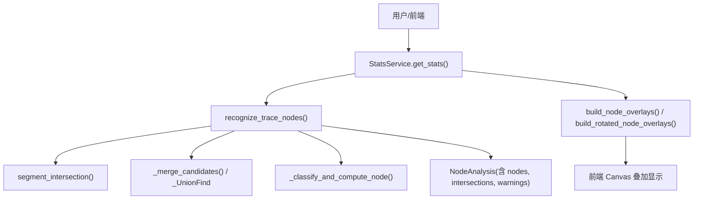
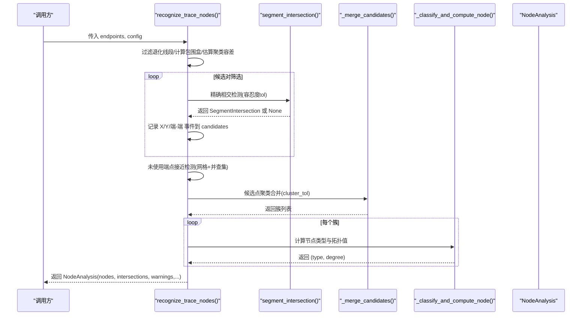
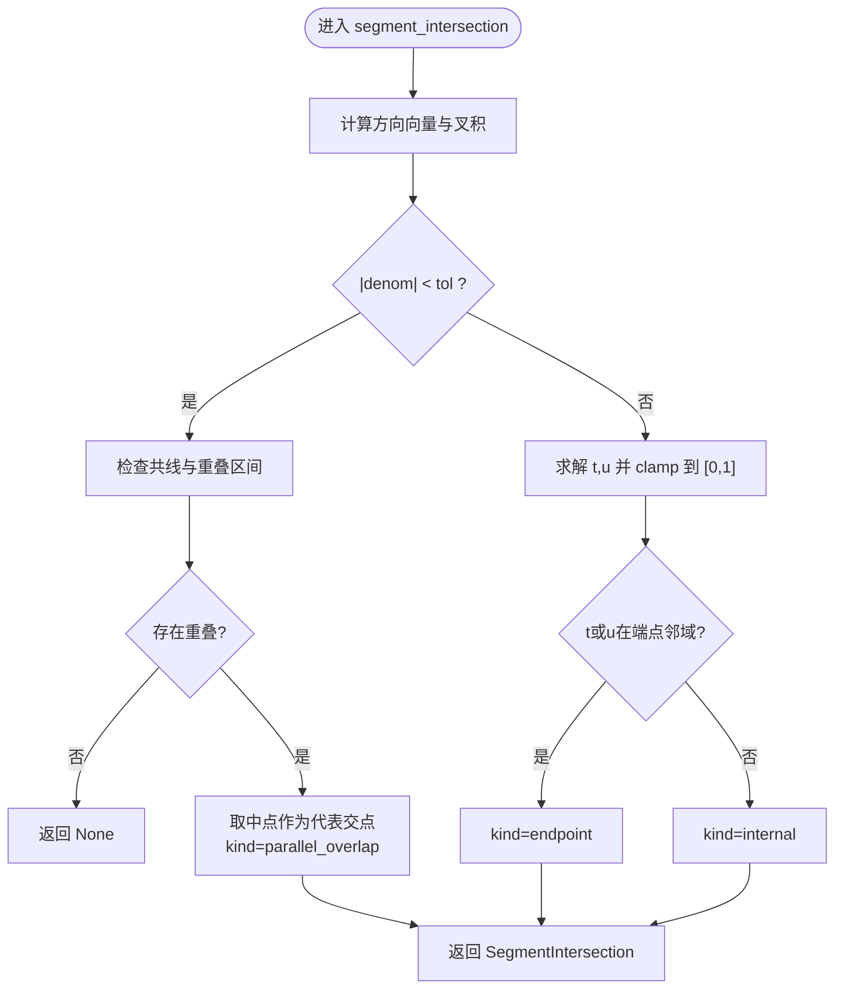
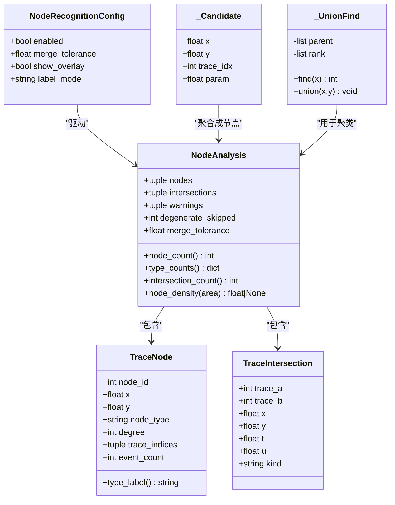
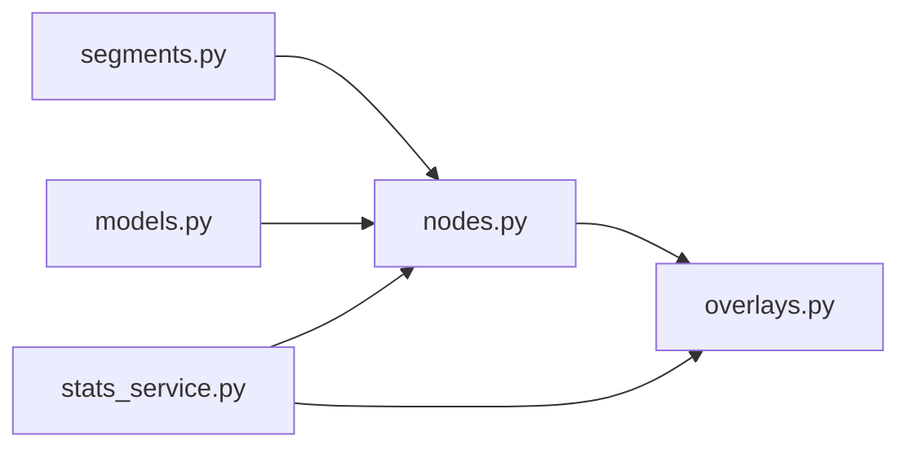
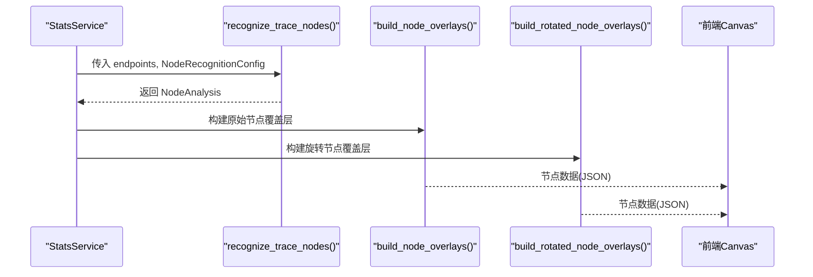
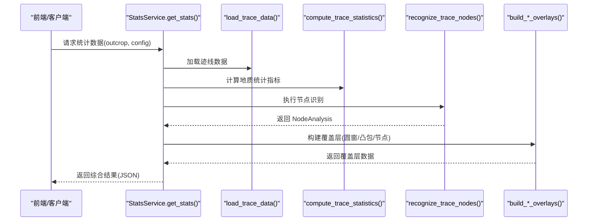

# 节点识别API

<cite>
**本文引用的文件**   
- [trace_pipeline/analysis/nodes.py](file://trace_pipeline/analysis/nodes.py)
- [trace_pipeline/analysis/models.py](file://trace_pipeline/analysis/models.py)
- [trace_pipeline/geometry/segments.py](file://trace_pipeline/geometry/segments.py)
- [trace_pipeline/plotting/overlays.py](file://trace_pipeline/plotting/overlays.py)
- [backend/services/stats_service.py](file://backend/services/stats_service.py)
- [tests/test_nodes.py](file://tests/test_nodes.py)
</cite>

## 目录
1. [简介](#简介)
2. [项目结构](#项目结构)
3. [核心组件](#核心组件)
4. [架构总览](#架构总览)
5. [详细组件分析](#详细组件分析)
6. [依赖关系分析](#依赖关系分析)
7. [性能与精度控制](#性能与精度控制)
8. [结果解析与可视化](#结果解析与可视化)
9. [质量评估与错误处理](#质量评估与错误处理)
10. [与统计分析的集成使用](#与统计分析的集成使用)
11. [故障排查指南](#故障排查指南)
12. [结论](#结论)

## 简介
本指南面向需要调用“节点识别API”的用户，系统介绍 I/Y/X 型拓扑节点的自动识别算法、几何判断逻辑、配置参数与精度控制、结果解析与可视化方法、质量评估与错误处理机制，以及与统计分析模块的集成使用方法。读者无需深入源码即可掌握如何正确配置、调用与解读节点识别结果。

## 项目结构
与节点识别相关的代码主要分布在以下位置：
- 算法实现：trace_pipeline/analysis/nodes.py
- 数据模型与配置：trace_pipeline/analysis/models.py
- 几何基础（线段相交等）：trace_pipeline/geometry/segments.py
- 覆盖层构建（用于可视化）：trace_pipeline/plotting/overlays.py
- 后端服务集成（统计+节点识别）：backend/services/stats_service.py
- 单元测试用例：tests/test_nodes.py

图表来源
- [backend/services/stats_service.py:190-201](file://backend/services/stats_service.py#L190-L201)
- [trace_pipeline/analysis/nodes.py:160-416](file://trace_pipeline/analysis/nodes.py#L160-L416)
- [trace_pipeline/geometry/segments.py:42-113](file://trace_pipeline/geometry/segments.py#L42-L113)
- [trace_pipeline/plotting/overlays.py:117-155](file://trace_pipeline/plotting/overlays.py#L117-L155)

章节来源
- [trace_pipeline/analysis/nodes.py:1-416](file://trace_pipeline/analysis/nodes.py#L1-L416)
- [trace_pipeline/analysis/models.py:1-98](file://trace_pipeline/analysis/models.py#L1-L98)
- [trace_pipeline/geometry/segments.py:1-197](file://trace_pipeline/geometry/segments.py#L1-L197)
- [trace_pipeline/plotting/overlays.py:1-156](file://trace_pipeline/plotting/overlays.py#L1-L156)
- [backend/services/stats_service.py:1-380](file://backend/services/stats_service.py#L1-L380)
- [tests/test_nodes.py:1-149](file://tests/test_nodes.py#L1-L149)

## 核心组件
- recognize_trace_nodes(endpoints, config): 主入口函数，输入为端点矩阵与识别配置，输出为 NodeAnalysis。
- NodeRecognitionConfig: 节点识别配置，包含是否启用、合并容差、是否显示覆盖层、标签模式等。
- NodeAnalysis: 节点分析结果，包含节点列表、相交事件、警告信息、退化跳过计数、实际使用的聚类容差等。
- TraceNode: 单个节点对象，包含坐标、类型（I/Y/X）、拓扑值（degree）、参与迹线索引、事件数等。
- TraceIntersection: 两迹线之间的相交事件，包含交点坐标、参数 t/u、事件类型等。
- segment_intersection(a1,a2,b1,b2,tol): 几何基础，计算两条线段的相交事件，支持内部交叉、端点接触、共线重叠等情况。

章节来源
- [trace_pipeline/analysis/nodes.py:160-416](file://trace_pipeline/analysis/nodes.py#L160-L416)
- [trace_pipeline/analysis/models.py:22-98](file://trace_pipeline/analysis/models.py#L22-L98)
- [trace_pipeline/geometry/segments.py:42-113](file://trace_pipeline/geometry/segments.py#L42-L113)

## 架构总览
节点识别API的整体流程如下：
- 预处理：过滤退化线段、计算包围盒、估算聚类容差。
- 候选检测：对候选迹线对进行快速包围盒筛选后，调用精确相交检测，收集 X/Y/端-端事件。
- 端点接近检测：对未使用的端点进行网格分桶与并查集聚类，生成候选。
- 聚类合并：基于空间网格 + 并查集将相近候选合并为簇。
- 节点分类：根据簇内迹线的参与方式（内部通过或端点参与）判定 I/Y/X 类型并计算拓扑值。
- 结果封装：返回 NodeAnalysis，包含节点、相交事件、警告与统计信息。

图表来源
- [trace_pipeline/analysis/nodes.py:160-416](file://trace_pipeline/analysis/nodes.py#L160-L416)
- [trace_pipeline/geometry/segments.py:42-113](file://trace_pipeline/geometry/segments.py#L42-L113)

## 详细组件分析

### 几何基础与相交检测
- cross2d: 二维叉积，用于方向与平行性判断。
- is_degenerate_segment: 判断线段是否退化（长度小于容差）。
- segment_intersection: 参数化求解两条线段的相交事件，返回 t/u 参数与交点坐标，并标注事件类型（endpoint/internal/parallel_overlap）。
- collinear_overlap: 共线重叠区间的边界点与参数映射。
- point_segment_distance: 点到线段最短距离（辅助工具）。

图表来源
- [trace_pipeline/geometry/segments.py:42-113](file://trace_pipeline/geometry/segments.py#L42-L113)
- [trace_pipeline/geometry/segments.py:116-177](file://trace_pipeline/geometry/segments.py#L116-L177)

章节来源
- [trace_pipeline/geometry/segments.py:1-197](file://trace_pipeline/geometry/segments.py#L1-L197)

### 节点识别主算法
- 退化线段过滤：长度小于 merge_tolerance 的线段被跳过，并记录警告。
- 包围盒筛选：向量化 AABB 快速排除不可能相交的迹线对。
- 精确相交检测：对候选对调用 segment_intersection，按 t/u 是否为内部参数区分 X/Y/端-端事件。
- 端点接近检测：对未使用端点进行网格分桶与并查集聚类，生成候选。
- 候选聚类合并：基于空间网格 + 并查集将相近候选合并为簇。
- 节点分类与拓扑值计算：根据簇内迹线参与方式判定 I/Y/X 类型，并计算 degree（拓扑值）。

图表来源
- [trace_pipeline/analysis/models.py:22-98](file://trace_pipeline/analysis/models.py#L22-L98)
- [trace_pipeline/analysis/nodes.py:37-118](file://trace_pipeline/analysis/nodes.py#L37-L118)

章节来源
- [trace_pipeline/analysis/nodes.py:160-416](file://trace_pipeline/analysis/nodes.py#L160-L416)
- [trace_pipeline/analysis/models.py:22-98](file://trace_pipeline/analysis/models.py#L22-L98)

### 节点类型判定与拓扑值
- I 型（孤立端点）：仅端点参与且无内部通过。
- Y 型（三叉节点）：一条迹线的端点落在另一条迹线内部，或拓扑值≥3。
- X 型（交叉节点）：两条及以上迹线在各自内部位置相交。
- 拓扑值 degree：每条迹线贡献 2（内部通过）或 1-2（端点参与），累加得到节点拓扑值。

章节来源
- [trace_pipeline/analysis/nodes.py:121-158](file://trace_pipeline/analysis/nodes.py#L121-L158)

## 依赖关系分析
- 节点识别模块依赖几何基础模块提供线段相交与重叠计算。
- 后端服务 StatsService 负责加载数据、构造 NodeRecognitionConfig、调用 recognize_trace_nodes，并将结果转换为前端可用的覆盖层数据。
- 覆盖层构建模块将 NodeAnalysis 转换为 NodeOverlay，供原始坐标系与旋转坐标系下的可视化叠加。

图表来源
- [trace_pipeline/geometry/segments.py:1-197](file://trace_pipeline/geometry/segments.py#L1-L197)
- [trace_pipeline/analysis/nodes.py:1-416](file://trace_pipeline/analysis/nodes.py#L1-L416)
- [trace_pipeline/analysis/models.py:1-98](file://trace_pipeline/analysis/models.py#L1-L98)
- [trace_pipeline/plotting/overlays.py:1-156](file://trace_pipeline/plotting/overlays.py#L1-L156)
- [backend/services/stats_service.py:1-380](file://backend/services/stats_service.py#L1-L380)

章节来源
- [backend/services/stats_service.py:190-201](file://backend/services/stats_service.py#L190-L201)
- [trace_pipeline/plotting/overlays.py:117-155](file://trace_pipeline/plotting/overlays.py#L117-L155)

## 性能与精度控制
- 关键参数
  - merge_tolerance: 几何检测与聚类合并的容差，必须大于 0。影响退化线段过滤、相交判定、端点接近检测与候选聚类。
  - enabled: 是否启用节点识别。
  - show_overlay: 是否生成覆盖层数据（用于可视化）。
  - label_mode: 标签模式（none/type/id），用于可视化时的标注策略。
- 自适应聚类容差
  - cluster_tol = max(tol, 0.01 * mean_len)，避免在极短迹线场景下聚类过紧或过松。
- 性能优化
  - 向量化包围盒筛选减少 O(N^2) 精确相交次数。
  - 网格分桶 + 并查集加速候选点聚类与端点接近检测。
  - 预计算有效迹线元数据与包围盒，降低重复计算。
- 注意事项
  - 坐标值过大可能引发网格索引溢出风险，会发出警告。
  - 退化线段会被跳过并计入 warnings 与 degenerate_skipped。

章节来源
- [trace_pipeline/analysis/models.py:22-36](file://trace_pipeline/analysis/models.py#L22-L36)
- [trace_pipeline/analysis/nodes.py:182-196](file://trace_pipeline/analysis/nodes.py#L182-L196)
- [trace_pipeline/analysis/nodes.py:330-346](file://trace_pipeline/analysis/nodes.py#L330-L346)
- [tests/test_nodes.py:103-116](file://tests/test_nodes.py#L103-L116)

## 结果解析与可视化
- NodeAnalysis 字段
  - nodes: 节点列表，每个节点包含坐标、类型、拓扑值、参与迹线索引、事件数。
  - intersections: 相交事件列表，包含迹线对、交点坐标、参数 t/u、事件类型。
  - warnings: 警告信息（如退化线段跳过）。
  - degenerate_skipped: 跳过的退化线段数量。
  - merge_tolerance: 实际使用的聚类容差。
- 便捷属性
  - node_count: 节点总数。
  - type_counts: I/Y/X 类型计数。
  - intersection_count: 相交事件总数。
  - node_density(area): 节点密度（需面积）。
- 可视化覆盖层
  - build_node_overlays(node_analysis): 生成原始坐标系下的节点覆盖层。
  - build_rotated_node_overlays(node_analysis, endpoints, scanline_azimuth): 生成旋转坐标系下的节点覆盖层。
  - 后端服务会将节点数据转换为前端可用的 JSON 结构，包括 raw_plot_overlay 与 rotated_plot_overlay。

图表来源
- [backend/services/stats_service.py:190-201](file://backend/services/stats_service.py#L190-L201)
- [trace_pipeline/plotting/overlays.py:117-155](file://trace_pipeline/plotting/overlays.py#L117-L155)

章节来源
- [trace_pipeline/analysis/models.py:70-98](file://trace_pipeline/analysis/models.py#L70-L98)
- [trace_pipeline/plotting/overlays.py:117-155](file://trace_pipeline/plotting/overlays.py#L117-L155)
- [backend/services/stats_service.py:257-312](file://backend/services/stats_service.py#L257-L312)

## 质量评估与错误处理
- 质量指标
  - 节点类型分布：type_counts 可评估 I/Y/X 比例是否符合预期。
  - 相交事件数量：intersection_count 反映网络连通性。
  - 节点密度：node_density(area) 可用于不同露头间的对比。
- 退化与异常
  - 退化线段：长度小于 merge_tolerance 的线段会被跳过，并在 warnings 中提示；degenerate_skipped 记录数量。
  - 坐标过大：当坐标绝对值超过阈值时，会发出网格索引溢出警告。
  - 空输入或禁用：若 endpoints 为空或 enabled=False，返回空结果。
- 测试覆盖
  - 交叉（X型）、端点接触（Y型）、平行不共线（仅 I 型）、共线重叠、退化线段跳过、禁用与空输入等场景均有单测验证。

章节来源
- [trace_pipeline/analysis/nodes.py:208-222](file://trace_pipeline/analysis/nodes.py#L208-L222)
- [trace_pipeline/analysis/nodes.py:330-346](file://trace_pipeline/analysis/nodes.py#L330-L346)
- [tests/test_nodes.py:25-149](file://tests/test_nodes.py#L25-L149)

## 与统计分析的集成使用
后端服务 StatsService 在计算统计数据的同时执行节点识别，并将结果整合到统一响应中：
- 从配置读取 enable_node_recognition、node_merge_tolerance、show_node_overlay、node_label_mode。
- 构造 NodeRecognitionConfig 并调用 recognize_trace_nodes。
- 将节点结果转换为 nodes_summary 与 nodes 列表，同时生成 raw_plot_overlay 与 rotated_plot_overlay 中的节点覆盖层数据。
- 返回的 JSON 包含 P10/P20/P21、直方图、圆窗几何、凸包几何以及节点识别结果，便于前端统一展示与分析。

图表来源
- [backend/services/stats_service.py:144-201](file://backend/services/stats_service.py#L144-L201)
- [backend/services/stats_service.py:257-312](file://backend/services/stats_service.py#L257-L312)

章节来源
- [backend/services/stats_service.py:101-342](file://backend/services/stats_service.py#L101-L342)

## 故障排查指南
- 常见问题
  - 未检测到任何节点：检查 enabled 是否为 True；确认 merge_tolerance 是否过小导致退化过滤过多；检查 endpoints 是否为空。
  - 节点类型不符合预期：调整 merge_tolerance 以改变聚类与相交判定灵敏度；检查是否存在大量平行或共线重叠情况。
  - 可视化无节点：确认 show_overlay 为 True；检查坐标范围与前端映射是否正确。
- 日志与警告
  - 关注 warnings 中的“跳过退化线段”与“坐标值过大”提示。
  - 后端服务在 stats 计算完成后会记录耗时与关键指标，便于定位性能瓶颈。
- 回归测试参考
  - 交叉、端点接触、平行、共线重叠、退化、禁用与空输入等场景的单测可作为行为基准。

章节来源
- [trace_pipeline/analysis/nodes.py:208-222](file://trace_pipeline/analysis/nodes.py#L208-L222)
- [trace_pipeline/analysis/nodes.py:330-346](file://trace_pipeline/analysis/nodes.py#L330-L346)
- [tests/test_nodes.py:25-149](file://tests/test_nodes.py#L25-L149)
- [backend/services/stats_service.py:314-341](file://backend/services/stats_service.py#L314-L341)

## 结论
节点识别API通过高效的几何相交检测与空间聚类策略，能够稳定地识别 I/Y/X 型拓扑节点，并提供丰富的结果结构与可视化支持。合理配置 merge_tolerance 与相关选项，结合质量评估与错误处理机制，可在复杂裂隙网络场景中取得可靠的识别效果。与统计分析模块的无缝集成进一步提升了整体工作流的效率与可用性。