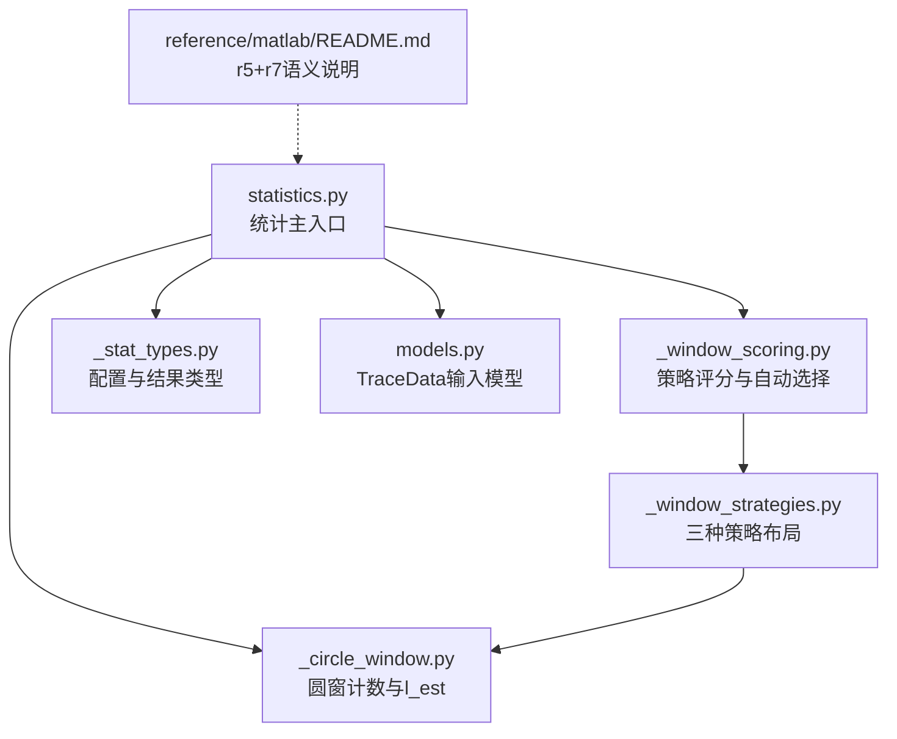
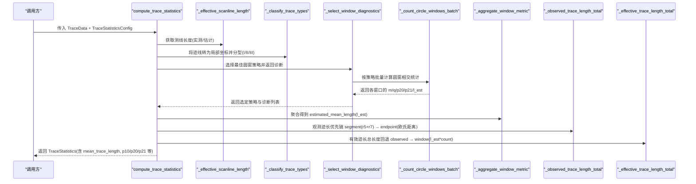
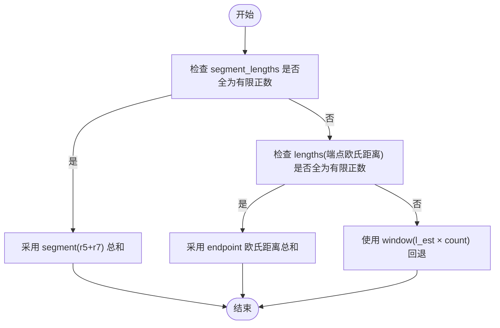
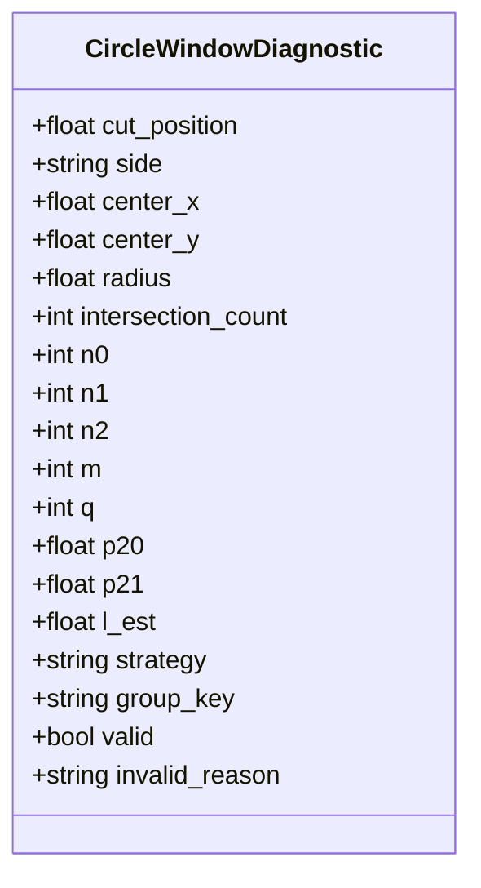
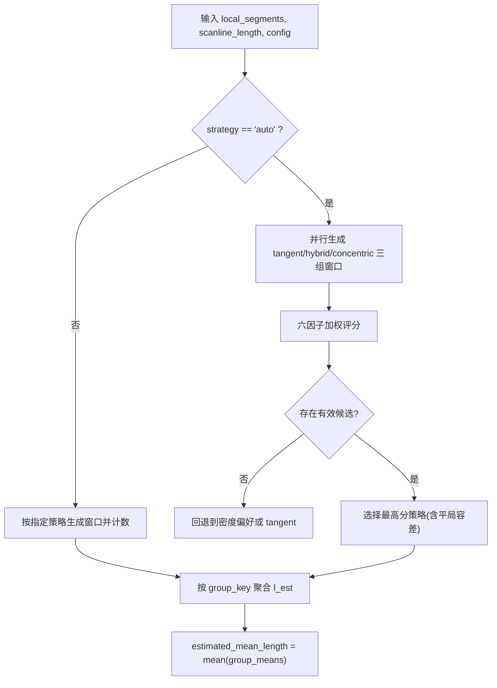
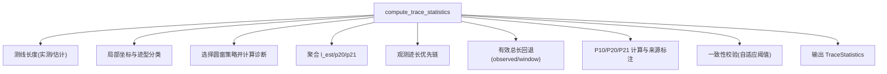
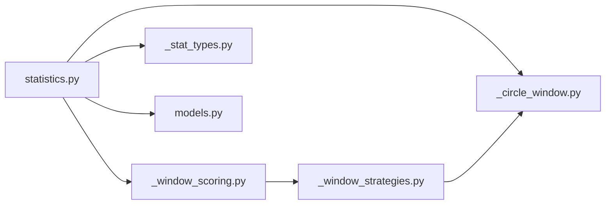

# 迹长估计API

<cite>
**本文引用的文件**   
- [statistics.py](file://trace_pipeline/geology/statistics.py)
- [_circle_window.py](file://trace_pipeline/geology/_circle_window.py)
- [_window_strategies.py](file://trace_pipeline/geology/_window_strategies.py)
- [_window_scoring.py](file://trace_pipeline/geology/_window_scoring.py)
- [_stat_types.py](file://trace_pipeline/geology/_stat_types.py)
- [models.py](file://trace_pipeline/models.py)
- [README.md](file://reference/matlab/README.md)
- [test_statistics.py](file://tests/test_statistics.py)
</cite>

## 目录
1. [简介](#简介)
2. [项目结构](#项目结构)
3. [核心组件](#核心组件)
4. [架构总览](#架构总览)
5. [详细组件分析](#详细组件分析)
6. [依赖关系分析](#依赖关系分析)
7. [性能考虑](#性能考虑)
8. [故障排查指南](#故障排查指南)
9. [结论](#结论)
10. [附录](#附录)

## 简介
本指南面向需要调用“迹长估计”能力的用户与集成方，聚焦平均迹长估计的算法原理、计算方法与质量控制流程。内容覆盖：
- 平均迹长的观测优先链与回退策略
- Mauldon 方法（圆窗计数）的实现细节与 l_est 计算
- 三种圆窗策略（切圆、混合、同心）的选择与评分机制
- 质量校验与异常处理机制
- 与 MATLAB 参考实现中“测段长度 r5+r7”的对应关系

## 项目结构
与迹长估计相关的核心代码位于 geology 子包内，围绕统计主入口、圆窗几何与策略、评分与自动选择、数据类型定义展开；数据模型 TraceData 在 models.py 中定义，MATLAB 参考说明在 reference/matlab/README.md 中提供对照。

图表来源
- [statistics.py:212-391](file://trace_pipeline/geology/statistics.py#L212-L391)
- [_window_scoring.py:235-323](file://trace_pipeline/geology/_window_scoring.py#L235-L323)
- [_window_strategies.py:173-185](file://trace_pipeline/geology/_window_strategies.py#L173-L185)
- [_circle_window.py:71-216](file://trace_pipeline/geology/_circle_window.py#L71-L216)
- [_stat_types.py:14-65](file://trace_pipeline/geology/_stat_types.py#L14-L65)
- [models.py:41-157](file://trace_pipeline/models.py#L41-L157)
- [README.md:57-63](file://reference/matlab/README.md#L57-L63)

章节来源
- [statistics.py:212-391](file://trace_pipeline/geology/statistics.py#L212-L391)
- [_window_scoring.py:235-323](file://trace_pipeline/geology/_window_scoring.py#L235-L323)
- [_window_strategies.py:173-185](file://trace_pipeline/geology/_window_strategies.py#L173-L185)
- [_circle_window.py:71-216](file://trace_pipeline/geology/_circle_window.py#L71-L216)
- [_stat_types.py:14-65](file://trace_pipeline/geology/_stat_types.py#L14-L65)
- [models.py:41-157](file://trace_pipeline/models.py#L41-L157)
- [README.md:57-63](file://reference/matlab/README.md#L57-L63)

## 核心组件
- 统计主入口 compute_trace_statistics：负责从 TraceData 计算测线长度、局部坐标、迹型分类、圆窗诊断、面积选择、P10/P20/P21 及平均迹长等指标，并输出 TraceStatistics。
- 圆窗计数 _count_circle_windows_batch：向量化批量计算多个圆窗的相交统计，产出 m、q、p20、p21、l_est 等诊断字段。
- 策略布局 compute_circle_windows：根据 strategy 参数生成切圆、混合或同心三类窗口集合。
- 策略评分与自动选择 _select_window_diagnostics：对三种策略分别打分，支持 auto 模式下的最优策略选择。
- 数据类型 TraceStatisticsConfig/CircleWindowDiagnostic/TraceStatistics：承载配置、诊断与最终统计结果。
- 输入模型 TraceData：包含端点、走向、测段长度、位置、实测测线长度与露头面积等。

章节来源
- [statistics.py:212-391](file://trace_pipeline/geology/statistics.py#L212-L391)
- [_circle_window.py:71-216](file://trace_pipeline/geology/_circle_window.py#L71-L216)
- [_window_strategies.py:173-185](file://trace_pipeline/geology/_window_strategies.py#L173-L185)
- [_window_scoring.py:235-323](file://trace_pipeline/geology/_window_scoring.py#L235-L323)
- [_stat_types.py:14-125](file://trace_pipeline/geology/_stat_types.py#L14-L125)
- [models.py:41-157](file://trace_pipeline/models.py#L41-L157)

## 架构总览
下图展示从输入到输出的关键流程与数据流，突出“观测优先链”和“Mauldon 圆窗估计”。

图表来源
- [statistics.py:212-391](file://trace_pipeline/geology/statistics.py#L212-L391)
- [_window_scoring.py:235-323](file://trace_pipeline/geology/_window_scoring.py#L235-L323)
- [_circle_window.py:71-216](file://trace_pipeline/geology/_circle_window.py#L71-L216)

## 详细组件分析

### 平均迹长估计与观测优先链
- 观测优先链：优先使用“测段长度 r5+r7”之和作为观测总长；若不可用则回退至“端点欧氏距离”之和；两者均不可用时，再回退到“圆窗估计的平均迹长 × 迹线条数”。
- 回退逻辑确保在任意数据条件下都能给出合理估计，并在结果中附带来源标记以便追溯。

图表来源
- [statistics.py:179-206](file://trace_pipeline/geology/statistics.py#L179-L206)

章节来源
- [statistics.py:179-206](file://trace_pipeline/geology/statistics.py#L179-L206)
- [models.py:134-157](file://trace_pipeline/models.py#L134-L157)
- [README.md:57-63](file://reference/matlab/README.md#L57-L63)

### Mauldon 方法与 l_est 计算
- 圆窗计数：对每个候选圆窗，统计相交迹线的 n0/n1/n2，进而得到 q=2n0+n1、m=n1+2n2。
- 面密度与线密度：p20 = q/(2πR²)，p21 = m/(4R)。
- 平均迹长估计（Zhang, 1998）：l_est = (πR/2)·(m/q)。该式即为 Mauldon 方法在圆窗框架下的常用估计形式。
- 有效性判定：当相交迹线数不足、m≤0 或 q≤0 时，窗口无效，l_est 置为 NaN。

图表来源
- [_stat_types.py:67-89](file://trace_pipeline/geology/_stat_types.py#L67-L89)
- [_circle_window.py:171-216](file://trace_pipeline/geology/_circle_window.py#L171-L216)

章节来源
- [_circle_window.py:171-216](file://trace_pipeline/geology/_circle_window.py#L171-L216)
- [_stat_types.py:67-89](file://trace_pipeline/geology/_stat_types.py#L67-L89)

### 圆窗策略与 l_est 聚合
- 三种策略：
  - tangent（切圆）：沿测线两侧以固定半径布置多组切圆。
  - hybrid（混合）：基于切割比例与侧高限制，组合多种半径。
  - concentric（同心）：以测线中心为圆心，按半径分数布设同心圆。
- 自动选择：在 auto 模式下，先对三种策略分别计算诊断，再用六因子加权评分（有效分组数量、空间覆盖、稳定性、半径大小、样本充分性等）择优；当无有效候选或得分非正时，回退到密度偏好或最保守策略。
- l_est 聚合：按 group_key 分组后取均值，再对所有组求均值，得到 estimated_mean_length。

图表来源
- [_window_strategies.py:173-185](file://trace_pipeline/geology/_window_strategies.py#L173-L185)
- [_window_scoring.py:178-206](file://trace_pipeline/geology/_window_scoring.py#L178-206)
- [_window_scoring.py:235-323](file://trace_pipeline/geology/_window_scoring.py#L235-L323)
- [_window_scoring.py:47-58](file://trace_pipeline/geology/_window_scoring.py#L47-L58)

章节来源
- [_window_strategies.py:173-185](file://trace_pipeline/geology/_window_strategies.py#L173-L185)
- [_window_scoring.py:178-206](file://trace_pipeline/geology/_window_scoring.py#L178-206)
- [_window_scoring.py:235-323](file://trace_pipeline/geology/_window_scoring.py#L235-L323)
- [_window_scoring.py:47-58](file://trace_pipeline/geology/_window_scoring.py#L47-L58)

### 主流程与质量控制
- 主流程 compute_trace_statistics：
  - 计算测线长度（实测优先，否则估计）
  - 转换为局部坐标系并按 I/II/III 分型
  - 选择圆窗策略并计算诊断
  - 聚合得到 estimated_mean_length、estimated_p20、estimated_p21
  - 计算观测迹长总长与有效总长（观测优先，回退到 window）
  - 计算 P10/P20/P21 及其来源
  - 一致性校验：比较主 P20/P21 与圆窗估计值，超过自适应阈值则发出警告
- 质量控制要点：
  - 自适应阈值随样本量增大而收紧
  - 面积选择四层回退（实测→凸包→缓冲凸包→圆窗等效面积），并记录差异比率
  - 所有中间来源与告警信息均保留在结果对象中，便于审计

图表来源
- [statistics.py:212-391](file://trace_pipeline/geology/statistics.py#L212-L391)

章节来源
- [statistics.py:212-391](file://trace_pipeline/geology/statistics.py#L212-L391)

## 依赖关系分析
- statistics.py 依赖：
  - _circle_window：迹型分类、圆窗计数
  - _convex_hull：凸包面积与缓冲面积
  - _stat_format：格式化输出
  - _stat_types：配置与结果类型
  - _window_scoring：策略选择与指标聚合
  - angles：方位角转换
- _window_scoring.py 依赖：
  - _window_strategies：三种策略布局
  - _circle_window：tangent 半径计算
  - _stat_types：配置与诊断类型
- _window_strategies.py 依赖：
  - _circle_window：批量计数、无效窗口构造、辅助度量
- models.py 提供 TraceData，供 statistics.py 消费。

图表来源
- [statistics.py:212-391](file://trace_pipeline/geology/statistics.py#L212-L391)
- [_window_scoring.py:235-323](file://trace_pipeline/geology/_window_scoring.py#L235-L323)
- [_window_strategies.py:173-185](file://trace_pipeline/geology/_window_strategies.py#L173-L185)
- [_circle_window.py:71-216](file://trace_pipeline/geology/_circle_window.py#L71-L216)
- [models.py:41-157](file://trace_pipeline/models.py#L41-L157)

章节来源
- [statistics.py:212-391](file://trace_pipeline/geology/statistics.py#L212-L391)
- [_window_scoring.py:235-323](file://trace_pipeline/geology/_window_scoring.py#L235-L323)
- [_window_strategies.py:173-185](file://trace_pipeline/geology/_window_strategies.py#L173-L185)
- [_circle_window.py:71-216](file://trace_pipeline/geology/_circle_window.py#L71-L216)
- [models.py:41-157](file://trace_pipeline/models.py#L41-L157)

## 性能考虑
- 向量化批量圆窗计数：通过广播一次性计算 N×M 的距离矩阵，避免逐窗口循环带来的 Python 函数调用开销。
- 网格化与并查集用于节点识别（虽不直接参与迹长估计，但影响整体流水线性能）。
- 自适应阈值与评分机制减少不必要的复杂策略评估，提升 auto 模式下的决策效率。

[本节为通用指导，无需特定文件引用]

## 故障排查指南
- 常见错误与定位：
  - 输入包含 NaN/inf：TraceData 构造时会抛出 ValueError，需检查端点、走向、长度与位置数组。
  - 圆窗无效：当相交迹线数不足、m≤0 或 q≤0 时，窗口被标记为无效，l_est 为 NaN；应检查 min_intersections 与窗口半径设置。
  - 策略选择失败：auto 模式下若无有效候选或得分非正，会回退到密度偏好或 tangent；可调整 cut_fractions/radius_fractions/tangent_window_count 等参数。
  - 一致性告警：主 P20/P21 与圆窗估计差异超过自适应阈值会触发警告，建议检查面积来源与数据质量。
- 调试建议：
  - 查看 TraceStatistics.diagnostics 中的 valid/invalid_reason 字段定位具体窗口问题。
  - 关注 trace_length_source/outcrop_area_source/p20_source/p21_source 等来源字段，确认估算路径是否符合预期。
  - 结合单元测试用例快速验证边界情况（空数据、退化线段、极端坐标等）。

章节来源
- [models.py:65-130](file://trace_pipeline/models.py#L65-L130)
- [_circle_window.py:171-216](file://trace_pipeline/geology/_circle_window.py#L171-L216)
- [_window_scoring.py:235-323](file://trace_pipeline/geology/_window_scoring.py#L235-L323)
- [statistics.py:313-336](file://trace_pipeline/geology/statistics.py#L313-L336)
- [test_statistics.py:142-192](file://tests/test_statistics.py#L142-L192)

## 结论
本 API 提供了稳健的迹长估计能力：在数据完备时优先使用观测值（r5+r7 或端点欧氏距离），在缺失或不满足条件时回退到 Mauldon 圆窗估计；同时通过多策略布局、六因子评分与一致性校验，保障估计结果的可靠性与可解释性。建议在集成时充分利用结果中的来源与诊断字段进行质量控制与审计。

[本节为总结性内容，无需特定文件引用]

## 附录
- 与 MATLAB 参考实现的对应关系：
  - MATLAB 中 traceLengths = r5 + r7；Python 默认输出两列，兼顾端点距离与测段长度（r5+r7），二者在迹长估计中均有使用。
- 相关测试用例：
  - 测线长度估算、迹型分类、圆窗计数、凸包面积等场景覆盖了典型与边界情况，可作为集成前的验证基线。

章节来源
- [README.md:57-63](file://reference/matlab/README.md#L57-L63)
- [test_statistics.py:63-95](file://tests/test_statistics.py#L63-L95)
- [test_statistics.py:116-136](file://tests/test_statistics.py#L116-L136)
- [test_statistics.py:142-192](file://tests/test_statistics.py#L142-L192)