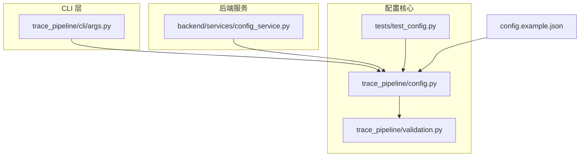
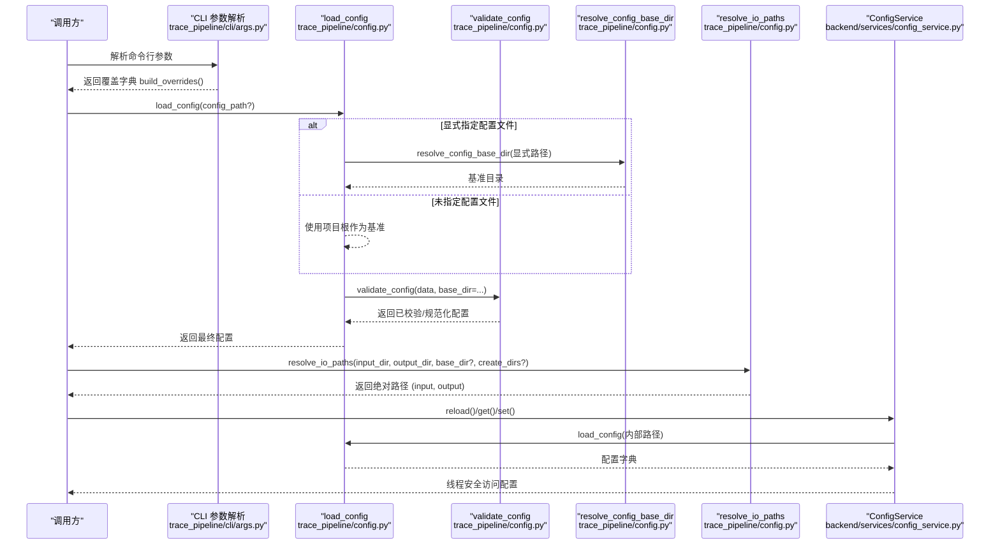
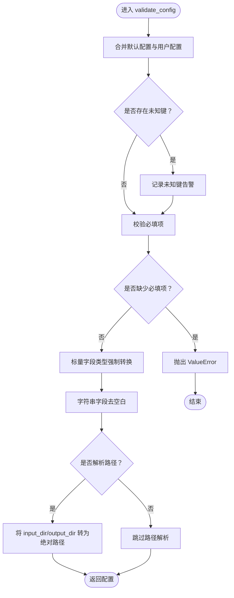
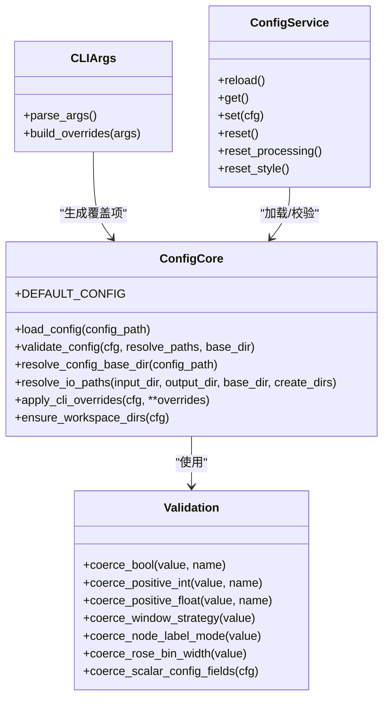

# 配置管理接口

<cite>
**本文引用的文件**   
- [trace_pipeline/config.py](file://trace_pipeline/config.py)
- [trace_pipeline/validation.py](file://trace_pipeline/validation.py)
- [config.example.json](file://config.example.json)
- [trace_pipeline/cli/args.py](file://trace_pipeline/cli/args.py)
- [backend/services/config_service.py](file://backend/services/config_service.py)
- [tests/test_config.py](file://tests/test_config.py)
</cite>

## 目录
1. [简介](#简介)
2. [项目结构](#项目结构)
3. [核心组件](#核心组件)
4. [架构总览](#架构总览)
5. [详细组件分析](#详细组件分析)
6. [依赖关系分析](#依赖关系分析)
7. [性能与路径解析特性](#性能与路径解析特性)
8. [故障排查指南](#故障排查指南)
9. [结论](#结论)
10. [附录：模板与示例](#附录模板与示例)

## 简介
本文件面向 TracePipeline 的配置管理子系统，系统性说明配置文件结构、默认值与覆盖机制，并深入讲解以下关键函数与流程：
- load_config：加载 JSON 配置文件，缺失时回退到默认配置
- apply_cli_overrides：将命令行参数合并为配置覆盖项
- resolve_io_paths：输入/输出目录解析与目录创建保障
- validate_config：默认值合并、类型规范化、必填校验与路径解析
- resolve_config_base_dir：相对路径基准目录的确定策略

同时提供配置文件模板与自定义配置示例，解释环境变量与命令行参数的优先级规则（基于当前代码实现），并给出路径解析、文件发现与环境检测的高级用法建议。

## 项目结构
配置相关代码主要分布在如下位置：
- trace_pipeline/config.py：配置加载、校验、路径解析、CLI 覆盖合并、工作目录保障
- trace_pipeline/validation.py：标量字段类型强制转换与取值范围校验
- config.example.json：可复制为 config.json 的配置模板
- trace_pipeline/cli/args.py：命令行参数定义与覆盖字典构建
- backend/services/config_service.py：config.json 的读写服务（唯一写入入口）
- tests/test_config.py：配置加载与路径解析的测试用例

图表来源
- [trace_pipeline/config.py:86-145](file://trace_pipeline/config.py#L86-L145)
- [trace_pipeline/validation.py:90-112](file://trace_pipeline/validation.py#L90-L112)
- [trace_pipeline/cli/args.py:75-93](file://trace_pipeline/cli/args.py#L75-L93)
- [backend/services/config_service.py:41-101](file://backend/services/config_service.py#L41-L101)
- [tests/test_config.py:8-20](file://tests/test_config.py#L8-L20)

章节来源
- [trace_pipeline/config.py:1-326](file://trace_pipeline/config.py#L1-L326)
- [trace_pipeline/validation.py:1-112](file://trace_pipeline/validation.py#L1-L112)
- [config.example.json:1-26](file://config.example.json#L1-L26)
- [trace_pipeline/cli/args.py:1-93](file://trace_pipeline/cli/args.py#L1-L93)
- [backend/services/config_service.py:1-144](file://backend/services/config_service.py#L1-L144)
- [tests/test_config.py:8-20](file://tests/test_config.py#L8-L20)

## 核心组件
- DEFAULT_CONFIG：内置默认配置字典，包含输入输出目录、处理开关、绘图 DPI、窗口策略、节点识别等选项
- ConfigDict：配置字典的类型提示，用于静态检查
- load_config：从指定或默认路径加载 JSON 配置，缺失时使用默认配置；对非法 JSON 或非对象根抛出异常
- validate_config：合并默认值、忽略未知键并告警、强制标量类型、校验必填项、可选路径解析
- resolve_config_base_dir：根据配置文件路径决定相对路径的基准目录
- _to_absolute：将相对路径解析为绝对路径（支持 ~ 展开）
- resolve_io_paths：解析输入/输出目录为绝对路径，并可按需创建目录
- apply_cli_overrides：将 CLI 覆盖项合并入配置并重新校验
- ensure_workspace_dirs：确保 input/output/logs 目录存在（权限异常仅记录警告）

章节来源
- [trace_pipeline/config.py:56-79](file://trace_pipeline/config.py#L56-L79)
- [trace_pipeline/config.py:86-145](file://trace_pipeline/config.py#L86-L145)
- [trace_pipeline/config.py:148-190](file://trace_pipeline/config.py#L148-L190)
- [trace_pipeline/config.py:196-209](file://trace_pipeline/config.py#L196-L209)
- [trace_pipeline/config.py:212-215](file://trace_pipeline/config.py#L212-L215)
- [trace_pipeline/config.py:218-245](file://trace_pipeline/config.py#L218-L245)
- [trace_pipeline/config.py:251-258](file://trace_pipeline/config.py#L251-L258)
- [trace_pipeline/config.py:264-312](file://trace_pipeline/config.py#L264-L312)

## 架构总览
配置加载与覆盖的整体流程如下：

图表来源
- [trace_pipeline/cli/args.py:75-93](file://trace_pipeline/cli/args.py#L75-L93)
- [trace_pipeline/config.py:86-145](file://trace_pipeline/config.py#L86-L145)
- [trace_pipeline/config.py:148-190](file://trace_pipeline/config.py#L148-L190)
- [trace_pipeline/config.py:196-209](file://trace_pipeline/config.py#L196-L209)
- [trace_pipeline/config.py:218-245](file://trace_pipeline/config.py#L218-L245)
- [backend/services/config_service.py:68-101](file://backend/services/config_service.py#L68-L101)

## 详细组件分析

### 配置加载与校验：load_config 与 validate_config
- 行为要点
  - 若显式传入配置文件路径且不存在，抛出 FileNotFoundError
  - 若未显式指定且默认路径不存在，记录日志并使用默认配置
  - 读取失败或 JSON 格式错误会抛出 OSError/ValueError
  - 非对象根 JSON 会被拒绝
  - 当显式指定配置文件时，相对路径以该配置文件所在目录为基准进行解析
- 校验与规范化
  - 合并默认值，忽略未知键并告警
  - 必填项校验：input_dir、output_dir、outcrop 始终必填；process_all=False 时 table_stem 也必填
  - 布尔与数值字段通过 validation 模块强制转换与范围校验
  - 字符串字段去除首尾空白
  - 可选择将 input_dir/output_dir 解析为绝对路径（默认开启）

图表来源
- [trace_pipeline/config.py:148-190](file://trace_pipeline/config.py#L148-L190)
- [trace_pipeline/validation.py:90-112](file://trace_pipeline/validation.py#L90-L112)

章节来源
- [trace_pipeline/config.py:86-145](file://trace_pipeline/config.py#L86-L145)
- [trace_pipeline/config.py:148-190](file://trace_pipeline/config.py#L148-L190)
- [trace_pipeline/validation.py:26-87](file://trace_pipeline/validation.py#L26-L87)

### 路径解析：resolve_config_base_dir 与 _to_absolute
- 基准目录选择策略
  - 未指定配置文件：使用项目根目录
  - 指定配置文件且存在：使用该文件所在父目录
  - 指定配置文件但不存在但父目录存在：使用该父目录
  - 其他情况：回退到项目根目录
- 绝对路径解析
  - 支持 ~ 展开
  - 若为绝对路径直接 resolve；否则拼接基准目录后 resolve

章节来源
- [trace_pipeline/config.py:196-209](file://trace_pipeline/config.py#L196-L209)
- [trace_pipeline/config.py:212-215](file://trace_pipeline/config.py#L212-L215)

### I/O 路径解析：resolve_io_paths
- 功能
  - 将 input_dir 与 output_dir 解析为绝对路径
  - 可按需创建目录（默认 True，保持历史兼容）
  - 只读命令（如 --list/--dry-run）应传入 create_dirs=False，避免意外创建空目录
- 返回值
  - 返回 (input_abs, output_abs) 两个字符串路径

章节来源
- [trace_pipeline/config.py:218-245](file://trace_pipeline/config.py#L218-L245)

### CLI 覆盖合并：apply_cli_overrides
- 行为
  - 过滤掉 None 值，仅合并显式指定的覆盖项
  - 合并后再次调用 validate_config 完成校验与规范化
- 典型覆盖项来源
  - 来自 CLI 参数解析器生成的覆盖字典（见下一节）

章节来源
- [trace_pipeline/config.py:251-258](file://trace_pipeline/config.py#L251-L258)

### 工作目录保障：ensure_workspace_dirs
- 自动创建 input、output、logs 目录（缺失则创建）
- 权限异常仅记录警告，不中断程序运行
- 不再负责写回 config.json（由后端服务统一接管）

章节来源
- [trace_pipeline/config.py:264-312](file://trace_pipeline/config.py#L264-L312)

### 配置文件读写服务：ConfigService
- 职责
  - 作为 config.json 的唯一写入入口
  - 提供线程安全的 get/set/reset/reset_processing/reset_style/reload 接口
  - 保存采用临时文件 + replace 的原子写入策略，异常时清理临时文件
- 与配置核心的集成
  - 内部通过 load_config 和 validate_config 保证一致性

章节来源
- [backend/services/config_service.py:41-144](file://backend/services/config_service.py#L41-L144)

### CLI 参数与覆盖映射：parse_args 与 build_overrides
- 支持的覆盖项（部分）
  - --input/-i：覆盖 input_dir
  - --output/-o：覆盖 output_dir
  - --single/-s：设置 process_all=False（单文件模式）
  - --rose-bin：覆盖 rose_bin_width
  - --rose-dpi：覆盖 rose_dpi
  - --no-rose：设置 export_rose_plot=False
  - --window-strategy：覆盖 window_strategy
  - --parallel/-p：并行线程数（注意：当前覆盖字典未将其映射到配置键，详见“依赖关系分析”）
  - --force-parallel：标志位（同样未在覆盖字典中映射）
  - --interactive/-I、--list/-l、--dry-run/-n：控制执行流程（不在覆盖字典中）
- 覆盖字典构建
  - 仅包含显式指定的项（None 被过滤）

章节来源
- [trace_pipeline/cli/args.py:11-72](file://trace_pipeline/cli/args.py#L11-L72)
- [trace_pipeline/cli/args.py:75-93](file://trace_pipeline/cli/args.py#L75-L93)

## 依赖关系分析
- 模块耦合
  - config.py 依赖 validation.py 进行标量字段规范化
  - cli/args.py 生成覆盖字典供上层合并
  - backend/services/config_service.py 封装 config.json 的持久化，复用 config.py 的加载与校验能力
- 潜在不一致点
  - CLI 定义了 --parallel 与 --force-parallel，但 build_overrides 未将其映射到配置键，因此不会通过 apply_cli_overrides 生效于配置字典
  - 若需要这些参数影响配置，应在 build_overrides 中增加对应映射（例如 parallel_workers）

图表来源
- [trace_pipeline/config.py:56-79](file://trace_pipeline/config.py#L56-L79)
- [trace_pipeline/config.py:86-145](file://trace_pipeline/config.py#L86-L145)
- [trace_pipeline/config.py:148-190](file://trace_pipeline/config.py#L148-L190)
- [trace_pipeline/config.py:218-245](file://trace_pipeline/config.py#L218-L245)
- [trace_pipeline/config.py:251-258](file://trace_pipeline/config.py#L251-L258)
- [trace_pipeline/validation.py:90-112](file://trace_pipeline/validation.py#L90-L112)
- [trace_pipeline/cli/args.py:75-93](file://trace_pipeline/cli/args.py#L75-L93)
- [backend/services/config_service.py:41-101](file://backend/services/config_service.py#L41-L101)

章节来源
- [trace_pipeline/config.py:1-326](file://trace_pipeline/config.py#L1-L326)
- [trace_pipeline/validation.py:1-112](file://trace_pipeline/validation.py#L1-L112)
- [trace_pipeline/cli/args.py:1-93](file://trace_pipeline/cli/args.py#L1-L93)
- [backend/services/config_service.py:1-144](file://backend/services/config_service.py#L1-L144)

## 性能与路径解析特性
- 路径解析
  - 所有相对路径均以基准目录解析为绝对路径，避免跨工作目录运行时出现找不到文件的错误
  - 支持 ~ 展开，便于用户主目录快捷引用
- 目录创建
  - resolve_io_paths 默认创建输入/输出目录，适合常规执行；只读命令建议关闭此行为
  - ensure_workspace_dirs 在启动阶段保障必要目录存在，权限异常仅记录警告，不影响后续流程
- 并发与并行
  - CLI 提供 --parallel 与 --force-parallel，但当前未映射至配置键；如需通过配置驱动并行度，可在覆盖映射中补充

章节来源
- [trace_pipeline/config.py:218-245](file://trace_pipeline/config.py#L218-L245)
- [trace_pipeline/config.py:264-312](file://trace_pipeline/config.py#L264-L312)
- [trace_pipeline/cli/args.py:53-64](file://trace_pipeline/cli/args.py#L53-L64)

## 故障排查指南
- 常见错误与定位
  - 配置文件不存在：当显式指定路径时抛出 FileNotFoundError；未指定路径时自动使用默认配置
  - JSON 解析失败：抛出 ValueError，附带错误信息
  - 非对象根 JSON：抛出 ValueError，要求必须为 JSON 对象
  - 缺少必填项：抛出 ValueError，列出缺失字段
  - 无法创建目录：resolve_io_paths 在 create_dirs=True 时可能抛出 OSError；ensure_workspace_dirs 捕获权限异常仅记录警告
- 调试建议
  - 启用 DEBUG 级别日志查看路径解析与配置加载过程
  - 使用 tests/test_config.py 中的断言思路验证相对路径解析是否符合预期

章节来源
- [trace_pipeline/config.py:86-145](file://trace_pipeline/config.py#L86-L145)
- [trace_pipeline/config.py:148-190](file://trace_pipeline/config.py#L148-L190)
- [trace_pipeline/config.py:218-245](file://trace_pipeline/config.py#L218-L245)
- [trace_pipeline/config.py:264-312](file://trace_pipeline/config.py#L264-L312)
- [tests/test_config.py:8-20](file://tests/test_config.py#L8-L20)

## 结论
TracePipeline 的配置管理以“默认配置 + JSON 覆盖 + CLI 覆盖”为核心模型，结合严格的类型校验与路径解析，确保在不同运行环境下的一致性与健壮性。通过 ConfigService 统一管理 config.json 的读写，避免了并发与数据一致性问题。对于 CLI 参数与配置的映射，当前覆盖了常用项，但尚未将并行相关参数映射到配置键，必要时可扩展。

## 附录：模板与示例

### 配置文件结构与默认值
- 参考模板：config.example.json
- 默认值定义：DEFAULT_CONFIG（位于配置核心模块）

章节来源
- [config.example.json:1-26](file://config.example.json#L1-L26)
- [trace_pipeline/config.py:56-79](file://trace_pipeline/config.py#L56-L79)

### 自定义配置示例（步骤）
- 复制模板为 config.json，按需修改字段
- 使用 load_config 加载配置（可指定路径）
- 使用 apply_cli_overrides 合并命令行覆盖项
- 使用 resolve_io_paths 获取绝对路径并确保目录存在
- 通过 ConfigService 持久化配置变更

章节来源
- [trace_pipeline/config.py:86-145](file://trace_pipeline/config.py#L86-L145)
- [trace_pipeline/config.py:251-258](file://trace_pipeline/config.py#L251-L258)
- [trace_pipeline/config.py:218-245](file://trace_pipeline/config.py#L218-L245)
- [backend/services/config_service.py:68-101](file://backend/services/config_service.py#L68-L101)

### 环境变量与命令行参数优先级
- 环境变量
  - 在当前配置核心与服务实现中，未发现对配置项的环境变量注入逻辑
- 命令行参数优先级
  - 命令行覆盖项通过 apply_cli_overrides 合并到配置，优先级高于 JSON 配置
  - 注意：并非所有 CLI 参数都映射到配置键（例如 --parallel 与 --force-parallel 当前未映射）

章节来源
- [trace_pipeline/config.py:251-258](file://trace_pipeline/config.py#L251-L258)
- [trace_pipeline/cli/args.py:75-93](file://trace_pipeline/cli/args.py#L75-L93)

### 路径解析与文件发现高级用法
- 基准目录选择
  - 显式配置文件路径存在：以其父目录为基准
  - 显式配置文件路径不存在但父目录存在：仍以其父目录为基准
  - 未指定配置文件：使用项目根目录
- 相对路径解析
  - 支持 ~ 展开与绝对路径直解
- 文件发现与环境检测
  - 可通过 ensure_workspace_dirs 保障必要目录存在
  - 文件发现逻辑通常由业务模块实现，配置仅负责输入/输出目录解析

章节来源
- [trace_pipeline/config.py:196-209](file://trace_pipeline/config.py#L196-L209)
- [trace_pipeline/config.py:212-215](file://trace_pipeline/config.py#L212-L215)
- [trace_pipeline/config.py:264-312](file://trace_pipeline/config.py#L264-L312)