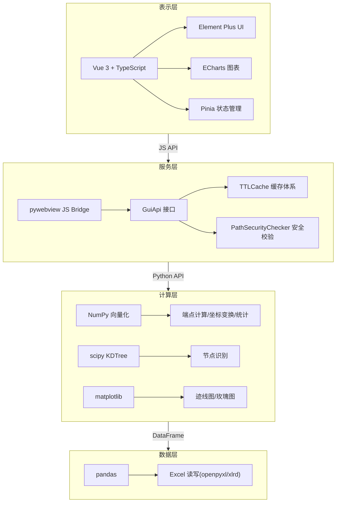
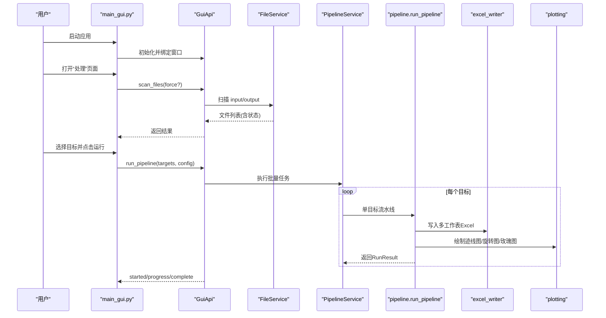
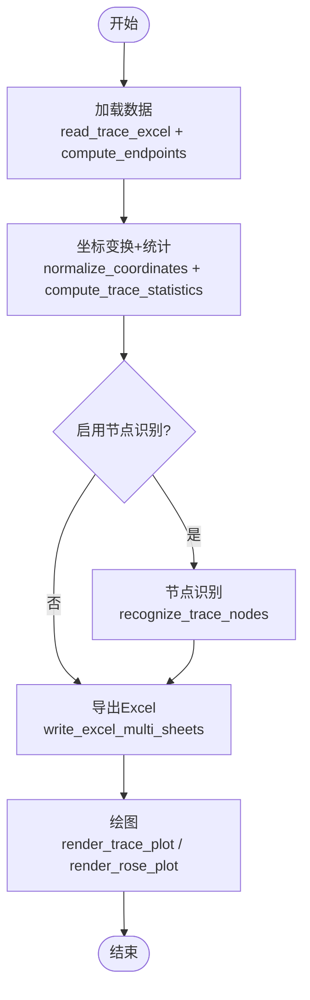
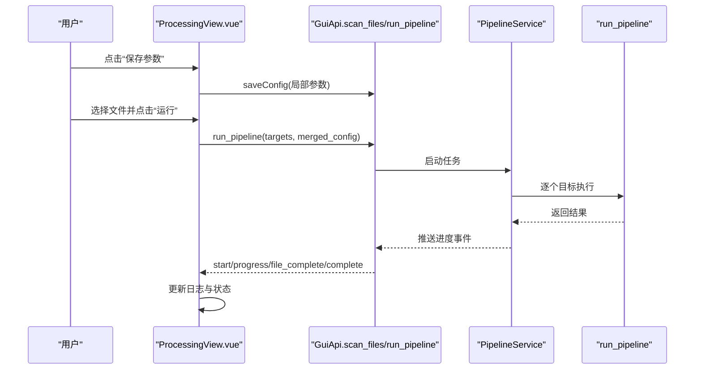
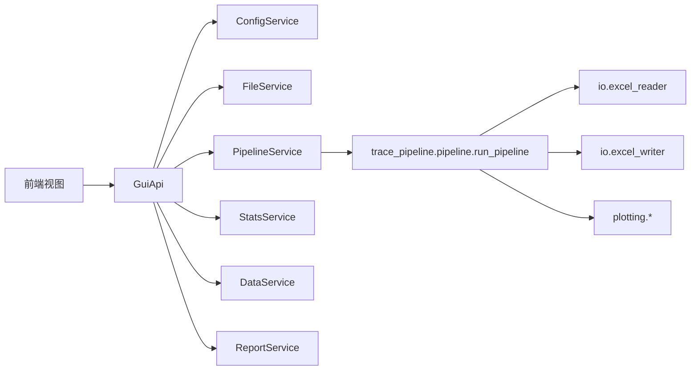

# 用户手册

<cite>
**本文引用的文件**   
- [README.md](file://README.md)
- [trace_pipeline/__init__.py](file://trace_pipeline/__init__.py)
- [trace_pipeline/config.py](file://trace_pipeline/config.py)
- [config.example.json](file://config.example.json)
- [trace_pipeline/cli/main.py](file://trace_pipeline/cli/main.py)
- [trace_pipeline/pipeline.py](file://trace_pipeline/pipeline.py)
- [trace_pipeline/io/excel_reader.py](file://trace_pipeline/io/excel_reader.py)
- [trace_pipeline/io/excel_writer.py](file://trace_pipeline/io/excel_writer.py)
- [backend/main_gui.py](file://backend/main_gui.py)
- [backend/gui_api.py](file://backend/gui_api.py)
- [frontend/src/views/ProcessingView.vue](file://frontend/src/views/ProcessingView.vue)
- [frontend/src/views/StatisticsView.vue](file://frontend/src/views/StatisticsView.vue)
- [frontend/src/views/DataView.vue](file://frontend/src/views/DataView.vue)
- [frontend/src/views/ComparisonView.vue](file://frontend/src/views/ComparisonView.vue)
- [frontend/src/views/ConfigView.vue](file://frontend/src/views/ConfigView.vue)
</cite>

## 目录
1. [简介](#简介)
2. [项目结构](#项目结构)
3. [核心组件](#核心组件)
4. [架构总览](#架构总览)
5. [详细组件分析](#详细组件分析)
6. [依赖关系分析](#依赖关系分析)
7. [性能与并行处理](#性能与并行处理)
8. [故障排查指南](#故障排查指南)
9. [结论](#结论)
10. [附录：输入数据格式与输出产物](#附录输入数据格式与输出产物)

## 简介
TracePipeline 是一套面向岩体节理几何特征分析的专业工具，提供 CLI 命令行与桌面 GUI 双模式，支持从原始测线记录到统计指标、可视化图表的全流程自动化处理。系统采用四层架构（表示层、服务层、计算层、数据层），具备高可靠的安全校验、缓存体系与结构化日志能力。

## 项目结构
- 后端 Python 包 trace_pipeline 提供配置、流水线编排、Excel 读写、绘图、CLI 等核心能力
- 前端 Vue 3 + Element Plus + ECharts 构建桌面 GUI 的六个页面视图
- 服务层通过 pywebview JS Bridge 暴露 GuiApi，供前端调用
- 计算层基于 NumPy/scipy/shapely/matplotlib 实现向量化算法与高精度绘图
- 数据层使用 pandas/openpyxl/xlrd 完成 Excel 读取与多工作表导出

图示来源
- [backend/main_gui.py:81-206](file://backend/main_gui.py#L81-L206)
- [backend/gui_api.py:52-110](file://backend/gui_api.py#L52-L110)
- [trace_pipeline/pipeline.py:230-474](file://trace_pipeline/pipeline.py#L230-L474)
- [trace_pipeline/io/excel_reader.py:36-106](file://trace_pipeline/io/excel_reader.py#L36-L106)
- [trace_pipeline/io/excel_writer.py:462-489](file://trace_pipeline/io/excel_writer.py#L462-L489)

章节来源
- [README.md:170-281](file://README.md#L170-L281)

## 核心组件
- 配置加载与覆盖：默认配置、JSON 覆盖、CLI 参数覆盖、路径解析与工作目录保障
- 文件发现与读取：自动扫描 input 目录，优先 .xlsx，回退 .xls；工作表不存在时回退首表
- 处理流水线：加载 → 坐标变换+统计 → 节点识别 → Excel 导出 → 绘图
- Excel 多工作表导出：基本信息、裂隙情况、计算数据、端点坐标、走向与长度、节点统计/明细/交点
- GUI 服务桥接：GuiApi 统一封装配置、文件、流水线、统计、数据、报告、预览、日志等能力
- 前端六页视图：首页、处理、统计、对比、数据、配置

章节来源
- [trace_pipeline/config.py:86-190](file://trace_pipeline/config.py#L86-L190)
- [trace_pipeline/io/excel_reader.py:36-106](file://trace_pipeline/io/excel_reader.py#L36-L106)
- [trace_pipeline/pipeline.py:230-474](file://trace_pipeline/pipeline.py#L230-L474)
- [trace_pipeline/io/excel_writer.py:280-394](file://trace_pipeline/io/excel_writer.py#L280-L394)
- [backend/gui_api.py:388-446](file://backend/gui_api.py#L388-L446)

## 架构总览
GUI 启动流程与前后端交互如下：

图示来源
- [backend/main_gui.py:81-206](file://backend/main_gui.py#L81-L206)
- [backend/gui_api.py:388-446](file://backend/gui_api.py#L388-L446)
- [trace_pipeline/pipeline.py:230-474](file://trace_pipeline/pipeline.py#L230-L474)
- [trace_pipeline/io/excel_writer.py:462-489](file://trace_pipeline/io/excel_writer.py#L462-L489)

## 详细组件分析

### 配置与路径解析
- 默认配置键集与类型在模块中定义，缺失字段使用默认值
- JSON 配置文件可覆盖默认值，未知键将被忽略并记录警告
- 必填项校验：input_dir、output_dir、outcrop；单文件模式下还需 table_stem
- 相对路径解析为绝对路径，确保跨工作目录稳定运行
- CLI 参数覆盖合并后重新校验

章节来源
- [trace_pipeline/config.py:56-79](file://trace_pipeline/config.py#L56-L79)
- [trace_pipeline/config.py:148-190](file://trace_pipeline/config.py#L148-L190)
- [config.example.json:1-26](file://config.example.json#L1-L26)

### 文件发现与 Excel 读取
- 自动扫描 input 目录下 *_process.xls* 文件
- 优先 .xlsx，缺失则回退 .xls；指定 sheet 不存在时回退首表
- 文件大小上限检查，避免加载超大文件
- 基础格式校验：最少列数与前几行数值占比检测

章节来源
- [trace_pipeline/io/excel_reader.py:36-106](file://trace_pipeline/io/excel_reader.py#L36-L106)
- [trace_pipeline/io/excel_reader.py:128-169](file://trace_pipeline/io/excel_reader.py#L128-L169)

### 处理流水线（五阶段）
- 阶段一：数据加载（按文件签名缓存 TraceData）
- 阶段二：坐标变换与统计（归一化、旋转、圆窗策略、P₁₀/P₂₀/P₂₁、面积四级回退）
- 阶段三：节点识别（可选，I/Y/X 拓扑识别、网格聚类+并查集、自适应容差）
- 阶段四：Excel 多工作表导出（基本信息、裂隙情况、计算数据、端点坐标、走向与长度、节点相关表）
- 阶段五：绘图（原始迹线图、旋转迹线图、可选玫瑰图）

图示来源
- [trace_pipeline/pipeline.py:230-474](file://trace_pipeline/pipeline.py#L230-L474)
- [trace_pipeline/io/excel_writer.py:280-394](file://trace_pipeline/io/excel_writer.py#L280-L394)

章节来源
- [trace_pipeline/pipeline.py:230-474](file://trace_pipeline/pipeline.py#L230-L474)

### Excel 多工作表导出
- 布局与样式：标题行合并、中英文字体区分、冻结窗格、边框与对齐
- 区段组织：基本信息、裂隙情况、计算数据、原始/旋转端点坐标、走向与长度、节点统计/明细/交点
- 数值格式化与单位标注，来源标签（实测/凸包/缓冲凸包/圆窗等效）

章节来源
- [trace_pipeline/io/excel_writer.py:73-170](file://trace_pipeline/io/excel_writer.py#L73-L170)
- [trace_pipeline/io/excel_writer.py:280-394](file://trace_pipeline/io/excel_writer.py#L280-L394)
- [trace_pipeline/io/excel_writer.py:462-489](file://trace_pipeline/io/excel_writer.py#L462-L489)

### GUI 服务桥接（GuiApi）
- 懒加载服务：PipelineService、PreviewService、StatsService、DataService、ReportService、AuditService
- 安全校验：路径遍历防护、外部域名白名单、图片格式/大小校验
- 进度轮询：流水线与报告导出进度队列，前端定时拉取
- 运行锁：重资源操作并发控制（预览、报告生成、ZIP 打包）

章节来源
- [backend/gui_api.py:52-110](file://backend/gui_api.py#L52-L110)
- [backend/gui_api.py:388-446](file://backend/gui_api.py#L388-L446)
- [backend/gui_api.py:644-731](file://backend/gui_api.py#L644-L731)

### 前端六页视图操作流程

#### 首页
- 展示项目介绍、功能卡片、快速入门引导
- 首次启动包含 WebView2 检测、配置初始化、文件扫描、服务就绪引导

章节来源
- [README.md:147-165](file://README.md#L147-L165)
- [backend/main_gui.py:97-133](file://backend/main_gui.py#L97-L133)

#### 处理
- 参数面板：导出玫瑰图、启用节点识别、DPI 与分箱宽度设置
- 文件列表：扫描 input 目录，显示待处理/已完成状态
- 进度监控：实时轮询进度事件，显示当前处理文件与消息
- 结果查看：打开图片模态框，查看原始/旋转/玫瑰图

图示来源
- [frontend/src/views/ProcessingView.vue:354-403](file://frontend/src/views/ProcessingView.vue#L354-L403)
- [backend/gui_api.py:388-446](file://backend/gui_api.py#L388-L446)
- [trace_pipeline/pipeline.py:230-474](file://trace_pipeline/pipeline.py#L230-L474)

章节来源
- [frontend/src/views/ProcessingView.vue:1-800](file://frontend/src/views/ProcessingView.vue#L1-L800)

#### 统计
- 露头选择器与导出报告按钮
- 统计卡片：迹线数量、I/II/III 型计数、密度指标、平均迹长、面积来源
- 图表：直方图、饼图、迹线图/旋转图/玫瑰图切换查看
- 报告导出：Word/PDF 一键生成，支持 ZIP 打包与进度轮询

章节来源
- [frontend/src/views/StatisticsView.vue:1-612](file://frontend/src/views/StatisticsView.vue#L1-L612)
- [backend/gui_api.py:644-731](file://backend/gui_api.py#L644-L731)

#### 对比
- 多露头对比表格：密度指标、裂隙类型比例、节点指标（可选）
- 柱状图对比：密度指标、裂隙类型、节点指标、面积/长度
- 图片网格：所有露头的结果图缩略图，支持筛选与搜索，悬停懒加载

章节来源
- [frontend/src/views/ComparisonView.vue:1-774](file://frontend/src/views/ComparisonView.vue#L1-L774)

#### 数据
- 输入/输出数据切换：浏览原始输入或输出结果
- 输出数据基本信息：测线走向、迹线条数、测线长度、露头面积、平均迹长、面积来源
- 分页表格：9 区 Excel 分页浏览（由 DataTable 组件承载）

章节来源
- [frontend/src/views/DataView.vue:1-302](file://frontend/src/views/DataView.vue#L1-L302)

#### 配置
- 全局设置表单：路径、策略、DPI、并行度等
- 样式预览：颜色、线宽、节点样式、网格开关等
- 开发者面板：调试信息、日志查看、测试入口
- 导入/导出 JSON：备份与迁移配置

章节来源
- [frontend/src/views/ConfigView.vue:1-302](file://frontend/src/views/ConfigView.vue#L1-L302)

## 依赖关系分析
- 前端通过 pywebview JS Bridge 调用 GuiApi，GuiApi 再调度各 Service
- PipelineService 调用 trace_pipeline.pipeline.run_pipeline 完成五阶段处理
- Excel 读写依赖 pandas/openpyxl/xlrd；绘图依赖 matplotlib；空间算法依赖 scipy/shapely

图示来源
- [backend/gui_api.py:52-110](file://backend/gui_api.py#L52-L110)
- [trace_pipeline/pipeline.py:230-474](file://trace_pipeline/pipeline.py#L230-L474)
- [trace_pipeline/io/excel_reader.py:36-106](file://trace_pipeline/io/excel_reader.py#L36-L106)
- [trace_pipeline/io/excel_writer.py:462-489](file://trace_pipeline/io/excel_writer.py#L462-L489)

章节来源
- [backend/gui_api.py:52-110](file://backend/gui_api.py#L52-L110)
- [trace_pipeline/pipeline.py:230-474](file://trace_pipeline/pipeline.py#L230-L474)

## 性能与并行处理
- 并行进程数：CLI 支持 -p 指定；GUI 支持 parallel_workers 配置
- 启发式降级：目标数 ≤2 时默认串行，可通过 --force-parallel 强制并行
- 缓存体系：文件扫描 TTL、统计数据 LRU、图片缩略图 LRU、Excel 数据 TTL
- 进度轮询：前端每 300ms 轮询一次，连续失败超过阈值自动停止

章节来源
- [trace_pipeline/cli/main.py:28-110](file://trace_pipeline/cli/main.py#L28-L110)
- [frontend/src/views/ProcessingView.vue:410-442](file://frontend/src/views/ProcessingView.vue#L410-L442)
- [README.md:603-610](file://README.md#L603-L610)

## 故障排查指南
- 常见错误提示
  - PermissionError：文件被占用或权限不足，请关闭已打开的输出文件后重试
  - FileNotFoundError：输入文件不存在，请检查文件路径
  - 配置加载失败：JSON 格式无效或缺少必填字段
- 定位方法
  - 查看 GUI 处理过程日志与错误提示
  - 检查 logs 目录下的结构化日志（JSON Lines，按日轮转）
  - 确认 output 目录变更检测是否触发缓存失效

章节来源
- [trace_pipeline/pipeline.py:450-474](file://trace_pipeline/pipeline.py#L450-L474)
- [backend/gui_api.py:420-446](file://backend/gui_api.py#L420-L446)
- [README.md:114-116](file://README.md#L114-L116)

## 结论
TracePipeline 以严谨的分层架构与完善的缓存/安全机制，提供了从数据准备到可视化报告的完整解决方案。CLI 适合批处理与自动化，GUI 适合交互式分析与结果展示。遵循输入规范与最佳实践可获得稳定高效的产出。

## 附录：输入数据格式与输出产物

### 输入数据格式
- 文件命名：{露头编号}_process.xlsx 或 {露头编号}_process.xls，放置于 input 目录
- 工作表：以露头编号命名的工作表（如 O76），第 1 行为表头，第 2 行起为数据行
- 表头关键字段（1-indexed）
  - H(8) 测线走向（°）
  - I(9) 迹线条数 N
  - L(12) 实测测线长度（m，可选）
  - M(13) 实测露头面积（m²，可选）
- 数据行字段（A–G）
  - A r₁（沿测线位移 m）
  - B r₂（垂直测线位移 m）
  - C 倾向（°）
  - D r₄（左侧迹长 1 m）
  - E r₅（左侧迹长 2 m）
  - F r₆（右侧迹长 1 m）
  - G r₇（右侧迹长 2 m）
- 注意事项
  - 前 7 列必须为数值型
  - r₅ 与 r₇ 不能同时为 0
  - 仅记录迹长 > 30 cm 的结构面
  - 程序自动将倾向转换为走向（±90°，规范化到 [0, 180)）

章节来源
- [README.md:509-554](file://README.md#L509-L554)
- [trace_pipeline/io/excel_reader.py:36-106](file://trace_pipeline/io/excel_reader.py#L36-L106)

### 输出产物
- 多工作表 Excel：{露头}_traces.xlsx，包含基本信息、裂隙情况、计算数据、端点坐标、走向与长度、节点统计/明细/交点等
- 迹线图：{露头}_raw(n=N).png 与 {露头}_rotated(strike=X).png
- 玫瑰图（可选）：{露头}_rose(bin=X).png
- 报告（可选）：reports/{露头}_report.pdf/.docx

章节来源
- [README.md:132-141](file://README.md#L132-L141)
- [trace_pipeline/io/excel_writer.py:280-394](file://trace_pipeline/io/excel_writer.py#L280-L394)

### CLI 命令行模式
- 基本用法
  - 批量处理全部露头：python run_trace_pipeline.py
  - 列出可用文件：python run_trace_pipeline.py -l
  - 试运行：python run_trace_pipeline.py -n
  - 交互式选择：python run_trace_pipeline.py -I
  - 自定义配置：python run_trace_pipeline.py -c my_config.json
  - 并行处理：python run_trace_pipeline.py -p 4
  - 指定圆窗策略与 DPI：python run_trace_pipeline.py --window-strategy hybrid --rose-bin 5 --rose-dpi 1200
- 完整参数
  - --input/-i：输入目录
  - --output/-o：输出目录
  - --config/-c：配置文件路径
  - --single/-s：单文件模式
  - --parallel/-p：并行进程数
  - --list/-l：列出文件后退出
  - --interactive/-I：交互式选择
  - --dry-run/-n：试运行
  - --no-rose：跳过玫瑰图
  - --rose-bin/--rose-dpi：玫瑰图分箱与分辨率
  - --window-strategy：圆窗策略
  - --force-parallel：强制并行

章节来源
- [README.md:555-610](file://README.md#L555-L610)
- [trace_pipeline/cli/main.py:28-110](file://trace_pipeline/cli/main.py#L28-L110)

### Python API 编程接口
- 完整流水线
  - 加载配置与 RunConfig
  - 调用 run_pipeline(config) 获取 RunResult
  - 访问结果字段：status、excel_path、raw_plot_path、rotated_plot_path、trace_count、area_source 等
- 单独统计计算
  - load_trace_data(input_dir, table_stem, outcrop)
  - compute_trace_statistics(trace, stats_config)
  - 输出 P₁₀/P₂₀/P₂₁、平均迹长、面积来源、圆窗策略等
- 节点识别
  - NodeRecognitionConfig(enabled, merge_tolerance, show_overlay, label_mode)
  - recognize_trace_nodes(endpoints, config)
  - 输出节点总数、类型计数、交点事件、节点密度等

章节来源
- [trace_pipeline/__init__.py:21-82](file://trace_pipeline/__init__.py#L21-L82)
- [trace_pipeline/pipeline.py:80-96](file://trace_pipeline/pipeline.py#L80-L96)
- [trace_pipeline/pipeline.py:230-474](file://trace_pipeline/pipeline.py#L230-L474)

### 实际使用案例与最佳实践
- 典型流程
  - 准备输入数据至 input 目录，命名符合规范
  - 复制 config.example.json 为 config.json，按需修改路径与策略
  - 使用 CLI 批量处理或 GUI 交互式运行
  - 在“统计/对比/数据”页面查看结果与导出报告
- 最佳实践
  - 合理设置 rose_bin_width（5°–30°）与 DPI，平衡精度与体积
  - 对少量目标使用串行，大批量使用并行（注意内存与磁盘 I/O）
  - 开启节点识别时适当调整 node_merge_tolerance，避免过度合并
  - 定期清理 output 目录或使用报告打包功能归档

章节来源
- [README.md:64-84](file://README.md#L64-L84)
- [README.md:410-505](file://README.md#L410-L505)
- [frontend/src/views/StatisticsView.vue:370-400](file://frontend/src/views/StatisticsView.vue#L370-L400)