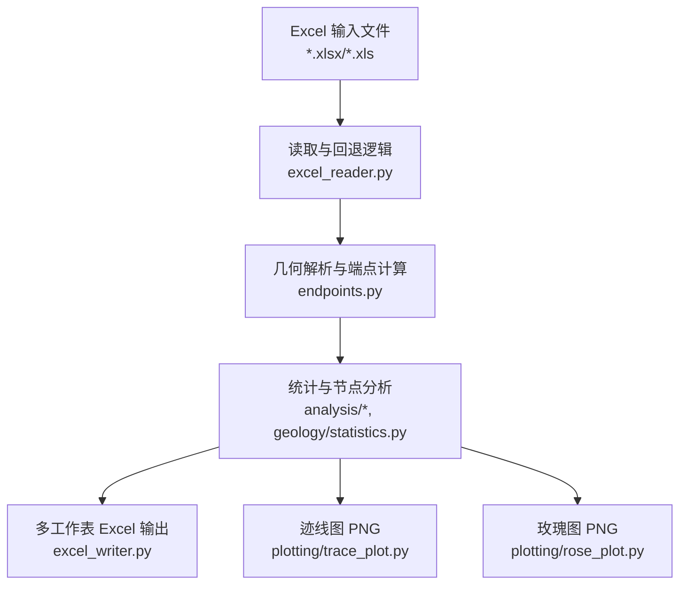
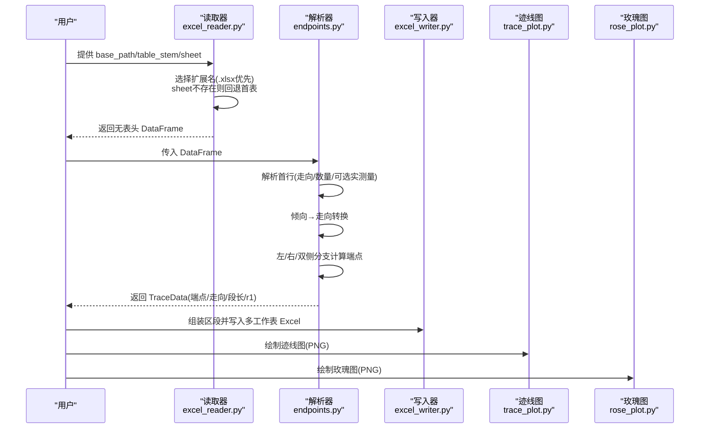
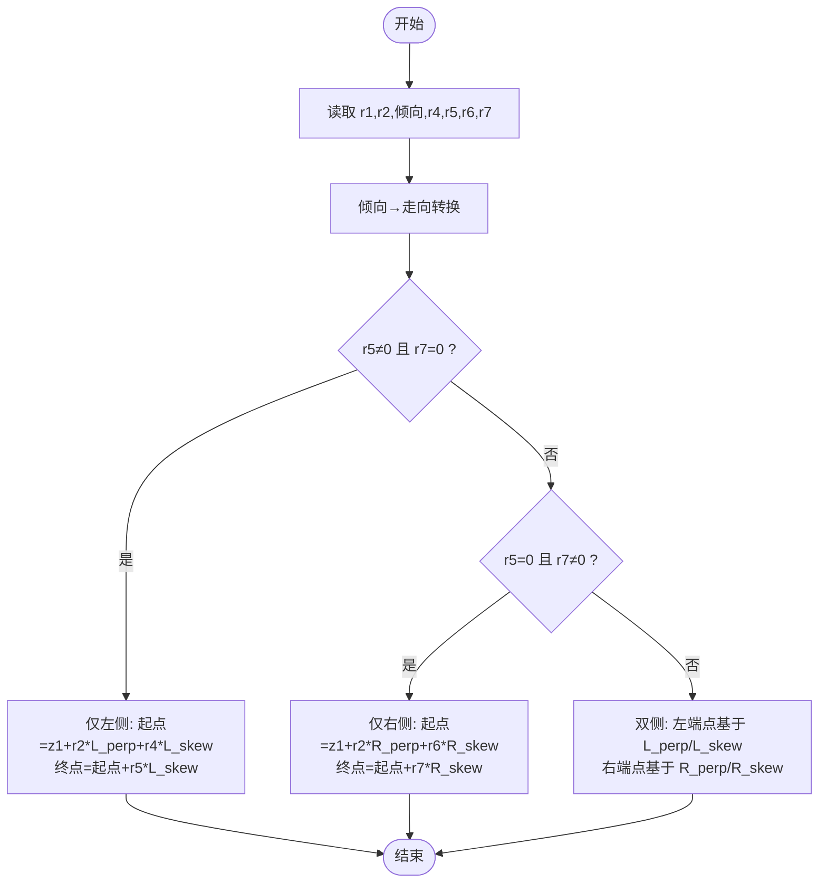
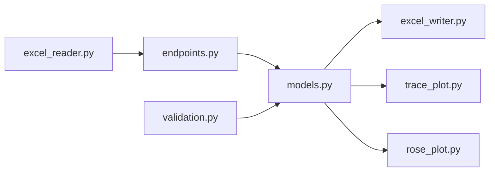

# 输入输出格式规范

<cite>
**本文引用的文件**   
- [trace_pipeline/io/excel_reader.py](file://trace_pipeline/io/excel_reader.py)
- [trace_pipeline/io/excel_writer.py](file://trace_pipeline/io/excel_writer.py)
- [trace_pipeline/geology/endpoints.py](file://trace_pipeline/geology/endpoints.py)
- [trace_pipeline/models.py](file://trace_pipeline/models.py)
- [reference/matlab/README.md](file://reference/matlab/README.md)
- [reference/matlab/A_outcrop_0map_coordinate.m](file://reference/matlab/A_outcrop_0map_coordinate.m)
- [reference/matlab/Coordinate.m](file://reference/matlab/Coordinate.m)
- [config.example.json](file://config.example.json)
- [tests/test_excel_reader.py](file://tests/test_excel_reader.py)
- [tests/test_excel_writer.py](file://tests/test_excel_writer.py)
</cite>

## 目录
1. [引言](#引言)
2. [项目结构](#项目结构)
3. [核心组件](#核心组件)
4. [架构总览](#架构总览)
5. [详细组件分析](#详细组件分析)
6. [依赖关系分析](#依赖关系分析)
7. [性能与质量考量](#性能与质量考量)
8. [故障排查指南](#故障排查指南)
9. [结论](#结论)
10. [附录](#附录)

## 引言
本规范面向使用 TracePipeline 进行地质迹线数据处理的用户，明确 Excel 输入文件的命名约定、工作表结构与字段含义，详细说明 r₁–r₇ 测线记录的数学意义与填写要求；同时给出输出产物（多工作表 Excel 报告、PNG 迹线图、玫瑰图）的格式与样式配置说明，并阐述与 MATLAB 原型算法的兼容性与数据转换规则。文档还包含文件格式验证与数据质量检查方法，帮助用户快速构建正确输入并理解输出结果。

## 项目结构
本项目围绕“读取 Excel → 解析几何 → 统计与可视化 → 写入多工作表 Excel + PNG”的流程组织代码。关键模块：
- 输入读取与校验：trace_pipeline/io/excel_reader.py
- 几何解析与端点计算：trace_pipeline/geology/endpoints.py
- 模型与运行参数：trace_pipeline/models.py
- 输出写入（多工作表 Excel）：trace_pipeline/io/excel_writer.py
- 可视化（迹线图、玫瑰图）：trace_pipeline/plotting/*
- MATLAB 参考对照：reference/matlab/*
- 示例配置：config.example.json

图表来源
- [trace_pipeline/io/excel_reader.py:36-106](file://trace_pipeline/io/excel_reader.py#L36-L106)
- [trace_pipeline/geology/endpoints.py:295-411](file://trace_pipeline/geology/endpoints.py#L295-L411)
- [trace_pipeline/io/excel_writer.py:462-489](file://trace_pipeline/io/excel_writer.py#L462-L489)
- [trace_pipeline/plotting/trace_plot.py:443-565](file://trace_pipeline/plotting/trace_plot.py#L443-L565)
- [trace_pipeline/plotting/rose_plot.py:106-140](file://trace_pipeline/plotting/rose_plot.py#L106-L140)

章节来源
- [trace_pipeline/io/excel_reader.py:1-169](file://trace_pipeline/io/excel_reader.py#L1-L169)
- [trace_pipeline/geology/endpoints.py:1-418](file://trace_pipeline/geology/endpoints.py#L1-L418)
- [trace_pipeline/io/excel_writer.py:1-489](file://trace_pipeline/io/excel_writer.py#L1-L489)
- [trace_pipeline/plotting/trace_plot.py:1-565](file://trace_pipeline/plotting/trace_plot.py#L1-L565)
- [trace_pipeline/plotting/rose_plot.py:1-140](file://trace_pipeline/plotting/rose_plot.py#L1-L140)
- [config.example.json:1-26](file://config.example.json#L1-L26)

## 核心组件
- 输入读取器：支持 .xlsx/.xls 双扩展名优先选择、指定工作表不存在时回退首表、文件大小上限保护、基础列数与数值性校验。
- 几何解析器：从首行解析测线走向与迹线条数，将倾向转换为走向，按左/右/双侧三种情况向量化计算端点坐标，并输出 r5+r7 段长与 r1 位置序列。
- 输出写入器：生成多工作表 Excel，包含基本信息、裂隙情况、计算数据、原始/旋转端点坐标、走向与长度等区段，并对单元格字体、对齐、边框、冻结窗格等进行统一样式设置。
- 可视化：迹线图（含比例尺、指北针、图例、可选圆窗/凸包/节点覆盖层）、玫瑰图（半圆折叠分箱、极坐标柱体）。

章节来源
- [trace_pipeline/io/excel_reader.py:36-106](file://trace_pipeline/io/excel_reader.py#L36-L106)
- [trace_pipeline/geology/endpoints.py:113-179](file://trace_pipeline/geology/endpoints.py#L113-L179)
- [trace_pipeline/io/excel_writer.py:280-331](file://trace_pipeline/io/excel_writer.py#L280-L331)
- [trace_pipeline/plotting/trace_plot.py:443-565](file://trace_pipeline/plotting/trace_plot.py#L443-L565)
- [trace_pipeline/plotting/rose_plot.py:76-140](file://trace_pipeline/plotting/rose_plot.py#L76-L140)

## 架构总览
下图展示从输入到输出的端到端流程，包括回退策略、几何计算分支与输出产物。

图表来源
- [trace_pipeline/io/excel_reader.py:36-106](file://trace_pipeline/io/excel_reader.py#L36-L106)
- [trace_pipeline/geology/endpoints.py:295-411](file://trace_pipeline/geology/endpoints.py#L295-L411)
- [trace_pipeline/io/excel_writer.py:462-489](file://trace_pipeline/io/excel_writer.py#L462-L489)
- [trace_pipeline/plotting/trace_plot.py:443-565](file://trace_pipeline/plotting/trace_plot.py#L443-L565)
- [trace_pipeline/plotting/rose_plot.py:106-140](file://trace_pipeline/plotting/rose_plot.py#L106-L140)

## 详细组件分析

### 输入 Excel 文件命名与工作表结构
- 命名约定
  - 支持两种扩展名：.xlsx 优先，缺失时回退 .xls。
  - 文件名由 table_stem 决定，例如 O76_process.xlsx 或 O76_process.xls。
  - 若指定 sheet 名称不存在，自动回退至第一个工作表。
- 工作表布局（0-based 列索引）
  - 第 0 列：r1 — 沿测线位移
  - 第 1 列：r2 — 垂直测线位移
  - 第 2 列：倾向（输入值，内部转为走向）
  - 第 3 列：r4 — 左侧迹长 1
  - 第 4 列：r5 — 左侧迹长 2
  - 第 5 列：r6 — 右侧迹长 1
  - 第 6 列：r7 — 右侧迹长 2
  - 第 7 列：ang0 — 测线走向角（度），仅首行有效
  - 第 8 列：n — 迹线条数，仅首行有效
  - 第 11 列：实测测线长度（m），仅首行，可选
  - 第 12 列：实测露头面积（m²），仅首行，可选
- 必填与可选
  - 必填：前 7 列数据块（N×7），以及首行的 ang0 与 n。
  - 可选：首行第 11、12 列用于后续统计与报告标注。
- 数据类型与范围
  - r1 ≥ 0；倾向 ∈ [0, 360)；r4/r5/r6/r7 ≥ 0；且 r5 与 r7 不能同时为 0。
  - ang0 ∈ [0, 360)，n 为正整数且与实际行数一致。
  - 可选实测量需为正有限浮点数。
- 最小列数与大小限制
  - 至少需要 4 列（x1,y1,x2,y2）作为最低保障；完整解析需 9 列以上以包含表头信息。
  - 单文件最大 50 MiB，超限直接拒绝。

章节来源
- [trace_pipeline/io/excel_reader.py:36-106](file://trace_pipeline/io/excel_reader.py#L36-L106)
- [trace_pipeline/io/excel_reader.py:128-169](file://trace_pipeline/io/excel_reader.py#L128-L169)
- [trace_pipeline/geology/endpoints.py:52-67](file://trace_pipeline/geology/endpoints.py#L52-L67)
- [trace_pipeline/geology/endpoints.py:113-179](file://trace_pipeline/geology/endpoints.py#L113-L179)
- [trace_pipeline/geology/endpoints.py:182-205](file://trace_pipeline/geology/endpoints.py#L182-L205)
- [tests/test_excel_reader.py:13-46](file://tests/test_excel_reader.py#L13-L46)

### r₁–r₇ 测线记录的数学含义与填写规范
- 坐标系与基准向量
  - 以测线起点为原点，沿测线方向为基准角 ang_base_deg（由 ang0 转换而来）。
  - 垂直于测线的左右法向量分别对应左/右侧偏移方向。
- 各字段含义
  - r1：沿测线位移（≥0），确定节理在测线上的投影位置。
  - r2：垂直测线位移，表示节理相对测线的横向偏移。
  - 倾向（输入）：经 dip_to_strike 转换为标准走向后参与几何计算。
  - r4/r5：左侧两段迹长（可视为分段记录），r6/r7：右侧两段迹长。
  - 段长定义：segment_length = r5 + r7（与 MATLAB 一致）。
- 三种情形与端点计算
  - 仅左侧有迹线（r5 ≠ 0, r7 = 0）：起点 z1 + r2·L_perp + r4·L_skew，终点 = 起点 + r5·L_skew。
  - 仅右侧有迹线（r5 = 0, r7 ≠ 0）：起点 z1 + r2·R_perp + r6·R_skew，终点 = 起点 + r7·R_skew。
  - 双侧均有迹线（r5 ≠ 0, r7 ≠ 0）：左端点基于 L_perp/L_skew，右端点基于 R_perp/R_skew。
- 填写规范
  - 所有长度非负；r5 与 r7 不可同时为 0。
  - 倾向必须位于 [0, 360)。
  - 首行 ang0 与 n 必须合法且与实际数据行数匹配。

图表来源
- [trace_pipeline/geology/endpoints.py:210-290](file://trace_pipeline/geology/endpoints.py#L210-L290)
- [trace_pipeline/geology/endpoints.py:295-411](file://trace_pipeline/geology/endpoints.py#L295-L411)

章节来源
- [trace_pipeline/geology/endpoints.py:210-290](file://trace_pipeline/geology/endpoints.py#L210-L290)
- [trace_pipeline/geology/endpoints.py:295-411](file://trace_pipeline/geology/endpoints.py#L295-L411)

### 输出产物格式与内容
- 多工作表 Excel 报告
  - 基本信息：测线走向、测线长度、平均迹长、露头面积（含来源标签）。
  - 裂隙情况：迹线数量、I/II/III 型裂隙计数。
  - 计算数据：线密度 P₁₀、面密度 P₂₀、面累计长度密度 P₂₁、有效取样窗数量，可能包含校验告警。
  - 原始端点坐标：起点X/Y、终点X/Y。
  - 旋转后端点坐标：旋转后起点X/Y、旋转后终点X/Y。
  - 走向与长度：节理走向（°）、端点距离、测段长度(r5+r7)、迹线类型（可选）。
  - 节点相关（可选）：节点统计、节点明细、节点交点。
- 迹线图 PNG
  - 自适应 figure 尺寸，确保不同图之间 1m 物理长度尽量一致。
  - 包含比例尺、指北针、图例、统计框；可选叠加圆窗/凸包/节点覆盖层。
  - 背景色可配置（支持透明）。
- 玫瑰图 PNG
  - 半圆折叠分箱，极坐标柱体显示，网格与刻度样式固定。
  - 标题、颜色、网格线、柱体边线与透明度可配置。

章节来源
- [trace_pipeline/io/excel_writer.py:193-273](file://trace_pipeline/io/excel_writer.py#L193-L273)
- [trace_pipeline/io/excel_writer.py:280-331](file://trace_pipeline/io/excel_writer.py#L280-L331)
- [trace_pipeline/io/excel_writer.py:334-394](file://trace_pipeline/io/excel_writer.py#L334-L394)
- [trace_pipeline/plotting/trace_plot.py:443-565](file://trace_pipeline/plotting/trace_plot.py#L443-L565)
- [trace_pipeline/plotting/rose_plot.py:76-140](file://trace_pipeline/plotting/rose_plot.py#L76-L140)

### 玫瑰图样式配置与迹线图参数
- 玫瑰图
  - 分箱宽度：bin_width ∈ (0, 180]（度），默认 10°。
  - DPI：默认 400，可通过配置调整。
  - 图形尺寸：12×12 cm，极坐标轴角度零点朝北，顺时针方向。
  - 颜色：柱体填充与边框、网格线颜色固定。
- 迹线图
  - DPI：默认 300，可通过配置调整。
  - 自适应尺寸：根据数据跨度计算，目标使 1m 物理长度一致。
  - 图层控制：include_trace/include_hull/include_circles/include_nodes/include_decorations。
  - 背景色：支持 white 或 transparent。

章节来源
- [trace_pipeline/plotting/rose_plot.py:19-24](file://trace_pipeline/plotting/rose_plot.py#L19-L24)
- [trace_pipeline/plotting/rose_plot.py:76-140](file://trace_pipeline/plotting/rose_plot.py#L76-L140)
- [trace_pipeline/plotting/trace_plot.py:44-50](file://trace_pipeline/plotting/trace_plot.py#L44-L50)
- [trace_pipeline/plotting/trace_plot.py:420-441](file://trace_pipeline/plotting/trace_plot.py#L420-L441)
- [trace_pipeline/plotting/trace_plot.py:443-565](file://trace_pipeline/plotting/trace_plot.py#L443-L565)

### 与 MATLAB 原型算法的兼容性要求与数据转换规则
- 函数映射
  - 端点计算：MATLAB Coordinate 三分支 → Python 向量化 _compute_left_only/_right_only/_bilateral。
  - 倾向→走向：MATLAB if/elseif 链 → Python dip_to_strike。
  - 半平面判定：MATLAB rada/rade → Python fold_to_halfplane。
  - 平移与旋转：shift_to_positive / rotate_and_shift。
  - 绘图序列：NaN 分隔线段 → segments_to_xy。
  - Excel I/O：xlsread/writematrix → excel_reader/excel_writer。
- 已修正差异
  - MATLAB 旋转角 if 链存在不可达分支，Python 采用 fold_strike_angle 的正确语义，使旋转后测线最贴近水平轴。
- 迹线长度定义
  - MATLAB：traceLengths = r5 + r7。
  - Python：输出两列——端点距离（欧氏距离）与测段长度（r5+r7），兼顾两种语义。

章节来源
- [reference/matlab/README.md:25-71](file://reference/matlab/README.md#L25-L71)
- [reference/matlab/A_outcrop_0map_coordinate.m:1-77](file://reference/matlab/A_outcrop_0map_coordinate.m#L1-L77)
- [reference/matlab/Coordinate.m:1-111](file://reference/matlab/Coordinate.m#L1-L111)
- [trace_pipeline/geology/endpoints.py:295-411](file://trace_pipeline/geology/endpoints.py#L295-L411)

### Excel 模板与示例数据
- 模板建议
  - 文件名：O76_process.xlsx（或 .xls）。
  - 工作表：命名为 outcrop 标识（如 O76），若不存在则回退首表。
  - 首行：第 8 列填 ang0（度），第 9 列填 n（迹线条数），可选第 12 列填实测测线长度，第 13 列填实测露头面积。
  - 数据行：第 1–7 列依次填入 r1、r2、倾向、r4、r5、r6、r7。
- 示例数据要点
  - 至少两条迹线样例，满足 r5 与 r7 不同时为 0，倾向在 [0, 360)，r1/r4/r5/r6/r7 ≥ 0。
  - 首行 ang0 ∈ [0, 360)，n 与实际行数一致。
- 生成方式
  - 可使用 pandas 导出无表头 DataFrame 到 Excel，便于自动化构造测试数据。

章节来源
- [tests/test_excel_reader.py:13-29](file://tests/test_excel_reader.py#L13-L29)
- [trace_pipeline/geology/endpoints.py:113-179](file://trace_pipeline/geology/endpoints.py#L113-L179)

### 文件格式验证与数据质量检查
- 文件级校验
  - 扩展名与存在性：.xlsx 优先，缺失回退 .xls。
  - 工作表回退：指定 sheet 不存在时直接读取首表。
  - 文件大小：超过 50 MiB 直接拒绝。
- 数据级校验
  - 最少列数：至少 4 列（x1,y1,x2,y2）。
  - 数值有效性：前若干行数值占比过低会发出警告。
  - 表头合法性：ang0 与 n 必须为有限值且符合范围；n 与实际行数一致。
  - 数据块合法性：r1 ≥ 0；倾向 ∈ [0, 360)；r4/r5/r6/r7 ≥ 0；r5 与 r7 不能同时为 0。
  - 可选实测量：正有限浮点数。
- 自动化检查建议
  - 在导入阶段调用 read_trace_excel 并捕获 TraceValidationError。
  - 对 endpoints 计算前后进行 isfinite 检查，避免 NaN/inf 污染下游。

章节来源
- [trace_pipeline/io/excel_reader.py:36-106](file://trace_pipeline/io/excel_reader.py#L36-L106)
- [trace_pipeline/io/excel_reader.py:128-169](file://trace_pipeline/io/excel_reader.py#L128-L169)
- [trace_pipeline/geology/endpoints.py:113-179](file://trace_pipeline/geology/endpoints.py#L113-L179)
- [trace_pipeline/geology/endpoints.py:182-205](file://trace_pipeline/geology/endpoints.py#L182-L205)
- [tests/test_excel_reader.py:33-46](file://tests/test_excel_reader.py#L33-L46)

## 依赖关系分析
- 组件耦合
  - excel_reader 与 endpoints 通过 DataFrame 接口解耦；endpoints 不依赖 UI 与 IO 细节。
  - excel_writer 依赖 models.TraceData 与 statistics 结果，负责格式化与样式。
  - plotting 模块独立于 IO，接收 numpy 数组与配置字典。
- 外部依赖
  - pandas/openpyxl 用于 Excel 读写；matplotlib 用于绘图；numpy 用于数值计算。
- 循环依赖规避
  - validation 模块提供纯校验工具，供 config 与 models 共用，避免循环概念依赖。

图表来源
- [trace_pipeline/io/excel_reader.py:36-106](file://trace_pipeline/io/excel_reader.py#L36-L106)
- [trace_pipeline/geology/endpoints.py:295-411](file://trace_pipeline/geology/endpoints.py#L295-L411)
- [trace_pipeline/models.py:41-130](file://trace_pipeline/models.py#L41-L130)
- [trace_pipeline/io/excel_writer.py:280-331](file://trace_pipeline/io/excel_writer.py#L280-L331)
- [trace_pipeline/plotting/trace_plot.py:443-565](file://trace_pipeline/plotting/trace_plot.py#L443-L565)
- [trace_pipeline/plotting/rose_plot.py:106-140](file://trace_pipeline/plotting/rose_plot.py#L106-L140)
- [trace_pipeline/validation.py:90-112](file://trace_pipeline/validation.py#L90-L112)

章节来源
- [trace_pipeline/models.py:41-130](file://trace_pipeline/models.py#L41-L130)
- [trace_pipeline/validation.py:90-112](file://trace_pipeline/validation.py#L90-L112)

## 性能与质量考量
- 性能
  - 端点计算采用预分配数组与就地修改，避免多次拷贝；按 mask 分组处理三种情形，减少分支开销。
  - 迹线图自适应尺寸与批量 scatter 绘制节点，提升渲染效率。
- 质量
  - 严格的数据校验与错误定位（行号+列名），便于快速修复输入。
  - Excel 输出统一字体与样式，保证跨平台可读性。

[本节为通用指导，无需具体文件引用]

## 故障排查指南
- 常见错误
  - 未找到文件或工作表不存在：确认 table_stem 与扩展名，或检查 sheet 名称。
  - 文件过大：拆分数据或压缩后再处理。
  - 表头非法：检查 ang0 与 n 的范围与类型。
  - 数据非法：检查 r1、倾向、r4–r7 的非负性与范围，确保 r5 与 r7 不同时为 0。
- 调试建议
  - 启用日志级别 DEBUG，查看读取与回退过程。
  - 使用单元测试中的小样本数据复现问题。

章节来源
- [trace_pipeline/io/excel_reader.py:36-106](file://trace_pipeline/io/excel_reader.py#L36-L106)
- [trace_pipeline/geology/endpoints.py:113-179](file://trace_pipeline/geology/endpoints.py#L113-L179)
- [tests/test_excel_reader.py:13-46](file://tests/test_excel_reader.py#L13-L46)

## 结论
本规范明确了 TracePipeline 的输入输出格式、r₁–r₇ 的数学含义与填写要求、与 MATLAB 原型的兼容性与差异、以及可视化产物的样式配置。遵循本规范可确保数据一致性、提高处理成功率，并获得高质量的可比输出。

[本节为总结，无需具体文件引用]

## 附录
- 运行配置示例
  - 复制 config.example.json 为 config.json，按需修改 input_dir/output_dir/table_stem/outcrop 等字段。
  - 重要字段：export_rose_plot、rose_bin_width、rose_dpi、trace_dpi、rotated_trace_dpi、window_strategy、style 等。

章节来源
- [config.example.json:1-26](file://config.example.json#L1-L26)