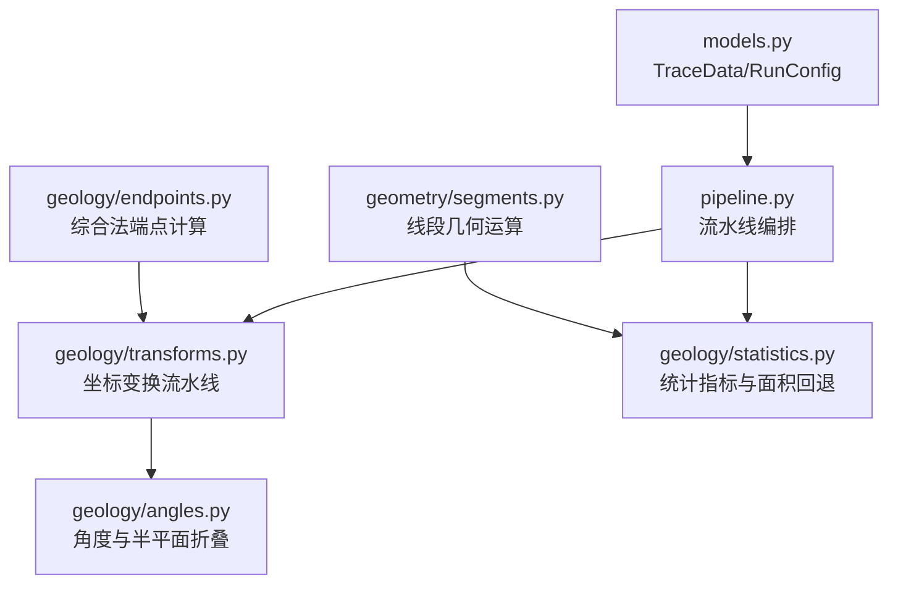
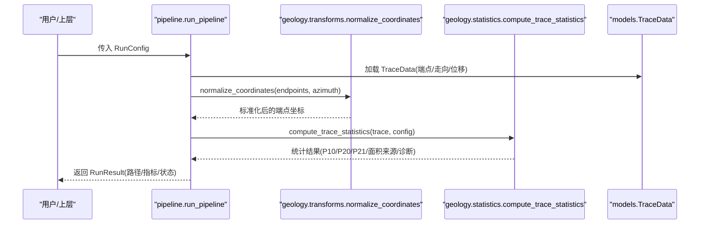
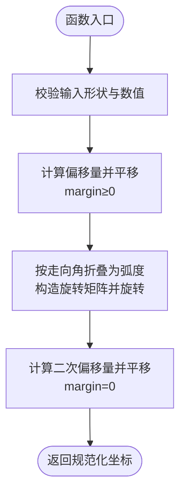
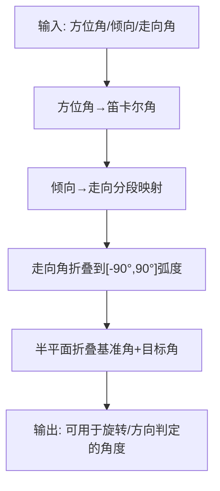
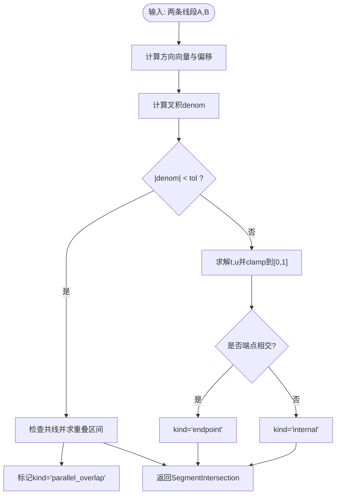
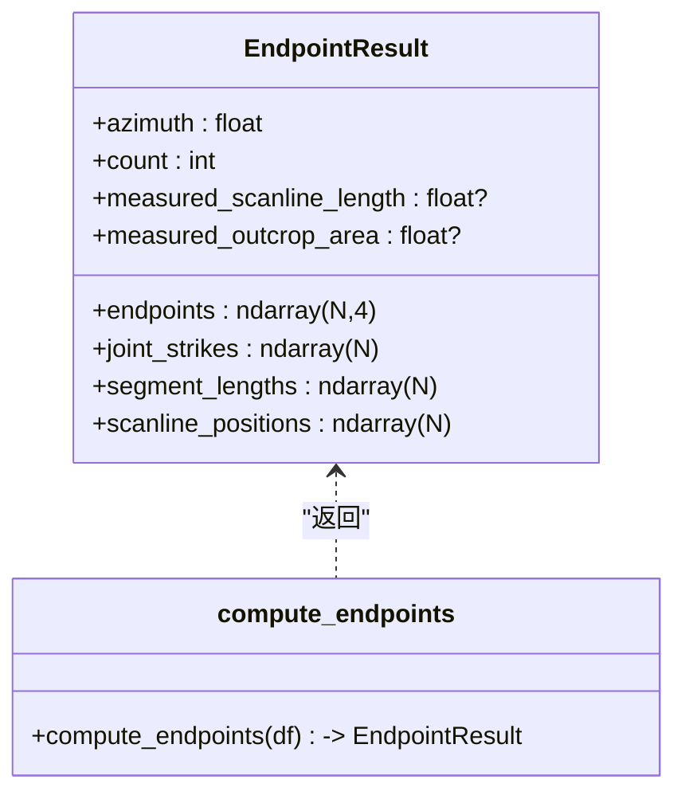
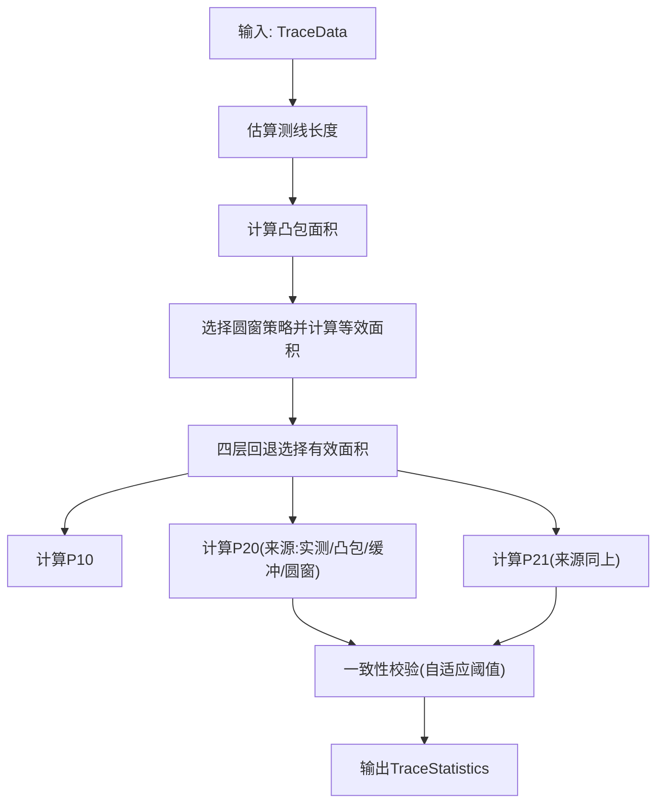
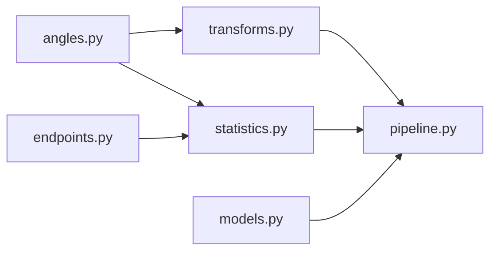

# 坐标变换流水线

<cite>
**本文引用的文件**
- [trace_pipeline/geology/transforms.py](file://trace_pipeline/geology/transforms.py)
- [trace_pipeline/geology/angles.py](file://trace_pipeline/geology/angles.py)
- [trace_pipeline/geometry/segments.py](file://trace_pipeline/geometry/segments.py)
- [trace_pipeline/geology/endpoints.py](file://trace_pipeline/geology/endpoints.py)
- [trace_pipeline/geology/statistics.py](file://trace_pipeline/geology/statistics.py)
- [trace_pipeline/pipeline.py](file://trace_pipeline/pipeline.py)
- [trace_pipeline/models.py](file://trace_pipeline/models.py)
</cite>

## 目录
1. [引言](#引言)
2. [项目结构](#项目结构)
3. [核心组件](#核心组件)
4. [架构总览](#架构总览)
5. [详细组件分析](#详细组件分析)
6. [依赖关系分析](#依赖关系分析)
7. [性能与数值稳定性](#性能与数值稳定性)
8. [可视化与误差分析](#可视化与误差分析)
9. [疑难排查](#疑难排查)
10. [结论](#结论)

## 引言
本技术文档聚焦于“测线坐标系到标准坐标系”的坐标变换流水线，系统阐述以下要点：
- 规范化流程：平移正象限 → 走向角旋转 → 再平移
- 角度系统的数学基础：方位角、倾向、走向之间的转换关系与半平面折叠算法
- 线段几何操作：长度计算、角度测量、相交检测等核心功能
- 精度控制与数值稳定性：容差策略、退化处理、边界条件
- 可视化示例与误差分析：复杂地形条件下的处理案例与最佳实践

该流水线用于将野外测线法采集的节理迹线数据从测线局部坐标系归一化至便于统计与可视化的标准坐标系，确保后续圆窗计数、凸包面积估计、节点识别与绘图的一致性。

## 项目结构
与坐标变换流水线直接相关的代码位于 trace_pipeline 子包中，关键模块如下：
- geology/transforms.py：坐标变换流水线（平移、旋转、规范化）
- geology/angles.py：角度系统与半平面折叠
- geometry/segments.py：线段几何运算（相交、距离、共线重叠）
- geology/endpoints.py：综合法端点计算（复数向量推导）
- geology/statistics.py：统计指标与面积回退策略
- pipeline.py：五阶段流水线编排（含坐标变换调用）
- models.py：不可变数据模型与校验

图表来源
- [trace_pipeline/geology/transforms.py:1-169](file://trace_pipeline/geology/transforms.py#L1-L169)
- [trace_pipeline/geology/angles.py:1-168](file://trace_pipeline/geology/angles.py#L1-L168)
- [trace_pipeline/geometry/segments.py:1-197](file://trace_pipeline/geometry/segments.py#L1-L197)
- [trace_pipeline/geology/statistics.py:1-391](file://trace_pipeline/geology/statistics.py#L1-L391)
- [trace_pipeline/geology/endpoints.py:1-418](file://trace_pipeline/geology/endpoints.py#L1-L418)
- [trace_pipeline/pipeline.py:1-474](file://trace_pipeline/pipeline.py#L1-L474)
- [trace_pipeline/models.py:1-352](file://trace_pipeline/models.py#L1-L352)

章节来源
- [trace_pipeline/geology/transforms.py:1-169](file://trace_pipeline/geology/transforms.py#L1-L169)
- [trace_pipeline/geology/angles.py:1-168](file://trace_pipeline/geology/angles.py#L1-L168)
- [trace_pipeline/geometry/segments.py:1-197](file://trace_pipeline/geometry/segments.py#L1-L197)
- [trace_pipeline/geology/statistics.py:1-391](file://trace_pipeline/geology/statistics.py#L1-L391)
- [trace_pipeline/geology/endpoints.py:1-418](file://trace_pipeline/geology/endpoints.py#L1-L418)
- [trace_pipeline/pipeline.py:1-474](file://trace_pipeline/pipeline.py#L1-L474)
- [trace_pipeline/models.py:1-352](file://trace_pipeline/models.py#L1-L352)

## 核心组件
- 坐标变换流水线
  - 平移正象限：将所有坐标平移到非负区域并保留边距
  - 走向角旋转：按测线走向进行旋转，使测线方向对齐 x 轴
  - 再平移：旋转后再次平移到非负区域，保证绘图与统计一致性
- 角度系统
  - 方位角与笛卡尔角转换
  - 倾向→走向转换规则
  - 走向角折叠到 [-90°, 90°] 弧度区间
  - 半平面折叠：将目标角折叠到基准角定义的半平面内
- 线段几何
  - 二维叉积、点到线段距离、退化线段判断
  - 参数化相交检测与共线重叠处理
- 统计与面积回退
  - 测线长度估算、露头面积四层回退（实测→凸包→缓冲凸包→圆窗等效）
  - P10/P20/P21 计算与一致性校验

章节来源
- [trace_pipeline/geology/transforms.py:86-144](file://trace_pipeline/geology/transforms.py#L86-L144)
- [trace_pipeline/geology/angles.py:28-102](file://trace_pipeline/geology/angles.py#L28-L102)
- [trace_pipeline/geometry/segments.py:32-197](file://trace_pipeline/geometry/segments.py#L32-L197)
- [trace_pipeline/geology/statistics.py:51-166](file://trace_pipeline/geology/statistics.py#L51-L166)

## 架构总览
坐标变换在整体流水线中的位置与交互如下：

图表来源
- [trace_pipeline/pipeline.py:230-343](file://trace_pipeline/pipeline.py#L230-L343)
- [trace_pipeline/geology/transforms.py:127-144](file://trace_pipeline/geology/transforms.py#L127-L144)
- [trace_pipeline/geology/statistics.py:212-391](file://trace_pipeline/geology/statistics.py#L212-L391)
- [trace_pipeline/models.py:41-157](file://trace_pipeline/models.py#L41-L157)

## 详细组件分析

### 坐标变换流水线（平移→旋转→再平移）
- 输入输出
  - 输入：(N, 4) 线段数组 [x1, y1, x2, y2]，走向角（度），初始边距 margin
  - 输出：规范化后的 (N, 4) 数组
- 内部步骤
  - 平移正象限：根据最小坐标计算偏移量，使所有坐标 ≥ margin
  - 旋转：使用折叠后的走向角构造旋转矩阵，执行矩阵乘法
  - 再平移：对旋转后的坐标再次平移到非负区域
- 关键点
  - 空数组与 NaN/inf 校验
  - 向量化实现避免循环
  - 提供点对应参考线的同步变换接口

图表来源
- [trace_pipeline/geology/transforms.py:29-74](file://trace_pipeline/geology/transforms.py#L29-L74)
- [trace_pipeline/geology/transforms.py:86-144](file://trace_pipeline/geology/transforms.py#L86-L144)

章节来源
- [trace_pipeline/geology/transforms.py:29-74](file://trace_pipeline/geology/transforms.py#L29-L74)
- [trace_pipeline/geology/transforms.py:86-144](file://trace_pipeline/geology/transforms.py#L86-L144)

### 角度系统与半平面折叠
- 方位角→笛卡尔角
  - 地质方位角（北偏东顺时针）转换为数学笛卡尔角（东偏北逆时针）
- 倾向→走向
  - 分三段映射：dd≥270°、90°≤dd<270°、dd<90°，分别对应不同加减规则
- 走向角折叠
  - 将 0–360° 折叠到 [-90°, 90°] 并转弧度，用于确定旋转方向
- 半平面折叠
  - 以基准角定义半平面，将目标角折叠到该半平面内，支持反转逻辑
  - 用于确保左右侧迹线的方向向量严格位于测线的左/右半平面

图表来源
- [trace_pipeline/geology/angles.py:28-102](file://trace_pipeline/geology/angles.py#L28-L102)
- [trace_pipeline/geology/angles.py:108-148](file://trace_pipeline/geology/angles.py#L108-L148)

章节来源
- [trace_pipeline/geology/angles.py:28-102](file://trace_pipeline/geology/angles.py#L28-L102)
- [trace_pipeline/geology/angles.py:108-148](file://trace_pipeline/geology/angles.py#L108-L148)

### 线段几何操作（长度、角度、相交）
- 二维叉积与退化判断
  - 快速判定平行/共线，退化线段（长度小于容差）过滤
- 参数化相交检测
  - 通过 t,u 参数求解交点，区分端点相交与内部相交
  - 共线重叠时取重叠区间中点作为代表交点
- 点到线段距离
  - 投影参数 t 限制在 [0,1]，计算最近点欧氏距离

图表来源
- [trace_pipeline/geometry/segments.py:42-113](file://trace_pipeline/geometry/segments.py#L42-L113)
- [trace_pipeline/geometry/segments.py:116-177](file://trace_pipeline/geometry/segments.py#L116-L177)
- [trace_pipeline/geometry/segments.py:180-197](file://trace_pipeline/geometry/segments.py#L180-L197)

章节来源
- [trace_pipeline/geometry/segments.py:32-197](file://trace_pipeline/geometry/segments.py#L32-L197)

### 综合法端点计算（复数向量推导）
- 表头解析与数值块提取
  - 读取测线走向、迹线条数及可选实测量
  - 倾向列转换为走向，校验数值范围与完整性
- 三种情形分类
  - 仅左侧有迹线（r5≠0,r7=0）
  - 仅右侧有迹线（r5=0,r7≠0）
  - 双侧均有迹线（r5≠0,r7≠0）
- 复数向量构建
  - 基准方向单位向量 e^{iθ}
  - 左右垂线与斜向向量由半平面折叠确定
  - 通过预分配数组就地计算端点坐标，提升性能

图表来源
- [trace_pipeline/geology/endpoints.py:70-82](file://trace_pipeline/geology/endpoints.py#L70-L82)
- [trace_pipeline/geology/endpoints.py:295-411](file://trace_pipeline/geology/endpoints.py#L295-L411)

章节来源
- [trace_pipeline/geology/endpoints.py:95-206](file://trace_pipeline/geology/endpoints.py#L95-L206)
- [trace_pipeline/geology/endpoints.py:295-411](file://trace_pipeline/geology/endpoints.py#L295-L411)

### 统计指标与面积回退策略
- 测线长度估算
  - 优先实测；缺失则基于 r1 分布估计有效长度
- 露头面积四层回退
  - 实测面积 → 原始凸包 → 缓冲凸包 → 圆窗等效面积
  - 自适应阈值比较凸包与圆窗等效面积差异，决定是否降级
- P10/P20/P21 计算
  - 观测线密度 P10 = 迹线数 / 测线长度
  - 面密度 P20 与累计长度密度 P21 依据面积来源或圆窗估计
- 一致性校验
  - 主 P20/P21 与圆窗估计的差异超过自适应阈值时发出警告

图表来源
- [trace_pipeline/geology/statistics.py:51-166](file://trace_pipeline/geology/statistics.py#L51-L166)
- [trace_pipeline/geology/statistics.py:212-391](file://trace_pipeline/geology/statistics.py#L212-L391)

章节来源
- [trace_pipeline/geology/statistics.py:51-166](file://trace_pipeline/geology/statistics.py#L51-L166)
- [trace_pipeline/geology/statistics.py:212-391](file://trace_pipeline/geology/statistics.py#L212-L391)

## 依赖关系分析
- 模块耦合
  - transforms 依赖 angles（走向角折叠）
  - statistics 依赖 endpoints（TraceData）、angles（方位角→笛卡尔角）
  - pipeline 串联 load → transform → statistics → export → plot
- 外部依赖
  - NumPy 向量化与广播
  - pandas 读取 Excel
  - scipy/shapely 用于空间与几何（在统计与覆盖层构建中使用）

图表来源
- [trace_pipeline/geology/transforms.py:1-169](file://trace_pipeline/geology/transforms.py#L1-L169)
- [trace_pipeline/geology/angles.py:1-168](file://trace_pipeline/geology/angles.py#L1-L168)
- [trace_pipeline/geology/statistics.py:1-391](file://trace_pipeline/geology/statistics.py#L1-L391)
- [trace_pipeline/pipeline.py:1-474](file://trace_pipeline/pipeline.py#L1-L474)
- [trace_pipeline/models.py:1-352](file://trace_pipeline/models.py#L1-L352)

章节来源
- [trace_pipeline/geology/transforms.py:1-169](file://trace_pipeline/geology/transforms.py#L1-L169)
- [trace_pipeline/geology/angles.py:1-168](file://trace_pipeline/geology/angles.py#L1-L168)
- [trace_pipeline/geology/statistics.py:1-391](file://trace_pipeline/geology/statistics.py#L1-L391)
- [trace_pipeline/pipeline.py:1-474](file://trace_pipeline/pipeline.py#L1-L474)
- [trace_pipeline/models.py:1-352](file://trace_pipeline/models.py#L1-L352)

## 性能与数值稳定性
- 性能优化
  - 向量化：NumPy 广播与复数运算替代 for 循环
  - 预分配与就地修改：端点计算在本地零数组上批量更新
  - 批量圆窗计数：一次生成距离矩阵，减少 Python 函数调用开销
- 数值稳定性
  - 容差策略：_EPS 用于浮点比较与退化判断
  - 边界处理：t,u 参数 clamp 到 [0,1]，避免越界
  - 空数组与 NaN/inf 校验：防止异常传播
  - 自适应阈值：样本量越大，面积不一致与一致性校验阈值更严格

章节来源
- [trace_pipeline/geology/_circle_window.py:71-216](file://trace_pipeline/geology/_circle_window.py#L71-L216)
- [trace_pipeline/geology/statistics.py:84-94](file://trace_pipeline/geology/statistics.py#L84-L94)
- [trace_pipeline/geometry/segments.py:37-113](file://trace_pipeline/geometry/segments.py#L37-L113)

## 可视化与误差分析
- 可视化建议
  - 原始坐标系与标准化坐标系对比图：展示平移与旋转效果
  - 圆窗覆盖层叠加：显示窗口中心、半径与相交迹线
  - 节点拓扑覆盖层：I/Y/X 型节点标注
- 误差分析要点
  - 走向角折叠误差：确保旋转方向正确，避免镜像翻转
  - 半平面折叠边界：基准角附近连续无跳变，避免方向突变
  - 面积回退差异：当凸包与圆窗等效面积差异较大时，记录警告并降级
  - 复杂地形条件：稀疏分布或长条状露头易导致凸包不稳定，优先采用缓冲凸包或圆窗等效面积

章节来源
- [trace_pipeline/pipeline.py:276-343](file://trace_pipeline/pipeline.py#L276-L343)
- [trace_pipeline/geology/statistics.py:106-166](file://trace_pipeline/geology/statistics.py#L106-L166)

## 疑难排查
- 常见错误
  - 输入表格为空或列数不足：检查表头与数据行数匹配
  - 走向角度无效或非有限值：确认方位角范围与数据类型
  - 迹线条数为非整数或超出数据行数：修正表头 n 值
  - r1 或长度列为负数：检查原始记录
  - r5 与 r7 同时为 0：不符合综合法记录要求
- 解决建议
  - 使用日志上下文与请求 ID 追踪问题链路
  - 针对 PermissionError 提示关闭已打开的输出文件
  - 对于 FileNotFoundError，核对输入路径与命名规范

章节来源
- [trace_pipeline/geology/endpoints.py:113-206](file://trace_pipeline/geology/endpoints.py#L113-L206)
- [trace_pipeline/pipeline.py:450-474](file://trace_pipeline/pipeline.py#L450-L474)

## 结论
坐标变换流水线通过严格的规范化流程与稳健的角度系统，实现了从测线局部坐标系到标准坐标系的可靠转换。结合线段几何操作与统计指标计算，系统在复杂地形条件下仍能保持高精度与数值稳定性。建议在工程实践中关注走向角折叠与半平面折叠的正确性，合理设置容差与自适应阈值，并通过可视化与日志体系辅助调试与验证。