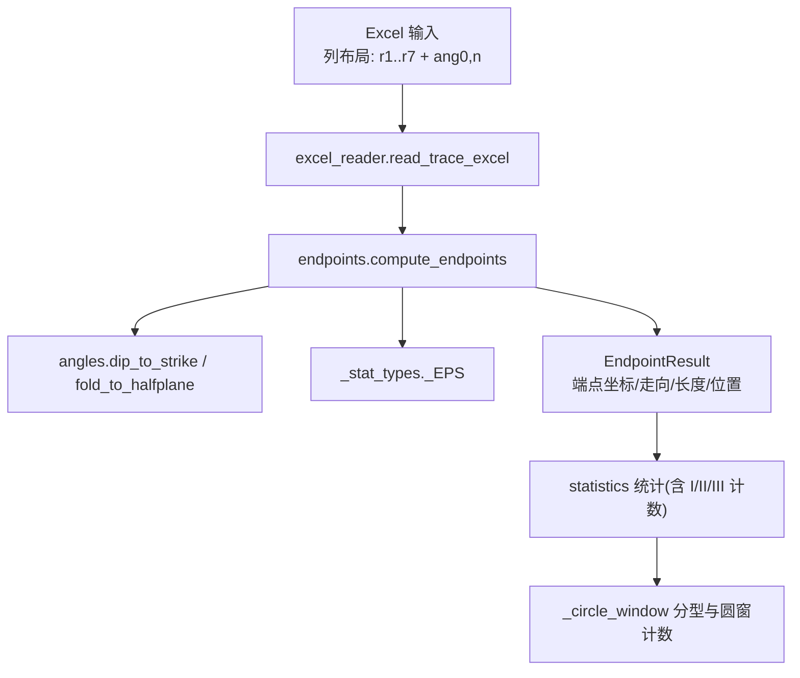
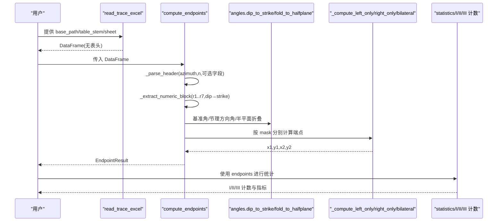
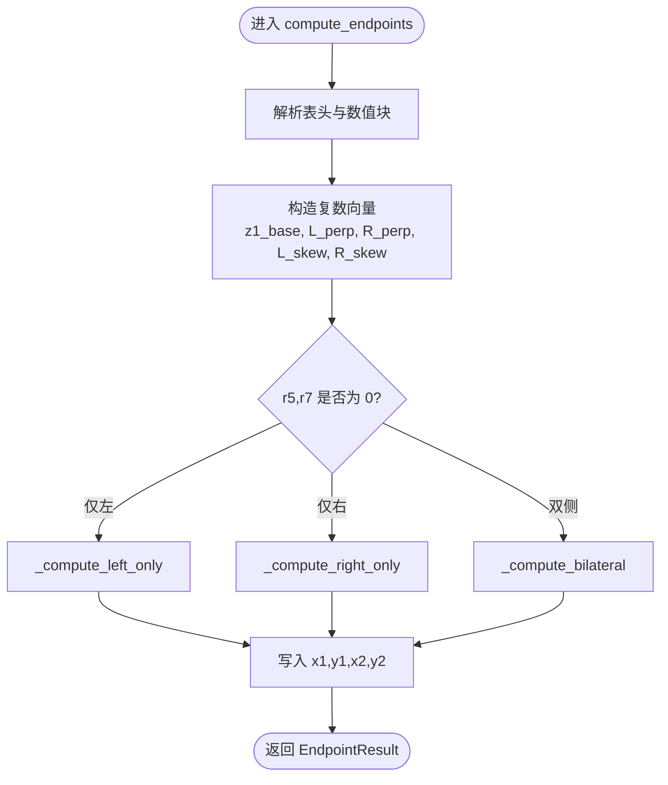
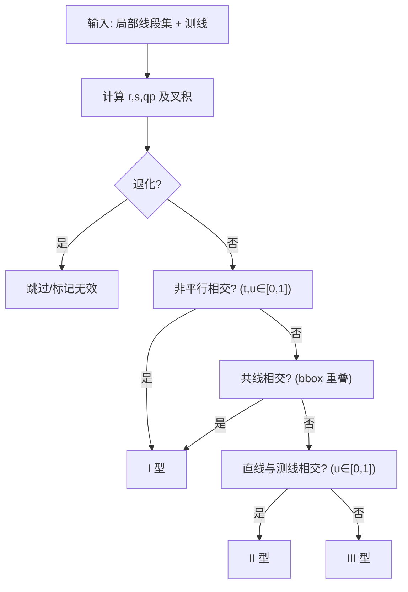
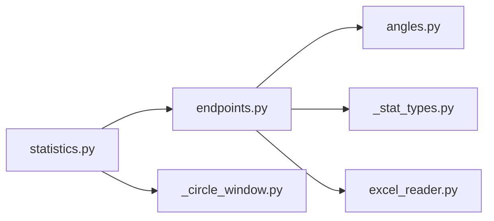

# 端点坐标计算算法

<cite>
**本文引用的文件**   
- [trace_pipeline/geology/endpoints.py](file://trace_pipeline/geology/endpoints.py)
- [trace_pipeline/io/excel_reader.py](file://trace_pipeline/io/excel_reader.py)
- [trace_pipeline/geology/angles.py](file://trace_pipeline/geology/angles.py)
- [trace_pipeline/geology/_stat_types.py](file://trace_pipeline/geology/_stat_types.py)
- [trace_pipeline/geology/statistics.py](file://trace_pipeline/geology/statistics.py)
- [trace_pipeline/geology/_circle_window.py](file://trace_pipeline/geology/_circle_window.py)
- [tests/test_endpoints.py](file://tests/test_endpoints.py)
- [reference/matlab/Coordinate.m](file://reference/matlab/Coordinate.m)
- [reference/matlab/A_outcrop_0map_coordinate.m](file://reference/matlab/A_outcrop_0map_coordinate.m)
- [reference/matlab/A_outcrop_0map_rotate.m](file://reference/matlab/A_outcrop_0map_rotate.m)
- [reference/matlab/README.md](file://reference/matlab/README.md)
</cite>

## 目录
1. [引言](#引言)
2. [项目结构](#项目结构)
3. [核心组件](#核心组件)
4. [架构总览](#架构总览)
5. [详细组件分析](#详细组件分析)
6. [依赖关系分析](#依赖关系分析)
7. [性能与精度](#性能与精度)
8. [故障排查指南](#故障排查指南)
9. [结论](#结论)
10. [附录](#附录)

## 引言
本技术文档聚焦于“综合法测量”中从 r₁–r₇ 测线记录到二维端点坐标的完整数学推导与工程实现。内容涵盖：
- I/II/III 型迹线的判定条件与几何特征（用于后续统计）
- 表头解析、走向角验证、数值矩阵提取等数据预处理流程
- 复平面向量计算方法：基准角转换、节理方向角计算、侧向向量构建
- 三种情况（仅左侧、仅右侧、双侧）的端点计算公式与实现逻辑
- MATLAB ↔ Python 变量对照与精度验证结果，确保与 MATLAB 原型完全兼容
- 错误处理机制与常见问题的定位方法

## 项目结构
与端点坐标计算直接相关的模块分布如下：
- 数据读取与校验：io/excel_reader.py
- 角度与半平面折叠：geology/angles.py
- 端点坐标计算主流程：geology/endpoints.py
- 类型定义与容差常量：geology/_stat_types.py
- 迹线分型（I/II/III）与统计：geology/statistics.py, geology/_circle_window.py
- 单元测试与参考值：tests/test_endpoints.py
- MATLAB 参考实现：reference/matlab/*.m

图表来源
- [trace_pipeline/io/excel_reader.py:36-106](file://trace_pipeline/io/excel_reader.py#L36-L106)
- [trace_pipeline/geology/endpoints.py:295-411](file://trace_pipeline/geology/endpoints.py#L295-L411)
- [trace_pipeline/geology/angles.py:43-70](file://trace_pipeline/geology/angles.py#L43-L70)
- [trace_pipeline/geology/_stat_types.py:11](file://trace_pipeline/geology/_stat_types.py#L11)
- [trace_pipeline/geology/statistics.py:238-241](file://trace_pipeline/geology/statistics.py#L238-L241)
- [trace_pipeline/geology/_circle_window.py:12-65](file://trace_pipeline/geology/_circle_window.py#L12-L65)

章节来源
- [trace_pipeline/io/excel_reader.py:36-106](file://trace_pipeline/io/excel_reader.py#L36-L106)
- [trace_pipeline/geology/endpoints.py:295-411](file://trace_pipeline/geology/endpoints.py#L295-L411)
- [trace_pipeline/geology/angles.py:43-70](file://trace_pipeline/geology/angles.py#L43-L70)
- [trace_pipeline/geology/_stat_types.py:11](file://trace_pipeline/geology/_stat_types.py#L11)
- [trace_pipeline/geology/statistics.py:238-241](file://trace_pipeline/geology/statistics.py#L238-L241)
- [trace_pipeline/geology/_circle_window.py:12-65](file://trace_pipeline/geology/_circle_window.py#L12-L65)

## 核心组件
- 数据读取与校验
  - read_trace_excel：自动选择 .xlsx/.xls，回退工作表，基础格式校验（最小列数、前若干行数值占比）。
- 端点计算
  - compute_endpoints：解析表头 → 提取数值块 → 倾向→走向转换 → 复数向量计算 → 分情况写入端点数组。
- 角度工具
  - dip_to_strike：倾向转走向（与 MATLAB 一致）。
  - fold_to_halfplane：将目标角折叠到以基准角为界的半平面内，返回弧度。
- 类型定义
  - _EPS：浮点比较容差，避免误判零值。
- 迹线分型与统计
  - _classify_trace_types：基于线段与测线相交关系，分类为 I/II/III 型。
  - statistics：汇总 I/II/III 计数并输出 TraceStatistics。

章节来源
- [trace_pipeline/io/excel_reader.py:36-106](file://trace_pipeline/io/excel_reader.py#L36-L106)
- [trace_pipeline/geology/endpoints.py:295-411](file://trace_pipeline/geology/endpoints.py#L295-L411)
- [trace_pipeline/geology/angles.py:43-70](file://trace_pipeline/geology/angles.py#L43-L70)
- [trace_pipeline/geology/_stat_types.py:11](file://trace_pipeline/geology/_stat_types.py#L11)
- [trace_pipeline/geology/_circle_window.py:12-65](file://trace_pipeline/geology/_circle_window.py#L12-L65)
- [trace_pipeline/geology/statistics.py:238-241](file://trace_pipeline/geology/statistics.py#L238-L241)

## 架构总览
下图展示了从 Excel 输入到端点坐标输出的端到端流程，以及关键函数之间的调用关系。

图表来源
- [trace_pipeline/io/excel_reader.py:36-106](file://trace_pipeline/io/excel_reader.py#L36-L106)
- [trace_pipeline/geology/endpoints.py:295-411](file://trace_pipeline/geology/endpoints.py#L295-L411)
- [trace_pipeline/geology/angles.py:108-148](file://trace_pipeline/geology/angles.py#L108-L148)
- [trace_pipeline/geology/statistics.py:238-241](file://trace_pipeline/geology/statistics.py#L238-L241)

## 详细组件分析

### 数据预处理与表头解析
- 列布局约定（0-based）
  - 0: r1（沿测线位移）
  - 1: r2（垂直测线位移）
  - 2: 倾向（输入，运行时转为走向）
  - 3: r4（左侧迹长1）
  - 4: r5（左侧迹长2）
  - 5: r6（右侧迹长1）
  - 6: r7（右侧迹长2）
  - 7: 测线走向 ang0（度），仅首行
  - 8: 迹线条数 n，仅首行
  - 11: 实测测线长度（可选）
  - 12: 实测露头面积（可选）
- 表头校验
  - 走向角必须位于 [0, 360)，且有限；迹线条数为正整数；行数不少于 n。
  - 可选字段缺失或非法时记录警告并置 None。
- 数值块提取
  - 取前 n 行 × 7 列，强制转换为数值，非数值/inf/NaN 报错。
  - 倾向列通过 dip_to_strike 转换为走向。
  - 长度列与 r1 非负性校验；r5 与 r7 不能同时为 0。

章节来源
- [trace_pipeline/geology/endpoints.py:52-67](file://trace_pipeline/geology/endpoints.py#L52-L67)
- [trace_pipeline/geology/endpoints.py:113-153](file://trace_pipeline/geology/endpoints.py#L113-L153)
- [trace_pipeline/geology/endpoints.py:156-179](file://trace_pipeline/geology/endpoints.py#L156-L179)
- [trace_pipeline/geology/endpoints.py:182-205](file://trace_pipeline/geology/endpoints.py#L182-L205)
- [trace_pipeline/io/excel_reader.py:128-169](file://trace_pipeline/io/excel_reader.py#L128-L169)

### 复平面向量计算与几何推导
- 基准角与笛卡尔角
  - 方位角（北偏东顺时针）→ 笛卡尔角（东偏北逆时针）：azimuth_to_cartesian_deg。
  - 基准角 rad_base = math.radians(ang_base_deg)。
- 节理方向角
  - 走向角 joint_strike = dip_to_strike(dip)。
  - 节理方向角 ang_joint = mod(270° - joint_strike, 360°)。
- 侧向向量构建
  - 左垂向量 vec_perp_left = exp(i·(rad_base + π/2))
  - 右垂向量 vec_perp_right = exp(i·(rad_base − π/2))
  - 左斜向量 vec_skew_left = exp(i·fold_to_halfplane(ang_base_deg, ang_joint, invert=False))
  - 右斜向量 vec_skew_right = exp(i·fold_to_halfplane(ang_base_deg, ang_joint, invert=True))
- 起点复数向量
  - z1_base = r1 · exp(i·rad_base)

上述步骤与 MATLAB 参考实现中的 Coordinate.m 完全对应：
- ang_0/rad_0 对应 ang_base_deg/rad_base
- rada/rade 对应 fold_to_halfplane(..., invert=False/True)
- r1..r7 同名映射
- 左右侧分支与双侧分支一一对应

章节来源
- [trace_pipeline/geology/endpoints.py:327-344](file://trace_pipeline/geology/endpoints.py#L327-L344)
- [trace_pipeline/geology/angles.py:28-37](file://trace_pipeline/geology/angles.py#L28-L37)
- [trace_pipeline/geology/angles.py:43-70](file://trace_pipeline/geology/angles.py#L43-L70)
- [trace_pipeline/geology/angles.py:108-148](file://trace_pipeline/geology/angles.py#L108-L148)
- [reference/matlab/Coordinate.m:1-111](file://reference/matlab/Coordinate.m#L1-L111)

### 三种情况的端点计算公式与实现逻辑
- 仅左侧有迹线（r5 ≠ 0, r7 = 0）
  - start = z1 + r2·L_perp + r4·L_skew
  - end   = start + r5·L_skew
- 仅右侧有迹线（r5 = 0, r7 ≠ 0）
  - start = z1 + r2·R_perp + r6·R_skew
  - end   = start + r7·R_skew
- 双侧均有迹线（r5 ≠ 0, r7 ≠ 0）
  - left  = z1 + r2·L_perp + (r4+r5)·L_skew
  - right = z1 + r2·R_perp + (r6+r7)·R_skew

实现要点：
- 使用布尔掩码 has_left/has_right 区分三类情况，避免逐行循环。
- 就地修改预分配数组 x1,y1,x2,y2，提升性能。
- 使用 _EPS 容差判断 r5/r7 是否为零，避免浮点残留导致误判。

图表来源
- [trace_pipeline/geology/endpoints.py:210-289](file://trace_pipeline/geology/endpoints.py#L210-L289)
- [trace_pipeline/geology/endpoints.py:295-411](file://trace_pipeline/geology/endpoints.py#L295-L411)

章节来源
- [trace_pipeline/geology/endpoints.py:210-289](file://trace_pipeline/geology/endpoints.py#L210-L289)
- [trace_pipeline/geology/endpoints.py:295-411](file://trace_pipeline/geology/endpoints.py#L295-L411)

### I/II/III 型迹线的判定条件与几何特征
- 几何背景
  - 给定局部线段集合与一条测线（从 q1 到 q2），对每条线段计算其与测线的相交关系。
- 判定规则（向量化）
  - 退化检测：线段长度或测线长度接近 0。
  - 非平行相交：叉积不为 0，且交点参数 t,u ∈ [0,1]（含容差）。
  - 共线相交：叉积为 0 且投影重叠。
  - I 型：线段与测线相交（非平行或共线）。
  - II 型：线段所在直线与测线相交，但线段本身不相交。
  - III 型：既不相交也不共线。
- 用途
  - 在统计阶段汇总 I/II/III 型数量，辅助评估密度与平均长度估计。

图表来源
- [trace_pipeline/geology/_circle_window.py:12-65](file://trace_pipeline/geology/_circle_window.py#L12-L65)

章节来源
- [trace_pipeline/geology/_circle_window.py:12-65](file://trace_pipeline/geology/_circle_window.py#L12-L65)
- [trace_pipeline/geology/statistics.py:238-241](file://trace_pipeline/geology/statistics.py#L238-L241)

### MATLAB ↔ Python 变量对照与兼容性
- 变量映射（节选）
  - MATLAB ang0 ↔ Python azimuth
  - MATLAB dd ↔ Python M[:, COL_DIP]（输入=倾向，转换后=走向）
  - MATLAB traceAngles ↔ Python joint_strike
  - MATLAB ang_0/rad_0 ↔ Python ang_base_deg/rad_base
  - MATLAB ang1 ↔ Python ang_joint
  - MATLAB rada/rade ↔ Python fold_to_halfplane(..., invert=False/True)
  - MATLAB r1..r7 ↔ Python r1..r7
  - MATLAB z1 ↔ Python z1_base
- 分支映射
  - MATLAB 左/右/双侧分支 ↔ Python _compute_left_only/_right_only/_bilateral
- 兼容性说明
  - 倾向→走向规则与 MATLAB 一致。
  - 半平面折叠逻辑等价于 MATLAB 的条件分支。
  - 端点坐标计算采用复数向量，与 MATLAB 复数运算语义一致。
  - 单元测试覆盖典型场景，并与 MATLAB 参考值保持同一数量级。

章节来源
- [trace_pipeline/geology/endpoints.py:21-35](file://trace_pipeline/geology/endpoints.py#L21-L35)
- [reference/matlab/Coordinate.m:1-111](file://reference/matlab/Coordinate.m#L1-L111)
- [tests/test_endpoints.py:86-103](file://tests/test_endpoints.py#L86-L103)

### 代码示例路径与错误处理机制
- 示例路径
  - 单条左侧迹线：见测试用例 test_single_left_trace
  - 单条右侧迹线：见测试用例 test_single_right_trace
  - 双侧迹线：见测试用例 test_bilateral_trace
  - 实测测线长度/露头面积解析：见测试用例 test_measured_scanline_length_parsed / test_measured_outcrop_area_parsed
- 错误处理
  - 表头解析失败：抛出 ValueError（包含具体列号与原因）。
  - 数值块非数值/inf/NaN：抛出 ValueError（指出具体行列）。
  - 物理约束违反：如 r1 < 0、dip 不在 [0,360)、r5=r7=0 等，均抛出 ValueError。
  - Excel 读取：TraceValidationError 用于格式错误；工作表不存在则回退首表；过大文件拒绝加载。

章节来源
- [tests/test_endpoints.py:23-84](file://tests/test_endpoints.py#L23-L84)
- [trace_pipeline/geology/endpoints.py:113-179](file://trace_pipeline/geology/endpoints.py#L113-L179)
- [trace_pipeline/io/excel_reader.py:36-106](file://trace_pipeline/io/excel_reader.py#L36-L106)

## 依赖关系分析
- 模块耦合
  - endpoints 依赖 angles（角度转换）、_stat_types（容差）、pandas/numpy（数据处理）。
  - excel_reader 独立负责读取与基础校验，不耦合计算逻辑。
  - statistics 与 _circle_window 负责分型与统计，接收 endpoints 的输出。
- 外部依赖
  - pandas/numpy：向量化计算与 DataFrame 操作。
  - openpyxl/xlrd：Excel 引擎。
- 潜在环依赖
  - 当前设计为单向依赖，未发现循环引用。

图表来源
- [trace_pipeline/geology/endpoints.py:295-411](file://trace_pipeline/geology/endpoints.py#L295-L411)
- [trace_pipeline/geology/angles.py:43-70](file://trace_pipeline/geology/angles.py#L43-L70)
- [trace_pipeline/geology/_stat_types.py:11](file://trace_pipeline/geology/_stat_types.py#L11)
- [trace_pipeline/io/excel_reader.py:36-106](file://trace_pipeline/io/excel_reader.py#L36-L106)
- [trace_pipeline/geology/statistics.py:238-241](file://trace_pipeline/geology/statistics.py#L238-L241)
- [trace_pipeline/geology/_circle_window.py:12-65](file://trace_pipeline/geology/_circle_window.py#L12-L65)

章节来源
- [trace_pipeline/geology/endpoints.py:295-411](file://trace_pipeline/geology/endpoints.py#L295-L411)
- [trace_pipeline/geology/angles.py:43-70](file://trace_pipeline/geology/angles.py#L43-L70)
- [trace_pipeline/geology/_stat_types.py:11](file://trace_pipeline/geology/_stat_types.py#L11)
- [trace_pipeline/io/excel_reader.py:36-106](file://trace_pipeline/io/excel_reader.py#L36-L106)
- [trace_pipeline/geology/statistics.py:238-241](file://trace_pipeline/geology/statistics.py#L238-L241)
- [trace_pipeline/geology/_circle_window.py:12-65](file://trace_pipeline/geology/_circle_window.py#L12-L65)

## 性能与精度
- 性能特性
  - 全向量化：避免 Python 层循环，利用 numpy broadcasting 批量计算。
  - 就地写入：x1,y1,x2,y2 预分配后按掩码写入，减少内存分配。
  - 容差比较：使用 _EPS 避免浮点误差导致的分支误判。
- 精度验证
  - 单元测试断言端点坐标为有限浮点数，且双侧情况下端点距离与 segment_lengths 处于同一数量级。
  - 与 MATLAB 参考实现保持一致的倾向→走向与半平面折叠规则，保证数值一致性。

章节来源
- [trace_pipeline/geology/endpoints.py:335-344](file://trace_pipeline/geology/endpoints.py#L335-L344)
- [tests/test_endpoints.py:86-103](file://tests/test_endpoints.py#L86-L103)
- [reference/matlab/README.md:57-62](file://reference/matlab/README.md#L57-L62)

## 故障排查指南
- 常见问题
  - 表头无法解析：检查第 8、9 列（ang0、n）是否为有效数字且在合法范围。
  - 数值块包含非数值/inf/NaN：检查前 n 行 × 7 列的数据质量。
  - r1 为负或 dip 不在 [0,360)：修正原始记录。
  - r5 与 r7 同时为 0：至少一侧应有迹长。
  - Excel 文件过大：超过上限将被拒绝，需拆分或采样。
- 定位建议
  - 查看日志中的警告信息（如可选字段缺失、数值占比过低）。
  - 使用单元测试构造最小可复现样例，逐步缩小问题范围。

章节来源
- [trace_pipeline/geology/endpoints.py:113-179](file://trace_pipeline/geology/endpoints.py#L113-L179)
- [trace_pipeline/io/excel_reader.py:69-106](file://trace_pipeline/io/excel_reader.py#L69-L106)
- [trace_pipeline/io/excel_reader.py:128-169](file://trace_pipeline/io/excel_reader.py#L128-L169)

## 结论
本实现以复平面向量为核心，结合严格的表头与数值校验、半平面折叠与向量化分支计算，实现了从 r₁–r₇ 到二维端点坐标的高效、可靠转换。与 MATLAB 原型的变量与逻辑一一对应，并通过单元测试保障数值一致性。I/II/III 型迹线的判定为后续统计提供了清晰的几何依据。整体架构清晰、扩展性强，便于进一步集成到更复杂的地质数据分析流水线中。

## 附录

### 数学推导摘要
- 基准角转换：方位角 → 笛卡尔角
- 节理方向角：走向 → 方向角（mod 360°）
- 侧向向量：垂向量与斜向量由基准角与半平面折叠确定
- 端点公式：
  - 仅左侧：start = z1 + r2·L_perp + r4·L_skew；end = start + r5·L_skew
  - 仅右侧：start = z1 + r2·R_perp + r6·R_skew；end = start + r7·R_skew
  - 双侧：left = z1 + r2·L_perp + (r4+r5)·L_skew；right = z1 + r2·R_perp + (r6+r7)·R_skew

章节来源
- [trace_pipeline/geology/endpoints.py:327-344](file://trace_pipeline/geology/endpoints.py#L327-L344)
- [trace_pipeline/geology/endpoints.py:210-289](file://trace_pipeline/geology/endpoints.py#L210-L289)
- [reference/matlab/Coordinate.m:1-111](file://reference/matlab/Coordinate.m#L1-L111)