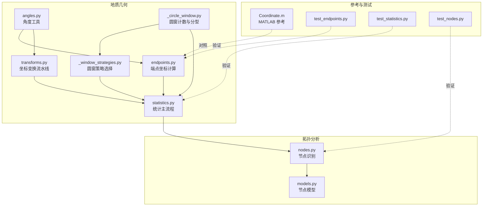
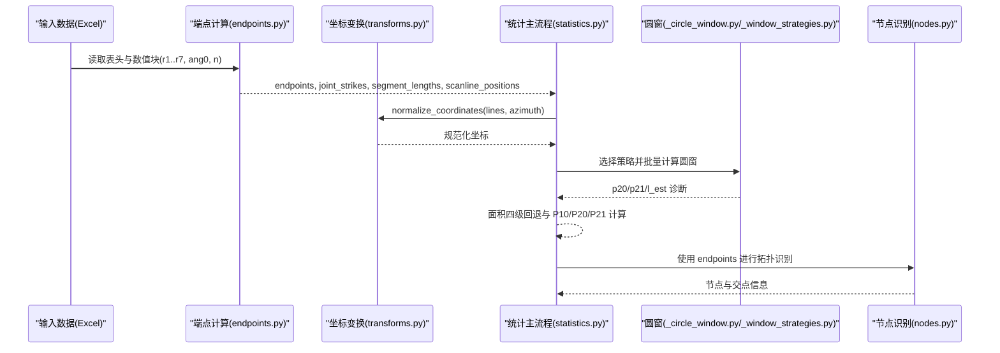
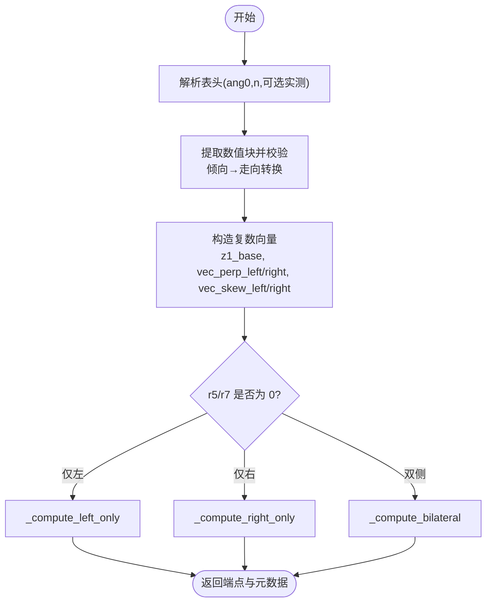
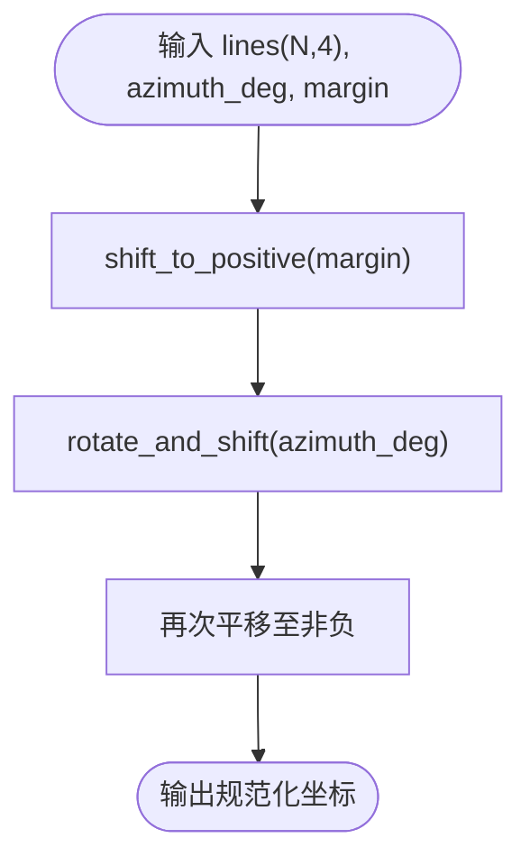
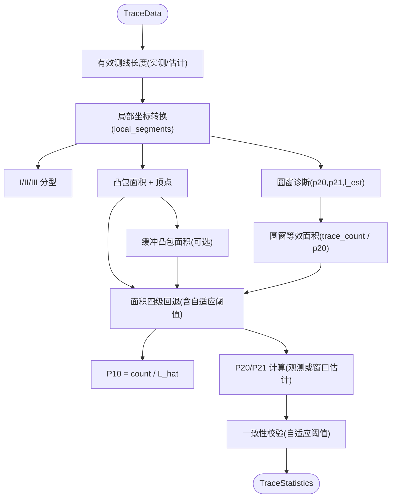
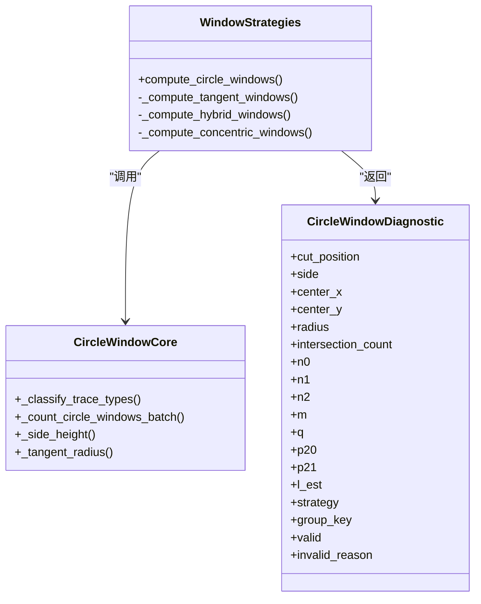
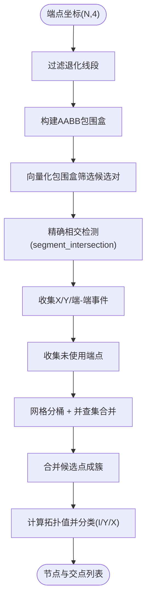
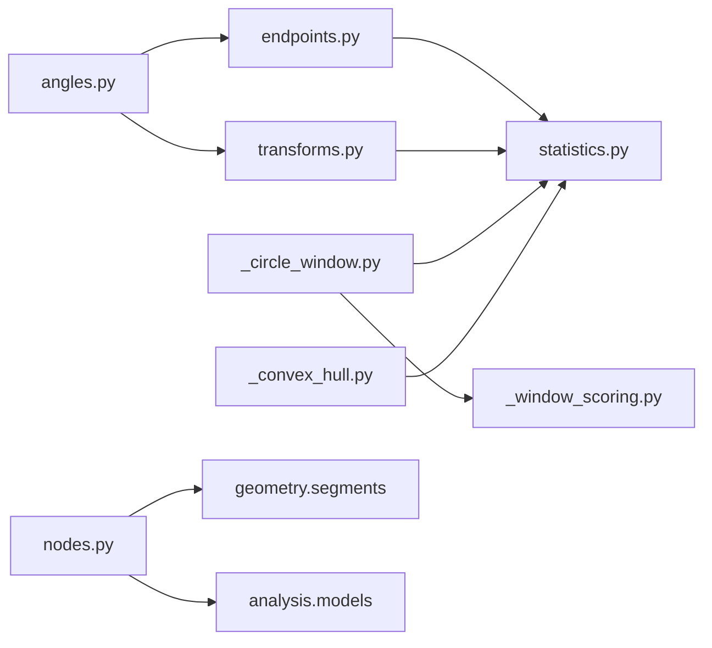

# 算法原理与技术文档

<cite>
**本文引用的文件列表**
- [endpoints.py](file://trace_pipeline/geology/endpoints.py)
- [angles.py](file://trace_pipeline/geology/angles.py)
- [transforms.py](file://trace_pipeline/geology/transforms.py)
- [statistics.py](file://trace_pipeline/geology/statistics.py)
- [_circle_window.py](file://trace_pipeline/geology/_circle_window.py)
- [_window_strategies.py](file://trace_pipeline/geology/_window_strategies.py)
- [nodes.py](file://trace_pipeline/analysis/nodes.py)
- [models.py（节点分析）](file://trace_pipeline/analysis/models.py)
- [Coordinate.m](file://reference/matlab/Coordinate.m)
- [test_endpoints.py](file://tests/test_endpoints.py)
- [test_statistics.py](file://tests/test_statistics.py)
- [test_nodes.py](file://tests/test_nodes.py)
</cite>

## 目录
1. [引言](#引言)
2. [项目结构](#项目结构)
3. [核心组件](#核心组件)
4. [架构总览](#架构总览)
5. [详细组件分析](#详细组件分析)
6. [依赖关系分析](#依赖关系分析)
7. [性能与复杂度](#性能与复杂度)
8. [故障排查指南](#故障排查指南)
9. [结论](#结论)
10. [附录：MATLAB 原型对照与精度验证](#附录matlab-原型对照与精度验证)

## 引言
本技术文档聚焦 TracePipeline 的核心算法，围绕“综合法测量”的几何建模、坐标计算、统计分析与拓扑识别展开。重点包括：
- I/II/III 型迹线的判定条件与几何特征
- 从 r₁–r₇ 测线记录到二维端点坐标的数学推导与实现
- 坐标变换流水线（平移正象限 → 走向旋转 → 再平移）
- 统计分析方法（P₁₀/P₂₀/P₂₁、Mauldon 平均迹长估计、面积四级回退策略）
- 圆窗四策略（tangent/hybrid/concentric/auto）的原理与适用场景
- 节点拓扑识别（I/Y/X 型自动识别、空间网格聚类、并查集合并容差）
- MATLAB 原型移植对照与精度验证要点

## 项目结构
TracePipeline 将地质几何与统计算法解耦为多个模块：
- geology：角度转换、端点坐标计算、坐标变换、统计指标与圆窗策略
- analysis：节点识别与模型定义
- reference/matlab：MATLAB 参考实现（用于对照）
- tests：单元测试覆盖关键路径与边界条件

图表来源
- [endpoints.py:1-418](file://trace_pipeline/geology/endpoints.py#L1-L418)
- [angles.py:1-168](file://trace_pipeline/geology/angles.py#L1-L168)
- [transforms.py:1-169](file://trace_pipeline/geology/transforms.py#L1-L169)
- [_circle_window.py:1-269](file://trace_pipeline/geology/_circle_window.py#L1-L269)
- [_window_strategies.py:1-185](file://trace_pipeline/geology/_window_strategies.py#L1-L185)
- [statistics.py:1-391](file://trace_pipeline/geology/statistics.py#L1-L391)
- [nodes.py:1-417](file://trace_pipeline/analysis/nodes.py#L1-L417)
- [models.py（节点分析）:1-98](file://trace_pipeline/analysis/models.py#L1-L98)
- [Coordinate.m:1-111](file://reference/matlab/Coordinate.m#L1-L111)
- [test_endpoints.py:1-103](file://tests/test_endpoints.py#L1-L103)
- [test_statistics.py:1-292](file://tests/test_statistics.py#L1-L292)
- [test_nodes.py:1-149](file://tests/test_nodes.py#L1-L149)

章节来源
- [endpoints.py:1-418](file://trace_pipeline/geology/endpoints.py#L1-L418)
- [statistics.py:1-391](file://trace_pipeline/geology/statistics.py#L1-L391)
- [nodes.py:1-417](file://trace_pipeline/analysis/nodes.py#L1-L417)

## 核心组件
- 角度与方向工具：方位角↔笛卡尔角、倾向→走向、半平面折叠、玫瑰图半圆折叠
- 端点坐标计算：解析 Excel 表头、提取数值矩阵、按左/右/双侧三种情况向量化计算端点
- 坐标变换流水线：平移至正象限、按走向旋转、再次平移保证非负
- 统计主流程：测线长度估算、I/II/III 分型、圆窗诊断、凸包面积与缓冲、面积四级回退、P₁₀/P₂₀/P₂₁ 计算与一致性校验
- 圆窗策略：tangent/hybrid/concentric/auto 四种布局与批量计数
- 节点识别：AABB 包围盒筛选、线段相交检测、端点接近聚类、并查集合并、类型分类（I/Y/X）

章节来源
- [angles.py:1-168](file://trace_pipeline/geology/angles.py#L1-L168)
- [endpoints.py:1-418](file://trace_pipeline/geology/endpoints.py#L1-L418)
- [transforms.py:1-169](file://trace_pipeline/geology/transforms.py#L1-L169)
- [statistics.py:1-391](file://trace_pipeline/geology/statistics.py#L1-L391)
- [_circle_window.py:1-269](file://trace_pipeline/geology/_circle_window.py#L1-L269)
- [_window_strategies.py:1-185](file://trace_pipeline/geology/_window_strategies.py#L1-L185)
- [nodes.py:1-417](file://trace_pipeline/analysis/nodes.py#L1-L417)

## 架构总览
下图展示从原始数据到统计结果与拓扑分析的端到端流程。

图表来源
- [endpoints.py:295-411](file://trace_pipeline/geology/endpoints.py#L295-L411)
- [transforms.py:127-169](file://trace_pipeline/geology/transforms.py#L127-L169)
- [statistics.py:212-391](file://trace_pipeline/geology/statistics.py#L212-L391)
- [_circle_window.py:71-216](file://trace_pipeline/geology/_circle_window.py#L71-L216)
- [_window_strategies.py:173-185](file://trace_pipeline/geology/_window_strategies.py#L173-L185)
- [nodes.py:160-417](file://trace_pipeline/analysis/nodes.py#L160-L417)

## 详细组件分析

### 1) 角度与方向工具（angles.py）
- 方位角转笛卡尔角：北偏东顺时针 → 东偏北逆时针
- 倾向→走向：分段映射，保持与 MATLAB 一致
- 走向角折叠：[-90°, 90°] 弧度，修正参考实现中的分支不可达问题
- 半平面折叠：以基准角划分左右半平面，确保侧向向量严格位于相应半平面
- 玫瑰图半圆折叠：对称走向合并

章节来源
- [angles.py:28-168](file://trace_pipeline/geology/angles.py#L28-L168)

### 2) 复平面端点坐标计算（endpoints.py）
- 表头解析：读取测线走向角、迹线条数及可选实测测线长度/露头面积
- 数值块提取与校验：倾向列转换为走向；检查负值、范围、缺失等
- 三种情形向量化计算：
  - 仅左侧有迹线（r5≠0, r7=0）
  - 仅右侧有迹线（r5=0, r7≠0）
  - 双侧均有迹线（r5≠0, r7≠0）
- 复数向量构建：z1_base = r1·exp(i·rad_base)，垂直向量与斜向向量由半平面折叠确定
- 输出：端点坐标 (N,4)、节理走向、沿测段长度 r5+r7、测线位置 r1

图表来源
- [endpoints.py:98-179](file://trace_pipeline/geology/endpoints.py#L98-L179)
- [endpoints.py:210-290](file://trace_pipeline/geology/endpoints.py#L210-L290)
- [endpoints.py:295-411](file://trace_pipeline/geology/endpoints.py#L295-L411)

章节来源
- [endpoints.py:1-418](file://trace_pipeline/geology/endpoints.py#L1-L418)

### 3) 坐标变换流水线（transforms.py）
- 平移至正象限：margin ≥ 0，使所有坐标 ≥ margin
- 旋转+平移：按走向角旋转后平移到非负区域
- 规范化流水线：正象限平移 → 走向旋转 → 非负平移
- 点坐标同步变换：与线段相同的平移/旋转流程

图表来源
- [transforms.py:86-144](file://trace_pipeline/geology/transforms.py#L86-L144)

章节来源
- [transforms.py:1-169](file://trace_pipeline/geology/transforms.py#L1-L169)

### 4) 统计主流程与面积回退（statistics.py）
- 测线长度估算：优先实测，否则基于 r1 间距中位数估计
- 局部坐标系转换：按测线走向投影得到 local_segments
- I/II/III 分型：基于与测线的相交关系（含共线重叠）
- 圆窗诊断：独立于凸包面积的路径，产出 l_est、p20、p21
- 凸包面积与缓冲：根据 mean_trace_length 与配置生成缓冲面积
- 面积四级回退：实测 → 原始凸包 → 缓冲凸包 → 圆窗等效面积
- P₁₀/P₂₀/P₂₁ 计算与一致性校验：自适应阈值随样本量衰减

图表来源
- [statistics.py:51-166](file://trace_pipeline/geology/statistics.py#L51-L166)
- [statistics.py:212-391](file://trace_pipeline/geology/statistics.py#L212-L391)

章节来源
- [statistics.py:1-391](file://trace_pipeline/geology/statistics.py#L1-L391)

### 5) 圆窗四策略（_circle_window.py 与 _window_strategies.py）
- tangent：切圆策略，半径由测线长度与配置决定，左右两侧多圆滑动
- hybrid：混合策略，按切割比例与侧高限制动态选择半径分数
- concentric：同心圆策略，中心在测线中点，半径取最大可用半径的分数
- auto：自动选择最优策略（内部通过评分聚合）
- 批量计数：向量化距离矩阵与最近点距离，一次计算多窗口相交统计

图表来源
- [_circle_window.py:12-269](file://trace_pipeline/geology/_circle_window.py#L12-L269)
- [_window_strategies.py:52-185](file://trace_pipeline/geology/_window_strategies.py#L52-L185)

章节来源
- [_circle_window.py:1-269](file://trace_pipeline/geology/_circle_window.py#L1-L269)
- [_window_strategies.py:1-185](file://trace_pipeline/geology/_window_strategies.py#L1-L185)

### 6) 节点拓扑识别（nodes.py）
- 预处理：计算迹线长度、过滤退化线段、构建 AABB 包围盒
- 候选对筛选：向量化包围盒过滤，减少 O(N²) 精确检测开销
- 相交检测：segment_intersection 返回 t,u,px,py，区分 X/Y/端-端事件
- 端点接近检测：未使用端点网格分桶 + 并查集合并
- 聚类合并：空间网格 + 并查集，按 cluster_tol 合并候选点
- 节点分类：依据内部参与与端点参与计算拓扑值，分类为 I/Y/X

图表来源
- [nodes.py:160-417](file://trace_pipeline/analysis/nodes.py#L160-L417)

章节来源
- [nodes.py:1-417](file://trace_pipeline/analysis/nodes.py#L1-L417)
- [models.py（节点分析）:1-98](file://trace_pipeline/analysis/models.py#L1-L98)

## 依赖关系分析
- endpoints.py 依赖 angles.py（方位角/半平面折叠）
- statistics.py 依赖 _circle_window.py、_convex_hull.py、_stat_format.py、_window_scoring.py、angles.py
- nodes.py 依赖 geometry.segments.segment_intersection 与 models.py
- transforms.py 依赖 angles.py（走向角折叠）

图表来源
- [endpoints.py:1-418](file://trace_pipeline/geology/endpoints.py#L1-L418)
- [statistics.py:1-391](file://trace_pipeline/geology/statistics.py#L1-L391)
- [nodes.py:1-417](file://trace_pipeline/analysis/nodes.py#L1-L417)

章节来源
- [endpoints.py:1-418](file://trace_pipeline/geology/endpoints.py#L1-L418)
- [statistics.py:1-391](file://trace_pipeline/geology/statistics.py#L1-L391)
- [nodes.py:1-417](file://trace_pipeline/analysis/nodes.py#L1-L417)

## 性能与复杂度
- 端点计算：纯向量化，时间复杂度 O(N)，内存分配一次性数组，避免循环
- 圆窗批量计数：广播距离矩阵 (N,M)，最近点距离计算 O(NM)，显著优于逐窗口 Python 循环
- 节点识别：
  - AABB 包围盒筛选降低候选对数量
  - 网格分桶 + 并查集近似 O(N log N)~O(N) 级别（取决于分布）
  - 精确相交检测仅在候选对上执行
- 统计主流程：主要开销在圆窗批量计数与凸包计算，整体线性或近线性

[本节为通用性能讨论，不直接分析具体文件]

## 故障排查指南
- 输入校验错误：
  - 表头无效或缺失列：检查第 1 行走向角与迹线条数格式
  - 数值包含 NaN/inf 或负值：定位报错行列号并修正
  - r5 与 r7 同时为 0：至少一侧需有迹长
- 统计异常：
  - 测线长度为 0 或 NaN：检查 measured_scanline_length 或 r1 序列
  - 面积回退警告：关注 area_disagreement_ratio 与 window_validation_warning
  - 圆窗无效原因：查看 invalid_reason（如高度不足、相交数不足）
- 节点识别：
  - 退化线段跳过：增大 merge_tolerance 或清理极短迹线
  - 坐标过大警告：检查坐标缩放或单位一致性

章节来源
- [endpoints.py:98-205](file://trace_pipeline/geology/endpoints.py#L98-L205)
- [statistics.py:212-391](file://trace_pipeline/geology/statistics.py#L212-L391)
- [nodes.py:160-417](file://trace_pipeline/analysis/nodes.py#L160-L417)

## 结论
TracePipeline 将地质测量数据的几何建模、坐标变换、统计分析与拓扑识别整合为可复用的流水线。其优势在于：
- 严格的数学基础与向量化实现，兼顾正确性与性能
- 面积四级回退与自适应阈值提升鲁棒性
- 圆窗四策略覆盖多样采样场景
- 节点识别采用高效的空间索引与并查集，支持大规模网络分析

[本节为总结性内容，不直接分析具体文件]

## 附录：MATLAB 原型对照与精度验证
- 变量对照：
  - MATLAB ang0 ↔ Python azimuth
  - MATLAB dd ↔ Python dip（转为走向）
  - MATLAB traceAngles ↔ Python joint_strike
  - MATLAB z1 ↔ Python z1_base（复数向量）
  - MATLAB rada/rade ↔ Python fold_to_halfplane(..., invert=False/True)
  - MATLAB r1..r7 ↔ Python r1..r7
- 端点计算等价性：
  - 左侧/右侧/双侧三种情形的复数向量加法与实部虚部分解一致
  - 半平面折叠确保左右侧方向向量落在正确半平面
- 精度验证：
  - 单元测试断言端点坐标有限且与 segment_lengths 同数量级
  - 典型数据（O76 第 1 条迹线近似参数）下欧氏距离与测段长度相对误差可控

章节来源
- [Coordinate.m:1-111](file://reference/matlab/Coordinate.m#L1-L111)
- [endpoints.py:21-36](file://trace_pipeline/geology/endpoints.py#L21-L36)
- [test_endpoints.py:86-103](file://tests/test_endpoints.py#L86-L103)