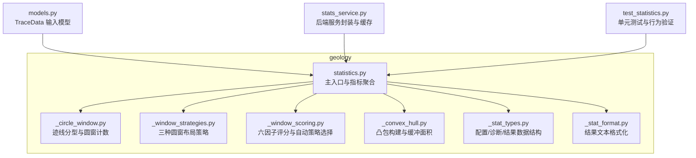
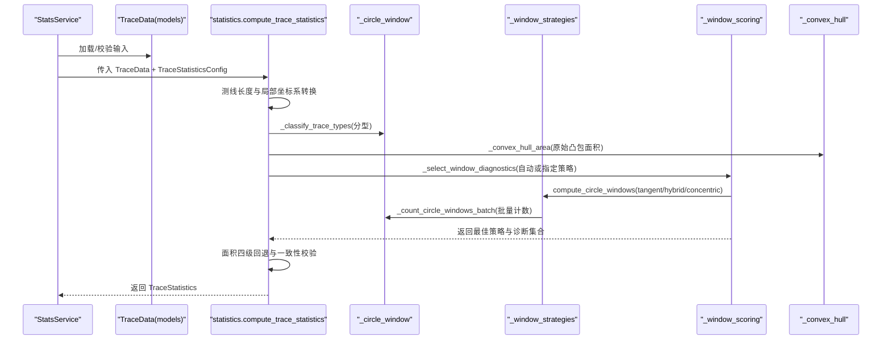
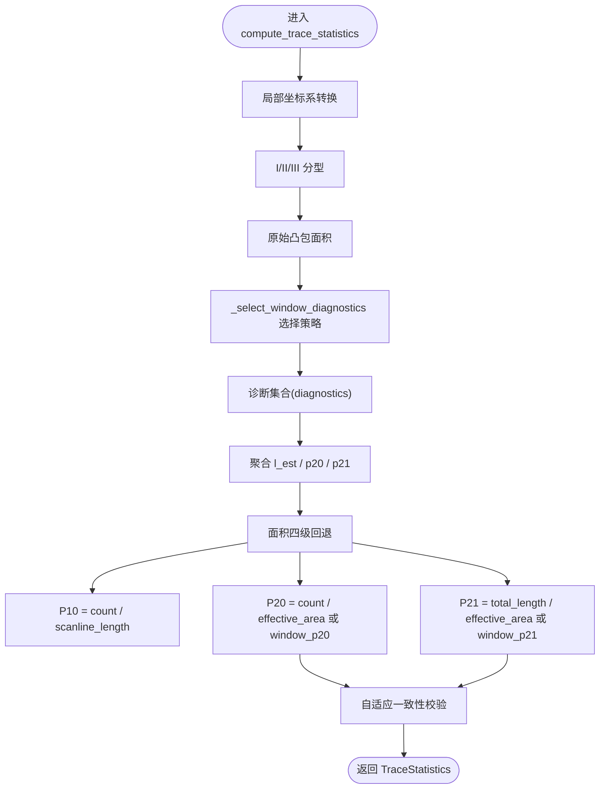
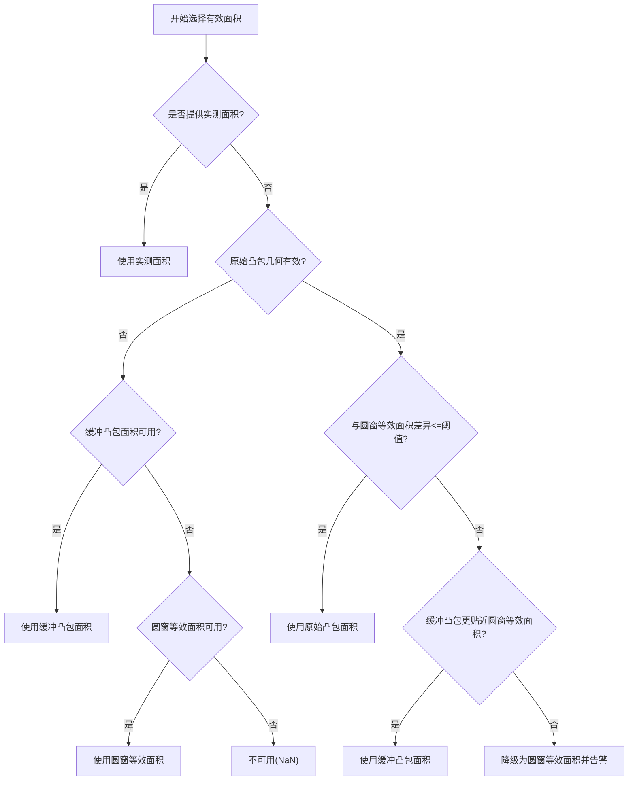
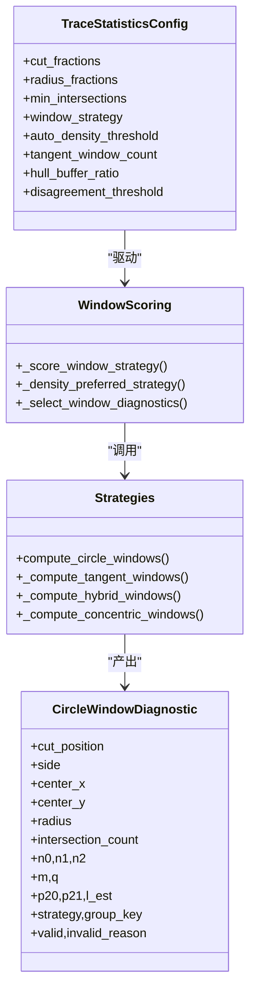
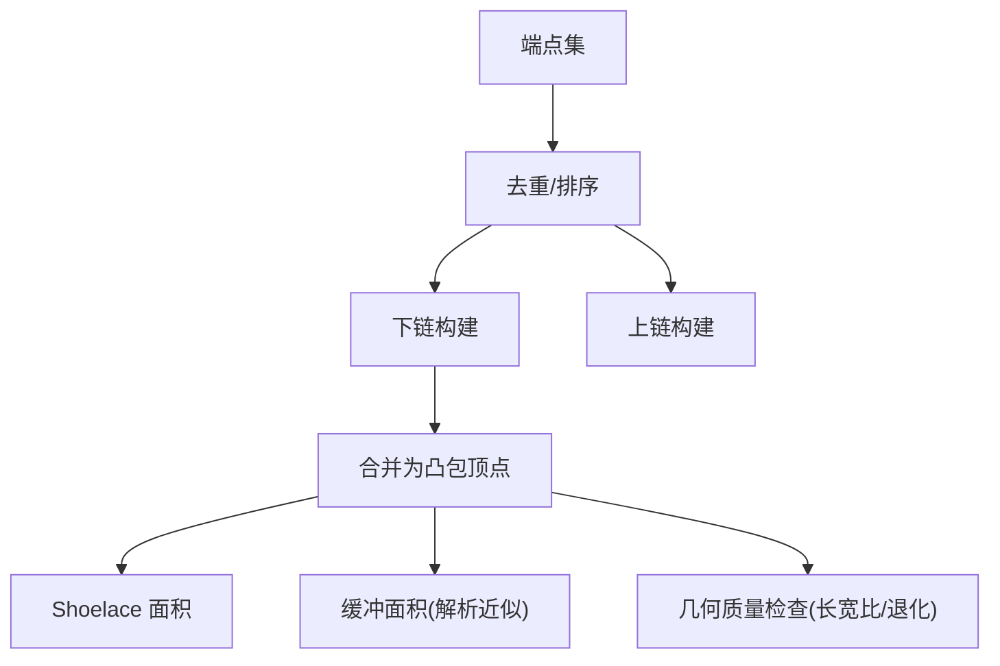
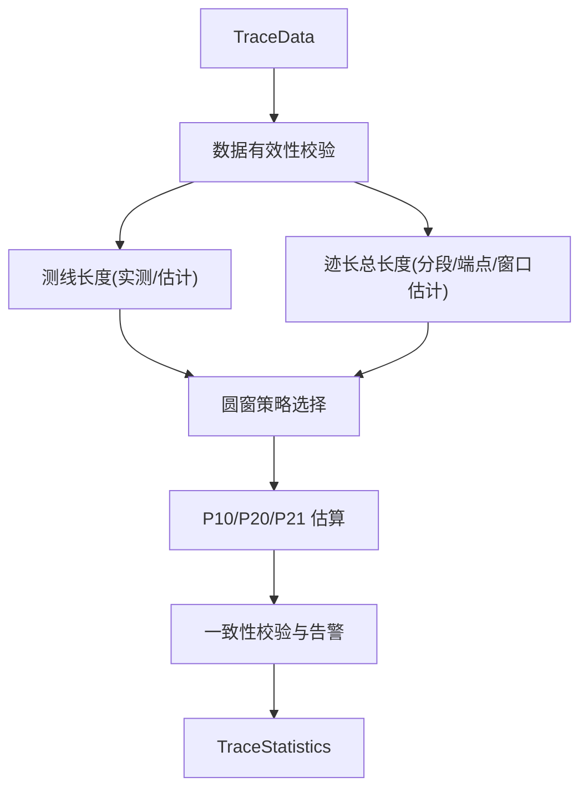
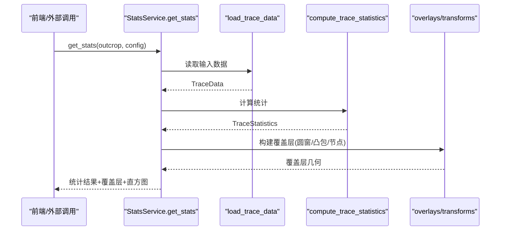
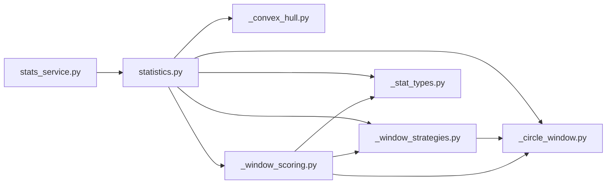

# 统计分析方法

<cite>
**本文引用的文件**   
- [statistics.py](file://trace_pipeline/geology/statistics.py)
- [_circle_window.py](file://trace_pipeline/geology/_circle_window.py)
- [_convex_hull.py](file://trace_pipeline/geology/_convex_hull.py)
- [_window_strategies.py](file://trace_pipeline/geology/_window_strategies.py)
- [_stat_types.py](file://trace_pipeline/geology/_stat_types.py)
- [_window_scoring.py](file://trace_pipeline/geology/_window_scoring.py)
- [_stat_format.py](file://trace_pipeline/geology/_stat_format.py)
- [models.py](file://trace_pipeline/models.py)
- [stats_service.py](file://backend/services/stats_service.py)
- [test_statistics.py](file://tests/test_statistics.py)
</cite>

## 目录
1. [引言](#引言)
2. [项目结构](#项目结构)
3. [核心组件](#核心组件)
4. [架构总览](#架构总览)
5. [详细组件分析](#详细组件分析)
6. [依赖关系分析](#依赖关系分析)
7. [性能与精度评估](#性能与精度评估)
8. [故障排查指南](#故障排查指南)
9. [结论](#结论)
10. [附录：关键流程与公式速查](#附录关键流程与公式速查)

## 引言
本技术文档聚焦于 TracePipeline 中的“统计分析方法”，系统阐述以下主题：
- P₁₀/P₂₀/P₂₁ 密度统计的计算原理与数学定义
- Mauldon 平均迹长估计方法的实现逻辑（基于圆窗计数）
- 面积四级回退策略的选择与一致性校验
- 圆窗取样策略（tangent/hybrid/concentric/auto）的理论基础、适用场景与选择标准
- 凸包计算的几何原理及其在空间分析中的应用
- 统计指标计算全流程：数据筛选、窗口选择、密度估算、误差分析
- 不同策略的性能对比与精度评估，并结合测试用例进行结果解读

## 项目结构
统计分析相关代码集中在 geology 子包中，围绕“主入口—圆窗—评分—凸包—类型/格式化”的模块化设计组织。后端服务通过 StatsService 调用统计模块并返回可视化覆盖层与诊断信息。

图表来源
- [statistics.py:1-45](file://trace_pipeline/geology/statistics.py#L1-L45)
- [_circle_window.py:1-12](file://trace_pipeline/geology/_circle_window.py#L1-L12)
- [_window_strategies.py:1-18](file://trace_pipeline/geology/_window_strategies.py#L1-L18)
- [_window_scoring.py:1-18](file://trace_pipeline/geology/_window_scoring.py#L1-L18)
- [_convex_hull.py:1-10](file://trace_pipeline/geology/_convex_hull.py#L1-L10)
- [_stat_types.py:1-12](file://trace_pipeline/geology/_stat_types.py#L1-L12)
- [_stat_format.py:1-10](file://trace_pipeline/geology/_stat_format.py#L1-L10)
- [models.py:41-64](file://trace_pipeline/models.py#L41-L64)
- [stats_service.py:35-56](file://backend/services/stats_service.py#L35-L56)
- [test_statistics.py:1-30](file://tests/test_statistics.py#L1-L30)

章节来源
- [statistics.py:1-45](file://trace_pipeline/geology/statistics.py#L1-L45)
- [models.py:41-64](file://trace_pipeline/models.py#L41-L64)
- [stats_service.py:35-56](file://backend/services/stats_service.py#L35-L56)

## 核心组件
- 主入口 compute_trace_statistics：负责坐标变换、迹线分型、圆窗策略选择、面积回退、P₁₀/P₂₀/P₂₁ 计算与一致性校验。
- 圆窗计数与分型：_classify_trace_types 将迹线分为 I/II/III 型；_count_circle_windows_batch 批量计算相交数、端点内外分布与 l_est/p20/p21。
- 策略选择与评分：_select_window_diagnostics 支持 auto/tangent/hybrid/concentric，auto 模式采用六因子加权评分择优。
- 凸包与缓冲面积：_compute_convex_hull/_convex_hull_area/_buffered_hull_area 提供面积候选与几何质量检查。
- 数据类型与配置：TraceStatisticsConfig/CircleWindowDiagnostic/TraceStatistics 统一描述参数、诊断与结果。
- 服务封装：StatsService 读取数据、构造配置、调用统计、生成覆盖层与直方图，并提供缓存。

章节来源
- [statistics.py:212-391](file://trace_pipeline/geology/statistics.py#L212-L391)
- [_circle_window.py:12-66](file://trace_pipeline/geology/_circle_window.py#L12-L66)
- [_circle_window.py:71-216](file://trace_pipeline/geology/_circle_window.py#L71-L216)
- [_window_strategies.py:173-185](file://trace_pipeline/geology/_window_strategies.py#L173-L185)
- [_window_scoring.py:235-323](file://trace_pipeline/geology/_window_scoring.py#L235-L323)
- [_convex_hull.py:79-114](file://trace_pipeline/geology/_convex_hull.py#L79-L114)
- [_stat_types.py:15-65](file://trace_pipeline/geology/_stat_types.py#L15-L65)
- [stats_service.py:101-150](file://backend/services/stats_service.py#L101-L150)

## 架构总览
下图展示从输入 TraceData 到输出 TraceStatistics 的关键调用链与数据流。

图表来源
- [statistics.py:212-391](file://trace_pipeline/geology/statistics.py#L212-L391)
- [_circle_window.py:71-216](file://trace_pipeline/geology/_circle_window.py#L71-L216)
- [_window_strategies.py:173-185](file://trace_pipeline/geology/_window_strategies.py#L173-L185)
- [_window_scoring.py:235-323](file://trace_pipeline/geology/_window_scoring.py#L235-L323)
- [_convex_hull.py:79-114](file://trace_pipeline/geology/_convex_hull.py#L79-L114)
- [stats_service.py:101-150](file://backend/services/stats_service.py#L101-L150)

## 详细组件分析

### P₁₀/P₂₀/P₂₁ 密度统计与 Mauldon 平均迹长估计
- P₁₀（线密度）：按有效测线长度归一化计数。
- P₂₀（面密度）：按有效露头面积归一化计数。
- P₂₁（累计长度密度）：按有效露头面积归一化观测迹长总和。
- 平均迹长估计（Mauldon/Zhang 思路）：在圆窗内统计 m（端点计数）与 q（交点数），利用 l_est = (π·R/2)·(m/q) 估计平均迹长。该估计用于面积回退链与一致性校验。

图表来源
- [statistics.py:212-391](file://trace_pipeline/geology/statistics.py#L212-L391)
- [_circle_window.py:186-192](file://trace_pipeline/geology/_circle_window.py#L186-L192)

章节来源
- [statistics.py:289-336](file://trace_pipeline/geology/statistics.py#L289-L336)
- [_circle_window.py:186-192](file://trace_pipeline/geology/_circle_window.py#L186-L192)

### 面积四级回退策略与一致性校验
- 层级顺序：实测面积 → 原始凸包面积 → 缓冲凸包面积 → 圆窗等效面积。
- 选择条件：
  - 实测优先且不可降级。
  - 原始凸包需满足几何有效性（非退化、非极度狭长）。
  - 当原始凸包与圆窗等效面积差异超过自适应阈值时，尝试缓冲修正；若仍不优则降级至圆窗等效面积。
- 一致性校验：比较主 P₂₀/P₂₁ 与圆窗估计值，差异超过自适应阈值时发出警告。

图表来源
- [statistics.py:106-166](file://trace_pipeline/geology/statistics.py#L106-L166)
- [_convex_hull.py:186-208](file://trace_pipeline/geology/_convex_hull.py#L186-L208)

章节来源
- [statistics.py:106-166](file://trace_pipeline/geology/statistics.py#L106-L166)
- [statistics.py:313-336](file://trace_pipeline/geology/statistics.py#L313-L336)
- [_convex_hull.py:186-208](file://trace_pipeline/geology/_convex_hull.py#L186-L208)

### 圆窗取样策略：tangent/hybrid/concentric/auto
- tangent（切圆）：沿测线两侧等间距放置切圆，适合低密度或样本不足的场景，保证最小相交数。
- hybrid（混合）：在多个切割位置与左右侧组合，半径取侧向高度与边缘距离限制下的分数倍，兼顾空间覆盖与稳定性。
- concentric（同心）：以测线中心为圆心，多半径同心圆，适合高密度、均匀分布场景。
- auto（自动）：并行运行三种策略，依据六因子加权评分择优；同时考虑密度偏好作为平局倾向。

图表来源
- [_stat_types.py:15-65](file://trace_pipeline/geology/_stat_types.py#L15-L65)
- [_stat_types.py:67-89](file://trace_pipeline/geology/_stat_types.py#L67-L89)
- [_window_scoring.py:178-206](file://trace_pipeline/geology/_window_scoring.py#L178-L206)
- [_window_scoring.py:209-233](file://trace_pipeline/geology/_window_scoring.py#L209-L233)
- [_window_strategies.py:173-185](file://trace_pipeline/geology/_window_strategies.py#L173-L185)

章节来源
- [_window_strategies.py:52-130](file://trace_pipeline/geology/_window_strategies.py#L52-L130)
- [_window_strategies.py:132-171](file://trace_pipeline/geology/_window_strategies.py#L132-L171)
- [_window_scoring.py:178-206](file://trace_pipeline/geology/_window_scoring.py#L178-L206)
- [_window_scoring.py:209-233](file://trace_pipeline/geology/_window_scoring.py#L209-L233)

### 凸包计算的几何原理与应用
- 凸包构建：对端点集执行单调链算法，得到逆时针顶点序列。
- 面积计算：中心化 Shoelace 公式提升大坐标数值稳定性。
- 缓冲面积：基于 Minkowski 和近似，面积=原面积+周长×缓冲距离+π×缓冲距离²。
- 几何质量检查：要求足够点数、非退化、有限面积、非极度狭长（主成分长宽比阈值）。

图表来源
- [_convex_hull.py:17-46](file://trace_pipeline/geology/_convex_hull.py#L17-L46)
- [_convex_hull.py:49-77](file://trace_pipeline/geology/_convex_hull.py#L49-L77)
- [_convex_hull.py:103-114](file://trace_pipeline/geology/_convex_hull.py#L103-L114)
- [_convex_hull.py:186-208](file://trace_pipeline/geology/_convex_hull.py#L186-L208)

章节来源
- [_convex_hull.py:79-114](file://trace_pipeline/geology/_convex_hull.py#L79-L114)
- [_convex_hull.py:186-208](file://trace_pipeline/geology/_convex_hull.py#L186-L208)

### 统计指标计算流程与数据筛选
- 数据筛选：
  - 剔除无效/NaN 数据，确保端点、走向、长度、位置均为有限浮点。
  - 测线长度优先使用实测值，否则基于扫描位置估计。
  - 迹长总长度优先使用分段长度 r5+r7，其次端点欧氏距离，最后回退到窗口估计均值×数量。
- 窗口选择：
  - 根据配置或 auto 评分选择策略，返回诊断集合。
- 密度估算：
  - P₁₀ 基于测线长度；P₂₀/P₂₁ 基于有效面积或窗口估计。
- 误差分析：
  - 面积不一致比率与自适应阈值；主 P₂₀/P₂₁ 与窗口估计的一致性校验。

图表来源
- [statistics.py:51-69](file://trace_pipeline/geology/statistics.py#L51-L69)
- [statistics.py:179-206](file://trace_pipeline/geology/statistics.py#L179-L206)
- [statistics.py:289-336](file://trace_pipeline/geology/statistics.py#L289-L336)

章节来源
- [statistics.py:51-69](file://trace_pipeline/geology/statistics.py#L51-L69)
- [statistics.py:179-206](file://trace_pipeline/geology/statistics.py#L179-L206)
- [statistics.py:289-336](file://trace_pipeline/geology/statistics.py#L289-L336)

### 服务封装与可视化覆盖层
- StatsService 负责：
  - 读取处理后的 Excel 表，构造 TraceStatisticsConfig。
  - 调用 compute_trace_statistics 获取结果。
  - 生成圆窗与凸包的覆盖层几何（原始与旋转坐标系），以及节点识别结果与直方图。
  - 提供 TTL 缓存，避免重复计算。

图表来源
- [stats_service.py:101-150](file://backend/services/stats_service.py#L101-L150)
- [stats_service.py:170-215](file://backend/services/stats_service.py#L170-L215)

章节来源
- [stats_service.py:101-150](file://backend/services/stats_service.py#L101-L150)
- [stats_service.py:170-215](file://backend/services/stats_service.py#L170-L215)

## 依赖关系分析
- statistics.py 依赖：
  - _circle_window：迹线分型与圆窗计数
  - _convex_hull：凸包面积与缓冲面积
  - _window_scoring：策略评分与选择
  - _stat_types：配置与结果数据结构
  - angles：方位角转笛卡尔角度
- _window_strategies.py 依赖：
  - _circle_window：批量计数与辅助函数
  - _stat_types：配置与诊断
- _window_scoring.py 依赖：
  - _circle_window：tangent 半径计算
  - _window_strategies：策略实现
  - _stat_types：配置与诊断
- stats_service.py 依赖：
  - trace_pipeline.geology.statistics：主统计入口
  - trace_pipeline.plotting.overlays：覆盖层构建
  - trace_pipeline.pipeline：数据加载

图表来源
- [statistics.py:20-36](file://trace_pipeline/geology/statistics.py#L20-L36)
- [_window_strategies.py:10-16](file://trace_pipeline/geology/_window_strategies.py#L10-L16)
- [_window_scoring.py:10-14](file://trace_pipeline/geology/_window_scoring.py#L10-L14)
- [stats_service.py:17-21](file://backend/services/stats_service.py#L17-L21)

章节来源
- [statistics.py:20-36](file://trace_pipeline/geology/statistics.py#L20-L36)
- [_window_strategies.py:10-16](file://trace_pipeline/geology/_window_strategies.py#L10-L16)
- [_window_scoring.py:10-14](file://trace_pipeline/geology/_window_scoring.py#L10-L14)
- [stats_service.py:17-21](file://backend/services/stats_service.py#L17-L21)

## 性能与精度评估
- 性能特性
  - 圆窗计数采用广播矩阵运算，一次性计算 N 条线段与 M 个圆心的距离与最近点，显著降低 Python 循环开销。
  - 自动策略并行计算三种布局，再评分择优；在样本量较大时，评分维度（空间覆盖、稳定性、样本充分性）有助于稳定选择。
  - 面积回退链避免不必要的缓冲计算，仅在必要时启用。
- 精度与稳健性
  - 自适应阈值随样本量衰减，小样本更宽容，大样本更严格，减少误判。
  - 一致性校验在主方法与窗口估计之间交叉验证，发现异常及时告警。
  - 凸包缓冲面积基于解析近似，绘图与面积一致性好。
- 实际示例与结果解读（基于单元测试）
  - 基本计算：提供实测面积时，outcrop_area_source 为 measured，P₁₀/P₂₀/P₂₁ 均有限。
  - 无实测面积：回退到凸包或圆窗等效面积，source 相应变化。
  - 自定义策略：强制 tangent 策略可复现确定结果。
  - 分型与计数：I/II/III 型分类与圆窗相交计数符合预期。

章节来源
- [test_statistics.py:256-292](file://tests/test_statistics.py#L256-L292)
- [test_statistics.py:116-137](file://tests/test_statistics.py#L116-L137)
- [test_statistics.py:142-192](file://tests/test_statistics.py#L142-L192)
- [test_statistics.py:197-208](file://tests/test_statistics.py#L197-L208)
- [test_statistics.py:213-251](file://tests/test_statistics.py#L213-L251)

## 故障排查指南
- 常见问题定位
  - NaN/Inf 数据：TraceData 构造阶段会拒绝包含 NaN/Inf 的字段，需检查输入数据清洗。
  - 测线长度估计失败：scanline_positions 为空或非有限值会导致异常或零长度，应补充测量值或修正位置。
  - 圆窗无效：相交数不足、m≤0 或 q≤0 导致窗口无效，需调整 min_intersections 或扩大半径分数。
  - 凸包退化：点数不足或共线导致凸包无效，需增加采样或检查数据质量。
  - 一致性告警：主 P₂₀/P₂₁ 与窗口估计差异过大，提示面积或策略可能不匹配，建议检查面积来源与策略选择。
- 日志与诊断
  - 统计模块记录策略选择、面积来源、平均迹长来源、P₂₀/P₂₁ 来源及一致性告警。
  - StatsService 记录缓存命中、计算耗时与关键指标，便于性能与正确性审计。

章节来源
- [statistics.py:338-356](file://trace_pipeline/geology/statistics.py#L338-L356)
- [stats_service.py:314-341](file://backend/services/stats_service.py#L314-L341)
- [_circle_window.py:219-249](file://trace_pipeline/geology/_circle_window.py#L219-L249)
- [models.py:65-130](file://trace_pipeline/models.py#L65-L130)

## 结论
本统计分析方法以严谨的几何与概率模型为基础，结合自适应阈值与多维度评分，实现了稳健的 P₁₀/P₂₀/P₂₁ 密度估算与平均迹长估计。面积四级回退与一致性校验保障了在不同数据质量下的可靠性；圆窗策略的灵活性与自动选择机制提升了适用性。整体架构模块化清晰，性能优化到位，并通过测试与服务层封装提供了良好的可维护性与可扩展性。

## 附录：关键流程与公式速查
- 平均迹长估计（Mauldon/Zhang）：l_est = (π·R/2)·(m/q)，其中 m=n1+2n2，q=2n0+n1。
- P₁₀：count / scanline_length
- P₂₀：count / effective_area 或 window_p20
- P₂₁：total_length / effective_area 或 window_p21
- 面积回退：实测 → 原始凸包 → 缓冲凸包 → 圆窗等效面积
- 一致性阈值：随样本量指数衰减，控制主方法与窗口估计的差异容忍度

章节来源
- [_circle_window.py:186-192](file://trace_pipeline/geology/_circle_window.py#L186-L192)
- [statistics.py:289-336](file://trace_pipeline/geology/statistics.py#L289-L336)
- [statistics.py:106-166](file://trace_pipeline/geology/statistics.py#L106-L166)