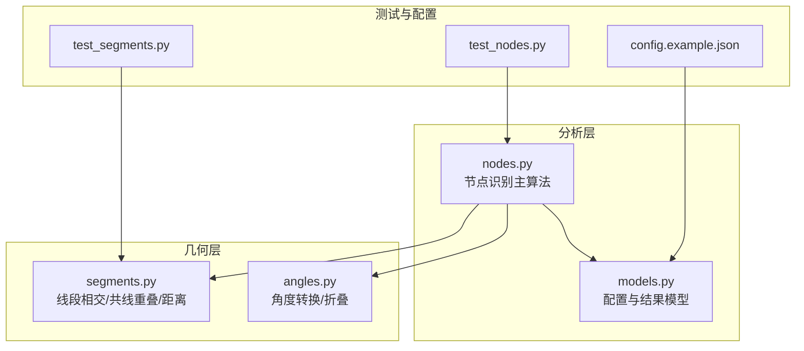
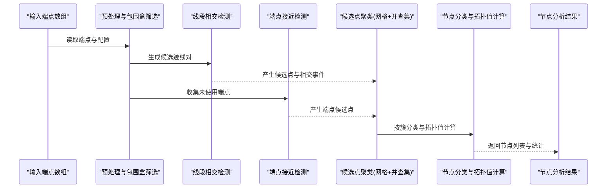
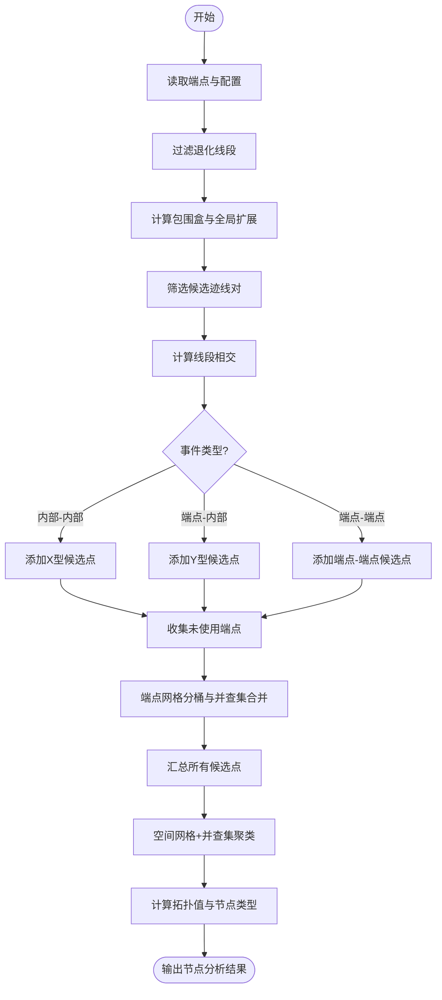
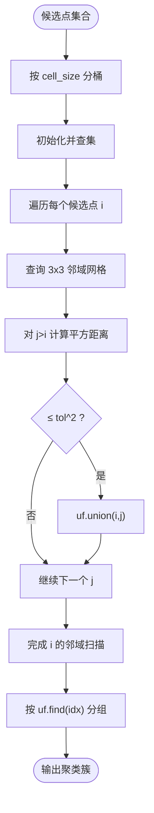
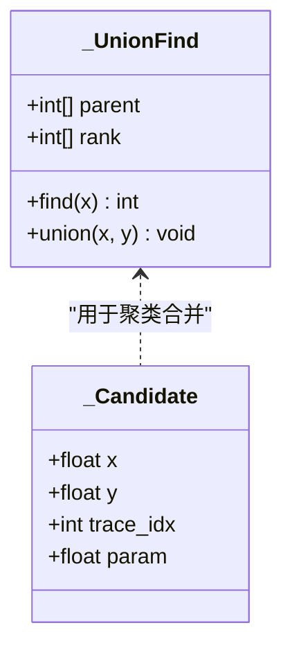
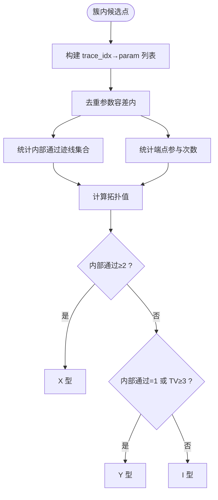
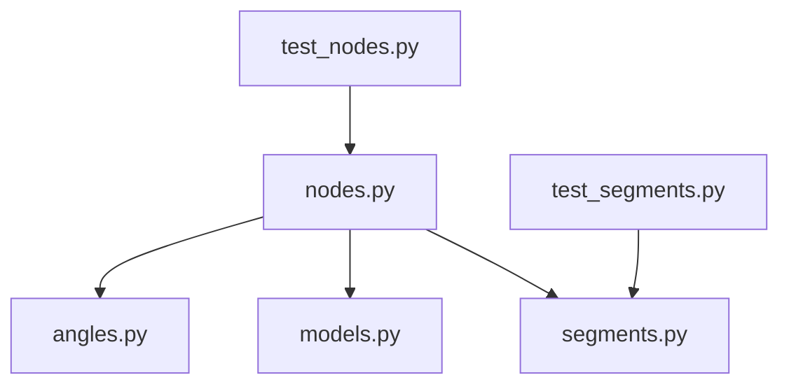

# 节点拓扑识别算法

<cite>
**本文引用的文件**   
- [nodes.py](file://trace_pipeline/analysis/nodes.py)
- [models.py](file://trace_pipeline/analysis/models.py)
- [segments.py](file://trace_pipeline/geometry/segments.py)
- [angles.py](file://trace_pipeline/geology/angles.py)
- [test_nodes.py](file://tests/test_nodes.py)
- [test_segments.py](file://tests/test_segments.py)
- [config.example.json](file://config.example.json)
</cite>

## 目录
1. [引言](#引言)
2. [项目结构](#项目结构)
3. [核心组件](#核心组件)
4. [架构总览](#架构总览)
5. [详细组件分析](#详细组件分析)
6. [依赖关系分析](#依赖关系分析)
7. [性能考虑](#性能考虑)
8. [故障排查指南](#故障排查指南)
9. [结论](#结论)
10. [附录](#附录)

## 引言
本技术文档聚焦于“节点拓扑识别算法”，面向地质裂隙网络中的 I/Y/X 型节点自动识别。算法基于线段相交检测与空间聚类，结合并查集合并容差机制，实现从端点坐标到节点类型（孤立端点、三叉节点、交叉节点）的稳健分类。文档将系统阐述：
- I/Y/X 型节点的几何定义与拓扑特征
- 自动识别的数学判据与算法流程
- 空间网格聚类方法（网格尺寸、距离阈值、邻域搜索）
- 并查集合并容差机制（连通性判断、集合操作、容差控制）
- 节点分类的多维特征融合（角度、长度比例、空间位置等）
- 精度评估与性能优化策略，以及复杂地质条件下的处理案例与调试技巧

## 项目结构
与节点拓扑识别相关的核心代码位于以下模块：
- trace_pipeline/analysis/nodes.py：主识别算法与聚类、分类逻辑
- trace_pipeline/analysis/models.py：配置与结果数据结构
- trace_pipeline/geometry/segments.py：线段相交、共线重叠、点到线段距离等几何工具
- trace_pipeline/geology/angles.py：地质角度转换与折叠工具（用于后续方向/角度相关扩展）
- tests/test_nodes.py、tests/test_segments.py：单元测试覆盖关键场景
- config.example.json：节点识别相关配置项示例

图表来源
- [nodes.py:1-417](file://trace_pipeline/analysis/nodes.py#L1-L417)
- [models.py:1-98](file://trace_pipeline/analysis/models.py#L1-L98)
- [segments.py:1-197](file://trace_pipeline/geometry/segments.py#L1-L197)
- [angles.py:1-168](file://trace_pipeline/geology/angles.py#L1-L168)
- [test_nodes.py:1-149](file://tests/test_nodes.py#L1-L149)
- [test_segments.py:1-61](file://tests/test_segments.py#L1-L61)
- [config.example.json:1-26](file://config.example.json#L1-L26)

章节来源
- [nodes.py:1-417](file://trace_pipeline/analysis/nodes.py#L1-L417)
- [models.py:1-98](file://trace_pipeline/analysis/models.py#L1-L98)
- [segments.py:1-197](file://trace_pipeline/geometry/segments.py#L1-L197)
- [angles.py:1-168](file://trace_pipeline/geology/angles.py#L1-L168)
- [test_nodes.py:1-149](file://tests/test_nodes.py#L1-L149)
- [test_segments.py:1-61](file://tests/test_segments.py#L1-L61)
- [config.example.json:1-26](file://config.example.json#L1-L26)

## 核心组件
- 节点识别主函数 recognize_trace_nodes：输入为端点数组与配置，输出包含节点列表、相交事件、警告与统计信息。
- 候选点结构 _Candidate：记录交点或接触点的空间坐标、所属迹线索引及参数化位置。
- 并查集 _UnionFind：支持快速查找与按秩合并，用于传递性聚类合并。
- 空间网格聚类 _merge_candidates：基于网格分桶 + 并查集的候选点聚类，控制合并容差。
- 节点分类器 _classify_and_compute_node：依据簇内迹线的参与方式（内部通过或端点参与）计算拓扑值与节点类型。
- 几何工具 segment_intersection：计算两条线段的相交事件，包括内部相交、端点接触、共线重叠等情况。
- 配置与结果模型 NodeRecognitionConfig、TraceNode、TraceIntersection、NodeAnalysis：提供参数校验、结果统计与密度计算。

章节来源
- [nodes.py:1-417](file://trace_pipeline/analysis/nodes.py#L1-L417)
- [models.py:1-98](file://trace_pipeline/analysis/models.py#L1-L98)
- [segments.py:1-197](file://trace_pipeline/geometry/segments.py#L1-L197)

## 架构总览
节点识别的整体流程如下：
- 预处理：过滤退化线段，计算有效迹线的包围盒与全局边界扩展，向量化筛选候选邻居对。
- 相交检测：对候选迹线对调用线段相交函数，分类 X/Y/端-端事件，生成候选点与相交事件。
- 端点接近检测：收集未使用端点，进行网格分桶与并查集合并，生成新的候选点。
- 聚类合并：对所有候选点进行空间网格 + 并查集聚类，得到节点簇。
- 节点分类：根据簇内迹线参与方式计算拓扑值与节点类型，输出最终节点列表。

图表来源
- [nodes.py:160-417](file://trace_pipeline/analysis/nodes.py#L160-L417)
- [segments.py:42-113](file://trace_pipeline/geometry/segments.py#L42-L113)

## 详细组件分析

### I/Y/X 型节点的几何定义与拓扑特征
- I 型（孤立端点）：端点不与任何其他迹线接触，属于孤立端点。
- Y 型（三叉节点）：一条迹线的端点落在另一条迹线的内部（端-中接触），形成三叉分支。
- X 型（交叉节点）：两条迹线在各自内部位置相交（中-中接触），形成四叉分支。

拓扑值 degree 的计算规则：
- 每条迹线若在其内部通过（非端点邻域），贡献 2；
- 若仅以端点参与，则当该迹线有两个端点参与时贡献 2，否则贡献 1；
- 将所有迹线贡献相加得到节点的拓扑值，用于区分 I/Y/X 类型。

章节来源
- [nodes.py:121-157](file://trace_pipeline/analysis/nodes.py#L121-L157)
- [models.py:38-54](file://trace_pipeline/analysis/models.py#L38-L54)

### 自动识别的数学判据与算法流程
- 参数化表示：线段 A(t)=a1+t*(a2-a1)，B(u)=b1+u*(b2-b1)。
- 相交求解：通过二维叉积计算 t、u，判断是否在容差范围内。
- 内部判定：_is_interior(param, tol) 判断参数是否位于线段内部（不含端点邻域）。
- 分类规则：
  - 若两条迹线均在内部相交 → X 型；
  - 若仅一条迹线内部相交且拓扑值≥3 → Y 型；
  - 其他情况 → I 型。

图表来源
- [nodes.py:160-417](file://trace_pipeline/analysis/nodes.py#L160-L417)
- [segments.py:42-113](file://trace_pipeline/geometry/segments.py#L42-L113)

章节来源
- [nodes.py:47-50](file://trace_pipeline/analysis/nodes.py#L47-L50)
- [nodes.py:121-157](file://trace_pipeline/analysis/nodes.py#L121-L157)
- [segments.py:42-113](file://trace_pipeline/geometry/segments.py#L42-L113)

### 空间网格聚类方法
- 网格尺寸选择：cell_size=max(tolerance, 1e-12)，避免极小网格导致数值不稳定。
- 距离阈值设定：tol2=tolerance^2，使用平方距离比较减少开方开销。
- 邻域搜索：对每个候选点检查其所在网格及其周围 3x3 邻域内的点，进行并查集合并。
- 并行合并：遍历候选点时仅与索引更大的点比较，避免重复合并。
- 端点接近检测：对未使用端点同样采用网格分桶与并查集合并，生成平均坐标作为候选点。

图表来源
- [nodes.py:77-118](file://trace_pipeline/analysis/nodes.py#L77-L118)
- [nodes.py:320-383](file://trace_pipeline/analysis/nodes.py#L320-L383)

章节来源
- [nodes.py:77-118](file://trace_pipeline/analysis/nodes.py#L77-L118)
- [nodes.py:320-383](file://trace_pipeline/analysis/nodes.py#L320-L383)

### 并查集合并容差机制的实现原理
- 连通性判断：通过 find(x) 路径压缩快速定位根节点。
- 集合操作：union(x,y) 按秩合并，保持树高平衡。
- 容差控制：仅在距离小于等于 tolerance^2 时才执行 union，确保物理意义上的“接近”被合并。
- 传递性：多次 union 后，同一簇内的所有点具有相同根，便于后续分组。

图表来源
- [nodes.py:51-76](file://trace_pipeline/analysis/nodes.py#L51-L76)

章节来源
- [nodes.py:51-76](file://trace_pipeline/analysis/nodes.py#L51-L76)

### 节点分类算法的多维特征融合
- 内部通过特征：_is_interior 判断参数是否位于内部，决定迹线是否为“内部通过”。
- 端点参与特征：统计每条迹线的端点参与次数，影响拓扑值计算。
- 拓扑值计算：内部通过贡献 2，端点参与贡献 1 或 2（取决于两个端点是否都参与）。
- 类型判定：
  - 内部通过的迹线数≥2 → X 型；
  - 内部通过的迹线数=1 或 拓扑值≥3 → Y 型；
  - 其他 → I 型。

图表来源
- [nodes.py:121-157](file://trace_pipeline/analysis/nodes.py#L121-L157)

章节来源
- [nodes.py:121-157](file://trace_pipeline/analysis/nodes.py#L121-L157)

### 几何工具与角度转换
- 线段相交：segment_intersection 使用参数化方法与二维叉积求解 t、u，并处理平行/共线重叠情况。
- 共线重叠：collinear_overlap 计算重叠区间端点与对应参数，供上层统一按普通交点处理。
- 点到线段距离：point_segment_distance 用于后续可能的距离度量与验证。
- 角度转换：azimuth_to_cartesian_deg、dip_to_strike、fold_strike_angle、fold_to_halfplane、fold_strikes_to_semicircle 提供地质角度处理工具，可用于后续方向/角度相关扩展。

章节来源
- [segments.py:42-113](file://trace_pipeline/geometry/segments.py#L42-L113)
- [segments.py:116-177](file://trace_pipeline/geometry/segments.py#L116-L177)
- [segments.py:180-197](file://trace_pipeline/geometry/segments.py#L180-L197)
- [angles.py:28-37](file://trace_pipeline/geology/angles.py#L28-L37)
- [angles.py:43-70](file://trace_pipeline/geology/angles.py#L43-L70)
- [angles.py:76-102](file://trace_pipeline/geology/angles.py#L76-L102)
- [angles.py:108-148](file://trace_pipeline/geology/angles.py#L108-L148)
- [angles.py:154-167](file://trace_pipeline/geology/angles.py#L154-L167)

## 依赖关系分析
- nodes.py 依赖 segments.py 的线段相交工具，依赖 models.py 的配置与结果模型。
- models.py 提供数据类与属性方法，不依赖其他模块。
- segments.py 提供基础几何运算，不依赖其他模块。
- angles.py 提供角度转换工具，不依赖其他模块。
- 测试文件分别验证 nodes.py 与 segments.py 的行为契约。

图表来源
- [nodes.py:1-417](file://trace_pipeline/analysis/nodes.py#L1-L417)
- [segments.py:1-197](file://trace_pipeline/geometry/segments.py#L1-L197)
- [models.py:1-98](file://trace_pipeline/analysis/models.py#L1-L98)
- [angles.py:1-168](file://trace_pipeline/geology/angles.py#L1-L168)
- [test_nodes.py:1-149](file://tests/test_nodes.py#L1-L149)
- [test_segments.py:1-61](file://tests/test_segments.py#L1-L61)

章节来源
- [nodes.py:1-417](file://trace_pipeline/analysis/nodes.py#L1-L417)
- [segments.py:1-197](file://trace_pipeline/geometry/segments.py#L1-L197)
- [models.py:1-98](file://trace_pipeline/analysis/models.py#L1-L98)
- [angles.py:1-168](file://trace_pipeline/geology/angles.py#L1-L168)
- [test_nodes.py:1-149](file://tests/test_nodes.py#L1-L149)
- [test_segments.py:1-61](file://tests/test_segments.py#L1-L61)

## 性能考虑
- 向量化包围盒筛选：利用 NumPy 布尔掩码快速筛选候选邻居对，降低 O(N^2) 常数因子。
- 批量聚类：候选点与端点均采用网格分桶 + 并查集，近似线性时间复杂度。
- 预计算数据结构：提前计算有效迹线坐标、半长、包围盒，减少重复计算。
- 容差自适应：cluster_tol=max(tol, 0.01*mean_len)，根据平均长度动态调整聚类强度，提升鲁棒性。
- 大坐标保护：对极大坐标值发出警告，防止网格索引溢出。

[本节为通用性能指导，无需特定文件引用]

## 故障排查指南
- 退化线段跳过：当线段长度小于 merge_tolerance 时会被跳过并产生警告，需检查输入数据质量与容差设置。
- 共线重叠行为：segment_intersection 对共线重叠返回 SegmentIntersection(kind="parallel_overlap")，上层按普通交点处理，避免返回 list 导致崩溃。
- 无交点场景：平行不共线线段不会返回交点，仅有孤立端点可能产生 I 型节点。
- 配置校验：merge_tolerance 必须大于 0，label_mode 必须为 none/type/id 之一。
- 密度计算：node_density 需要正面积，否则返回 None。

章节来源
- [nodes.py:208-222](file://trace_pipeline/analysis/nodes.py#L208-L222)
- [segments.py:74-89](file://trace_pipeline/geometry/segments.py#L74-L89)
- [test_segments.py:31-44](file://tests/test_segments.py#L31-L44)
- [models.py:31-36](file://trace_pipeline/analysis/models.py#L31-L36)
- [models.py:94-98](file://trace_pipeline/analysis/models.py#L94-L98)

## 结论
该节点拓扑识别算法通过几何相交检测、空间网格聚类与并查集合并容差机制，实现了 I/Y/X 型节点的稳健自动识别。算法在预处理阶段利用向量化包围盒筛选显著降低计算量，在聚类阶段通过网格分桶与并查集保证高效合并，在分类阶段依据拓扑值与内部通过特征进行多维融合判断。配合完善的单元测试与配置校验，算法具备良好的可维护性与可扩展性。

[本节为总结性内容，无需特定文件引用]

## 附录

### 配置项说明
- enable_node_recognition：是否启用节点识别
- node_merge_tolerance：节点合并容差
- show_node_overlay：是否显示叠加图
- node_label_mode：标签模式（none/type/id）

章节来源
- [config.example.json:19-22](file://config.example.json#L19-L22)

### 单元测试要点
- 交叉节点（X 型）、端点接触（Y 型）、退化线段跳过、平行无交点、共线重叠、节点类型计数一致性等场景均已覆盖。

章节来源
- [test_nodes.py:25-131](file://tests/test_nodes.py#L25-L131)
- [test_segments.py:18-61](file://tests/test_segments.py#L18-L61)