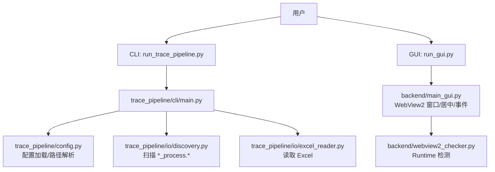
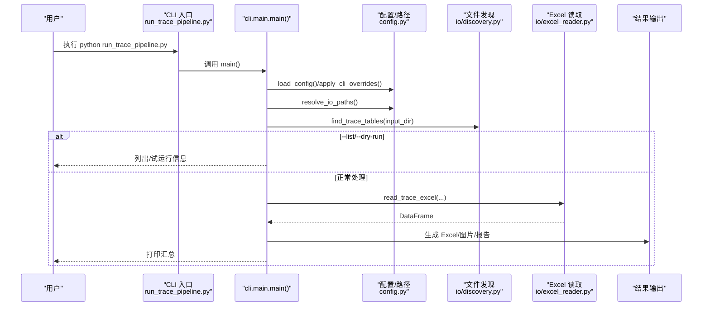
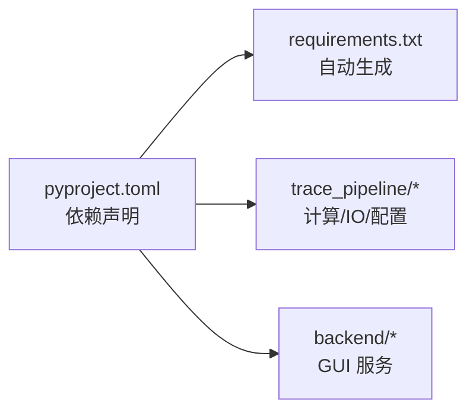

# 快速开始指南

<cite>
**本文引用的文件**   
- [README.md](file://README.md)
- [pyproject.toml](file://pyproject.toml)
- [requirements.txt](file://requirements.txt)
- [config.example.json](file://config.example.json)
- [run_trace_pipeline.py](file://run_trace_pipeline.py)
- [run_gui.py](file://run_gui.py)
- [trace_pipeline/cli/main.py](file://trace_pipeline/cli/main.py)
- [backend/main_gui.py](file://backend/main_gui.py)
- [backend/webview2_checker.py](file://backend/webview2_checker.py)
- [trace_pipeline/config.py](file://trace_pipeline/config.py)
- [trace_pipeline/io/discovery.py](file://trace_pipeline/io/discovery.py)
- [trace_pipeline/io/excel_reader.py](file://trace_pipeline/io/excel_reader.py)
</cite>

## 目录
1. [简介](#简介)
2. [项目结构](#项目结构)
3. [核心组件](#核心组件)
4. [架构总览](#架构总览)
5. [详细组件分析](#详细组件分析)
6. [依赖关系分析](#依赖关系分析)
7. [性能与运行建议](#性能与运行建议)
8. [故障排除指南](#故障排除指南)
9. [结论](#结论)
10. [附录：最小配置与常用命令](#附录最小配置与常用命令)

## 简介
TracePipeline 是一套面向岩体节理测线法数据处理与可视化的工具，支持 CLI 命令行与 GUI 桌面应用两种运行模式。本指南聚焦“15 分钟内跑通第一个任务”，覆盖环境准备、输入数据规范、CLI/GUI 基本用法、最小化配置与常见问题排查。

## 项目结构
- 后端 Python 包 trace_pipeline：提供配置加载、数据发现、Excel 读写、管线执行等核心能力
- 前端 Vue 3 + TypeScript：构建产物由后端以 WebView2 容器承载
- 入口脚本：
  - run_trace_pipeline.py：CLI 启动器
  - run_gui.py：GUI 启动器（检测 WebView2、创建窗口、绑定 JS API）

图示来源
- [run_trace_pipeline.py:1-30](file://run_trace_pipeline.py#L1-L30)
- [trace_pipeline/cli/main.py:1-110](file://trace_pipeline/cli/main.py#L1-L110)
- [trace_pipeline/config.py:1-326](file://trace_pipeline/config.py#L1-L326)
- [trace_pipeline/io/discovery.py:1-63](file://trace_pipeline/io/discovery.py#L1-L63)
- [trace_pipeline/io/excel_reader.py:1-169](file://trace_pipeline/io/excel_reader.py#L1-L169)
- [run_gui.py:1-60](file://run_gui.py#L1-L60)
- [backend/main_gui.py:1-211](file://backend/main_gui.py#L1-L211)
- [backend/webview2_checker.py:1-60](file://backend/webview2_checker.py#L1-L60)

章节来源
- [README.md:64-84](file://README.md#L64-L84)
- [run_trace_pipeline.py:1-30](file://run_trace_pipeline.py#L1-L30)
- [run_gui.py:1-60](file://run_gui.py#L1-L60)

## 核心组件
- 配置系统：默认配置 + JSON 覆盖 + CLI 参数覆盖；自动解析相对路径为绝对路径；保障 input/output/logs 目录存在
- 输入发现：按后缀 _process 与扩展名 .xlsx/.xls 扫描 input 目录
- Excel 读取：优先 .xlsx，回退 .xls；目标工作表不存在时回退首表；基础格式校验
- CLI 编排：加载配置 → 发现文件 → 决策目标 → 执行 → 汇总输出
- GUI 容器：WebView2 运行时检测 → 创建窗口 → 绑定 JS API → 生命周期管理

章节来源
- [trace_pipeline/config.py:56-79](file://trace_pipeline/config.py#L56-L79)
- [trace_pipeline/config.py:86-145](file://trace_pipeline/config.py#L86-L145)
- [trace_pipeline/config.py:218-245](file://trace_pipeline/config.py#L218-L245)
- [trace_pipeline/config.py:264-312](file://trace_pipeline/config.py#L264-L312)
- [trace_pipeline/io/discovery.py:17-63](file://trace_pipeline/io/discovery.py#L17-L63)
- [trace_pipeline/io/excel_reader.py:36-106](file://trace_pipeline/io/excel_reader.py#L36-L106)
- [trace_pipeline/cli/main.py:28-110](file://trace_pipeline/cli/main.py#L28-L110)
- [backend/main_gui.py:81-206](file://backend/main_gui.py#L81-L206)

## 架构总览

图示来源
- [run_trace_pipeline.py:1-30](file://run_trace_pipeline.py#L1-L30)
- [trace_pipeline/cli/main.py:28-110](file://trace_pipeline/cli/main.py#L28-L110)
- [trace_pipeline/config.py:86-145](file://trace_pipeline/config.py#L86-L145)
- [trace_pipeline/config.py:218-245](file://trace_pipeline/config.py#L218-L245)
- [trace_pipeline/io/discovery.py:24-63](file://trace_pipeline/io/discovery.py#L24-L63)
- [trace_pipeline/io/excel_reader.py:36-106](file://trace_pipeline/io/excel_reader.py#L36-L106)

## 详细组件分析

### 安装与环境准备
- 系统要求：Windows 10 (1809+) / 11；Python 3.10+（推荐 3.11）；Node.js 18 LTS（仅 GUI 前端构建需要）
- 虚拟环境创建与安装
  - 克隆仓库并进入目录
  - 创建并激活 Python 虚拟环境
  - 使用 pip 安装项目（含全部依赖）
- 仅 CLI 模式可跳过 GUI 相关依赖
- 开发依赖可选安装

章节来源
- [README.md:284-367](file://README.md#L284-L367)
- [pyproject.toml:35-48](file://pyproject.toml#L35-L48)
- [requirements.txt:1-17](file://requirements.txt#L1-L17)

### GUI 前端构建
- 首次或前端代码变更后需构建
- 构建产物位于 backend/static/，供 GUI 加载
- 构建完成后即可启动 GUI

章节来源
- [README.md:369-379](file://README.md#L369-L379)

### 输入数据准备
- 放置位置：input 目录（可通过配置修改）
- 命名规范：{露头编号}_process.xlsx 或 {露头编号}_process.xls
- 程序自动扫描匹配 *_process.xls* 的文件
- Excel 工作表结构：
  - 第 1 行为表头行，第 2 行起为数据行
  - 关键列：测线走向、迹线条数、实测长度/面积（可选），以及 r₁–r₇ 等数值列
  - 前 7 列必须为数值型；r₅ 与 r₇ 不能同时为 0；仅记录迹长 > 30 cm 的结构面

章节来源
- [README.md:509-554](file://README.md#L509-L554)
- [trace_pipeline/io/discovery.py:24-63](file://trace_pipeline/io/discovery.py#L24-L63)
- [trace_pipeline/io/excel_reader.py:36-106](file://trace_pipeline/io/excel_reader.py#L36-L106)

### CLI 命令行模式
- 批量处理全部露头：直接运行入口脚本
- 列出可用文件：-l
- 试运行：-n
- 交互式选择：-I
- 自定义配置文件：-c
- 并行处理：-p N
- 圆窗策略与 DPI 等参数通过 CLI 覆盖配置项

章节来源
- [README.md:555-610](file://README.md#L555-L610)
- [run_trace_pipeline.py:1-30](file://run_trace_pipeline.py#L1-L30)
- [trace_pipeline/cli/main.py:28-110](file://trace_pipeline/cli/main.py#L28-L110)

### GUI 桌面应用模式
- 先构建前端，再运行 GUI 入口脚本
- 首次启动包含 WebView2 检测、配置初始化、文件扫描与服务就绪
- 界面包含处理、统计、对比、数据、配置等页面

章节来源
- [README.md:611-648](file://README.md#L611-L648)
- [run_gui.py:1-60](file://run_gui.py#L1-L60)
- [backend/main_gui.py:81-206](file://backend/main_gui.py#L81-L206)

### 最小化配置示例
- 复制模板为 config.json 后按需修改
- 最少必填字段：input_dir、output_dir、outcrop（单文件模式还需 table_stem）
- 其他如 DPI、圆窗策略、节点识别、并行度等可按需开启

章节来源
- [config.example.json:1-26](file://config.example.json#L1-L26)
- [trace_pipeline/config.py:56-79](file://trace_pipeline/config.py#L56-L79)
- [trace_pipeline/config.py:148-190](file://trace_pipeline/config.py#L148-L190)

## 依赖关系分析
- Python 依赖声明在 pyproject.toml，requirements.txt 为自动生成
- 核心依赖包括 numpy、pandas、matplotlib、openpyxl/xlrd、Pillow、scipy、shapely、tqdm 等
- GUI 附加依赖：pywebview、python-docx、reportlab

图示来源
- [pyproject.toml:35-48](file://pyproject.toml#L35-L48)
- [requirements.txt:1-17](file://requirements.txt#L1-L17)

章节来源
- [pyproject.toml:1-83](file://pyproject.toml#L1-L83)
- [requirements.txt:1-17](file://requirements.txt#L1-L17)

## 性能与运行建议
- 串行 vs 并行：少量目标默认串行，多目标建议使用 -p N 并行
- 高 DPI 玫瑰图会增大 IO 与绘图时间，按需调整 rose-dpi
- 确保 input/output 目录有足够磁盘空间与写入权限

[本节为通用建议，不直接分析具体文件]

## 故障排除指南
- WebView2 Runtime 未安装
  - 现象：GUI 启动提示需要安装 WebView2
  - 解决：根据提示链接下载安装后重启应用
- 端口占用问题
  - 说明：GUI 基于 WebView2 本地静态资源加载，不涉及独立 HTTP 端口
  - 若出现前端资源无法加载，请确认已正确构建前端且 backend/static/index.html 存在
- 找不到输入文件或无匹配目标
  - 检查 input 目录下是否存在 *_process.xlsx/*.xls 文件
  - 使用 -l 列出发现的目标进行核对
- 配置文件错误
  - 检查 JSON 语法与必填字段；CLI 参数可覆盖配置项
- 目录权限不足
  - 确保对 input/output/logs 目录具有写入权限

章节来源
- [backend/webview2_checker.py:35-60](file://backend/webview2_checker.py#L35-L60)
- [backend/main_gui.py:97-133](file://backend/main_gui.py#L97-L133)
- [trace_pipeline/io/discovery.py:39-63](file://trace_pipeline/io/discovery.py#L39-L63)
- [trace_pipeline/config.py:264-312](file://trace_pipeline/config.py#L264-L312)

## 结论
按照本指南完成环境准备、输入数据准备与最小配置后，可在 15 分钟内通过 CLI 或 GUI 成功运行第一个处理任务。后续可根据需求调整 DPI、圆窗策略、节点识别与并行度等参数以获得更合适的输出效果与性能。

[本节为总结性内容，不直接分析具体文件]

## 附录：最小配置与常用命令
- 最小配置步骤
  - 复制模板：cp config.example.json config.json
  - 将输入文件放入 input 目录，命名为 {露头}_process.xlsx
  - 根据需要修改 config.json 中的 input_dir、output_dir、outcrop 等字段
- 常用命令
  - 批量处理：python run_trace_pipeline.py
  - 列出目标：python run_trace_pipeline.py -l
  - 试运行：python run_trace_pipeline.py -n
  - 并行处理：python run_trace_pipeline.py -p 4
  - 指定策略与高分辨率玫瑰图：python run_trace_pipeline.py --window-strategy hybrid --rose-dpi 1200
- GUI 启动
  - 构建前端：cd frontend && npm install && npm run build && cd ..
  - 启动 GUI：python run_gui.py

章节来源
- [README.md:64-84](file://README.md#L64-L84)
- [README.md:555-610](file://README.md#L555-L610)
- [README.md:611-621](file://README.md#L611-L621)
- [config.example.json:1-26](file://config.example.json#L1-L26)