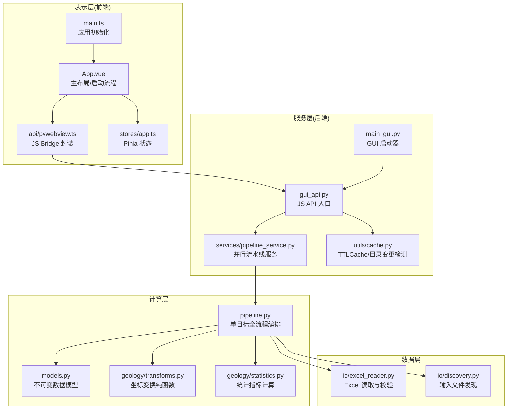
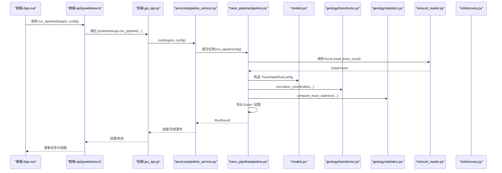
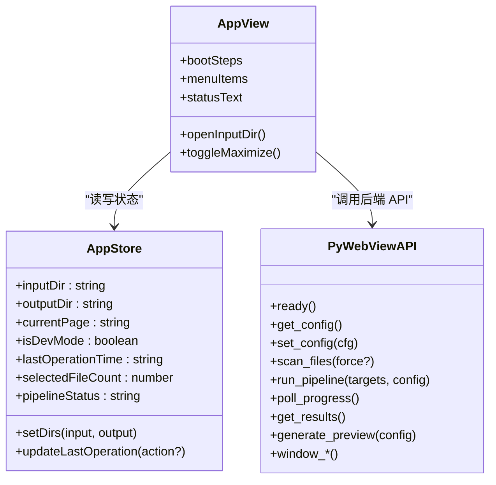
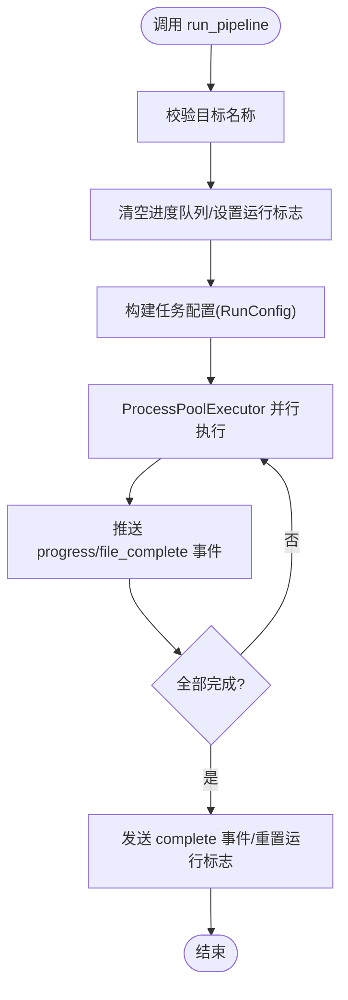
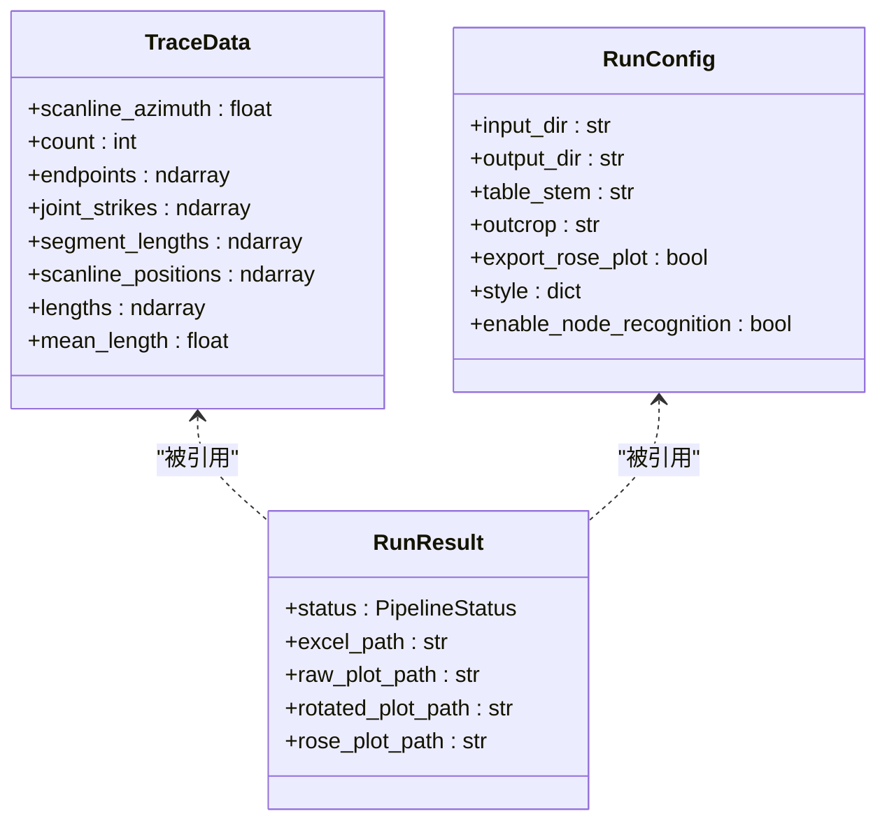
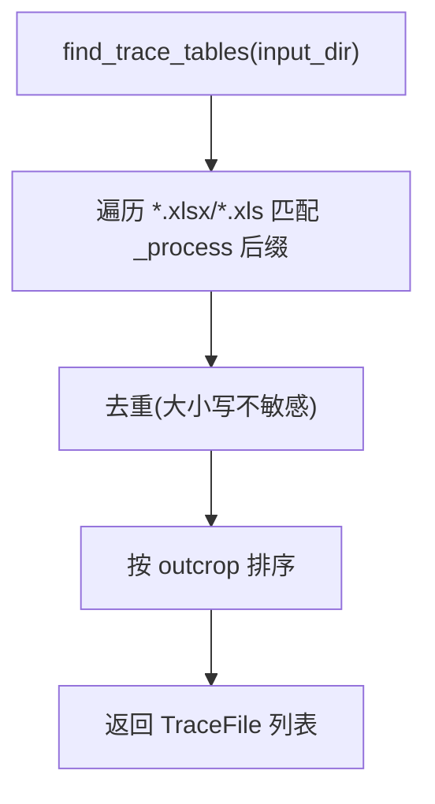
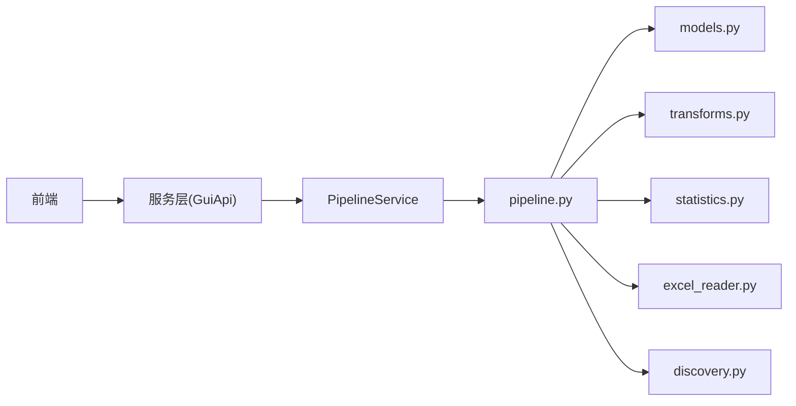

# 四层架构设计

<cite>
**本文引用的文件列表**
- [frontend/src/main.ts](file://frontend/src/main.ts)
- [frontend/src/App.vue](file://frontend/src/App.vue)
- [frontend/src/api/pywebview.ts](file://frontend/src/api/pywebview.ts)
- [frontend/src/stores/app.ts](file://frontend/src/stores/app.ts)
- [backend/main_gui.py](file://backend/main_gui.py)
- [backend/gui_api.py](file://backend/gui_api.py)
- [backend/services/pipeline_service.py](file://backend/services/pipeline_service.py)
- [trace_pipeline/pipeline.py](file://trace_pipeline/pipeline.py)
- [trace_pipeline/models.py](file://trace_pipeline/models.py)
- [trace_pipeline/io/excel_reader.py](file://trace_pipeline/io/excel_reader.py)
- [trace_pipeline/io/discovery.py](file://trace_pipeline/io/discovery.py)
- [trace_pipeline/geology/transforms.py](file://trace_pipeline/geology/transforms.py)
- [trace_pipeline/geology/statistics.py](file://trace_pipeline/geology/statistics.py)
- [backend/utils/cache.py](file://backend/utils/cache.py)
</cite>

## 目录
1. [简介](#简介)
2. [项目结构](#项目结构)
3. [核心组件](#核心组件)
4. [架构总览](#架构总览)
5. [详细组件分析](#详细组件分析)
6. [依赖关系分析](#依赖关系分析)
7. [性能考量](#性能考量)
8. [故障排查指南](#故障排查指南)
9. [结论](#结论)

## 简介
本文件面向 TracePipeline 的四层架构，系统性阐述：
- 表示层（Vue 3 + TypeScript + Element Plus + ECharts + Pinia）的职责与实现细节，包括组件化、状态管理、路由配置。
- 服务层（pywebview JS Bridge + 多个 Python 服务模块）的通信机制、线程管理、缓存体系与安全校验。
- 计算层（NumPy 向量化 + 纯函数模块）的设计原则：不可变数据模型、纯函数计算、向量化优先策略。
- 数据层（pandas + Excel 读写）的数据访问模式与文件发现机制。
并提供各层之间的单向依赖关系图与数据流转过程，说明前端如何与服务层通信、服务层如何调用计算层、计算层如何处理数据层，同时给出具体代码示例路径以展示交互模式。

## 项目结构
TracePipeline 采用前后端分离的桌面应用架构：
- 前端使用 Vue 3 + TypeScript + Element Plus + ECharts + Pinia，通过 pywebview 暴露的 JS API 与后端通信。
- 后端基于 pywebview 提供 GUI 窗口，GuiApi 作为 JS Bridge 入口，聚合多个服务模块，编排流水线执行。
- 计算层位于 trace_pipeline 包内，包含数据处理、几何变换、统计计算、绘图与 IO 等模块。
- 数据层由 pandas 与 Excel 读写模块组成，负责读取输入迹线表并输出结果。

图表来源
- [frontend/src/main.ts:1-88](file://frontend/src/main.ts#L1-L88)
- [frontend/src/App.vue:1-549](file://frontend/src/App.vue#L1-L549)
- [frontend/src/api/pywebview.ts:1-337](file://frontend/src/api/pywebview.ts#L1-L337)
- [frontend/src/stores/app.ts:1-57](file://frontend/src/stores/app.ts#L1-L57)
- [backend/main_gui.py:1-211](file://backend/main_gui.py#L1-L211)
- [backend/gui_api.py:1-800](file://backend/gui_api.py#L1-L800)
- [backend/services/pipeline_service.py:1-346](file://backend/services/pipeline_service.py#L1-L346)
- [backend/utils/cache.py:1-155](file://backend/utils/cache.py#L1-L155)
- [trace_pipeline/pipeline.py:1-474](file://trace_pipeline/pipeline.py#L1-L474)
- [trace_pipeline/models.py:1-352](file://trace_pipeline/models.py#L1-L352)
- [trace_pipeline/geology/transforms.py:1-169](file://trace_pipeline/geology/transforms.py#L1-L169)
- [trace_pipeline/geology/statistics.py:1-200](file://trace_pipeline/geology/statistics.py#L1-L200)
- [trace_pipeline/io/excel_reader.py:1-169](file://trace_pipeline/io/excel_reader.py#L1-L169)
- [trace_pipeline/io/discovery.py:1-63](file://trace_pipeline/io/discovery.py#L1-L63)

章节来源
- [frontend/src/main.ts:1-88](file://frontend/src/main.ts#L1-L88)
- [frontend/src/App.vue:1-549](file://frontend/src/App.vue#L1-L549)
- [backend/main_gui.py:1-211](file://backend/main_gui.py#L1-L211)

## 核心组件
- 前端应用初始化与插件注册：在 main.ts 中创建 Vue 应用、注册 Pinia、Router 与 Element Plus 组件，加载全局样式与字体系统。
- 主界面与启动流程：App.vue 定义标题栏、侧边栏、页面过渡、状态栏与窗口控制；启动画面驱动真实 API 进度，完成配置同步与文件扫描。
- JS Bridge 封装：api/pywebview.ts 提供类型安全的 API 出口，支持开发环境 mock 与就绪等待。
- 状态管理：stores/app.ts 维护输入/输出目录、当前页、操作时间、处理状态等，持久化到 localStorage。
- GUI 启动器：main_gui.py 检查 WebView2、居中窗口、绑定 GuiApi、注册关闭事件优雅退出。
- JS API 入口：gui_api.py 暴露配置、文件扫描、流水线运行、预览、报告、日志、图片、窗口控制等方法，内置安全校验、并发锁与缓存失效。
- 流水线服务：services/pipeline_service.py 使用后台线程 + ProcessPoolExecutor 并行执行任务，非阻塞返回并通过队列推送进度。
- 单目标流水线：pipeline.py 串联「加载 → 计算 → 变换 → 导出 Excel → 绘制图片」五阶段，统一异常处理与日志上下文。
- 不可变数据模型：models.py 定义 TraceData、RunConfig、RunResult，强制字段校验与不可变性。
- 坐标变换纯函数：geology/transforms.py 提供平移、旋转与规范化流水线，严格输入校验与不修改入参。
- 统计指标计算：geology/statistics.py 实现面积回退链、迹长回退链、自适应阈值与诊断信息。
- Excel 读取与校验：io/excel_reader.py 支持 .xlsx/.xls 候选扩展名与工作表回退，尺寸上限与格式校验。
- 输入文件发现：io/discovery.py 按后缀与扩展名匹配，去重并按 outcrop 排序。
- 缓存工具：utils/cache.py 提供 TTL+LRU 缓存与目录变更检测，用于图片缓存与 output 目录外部变更感知。

章节来源
- [frontend/src/main.ts:1-88](file://frontend/src/main.ts#L1-L88)
- [frontend/src/App.vue:1-549](file://frontend/src/App.vue#L1-L549)
- [frontend/src/api/pywebview.ts:1-337](file://frontend/src/api/pywebview.ts#L1-L337)
- [frontend/src/stores/app.ts:1-57](file://frontend/src/stores/app.ts#L1-L57)
- [backend/main_gui.py:1-211](file://backend/main_gui.py#L1-L211)
- [backend/gui_api.py:1-800](file://backend/gui_api.py#L1-L800)
- [backend/services/pipeline_service.py:1-346](file://backend/services/pipeline_service.py#L1-L346)
- [trace_pipeline/pipeline.py:1-474](file://trace_pipeline/pipeline.py#L1-L474)
- [trace_pipeline/models.py:1-352](file://trace_pipeline/models.py#L1-L352)
- [trace_pipeline/geology/transforms.py:1-169](file://trace_pipeline/geology/transforms.py#L1-L169)
- [trace_pipeline/geology/statistics.py:1-200](file://trace_pipeline/geology/statistics.py#L1-L200)
- [trace_pipeline/io/excel_reader.py:1-169](file://trace_pipeline/io/excel_reader.py#L1-L169)
- [trace_pipeline/io/discovery.py:1-63](file://trace_pipeline/io/discovery.py#L1-L63)
- [backend/utils/cache.py:1-155](file://backend/utils/cache.py#L1-L155)

## 架构总览
下图展示了从前端到数据层的完整调用链与数据流向，强调单向依赖关系：前端仅依赖服务层接口；服务层编排计算层；计算层依赖数据层与纯函数模块。

图表来源
- [frontend/src/App.vue:1-549](file://frontend/src/App.vue#L1-L549)
- [frontend/src/api/pywebview.ts:1-337](file://frontend/src/api/pywebview.ts#L1-L337)
- [backend/gui_api.py:1-800](file://backend/gui_api.py#L1-L800)
- [backend/services/pipeline_service.py:1-346](file://backend/services/pipeline_service.py#L1-L346)
- [trace_pipeline/pipeline.py:1-474](file://trace_pipeline/pipeline.py#L1-L474)
- [trace_pipeline/models.py:1-352](file://trace_pipeline/models.py#L1-L352)
- [trace_pipeline/geology/transforms.py:1-169](file://trace_pipeline/geology/transforms.py#L1-L169)
- [trace_pipeline/geology/statistics.py:1-200](file://trace_pipeline/geology/statistics.py#L1-L200)
- [trace_pipeline/io/excel_reader.py:1-169](file://trace_pipeline/io/excel_reader.py#L1-L169)

## 详细组件分析

### 表示层（Vue 3 + TypeScript + Element Plus + ECharts + Pinia）
- 应用初始化与插件注册：在 main.ts 中集中注册 Element Plus 组件与全局样式，确保 UI 一致性。
- 主布局与启动流程：App.vue 实现自定义标题栏、可折叠侧边栏、KeepAlive 页面缓存、状态栏与窗口控制（最小化/最大化/拖拽/调整大小）。启动画面根据真实 API 进度推进，完成后自动拉取配置并预热字体。
- 路由与菜单：App.vue 中定义菜单项与路由映射，结合 KeepAlive 提升切换性能。
- 状态管理：stores/app.ts 使用 Pinia 管理输入/输出目录、当前页、操作时间与处理状态，并通过 watch 持久化到 localStorage。
- JS Bridge 封装：api/pywebview.ts 提供类型安全的 API 出口，支持浏览器环境下的 mock 数据与就绪等待（监听 pywebviewready 事件），所有方法均为 async Promise。

图表来源
- [frontend/src/stores/app.ts:1-57](file://frontend/src/stores/app.ts#L1-L57)
- [frontend/src/api/pywebview.ts:1-337](file://frontend/src/api/pywebview.ts#L1-L337)
- [frontend/src/App.vue:1-549](file://frontend/src/App.vue#L1-L549)

章节来源
- [frontend/src/main.ts:1-88](file://frontend/src/main.ts#L1-L88)
- [frontend/src/App.vue:1-549](file://frontend/src/App.vue#L1-L549)
- [frontend/src/api/pywebview.ts:1-337](file://frontend/src/api/pywebview.ts#L1-L337)
- [frontend/src/stores/app.ts:1-57](file://frontend/src/stores/app.ts#L1-L57)

### 服务层（pywebview JS Bridge + 多服务模块）
- GUI 启动器：main_gui.py 负责 WebView2 检查、窗口居中、静态资源定位、绑定 GuiApi 与关闭事件，确保优雅退出。
- JS API 入口：gui_api.py 暴露配置、文件扫描、流水线运行、预览、报告、日志、图片、窗口控制等方法。关键特性：
  - 懒加载服务：首次访问时创建 PipelineService、PreviewService、StatsService、DataService、ReportService、AuditService。
  - 安全校验：PathSecurityChecker 限制路径在项目根或可信目录内；用户选择路径需登记白名单。
  - 并发控制：对预览与报告生成使用运行锁，避免并发导致资源耗尽。
  - 缓存失效：配置变更后使 FileService、StatsService、DirectoryChangeDetector、TTLCache 失效。
  - 进度队列：报告导出进度通过线程安全队列推送，前端轮询获取。
- 流水线服务：services/pipeline_service.py 使用后台线程 + ProcessPoolExecutor 并行执行任务，支持 parallel_workers 配置，非守护线程确保写入完成后退出，支持取消信号与超时关闭。

图表来源
- [backend/services/pipeline_service.py:1-346](file://backend/services/pipeline_service.py#L1-L346)

章节来源
- [backend/main_gui.py:1-211](file://backend/main_gui.py#L1-L211)
- [backend/gui_api.py:1-800](file://backend/gui_api.py#L1-L800)
- [backend/services/pipeline_service.py:1-346](file://backend/services/pipeline_service.py#L1-L346)

### 计算层（NumPy 向量化 + 纯函数模块）
- 不可变数据模型：models.py 中的 TraceData、RunConfig、RunResult 使用 frozen dataclass，强制字段校验与不可变性，派生属性通过 object.__setattr__ 缓存。
- 坐标变换纯函数：geology/transforms.py 提供 shift_to_positive、rotate_and_shift、normalize_coordinates 等纯函数，严格输入校验且不修改入参，遵循向量化优先策略。
- 统计指标计算：geology/statistics.py 实现面积回退链（实测→凸包→缓冲凸包→圆窗等效面积）、迹长回退链（segment→endpoint→估计）、自适应阈值与诊断信息。

图表来源
- [trace_pipeline/models.py:1-352](file://trace_pipeline/models.py#L1-L352)

章节来源
- [trace_pipeline/models.py:1-352](file://trace_pipeline/models.py#L1-L352)
- [trace_pipeline/geology/transforms.py:1-169](file://trace_pipeline/geology/transforms.py#L1-L169)
- [trace_pipeline/geology/statistics.py:1-200](file://trace_pipeline/geology/statistics.py#L1-L200)

### 数据层（pandas + Excel 读写）
- Excel 读取与校验：io/excel_reader.py 支持 .xlsx/.xls 候选扩展名与工作表回退，文件大小上限检查与基本格式校验（最少列数、数值有效性）。
- 输入文件发现：io/discovery.py 按后缀与扩展名匹配，去重并按 outcrop 排序，便于批量处理。

图表来源
- [trace_pipeline/io/discovery.py:1-63](file://trace_pipeline/io/discovery.py#L1-L63)

章节来源
- [trace_pipeline/io/excel_reader.py:1-169](file://trace_pipeline/io/excel_reader.py#L1-L169)
- [trace_pipeline/io/discovery.py:1-63](file://trace_pipeline/io/discovery.py#L1-L63)

## 依赖关系分析
- 单向依赖：前端 → 服务层（JS Bridge） → 计算层（pipeline + geology + io） → 数据层（Excel）。
- 服务层内部：GuiApi 聚合多个服务模块，按需懒加载，使用缓存工具进行目录变更检测与图片缓存。
- 计算层内部：pipeline.py 编排各阶段，依赖 models.py 的不可变数据模型与 transforms.py/statistics.py 的纯函数。

图表来源
- [backend/gui_api.py:1-800](file://backend/gui_api.py#L1-L800)
- [backend/services/pipeline_service.py:1-346](file://backend/services/pipeline_service.py#L1-L346)
- [trace_pipeline/pipeline.py:1-474](file://trace_pipeline/pipeline.py#L1-L474)
- [trace_pipeline/models.py:1-352](file://trace_pipeline/models.py#L1-L352)
- [trace_pipeline/geology/transforms.py:1-169](file://trace_pipeline/geology/transforms.py#L1-L169)
- [trace_pipeline/geology/statistics.py:1-200](file://trace_pipeline/geology/statistics.py#L1-L200)
- [trace_pipeline/io/excel_reader.py:1-169](file://trace_pipeline/io/excel_reader.py#L1-L169)
- [trace_pipeline/io/discovery.py:1-63](file://trace_pipeline/io/discovery.py#L1-L63)

章节来源
- [backend/gui_api.py:1-800](file://backend/gui_api.py#L1-L800)
- [backend/services/pipeline_service.py:1-346](file://backend/services/pipeline_service.py#L1-L346)
- [trace_pipeline/pipeline.py:1-474](file://trace_pipeline/pipeline.py#L1-L474)

## 性能考量
- 前端启动优化：启动画面并行执行文件扫描与字体预热，减少首屏延迟。
- 后端并发：PipelineService 使用 ProcessPoolExecutor 并行执行任务，parallel_workers 可配置为自动/串行/指定进程数。
- 缓存体系：TTLCache 提供 LRU + TTL 的图片缓存；DirectoryChangeDetector 检测 output 目录外部变更，自动失效相关缓存。
- 内存与 I/O：Excel 读取限制文件大小上限；流水线阶段记录耗时日志，便于定位瓶颈。

[本节为通用指导，无需特定文件分析]

## 故障排查指南
- 常见错误与提示：
  - PermissionError：文件被占用或权限不足，请关闭已打开的输出文件后重试。
  - FileNotFoundError：输入文件不存在，请检查文件路径。
  - 配置校验失败：run_pipeline 捕获 ValueError 并返回友好消息。
- 日志与审计：
  - 服务层方法均记录 stage 与耗时，便于问题定位。
  - 报告生成进度通过队列推送，前端轮询获取。
- 安全校验：
  - 路径越权拒绝：用户选择路径需登记白名单，否则拒绝访问。
  - 保存路径校验：报告保存前校验源文件存在且路径可信。

章节来源
- [backend/gui_api.py:1-800](file://backend/gui_api.py#L1-L800)
- [backend/services/pipeline_service.py:1-346](file://backend/services/pipeline_service.py#L1-L346)
- [trace_pipeline/pipeline.py:1-474](file://trace_pipeline/pipeline.py#L1-L474)

## 结论
TracePipeline 的四层架构清晰分层、职责明确：
- 表示层专注于 UI 与用户交互，通过类型安全的 JS Bridge 与服务层通信。
- 服务层提供安全、并发与缓存能力，编排计算层执行。
- 计算层坚持不可变数据模型与纯函数设计，向量化优先，保证正确性与性能。
- 数据层稳健地读取与校验 Excel 数据，支持灵活的文件发现机制。
整体依赖方向单一，数据流清晰，具备良好的可维护性与可扩展性。