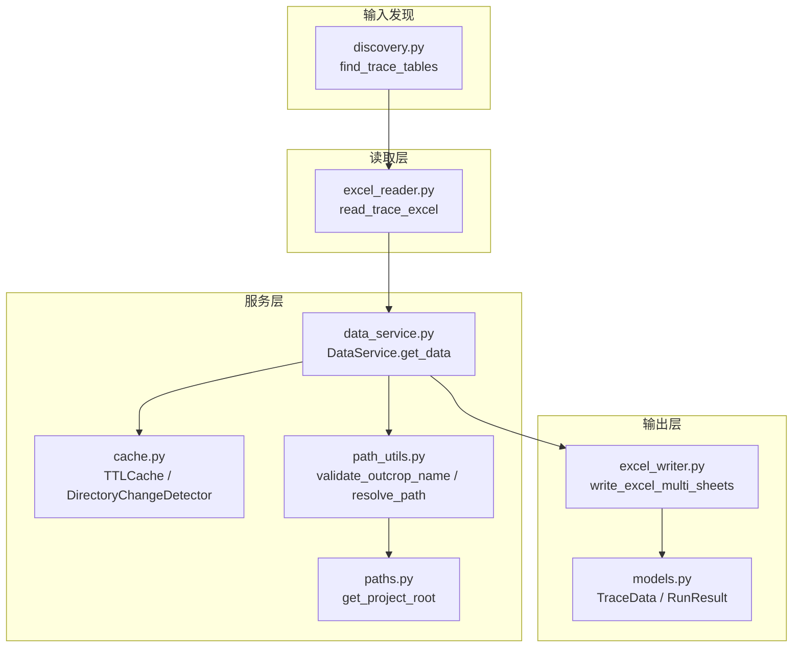
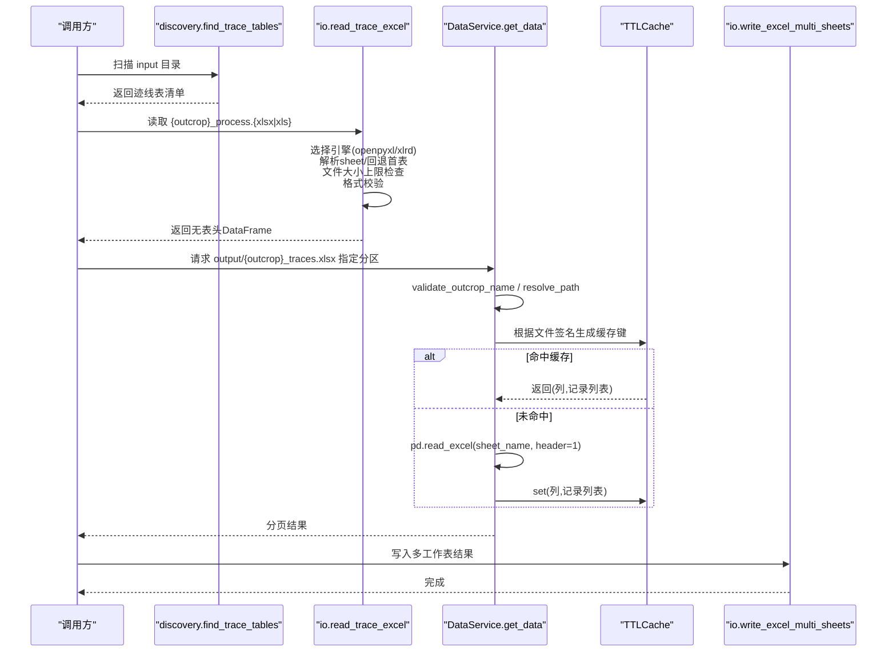
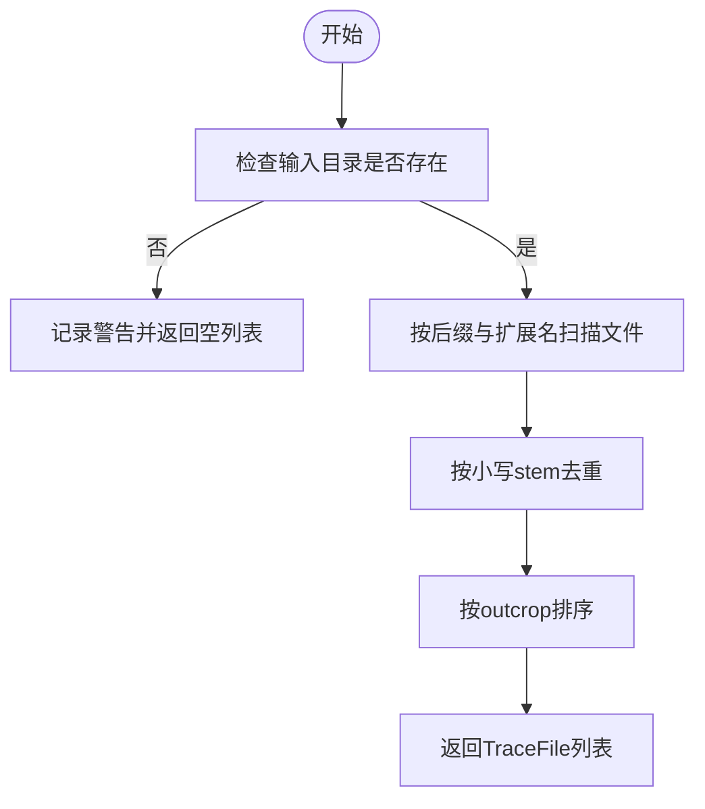
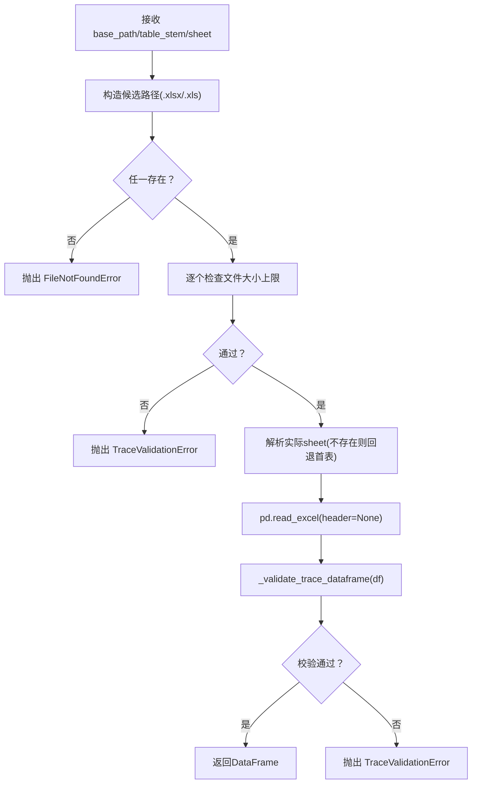
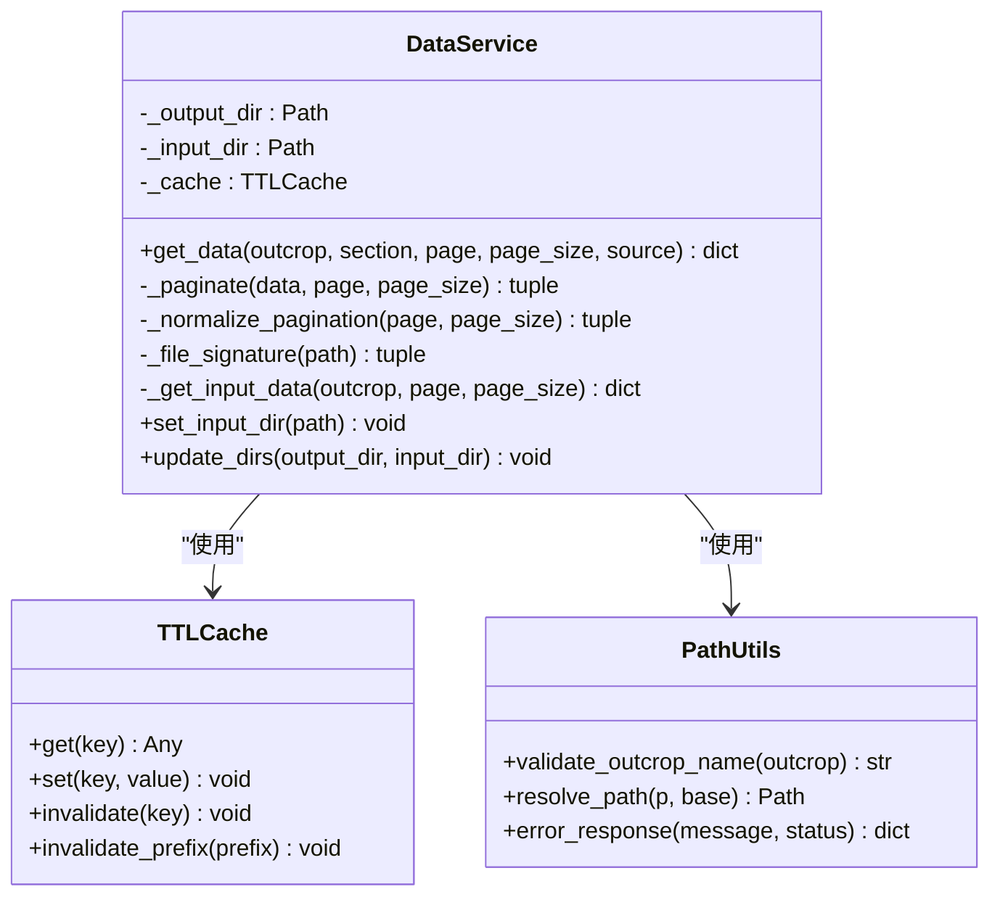
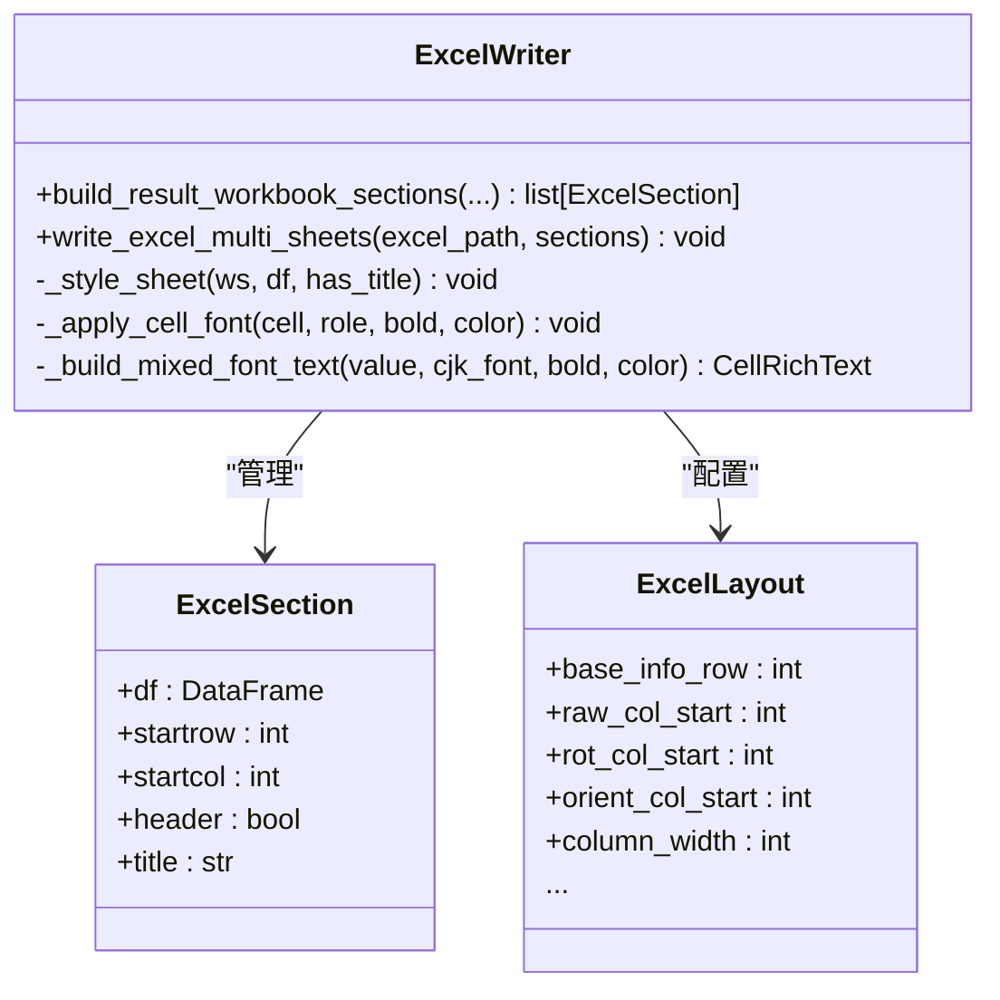
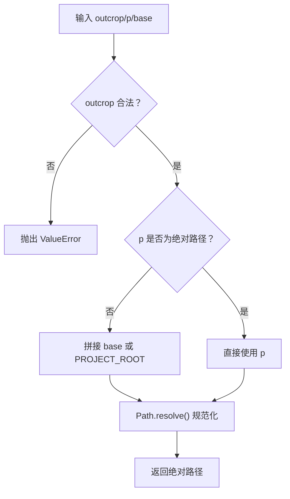
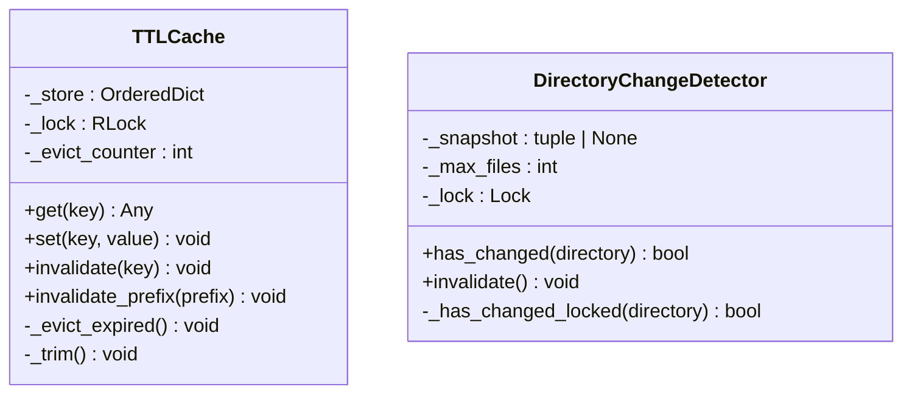
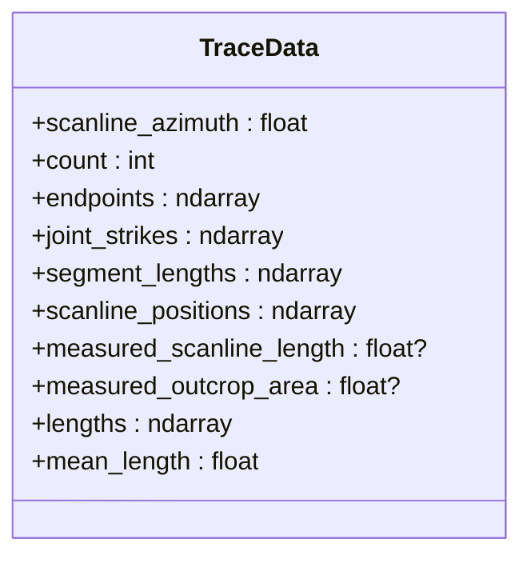
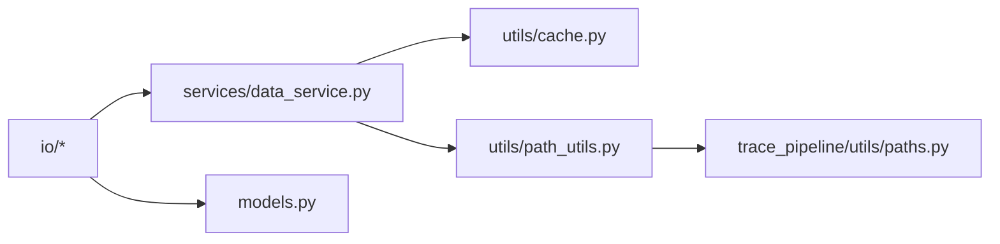

# 数据层（数据访问）

<cite>
**本文引用的文件**   
- [excel_reader.py](file://trace_pipeline/io/excel_reader.py)
- [excel_writer.py](file://trace_pipeline/io/excel_writer.py)
- [discovery.py](file://trace_pipeline/io/discovery.py)
- [data_service.py](file://backend/services/data_service.py)
- [cache.py](file://backend/utils/cache.py)
- [path_utils.py](file://backend/utils/path_utils.py)
- [paths.py](file://trace_pipeline/utils/paths.py)
- [models.py](file://trace_pipeline/models.py)
- [test_excel_reader.py](file://tests/test_excel_reader.py)
- [test_excel_writer.py](file://tests/test_excel_writer.py)
- [test_data_service.py](file://tests/test_data_service.py)
- [test_cache.py](file://tests/test_cache.py)
- [test_path_utils.py](file://tests/test_path_utils.py)
</cite>

## 目录
1. [简介](#简介)
2. [项目结构](#项目结构)
3. [核心组件](#核心组件)
4. [架构总览](#架构总览)
5. [详细组件分析](#详细组件分析)
6. [依赖关系分析](#依赖关系分析)
7. [性能考量](#性能考量)
8. [故障排查指南](#故障排查指南)
9. [结论](#结论)
10. [附录：示例与最佳实践](#附录示例与最佳实践)

## 简介
本技术文档聚焦 TracePipeline 的数据层，围绕基于 pandas 的 Excel 数据访问架构展开，覆盖输入发现、读取、校验、转换、写入、缓存、并发与路径安全等关键主题。目标是帮助开发者快速理解并正确使用数据导入导出、批量处理与错误恢复机制，同时提供可操作的排障建议与性能优化要点。

## 项目结构
数据层相关代码主要分布在以下模块：
- trace_pipeline/io：Excel 读取器、写入器与输入发现
- backend/services：面向 API 的数据服务（分页、缓存、多工作表映射）
- backend/utils：路径解析与安全校验、TTL/LRU 缓存与目录变更检测
- trace_pipeline/utils：项目根与资源根路径推断
- trace_pipeline/models：不可变数据模型与字段约束
- tests：针对读取、写入、缓存、路径安全的单元测试

图表来源
- [discovery.py:1-63](file://trace_pipeline/io/discovery.py#L1-L63)
- [excel_reader.py:1-169](file://trace_pipeline/io/excel_reader.py#L1-L169)
- [data_service.py:1-278](file://backend/services/data_service.py#L1-L278)
- [cache.py:1-155](file://backend/utils/cache.py#L1-L155)
- [path_utils.py:1-68](file://backend/utils/path_utils.py#L1-L68)
- [paths.py:1-43](file://trace_pipeline/utils/paths.py#L1-L43)
- [excel_writer.py:1-489](file://trace_pipeline/io/excel_writer.py#L1-L489)
- [models.py:1-352](file://trace_pipeline/models.py#L1-L352)

章节来源
- [discovery.py:1-63](file://trace_pipeline/io/discovery.py#L1-L63)
- [excel_reader.py:1-169](file://trace_pipeline/io/excel_reader.py#L1-L169)
- [data_service.py:1-278](file://backend/services/data_service.py#L1-L278)
- [cache.py:1-155](file://backend/utils/cache.py#L1-L155)
- [path_utils.py:1-68](file://backend/utils/path_utils.py#L1-L68)
- [paths.py:1-43](file://trace_pipeline/utils/paths.py#L1-L43)
- [excel_writer.py:1-489](file://trace_pipeline/io/excel_writer.py#L1-L489)
- [models.py:1-352](file://trace_pipeline/models.py#L1-L352)

## 核心组件
- 输入发现：按后缀与扩展名扫描 input 目录，返回去重后的迹线表清单，支持大小写不敏感的去重策略。
- Excel 读取器：优先 .xlsx，缺失回退 .xls；目标 sheet 不存在时直接回退首表；对超大文件进行拦截；对前若干行做数值性校验以识别非数据行。
- 数据服务：统一入口，负责参数校验、路径解析、多工作表映射、分页、缓存键生成与失效、异常归一化。
- 缓存与变更检测：线程安全的 TTL+LRU 缓存；目录快照对比，支持大目录截断场景下的新增/删除检测。
- Excel 写入器：构建多工作表区段（基本信息、坐标、走向与长度、节点统计/明细/交点），应用样式与列宽冻结，支持混合中英文字体分段渲染。
- 路径工具：白名单校验露头名防止路径遍历；相对路径解析为绝对路径；兼容开发/打包模式的项目根与资源根定位。
- 数据模型：不可变 TraceData 强约束形状与数值有效性，派生属性懒计算并缓存。

章节来源
- [discovery.py:1-63](file://trace_pipeline/io/discovery.py#L1-L63)
- [excel_reader.py:1-169](file://trace_pipeline/io/excel_reader.py#L1-L169)
- [data_service.py:1-278](file://backend/services/data_service.py#L1-L278)
- [cache.py:1-155](file://backend/utils/cache.py#L1-L155)
- [excel_writer.py:1-489](file://trace_pipeline/io/excel_writer.py#L1-L489)
- [path_utils.py:1-68](file://backend/utils/path_utils.py#L1-L68)
- [paths.py:1-43](file://trace_pipeline/utils/paths.py#L1-L43)
- [models.py:1-352](file://trace_pipeline/models.py#L1-L352)

## 架构总览
下图展示从输入发现到数据服务再到输出的端到端流程，以及缓存与路径安全在其中的作用点。

图表来源
- [discovery.py:1-63](file://trace_pipeline/io/discovery.py#L1-L63)
- [excel_reader.py:1-169](file://trace_pipeline/io/excel_reader.py#L1-L169)
- [data_service.py:1-278](file://backend/services/data_service.py#L1-L278)
- [cache.py:1-155](file://backend/utils/cache.py#L1-L155)
- [excel_writer.py:1-489](file://trace_pipeline/io/excel_writer.py#L1-L489)

## 详细组件分析

### 输入发现机制（自动扫描、路径解析、版本兼容、错误恢复）
- 匹配规则：文件名以固定后缀结尾，扩展名限定为 .xlsx/.xls；同名不同扩展名去重（大小写不敏感）。
- 排序与日志：按 outcrop 排序输出，便于前端稳定展示；存在/未发现均有日志提示。
- 兼容性：同时支持新旧扩展名，避免上游生产环境差异导致遗漏。

图表来源
- [discovery.py:1-63](file://trace_pipeline/io/discovery.py#L1-L63)

章节来源
- [discovery.py:1-63](file://trace_pipeline/io/discovery.py#L1-L63)

### Excel 读取器（多工作表、类型推断、缺失值、标准化）
- 引擎选择：.xlsx 使用 openpyxl，.xls 使用 xlrd；若目标 sheet 不存在则直接回退首表，避免失败读取。
- 大小限制：超过阈值（约 50 MiB）直接拒绝，避免内存压力。
- 格式校验：最少列数要求；对前若干行进行数值性抽样，判断是否包含大量非数据行，必要时告警。
- 错误分类：数据格式错误直接上抛；工作表不存在走回退逻辑；其他异常收集后汇总抛出。

图表来源
- [excel_reader.py:1-169](file://trace_pipeline/io/excel_reader.py#L1-L169)

章节来源
- [excel_reader.py:1-169](file://trace_pipeline/io/excel_reader.py#L1-L169)
- [test_excel_reader.py:1-46](file://tests/test_excel_reader.py#L1-L46)

### 数据服务（分页、缓存、多工作表映射、输入/输出双源）
- 参数校验：对白名单校验露头名，规范化分页参数，限制最大页大小。
- 输出源：读取 output/{outcrop}_traces.xlsx 的多工作表，header=1 跳过标题行；旧格式单工作表文件会给出友好提示。
- 输入源：读取 input/{outcrop}_process.{xlsx|xls}，先尝试按 outcrop 命名 sheet，否则回退首表；将原始列映射为标准列名。
- 缓存策略：基于文件 mtime_ns 与 size 生成缓存键；TTL + LRU 控制过期与容量；更新目录后主动失效缓存。
- 异常处理：MemoryError/KeyboardInterrupt/SystemExit 向上传播；其他异常归一化为错误响应。

图表来源
- [data_service.py:1-278](file://backend/services/data_service.py#L1-L278)
- [cache.py:1-155](file://backend/utils/cache.py#L1-L155)
- [path_utils.py:1-68](file://backend/utils/path_utils.py#L1-L68)

章节来源
- [data_service.py:1-278](file://backend/services/data_service.py#L1-L278)
- [test_data_service.py:1-64](file://tests/test_data_service.py#L1-L64)

### Excel 写入器（多工作表、样式格式化、大数据量优化、流式写入）
- 区段构建：基本信息、裂隙情况、计算数据、原始/旋转端点坐标、走向与长度、节点统计/明细/交点。
- 样式与排版：标题合并居中、表头高亮、边框、冻结窗格；列宽自适应；数字格式控制。
- 字体渲染：中文宋体/黑体，英文/数字 Times New Roman；混合文本按字符类别分段渲染。
- 写入方式：使用 openpyxl 引擎，逐区段写入独立工作表；一次性设置整行样式以减少开销。
- 大数据优化：边遍历边统计列宽，避免二次遍历；数值格式化减少字符串拼接成本。

图表来源
- [excel_writer.py:1-489](file://trace_pipeline/io/excel_writer.py#L1-L489)

章节来源
- [excel_writer.py:1-489](file://trace_pipeline/io/excel_writer.py#L1-L489)
- [test_excel_writer.py:1-50](file://tests/test_excel_writer.py#L1-L50)

### 路径工具（安全校验、跨平台兼容、符号链接、权限控制）
- 安全校验：白名单正则仅允许字母、数字、下划线、连字符与中文字符，禁止路径分隔符与“..”等，防止路径遍历。
- 路径解析：相对路径基于 PROJECT_ROOT 或传入 base 解析为绝对路径，并使用 resolve() 规范化符号链接。
- 项目根/资源根：兼容开发与 PyInstaller 打包模式，分别定位可写项目根与只读资源根。
- 权限控制：上层应结合文件系统权限与最小权限原则；本模块仅提供安全的路径构造与校验。

图表来源
- [path_utils.py:1-68](file://backend/utils/path_utils.py#L1-L68)
- [paths.py:1-43](file://trace_pipeline/utils/paths.py#L1-L43)

章节来源
- [path_utils.py:1-68](file://backend/utils/path_utils.py#L1-L68)
- [paths.py:1-43](file://trace_pipeline/utils/paths.py#L1-L43)
- [test_path_utils.py:1-34](file://tests/test_path_utils.py#L1-L34)

### 数据缓存策略、增量更新与并发访问控制
- TTLCache：线程安全（RLock），TTL 过期淘汰 + LRU 裁剪；批量驱逐降低全扫描频率。
- DirectoryChangeDetector：浅层快照（目录 mtime + 子项 name/is_dir/st_size/st_mtime_ns），支持大目录截断时的总数标记，确保新增/删除可被检测；并发安全（Lock）。
- 增量更新：当检测到目录变更或显式 invalidate 时，重建快照；数据服务在目录变更后主动失效缓存。

图表来源
- [cache.py:1-155](file://backend/utils/cache.py#L1-L155)

章节来源
- [cache.py:1-155](file://backend/utils/cache.py#L1-L155)
- [test_cache.py:1-157](file://tests/test_cache.py#L1-L157)

### 数据模型与约束（TraceData）
- 不可变容器：frozen dataclass，__post_init__ 执行严格形状与数值校验，并将数组设为只读。
- 派生属性：lengths 首次访问计算并缓存；mean_length 基于 lengths 均值。
- 可选字段：measured_scanline_length/measured_outcrop_area 需为正有限浮点数或 None。

图表来源
- [models.py:1-352](file://trace_pipeline/models.py#L1-L352)

章节来源
- [models.py:1-352](file://trace_pipeline/models.py#L1-L352)

## 依赖关系分析
- 低耦合：io 层专注于 Excel 读写与发现；service 层编排流程与缓存；utils 提供通用能力。
- 外部依赖：pandas/openpyxl/xlrd 用于 Excel 操作；numpy 用于数值计算。
- 潜在风险：openpyxl 写入大型工作表可能占用较多内存；可通过分块写入或流式策略进一步优化（当前实现为一次性写入各 sheet）。

图表来源
- [data_service.py:1-278](file://backend/services/data_service.py#L1-L278)
- [cache.py:1-155](file://backend/utils/cache.py#L1-L155)
- [path_utils.py:1-68](file://backend/utils/path_utils.py#L1-L68)
- [paths.py:1-43](file://trace_pipeline/utils/paths.py#L1-L43)
- [excel_reader.py:1-169](file://trace_pipeline/io/excel_reader.py#L1-L169)
- [excel_writer.py:1-489](file://trace_pipeline/io/excel_writer.py#L1-L489)
- [models.py:1-352](file://trace_pipeline/models.py#L1-L352)

章节来源
- [data_service.py:1-278](file://backend/services/data_service.py#L1-L278)
- [cache.py:1-155](file://backend/utils/cache.py#L1-L155)
- [path_utils.py:1-68](file://backend/utils/path_utils.py#L1-L68)
- [paths.py:1-43](file://trace_pipeline/utils/paths.py#L1-L43)
- [excel_reader.py:1-169](file://trace_pipeline/io/excel_reader.py#L1-L169)
- [excel_writer.py:1-489](file://trace_pipeline/io/excel_writer.py#L1-L489)
- [models.py:1-352](file://trace_pipeline/models.py#L1-L352)

## 性能考量
- 读取侧：
  - 优先 .xlsx 并使用 openpyxl；对超大文件提前拒绝，避免 OOM。
  - 读取 input 时使用 header=None 并过滤空行，减少无效数据处理。
- 服务侧：
  - 基于文件签名（mtime_ns + size）的缓存键，保证增量更新命中。
  - TTL + LRU 控制内存占用；批量驱逐降低锁竞争。
- 写入侧：
  - 一次遍历内完成样式与列宽统计，避免二次遍历。
  - 数字格式与单位字符串预格式化，减少单元格写入时的重复计算。
- 并发：
  - TTLCache 使用 RLock，DirectoryChangeDetector 使用 Lock，保障多线程安全。

## 故障排查指南
- 找不到输入文件：
  - 确认 input 目录下存在 {outcrop}_process.{xlsx|xls}；查看 discovery 日志是否发现匹配文件。
- 工作表不存在：
  - 输出侧：若旧格式单工作表文件，get_data 会返回明确错误提示，请重新处理生成新格式。
  - 输入侧：先尝试按 outcrop 命名 sheet，再回退首表；如仍失败，检查 Excel 内容。
- 数据格式错误：
  - 读取器对列数与数值占比进行校验，若报错 TraceValidationError，说明数据不符合迹线表规范。
- 内存不足：
  - 检查是否读取了超大 Excel 文件；读取器已内置大小上限，若绕过该限制，请拆分文件或调整阈值。
- 缓存未更新：
  - 修改目录后调用 update_dirs/set_input_dir 或显式 invalidate；DirectoryChangeDetector 可用于外部监控。
- 路径安全问题：
  - 非法露头名将触发 ValueError；确保前端传入名称符合白名单。

章节来源
- [excel_reader.py:1-169](file://trace_pipeline/io/excel_reader.py#L1-L169)
- [data_service.py:1-278](file://backend/services/data_service.py#L1-L278)
- [cache.py:1-155](file://backend/utils/cache.py#L1-L155)
- [path_utils.py:1-68](file://backend/utils/path_utils.py#L1-L68)

## 结论
TracePipeline 的数据层以清晰的分层与职责划分实现了稳健的 Excel 数据访问能力：输入发现兼顾兼容性与健壮性，读取器具备回退与校验机制，服务层提供分页与缓存，写入器支持多工作表与样式格式化，路径工具保障安全与跨平台兼容。整体设计在易用性、性能与可靠性之间取得良好平衡，适合在生产环境中稳定运行。

## 附录：示例与最佳实践
- 数据导入（输入侧）
  - 使用 find_trace_tables 扫描 input 目录获取待处理表清单。
  - 通过 read_trace_excel 读取 {outcrop}_process.{xlsx|xls}，注意捕获 TraceValidationError 与 FileNotFoundError。
  - 参考测试用例验证回退行为与大文件拦截。
- 数据导出（输出侧）
  - 使用 build_result_workbook_sections 构建区段，再通过 write_excel_multi_sheets 写入多工作表。
  - 如需自定义布局，调整 ExcelLayout 字段（列起始位置、宽度、冻结行等）。
- 批量处理
  - 在服务层循环调用 get_data 分页拉取，利用缓存键避免重复读取。
  - 对大批量写入，考虑分批构建区段并多次调用写入函数以降低峰值内存。
- 错误处理模式
  - 统一使用 error_response 包装错误信息，便于前端一致化处理。
  - 区分业务错误（TraceValidationError）与系统异常（IO/Memory），前者直接上抛，后者归一化返回。
- 并发与缓存
  - 多线程环境下使用 TTLCache 与 DirectoryChangeDetector 保证一致性。
  - 目录变更后及时 invalidate 或等待 has_changed 返回 True 后再刷新缓存。

章节来源
- [test_excel_reader.py:1-46](file://tests/test_excel_reader.py#L1-L46)
- [test_excel_writer.py:1-50](file://tests/test_excel_writer.py#L1-L50)
- [test_data_service.py:1-64](file://tests/test_data_service.py#L1-L64)
- [test_cache.py:1-157](file://tests/test_cache.py#L1-L157)
- [test_path_utils.py:1-34](file://tests/test_path_utils.py#L1-L34)