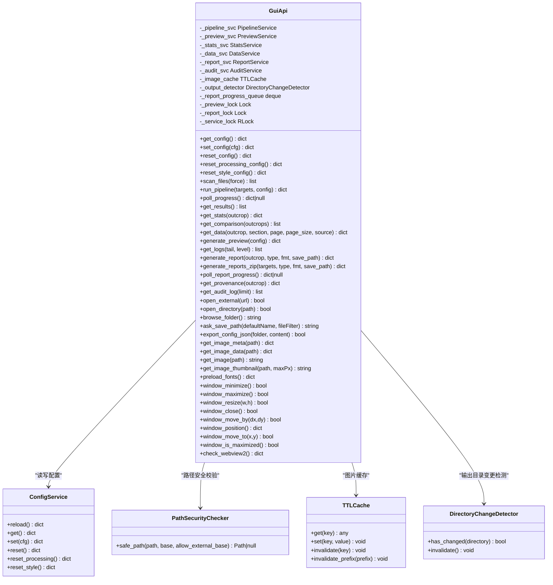
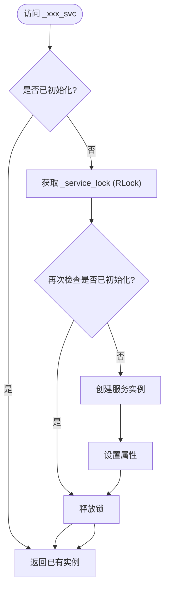
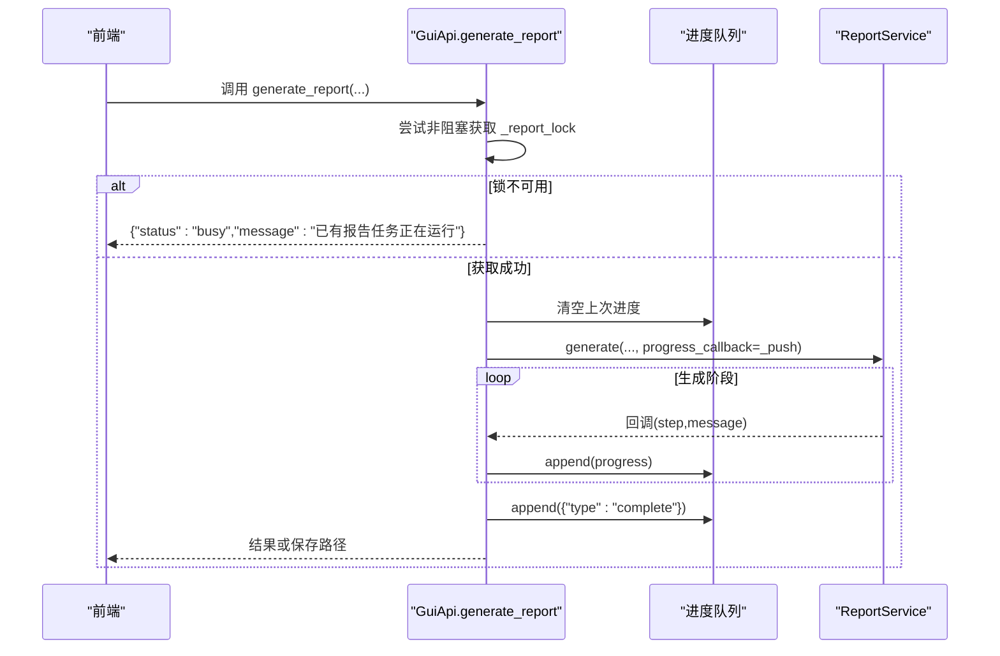
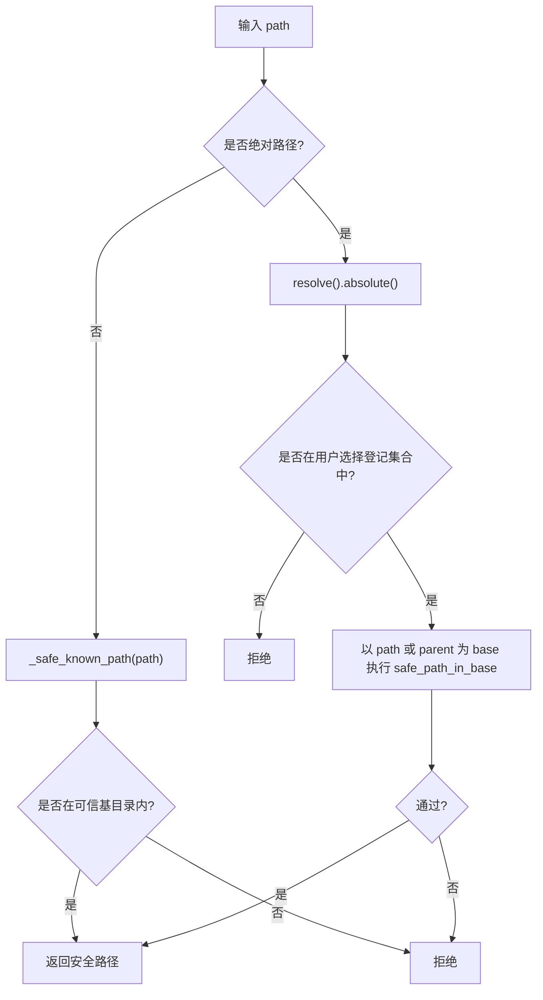
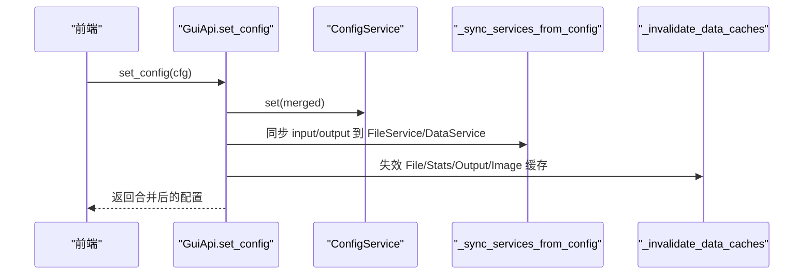
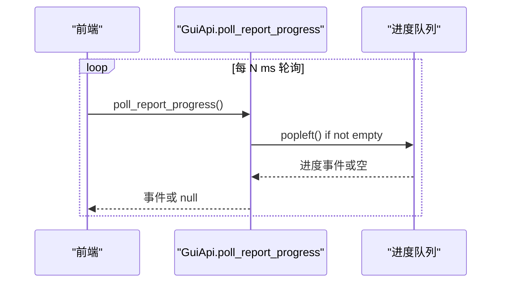
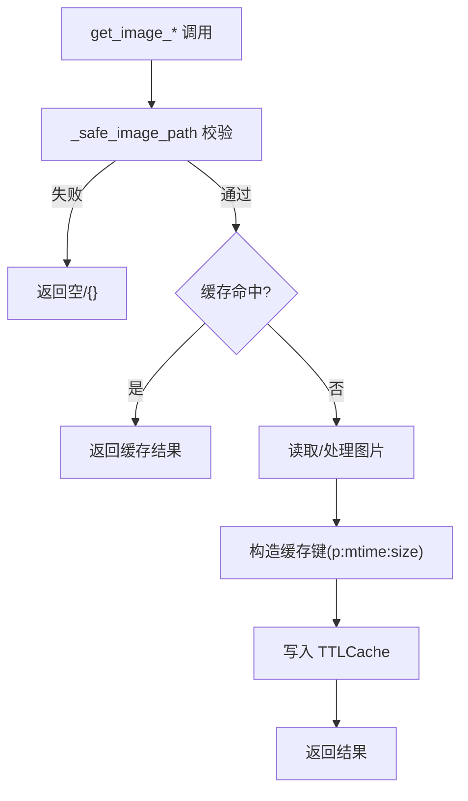
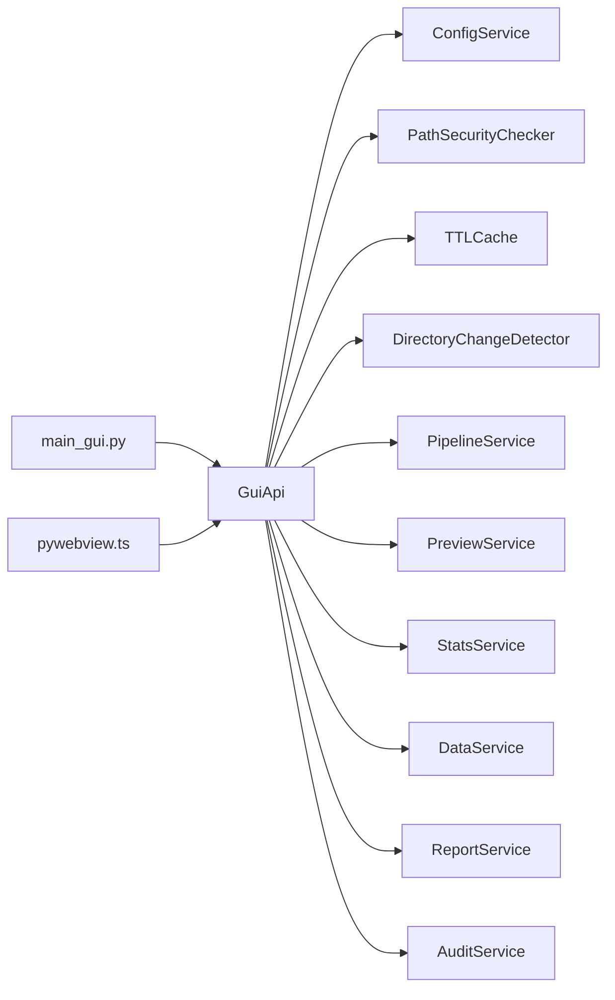
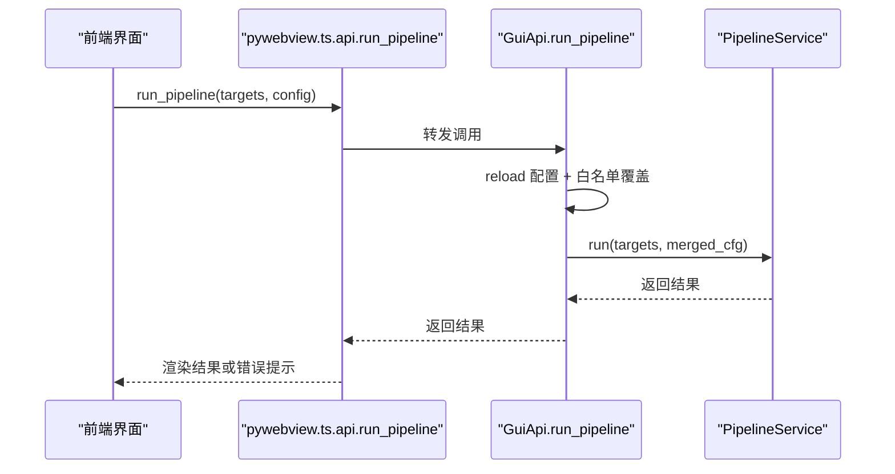
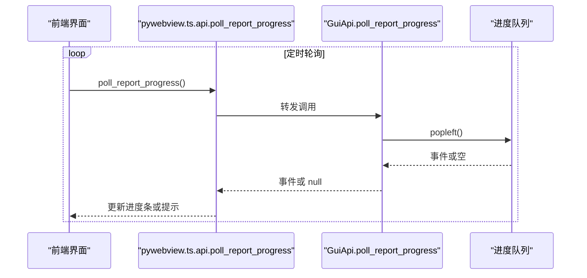

# GUI API 层

<cite>
**本文引用的文件**   
- [backend/gui_api.py](file://backend/gui_api.py)
- [backend/main_gui.py](file://backend/main_gui.py)
- [frontend/src/api/pywebview.ts](file://frontend/src/api/pywebview.ts)
- [backend/utils/security.py](file://backend/utils/security.py)
- [backend/utils/path_utils.py](file://backend/utils/path_utils.py)
- [backend/utils/cache.py](file://backend/utils/cache.py)
- [backend/services/config_service.py](file://backend/services/config_service.py)
</cite>

## 目录
1. [简介](#简介)
2. [项目结构](#项目结构)
3. [核心组件](#核心组件)
4. [架构总览](#架构总览)
5. [详细组件分析](#详细组件分析)
6. [依赖关系分析](#依赖关系分析)
7. [性能考量](#性能考量)
8. [故障排查指南](#故障排查指南)
9. [结论](#结论)
10. [附录：前端调用示例与错误处理](#附录前端调用示例与错误处理)

## 简介
本文件面向 TracePipeline 的 GUI API 层，聚焦于 GuiApi 类作为 pywebview JS API 入口的核心设计。文档将系统阐述：
- 所有公开方法的接口规范、参数校验与错误响应格式
- 懒加载服务管理机制与线程安全实现（双检锁）
- 请求频率限制与运行锁机制
- 路径安全校验体系（_safe_path、_safe_user_selected_path 等）
- 配置同步机制、缓存失效策略与进度队列管理
- 前端如何调用后端方法、处理异步响应与错误状态
- 性能优化技巧与调试指南

## 项目结构
GUI API 层位于后端模块中，通过 PyWebView 暴露给前端 TypeScript 封装层调用。关键文件组织如下：
- 后端入口与窗口初始化：main_gui.py
- GUI API 桥接层：gui_api.py
- 安全与工具：utils/security.py、utils/path_utils.py、utils/cache.py
- 配置服务：services/config_service.py
- 前端桥接封装：frontend/src/api/pywebview.ts

```mermaid
graph TB
subgraph "前端"
FE_TS["pywebview.ts<br/>API 封装"]
end
subgraph "桌面端宿主"
MAIN["main_gui.py<br/>PyWebView 启动器"]
WEBVIEW["WebView2 窗口"]
end
subgraph "后端"
GUI_API["GuiApi<br/>JS API 入口"]
CFG_SVC["ConfigService<br/>配置读写"]
SEC["PathSecurityChecker<br/>路径安全校验"]
CACHE["TTLCache / DirectoryChangeDetector<br/>缓存与变更检测"]
end
FE_TS --> |pywebview.api.*| GUI_API
MAIN --> |create_window(js_api=api)| WEBVIEW
MAIN --> |初始化| GUI_API
GUI_API --> CFG_SVC
GUI_API --> SEC
GUI_API --> CACHE
```

图表来源
- [backend/main_gui.py:163-175](file://backend/main_gui.py#L163-L175)
- [backend/gui_api.py:52-110](file://backend/gui_api.py#L52-L110)
- [backend/services/config_service.py:41-51](file://backend/services/config_service.py#L41-L51)
- [backend/utils/security.py:14-46](file://backend/utils/security.py#L14-L46)
- [backend/utils/cache.py:18-35](file://backend/utils/cache.py#L18-L35)

章节来源
- [backend/main_gui.py:81-175](file://backend/main_gui.py#L81-L175)
- [backend/gui_api.py:52-110](file://backend/gui_api.py#L52-L110)
- [frontend/src/api/pywebview.ts:144-185](file://frontend/src/api/pywebview.ts#L144-L185)

## 核心组件
- GuiApi：PyWebView 暴露给前端的统一 API 入口，负责：
  - 懒加载服务实例（Pipeline/Preview/Stats/Data/Report/Audit）
  - 线程安全的运行锁与进度队列
  - 路径安全校验与用户选择路径白名单登记
  - 配置读取/写入与多服务同步
  - 图片读取与缩略图生成、ZIP 打包导出
  - 窗口控制与外部链接打开
- ConfigService：配置文件的唯一写入入口，提供原子写入与并发保护
- PathSecurityChecker：防止路径遍历攻击的安全校验器
- TTLCache / DirectoryChangeDetector：统一的 TTL+LRU 缓存与目录变更检测
- 前端 pywebview.ts：类型化封装、就绪等待与开发环境 mock

章节来源
- [backend/gui_api.py:52-158](file://backend/gui_api.py#L52-L158)
- [backend/services/config_service.py:41-144](file://backend/services/config_service.py#L41-L144)
- [backend/utils/security.py:14-128](file://backend/utils/security.py#L14-L128)
- [backend/utils/cache.py:18-155](file://backend/utils/cache.py#L18-L155)
- [frontend/src/api/pywebview.ts:144-337](file://frontend/src/api/pywebview.ts#L144-L337)

## 架构总览
GuiApi 作为中间层，聚合多个 Service 并对外暴露稳定的 JSON 接口。其关键特性包括：
- 懒加载：首次访问时创建重资源服务，降低启动开销
- 线程安全：使用 RLock 保护懒加载；独立 Lock 保护预览/报告任务；deque 配合 Lock 实现进度队列
- 路径安全：多层校验（URL 解码、.. 检查、设备名过滤、符号链接解析、基准目录限定）
- 配置同步：set/reset 后自动同步 FileService/DataService 路径，并触发缓存失效
- 进度反馈：generate_report/generate_reports_zip 通过回调向队列推送进度事件，前端轮询



图表来源
- [backend/gui_api.py:52-158](file://backend/gui_api.py#L52-L158)
- [backend/services/config_service.py:41-144](file://backend/services/config_service.py#L41-L144)
- [backend/utils/security.py:14-128](file://backend/utils/security.py#L14-L128)
- [backend/utils/cache.py:18-155](file://backend/utils/cache.py#L18-L155)

## 详细组件分析

### 懒加载服务与线程安全（双检锁）
- 懒加载属性：_pipeline_svc、_preview_svc、_stats_svc、_data_svc、_report_svc、_audit_svc
- 双检锁模式：先无锁判断是否为 None，再进入 RLock 二次判断并实例化，避免每次访问都加锁
- 适用场景：重资源服务仅在首次使用时创建，减少启动时间



图表来源
- [backend/gui_api.py:112-158](file://backend/gui_api.py#L112-L158)

章节来源
- [backend/gui_api.py:112-158](file://backend/gui_api.py#L112-L158)

### 请求频率限制与运行锁机制
- 预览任务：_preview_lock（非阻塞 acquire），若已有任务则返回 busy
- 报告任务：_report_lock（非阻塞 acquire），同时用于 generate_report 与 generate_reports_zip，避免并发写同名中间产物
- 进度队列：_report_progress_queue（deque，maxlen=500），配合 _report_progress_lock 保证线程安全



图表来源
- [backend/gui_api.py:644-730](file://backend/gui_api.py#L644-L730)
- [backend/gui_api.py:732-853](file://backend/gui_api.py#L732-L853)

章节来源
- [backend/gui_api.py:602-628](file://backend/gui_api.py#L602-L628)
- [backend/gui_api.py:644-730](file://backend/gui_api.py#L644-L730)
- [backend/gui_api.py:732-853](file://backend/gui_api.py#L732-L853)

### 路径安全校验系统
- _safe_path：基于 PathSecurityChecker.safe_path，递归 URL 解码、拒绝 ..、拒绝 Windows 设备名、resolve 后限制在 base 内
- _safe_known_path：遍历可信基目录（项目根、input_dir、output_dir、REPORT_DIR），任一匹配即返回安全路径
- _safe_user_selected_path：绝对路径需来自“用户选择登记”集合（通过 ask_save_path/browse_folder 登记），相对路径走 _safe_known_path
- open_external：仅允许 https/http 且域名在白名单



图表来源
- [backend/gui_api.py:165-208](file://backend/gui_api.py#L165-L208)
- [backend/gui_api.py:179-192](file://backend/gui_api.py#L179-L192)
- [backend/utils/security.py:47-127](file://backend/utils/security.py#L47-L127)

章节来源
- [backend/gui_api.py:165-208](file://backend/gui_api.py#L165-L208)
- [backend/utils/security.py:47-127](file://backend/utils/security.py#L47-L127)

### 配置同步机制与缓存失效策略
- set/reset/reset_processing/reset_style：均会调用 _sync_services_from_config 更新 FileService/DataService 的路径，并调用 _invalidate_data_caches 使相关缓存失效
- _invalidate_data_caches：FileService、StatsService、DirectoryChangeDetector、TTLCache 全部失效
- scan_files/get_results/get_stats 等方法在执行前会调用 _check_output_changed 检测 output 目录外部变更，必要时自动失效缓存



图表来源
- [backend/gui_api.py:273-291](file://backend/gui_api.py#L273-L291)
- [backend/gui_api.py:218-229](file://backend/gui_api.py#L218-L229)
- [backend/gui_api.py:250-261](file://backend/gui_api.py#L250-L261)
- [backend/services/config_service.py:92-101](file://backend/services/config_service.py#L92-L101)

章节来源
- [backend/gui_api.py:218-229](file://backend/gui_api.py#L218-L229)
- [backend/gui_api.py:250-261](file://backend/gui_api.py#L250-L261)
- [backend/services/config_service.py:92-101](file://backend/services/config_service.py#L92-L101)

### 进度队列管理与轮询
- generate_report/generate_reports_zip 内部通过回调将进度事件追加至 _report_progress_queue
- poll_report_progress 非阻塞弹出队首元素供前端轮询
- 完成或异常时追加 complete/error 标记



图表来源
- [backend/gui_api.py:639-642](file://backend/gui_api.py#L639-L642)
- [backend/gui_api.py:674-688](file://backend/gui_api.py#L674-L688)
- [backend/gui_api.py:844-851](file://backend/gui_api.py#L844-L851)

章节来源
- [backend/gui_api.py:639-642](file://backend/gui_api.py#L639-L642)
- [backend/gui_api.py:674-688](file://backend/gui_api.py#L674-L688)
- [backend/gui_api.py:844-851](file://backend/gui_api.py#L844-L851)

### 图片读取与缓存
- get_image_meta：返回版本元数据（size/mtime/ext），不读内容
- get_image_data：返回 data URL 及元数据，带 TTL 缓存
- get_image：返回 data URL，带 TTL 缓存
- get_image_thumbnail：生成 PNG 缩略图，尺寸限制在 64~1600px
- 安全限制：最大 5MB、扩展名白名单、路径必须通过 _safe_known_path



图表来源
- [backend/gui_api.py:983-1010](file://backend/gui_api.py#L983-L1010)
- [backend/gui_api.py:1034-1074](file://backend/gui_api.py#L1034-L1074)
- [backend/gui_api.py:1076-1113](file://backend/gui_api.py#L1076-L1113)
- [backend/gui_api.py:1115-1163](file://backend/gui_api.py#L1115-L1163)
- [backend/utils/cache.py:18-90](file://backend/utils/cache.py#L18-L90)

章节来源
- [backend/gui_api.py:983-1010](file://backend/gui_api.py#L983-L1010)
- [backend/gui_api.py:1034-1074](file://backend/gui_api.py#L1034-L1074)
- [backend/gui_api.py:1076-1113](file://backend/gui_api.py#L1076-L1113)
- [backend/gui_api.py:1115-1163](file://backend/gui_api.py#L1115-L1163)
- [backend/utils/cache.py:18-90](file://backend/utils/cache.py#L18-L90)

### 窗口控制与外部操作
- window_minimize/maximize/resize/close/move_by/move_to/position/is_maximized：封装 PyWebView 窗口操作
- open_external：仅允许白名单域名
- open_directory：限制在项目根目录内
- browse_folder/ask_save_path：通过系统对话框选择路径并登记到用户选择集合

章节来源
- [backend/gui_api.py:1312-1427](file://backend/gui_api.py#L1312-L1427)
- [backend/gui_api.py:901-925](file://backend/gui_api.py#L901-L925)
- [backend/gui_api.py:927-962](file://backend/gui_api.py#L927-L962)
- [backend/gui_api.py:1165-1253](file://backend/gui_api.py#L1165-L1253)

## 依赖关系分析
- main_gui.py 创建 PyWebView 窗口并将 GuiApi 实例绑定为 js_api
- GuiApi 依赖：
  - ConfigService：配置读写与默认值
  - PathSecurityChecker：路径安全校验
  - TTLCache / DirectoryChangeDetector：缓存与目录变更检测
  - 各业务 Service（Pipeline/Preview/Stats/Data/Report/Audit）：按需懒加载
- 前端 pywebview.ts 提供类型化封装与 mock 回退



图表来源
- [backend/main_gui.py:163-175](file://backend/main_gui.py#L163-L175)
- [backend/gui_api.py:52-110](file://backend/gui_api.py#L52-L110)
- [backend/services/config_service.py:41-51](file://backend/services/config_service.py#L41-L51)
- [backend/utils/security.py:14-46](file://backend/utils/security.py#L14-L46)
- [backend/utils/cache.py:18-35](file://backend/utils/cache.py#L18-L35)

章节来源
- [backend/main_gui.py:163-175](file://backend/main_gui.py#L163-L175)
- [backend/gui_api.py:52-110](file://backend/gui_api.py#L52-L110)

## 性能考量
- 懒加载：重资源服务延迟初始化，缩短启动时间
- 运行锁：预览/报告任务串行化，避免资源争用与中间产物冲突
- 缓存：
  - TTLCache：图片数据按 key 缓存，支持批量驱逐与 LRU 淘汰
  - DirectoryChangeDetector：轻量快照对比，避免频繁全量扫描
- 图片限制：单文件上限 5MB，缩略图尺寸限制，减少内存峰值
- 配置原子写入：临时文件 + replace，避免中断导致损坏

[本节为通用指导，无需特定文件引用]

## 故障排查指南
- 常见问题定位
  - 预览/报告任务被拒：检查是否已有任务在运行（busy 状态）
  - 路径越权：确认路径是否通过 _safe_known_path 或用户选择登记
  - 图片无法显示：检查扩展名白名单与文件大小限制
  - 配置未生效：确认 set/reset 后是否触发了 _sync_services_from_config 与 _invalidate_data_caches
- 日志关键字
  - api_preview_reject、api_report_reject、api_open_external、api_get_image、api_export_config、api_scan_files、api_run_pipeline、api_generate_report_call、api_generate_reports_zip_call
- 建议步骤
  - 开启 debug 日志查看 stage 字段
  - 对进度任务使用 poll_report_progress 轮询，观察 complete/error 事件
  - 对图片问题，优先调用 get_image_meta 验证 mtime/size/ext

章节来源
- [backend/gui_api.py:602-628](file://backend/gui_api.py#L602-L628)
- [backend/gui_api.py:644-730](file://backend/gui_api.py#L644-L730)
- [backend/gui_api.py:901-925](file://backend/gui_api.py#L901-L925)
- [backend/gui_api.py:983-1010](file://backend/gui_api.py#L983-L1010)
- [backend/gui_api.py:1255-1305](file://backend/gui_api.py#L1255-L1305)

## 结论
GuiApi 作为 GUI 层的统一入口，采用懒加载、运行锁、路径安全校验、配置同步与缓存失效等机制，在保证安全与稳定性的前提下提供了高性能的跨进程 API 能力。前端通过类型化封装可便捷地调用后端方法，并通过进度队列与错误状态进行良好交互。

[本节为总结性内容，无需特定文件引用]

## 附录：前端调用示例与错误处理

### 前端调用约定
- 所有方法均为 async，返回 Promise
- 后端异常会以 rejected Promise 形式抛出，由调用方 catch 处理
- 参数类型应与 GuiApi 方法签名保持一致

章节来源
- [frontend/src/api/pywebview.ts:14-19](file://frontend/src/api/pywebview.ts#L14-L19)

### 典型调用流程（流水线运行）


图表来源
- [backend/gui_api.py:388-445](file://backend/gui_api.py#L388-L445)
- [frontend/src/api/pywebview.ts:302](file://frontend/src/api/pywebview.ts#L302)

### 错误响应格式
- 常见结构：
  - 成功：包含 status 与业务字段（如 paths/images/count 等）
  - 错误：包含 status="error" 与 message 或 error 字段
  - 忙状态：status="busy" 与 message 提示已有任务在运行
- 前端建议：
  - 统一处理 status 字段
  - 对 busy 状态提示用户稍后再试
  - 对 error 状态展示 message 信息

章节来源
- [backend/gui_api.py:602-628](file://backend/gui_api.py#L602-L628)
- [backend/gui_api.py:644-730](file://backend/gui_api.py#L644-L730)
- [backend/gui_api.py:732-853](file://backend/gui_api.py#L732-L853)

### 进度轮询（报告导出）


图表来源
- [backend/gui_api.py:639-642](file://backend/gui_api.py#L639-L642)
- [frontend/src/api/pywebview.ts:315](file://frontend/src/api/pywebview.ts#L315)

### 图片读取与缓存失效
- 使用 get_image_meta 获取 mtime/size/ext，结合前端缓存键决定是否刷新
- 使用 get_image_data 一次性获取 data URL 与元数据，减少往返
- 当 output 目录发生外部变更时，后端会自动失效相关缓存

章节来源
- [backend/gui_api.py:1012-1032](file://backend/gui_api.py#L1012-L1032)
- [backend/gui_api.py:1034-1074](file://backend/gui_api.py#L1034-L1074)
- [backend/gui_api.py:250-261](file://backend/gui_api.py#L250-L261)