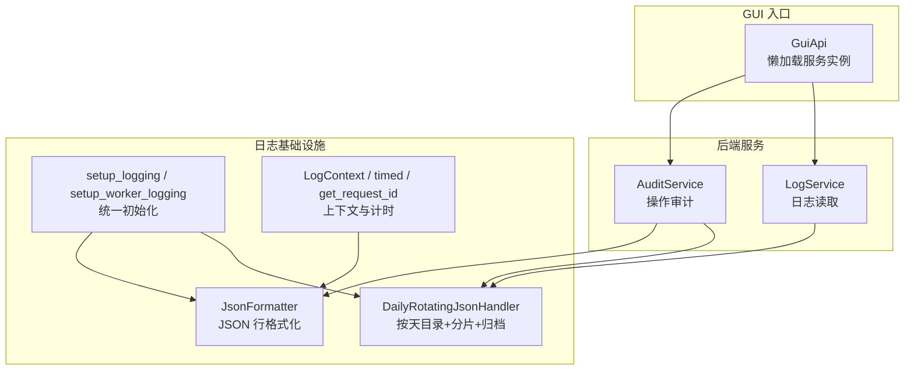
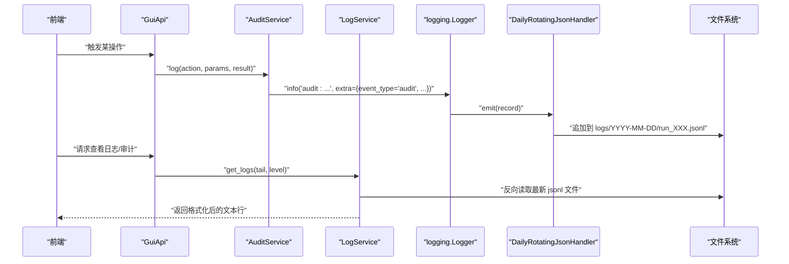
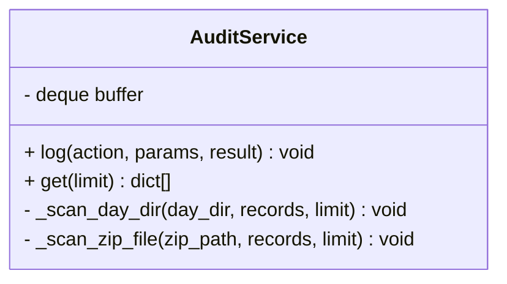
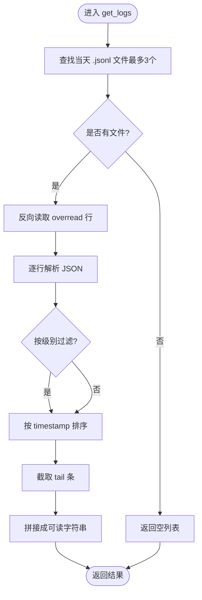
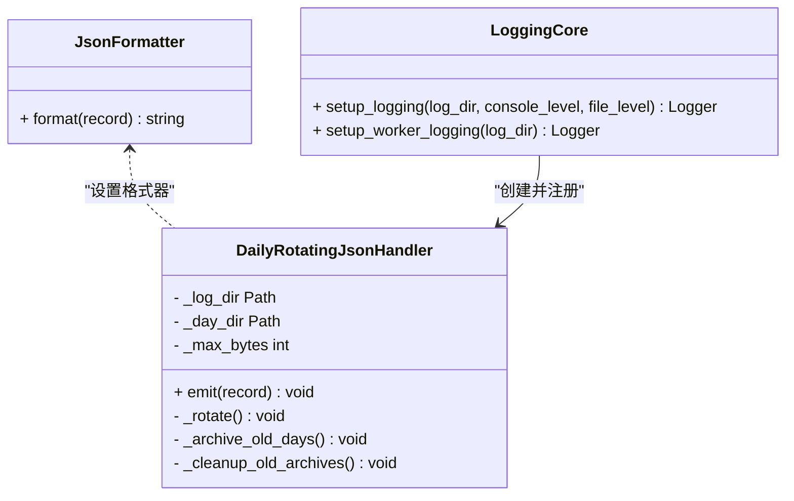
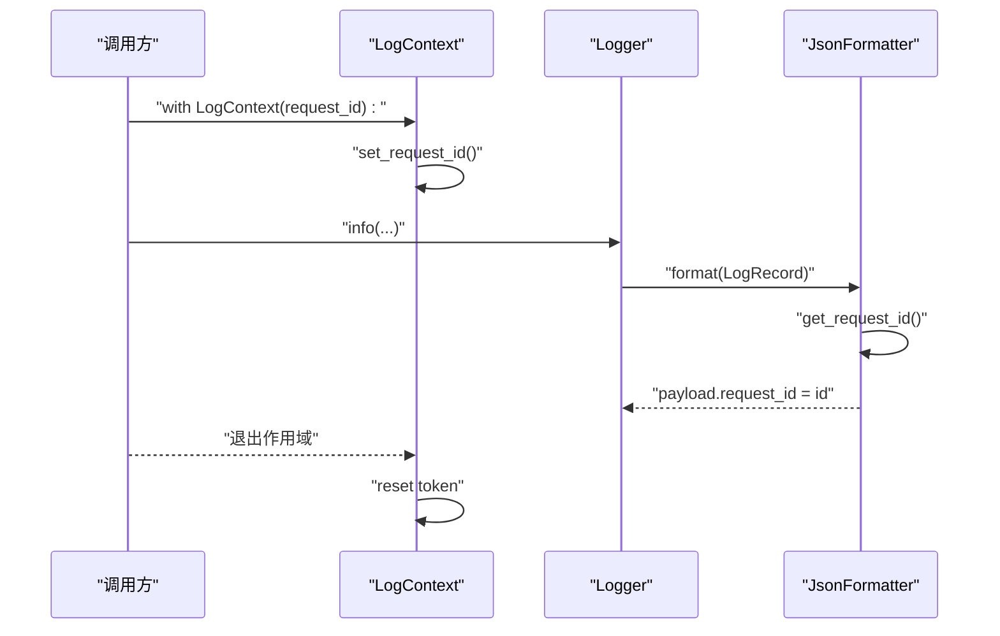
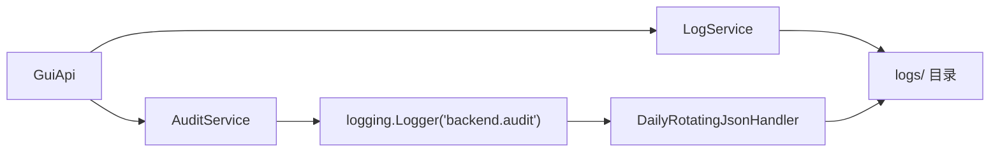

# 审计日志服务

<cite>
**本文引用的文件**
- [audit_service.py](file://backend/services/audit_service.py)
- [log_service.py](file://backend/services/log_service.py)
- [core.py](file://trace_pipeline/logging/core.py)
- [context.py](file://trace_pipeline/logging/context.py)
- [gui_api.py](file://backend/gui_api.py)
- [test_audit_service.py](file://tests/test_audit_service.py)
- [test_logging.py](file://tests/test_logging.py)
</cite>

## 目录
1. [简介](#简介)
2. [项目结构](#项目结构)
3. [核心组件](#核心组件)
4. [架构总览](#架构总览)
5. [详细组件分析](#详细组件分析)
6. [依赖关系分析](#依赖关系分析)
7. [性能考虑](#性能考虑)
8. [故障排查指南](#故障排查指南)
9. [结论](#结论)
10. [附录](#附录)

## 简介
本技术文档聚焦于 TracePipeline 的审计日志服务，围绕 AuditService 与 LogService 的设计模式、协作机制与数据流进行深入解析。内容涵盖：
- 操作审计与结构化日志记录
- JSON Lines 格式、日志轮转与归档策略
- 日志级别管理、过滤机制与性能影响控制
- 与 logging 模块集成及上下文信息传递（如 request_id）
- 查询接口与聚合能力
- 自定义审计规则、日志分析与故障排查最佳实践

## 项目结构
审计日志相关代码主要分布在以下位置：
- 后端服务层：AuditService、LogService
- 日志基础设施：JsonFormatter、DailyRotatingJsonHandler、setup_logging、上下文工具
- GUI API 入口：GuiApi 中按需懒加载并调用上述服务
- 测试用例：覆盖审计服务边界条件与日志格式化行为

图表来源
- [audit_service.py:22-155](file://backend/services/audit_service.py#L22-L155)
- [log_service.py:57-142](file://backend/services/log_service.py#L57-L142)
- [core.py:44-146](file://trace_pipeline/logging/core.py#L44-L146)
- [core.py:148-305](file://trace_pipeline/logging/core.py#L148-L305)
- [core.py:326-398](file://trace_pipeline/logging/core.py#L326-L398)
- [context.py:27-56](file://trace_pipeline/logging/context.py#L27-L56)
- [gui_api.py:52-78](file://backend/gui_api.py#L52-L78)

章节来源
- [audit_service.py:1-155](file://backend/services/audit_service.py#L1-L155)
- [log_service.py:1-142](file://backend/services/log_service.py#L1-L142)
- [core.py:1-450](file://trace_pipeline/logging/core.py#L1-L450)
- [context.py:1-144](file://trace_pipeline/logging/context.py#L1-L144)
- [gui_api.py:1-200](file://backend/gui_api.py#L1-L200)

## 核心组件
- AuditService：负责将用户操作以“event_type=audit”的结构化事件写入统一日志流，并提供内存缓冲与文件回退的最近 N 条查询接口。
- LogService：提供对 logs/ 目录下 JSON Lines 日志的高效读取与格式化输出，支持按级别过滤与尾部快速读取。
- JsonFormatter：将 Python logging.LogRecord 序列化为单行 JSON，包含时间戳、级别、模块、函数名、行号、消息、request_id、异常信息与扩展字段，并对非标准数值进行清洗。
- DailyRotatingJsonHandler：按天创建目录存储 JSON Lines，支持同目录内按大小分片、跨天打包为 zip 并清理过期归档；主进程执行归档以避免多进程竞态。
- setup_logging/setup_worker_logging：幂等初始化统一日志系统，合并 backend 到 trace_pipeline 命名空间，确保共享同一份 run_*.jsonl 输出。
- LogContext/timed/get_request_id：在请求作用域内传播 request_id，并提供计时装饰器/上下文管理器，自动注入 duration_ms 等指标。

章节来源
- [audit_service.py:22-155](file://backend/services/audit_service.py#L22-L155)
- [log_service.py:57-142](file://backend/services/log_service.py#L57-L142)
- [core.py:44-146](file://trace_pipeline/logging/core.py#L44-L146)
- [core.py:148-305](file://trace_pipeline/logging/core.py#L148-L305)
- [core.py:326-398](file://trace_pipeline/logging/core.py#L326-L398)
- [context.py:27-56](file://trace_pipeline/logging/context.py#L27-L56)

## 架构总览
下图展示了从 GUI 入口到日志落盘与读取的整体流程，以及审计事件如何融入统一日志流。

图表来源
- [gui_api.py:52-78](file://backend/gui_api.py#L52-L78)
- [audit_service.py:28-47](file://backend/services/audit_service.py#L28-L47)
- [core.py:326-398](file://trace_pipeline/logging/core.py#L326-L398)
- [core.py:148-305](file://trace_pipeline/logging/core.py#L148-L305)
- [log_service.py:78-142](file://backend/services/log_service.py#L78-L142)

## 详细组件分析

### AuditService 分析
- 设计要点
  - 通过 logging.getLogger("backend.audit") 输出，使用 extra 携带 event_type="audit"、action、params、result 等字段，从而与统一日志流融合。
  - 内存环形缓冲（deque，最大长度 200）用于快速返回最近审计记录；当缓冲为空时回退到扫描当天目录与 zip 归档中的 .jsonl 文件。
  - 查询接口 get(limit) 限制范围在 [1, 500]，避免过大扫描；支持从 zip 归档中安全读取（跳过超大成员）。
- 数据结构与复杂度
  - 内存缓冲 O(1) 插入与切片；文件扫描为顺序 I/O，受 limit 约束，整体近似 O(N) 但被 limit 截断。
- 错误处理
  - 对 JSON 解析失败、OSError、zip 损坏等情况进行静默容错，保证稳定性。
- 性能影响
  - 写路径仅一次 logger.info 与一次 appendleft，开销极低；读路径仅在缓冲为空时触发磁盘扫描。

图表来源
- [audit_service.py:22-155](file://backend/services/audit_service.py#L22-L155)

章节来源
- [audit_service.py:22-155](file://backend/services/audit_service.py#L22-L155)
- [test_audit_service.py:12-128](file://tests/test_audit_service.py#L12-L128)

### LogService 分析
- 设计要点
  - 定位当天 logs/YYYY-MM-DD 目录下的 .jsonl 文件，按修改时间降序取最多 3 个文件，避免全量扫描。
  - 采用高效 tail 实现：从文件末尾反向读取，限制缓冲区上限，防止大文件导致内存膨胀。
  - 解析 JSON 行后按 timestamp 排序，支持按日志级别过滤（DEBUG/INFO/WARNING/WARN/ERROR/CRITICAL），最后截取 tail 条数并以人类可读格式输出。
- 数据结构与复杂度
  - 反向读取 O(K)（K 为 overread 行数），排序 O(M log M)，最终截取 O(tail)。
- 错误处理
  - 对 JSON 解析失败、OSError 进行捕获与警告，保障健壮性。
- 性能影响
  - 通过限制文件数量、文件大小阈值与 overread 倍数，显著降低 I/O 与 CPU 开销。

图表来源
- [log_service.py:78-142](file://backend/services/log_service.py#L78-L142)

章节来源
- [log_service.py:57-142](file://backend/services/log_service.py#L57-L142)

### 日志基础设施（JsonFormatter、DailyRotatingJsonHandler、setup_logging）
- JsonFormatter
  - 输出字段包括 timestamp、level、logger、module、funcName、lineno、message、request_id、exc_info、extra。
  - 对浮点数进行清洗，去除 NaN/Inf，保证标准 JSON 可序列化。
- DailyRotatingJsonHandler
  - 按天目录存放 run_XXX.jsonl，超过大小阈值时分片为 run_XXX_part_N.jsonl。
  - 非当天日期目录打包为 zip 并删除原目录；仅主进程执行归档，避免多进程竞态。
  - 清理超过保留期限的 zip 归档。
- setup_logging
  - 幂等初始化，为主进程添加 ConsoleHandler 与 DailyRotatingJsonHandler。
  - 将 backend 命名空间合并到 trace_pipeline，使其共享同一份 JSON 日志输出。

图表来源
- [core.py:44-146](file://trace_pipeline/logging/core.py#L44-L146)
- [core.py:148-305](file://trace_pipeline/logging/core.py#L148-L305)
- [core.py:326-398](file://trace_pipeline/logging/core.py#L326-L398)

章节来源
- [core.py:44-146](file://trace_pipeline/logging/core.py#L44-L146)
- [core.py:148-305](file://trace_pipeline/logging/core.py#L148-L305)
- [core.py:326-398](file://trace_pipeline/logging/core.py#L326-L398)
- [test_logging.py:9-30](file://tests/test_logging.py#L9-L30)

### 上下文与计时（LogContext、timed、get_request_id）
- LogContext：在 with 作用域内绑定 request_id，自动传播至所有子级 logger 输出。
- timed/timed_ctx：作为装饰器或上下文管理器，记录耗时与异常信息，并在 extra 中注入 duration_ms。
- get_request_id：供 JsonFormatter 读取并写入 payload.request_id。

图表来源
- [context.py:27-56](file://trace_pipeline/logging/context.py#L27-L56)
- [context.py:83-133](file://trace_pipeline/logging/context.py#L83-L133)
- [core.py:60-78](file://trace_pipeline/logging/core.py#L60-L78)

章节来源
- [context.py:17-56](file://trace_pipeline/logging/context.py#L17-L56)
- [context.py:83-133](file://trace_pipeline/logging/context.py#L83-L133)
- [core.py:60-78](file://trace_pipeline/logging/core.py#L60-L78)

## 依赖关系分析
- GuiApi 懒加载 AuditService 与 LogService，并在需要时调用其方法。
- AuditService 依赖 logging 与文件系统（logs 目录与 zip 归档）。
- LogService 依赖文件系统与 JSON 解析。
- 日志基础设施由 setup_logging 统一管理，确保 backend 与 trace_pipeline 共用同一套 Handler。

图表来源
- [gui_api.py:52-78](file://backend/gui_api.py#L52-L78)
- [audit_service.py:18-47](file://backend/services/audit_service.py#L18-L47)
- [core.py:326-398](file://trace_pipeline/logging/core.py#L326-L398)

章节来源
- [gui_api.py:52-78](file://backend/gui_api.py#L52-L78)
- [audit_service.py:18-47](file://backend/services/audit_service.py#L18-L47)
- [core.py:326-398](file://trace_pipeline/logging/core.py#L326-L398)

## 性能考虑
- 写路径优化
  - AuditService.log 仅进行一次 logger.info 与一次 appendleft，内存缓冲限长避免无限增长。
  - DailyRotatingJsonHandler 在 emit 时加锁检查文件大小，避免频繁重命名与 I/O。
- 读路径优化
  - LogService.get_logs 仅读取当天目录的最新若干文件，且使用反向读取减少 I/O。
  - 限制最大读取文件数与文件大小阈值，避免大文件导致的性能抖动。
- 归档与清理
  - 仅主进程执行归档与清理，避免多进程竞态；zip 成员大小限制保护内存。
- 级别过滤
  - 在内存中对 records 进行级别过滤，减少后续处理成本。

[本节为通用性能建议，不直接分析具体文件]

## 故障排查指南
- 审计记录未出现在 get() 结果
  - 检查内存缓冲是否为空；若为空，确认 logs/YYYY-MM-DD 是否存在 .jsonl 文件或对应日期的 zip 归档。
  - 确认 event_type 是否为 "audit" 或 extra.event_type 是否为 "audit"。
- 日志文件过大被跳过
  - LogService 会跳过超过阈值的文件；检查日志文件大小与阈值配置。
- JSON 解析失败
  - 遇到非法 JSON 行会被忽略；检查日志写入是否完整，是否存在并发写入导致的截断。
- 归档失败或 zip 损坏
  - DailyRotatingJsonHandler 对归档失败进行警告；检查磁盘权限与空间，必要时手动清理损坏归档。
- 非标准数值导致序列化失败
  - JsonFormatter 已对 NaN/Inf 进行清洗；若仍出现异常，检查 extra 字段类型是否符合预期。

章节来源
- [audit_service.py:79-155](file://backend/services/audit_service.py#L79-L155)
- [log_service.py:78-142](file://backend/services/log_service.py#L78-L142)
- [core.py:148-305](file://trace_pipeline/logging/core.py#L148-L305)
- [core.py:125-146](file://trace_pipeline/logging/core.py#L125-L146)
- [test_logging.py:20-30](file://tests/test_logging.py#L20-L30)

## 结论
TracePipeline 的审计日志服务通过统一的 JSON Lines 日志流实现了操作审计与结构化日志记录的深度融合。AuditService 与 LogService 分别承担“写审计事件”和“读结构化日志”的职责，配合 JsonFormatter 与 DailyRotatingJsonHandler 完成高性能、可归档、可查询的日志体系。借助 LogContext 与 timed 工具，可在请求上下文中传播追踪标识并记录耗时，便于问题定位与性能分析。

[本节为总结性内容，不直接分析具体文件]

## 附录

### 审计日志记录格式
- 顶层字段
  - timestamp：ISO 8601 带时区时间戳
  - level：日志级别名称
  - logger：logger 名称
  - module：模块名
  - funcName：函数名
  - lineno：行号
  - message：日志消息
  - request_id：当前请求 ID（如有）
  - exc_info：异常堆栈（如有）
  - extra：扩展字段（包含 event_type、action、params、result 等）
- 审计事件关键字段
  - extra.event_type = "audit"
  - extra.action：操作名称
  - extra.params：参数对象
  - extra.result：结果描述

章节来源
- [core.py:60-122](file://trace_pipeline/logging/core.py#L60-L122)
- [audit_service.py:28-47](file://backend/services/audit_service.py#L28-L47)

### 存储策略与日志轮转
- 目录结构
  - logs/YYYY-MM-DD/run_XXX.jsonl（当天活跃文件）
  - logs/YYYY-MM-DD.zip（历史归档）
- 轮转与分片
  - 单文件超过阈值时在同目录内分片为 run_XXX_part_N.jsonl
  - 非当天目录打包为 zip 并删除原目录
- 归档保留期
  - 清理超过保留期限的 zip 归档

章节来源
- [core.py:148-305](file://trace_pipeline/logging/core.py#L148-L305)

### 查询接口与过滤机制
- AuditService.get(limit)
  - 优先返回内存缓冲最近记录；缓冲为空则扫描当天目录与 zip 归档
  - limit 范围限制在 [1, 500]
- LogService.get_logs(tail, level)
  - 读取当天最新若干 .jsonl 文件，反向读取并解析
  - 支持按级别过滤（DEBUG/INFO/WARNING/WARN/ERROR/CRITICAL）
  - 返回格式化后的文本行

章节来源
- [audit_service.py:49-77](file://backend/services/audit_service.py#L49-L77)
- [log_service.py:78-142](file://backend/services/log_service.py#L78-L142)

### 与 logging 模块集成与上下文传递
- setup_logging 将 backend 与 trace_pipeline 合并，共享同一套 Handler
- LogContext 在作用域内设置 request_id，JsonFormatter 自动提取并写入 payload
- timed/timed_ctx 在额外字段中注入 duration_ms，便于性能分析

章节来源
- [core.py:326-398](file://trace_pipeline/logging/core.py#L326-L398)
- [context.py:27-56](file://trace_pipeline/logging/context.py#L27-L56)
- [context.py:83-133](file://trace_pipeline/logging/context.py#L83-L133)

### 自定义审计规则与最佳实践
- 自定义审计规则
  - 在业务逻辑关键路径调用 AuditService.log(action, params, result)，确保 action 语义清晰、params 精简、result 明确
  - 结合 LogContext 包裹请求作用域，使审计事件携带 request_id
- 日志分析
  - 使用 LogService.get_logs(level="INFO") 获取近期日志，结合外部工具（如 jq、ELK）进行聚合分析
  - 针对审计事件，筛选 extra.event_type="audit" 的记录，统计 action 分布与耗时
- 故障排查
  - 关注日志中的 exc_info 与 extra.error 字段，快速定位异常
  - 检查归档 zip 完整性，必要时手动解压分析

章节来源
- [audit_service.py:28-47](file://backend/services/audit_service.py#L28-L47)
- [context.py:27-56](file://trace_pipeline/logging/context.py#L27-L56)
- [log_service.py:78-142](file://backend/services/log_service.py#L78-L142)