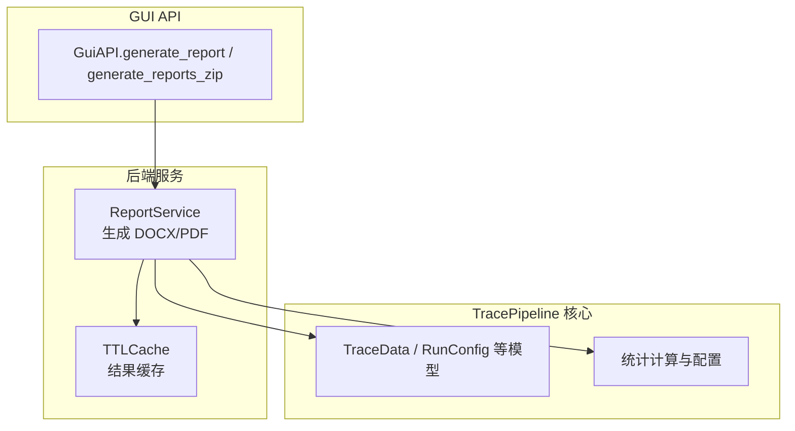
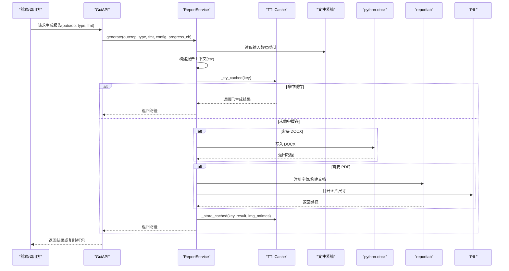
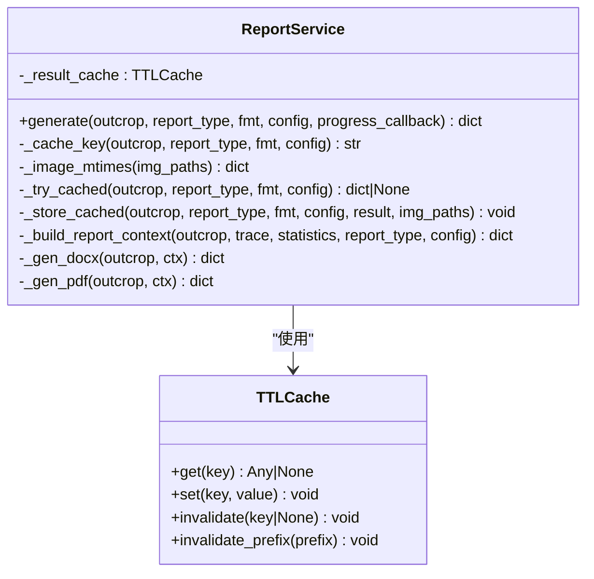
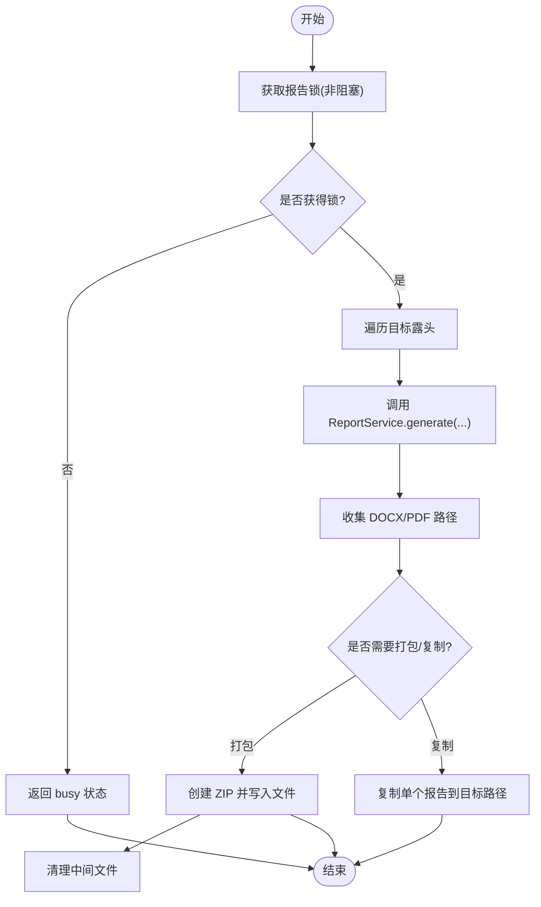
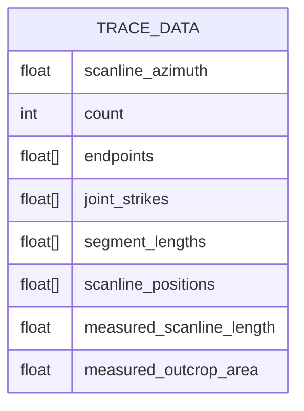
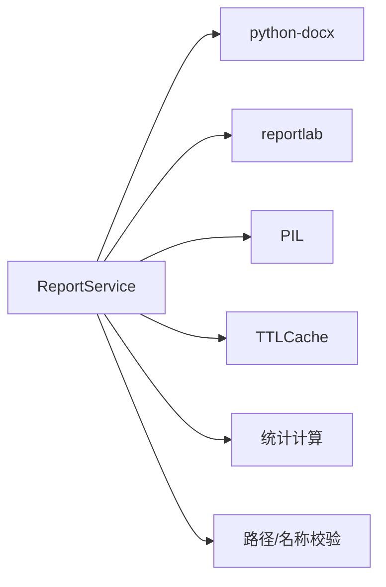

# 报告服务

<cite>
**本文引用的文件**   
- [report_service.py](file://backend/services/report_service.py)
- [cache.py](file://backend/utils/cache.py)
- [gui_api.py](file://backend/gui_api.py)
- [models.py](file://trace_pipeline/models.py)
- [test_report_service.py](file://tests/test_report_service.py)
</cite>

## 目录
1. [简介](#简介)
2. [项目结构](#项目结构)
3. [核心组件](#核心组件)
4. [架构总览](#架构总览)
5. [详细组件分析](#详细组件分析)
6. [依赖关系分析](#依赖关系分析)
7. [性能与缓存](#性能与缓存)
8. [故障排查指南](#故障排查指南)
9. [结论](#结论)
10. [附录：使用示例与最佳实践](#附录使用示例与最佳实践)

## 简介
本技术文档聚焦于 TracePipeline 的报告服务，围绕 ReportService 类的报告生成功能展开，重点解释 Word（DOCX）与 PDF 报告的自动化创建流程。文档将深入剖析 generate() 方法的实现逻辑，包括数据加载、统计计算、上下文构建、模板填充、图表嵌入与格式化处理；阐述字体注册与中英文混排策略、多格式输出支持、进度回调机制、错误处理与资源管理；并提供基于现有代码的扩展建议与最佳实践。

## 项目结构
与报告服务直接相关的后端模块位于 backend/services 与 backend/utils，GUI API 层在 backend/gui_api.py 中调用报告服务并负责并发控制、进度队列与打包导出。TracePipeline 的数据模型与统计计算由 trace_pipeline 提供。

**图示来源** 
- [report_service.py:183-364](file://backend/services/report_service.py#L183-L364)
- [cache.py:18-90](file://backend/utils/cache.py#L18-L90)
- [gui_api.py:690-853](file://backend/gui_api.py#L690-L853)
- [models.py:41-120](file://trace_pipeline/models.py#L41-L120)

**章节来源**
- [report_service.py:183-364](file://backend/services/report_service.py#L183-L364)
- [cache.py:18-90](file://backend/utils/cache.py#L18-L90)
- [gui_api.py:690-853](file://backend/gui_api.py#L690-L853)
- [models.py:41-120](file://trace_pipeline/models.py#L41-L120)

## 核心组件
- ReportService：封装报告生成的完整生命周期，包含数据加载、统计计算、上下文构建、DOCX/PDF 渲染、缓存与日志记录。
- TTLCache：线程安全的 TTL + LRU 缓存，用于避免重复生成相同配置的 report 产物。
- GUI API 集成：提供并发锁、进度队列、路径安全校验、ZIP 打包与复制导出能力。

关键职责划分：
- 数据与统计：从输入目录加载迹线数据，计算统计指标，形成报告上下文。
- 渲染器：分别实现 DOCX 与 PDF 渲染，统一复用上下文。
- 缓存：按出露标识、报告类型、格式与关键配置项生成稳定键，结合图片修改时间失效策略。
- 进度与错误：通过回调上报阶段信息，异常时返回结构化错误对象。

**章节来源**
- [report_service.py:183-364](file://backend/services/report_service.py#L183-L364)
- [cache.py:18-90](file://backend/utils/cache.py#L18-L90)
- [gui_api.py:690-853](file://backend/gui_api.py#L690-L853)

## 架构总览
下图展示了从 GUI API 到 ReportService 再到外部库（python-docx、reportlab、PIL）的整体交互流程，以及缓存与日志的作用点。

**图示来源** 
- [gui_api.py:690-853](file://backend/gui_api.py#L690-L853)
- [report_service.py:245-364](file://backend/services/report_service.py#L245-L364)
- [cache.py:18-90](file://backend/utils/cache.py#L18-L90)

## 详细组件分析

### ReportService 类
- 初始化与缓存
  - 使用 TTLCache 维护最近生成的报告结果，默认 TTL 与最大条目数可配置。
  - 缓存键由 outcrop、report_type、fmt 与关键配置子集组成，采用稳定哈希避免进程重启导致缓存失效。
  - 图片失效策略：记录引用图片的 mtime，若任一图片被修改或删除则使缓存失效。

- generate() 主流程
  - 参数校验与日志记录。
  - 创建 reports 目录。
  - 加载迹线数据与计算统计量，触发进度回调 loading/stats。
  - 构建报告上下文 ctx（标题、统计行列表、图片路径）。
  - 尝试缓存命中，命中则直接返回并回调 done。
  - 根据 fmt 选择生成 DOCX 和/或 PDF，分别调用内部渲染方法，失败时记录 docx_error/pdf_error。
  - 存储缓存并回调 done，记录耗时。

- 上下文构建 _build_report_context()
  - 当 report_type 为 full 或 stats 时，组装统计文本行（露头标识、测线走向、迹线条数、平均迹长、密度 P10/P20/P21、测线长度、露头面积及来源、圆窗策略、I/II/III 型计数、警告信息等）。
  - 当 report_type 为 full 或 plots 时，收集输出目录下的原始图、旋转图与玫瑰图（文件名含 outcrop 与 rose_bin_width），仅保留存在的图片路径。

- DOCX 渲染 _gen_docx()
  - 动态设置样式字体：西文 Times New Roman，中文 SimSun/SimHei。
  - 插入居中标题与统计段落，按顺序插入图片，固定宽度。
  - 保存至 reports/{outcrop}_report.docx。

- PDF 渲染 _gen_pdf()
  - 跨平台字体探测与注册：拉丁字体优先 Times New Roman，CJK 正文与标题字体依次尝试系统字体与用户字体，回退到 STSong-Light 兜底。
  - 中英文混排：逐字符判断是否为 CJK，拆分段落并使用不同 font name 包裹，确保正确显示。
  - 构建文档故事流：标题、统计行、图片（按原宽高比缩放，最大宽度限制），最后 build 输出 PDF。

- 字体与混排辅助函数
  - _font_candidates(kind): 按 latin/body/heading 三类候选字体集合，覆盖 Windows/macOS/Linux 常见路径。
  - _register_pdf_font(pdfmetrics, ttfont_cls, font_name, candidates, fallback): 尝试注册 TTFont，失败记录警告并返回 fallback。
  - _pdf_mixed_font_markup(text, cjk_font, latin_font): 将文本拆分为多个  片段，并对内容进行 HTML 转义。
  - _find_system_font(): 跨平台查找可用 CJK 字体，必要时回退 matplotlib 字体管理器或系统 sans-serif。

**图示来源** 
- [report_service.py:183-579](file://backend/services/report_service.py#L183-L579)
- [cache.py:18-90](file://backend/utils/cache.py#L18-L90)

**章节来源**
- [report_service.py:183-579](file://backend/services/report_service.py#L183-L579)

### GUI API 集成与并发控制
- generate_report()
  - 调用 ReportService.generate()，可选将生成的报告复制到用户指定路径（安全校验）。
  - 捕获异常并推送 error 进度消息。
- generate_reports_zip()
  - 批量生成报告，使用同一锁避免并发写入同名中间产物。
  - 聚合所有生成的 DOCX/PDF 文件，打包为 ZIP，清理中间文件。
  - 通过进度队列推送 zip 阶段与完成状态。

**图示来源** 
- [gui_api.py:690-853](file://backend/gui_api.py#L690-L853)

**章节来源**
- [gui_api.py:690-853](file://backend/gui_api.py#L690-L853)

### 数据模型与统计
- TraceData：不可变数据容器，包含测线走向、端点坐标、节理走向、段长、位置、实测长度与面积等字段，并提供派生属性如 lengths、mean_length。
- 统计配置与计算：ReportService 使用 TraceStatisticsConfig 与 compute_trace_statistics 生成统计对象，供上下文构建使用。

**图示来源** 
- [models.py:41-120](file://trace_pipeline/models.py#L41-L120)

**章节来源**
- [models.py:41-120](file://trace_pipeline/models.py#L41-L120)

## 依赖关系分析
- 外部库
  - python-docx：用于 DOCX 文档创建与样式设置。
  - reportlab：用于 PDF 文档构建、字体注册与段落排版。
  - PIL (Pillow)：用于读取图片尺寸以适配 PDF 布局。
- 内部依赖
  - TTLCache：线程安全缓存，避免重复生成。
  - 路径与安全工具：validate_outcrop_name、safe_known_path 等用于输入校验与路径安全。
  - 统计模块：compute_trace_statistics 与 TraceStatisticsConfig。

**图示来源** 
- [report_service.py:183-579](file://backend/services/report_service.py#L183-L579)
- [cache.py:18-90](file://backend/utils/cache.py#L18-L90)

**章节来源**
- [report_service.py:183-579](file://backend/services/report_service.py#L183-L579)
- [cache.py:18-90](file://backend/utils/cache.py#L18-L90)

## 性能与缓存
- 缓存键稳定性：使用 sha256 对关键配置子集进行稳定哈希，避免 PYTHONHASHSEED 随机化导致的缓存失效。
- 图片失效检测：记录引用图片的 mtime，任何变更都会使缓存失效，保证报告与最新图片一致。
- 批量驱逐与 LRU：TTLCache 每 N 次 set 进行一次过期扫描与容量裁剪，降低频繁全量扫描开销。
- 进度回调：loading/stats/docx/pdf/done 五个阶段，便于前端展示实时进度。

**章节来源**
- [report_service.py:190-244](file://backend/services/report_service.py#L190-L244)
- [cache.py:18-90](file://backend/utils/cache.py#L18-L90)

## 故障排查指南
- 依赖缺失
  - python-docx 未安装：DOCX 生成会返回错误提示。
  - reportlab 未安装：PDF 生成会返回错误提示。
- 字体问题
  - 若系统缺少 CJK 字体，PDF 生成会尝试多种候选与回退策略；仍失败时将记录警告并可能影响中文显示。
- 图片缺失或损坏
  - 若报告引用的图片不存在或无法打开，PDF 渲染会跳过该图片并记录警告；DOCX 渲染会在插入图片时抛出异常并被捕获。
- 路径越权
  - GUI API 会对保存路径与源文件路径进行安全校验，越权路径将被拒绝。
- 并发冲突
  - 批量生成时使用锁避免并发写入同名中间产物；若锁获取失败，返回 busy 状态。

**章节来源**
- [report_service.py:416-579](file://backend/services/report_service.py#L416-L579)
- [gui_api.py:690-853](file://backend/gui_api.py#L690-L853)

## 结论
ReportService 提供了稳健的 Word 与 PDF 报告生成能力，具备跨平台字体支持、中英文混排、图片自适应缩放、缓存加速与完善的进度回调与错误处理。其设计将数据加载、统计计算与渲染解耦，通过统一的上下文对象减少重复逻辑，并通过 TTLCache 提升性能。GUI API 层在此基础上实现了并发控制、路径安全与批量打包导出，适合在生产环境中稳定运行。

## 附录：使用示例与最佳实践

### 基本用法（单报告）
- 调用方式
  - 通过 GuiAPI.generate_report(outcrop, report_type, fmt, save_path=None) 生成报告。
  - fmt 可为 "docx"、"pdf" 或 "both"。
- 进度回调
  - 在 GUI 层通过进度队列接收 step 为 loading/stats/docx/pdf/done 的消息。
- 返回值
  - 成功时返回包含 docx/pdf 路径的对象；失败时返回 {"error": "..."}。

参考路径
- [gui_api.py:690-730](file://backend/gui_api.py#L690-L730)
- [report_service.py:245-364](file://backend/services/report_service.py#L245-L364)

### 批量报告与打包
- 调用方式
  - 使用 GuiAPI.generate_reports_zip(targets, report_type, fmt, save_path=None)。
- 行为
  - 逐个生成报告，收集所有 DOCX/PDF 文件，打包为 ZIP，并清理中间文件。
- 并发控制
  - 使用锁避免并发写入同名中间产物。

参考路径
- [gui_api.py:732-853](file://backend/gui_api.py#L732-L853)

### 自定义报告模板与占位符替换
- 现状说明
  - 当前实现不依赖外部模板引擎，而是直接在渲染器中构造内容（标题、统计行、图片）。
  - 如需引入模板系统，可在 _build_report_context 中扩展更多字段，并在 _gen_docx/_gen_pdf 中按字段渲染。
- 建议方案
  - 在 ctx 中增加模板变量字典，例如 title、sections、charts、tables 等。
  - 在 DOCX 渲染中使用 python-docx 的段落/表格 API 插入动态内容。
  - 在 PDF 渲染中使用 reportlab 的 Paragraph/Table/Image 组合渲染。

参考路径
- [report_service.py:367-414](file://backend/services/report_service.py#L367-L414)
- [report_service.py:416-579](file://backend/services/report_service.py#L416-L579)

### 高级格式化技巧
- 字体与混排
  - 使用 _pdf_mixed_font_markup 自动拆分中英文片段，确保 PDF 中正确显示。
  - 通过 _register_pdf_font 与 _font_candidates 灵活调整字体优先级与回退策略。
- 图片缩放
  - PDF 中按原宽高比缩放，限制最大宽度，避免溢出页面。
- 样式定制
  - DOCX 中可通过设置样式字体与大小，统一文档风格。

参考路径
- [report_service.py:76-108](file://backend/services/report_service.py#L76-L108)
- [report_service.py:416-479](file://backend/services/report_service.py#L416-L479)
- [report_service.py:481-579](file://backend/services/report_service.py#L481-L579)

### 单元测试要点
- 缓存键幂等性与区分度：相同参数产生相同键，不同 outcrop/format/type 产生不同键。
- 无关配置键不影响缓存键。
- 图片 mtime 容错：缺失文件返回 0.0，存在文件返回正数。

参考路径
- [test_report_service.py:1-78](file://tests/test_report_service.py#L1-L78)