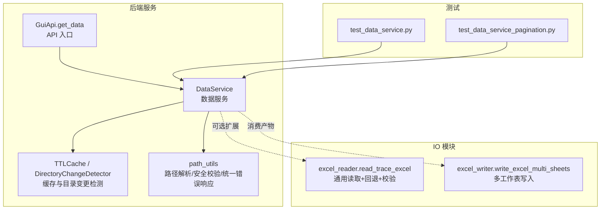
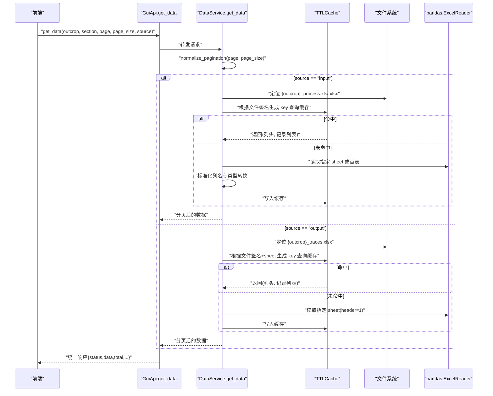
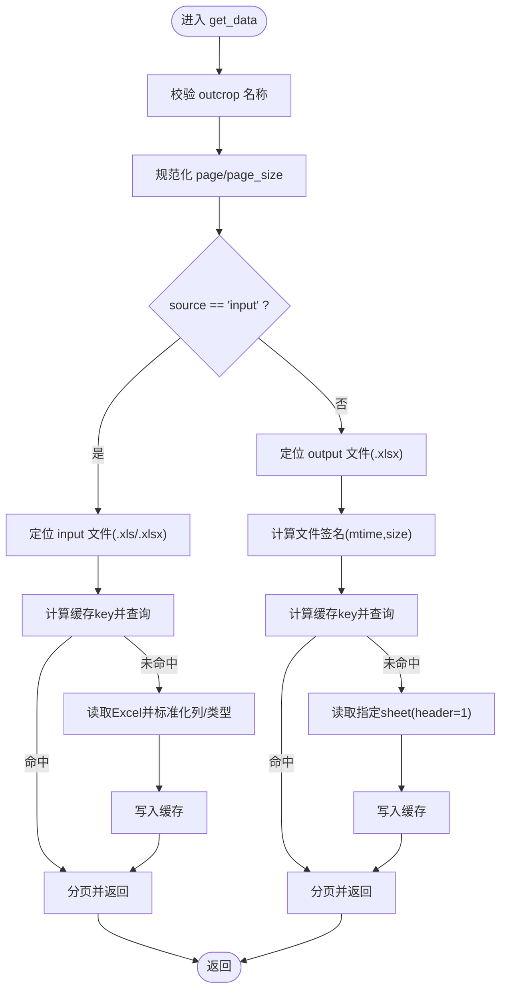
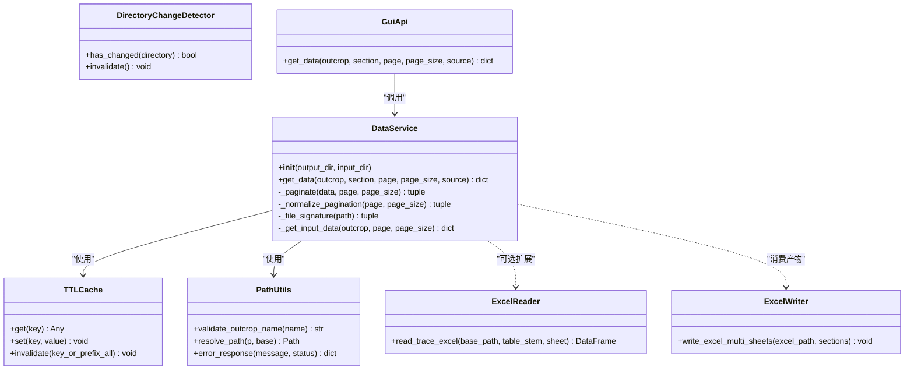

# 数据服务

<cite>
**本文引用的文件**   
- [backend/services/data_service.py](file://backend/services/data_service.py)
- [backend/utils/cache.py](file://backend/utils/cache.py)
- [backend/utils/path_utils.py](file://backend/utils/path_utils.py)
- [trace_pipeline/io/excel_reader.py](file://trace_pipeline/io/excel_reader.py)
- [trace_pipeline/io/excel_writer.py](file://trace_pipeline/io/excel_writer.py)
- [backend/gui_api.py](file://backend/gui_api.py)
- [tests/test_data_service.py](file://tests/test_data_service.py)
- [tests/test_data_service_pagination.py](file://tests/test_data_service_pagination.py)
</cite>

## 目录
1. [简介](#简介)
2. [项目结构](#项目结构)
3. [核心组件](#核心组件)
4. [架构总览](#架构总览)
5. [详细组件分析](#详细组件分析)
6. [依赖关系分析](#依赖关系分析)
7. [性能与内存优化](#性能与内存优化)
8. [故障排查指南](#故障排查指南)
9. [结论](#结论)
10. [附录：API 与示例](#附录api-与示例)

## 简介
本技术文档聚焦于 TracePipeline 的数据服务层，围绕 DataService 类展开，系统性阐述其数据访问层设计、Excel 读取与解析、分页查询、缓存机制、目录变更检测、数据模型映射与字段校验、错误处理以及与 io 模块的集成方式。文档同时提供大数据集处理、内存优化与查询性能调优的实践建议，并给出面向前端 API 的使用说明与示例路径。

## 项目结构
数据服务位于后端服务层，主要涉及以下文件：
- 数据服务实现：backend/services/data_service.py
- 缓存与目录变更检测：backend/utils/cache.py
- 路径与安全校验工具：backend/utils/path_utils.py
- Excel 读取（通用）：trace_pipeline/io/excel_reader.py
- Excel 写入（多工作表输出）：trace_pipeline/io/excel_writer.py
- GUI API 入口（调用数据服务）：backend/gui_api.py
- 单元测试：tests/test_data_service.py、tests/test_data_service_pagination.py

图表来源
- [backend/services/data_service.py:44-188](file://backend/services/data_service.py#L44-L188)
- [backend/utils/cache.py:18-90](file://backend/utils/cache.py#L18-L90)
- [backend/utils/path_utils.py:20-67](file://backend/utils/path_utils.py#L20-L67)
- [trace_pipeline/io/excel_reader.py:36-106](file://trace_pipeline/io/excel_reader.py#L36-L106)
- [trace_pipeline/io/excel_writer.py:462-489](file://trace_pipeline/io/excel_writer.py#L462-L489)
- [backend/gui_api.py:555-599](file://backend/gui_api.py#L555-L599)
- [tests/test_data_service.py:9-34](file://tests/test_data_service.py#L9-L34)
- [tests/test_data_service_pagination.py:9-31](file://tests/test_data_service_pagination.py#L9-L31)

章节来源
- [backend/services/data_service.py:44-188](file://backend/services/data_service.py#L44-L188)
- [backend/utils/cache.py:18-90](file://backend/utils/cache.py#L18-L90)
- [backend/utils/path_utils.py:20-67](file://backend/utils/path_utils.py#L20-L67)
- [trace_pipeline/io/excel_reader.py:36-106](file://trace_pipeline/io/excel_reader.py#L36-L106)
- [trace_pipeline/io/excel_writer.py:462-489](file://trace_pipeline/io/excel_writer.py#L462-L489)
- [backend/gui_api.py:555-599](file://backend/gui_api.py#L555-L599)
- [tests/test_data_service.py:9-34](file://tests/test_data_service.py#L9-L34)
- [tests/test_data_service_pagination.py:9-31](file://tests/test_data_service_pagination.py#L9-L31)

## 核心组件
- DataService：对外暴露 get_data()，支持从 output 或 input 两个源读取 Excel，按分区（section）返回分页数据；内部使用 TTLCache 做结果缓存，并对输入参数进行规范化与安全检查。
- TTLCache：线程安全的 TTL + LRU 缓存，支持批量淘汰与键前缀失效。
- DirectoryChangeDetector：对目录内容建立浅层快照，检测外部变更以触发缓存失效。
- path_utils：统一的出参错误格式、路径解析与露头名白名单校验。
- excel_reader：通用的迹线 Excel 读取器，具备扩展名候选、工作表回退与基础格式校验。
- excel_writer：将分析结果写入多工作表 Excel，供 DataService 后续读取。

章节来源
- [backend/services/data_service.py:44-188](file://backend/services/data_service.py#L44-L188)
- [backend/utils/cache.py:18-90](file://backend/utils/cache.py#L18-L90)
- [backend/utils/path_utils.py:20-67](file://backend/utils/path_utils.py#L20-L67)
- [trace_pipeline/io/excel_reader.py:36-106](file://trace_pipeline/io/excel_reader.py#L36-L106)
- [trace_pipeline/io/excel_writer.py:462-489](file://trace_pipeline/io/excel_writer.py#L462-L489)

## 架构总览
下图展示了前端通过 GUI API 获取数据的端到端流程，以及 DataService 内部的缓存与 IO 交互。

图表来源
- [backend/gui_api.py:555-599](file://backend/gui_api.py#L555-L599)
- [backend/services/data_service.py:78-188](file://backend/services/data_service.py#L78-L188)
- [backend/utils/cache.py:40-63](file://backend/utils/cache.py#L40-L63)

## 详细组件分析

### DataService 类与 get_data() 逻辑
- 初始化
  - 解析并缓存 output_dir 与 input_dir 绝对路径。
  - 创建 TTLCache，默认 TTL 300s，最大条目数 64。
- 参数规范化
  - _normalize_pagination：page 强制 >= 1，page_size 限制在 [1, 500]。
- 源选择
  - source="input"：走 _get_input_data，读取 input/{outcrop}_process.xls/.xlsx。
  - source="output"（默认）：读取 output/{outcrop}_traces.xlsx 的多工作表结果。
- 输出分区映射
  - SECTION_MAP 将前端分区名映射到具体 sheet 名，如“走向与长度”→“走向与长度”。
- 缓存策略
  - 基于文件签名（mtime_ns + size）+ sheet 名构建 cache_key，避免重复 I/O。
  - 读入后转换为 (columns, records) 元组缓存，records 为字典列表。
- 分页
  - _paginate 按页切片，返回当前页数据与总条数。
- 错误处理
  - 非法露头名、文件不存在、工作表不存在等场景均返回统一错误响应。
  - MemoryError/KeyboardInterrupt/SystemExit 不吞没，向上传播。
- 日志
  - 关键路径与异常均附带 stage/outcrop/section/source/page 等上下文。

图表来源
- [backend/services/data_service.py:78-188](file://backend/services/data_service.py#L78-L188)
- [backend/services/data_service.py:190-266](file://backend/services/data_service.py#L190-L266)
- [backend/utils/cache.py:40-63](file://backend/utils/cache.py#L40-L63)

章节来源
- [backend/services/data_service.py:44-188](file://backend/services/data_service.py#L44-L188)
- [backend/services/data_service.py:190-266](file://backend/services/data_service.py#L190-L266)
- [backend/utils/cache.py:40-63](file://backend/utils/cache.py#L40-L63)

### 输入数据读取与字段映射（_get_input_data）
- 文件定位：优先 .xls，其次 .xlsx，缺失则返回错误。
- 缓存键：包含路径、outcrop、文件签名。
- 读取策略：
  - 尝试读取 sheet=outcrop，失败则回退首表。
  - header=None，随后按固定列头 INPUT_HEADERS 映射。
- 数据清洗：
  - 跳过全空行。
  - 数值型字段转为 float，非数值转字符串，空值转空串。
- 返回结构：与 output 一致，包含 columns、data、total 等。

章节来源
- [backend/services/data_service.py:190-266](file://backend/services/data_service.py#L190-L266)

### 输出数据读取与多工作表（output）
- 文件定位：output/{outcrop}_traces.xlsx。
- 工作表过滤：SECTION_MAP 将前端分区名映射到 sheet 名。
- 读取策略：header=1（第1行为标题行，第2行为列头）。
- 错误分支：
  - 若 sheet 不存在（旧格式单工作表），返回明确提示需重新处理。
  - 其他异常统一 error_response。
- 分页：直接对已缓存的 records 列表切片。

章节来源
- [backend/services/data_service.py:78-188](file://backend/services/data_service.py#L78-L188)

### 缓存与目录变更检测
- TTLCache
  - 线程安全，LRU 顺序维护最近使用。
  - 批量驱逐：每 N 次 set 触发一次过期清理与容量裁剪。
  - 支持 invalidate(key/prefix/all)。
- DirectoryChangeDetector
  - 对目录建立浅层快照（文件名、是否目录、大小、mtime_ns）。
  - 当文件数量超过阈值时记录总数作为截断信号，避免永远不变。
  - 用于上层服务在配置更新或外部变更后主动失效缓存。

章节来源
- [backend/utils/cache.py:18-90](file://backend/utils/cache.py#L18-L90)
- [backend/utils/cache.py:92-155](file://backend/utils/cache.py#L92-L155)

### 路径与安全校验
- validate_outcrop_name：白名单正则，禁止路径分隔符与“..”，防止路径遍历。
- resolve_path：相对路径基于 PROJECT_ROOT 解析为绝对路径。
- error_response：统一错误响应结构，便于前端统一处理。

章节来源
- [backend/utils/path_utils.py:20-67](file://backend/utils/path_utils.py#L20-L67)

### 与 io 模块的集成
- excel_reader.read_trace_excel
  - 候选扩展名（.xlsx/.xls）、引擎选择（openpyxl/xlrd）。
  - 工作表不存在时回退首表。
  - 文件大小上限检查与基本格式校验（最少列数、数值占比）。
- excel_writer.write_excel_multi_sheets
  - 将分析结果写入多工作表，每个分区一个 sheet，带标题与样式。
  - DataService 读取 output 多工作表结果，形成前后端一致的展示。

章节来源
- [trace_pipeline/io/excel_reader.py:36-106](file://trace_pipeline/io/excel_reader.py#L36-L106)
- [trace_pipeline/io/excel_writer.py:462-489](file://trace_pipeline/io/excel_writer.py#L462-L489)

### 数据模型映射与完整性保证
- 输入数据
  - 固定列头 INPUT_HEADERS，确保字段名稳定。
  - 数值型字段尽量转为 float，非数值保留字符串，空值转空串。
- 输出数据
  - 由 excel_writer 生成的多工作表，列名与布局规范，DataService 按 header=1 读取。
- 完整性
  - 输入为空表、sheet 不存在、文件过大等情况均有明确错误响应。
  - 关键异常（MemoryError/KeyboardInterrupt/SystemExit）不吞没，避免掩盖严重问题。

章节来源
- [backend/services/data_service.py:190-266](file://backend/services/data_service.py#L190-L266)
- [trace_pipeline/io/excel_writer.py:462-489](file://trace_pipeline/io/excel_writer.py#L462-L489)

### GUI API 集成
- GuiApi.get_data 作为前端可调用的方法，负责：
  - 懒加载 DataService。
  - 调用 DataService.get_data 并记录耗时与上下文日志。
  - 统一错误响应透传。

章节来源
- [backend/gui_api.py:555-599](file://backend/gui_api.py#L555-L599)

## 依赖关系分析

图表来源
- [backend/services/data_service.py:44-188](file://backend/services/data_service.py#L44-L188)
- [backend/utils/cache.py:18-90](file://backend/utils/cache.py#L18-L90)
- [backend/utils/path_utils.py:20-67](file://backend/utils/path_utils.py#L20-L67)
- [trace_pipeline/io/excel_reader.py:36-106](file://trace_pipeline/io/excel_reader.py#L36-L106)
- [trace_pipeline/io/excel_writer.py:462-489](file://trace_pipeline/io/excel_writer.py#L462-L489)
- [backend/gui_api.py:555-599](file://backend/gui_api.py#L555-L599)

章节来源
- [backend/services/data_service.py:44-188](file://backend/services/data_service.py#L44-L188)
- [backend/utils/cache.py:18-90](file://backend/utils/cache.py#L18-L90)
- [backend/utils/path_utils.py:20-67](file://backend/utils/path_utils.py#L20-L67)
- [trace_pipeline/io/excel_reader.py:36-106](file://trace_pipeline/io/excel_reader.py#L36-L106)
- [trace_pipeline/io/excel_writer.py:462-489](file://trace_pipeline/io/excel_writer.py#L462-L489)
- [backend/gui_api.py:555-599](file://backend/gui_api.py#L555-L599)

## 性能与内存优化
- 分页与缓存
  - 合理设置 page_size（默认 20，上限 500），避免单次传输过大。
  - 利用 TTLCache 减少重复 I/O，同一 sheet 多次翻页仅读取一次。
- 目录变更检测
  - 使用 DirectoryChangeDetector 在配置更新或外部变更后主动失效相关缓存，避免脏读。
- 大文件处理
  - 输入侧对超大文件有上限检查（io 模块），避免 pandas 加载导致 OOM。
  - 输出侧多工作表写入时控制列宽与样式，降低 openpyxl 渲染开销。
- 内存优化技巧
  - 优先使用 records 列表而非完整 DataFrame 长期驻留。
  - 对数值列进行类型转换，减少对象开销。
  - 结合 TTL 与 maxsize 控制缓存规模，避免无限增长。

[本节为通用指导，无需特定文件引用]

## 故障排查指南
- 常见错误与定位
  - 非法露头名：检查 outcrop 是否包含非法字符。
  - 文件不存在：确认 output/input 目录下对应文件名是否正确。
  - 工作表不存在：output 多工作表未生成或 sheet 名不一致，需重新处理。
  - 输入文件为空：检查原始输入表是否有有效数据。
- 日志关键字
  - stage=data_get/api_get_data，配合 outcrop/section/source/page 快速定位。
- 复现与验证
  - 参考单元测试用例，构造最小可复现场景，验证缓存命中与分页行为。

章节来源
- [backend/services/data_service.py:78-188](file://backend/services/data_service.py#L78-L188)
- [backend/gui_api.py:555-599](file://backend/gui_api.py#L555-L599)
- [tests/test_data_service.py:9-34](file://tests/test_data_service.py#L9-L34)
- [tests/test_data_service_pagination.py:9-31](file://tests/test_data_service_pagination.py#L9-L31)

## 结论
DataService 提供了稳定、可扩展且高性能的 Excel 数据访问能力，通过严格的参数校验、统一的错误响应、细粒度的缓存策略与目录变更检测，确保了在大体量数据场景下的可用性与性能。与 io 模块的良好解耦使得读取与写入职责清晰，便于后续扩展与维护。

[本节为总结性内容，无需特定文件引用]

## 附录：API 与示例

### API 定义（GUI API）
- 方法：GuiApi.get_data
- 参数：
  - outcrop: 露头标识符（字母、数字、下划线、连字符、中文）
  - section: 前端分区名（如“基本信息”、“走向与长度”等）
  - page: 页码（>=1）
  - page_size: 每页条数（1~500）
  - source: 数据源（"output" 或 "input"）
- 返回：
  - 成功：包含 outcrop、section、page、page_size、total、data、columns 的字典
  - 失败：包含 status、message、error 的统一错误响应

章节来源
- [backend/gui_api.py:555-599](file://backend/gui_api.py#L555-L599)

### 使用示例（路径引用）
- 输出数据分页读取与缓存复用
  - 参考：[tests/test_data_service.py:9-34](file://tests/test_data_service.py#L9-L34)
- 输入数据分页读取与缓存复用
  - 参考：[tests/test_data_service.py:36-64](file://tests/test_data_service.py#L36-L64)
- 分页参数规范化（page=0、负数、page_size 越界）
  - 参考：[tests/test_data_service_pagination.py:9-31](file://tests/test_data_service_pagination.py#L9-L31)
  - 参考：[tests/test_data_service_pagination.py:52-70](file://tests/test_data_service_pagination.py#L52-L70)
  - 参考：[tests/test_data_service_pagination.py:72-90](file://tests/test_data_service_pagination.py#L72-L90)
  - 参考：[tests/test_data_service_pagination.py:92-113](file://tests/test_data_service_pagination.py#L92-L113)
  - 参考：[tests/test_data_service_pagination.py:115-136](file://tests/test_data_service_pagination.py#L115-L136)

### 大数据集处理与性能调优建议
- 调整 page_size 至接近 500 以提升吞吐，但需权衡前端渲染压力。
- 启用 TTLCache 并保持合理的 maxsize，避免缓存膨胀。
- 在配置更新或外部变更后，调用目录变更检测并失效缓存，确保一致性。
- 对于超大输入文件，优先使用 excel_reader 的扩展名回退与大小限制，避免 OOM。

[本节为实践建议，无需特定文件引用]