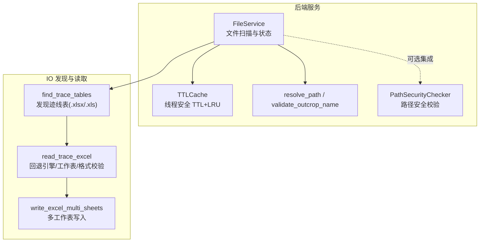
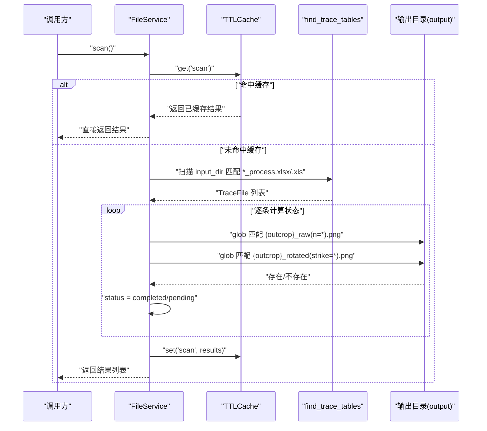
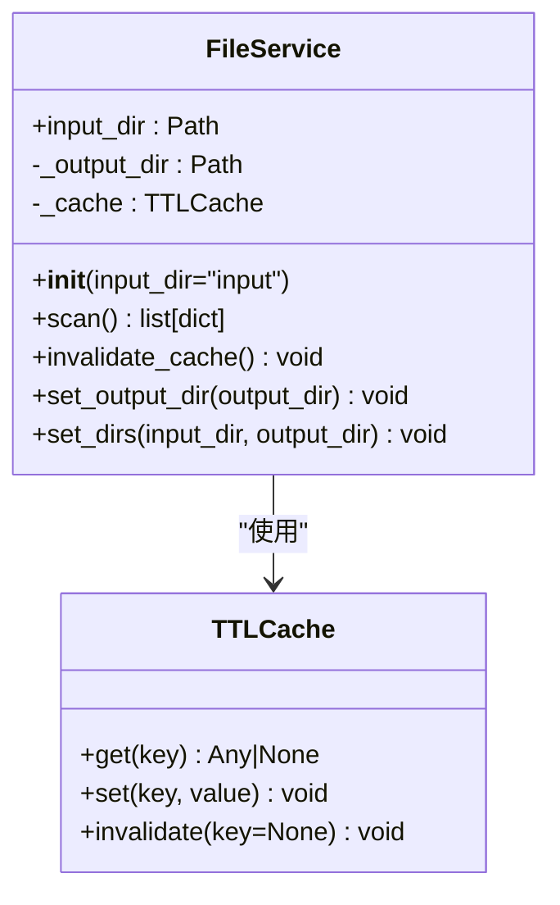
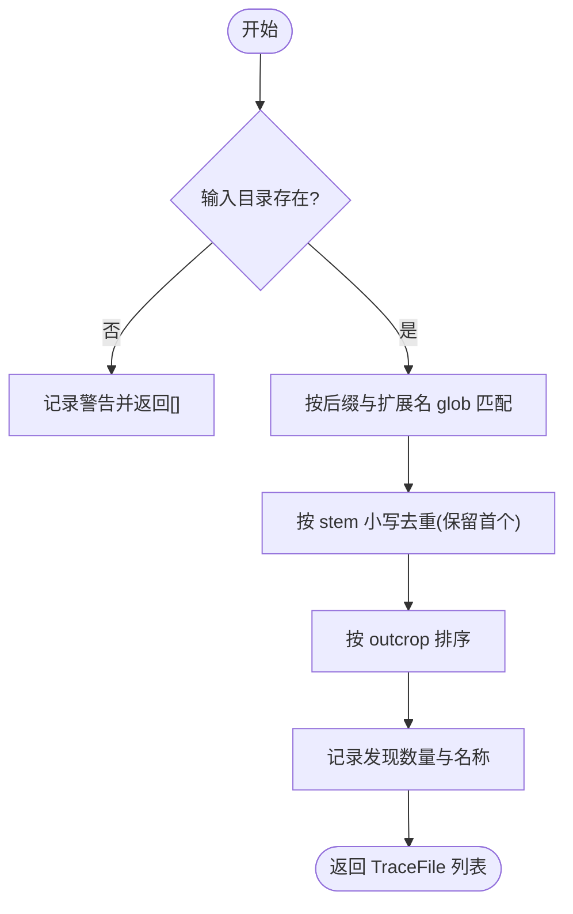
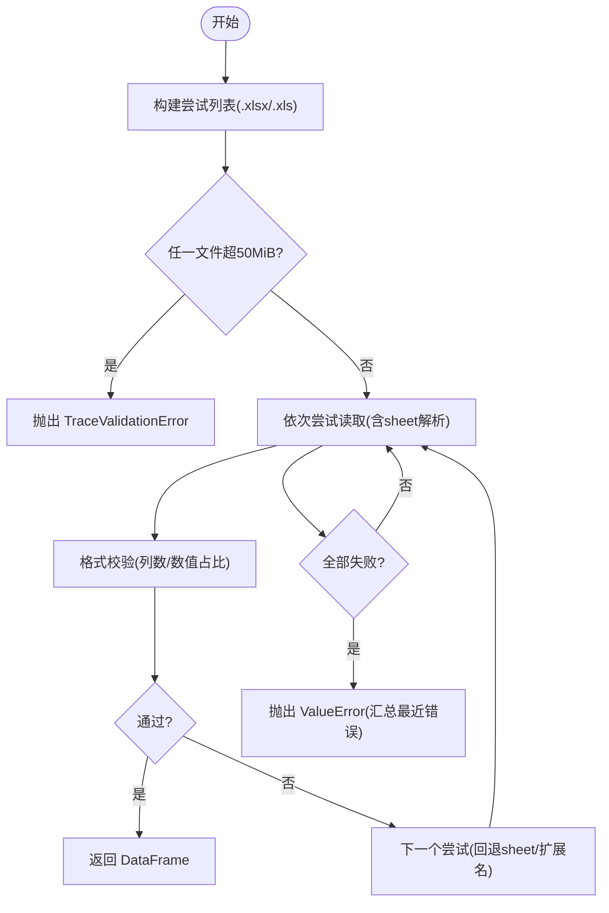
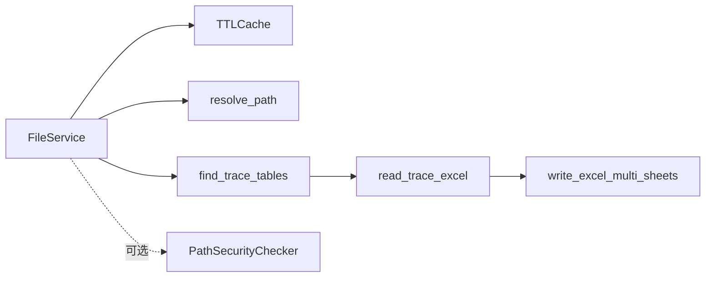

# 文件服务

<cite>
**本文引用的文件列表**
- [file_service.py](file://backend/services/file_service.py)
- [cache.py](file://backend/utils/cache.py)
- [path_utils.py](file://backend/utils/path_utils.py)
- [security.py](file://backend/utils/security.py)
- [discovery.py](file://trace_pipeline/io/discovery.py)
- [excel_reader.py](file://trace_pipeline/io/excel_reader.py)
- [excel_writer.py](file://trace_pipeline/io/excel_writer.py)
</cite>

## 目录
1. [简介](#简介)
2. [项目结构](#项目结构)
3. [核心组件](#核心组件)
4. [架构总览](#架构总览)
5. [详细组件分析](#详细组件分析)
6. [依赖关系分析](#依赖关系分析)
7. [性能与优化](#性能与优化)
8. [故障排查指南](#故障排查指南)
9. [结论](#结论)
10. [附录：使用示例与最佳实践](#附录使用示例与最佳实践)

## 简介
本技术文档聚焦于 TracePipeline 的文件服务，围绕 FileService 类提供的文件操作抽象层展开。内容涵盖：
- 文件扫描、元数据提取与状态跟踪
- scan() 方法的实现逻辑（输入/输出目录遍历、Excel 识别、预处理状态判断、结果文件检测）
- 文件缓存机制、增量扫描与性能优化策略
- 路径规范化、权限检查与错误处理
- 与目录变更检测器的集成思路与实时监控建议
- 批量文件操作、大目录处理与文件系统监控的实践技巧

## 项目结构
后端服务层将“文件扫描”能力封装在 FileService 中，并通过工具模块提供路径解析、安全校验与缓存能力；底层 IO 模块负责 Excel 发现与读写。

图示来源
- [file_service.py:17-103](file://backend/services/file_service.py#L17-L103)
- [cache.py:18-90](file://backend/utils/cache.py#L18-L90)
- [path_utils.py:40-68](file://backend/utils/path_utils.py#L40-L68)
- [security.py:14-128](file://backend/utils/security.py#L14-L128)
- [discovery.py:24-63](file://trace_pipeline/io/discovery.py#L24-L63)
- [excel_reader.py:36-106](file://trace_pipeline/io/excel_reader.py#L36-L106)
- [excel_writer.py:462-489](file://trace_pipeline/io/excel_writer.py#L462-L489)

章节来源
- [file_service.py:17-103](file://backend/services/file_service.py#L17-L103)
- [discovery.py:24-63](file://trace_pipeline/io/discovery.py#L24-L63)
- [excel_reader.py:36-106](file://trace_pipeline/io/excel_reader.py#L36-L106)
- [excel_writer.py:462-489](file://trace_pipeline/io/excel_writer.py#L462-L489)

## 核心组件
- FileService：对外暴露文件扫描接口，维护输入/输出目录、扫描缓存与日志记录。
- TTLCache：线程安全的 TTL + LRU 缓存，支持批量淘汰与键前缀失效。
- DirectoryChangeDetector：对目录进行浅层快照对比，用于增量扫描与变更检测。
- path_utils：统一路径解析与露头名白名单校验，避免路径穿越。
- security.PathSecurityChecker：更严格的路径安全校验器，防止越权访问。
- discovery.find_trace_tables：按后缀与扩展名发现迹线表文件。
- excel_reader/read_trace_excel：Excel 读取（优先 .xlsx，缺失回退 .xls；指定 sheet 不存在则回退首表），并做基本格式校验。
- excel_writer/write_excel_multi_sheets：多工作表写入，带样式与冻结窗格。

章节来源
- [file_service.py:17-103](file://backend/services/file_service.py#L17-L103)
- [cache.py:18-90](file://backend/utils/cache.py#L18-L90)
- [cache.py:92-155](file://backend/utils/cache.py#L92-L155)
- [path_utils.py:20-68](file://backend/utils/path_utils.py#L20-L68)
- [security.py:14-128](file://backend/utils/security.py#L14-L128)
- [discovery.py:24-63](file://trace_pipeline/io/discovery.py#L24-L63)
- [excel_reader.py:36-106](file://trace_pipeline/io/excel_reader.py#L36-L106)
- [excel_writer.py:462-489](file://trace_pipeline/io/excel_writer.py#L462-L489)

## 架构总览
下图展示了从调用方到文件扫描与结果状态判定的完整流程，以及缓存与变更检测的协作点。

图示来源
- [file_service.py:29-89](file://backend/services/file_service.py#L29-L89)
- [discovery.py:24-63](file://trace_pipeline/io/discovery.py#L24-L63)
- [cache.py:40-64](file://backend/utils/cache.py#L40-L64)

## 详细组件分析

### FileService 类
职责
- 初始化时解析输入/输出目录，创建 TTL 缓存实例。
- scan() 方法：
  - 先查缓存，命中则直接返回。
  - 未命中则调用 find_trace_tables 扫描输入目录，得到迹线表集合。
  - 针对每个迹线表，检查输出目录是否存在对应的原始图与旋转图，据此判定状态为 completed 或 pending。
  - 将结果写入缓存并返回。
- invalidate_cache()：使扫描缓存失效。
- set_output_dir()/set_dirs()：动态更新输出/输入目录并失效缓存。

关键行为
- 状态判定规则：当且仅当同时存在 {outcrop}_raw(n=*).png 与 {outcrop}_rotated(strike=*).png 时，标记为 completed，否则 pending。
- 日志：包含阶段、计数、待处理/已完成统计等结构化字段，便于追踪。

图示来源
- [file_service.py:17-103](file://backend/services/file_service.py#L17-L103)
- [cache.py:18-90](file://backend/utils/cache.py#L18-L90)

章节来源
- [file_service.py:17-103](file://backend/services/file_service.py#L17-L103)

### 扫描与发现：find_trace_tables
- 匹配规则：文件名以 _process 结尾，扩展名为 .xlsx 或 .xls。
- 去重策略：同名文件（不同扩展名）按首次发现去重（大小写不敏感）。
- 排序：按 outcrop 排序后返回。
- 空目录或缺失目录：返回空列表并记录警告日志。

图示来源
- [discovery.py:24-63](file://trace_pipeline/io/discovery.py#L24-L63)

章节来源
- [discovery.py:24-63](file://trace_pipeline/io/discovery.py#L24-L63)

### Excel 读取与校验：read_trace_excel
- 候选顺序：优先 .xlsx(openpyxl)，缺失则回退 .xls(xlrd)。
- Sheet 回退：若指定 sheet 不存在，自动回退至第一个 sheet。
- 文件大小限制：超过 50 MiB 直接拒绝，抛出 TraceValidationError。
- 格式校验：至少 4 列，前若干行数值占比需达到阈值，否则视为非数据行。

图示来源
- [excel_reader.py:36-106](file://trace_pipeline/io/excel_reader.py#L36-L106)
- [excel_reader.py:128-169](file://trace_pipeline/io/excel_reader.py#L128-L169)

章节来源
- [excel_reader.py:36-106](file://trace_pipeline/io/excel_reader.py#L36-L106)
- [excel_reader.py:128-169](file://trace_pipeline/io/excel_reader.py#L128-L169)

### Excel 写入：write_excel_multi_sheets
- 多工作表输出：每个区段一个 sheet，支持标题合并、冻结窗格、边框与对齐。
- 字体策略：中文黑体/宋体，英文数字 Times New Roman，混合文本按字符分类设置富文本。
- 数值格式化：整数与浮点数分别设置格式，超长文本自适应列宽。

章节来源
- [excel_writer.py:462-489](file://trace_pipeline/io/excel_writer.py#L462-L489)
- [excel_writer.py:77-170](file://trace_pipeline/io/excel_writer.py#L77-L170)

### 路径与安全
- resolve_path：相对路径基于项目根解析为绝对路径，避免跨目录风险。
- validate_outcrop_name：对白名单外的字符（含路径分隔符与 ..）进行拒绝。
- PathSecurityChecker：递归 URL 解码、拒绝 ..、拒绝 Windows 设备名、符号链接解析后限制在 base 内。

章节来源
- [path_utils.py:20-68](file://backend/utils/path_utils.py#L20-L68)
- [security.py:14-128](file://backend/utils/security.py#L14-L128)

### 缓存与变更检测
- TTLCache：
  - get/set/invalidate/invalidate_prefix 提供线程安全访问。
  - 批量驱逐：每 N 次 set 触发一次过期清理，降低锁竞争。
  - LRU：move_to_end 保证最近使用的条目留在末尾。
- DirectoryChangeDetector：
  - has_changed 比较目录快照（子项名、类型、大小、mtime_ns），支持截断保护（超大目录只取前 N 个并记录总数）。
  - 适合与 scan 结合实现“有变更才全量扫描”，无变更走缓存。

章节来源
- [cache.py:18-90](file://backend/utils/cache.py#L18-L90)
- [cache.py:92-155](file://backend/utils/cache.py#L92-L155)

## 依赖关系分析
- FileService 依赖：
  - TTLCache：缓存扫描结果，减少重复 I/O。
  - path_utils.resolve_path：统一路径解析。
  - discovery.find_trace_tables：发现输入目录中的迹线表。
- 间接依赖：
  - excel_reader：后续读取 Excel 时使用（当前 scan 仅做状态判定，不读数据）。
  - excel_writer：生成结果文件时写入（由上层处理流程调用）。
  - security.PathSecurityChecker：可在需要时对输入路径进行更严格的校验。

图示来源
- [file_service.py:17-103](file://backend/services/file_service.py#L17-L103)
- [cache.py:18-90](file://backend/utils/cache.py#L18-L90)
- [path_utils.py:40-68](file://backend/utils/path_utils.py#L40-L68)
- [discovery.py:24-63](file://trace_pipeline/io/discovery.py#L24-L63)
- [excel_reader.py:36-106](file://trace_pipeline/io/excel_reader.py#L36-L106)
- [excel_writer.py:462-489](file://trace_pipeline/io/excel_writer.py#L462-L489)
- [security.py:14-128](file://backend/utils/security.py#L14-L128)

## 性能与优化
- 缓存命中优先：scan() 先查 TTLCache，命中直接返回，显著降低 I/O 压力。
- 批量驱逐：TTLCache 内部采用批量化过期清理，减少频繁遍历。
- 增量扫描建议：
  - 使用 DirectoryChangeDetector.has_changed 检测目录是否变化，仅在变化时执行全量扫描，否则复用缓存。
  - 对于超大目录，Detector 会截断并记录总数作为信号，避免永远不变的情况。
- 输出状态判定：
  - 使用 glob 模式快速判断结果文件是否存在，避免打开文件或读取内容。
- 资源上限控制：
  - Excel 读取限制最大 50 MiB，避免内存溢出。
  - 可结合 maxsize 参数限制缓存条目数，控制内存占用。

章节来源
- [file_service.py:29-89](file://backend/services/file_service.py#L29-L89)
- [cache.py:18-90](file://backend/utils/cache.py#L18-L90)
- [cache.py:92-155](file://backend/utils/cache.py#L92-L155)
- [excel_reader.py:69-78](file://trace_pipeline/io/excel_reader.py#L69-L78)

## 故障排查指南
- 未发现迹线表
  - 现象：scan 返回空列表。
  - 可能原因：输入目录不存在、文件名不符合 *_process.xlsx/.xls 规则。
  - 定位：查看 discovery 的警告日志。
- 状态始终为 pending
  - 现象：所有文件 status=pending。
  - 可能原因：输出目录缺少 {outcrop}_raw(n=*).png 或 {outcrop}_rotated(strike=*).png。
  - 定位：确认结果文件命名与位置是否符合预期。
- Excel 读取失败
  - 现象：TraceValidationError 或 ValueError。
  - 可能原因：文件过大、sheet 不存在、列数不足、数值占比过低。
  - 定位：根据异常信息修正文件格式或 sheet 名称。
- 路径安全问题
  - 现象：路径被拒绝。
  - 可能原因：包含 ..、Windows 设备名、越权路径。
  - 定位：使用 validate_outcrop_name 或 PathSecurityChecker.safe_path 校验输入。

章节来源
- [discovery.py:24-63](file://trace_pipeline/io/discovery.py#L24-L63)
- [excel_reader.py:36-106](file://trace_pipeline/io/excel_reader.py#L36-L106)
- [path_utils.py:20-68](file://backend/utils/path_utils.py#L20-L68)
- [security.py:14-128](file://backend/utils/security.py#L14-L128)

## 结论
FileService 提供了简洁而健壮的文件扫描抽象层，结合 TTL 缓存与目录变更检测可实现高效、可扩展的增量扫描方案。配合路径规范与安全校验、Excel 读取/写入的容错与格式保障，整体具备高可用性与良好的可观测性。建议在高频调用场景下引入 DirectoryChangeDetector 实现真正的“按需扫描”，并在大规模数据处理时关注缓存容量与 I/O 并发度。

## 附录：使用示例与最佳实践
以下示例以“代码片段路径”形式给出，便于读者在仓库中快速定位实现细节。

- 批量文件操作（扫描与状态判定）
  - 参考：[file_service.py:29-89](file://backend/services/file_service.py#L29-L89)
  - 要点：
    - 调用 scan() 获取文件清单与状态。
    - 对 pending 文件执行处理流程，完成后再次调用 scan() 刷新状态。
- 大目录处理（增量扫描）
  - 参考：
    - [cache.py:92-155](file://backend/utils/cache.py#L92-L155)
    - [file_service.py:29-89](file://backend/services/file_service.py#L29-L89)
  - 要点：
    - 使用 DirectoryChangeDetector.has_changed 检测目录变化。
    - 无变化时复用 TTLCache 结果，有变化时再执行全量扫描。
- 文件系统监控（实时监听）
  - 说明：当前仓库未内置文件系统事件监听器。可结合外部库（如 watchdog）轮询 DirectoryChangeDetector.has_changed，或在 GUI/Web 层定时刷新。
  - 建议：
    - 短周期轮询 + 变更检测，避免每次全量扫描。
    - 对超大目录启用截断保护，确保能感知新增/删除。
- 路径规范化与安全
  - 参考：
    - [path_utils.py:40-68](file://backend/utils/path_utils.py#L40-L68)
    - [security.py:14-128](file://backend/utils/security.py#L14-L128)
  - 要点：
    - 所有用户输入路径必须经 resolve_path 或 safe_path 处理。
    - 对露头名使用 validate_outcrop_name 白名单校验。
- Excel 读取与容错
  - 参考：
    - [excel_reader.py:36-106](file://trace_pipeline/io/excel_reader.py#L36-L106)
    - [excel_reader.py:128-169](file://trace_pipeline/io/excel_reader.py#L128-L169)
  - 要点：
    - 优先 .xlsx，缺失回退 .xls；指定 sheet 不存在自动回退首表。
    - 捕获 TraceValidationError 与 ValueError，区分“格式错误”和“sheet 不存在”。
- Excel 写入与样式
  - 参考：
    - [excel_writer.py:462-489](file://trace_pipeline/io/excel_writer.py#L462-L489)
    - [excel_writer.py:77-170](file://trace_pipeline/io/excel_writer.py#L77-L170)
  - 要点：
    - 多工作表输出，标题合并、冻结窗格、边框与对齐。
    - 中英文混排富文本与数值格式化。