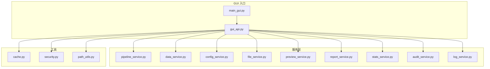
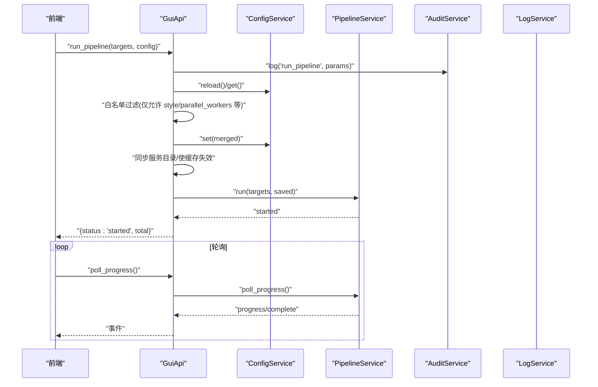
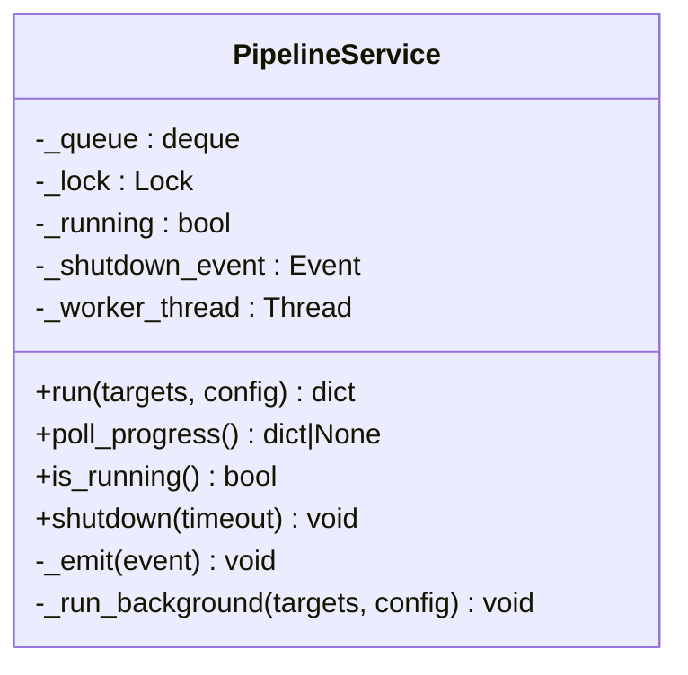
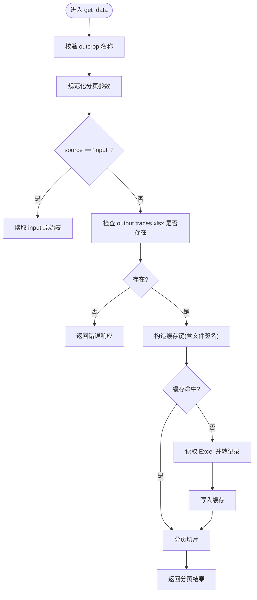
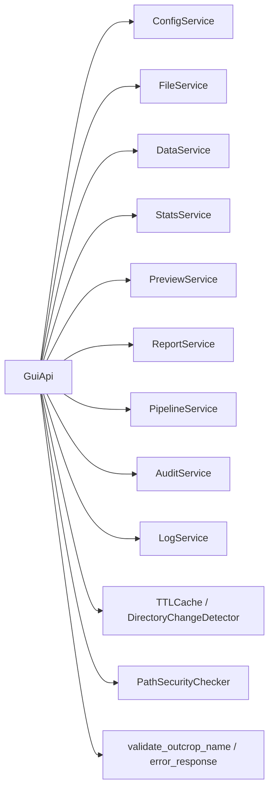

# 服务层（后端服务）

<cite>
**本文引用的文件**   
- [backend/gui_api.py](file://backend/gui_api.py)
- [backend/main_gui.py](file://backend/main_gui.py)
- [backend/services/pipeline_service.py](file://backend/services/pipeline_service.py)
- [backend/services/data_service.py](file://backend/services/data_service.py)
- [backend/services/config_service.py](file://backend/services/config_service.py)
- [backend/services/file_service.py](file://backend/services/file_service.py)
- [backend/services/preview_service.py](file://backend/services/preview_service.py)
- [backend/services/report_service.py](file://backend/services/report_service.py)
- [backend/services/stats_service.py](file://backend/services/stats_service.py)
- [backend/services/audit_service.py](file://backend/services/audit_service.py)
- [backend/services/log_service.py](file://backend/services/log_service.py)
- [backend/utils/cache.py](file://backend/utils/cache.py)
- [backend/utils/security.py](file://backend/utils/security.py)
- [backend/utils/path_utils.py](file://backend/utils/path_utils.py)
- [tests/test_gui_api.py](file://tests/test_gui_api.py)
- [tests/test_pipeline_service.py](file://tests/test_pipeline_service.py)
</cite>

## 目录
1. [简介](#简介)
2. [项目结构](#项目结构)
3. [核心组件](#核心组件)
4. [架构总览](#架构总览)
5. [详细组件分析](#详细组件分析)
6. [依赖关系分析](#依赖关系分析)
7. [性能与并发](#性能与并发)
8. [安全与校验](#安全与校验)
9. [错误处理与日志](#错误处理与日志)
10. [测试策略](#测试策略)
11. [故障排查指南](#故障排查指南)
12. [结论](#结论)

## 简介
本技术文档聚焦于 TracePipeline 的后端服务层，基于 pywebview 的 GUI API 暴露 RESTful 风格方法给前端调用。服务层采用分层设计：GuiApi 作为统一入口，聚合并懒加载多个领域服务（流水线、数据、配置、文件、预览、报告、统计、审计、日志），并通过线程与进程池实现高吞吐的批处理与并发控制。所有服务共享统一的缓存、路径安全与工具模块，确保一致性与可维护性。

## 项目结构
后端服务位于 backend 目录，GUI 入口为 main_gui.py，JS API 入口为 gui_api.py；具体业务逻辑按职责拆分为 services 下的 9 个服务模块；utils 提供缓存、路径解析与安全校验等通用能力。

图表来源
- [backend/main_gui.py:81-206](file://backend/main_gui.py#L81-L206)
- [backend/gui_api.py:52-158](file://backend/gui_api.py#L52-L158)

章节来源
- [backend/main_gui.py:81-206](file://backend/main_gui.py#L81-L206)
- [backend/gui_api.py:52-158](file://backend/gui_api.py#L52-L158)

## 核心组件
- GuiApi：pywebview JS API 的统一入口，负责参数校验、权限控制、并发锁、进度队列、服务懒加载与生命周期管理。
- PipelineService：后台线程 + 多进程执行器，支持并行处理多个露头目标，通过事件队列向前端推送进度。
- DataService：读取 input/output Excel 数据，支持分页与 TTL 缓存。
- ConfigService：config.json 的唯一写入入口，提供合并、校验、原子保存与部分重置。
- FileService：扫描输入目录，返回迹线表清单及完成状态，带扫描缓存。
- PreviewService：使用固定演示数据生成样式预览图，独立于业务绘图逻辑，带结果缓存。
- ReportService：生成 DOCX/PDF 报告，包含字体探测、混合排版、图片嵌入与结果缓存。
- StatsService：计算统计数据与覆盖层几何，构建直方图、节点识别与对比接口，带细粒度缓存键。
- AuditService：操作审计记录，内存缓冲 + 日志文件回退。
- LogService：高效 tail 读取 JSON Lines 日志，支持级别过滤与格式化输出。

章节来源
- [backend/gui_api.py:52-158](file://backend/gui_api.py#L52-L158)
- [backend/services/pipeline_service.py:32-95](file://backend/services/pipeline_service.py#L32-L95)
- [backend/services/data_service.py:44-188](file://backend/services/data_service.py#L44-L188)
- [backend/services/config_service.py:41-144](file://backend/services/config_service.py#L41-L144)
- [backend/services/file_service.py:17-103](file://backend/services/file_service.py#L17-L103)
- [backend/services/preview_service.py:37-167](file://backend/services/preview_service.py#L37-L167)
- [backend/services/report_service.py:183-364](file://backend/services/report_service.py#L183-L364)
- [backend/services/stats_service.py:35-380](file://backend/services/stats_service.py#L35-L380)
- [backend/services/audit_service.py:22-155](file://backend/services/audit_service.py#L22-L155)
- [backend/services/log_service.py:57-142](file://backend/services/log_service.py#L57-L142)

## 架构总览
GuiApi 将外部请求路由到对应服务，并在必要时进行参数白名单过滤、路径安全校验、并发限制与缓存失效。服务之间通过函数式调用协作，不直接互相持有引用，降低耦合度。

图表来源
- [backend/gui_api.py:388-445](file://backend/gui_api.py#L388-L445)
- [backend/services/pipeline_service.py:42-95](file://backend/services/pipeline_service.py#L42-L95)
- [backend/services/config_service.py:68-101](file://backend/services/config_service.py#L68-L101)
- [backend/services/audit_service.py:28-47](file://backend/services/audit_service.py#L28-L47)

## 详细组件分析

### 流水线编排服务（PipelineService）
- 职责：接收目标列表与运行配置，启动后台工作线程，使用多进程执行器并行处理每个露头任务，通过事件队列向调用方推送进度与结果。
- 关键特性：
  - 非守护线程 + shutdown 机制，避免主进程退出时中断 I/O。
  - parallel_workers 自动裁剪至 CPU 核心数或任务数上限。
  - 关闭信号在任务间检查，支持优雅取消。
  - 结果字段映射为前端友好格式（如 raw_plot/rotated_plot/rose_plot）。
- 复杂度：I/O 与绘图为主，CPU 密集度取决于具体节点；并行度受限于系统资源与任务数量。

图表来源
- [backend/services/pipeline_service.py:32-95](file://backend/services/pipeline_service.py#L32-L95)
- [backend/services/pipeline_service.py:100-346](file://backend/services/pipeline_service.py#L100-L346)

章节来源
- [backend/services/pipeline_service.py:32-95](file://backend/services/pipeline_service.py#L32-L95)
- [backend/services/pipeline_service.py:100-346](file://backend/services/pipeline_service.py#L100-L346)

### 数据访问服务（DataService）
- 职责：读取 output/{outcrop}_traces.xlsx（多工作表）或 input/{outcrop}_process.xls(xlsx)，分页返回数据与列名。
- 关键特性：
  - 规范化分页参数，限制 page_size 上限。
  - 基于文件签名（mtime+size）的 TTL 缓存键，避免重复解析。
  - 兼容旧格式单工作表文件的降级读取。
- 错误响应：统一 error_response 格式，便于前端处理。

图表来源
- [backend/services/data_service.py:78-188](file://backend/services/data_service.py#L78-L188)
- [backend/utils/path_utils.py:59-68](file://backend/utils/path_utils.py#L59-L68)

章节来源
- [backend/services/data_service.py:44-188](file://backend/services/data_service.py#L44-L188)
- [backend/utils/path_utils.py:59-68](file://backend/utils/path_utils.py#L59-L68)

### 配置管理服务（ConfigService）
- 职责：config.json 的唯一写入入口，提供加载、合并、校验、原子保存与部分重置。
- 关键特性：
  - 读写加锁，防止并发写冲突。
  - set 前 reload 磁盘最新值，避免覆盖外部修改。
  - 原子保存：先写临时文件再替换，失败清理临时文件。
  - 支持仅重置处理参数或样式。

章节来源
- [backend/services/config_service.py:41-144](file://backend/services/config_service.py#L41-L144)

### 文件操作服务（FileService）
- 职责：扫描 input_dir 中的迹线表文件，检测 output 中是否已生成必要图像以判定“待处理/已完成”。
- 关键特性：
  - 扫描结果 TTL 缓存，减少频繁 IO。
  - 动态更新 input/output 目录并失效缓存。

章节来源
- [backend/services/file_service.py:17-103](file://backend/services/file_service.py#L17-L103)

### 预览生成服务（PreviewService）
- 职责：使用固定演示数据渲染样式预览图（原始/旋转/玫瑰图），与正式绘图解耦。
- 关键特性：
  - 基于样式与 overlay 状态的哈希键，TTL 缓存结果。
  - 生成目录 cache/preview，避免污染业务输出。

章节来源
- [backend/services/preview_service.py:37-167](file://backend/services/preview_service.py#L37-L167)

### 报告生成服务（ReportService）
- 职责：生成 DOCX/PDF 报告，包含统计文本行与图片嵌入，支持进度回调。
- 关键特性：
  - 跨平台字体探测与注册，中文/拉丁混排。
  - 结果 TTL 缓存，附带图片 mtime 校验，避免过期。
  - 进度回调步骤：loading/stats/docx/pdf/done。

章节来源
- [backend/services/report_service.py:183-364](file://backend/services/report_service.py#L183-L364)

### 统计分析服务（StatsService）
- 职责：计算统计数据、直方图、圆窗几何、节点识别与覆盖层数据，支持多露头对比。
- 关键特性：
  - 细粒度缓存键：仅提取影响结果的配置子集 + 输入文件指纹。
  - 节点识别与多种覆盖层（圆窗、凸包、节点）几何导出。
  - 对比接口保持输入顺序。

章节来源
- [backend/services/stats_service.py:35-380](file://backend/services/stats_service.py#L35-L380)

### 审计日志服务（AuditService）
- 职责：记录用户操作到统一结构化日志流，内存缓冲 + 日志文件回退。
- 关键特性：
  - event_type="audit" 区分审计记录。
  - 支持从当天目录与 zip 归档中回溯审计记录。

章节来源
- [backend/services/audit_service.py:22-155](file://backend/services/audit_service.py#L22-L155)

### 日志管理服务（LogService）
- 职责：高效 tail 读取 JSON Lines 日志，支持级别过滤与格式化输出。
- 关键特性：
  - 反向读取大文件，限制最大文件大小与缓冲区大小。
  - 按时间排序后截取最近 N 条，附加耗时信息。

章节来源
- [backend/services/log_service.py:57-142](file://backend/services/log_service.py#L57-L142)

## 依赖关系分析
- GuiApi 依赖所有服务与工具模块，但采用懒加载属性，首次访问时才实例化，降低启动开销。
- 服务之间无直接依赖，均通过 GuiApi 协调，符合单一职责与低耦合原则。
- 工具模块被多处复用：TTLCache、DirectoryChangeDetector、PathSecurityChecker、validate_outcrop_name、error_response。

图表来源
- [backend/gui_api.py:52-158](file://backend/gui_api.py#L52-L158)
- [backend/utils/cache.py:18-90](file://backend/utils/cache.py#L18-L90)
- [backend/utils/security.py:14-128](file://backend/utils/security.py#L14-L128)
- [backend/utils/path_utils.py:20-68](file://backend/utils/path_utils.py#L20-L68)

章节来源
- [backend/gui_api.py:52-158](file://backend/gui_api.py#L52-L158)
- [backend/utils/cache.py:18-90](file://backend/utils/cache.py#L18-L90)
- [backend/utils/security.py:14-128](file://backend/utils/security.py#L14-L128)
- [backend/utils/path_utils.py:20-68](file://backend/utils/path_utils.py#L20-L68)

## 性能与并发
- 线程与进程：
  - PipelineService 使用后台线程调度，ProcessPoolExecutor 并行提交任务，workers 自动裁剪至 CPU 核心数或任务数。
  - 关闭信号在任务间检查，避免长时间阻塞。
- 缓存策略：
  - TTLCache：LRU + TTL，批量驱逐，支持前缀失效。
  - DirectoryChangeDetector：浅层快照比较，检测外部变更并触发缓存失效。
  - 各服务根据场景设置合理 TTL 与 maxsize，避免内存膨胀。
- 并发控制：
  - GuiApi 对重资源操作（预览、报告）使用互斥锁，防止并发导致资源耗尽。
  - 报告进度队列使用双端队列与锁保护，前端轮询消费。

章节来源
- [backend/services/pipeline_service.py:146-185](file://backend/services/pipeline_service.py#L146-L185)
- [backend/utils/cache.py:18-90](file://backend/utils/cache.py#L18-L90)
- [backend/gui_api.py:602-730](file://backend/gui_api.py#L602-L730)

## 安全与校验
- 路径安全：
  - PathSecurityChecker 递归 URL 解码、拒绝 ".."、Windows 设备名、符号链接逃逸，限制在可信 base 内。
  - GuiApi 提供 _safe_path/_safe_known_path/_safe_user_selected_path 等方法，严格校验用户选择路径。
- 参数白名单：
  - run_pipeline 仅允许覆盖 PROCESSING_KEYS 与 style/parallel_workers，禁止前端覆盖 input_dir/output_dir 等路径字段。
- 露头名校验：
  - validate_outcrop_name 使用正则限制字符集，防止路径遍历。

章节来源
- [backend/utils/security.py:14-128](file://backend/utils/security.py#L14-L128)
- [backend/gui_api.py:388-445](file://backend/gui_api.py#L388-L445)
- [backend/utils/path_utils.py:20-37](file://backend/utils/path_utils.py#L20-L37)
- [tests/test_gui_api.py:20-131](file://tests/test_gui_api.py#L20-L131)

## 错误处理与日志
- 统一错误响应：
  - error_response 提供一致的 status/message/error 字段，便于前端处理。
- 异常分类：
  - 关键异常（MemoryError/SystemExit/KeyboardInterrupt）不吞没，向上传播。
  - 其他异常捕获后记录警告并返回错误响应。
- 结构化日志：
  - 使用 extra 字段记录 stage、duration_ms、请求 ID 等上下文。
  - LogService 支持级别过滤与尾读，AuditService 记录审计事件。

章节来源
- [backend/utils/path_utils.py:59-68](file://backend/utils/path_utils.py#L59-L68)
- [backend/services/data_service.py:142-157](file://backend/services/data_service.py#L142-L157)
- [backend/services/pipeline_service.py:326-346](file://backend/services/pipeline_service.py#L326-L346)
- [backend/services/log_service.py:78-142](file://backend/services/log_service.py#L78-L142)
- [backend/services/audit_service.py:28-47](file://backend/services/audit_service.py#L28-L47)

## 测试策略
- 白名单与越权防护：
  - 验证 run_pipeline 不允许前端覆盖路径字段，但允许 style/parallel_workers。
- 并发与资源限制：
  - 验证 workers 不超过 CPU 核心数，无法识别时退回 1。
- 结果字段映射：
  - 验证 file_complete.result 使用前端友好字段名。

章节来源
- [tests/test_gui_api.py:20-131](file://tests/test_gui_api.py#L20-L131)
- [tests/test_pipeline_service.py:58-143](file://tests/test_pipeline_service.py#L58-L143)
- [tests/test_pipeline_service.py:26-56](file://tests/test_pipeline_service.py#L26-L56)

## 故障排查指南
- 常见问题定位：
  - 流水线未启动或卡住：检查 is_running 与 poll_progress 事件，确认是否有 complete/error 事件。
  - 报告生成失败：查看 report 阶段日志与错误消息，确认依赖库安装与字体可用性。
  - 数据页空白：确认 output traces.xlsx 与工作表名称匹配，检查缓存键与文件签名。
- 建议步骤：
  - 使用 get_logs(tail=200, level="ERROR") 获取错误级日志。
  - 使用 reset_config/reset_processing_config 恢复默认配置后重试。
  - 强制刷新 scan_files(force=True) 与 invalidate_cache 相关服务缓存。

章节来源
- [backend/gui_api.py:447-456](file://backend/gui_api.py#L447-L456)
- [backend/gui_api.py:358-385](file://backend/gui_api.py#L358-L385)
- [backend/services/log_service.py:78-142](file://backend/services/log_service.py#L78-L142)

## 结论
TracePipeline 的服务层以 GuiApi 为核心，结合 9 个职责清晰的服务模块，实现了稳健的 GUI API 层与高性能的批处理能力。通过严格的参数白名单、路径安全校验、线程/进程并发控制与多级缓存策略，系统在安全性、稳定性与性能方面达到良好平衡。完善的错误处理与结构化日志为问题定位提供了有力支撑，配合单元测试覆盖了关键行为与边界条件。