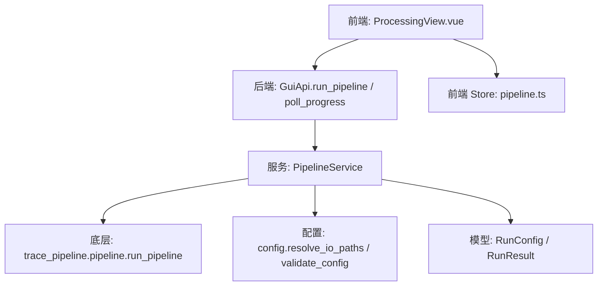
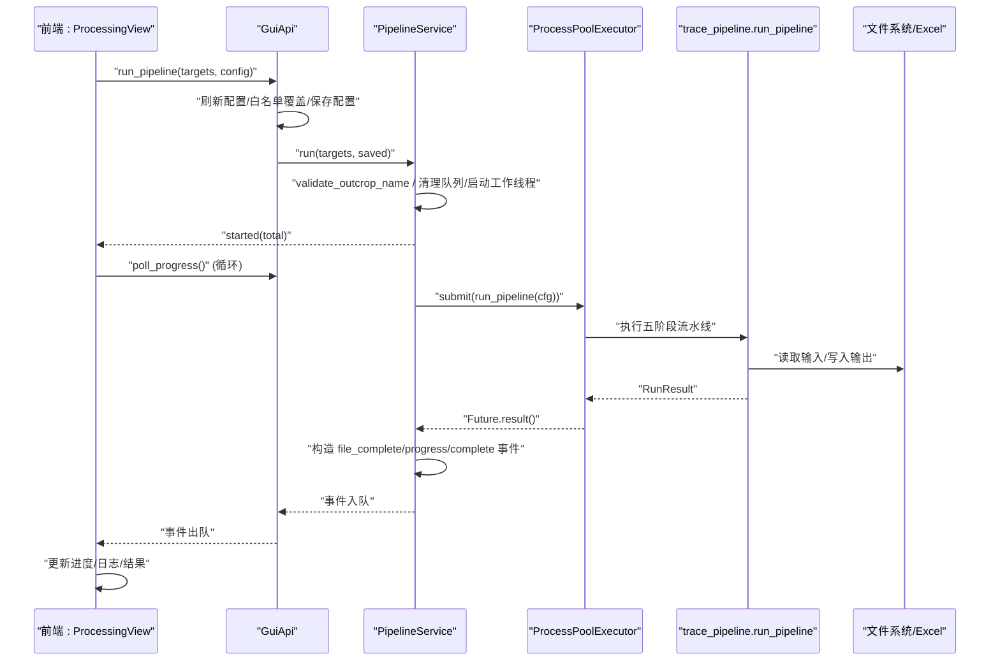
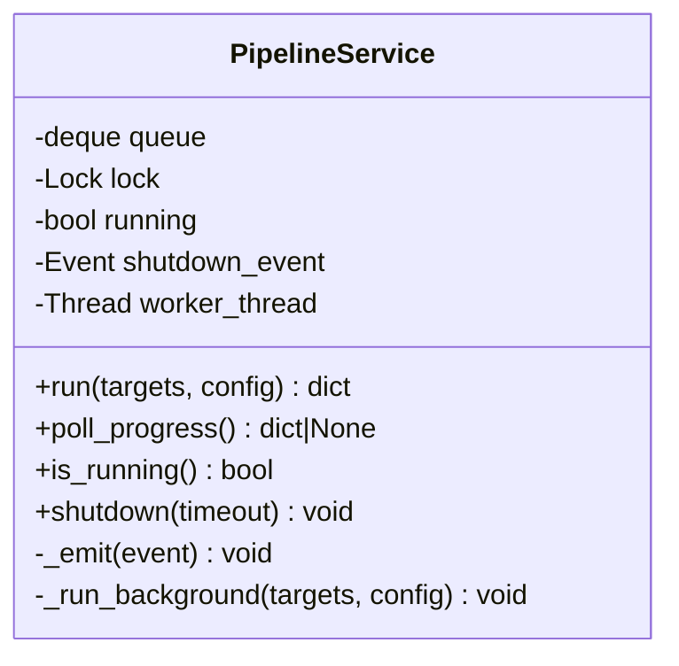
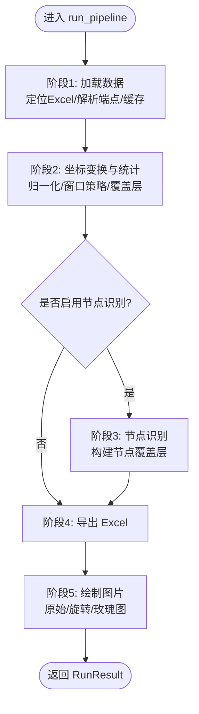
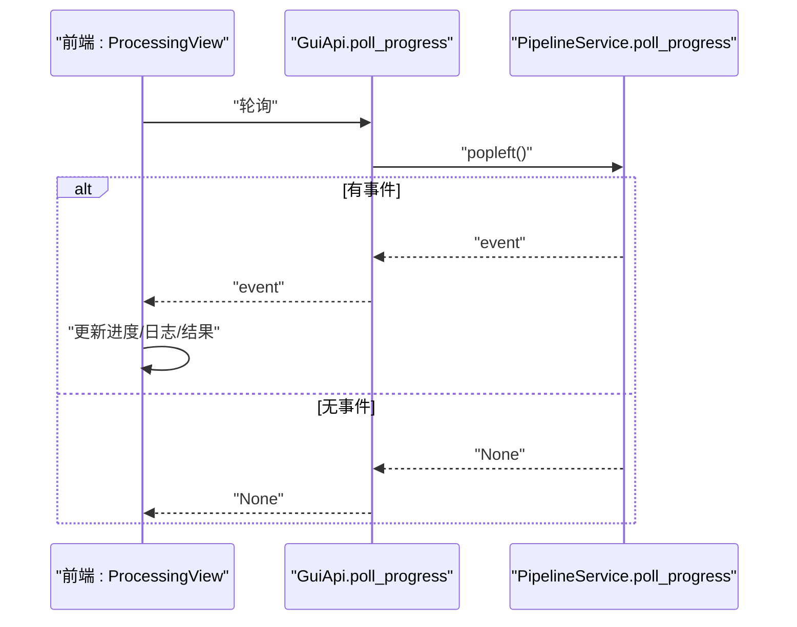
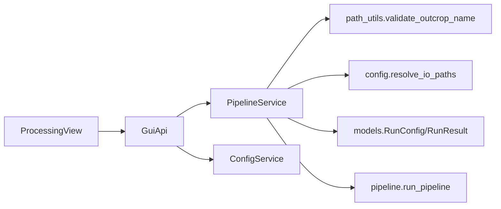

# 流水线服务

<cite>
**本文引用的文件列表**
- [pipeline_service.py](file://backend/services/pipeline_service.py)
- [gui_api.py](file://backend/gui_api.py)
- [config_service.py](file://backend/services/config_service.py)
- [path_utils.py](file://backend/utils/path_utils.py)
- [pipeline.py](file://trace_pipeline/pipeline.py)
- [config.py](file://trace_pipeline/config.py)
- [models.py](file://trace_pipeline/models.py)
- [validation.py](file://trace_pipeline/validation.py)
- [ProcessingView.vue](file://frontend/src/views/ProcessingView.vue)
- [pipeline.ts](file://frontend/src/stores/pipeline.ts)
- [test_pipeline_service.py](file://tests/test_pipeline_service.py)
</cite>

## 目录
1. [简介](#简介)
2. [项目结构](#项目结构)
3. [核心组件](#核心组件)
4. [架构总览](#架构总览)
5. [详细组件分析](#详细组件分析)
6. [依赖关系分析](#依赖关系分析)
7. [性能与并发特性](#性能与并发特性)
8. [故障排查指南](#故障排查指南)
9. [结论](#结论)
10. [附录：最佳实践示例路径](#附录最佳实践示例路径)

## 简介
本技术文档聚焦于 TracePipeline 的“流水线服务”，围绕 PipelineService 类展开，系统阐述其五阶段处理流水线的编排与执行机制、run() 方法的参数处理与配置合并、目标文件筛选与并行执行策略、进度监控（事件队列 + 轮询接口 + 前端更新）、异常处理与回滚策略、以及与底层 trace_pipeline 模块的集成方式（RunConfig 构建、RunResult 处理、错误传播）。同时提供面向批量处理、并发控制与错误恢复的最佳实践参考。

## 项目结构
后端通过 GUI API 暴露 run_pipeline 与 poll_progress 等接口；GUI API 内部懒加载并调用 PipelineService；PipelineService 负责后台线程调度、任务提交与结果聚合；底层 trace_pipeline.pipeline.run_pipeline 实现单目标的五阶段处理流程；前端 ProcessingView 通过轮询获取进度并渲染日志与状态。

图表来源
- [gui_api.py:388-446](file://backend/gui_api.py#L388-L446)
- [pipeline_service.py:32-95](file://backend/services/pipeline_service.py#L32-L95)
- [pipeline.py:230-474](file://trace_pipeline/pipeline.py#L230-L474)
- [config.py:218-246](file://trace_pipeline/config.py#L218-L246)
- [models.py:162-352](file://trace_pipeline/models.py#L162-L352)
- [ProcessingView.vue:354-518](file://frontend/src/views/ProcessingView.vue#L354-L518)
- [pipeline.ts:22-56](file://frontend/src/stores/pipeline.ts#L22-L56)

章节来源
- [gui_api.py:388-446](file://backend/gui_api.py#L388-L446)
- [pipeline_service.py:32-95](file://backend/services/pipeline_service.py#L32-L95)
- [pipeline.py:230-474](file://trace_pipeline/pipeline.py#L230-L474)
- [config.py:218-246](file://trace_pipeline/config.py#L218-L246)
- [models.py:162-352](file://trace_pipeline/models.py#L162-L352)
- [ProcessingView.vue:354-518](file://frontend/src/views/ProcessingView.vue#L354-L518)
- [pipeline.ts:22-56](file://frontend/src/stores/pipeline.ts#L22-L56)

## 核心组件
- PipelineService：后台线程安全队列 + 轮询架构，负责批处理任务的启动、并行执行、进度推送与优雅关闭。
- GuiApi：pywebview JS API 入口，负责配置合并、白名单覆盖、缓存失效与审计记录，并转发到 PipelineService。
- trace_pipeline.pipeline.run_pipeline：单目标五阶段流水线（加载 → 变换 → 节点识别 → 导出 Excel → 绘图），统一异常处理与结果封装。
- trace_pipeline.config：配置加载、校验、路径解析与工作目录保障。
- trace_pipeline.models：不可变数据模型（TraceData、RunConfig、RunResult）与状态枚举。
- 前端 ProcessingView：发起运行、轮询进度、渲染日志与结果，持久化用户偏好。

章节来源
- [pipeline_service.py:32-95](file://backend/services/pipeline_service.py#L32-L95)
- [gui_api.py:388-446](file://backend/gui_api.py#L388-L446)
- [pipeline.py:230-474](file://trace_pipeline/pipeline.py#L230-L474)
- [config.py:86-191](file://trace_pipeline/config.py#L86-L191)
- [models.py:162-352](file://trace_pipeline/models.py#L162-L352)
- [ProcessingView.vue:354-518](file://frontend/src/views/ProcessingView.vue#L354-L518)

## 架构总览
下图展示了从前端触发到后端执行、再到子进程完成并返回结果的完整时序。

图表来源
- [gui_api.py:388-446](file://backend/gui_api.py#L388-L446)
- [pipeline_service.py:100-346](file://backend/services/pipeline_service.py#L100-L346)
- [pipeline.py:230-474](file://trace_pipeline/pipeline.py#L230-L474)
- [ProcessingView.vue:354-518](file://frontend/src/views/ProcessingView.vue#L354-L518)

## 详细组件分析

### PipelineService 类
- 职责
  - 维护线程安全的任务队列与锁，避免并发访问冲突。
  - run() 非阻塞启动后台线程，立即返回启动状态。
  - _run_background() 计算并行度、构建 RunConfig、提交任务、收集结果、推送进度事件。
  - poll_progress() 供前端轮询消费事件。
  - shutdown() 优雅关闭：设置取消信号、等待线程结束、超时告警。
- 关键行为
  - 目标名校验：使用 validate_outcrop_name 防止路径穿越。
  - 并行度计算：根据 parallel_workers、CPU 核心数与任务数量裁剪 max_workers。
  - 进程池上下文：使用 spawn 模式，确保子进程独立初始化 matplotlib 后端与日志。
  - 事件类型：start、progress、file_complete、complete、error。
  - 异常分类：MemoryError/SystemExit/KeyboardInterrupt 向上传播；其他异常包装为失败结果。
  - 关闭信号：在提交前与任务间检查，支持提前终止并发送 complete(取消)。

图表来源
- [pipeline_service.py:32-95](file://backend/services/pipeline_service.py#L32-L95)
- [pipeline_service.py:100-346](file://backend/services/pipeline_service.py#L100-L346)

章节来源
- [pipeline_service.py:32-95](file://backend/services/pipeline_service.py#L32-L95)
- [pipeline_service.py:100-346](file://backend/services/pipeline_service.py#L100-L346)
- [path_utils.py:20-37](file://backend/utils/path_utils.py#L20-L37)

### run() 方法详解
- 参数处理
  - targets：露头标识列表，逐个进行 validate_outcrop_name 校验，非法直接返回 error。
  - config：来自 GUI API 的已合并配置（包含 input_dir/output_dir 等）。
- 配置合并与路径解析
  - 从 config 中取 input_dir/output_dir，调用 resolve_io_paths 解析为绝对路径并确保目录存在。
  - 为每个目标生成 table_stem = "{outcrop}_process"，用于定位输入 Excel。
- 并行执行逻辑
  - 计算 workers：若 parallel_workers <= 0，自动取 min(任务数, cpu_count)；=1 则串行；>1 则按请求值裁剪至 cpu_count。
  - 使用 ProcessPoolExecutor(max_workers=workers, mp_context="spawn") 提交任务。
  - 使用 as_completed 顺序处理已完成任务，统计 completed_count 并推送进度。
- 返回值
  - 成功启动返回 {"status": "started", "total": N}；否则返回 {"status": "error/busy", "message": ...}。

章节来源
- [pipeline_service.py:42-64](file://backend/services/pipeline_service.py#L42-L64)
- [pipeline_service.py:100-185](file://backend/services/pipeline_service.py#L100-L185)
- [config.py:218-246](file://trace_pipeline/config.py#L218-L246)
- [path_utils.py:20-37](file://backend/utils/path_utils.py#L20-L37)

### 五阶段流水线编排（trace_pipeline.pipeline.run_pipeline）
- 阶段 1：加载数据
  - 定位输入 Excel（.xlsx/.xls），按文件签名缓存 TraceData，减少重复 IO。
- 阶段 2：坐标变换与统计
  - normalize_coordinates 归一化坐标；compute_trace_statistics 计算统计量；构建圆窗与凸包覆盖层。
- 阶段 3：节点识别（可选）
  - 根据 enable_node_recognition 决定是否执行 recognize_trace_nodes，并构建节点覆盖层。
- 阶段 4：导出 Excel
  - build_result_workbook_sections 组装多表内容，write_excel_multi_sheets 写入。
- 阶段 5：绘制图片
  - render_trace_plot 原始图与旋转图；render_rose_plot 玫瑰图（可选）。
- 异常处理
  - PermissionError/FileNotFoundError 友好提示；通用异常记录 traceback；关键异常向上抛出。
- 结果封装
  - 成功时返回 RunResult.success(...)，包含统计、路径与节点计数等字段。

图表来源
- [pipeline.py:230-474](file://trace_pipeline/pipeline.py#L230-L474)

章节来源
- [pipeline.py:230-474](file://trace_pipeline/pipeline.py#L230-L474)

### 进度监控机制
- 事件队列
  - PipelineService 内部使用 deque 作为线程安全队列，_emit 追加事件，poll_progress 弹出事件。
- 轮询接口
  - GuiApi.poll_progress 透传 PipelineService.poll_progress 的结果给前端。
- 前端进度更新
  - ProcessingView 定时轮询，处理 start/progress/file_complete/complete/error 事件，更新进度条、日志与结果列表。
  - 连续轮询失败达到阈值后停止轮询并提示错误。

图表来源
- [pipeline_service.py:66-73](file://backend/services/pipeline_service.py#L66-L73)
- [gui_api.py:447-456](file://backend/gui_api.py#L447-L456)
- [ProcessingView.vue:410-518](file://frontend/src/views/ProcessingView.vue#L410-L518)

章节来源
- [pipeline_service.py:66-73](file://backend/services/pipeline_service.py#L66-L73)
- [gui_api.py:447-456](file://backend/gui_api.py#L447-L456)
- [ProcessingView.vue:410-518](file://frontend/src/views/ProcessingView.vue#L410-L518)

### 异常处理策略、事务管理与回滚机制
- 异常分类与传播
  - MemoryError/SystemExit/KeyboardInterrupt 不吞没，向上传播以便上层捕获或终止。
  - 其他异常被捕获并包装为 RunResult.failure，附带错误类型与消息。
- 事务性与回滚
  - 当前实现未引入显式事务或回滚机制；各阶段写入（Excel/图片）为幂等落盘，失败仅影响单个目标，不影响其他目标。
  - 建议：如需强一致，可在阶段间增加中间产物校验与失败清理逻辑（例如删除部分生成的中间文件）。
- 优雅关闭
  - shutdown() 设置取消信号，允许在任务间隙退出，join 等待线程结束，超时记录警告。

章节来源
- [pipeline_service.py:223-232](file://backend/services/pipeline_service.py#L223-L232)
- [pipeline_service.py:326-346](file://backend/services/pipeline_service.py#L326-L346)
- [pipeline.py:450-474](file://trace_pipeline/pipeline.py#L450-L474)

### 与底层 trace_pipeline 模块的集成
- RunConfig 构建
  - 在 _run_background 中，基于全局配置与目标信息构造 RunConfig.from_mapping(...)，注入 input_dir/output_dir/table_stem/outcrop/output_prefix。
- RunResult 处理
  - 将 RunResult 的字段映射为前端友好的字典（如 raw_plot_path -> raw_plot），便于 UI 展示。
- 错误传播
  - 子进程内异常被捕获并转为失败结果；关键异常向上传播；GUI API 层对 ValueError 与未知异常做兜底处理。

章节来源
- [pipeline_service.py:186-201](file://backend/services/pipeline_service.py#L186-L201)
- [pipeline_service.py:234-305](file://backend/services/pipeline_service.py#L234-L305)
- [models.py:236-268](file://trace_pipeline/models.py#L236-L268)
- [gui_api.py:420-446](file://backend/gui_api.py#L420-L446)

## 依赖关系分析
- 组件耦合
  - PipelineService 依赖 path_utils.validate_outcrop_name、config.resolve_io_paths、models.RunConfig/RunResult、pipeline.run_pipeline。
  - GuiApi 依赖 ConfigService、FileService、StatsService 等，并通过白名单限制前端可覆盖的配置键。
  - 前端依赖 GuiApi 的 run_pipeline 与 poll_progress，以及本地 Store 管理状态。
- 外部依赖
  - multiprocessing.ProcessPoolExecutor 与 spawn 上下文保证子进程隔离。
  - matplotlib 后端在非主进程中强制切换为非交互后端，避免 GUI 冲突。

图表来源
- [pipeline_service.py:13-18](file://backend/services/pipeline_service.py#L13-L18)
- [gui_api.py:23-35](file://backend/gui_api.py#L23-L35)
- [ProcessingView.vue:118-121](file://frontend/src/views/ProcessingView.vue#L118-L121)

章节来源
- [pipeline_service.py:13-18](file://backend/services/pipeline_service.py#L13-L18)
- [gui_api.py:23-35](file://backend/gui_api.py#L23-L35)
- [ProcessingView.vue:118-121](file://frontend/src/views/ProcessingView.vue#L118-L121)

## 性能与并发特性
- 并行度控制
  - parallel_workers=0 自动选择 min(任务数, CPU 核心数)；=1 串行；>1 按请求值裁剪至 CPU 核心数。
  - 测试用例验证了上限裁剪与不可用 CPU 核心数的降级策略。
- 进程隔离
  - 使用 spawn 上下文，子进程独立初始化 matplotlib 后端与日志，避免共享状态污染。
- I/O 与缓存
  - 输入 Excel 按文件签名缓存 TraceData，减少重复解析开销。
- 资源释放
  - 优雅关闭与 cancel_futures 支持快速中断剩余任务，但需关注长时间绘图/Excel 写入的完成时机。

章节来源
- [pipeline_service.py:147-175](file://backend/services/pipeline_service.py#L147-L175)
- [pipeline.py:239-253](file://trace_pipeline/pipeline.py#L239-L253)
- [test_pipeline_service.py:58-143](file://tests/test_pipeline_service.py#L58-L143)

## 故障排查指南
- 常见错误与提示
  - PermissionError：输出文件被占用（如 Excel/WPS 打开），请关闭后重试。
  - FileNotFoundError：输入文件不存在，请检查路径与文件名。
  - 非法露头名：包含路径分隔符或非法字符，请使用字母、数字、下划线、连字符与中文。
- 诊断步骤
  - 查看 GUI API 层日志，确认配置合并与白名单覆盖是否正确。
  - 检查 PipelineService 的事件队列是否有 start/progress/file_complete/complete/error 事件。
  - 核对 input/output 目录权限与磁盘空间。
  - 降低 parallel_workers 或改为 1 以定位并发相关问题。
- 恢复策略
  - 对于单个目标失败，其余目标继续执行；完成后前端会显示具体错误提示。
  - 若发生严重异常（内存不足/键盘中断），上层会收到异常并终止流程。

章节来源
- [pipeline_service.py:289-305](file://backend/services/pipeline_service.py#L289-L305)
- [pipeline.py:450-474](file://trace_pipeline/pipeline.py#L450-L474)
- [path_utils.py:20-37](file://backend/utils/path_utils.py#L20-L37)
- [gui_api.py:420-446](file://backend/gui_api.py#L420-L446)

## 结论
PipelineService 提供了线程安全、可扩展的批处理流水线服务，结合 GUI API 的前端轮询机制实现了良好的用户体验。底层 run_pipeline 严格划分五阶段，具备完善的异常处理与结果封装。通过合理的并行度控制与进程隔离，系统在多数场景下具备良好的吞吐与稳定性。建议在需要强一致性的场景中引入事务与回滚机制，并在大规模批处理时考虑分片与断点续跑能力。

## 附录：最佳实践示例路径
- 批量处理
  - 前端选择多个文件后调用 run_pipeline，后端按 targets 列表并行处理。
  - 参考路径：[ProcessingView.vue:354-403](file://frontend/src/views/ProcessingView.vue#L354-L403)
- 并发控制
  - 设置 parallel_workers 为 0 自动适配 CPU 核心数；或指定固定值但不超过 CPU 核心数。
  - 参考路径：[pipeline_service.py:147-175](file://backend/services/pipeline_service.py#L147-L175)
- 错误恢复
  - 单个目标失败不影响其他目标；前端根据 file_complete 中的 result 显示错误提示。
  - 参考路径：[pipeline_service.py:234-305](file://backend/services/pipeline_service.py#L234-L305)
- 配置合并与白名单
  - GUI API 仅允许覆盖处理参数与样式/并行度，禁止前端覆盖路径/目标字段。
  - 参考路径：[gui_api.py:48-50](file://backend/gui_api.py#L48-L50), [gui_api.py:388-446](file://backend/gui_api.py#L388-L446)