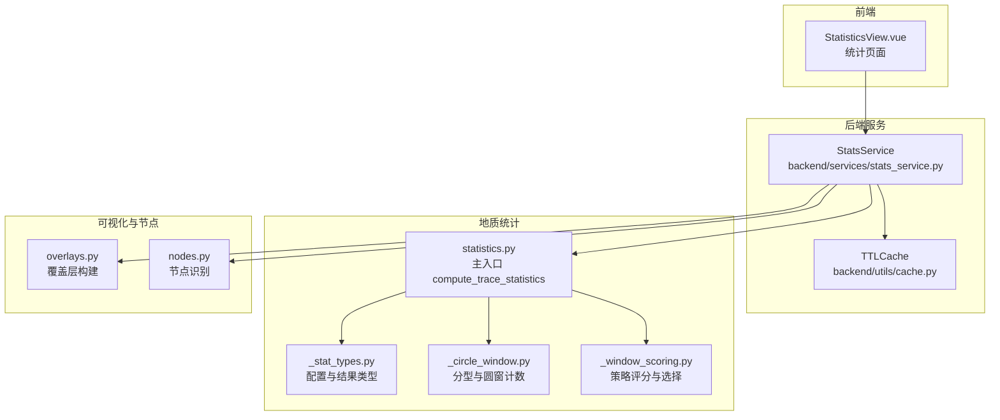
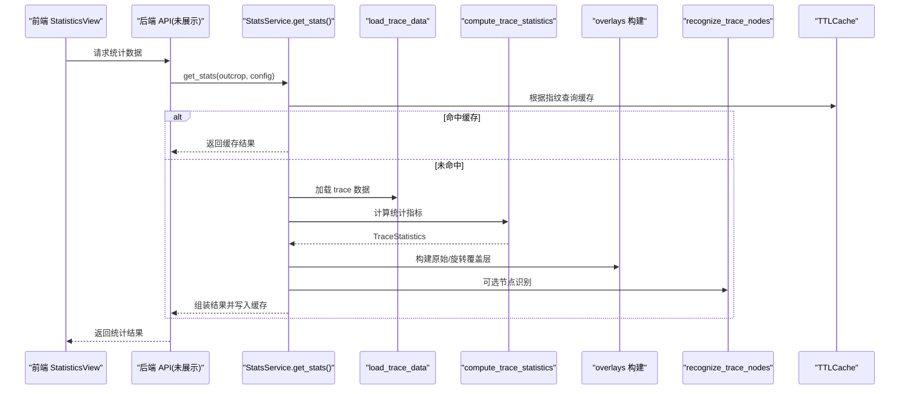
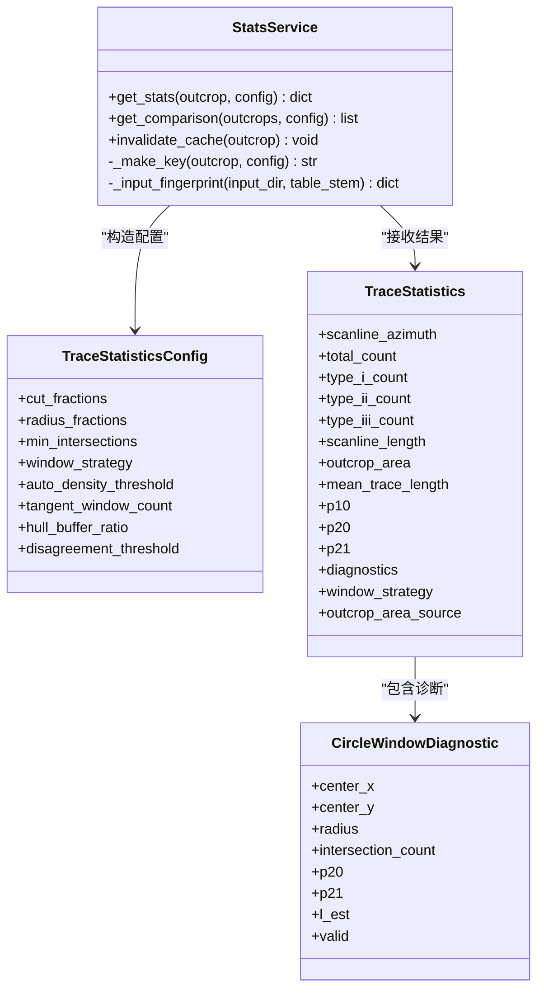

# 统计分析服务

<cite>
**本文引用的文件列表**
- [backend/services/stats_service.py](file://backend/services/stats_service.py)
- [trace_pipeline/geology/statistics.py](file://trace_pipeline/geology/statistics.py)
- [trace_pipeline/geology/_stat_types.py](file://trace_pipeline/geology/_stat_types.py)
- [trace_pipeline/geology/_circle_window.py](file://trace_pipeline/geology/_circle_window.py)
- [trace_pipeline/geology/_window_scoring.py](file://trace_pipeline/geology/_window_scoring.py)
- [trace_pipeline/plotting/overlays.py](file://trace_pipeline/plotting/overlays.py)
- [trace_pipeline/analysis/nodes.py](file://trace_pipeline/analysis/nodes.py)
- [backend/utils/cache.py](file://backend/utils/cache.py)
- [tests/test_stats_service.py](file://tests/test_stats_service.py)
- [tests/test_statistics.py](file://tests/test_statistics.py)
- [frontend/src/views/StatisticsView.vue](file://frontend/src/views/StatisticsView.vue)
</cite>

## 目录
1. [简介](#简介)
2. [项目结构](#项目结构)
3. [核心组件](#核心组件)
4. [架构总览](#架构总览)
5. [详细组件分析](#详细组件分析)
6. [依赖关系分析](#依赖关系分析)
7. [性能与并发](#性能与并发)
8. [故障排查指南](#故障排查指南)
9. [结论](#结论)
10. [附录：使用示例与最佳实践](#附录使用示例与最佳实践)

## 简介
本技术文档聚焦于 TracePipeline 的统计分析服务，围绕 StatsService 类展开，系统阐述其统计计算能力（密度统计、平均迹长估计、比较分析）、圆窗策略选择、指标计算与结果验证机制。文档同时说明与 geology/statistics 模块的集成方式、数据流处理、缓存策略、内存管理与并发访问控制，并提供前端可视化与后端 API 的交互路径，帮助读者快速理解并扩展该服务。

## 项目结构
统计分析服务位于后端 services 层，核心为 StatsService；底层地质统计算法位于 trace_pipeline.geology 子包；绘图覆盖层构建在 plotting.overlays；节点识别在 analysis.nodes；TTL 缓存工具在 backend.utils.cache；前端统计页面在 frontend/src/views/StatisticsView.vue。

图表来源
- [backend/services/stats_service.py:1-380](file://backend/services/stats_service.py#L1-L380)
- [trace_pipeline/geology/statistics.py:1-391](file://trace_pipeline/geology/statistics.py#L1-L391)
- [trace_pipeline/geology/_stat_types.py:1-125](file://trace_pipeline/geology/_stat_types.py#L1-L125)
- [trace_pipeline/geology/_circle_window.py:1-269](file://trace_pipeline/geology/_circle_window.py#L1-L269)
- [trace_pipeline/geology/_window_scoring.py:1-323](file://trace_pipeline/geology/_window_scoring.py#L1-L323)
- [trace_pipeline/plotting/overlays.py:1-156](file://trace_pipeline/plotting/overlays.py#L1-L156)
- [trace_pipeline/analysis/nodes.py:1-417](file://trace_pipeline/analysis/nodes.py#L1-L417)
- [backend/utils/cache.py:1-155](file://backend/utils/cache.py#L1-L155)
- [frontend/src/views/StatisticsView.vue:1-612](file://frontend/src/views/StatisticsView.vue#L1-L612)

章节来源
- [backend/services/stats_service.py:1-380](file://backend/services/stats_service.py#L1-L380)
- [trace_pipeline/geology/statistics.py:1-391](file://trace_pipeline/geology/statistics.py#L1-L391)

## 核心组件
- StatsService：对外提供 get_stats() 与 get_comparison() 接口，负责输入校验、指纹生成、缓存命中、数据加载、统计计算、覆盖层构建、节点识别、结果组装与日志记录。
- statistics.compute_trace_statistics：核心统计流水线，包含测线长度估算、局部坐标变换、I/II/III 分型、圆窗诊断与策略选择、面积回退链、P10/P20/P21 计算与一致性校验。
- _stat_types：TraceStatisticsConfig、CircleWindowDiagnostic、TraceStatistics 等不可变数据结构定义与参数校验。
- _circle_window：向量化迹线分型与批量圆窗相交计数，输出 p20/p21/l_est 等指标。
- _window_scoring：六因子加权评分与自动策略选择（tangent/hybrid/concentric），聚合有效分组指标。
- overlays：将统计诊断与凸包信息转换为原始/旋转坐标系下的覆盖层几何，供前端叠加显示。
- nodes：基于包围盒筛选与精确相交检测的节点识别，支持 X/Y/I 分类与拓扑值计算。
- TTLCache：线程安全的 TTL + LRU 缓存，支持前缀失效与批量驱逐。

章节来源
- [backend/services/stats_service.py:35-380](file://backend/services/stats_service.py#L35-L380)
- [trace_pipeline/geology/statistics.py:212-391](file://trace_pipeline/geology/statistics.py#L212-L391)
- [trace_pipeline/geology/_stat_types.py:14-125](file://trace_pipeline/geology/_stat_types.py#L14-L125)
- [trace_pipeline/geology/_circle_window.py:12-269](file://trace_pipeline/geology/_circle_window.py#L12-L269)
- [trace_pipeline/geology/_window_scoring.py:178-323](file://trace_pipeline/geology/_window_scoring.py#L178-L323)
- [trace_pipeline/plotting/overlays.py:33-156](file://trace_pipeline/plotting/overlays.py#L33-L156)
- [trace_pipeline/analysis/nodes.py:160-417](file://trace_pipeline/analysis/nodes.py#L160-L417)
- [backend/utils/cache.py:18-90](file://backend/utils/cache.py#L18-L90)

## 架构总览
下图展示了从前端到后端再到地质统计与可视化的完整调用链路。

图表来源
- [backend/services/stats_service.py:101-342](file://backend/services/stats_service.py#L101-L342)
- [trace_pipeline/geology/statistics.py:212-391](file://trace_pipeline/geology/statistics.py#L212-L391)
- [trace_pipeline/plotting/overlays.py:33-156](file://trace_pipeline/plotting/overlays.py#L33-L156)
- [trace_pipeline/analysis/nodes.py:160-417](file://trace_pipeline/analysis/nodes.py#L160-L417)
- [backend/utils/cache.py:40-64](file://backend/utils/cache.py#L40-L64)

## 详细组件分析

### StatsService 类
职责与流程
- 输入校验与指纹生成：对 outcrop 名称进行校验；基于关键配置字段与输入 Excel 文件的 mtime/size 生成稳定哈希键，避免无关字段导致缓存失效。
- 缓存策略：TTL=300s，最大条目 128；get_stats/get_comparison 优先命中缓存，缺失则重新计算。
- 数据加载：通过 load_trace_data 读取已处理结果，若为空或异常则返回错误信息。
- 统计计算：构造 TraceStatisticsConfig，调用 compute_trace_statistics 获取综合指标。
- 覆盖层与节点：构建原始/旋转圆窗与凸包覆盖层；可选节点识别，输出节点与交点详情。
- 结果组装：包含基本指标、直方图、窗口几何、节点摘要、覆盖层边界与顶点、警告信息等。
- 日志与计时：记录关键阶段耗时与指标，便于性能分析与问题定位。

关键方法
- get_stats(outcrop, config)：单露头统计计算与缓存。
- get_comparison(outcrops, config)：多露头对比，保持输入顺序，复用缓存。
- invalidate_cache(outcrop=None)：清空全部或按前缀失效。

章节来源
- [backend/services/stats_service.py:35-380](file://backend/services/stats_service.py#L35-L380)
- [tests/test_stats_service.py:6-50](file://tests/test_stats_service.py#L6-L50)

### 统计核心：compute_trace_statistics
整体流程
- 测线长度估算：优先使用实测长度，否则基于 scanline_positions 中位数间距估计。
- 局部坐标变换：依据 scanline_azimuth 将端点转换至测线局部坐标系。
- I/II/III 分型：向量化判断线段与测线的相交关系。
- 圆窗诊断与策略选择：独立于面积计算，先计算 hull_area，再选择最佳策略并产出诊断集合。
- 面积回退链：实测 -> 原始凸包 -> 缓冲凸包 -> 圆窗等效面积，含自适应差异阈值与告警。
- P10/P20/P21 计算：优先基于有效面积与观测迹长，否则回退到圆窗估计值。
- 一致性校验：比较主 P20/P21 与圆窗估计值的相对差异，超过自适应阈值则发出警告。

复杂度与优化
- 分型与圆窗计数采用 NumPy 广播与向量化，避免 Python 循环开销。
- 面积回退链仅在必要时计算缓冲凸包，减少冗余计算。
- 自适应阈值随样本量衰减，提升稳定性。

章节来源
- [trace_pipeline/geology/statistics.py:51-391](file://trace_pipeline/geology/statistics.py#L51-L391)
- [tests/test_statistics.py:63-292](file://tests/test_statistics.py#L63-L292)

### 圆窗策略与评分
策略族
- tangent：切线半径，适合低密度场景。
- hybrid：混合策略，兼顾空间覆盖与稳定性。
- concentric：同心圆策略，适合高密度场景。

评分维度（六因子）
- 有效分组数量与比例
- 空间覆盖（侧向与沿测线）
- 稳定性（l_est/p20/p21 组内变异系数）
- 半径大小（中位数半径与最大半径比值）
- 样本充分性（相交迹线数目标）

自动选择逻辑
- 当所有策略得分非正时回退最保守策略（tangent）。
- 存在有效候选时，结合“密度偏好”与容差容忍度，优先选择更稳健的策略。

章节来源
- [trace_pipeline/geology/_window_scoring.py:178-323](file://trace_pipeline/geology/_window_scoring.py#L178-L323)
- [trace_pipeline/geology/_circle_window.py:71-216](file://trace_pipeline/geology/_circle_window.py#L71-L216)

### 覆盖层与节点识别
覆盖层构建
- 原始坐标系圆窗：基于诊断中心与半径，反转到全局坐标。
- 旋转坐标系圆窗：将原始覆盖层旋转到测线坐标系。
- 凸包覆盖层：根据 outcrop_area_source 选择原始或缓冲凸包顶点，并生成旋转版本。

节点识别
- 预处理：退化线段过滤、AABB 包围盒预计算。
- 相交检测：向量化邻居筛选 + 精确 segment_intersection。
- 端点接近检测：网格分桶 + 并查集聚类合并。
- 节点分类：X/Y/I 类型与拓扑值（degree）计算。

章节来源
- [trace_pipeline/plotting/overlays.py:33-156](file://trace_pipeline/plotting/overlays.py#L33-L156)
- [trace_pipeline/analysis/nodes.py:160-417](file://trace_pipeline/analysis/nodes.py#L160-L417)

### 数据类型与配置
- TraceStatisticsConfig：严格校验 cut_fractions/radius_fractions/min_intersections/window_strategy/auto_density_threshold/tangent_window_count/hull_buffer_ratio/disagreement_threshold 等参数。
- CircleWindowDiagnostic：单个圆窗的诊断结果，包含相交计数、n0/n1/n2、m/q、p20/p21/l_est、有效性标志与原因。
- TraceStatistics：汇总统计结果，含来源标记（如 area_source、p20_source、p21_source）、诊断集合与辅助字段。

章节来源
- [trace_pipeline/geology/_stat_types.py:14-125](file://trace_pipeline/geology/_stat_types.py#L14-L125)

## 依赖关系分析

图表来源
- [backend/services/stats_service.py:35-380](file://backend/services/stats_service.py#L35-L380)
- [trace_pipeline/geology/_stat_types.py:14-125](file://trace_pipeline/geology/_stat_types.py#L14-L125)
- [trace_pipeline/geology/statistics.py:212-391](file://trace_pipeline/geology/statistics.py#L212-L391)

章节来源
- [backend/services/stats_service.py:35-380](file://backend/services/stats_service.py#L35-L380)
- [trace_pipeline/geology/_stat_types.py:14-125](file://trace_pipeline/geology/_stat_types.py#L14-L125)

## 性能与并发
- 缓存策略
  - TTL=300s，LRU 上限 128 条；批量驱逐每 3 次 set 触发一次过期清理，降低锁竞争。
  - 键生成仅考虑影响统计的关键配置字段与输入文件指纹，避免无关变更导致缓存失效。
- 并发安全
  - TTLCache 使用 RLock 保护读写与淘汰操作，支持多线程环境。
  - 统计计算本身为 CPU 密集，建议在上层做请求去抖与批处理。
- 计算优化
  - 分型与圆窗计数采用向量化矩阵运算，避免逐段循环。
  - 面积回退链按需计算缓冲凸包，减少不必要的几何操作。
  - 自适应阈值随样本量衰减，提高小样本稳定性与大样本严谨性。

章节来源
- [backend/utils/cache.py:18-90](file://backend/utils/cache.py#L18-L90)
- [backend/services/stats_service.py:88-100](file://backend/services/stats_service.py#L88-L100)
- [trace_pipeline/geology/_circle_window.py:71-216](file://trace_pipeline/geology/_circle_window.py#L71-L216)
- [trace_pipeline/geology/statistics.py:106-166](file://trace_pipeline/geology/statistics.py#L106-L166)

## 故障排查指南
常见问题与定位
- 输入文件缺失或权限问题
  - 现象：get_stats 返回 error 字段。
  - 定位：检查 input_dir 与表名前缀是否正确，确认 .xlsx/.xls 是否存在且可读。
- 无迹线数据
  - 现象：提示不包含任何迹线。
  - 定位：确认 trace.count 与 endpoints 是否为空。
- 面积来源降级
  - 现象：area_source 为 hull_buffered 或 window_equivalent，并伴随 warning。
  - 定位：查看出露面积回退链与差异比率，调整 hull_buffer_ratio 或 min_intersections。
- 圆窗策略不稳定
  - 现象：不同运行策略切换或指标波动较大。
  - 定位：检查 auto_density_threshold、tangent_window_count、min_intersections；观察评分与有效分组数量。
- 节点识别跳过退化线段
  - 现象：degenerate_skipped > 0。
  - 定位：增大 merge_tolerance 或检查端点精度。

章节来源
- [backend/services/stats_service.py:101-142](file://backend/services/stats_service.py#L101-L142)
- [trace_pipeline/geology/statistics.py:279-336](file://trace_pipeline/geology/statistics.py#L279-L336)
- [trace_pipeline/analysis/nodes.py:208-222](file://trace_pipeline/analysis/nodes.py#L208-L222)

## 结论
StatsService 以稳定的缓存键与高效的向量化算法为核心，实现了从数据加载、统计计算、策略选择、面积回退、指标校验到覆盖层与节点识别的一体化流程。其设计在保证正确性的同时兼顾性能与可维护性，并通过前端可视化形成闭环，便于用户直观理解与分析裂隙网络特征。

## 附录：使用示例与最佳实践

- 自定义统计方法
  - 通过修改 TraceStatisticsConfig 的参数（如 window_strategy、auto_density_threshold、tangent_window_count、hull_buffer_ratio、disagreement_threshold）来定制行为。
  - 参考：[trace_pipeline/geology/_stat_types.py:14-65](file://trace_pipeline/geology/_stat_types.py#L14-L65)

- 批量计算
  - 使用 get_comparison(outcrops, config) 一次性获取多个露头的统计，内部会复用缓存并按输入顺序返回。
  - 参考：[backend/services/stats_service.py:344-361](file://backend/services/stats_service.py#L344-L361)

- 结果可视化
  - 前端 StatisticsView 通过 api.get_stats 获取结果，渲染 StatCards、HistogramChart、PieChart，并加载原始/旋转/玫瑰图缩略图与大图查看器。
  - 参考：[frontend/src/views/StatisticsView.vue:204-256](file://frontend/src/views/StatisticsView.vue#L204-L256)、[frontend/src/components/StatCards.vue:56-73](file://frontend/src/components/StatCards.vue#L56-L73)

- 覆盖层叠加
  - 使用 overlays 提供的函数构建原始/旋转圆窗与凸包覆盖层，配合前端 Canvas 绘制。
  - 参考：[trace_pipeline/plotting/overlays.py:33-114](file://trace_pipeline/plotting/overlays.py#L33-L114)

- 节点识别开关
  - 通过 enable_node_recognition、node_merge_tolerance、show_node_overlay、node_label_mode 控制节点识别与显示。
  - 参考：[backend/services/stats_service.py:191-202](file://backend/services/stats_service.py#L191-L202)、[trace_pipeline/analysis/nodes.py:160-180](file://trace_pipeline/analysis/nodes.py#L160-L180)

- 缓存管理
  - 手动失效：invalidate_cache(outcrop) 可按前缀失效；全量失效传入 None。
  - 参考：[backend/services/stats_service.py:363-379](file://backend/services/stats_service.py#L363-L379)、[backend/utils/cache.py:65-79](file://backend/utils/cache.py#L65-L79)

- 单元测试参考
  - 缓存键变化与输入指纹：确保配置或文件变更能正确使缓存失效。
  - 统计核心：测线长度估算、分型、圆窗计数、凸包面积、策略选择与主入口计算。
  - 参考：[tests/test_stats_service.py:6-50](file://tests/test_stats_service.py#L6-L50)、[tests/test_statistics.py:63-292](file://tests/test_statistics.py#L63-L292)