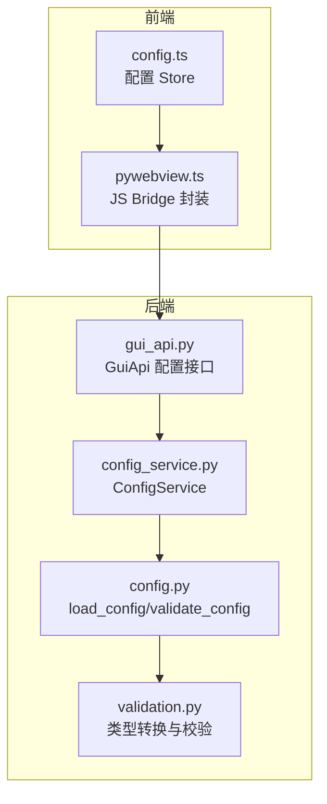
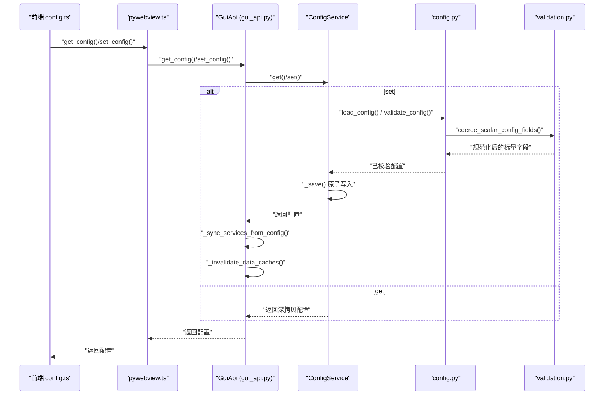
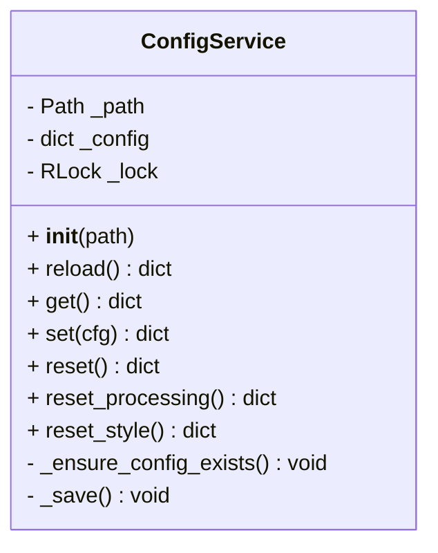
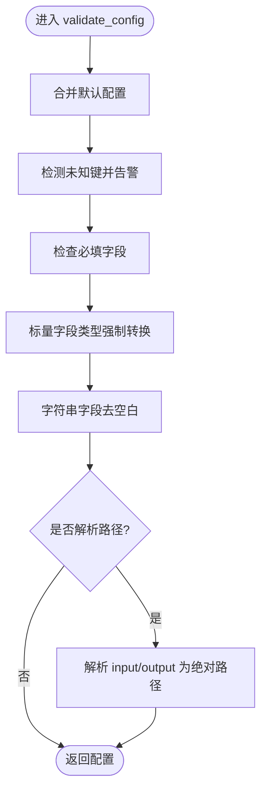
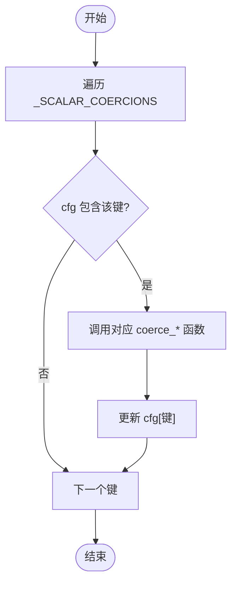
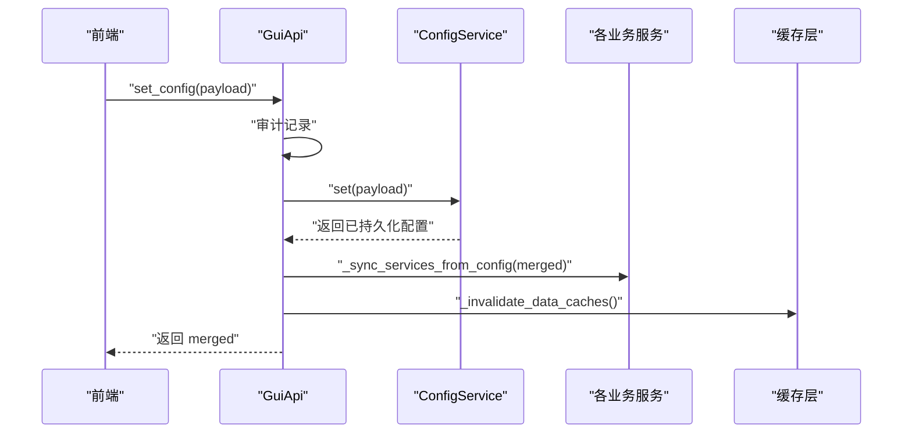
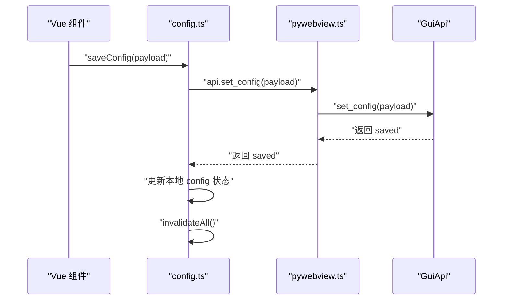

# 配置服务

<cite>
**本文引用的文件**   
- [backend/services/config_service.py](file://backend/services/config_service.py)
- [trace_pipeline/config.py](file://trace_pipeline/config.py)
- [trace_pipeline/validation.py](file://trace_pipeline/validation.py)
- [backend/gui_api.py](file://backend/gui_api.py)
- [frontend/src/stores/config.ts](file://frontend/src/stores/config.ts)
- [frontend/src/api/pywebview.ts](file://frontend/src/api/pywebview.ts)
- [config.example.json](file://config.example.json)
</cite>

## 目录
1. [简介](#简介)
2. [项目结构](#项目结构)
3. [核心组件](#核心组件)
4. [架构总览](#架构总览)
5. [详细组件分析](#详细组件分析)
6. [依赖关系分析](#依赖关系分析)
7. [性能与并发特性](#性能与并发特性)
8. [故障排查指南](#故障排查指南)
9. [结论](#结论)
10. [附录：最佳实践与示例路径](#附录最佳实践与示例路径)

## 简介
本技术文档围绕 TracePipeline 的配置服务展开，重点解析 ConfigService 类的配置管理架构，包括配置文件的读写、校验与持久化机制；说明配置结构定义、默认值管理与类型转换逻辑；阐述配置热重载、变更监听与缓存同步策略；解释全局配置、处理参数与样式配置的分离管理；并给出验证规则、安全检查与错误提示机制。文末提供具体代码示例路径，展示配置操作、自定义验证器与配置迁移的最佳实践。

## 项目结构
配置相关代码分布在后端服务层、配置核心库、前端状态与桥接层：
- 后端服务层：ConfigService 负责 config.json 的原子写入、合并、重置与线程安全访问；GuiApi 暴露前端可调用的配置 API，并在变更后同步下游服务与失效缓存。
- 配置核心库：config.py 提供默认配置、加载/校验、路径解析、工作目录保障等；validation.py 提供标量字段类型强制转换与枚举校验。
- 前端：stores/config.ts 封装配置读取/保存/重置流程，调用 pywebview.ts 提供的 JS Bridge 方法，并在成功后使本地缓存失效。

图示来源
- [backend/gui_api.py:263-333](file://backend/gui_api.py#L263-L333)
- [backend/services/config_service.py:41-144](file://backend/services/config_service.py#L41-L144)
- [trace_pipeline/config.py:86-190](file://trace_pipeline/config.py#L86-L190)
- [trace_pipeline/validation.py:90-112](file://trace_pipeline/validation.py#L90-L112)
- [frontend/src/stores/config.ts:14-71](file://frontend/src/stores/config.ts#L14-L71)
- [frontend/src/api/pywebview.ts:294-300](file://frontend/src/api/pywebview.ts#L294-L300)

章节来源
- [backend/services/config_service.py:41-144](file://backend/services/config_service.py#L41-L144)
- [trace_pipeline/config.py:86-190](file://trace_pipeline/config.py#L86-L190)
- [trace_pipeline/validation.py:90-112](file://trace_pipeline/validation.py#L90-L112)
- [backend/gui_api.py:263-333](file://backend/gui_api.py#L263-L333)
- [frontend/src/stores/config.ts:14-71](file://frontend/src/stores/config.ts#L14-L71)
- [frontend/src/api/pywebview.ts:294-300](file://frontend/src/api/pywebview.ts#L294-L300)

## 核心组件
- ConfigService（后端）
  - 职责：作为 config.json 的唯一写入入口，提供 get/set/reset/reset_processing/reset_style 等接口；内部使用 RLock 保证并发安全；采用“先写临时文件再替换”的原子写入策略，避免中断损坏配置。
  - 关键行为：reload 从磁盘重新加载；set 在合并前主动 reload 以获取最新磁盘值，防止覆盖外部修改；_save 异常时清理 .tmp 文件。
- 配置核心库（config.py + validation.py）
  - DEFAULT_CONFIG 与 ConfigDict：定义所有配置键及默认值；validate_config 合并默认值、检查必填项、规范化类型、解析绝对路径；apply_cli_overrides 支持 CLI 覆盖；ensure_workspace_dirs 自动创建 input/output/logs 目录。
  - validation.py：提供 coerce_bool/coerce_positive_int/coerce_positive_float/coerce_window_strategy/coerce_node_label_mode/coerce_rose_bin_width 等标量转换函数，并通过 _SCALAR_COERCIONS 映射集中应用。
- GuiApi（后端）
  - 暴露 get_config/set_config/reset_config/reset_processing_config/reset_style_config 等前端可调用方法；在 set/reset 后调用 _sync_services_from_config 将新配置同步到各服务，并触发数据缓存失效。
- 前端（config.ts + pywebview.ts）
  - stores/config.ts 提供 load/save/reset 等方法，调用 api.get_config/set_config/reset_config 等，并在成功后 invalidateAll 使缓存失效；pywebview.ts 提供 ready 等待与 mock 回退。

章节来源
- [backend/services/config_service.py:41-144](file://backend/services/config_service.py#L41-L144)
- [trace_pipeline/config.py:56-79](file://trace_pipeline/config.py#L56-L79)
- [trace_pipeline/config.py:86-190](file://trace_pipeline/config.py#L86-L190)
- [trace_pipeline/validation.py:90-112](file://trace_pipeline/validation.py#L90-L112)
- [backend/gui_api.py:263-333](file://backend/gui_api.py#L263-L333)
- [frontend/src/stores/config.ts:14-71](file://frontend/src/stores/config.ts#L14-L71)
- [frontend/src/api/pywebview.ts:294-300](file://frontend/src/api/pywebview.ts#L294-L300)

## 架构总览
配置服务的端到端调用链如下：前端通过 pywebview.ts 调用后端 GuiApi 的配置接口，GuiApi 委托 ConfigService 完成配置读取/合并/校验/持久化，并在变更后同步下游服务与失效缓存。

图示来源
- [backend/gui_api.py:263-333](file://backend/gui_api.py#L263-L333)
- [backend/services/config_service.py:68-101](file://backend/services/config_service.py#L68-L101)
- [trace_pipeline/config.py:86-190](file://trace_pipeline/config.py#L86-L190)
- [trace_pipeline/validation.py:107-112](file://trace_pipeline/validation.py#L107-L112)
- [frontend/src/stores/config.ts:14-35](file://frontend/src/stores/config.ts#L14-L35)
- [frontend/src/api/pywebview.ts:294-300](file://frontend/src/api/pywebview.ts#L294-L300)

## 详细组件分析

### ConfigService 类分析
- 设计要点
  - 唯一写入入口：所有配置变更必须经过 set/reset/reset_processing/reset_style，确保校验与持久化一致。
  - 线程安全：使用 RLock 保护 get/set/reload/reset 等关键路径。
  - 原子写入：_save 先写 .tmp 再 replace，异常时清理 .tmp，避免脏配置。
  - 内存一致性：set 先 reload 再合并，避免覆盖外部修改。
- 关键方法
  - reload：若文件不存在则自动创建默认配置；存在则 load_config 并记录日志。
  - get：返回深拷贝，防止外部修改内部状态。
  - set：合并新配置，validate_config 校验后 _save。
  - reset/reset_processing/reset_style：分别恢复全量/仅处理参数/仅样式为默认。
  - _ensure_config_exists：首次启动或无配置文件时幂等创建默认配置。

图示来源
- [backend/services/config_service.py:41-144](file://backend/services/config_service.py#L41-L144)

章节来源
- [backend/services/config_service.py:41-144](file://backend/services/config_service.py#L41-L144)

### 配置结构与默认值管理（config.py）
- 配置字典类型与默认值
  - ConfigDict TypedDict 定义了全部键及其类型；DEFAULT_CONFIG 提供完整默认值。
- 加载与校验
  - load_config：支持显式路径与默认路径；不存在时根据是否显式路径决定抛出错误或返回默认配置；JSON 解析失败与读取失败均抛出明确异常。
  - validate_config：合并默认值、忽略未知键并告警、检查必填项（input_dir/output_dir/outcrop），process_all=False 时对 table_stem 做额外必填检查；对布尔与标量字段进行类型强制转换；可选地将 input_dir/output_dir 解析为绝对路径。
- 路径与工作目录
  - resolve_config_base_dir/_to_absolute：基于配置文件所在目录或项目根解析相对路径。
  - resolve_io_paths：解析输入输出目录并确保存在（CLI 只读模式可禁用创建）。
  - ensure_workspace_dirs：自动创建 input/output/logs 目录，权限不足仅警告。

图示来源
- [trace_pipeline/config.py:148-190](file://trace_pipeline/config.py#L148-L190)
- [trace_pipeline/config.py:212-245](file://trace_pipeline/config.py#L212-L245)
- [trace_pipeline/config.py:264-312](file://trace_pipeline/config.py#L264-L312)

章节来源
- [trace_pipeline/config.py:56-79](file://trace_pipeline/config.py#L56-L79)
- [trace_pipeline/config.py:86-190](file://trace_pipeline/config.py#L86-L190)
- [trace_pipeline/config.py:212-245](file://trace_pipeline/config.py#L212-L245)
- [trace_pipeline/config.py:264-312](file://trace_pipeline/config.py#L264-L312)

### 类型转换与验证规则（validation.py）
- 布尔转换：coerce_bool 接受多种常见写法（true/false/1/0/on/off 等）。
- 正整数/正浮点：coerce_positive_int/coerce_positive_float 严格限制为正数且有限值。
- 枚举与范围：coerce_window_strategy 限定 auto/tangent/hybrid/concentric；coerce_node_label_mode 限定 none/type/id；coerce_rose_bin_width 限定 (0, 180]。
- 批量应用：coerce_scalar_config_fields 通过 _SCALAR_COERCIONS 映射统一执行转换。

图示来源
- [trace_pipeline/validation.py:90-112](file://trace_pipeline/validation.py#L90-L112)

章节来源
- [trace_pipeline/validation.py:26-88](file://trace_pipeline/validation.py#L26-L88)
- [trace_pipeline/validation.py:90-112](file://trace_pipeline/validation.py#L90-L112)

### GUI 配置接口与缓存同步（gui_api.py）
- 接口方法
  - get_config：返回当前配置（来自 ConfigService.get）。
  - set_config：审计记录 → ConfigService.set → 同步服务 → 失效数据缓存。
  - reset_config/reset_processing_config/reset_style_config：分别调用 ConfigService 对应方法，随后同步与失效缓存。
- 运行期覆盖白名单
  - _RUN_OVERRIDE_KEYS 限制 run_pipeline 中允许前端覆盖的字段（处理参数与样式/并行度），禁止覆盖路径/目标字段，增强安全性。
- 服务同步与缓存失效
  - _sync_services_from_config：将新配置传播到各服务（如 PipelineService、PreviewService 等）。
  - _invalidate_data_caches：使文件扫描、统计等缓存失效，确保后续操作使用最新配置。

图示来源
- [backend/gui_api.py:263-333](file://backend/gui_api.py#L263-L333)
- [backend/gui_api.py:388-445](file://backend/gui_api.py#L388-L445)

章节来源
- [backend/gui_api.py:263-333](file://backend/gui_api.py#L263-L333)
- [backend/gui_api.py:388-445](file://backend/gui_api.py#L388-L445)

### 前端配置 Store 与桥接（config.ts + pywebview.ts）
- config.ts
  - loadConfig/saveConfig/resetConfig/resetProcessingConfig/resetStyleConfig：调用后端 API，成功后更新本地状态并 invalidateAll 使缓存失效。
  - hydrateConfig：仅更新本地状态，不触发持久化，用于从后端拉取后直接注入。
- pywebview.ts
  - ready：等待后端 API 就绪事件，超时放行以支持 mock 模式。
  - api.*：为每个后端方法提供 TypeScript 包装，便于前端调用。

图示来源
- [frontend/src/stores/config.ts:14-71](file://frontend/src/stores/config.ts#L14-L71)
- [frontend/src/api/pywebview.ts:294-300](file://frontend/src/api/pywebview.ts#L294-L300)

章节来源
- [frontend/src/stores/config.ts:14-71](file://frontend/src/stores/config.ts#L14-L71)
- [frontend/src/api/pywebview.ts:294-300](file://frontend/src/api/pywebview.ts#L294-L300)

### 配置域分离管理
- 全局配置：input_dir/output_dir/output_prefix/table_stem/outcrop 等路径与任务标识字段。
- 处理配置：process_all/export_rose_plot/rose_dpi/trace_dpi/rotated_trace_dpi/window_strategy/auto_density_threshold/tangent_window_count/min_intersections/enable_node_recognition/node_merge_tolerance/show_node_overlay/is_dev_mode/node_label_mode 等。
- 样式配置：style 子对象，独立于处理参数，reset_style 仅清空 style。
- 重置粒度：reset_processing 仅重置处理参数，保留路径与样式；reset_style 仅重置样式，保留路径与处理参数。

章节来源
- [backend/services/config_service.py:21-38](file://backend/services/config_service.py#L21-L38)
- [backend/services/config_service.py:110-126](file://backend/services/config_service.py#L110-L126)
- [trace_pipeline/config.py:56-79](file://trace_pipeline/config.py#L56-L79)

## 依赖关系分析
- 模块耦合
  - ConfigService 依赖 config.py 的 load_config/validate_config 与 DEFAULT_CONFIG/DEFAULT_CONFIG_PATH。
  - config.py 依赖 validation.py 的 coerce_* 函数族。
  - GuiApi 依赖 ConfigService 与各业务服务，并在配置变更后同步与失效缓存。
  - 前端 config.ts 依赖 pywebview.ts 的 API 封装。
- 潜在循环依赖
  - config.py 与 validation.py 之间为单向依赖（config 调用 validation），无循环。
- 外部依赖
  - json/pathlib/threading/logging 等标准库；GUI 层依赖 webview/PIL 等。

图示来源
- [backend/services/config_service.py:12-17](file://backend/services/config_service.py#L12-L17)
- [trace_pipeline/config.py:19](file://trace_pipeline/config.py#L19)
- [backend/gui_api.py:24-35](file://backend/gui_api.py#L24-L35)
- [frontend/src/stores/config.ts:1-5](file://frontend/src/stores/config.ts#L1-L5)
- [frontend/src/api/pywebview.ts:294-300](file://frontend/src/api/pywebview.ts#L294-L300)

章节来源
- [backend/services/config_service.py:12-17](file://backend/services/config_service.py#L12-L17)
- [trace_pipeline/config.py:19](file://trace_pipeline/config.py#L19)
- [backend/gui_api.py:24-35](file://backend/gui_api.py#L24-L35)
- [frontend/src/stores/config.ts:1-5](file://frontend/src/stores/config.ts#L1-L5)
- [frontend/src/api/pywebview.ts:294-300](file://frontend/src/api/pywebview.ts#L294-L300)

## 性能与并发特性
- 并发安全
  - ConfigService 使用 RLock 保护关键路径，避免多线程竞争导致配置不一致。
- I/O 性能
  - 原子写入（.tmp + replace）降低写入中断风险；json.dumps 使用 ensure_ascii=False 与 indent=2 提升可读性。
- 缓存策略
  - GuiApi 在配置变更后主动失效数据缓存，确保后续操作使用最新配置；前端 store 在保存成功后也失效本地缓存。
- 预热与懒加载
  - GuiApi 预加载 PathSecurityChecker/ConfigService/FileService/LogService；其他服务按需懒加载，减少启动开销。

章节来源
- [backend/services/config_service.py:47-51](file://backend/services/config_service.py#L47-L51)
- [backend/services/config_service.py:128-144](file://backend/services/config_service.py#L128-L144)
- [backend/gui_api.py:64-109](file://backend/gui_api.py#L64-L109)
- [backend/gui_api.py:273-291](file://backend/gui_api.py#L273-L291)

## 故障排查指南
- JSON 解析失败
  - 现象：load_config 抛出 ValueError，提示非合法 JSON。
  - 排查：检查 config.json 语法；确认 UTF-8 编码；查看日志中的 stage=config_load 与 error_type=JSONDecodeError。
- 读取失败
  - 现象：OSError，无法读取配置文件。
  - 排查：确认文件权限与路径；查看日志中的 stage=config_load 与 error_type=OSError。
- 缺少必要字段
  - 现象：ValueError，提示缺少必要配置字段。
  - 排查：补齐 input_dir/output_dir/outcrop；当 process_all=False 时需补充 table_stem。
- 类型转换错误
  - 现象：coerce_* 抛出 ValueError，提示必须为正整数/正数/布尔值等。
  - 排查：修正字段类型与取值范围（如 rose_bin_width 需在 (0, 180]）。
- 路径越权
  - 现象：PathSecurityChecker.safe_path 拒绝路径（包含 ..、Windows 设备名、不在 base 内）。
  - 排查：确保路径在项目根或可信目录内；避免 URL 双重编码绕过。
- 写入失败
  - 现象：_save 抛出异常（PermissionError/OSError/TypeError）。
  - 排查：确认磁盘空间与权限；检查 .tmp 残留；查看日志定位阶段。

章节来源
- [trace_pipeline/config.py:110-145](file://trace_pipeline/config.py#L110-L145)
- [trace_pipeline/config.py:148-190](file://trace_pipeline/config.py#L148-L190)
- [trace_pipeline/validation.py:26-88](file://trace_pipeline/validation.py#L26-L88)
- [backend/utils/security.py:47-127](file://backend/utils/security.py#L47-L127)
- [backend/services/config_service.py:128-144](file://backend/services/config_service.py#L128-L144)

## 结论
TracePipeline 的配置服务以 ConfigService 为核心，结合 config.py 与 validation.py 实现强类型、强约束的配置管理；GuiApi 在配置变更后同步下游服务与失效缓存，保证系统一致性；前端通过 stores/config.ts 与 pywebview.ts 提供友好交互与开发回退。整体架构清晰、健壮，具备完善的校验、安全与错误提示机制，适合在生产环境中稳定运行。

## 附录：最佳实践与示例路径
- 配置操作
  - 读取配置：参考 [frontend/src/stores/config.ts:14-23](file://frontend/src/stores/config.ts#L14-L23) 与 [backend/gui_api.py:263-271](file://backend/gui_api.py#L263-L271)。
  - 保存配置：参考 [frontend/src/stores/config.ts:25-35](file://frontend/src/stores/config.ts#L25-L35) 与 [backend/gui_api.py:273-291](file://backend/gui_api.py#L273-L291)。
  - 重置配置：参考 [frontend/src/stores/config.ts:37-71](file://frontend/src/stores/config.ts#L37-L71) 与 [backend/gui_api.py:293-333](file://backend/gui_api.py#L293-L333)。
- 自定义验证器
  - 新增标量字段转换：在 [trace_pipeline/validation.py:90-112](file://trace_pipeline/validation.py#L90-L112) 的 _SCALAR_COERCIONS 中添加映射，并在 [trace_pipeline/config.py:179-180](file://trace_pipeline/config.py#L179-L180) 处被调用。
  - 新增枚举/范围校验：参考 [trace_pipeline/validation.py:63-87](file://trace_pipeline/validation.py#L63-L87) 的实现风格。
- 配置迁移
  - 新增字段默认值：在 [trace_pipeline/config.py:56-79](file://trace_pipeline/config.py#L56-L79) 的 DEFAULT_CONFIG 中添加；如需兼容旧配置，可在 validate_config 中增加迁移逻辑（例如将旧键映射到新键）。
  - 更新示例模板：同步更新 [config.example.json](file://config.example.json) 以便用户复制。
- 安全与路径
  - 路径安全校验：参考 [backend/utils/security.py:47-127](file://backend/utils/security.py#L47-L127)，确保所有文件操作限制在项目根或可信目录内。
  - 运行覆盖白名单：参考 [backend/gui_api.py:48-49](file://backend/gui_api.py#L48-L49) 的 _RUN_OVERRIDE_KEYS，避免前端覆盖敏感字段。

章节来源
- [frontend/src/stores/config.ts:14-71](file://frontend/src/stores/config.ts#L14-L71)
- [backend/gui_api.py:263-333](file://backend/gui_api.py#L263-L333)
- [trace_pipeline/validation.py:90-112](file://trace_pipeline/validation.py#L90-L112)
- [trace_pipeline/config.py:56-79](file://trace_pipeline/config.py#L56-L79)
- [config.example.json:1-26](file://config.example.json#L1-L26)
- [backend/utils/security.py:47-127](file://backend/utils/security.py#L47-L127)
- [backend/gui_api.py:48-49](file://backend/gui_api.py#L48-L49)