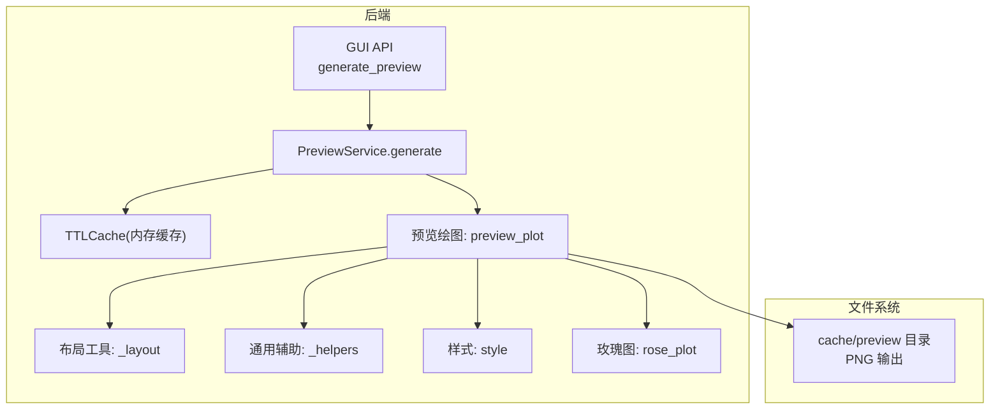
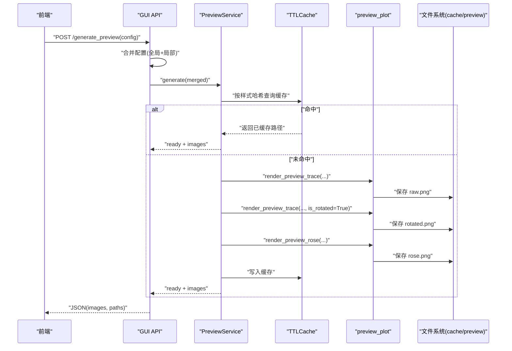
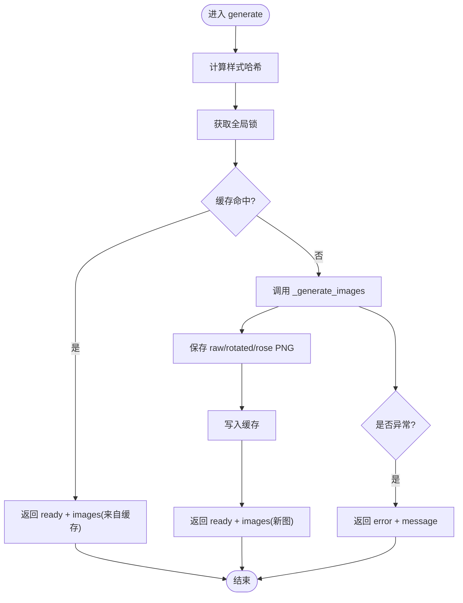
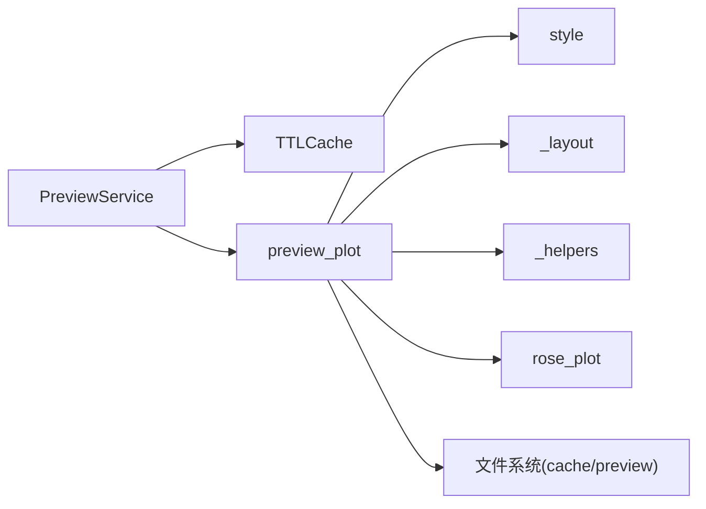

# 预览服务

<cite>
**本文引用的文件**
- [preview_service.py](file://backend/services/preview_service.py)
- [preview_plot.py](file://trace_pipeline/plotting/preview_plot.py)
- [style.py](file://trace_pipeline/plotting/style.py)
- [_layout.py](file://trace_pipeline/plotting/_layout.py)
- [_helpers.py](file://trace_pipeline/plotting/_helpers.py)
- [rose_plot.py](file://trace_pipeline/plotting/rose_plot.py)
- [cache.py](file://backend/utils/cache.py)
- [gui_api.py](file://backend/gui_api.py)
</cite>

## 目录
1. [简介](#简介)
2. [项目结构](#项目结构)
3. [核心组件](#核心组件)
4. [架构总览](#架构总览)
5. [详细组件分析](#详细组件分析)
6. [依赖关系分析](#依赖关系分析)
7. [性能与并发](#性能与并发)
8. [故障排查指南](#故障排查指南)
9. [结论](#结论)
10. [附录：最佳实践与示例路径](#附录最佳实践与示例路径)

## 简介
本技术文档聚焦于 TracePipeline 的预览服务，围绕 PreviewService 类的预览图生成功能展开，涵盖迹线图、玫瑰图和统计图表的快速渲染。重点解析 generate() 方法的实现逻辑（配置合并、临时数据生成、绘图参数定制、多图表组合），阐述缓存策略、内存管理与资源清理机制，说明与 plotting 模块的集成方式与样式应用，并解释异步处理、并发控制与错误隔离机制。文末提供自定义预览模板、性能优化与批量预览生成的最佳实践与代码片段路径。

## 项目结构
预览服务位于后端服务层，调用 trace_pipeline.plotting 下的独立预览绘图模块，使用 TTLCache 进行内存缓存，并通过 GUI API 暴露接口供前端调用。



图示来源
- [gui_api.py:600-628](file://backend/gui_api.py#L600-L628)
- [preview_service.py:37-90](file://backend/services/preview_service.py#L37-L90)
- [preview_plot.py:285-491](file://trace_pipeline/plotting/preview_plot.py#L285-L491)
- [_layout.py:362-391](file://trace_pipeline/plotting/_layout.py#L362-L391)
- [_helpers.py:42-93](file://trace_pipeline/plotting/_helpers.py#L42-L93)
- [style.py:187-255](file://trace_pipeline/plotting/style.py#L187-L255)
- [rose_plot.py:106-140](file://trace_pipeline/plotting/rose_plot.py#L106-L140)
- [cache.py:18-90](file://backend/utils/cache.py#L18-L90)

章节来源
- [gui_api.py:600-628](file://backend/gui_api.py#L600-L628)
- [preview_service.py:37-90](file://backend/services/preview_service.py#L37-L90)

## 核心组件
- PreviewService：对外提供 generate(config) 接口，负责缓存命中判断、并发锁保护、调用绘图函数、结果封装与日志记录。
- preview_plot：独立预览绘图模块，使用硬编码演示数据生成原始/旋转迹线图与玫瑰图，支持样式注入。
- style：统一 matplotlib 全局样式与字体栈，提供标题/正文字体参数与样式覆盖上下文管理器。
- _layout：共享布局常量与绘制工具（外框、比例尺带、统计框、图例等）。
- _helpers：图形创建、保存、指北针绘制、数据边界计算等通用能力。
- rose_plot：玫瑰花瓣图绘制与直方图计算。
- TTLCache：线程安全的 TTL + LRU 内存缓存，用于预览结果快速返回。
- GUI API：在 generate_preview 中合并配置并调用 PreviewService，同时做请求级并发控制。

章节来源
- [preview_service.py:37-167](file://backend/services/preview_service.py#L37-L167)
- [preview_plot.py:165-183](file://trace_pipeline/plotting/preview_plot.py#L165-L183)
- [style.py:187-296](file://trace_pipeline/plotting/style.py#L187-L296)
- [_layout.py:362-391](file://trace_pipeline/plotting/_layout.py#L362-L391)
- [_helpers.py:26-93](file://trace_pipeline/plotting/_helpers.py#L26-L93)
- [rose_plot.py:76-140](file://trace_pipeline/plotting/rose_plot.py#L76-L140)
- [cache.py:18-90](file://backend/utils/cache.py#L18-L90)
- [gui_api.py:600-628](file://backend/gui_api.py#L600-L628)

## 架构总览
预览服务采用“服务层 + 独立绘图模块”的解耦设计：服务层仅负责流程编排、缓存与并发控制；绘图模块完全基于演示数据，不依赖业务逻辑，确保预览稳定、可重复、高性能。



图示来源
- [gui_api.py:600-628](file://backend/gui_api.py#L600-L628)
- [preview_service.py:45-90](file://backend/services/preview_service.py#L45-L90)
- [preview_plot.py:285-491](file://trace_pipeline/plotting/preview_plot.py#L285-L491)
- [cache.py:40-64](file://backend/utils/cache.py#L40-L64)

## 详细组件分析

### PreviewService 类与 generate() 方法
- 职责
  - 根据配置计算样式哈希，优先从 TTLCache 命中返回。
  - 未命中时调用 preview_plot 生成三张预览图（原始迹线、旋转迹线、玫瑰图）。
  - 将路径字典转换为结构化 images 列表，包含 key、label、path。
  - 异常捕获与日志记录，保证错误隔离。
- 关键逻辑
  - 配置哈希：仅对影响预览的参数（style、show_hull、show_circles、show_nodes）进行规范化后哈希。
  - 并发安全：使用模块级互斥锁保护缓存读写与生成阶段。
  - 输出目录：cache/preview，DPI=300。
  - 返回值：{"status": "ready", "paths": {...}, "images": [...]} 或 {"status": "error", "message": "..."}。



图示来源
- [preview_service.py:28-34](file://backend/services/preview_service.py#L28-L34)
- [preview_service.py:45-90](file://backend/services/preview_service.py#L45-L90)
- [preview_service.py:105-166](file://backend/services/preview_service.py#L105-L166)

章节来源
- [preview_service.py:28-34](file://backend/services/preview_service.py#L28-L34)
- [preview_service.py:45-90](file://backend/services/preview_service.py#L45-L90)
- [preview_service.py:91-103](file://backend/services/preview_service.py#L91-L103)
- [preview_service.py:105-166](file://backend/services/preview_service.py#L105-L166)

### 预览绘图模块 preview_plot
- 演示数据
  - 使用 PreviewDemoData 硬编码端点、凸包、圆窗、节点、走向等，确保预览稳定且与真实运行解耦。
- 迹线图渲染 render_preview_trace
  - 依据 is_rotated 选择原始或旋转几何数据。
  - 动态计算数据边界与画布尺寸，添加外框、比例尺带、统计框、图例与指北针。
  - 通过 style 字典读取颜色、线宽、透明度等样式键，避免修改全局状态。
- 玫瑰图渲染 render_preview_rose
  - 固定分箱宽度 10°，调用 rose_plot 内部直方图与极坐标绘制。
  - 标题与网格颜色由 style 注入。

```mermaid
classDiagram
class PreviewDemoData {
+endpoints
+rotated_endpoints
+hull_vertices
+rotated_hull_vertices
+circles
+rotated_circles
+nodes
+rotated_nodes
+joint_strikes
+scanline_azimuth
+north_angle_deg
+stats_lines
}
class PreviewService {
+generate(config) dict
-_to_images(paths) list
-_generate_images(config, hash) dict
}
class preview_plot {
+render_preview_trace(...)
+render_preview_rose(...)
}
class style {
+configure_style()
+heading_font_kwargs(**kwargs)
}
class _layout {
+_resolve_layout(title)
+_add_outer_frame(fig, bounds)
+_add_scale_bar_band(ax, xlim, scale_length)
+_add_statistics_box(ax, lines)
+_render_legend(...)
+_resolve_node_style(style)
}
class _helpers {
+new_figure(...)
+save_figure(...)
+add_data_north_arrow(...)
+compute_data_bounds(...)
}
class rose_plot {
+_compute_rose_histogram(...)
+_draw_rose_axes(...)
}
PreviewService --> preview_plot : "调用"
preview_plot --> style : "配置样式"
preview_plot --> _layout : "布局与装饰"
preview_plot --> _helpers : "通用辅助"
preview_plot --> rose_plot : "玫瑰图"
```

图示来源
- [preview_plot.py:165-183](file://trace_pipeline/plotting/preview_plot.py#L165-L183)
- [preview_plot.py:285-491](file://trace_pipeline/plotting/preview_plot.py#L285-L491)
- [style.py:187-255](file://trace_pipeline/plotting/style.py#L187-L255)
- [_layout.py:362-391](file://trace_pipeline/plotting/_layout.py#L362-L391)
- [_helpers.py:26-93](file://trace_pipeline/plotting/_helpers.py#L26-L93)
- [rose_plot.py:76-140](file://trace_pipeline/plotting/rose_plot.py#L76-L140)

章节来源
- [preview_plot.py:165-183](file://trace_pipeline/plotting/preview_plot.py#L165-L183)
- [preview_plot.py:285-491](file://trace_pipeline/plotting/preview_plot.py#L285-L491)

### 样式系统与样式覆盖
- configure_style：幂等设置 matplotlib 全局字体族、数学文本字体、线条粗细、DPI、边框等，确保中文显示与论文风格一致。
- heading_font_kwargs/body_font_kwargs：返回标题/正文字体参数，自动处理缺失字重导致的警告。
- apply_style_overrides：线程安全地临时覆盖绘图模块级样式常量（如 trace_line_color、rose_bar_color 等），退出时恢复，避免污染全局状态。

章节来源
- [style.py:187-255](file://trace_pipeline/plotting/style.py#L187-L255)
- [style.py:258-296](file://trace_pipeline/plotting/style.py#L258-L296)

### 布局与装饰
- _resolve_layout：根据标题行数决定外框顶部位置，分配主图、统计框、图例、比例尺带的相对坐标。
- _add_outer_frame/_blank_panel_axes：创建外框与空白面板轴，统一四边框与刻度隐藏。
- _add_scale_bar_band/_add_statistics_box/_render_legend：绘制比例尺带、统计信息框与自适应图例。
- _resolve_node_style：根据 node_style 预设名返回节点标记样式。

章节来源
- [_layout.py:362-391](file://trace_pipeline/plotting/_layout.py#L362-L391)
- [_layout.py:397-419](file://trace_pipeline/plotting/_layout.py#L397-L419)
- [_layout.py:447-568](file://trace_pipeline/plotting/_layout.py#L447-L568)
- [_layout.py:647-653](file://trace_pipeline/plotting/_layout.py#L647-L653)

### 通用辅助与资源管理
- new_figure/save_figure：创建指定 DPI 的 Figure，原子写入 PNG（先写 tmp 再 replace），并在 finally 中关闭 figure 与清理临时文件，防止进程异常导致损坏文件。
- add_data_north_arrow：在数据坐标系下绘制指北针。
- compute_data_bounds：向量化计算数据范围，兼容额外元素（凸包、圆窗、节点）。

章节来源
- [_helpers.py:26-93](file://trace_pipeline/plotting/_helpers.py#L26-L93)
- [_helpers.py:121-158](file://trace_pipeline/plotting/_helpers.py#L121-L158)
- [_helpers.py:160-192](file://trace_pipeline/plotting/_helpers.py#L160-L192)

### 玫瑰图绘制
- _compute_rose_histogram：角度折叠、分箱、中心与宽度计算，支持半圆映射。
- _draw_rose_axes：极坐标轴样式、网格、柱体绘制与标签设置。
- render_preview_rose：结合 style 与布局，生成预览玫瑰图。

章节来源
- [rose_plot.py:76-104](file://trace_pipeline/plotting/rose_plot.py#L76-L104)
- [rose_plot.py:26-74](file://trace_pipeline/plotting/rose_plot.py#L26-L74)
- [preview_plot.py:450-491](file://trace_pipeline/plotting/preview_plot.py#L450-L491)

### 缓存策略与内存管理
- TTLCache：线程安全，支持 TTL 过期与 LRU 淘汰；每 N 次 set 触发一次批量驱逐与裁剪，降低锁竞争。
- 预览缓存键：基于样式与 overlay 开关的 JSON 规范化字符串 SHA256 前缀。
- 内存上限：默认 maxsize=50，避免无限增长。

章节来源
- [cache.py:18-90](file://backend/utils/cache.py#L18-L90)
- [preview_service.py:28-34](file://backend/services/preview_service.py#L28-L34)
- [preview_service.py:40-43](file://backend/services/preview_service.py#L40-L43)

### 并发控制与错误隔离
- GUI API 层：generate_preview 使用非阻塞锁，拒绝并发请求，返回 busy 状态。
- PreviewService 层：模块级互斥锁保护缓存读写与生成阶段，避免竞态。
- 异常处理：生成失败返回 error 状态与消息，不影响其他请求。

章节来源
- [gui_api.py:600-628](file://backend/gui_api.py#L600-L628)
- [preview_service.py:25-26](file://backend/services/preview_service.py#L25-L26)
- [preview_service.py:78-89](file://backend/services/preview_service.py#L78-L89)

## 依赖关系分析
- PreviewService 依赖：
  - TTLCache：内存缓存
  - preview_plot：预览绘图
  - style：样式配置
  - _layout/_helpers：布局与通用辅助
  - rose_plot：玫瑰图
- 外部依赖：
  - matplotlib/numpy：绘图与数值计算
  - 文件系统：cache/preview 目录持久化 PNG



图示来源
- [preview_service.py:105-166](file://backend/services/preview_service.py#L105-L166)
- [preview_plot.py:285-491](file://trace_pipeline/plotting/preview_plot.py#L285-L491)
- [style.py:187-255](file://trace_pipeline/plotting/style.py#L187-L255)
- [_layout.py:362-391](file://trace_pipeline/plotting/_layout.py#L362-L391)
- [_helpers.py:26-93](file://trace_pipeline/plotting/_helpers.py#L26-L93)
- [rose_plot.py:106-140](file://trace_pipeline/plotting/rose_plot.py#L106-L140)

章节来源
- [preview_service.py:105-166](file://backend/services/preview_service.py#L105-L166)
- [preview_plot.py:285-491](file://trace_pipeline/plotting/preview_plot.py#L285-L491)

## 性能与并发
- 缓存命中：相同样式与 overlay 开关直接返回，显著降低渲染开销。
- 批处理驱逐：TTLCache 批量淘汰减少锁竞争。
- 原子写入：save_figure 使用临时文件 + replace，避免中断产生不完整文件。
- 并发控制：GUI API 层拒绝并发请求，PreviewService 层加锁保护缓存与生成。
- 建议
  - 合理设置 TTL 与 maxsize，平衡命中率与内存占用。
  - 批量预览时复用同一 PreviewService 实例，避免重复初始化。
  - 控制 show_hull/show_circles/show_nodes 的组合数量，减少不必要的图层绘制。

[本节为通用指导，无需列出具体文件来源]

## 故障排查指南
- 常见问题
  - 中文乱码：确认 configure_style 已执行，系统存在 Times New Roman 与宋体/黑体回退。
  - 图片模糊：检查 DPI 设置（预览默认 300），必要时提高 DPI。
  - 磁盘空间不足：检查 cache/preview 目录权限与空间。
  - 并发冲突：若频繁出现 busy，考虑前端重试与退避策略。
- 定位手段
  - 查看日志中的 stage 字段（preview_cache_hit、preview_generate、preview_error、api_preview）。
  - 验证样式哈希是否稳定（确保传入的 style 与 overlay 开关一致）。
  - 检查 save_figure 的保存耗时与异常堆栈。

章节来源
- [preview_service.py:64-89](file://backend/services/preview_service.py#L64-L89)
- [gui_api.py:614-624](file://backend/gui_api.py#L614-L624)
- [_helpers.py:71-93](file://trace_pipeline/plotting/_helpers.py#L71-L93)

## 结论
预览服务以“服务层 + 独立绘图模块”的解耦架构实现了高效、稳定的样式预览。通过 TTLCache 与并发锁保障性能与一致性，借助样式系统与布局工具实现一致的视觉呈现。遵循本文的最佳实践与故障排查建议，可在实际项目中获得良好的用户体验与可维护性。

[本节为总结，无需列出具体文件来源]

## 附录：最佳实践与示例路径
- 自定义预览模板
  - 通过 style 字典注入颜色、线宽、透明度、节点样式等键值，参考以下路径：
    - [preview_service.py:114-117](file://backend/services/preview_service.py#L114-L117)
    - [preview_plot.py:318-324](file://trace_pipeline/plotting/preview_plot.py#L318-L324)
    - [_layout.py:647-653](file://trace_pipeline/plotting/_layout.py#L647-L653)
- 性能优化
  - 调整 TTL 与 maxsize，参考：
    - [preview_service.py:40-43](file://backend/services/preview_service.py#L40-L43)
    - [cache.py:29-34](file://backend/utils/cache.py#L29-L34)
  - 减少不必要图层（如关闭 show_hull/show_circles/show_nodes），参考：
    - [preview_service.py:115-117](file://backend/services/preview_service.py#L115-L117)
- 批量预览生成
  - 复用 PreviewService 实例，避免重复初始化，参考：
    - [gui_api.py:120-126](file://backend/gui_api.py#L120-L126)
  - 前端侧串行或限流调用，避免并发 busy，参考：
    - [gui_api.py:600-628](file://backend/gui_api.py#L600-L628)
- 资源清理
  - 确保 save_figure 的原子写入与 finally 清理生效，参考：
    - [_helpers.py:71-93](file://trace_pipeline/plotting/_helpers.py#L71-L93)