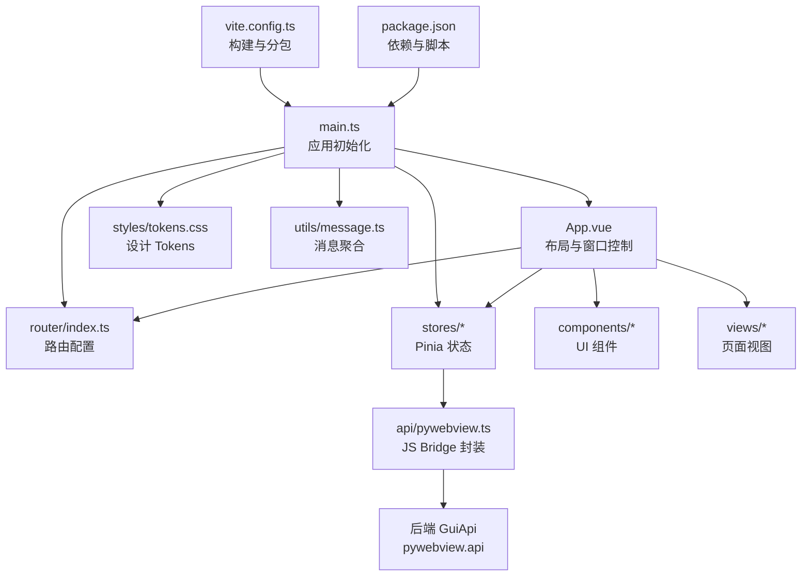
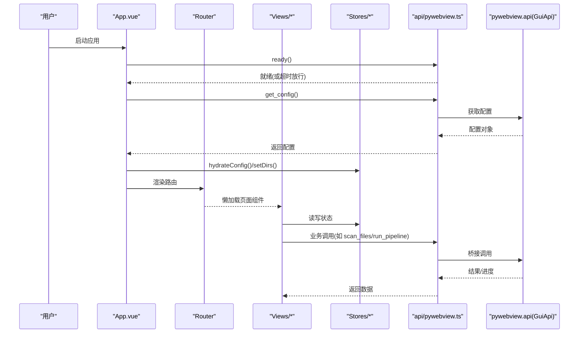
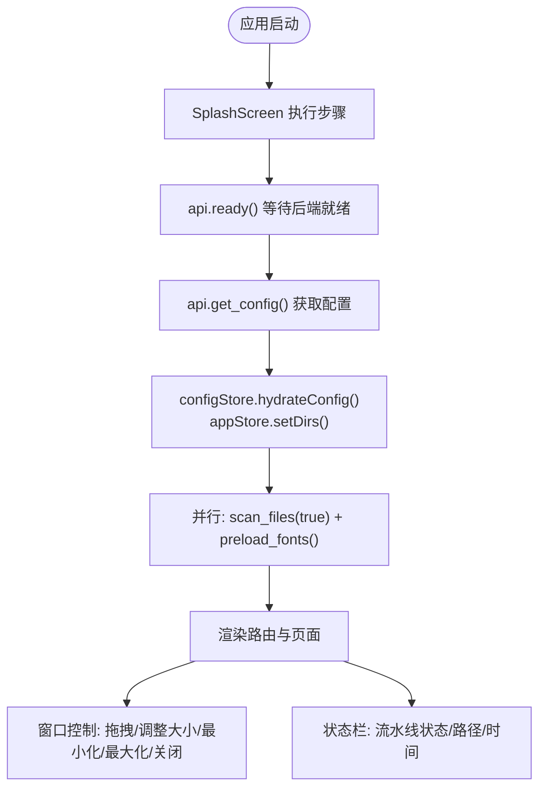
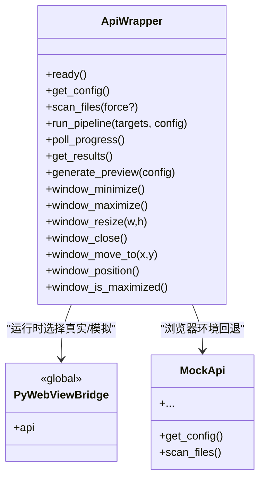
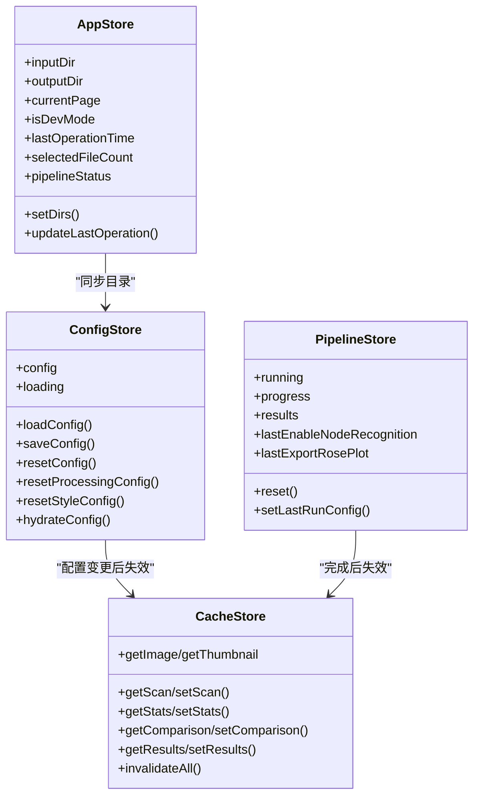
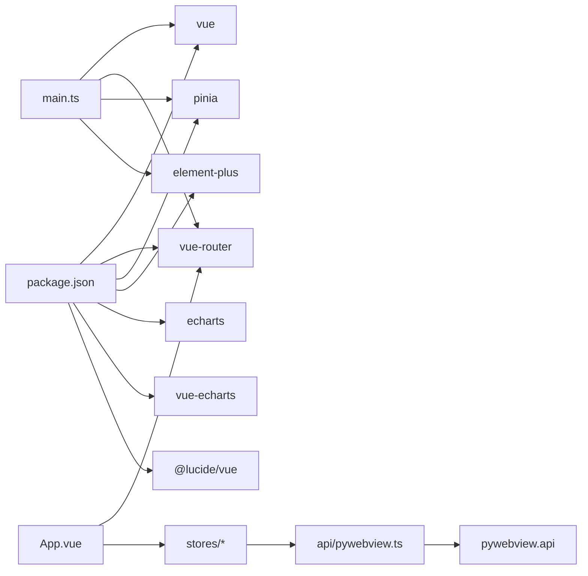

# 表示层（前端界面）

<cite>
**本文引用的文件**   
- [frontend/src/main.ts](file://frontend/src/main.ts)
- [frontend/src/App.vue](file://frontend/src/App.vue)
- [frontend/src/router/index.ts](file://frontend/src/router/index.ts)
- [frontend/src/api/pywebview.ts](file://frontend/src/api/pywebview.ts)
- [frontend/src/stores/app.ts](file://frontend/src/stores/app.ts)
- [frontend/src/stores/config.ts](file://frontend/src/stores/config.ts)
- [frontend/src/stores/pipeline.ts](file://frontend/src/stores/pipeline.ts)
- [frontend/src/stores/cache.ts](file://frontend/src/stores/cache.ts)
- [frontend/src/types/index.ts](file://frontend/src/types/index.ts)
- [frontend/src/utils/message.ts](file://frontend/src/utils/message.ts)
- [frontend/src/styles/tokens.css](file://frontend/src/styles/tokens.css)
- [frontend/vite.config.ts](file://frontend/vite.config.ts)
- [frontend/package.json](file://frontend/package.json)
- [frontend/src/components/SplashScreen.vue](file://frontend/src/components/SplashScreen.vue)
- [frontend/src/views/IntroView.vue](file://frontend/src/views/IntroView.vue)
</cite>

## 目录
1. [简介](#简介)
2. [项目结构](#项目结构)
3. [核心组件](#核心组件)
4. [架构总览](#架构总览)
5. [详细组件分析](#详细组件分析)
6. [依赖关系分析](#依赖关系分析)
7. [性能考虑](#性能考虑)
8. [故障排查指南](#故障排查指南)
9. [结论](#结论)
10. [附录](#附录)

## 简介
本文件面向 TracePipeline 的表示层（前端界面），基于 Vue 3 + TypeScript + Element Plus + ECharts + Pinia 技术栈，系统化阐述应用架构、组件化设计、状态管理策略、路由与页面组织、前后端通信机制（pywebview JS Bridge）、错误处理与用户反馈、响应式设计与主题定制、国际化支持以及性能优化策略。文档同时提供关键流程的可视化图示与代码级来源定位，便于读者快速理解并落地实践。

## 项目结构
前端采用按功能域划分的目录组织方式：
- src/api：后端 API 封装与 pywebview 桥接
- src/components：通用 UI 组件与业务子组件
- src/router：路由配置与懒加载
- src/stores：Pinia 状态存储（app、config、pipeline、cache）
- src/styles：全局样式与设计 Tokens
- src/types：类型定义
- src/utils：工具函数（消息提示、格式化、图片等）
- src/views：页面视图（Intro、Processing、Statistics、Comparison、Data、Config）
- 根目录：入口 main.ts、Vite 构建配置、包清单

图表来源
- [frontend/src/main.ts:1-88](file://frontend/src/main.ts#L1-L88)
- [frontend/src/App.vue:1-140](file://frontend/src/App.vue#L1-L140)
- [frontend/src/router/index.ts:1-26](file://frontend/src/router/index.ts#L1-L26)
- [frontend/src/api/pywebview.ts:1-337](file://frontend/src/api/pywebview.ts#L1-L337)
- [frontend/src/styles/tokens.css:1-200](file://frontend/src/styles/tokens.css#L1-L200)
- [frontend/vite.config.ts:1-134](file://frontend/vite.config.ts#L1-L134)
- [frontend/package.json:1-37](file://frontend/package.json#L1-L37)

章节来源
- [frontend/src/main.ts:1-88](file://frontend/src/main.ts#L1-L88)
- [frontend/src/router/index.ts:1-26](file://frontend/src/router/index.ts#L1-L26)
- [frontend/package.json:1-37](file://frontend/package.json#L1-L37)

## 核心组件
- App.vue：应用外壳，负责启动引导、侧边栏导航、主内容区渲染、状态栏展示、窗口控制（最小化/最大化/关闭/拖拽移动/边缘调整大小）、开发模式开关、路径复制与目录打开等。
- SplashScreen.vue：启动进度条与步骤执行器，驱动连接后端、扫描文件、字体预热等任务，失败可重试。
- router/index.ts：基于 Hash 历史的路由表，使用动态导入实现页面级懒加载，并为常用页面启用 KeepAlive。
- api/pywebview.ts：统一的后端 API 封装，包含就绪等待、开发环境 Mock、类型安全导出。
- stores：
  - app.ts：应用级状态（输入输出目录、当前页、开发者模式、操作时间、选中文件数、流水线状态）及本地持久化。
  - config.ts：配置读取/保存/重置、缓存失效联动。
  - pipeline.ts：流水线运行状态、进度、结果列表与上次运行偏好持久化。
  - cache.ts：多层缓存（sessionStorage TTL + 内存 Map LRU + 字符配额），覆盖扫描、统计、对比、结果、图片与缩略图。
- utils/message.ts：对 ElMessage 的二次封装，支持同消息聚合计数与角标显示。
- styles/tokens.css：设计 Tokens（品牌色、语义色、阴影、圆角、间距、动画、断点、图表配色、Element Plus 变量覆写）。
- vite.config.ts：版本注入、别名、手动分包策略（ECharts、ZRender、Element Plus 分组、Vue/Vendor 拆分）。

章节来源
- [frontend/src/App.vue:143-549](file://frontend/src/App.vue#L143-L549)
- [frontend/src/components/SplashScreen.vue:104-200](file://frontend/src/components/SplashScreen.vue#L104-L200)
- [frontend/src/router/index.ts:1-26](file://frontend/src/router/index.ts#L1-L26)
- [frontend/src/api/pywebview.ts:144-337](file://frontend/src/api/pywebview.ts#L144-L337)
- [frontend/src/stores/app.ts:1-57](file://frontend/src/stores/app.ts#L1-L57)
- [frontend/src/stores/config.ts:1-80](file://frontend/src/stores/config.ts#L1-L80)
- [frontend/src/stores/pipeline.ts:1-56](file://frontend/src/stores/pipeline.ts#L1-L56)
- [frontend/src/stores/cache.ts:1-418](file://frontend/src/stores/cache.ts#L1-L418)
- [frontend/src/utils/message.ts:1-144](file://frontend/src/utils/message.ts#L1-L144)
- [frontend/src/styles/tokens.css:1-200](file://frontend/src/styles/tokens.css#L1-L200)
- [frontend/vite.config.ts:1-134](file://frontend/vite.config.ts#L1-L134)

## 架构总览
前端以 App.vue 为容器，通过 Router 渲染各页面视图；所有跨模块共享状态集中于 Pinia Store；对外通信统一经 api/pywebview.ts 调用后端 GuiApi；样式系统基于 CSS 变量与 Token 体系；构建期进行资源分包以提升首屏与缓存命中。

图表来源
- [frontend/src/App.vue:175-195](file://frontend/src/App.vue#L175-L195)
- [frontend/src/api/pywebview.ts:167-185](file://frontend/src/api/pywebview.ts#L167-L185)
- [frontend/src/router/index.ts:1-26](file://frontend/src/router/index.ts#L1-L26)
- [frontend/src/stores/config.ts:14-23](file://frontend/src/stores/config.ts#L14-L23)

## 详细组件分析

### 应用外壳与窗口控制（App.vue）
- 职责
  - 启动引导：SplashScreen 步骤执行完成后，同步后端配置到 appStore 与 configStore，必要时自动补全默认目录。
  - 导航与页面：侧边栏菜单项与路由高亮，KeepAlive 缓存最近页面。
  - 状态栏：显示流水线状态、已选文件数、最后操作时间与输入/输出目录路径（点击复制）。
  - 窗口控制：最小化、最大化、关闭、标题栏拖拽移动、四边与四角拖拽调整大小，含节流与边界约束。
  - 开发模式：切换开关，配合其他组件行为。
- 关键交互
  - 启动序列：ready → get_config → hydrateConfig → scan_files(true) + preload_fonts 并行 → 完成过渡。
  - 目录操作：open_directory(input/output/logs)。
  - 路径复制：navigator.clipboard.writeText 失败时降级提示。
- 性能与安全
  - 事件监听器集中清理，避免泄漏。
  - 拖拽/调整大小节流至约 16ms 间隔，降低频繁 IPC 开销。

图表来源
- [frontend/src/App.vue:175-195](file://frontend/src/App.vue#L175-L195)
- [frontend/src/App.vue:224-243](file://frontend/src/App.vue#L224-L243)
- [frontend/src/App.vue:245-270](file://frontend/src/App.vue#L245-L270)
- [frontend/src/App.vue:272-486](file://frontend/src/App.vue#L272-L486)
- [frontend/src/components/SplashScreen.vue:143-186](file://frontend/src/components/SplashScreen.vue#L143-L186)

章节来源
- [frontend/src/App.vue:143-549](file://frontend/src/App.vue#L143-L549)
- [frontend/src/components/SplashScreen.vue:104-200](file://frontend/src/components/SplashScreen.vue#L104-L200)

### 路由与页面组织（router/index.ts）
- 使用 createWebHashHistory 适配桌面 WebView 场景。
- 页面按需懒加载，减少初始包体。
- meta.keepAlive 配合 App.vue 中 KeepAlive(max=4) 提升页面切换体验。
- 兜底重定向至首页。

章节来源
- [frontend/src/router/index.ts:1-26](file://frontend/src/router/index.ts#L1-L26)
- [frontend/src/App.vue:88-95](file://frontend/src/App.vue#L88-L95)

### 前后端通信机制（api/pywebview.ts）
- 架构要点
  - waitForApi：监听 pywebviewready 事件，5s 超时后仍放行，保证浏览器开发模式可用。
  - mockApi：在浏览器环境提供与后端一致的假数据接口，便于独立调试。
  - api 导出：每个方法对应后端 GuiApi 同名方法，统一 Promise 风格。
- 类型契约
  - 通过 TypeScript 接口严格约束前后端参数与返回值，降低集成风险。
- 典型调用链
  - 启动阶段：ready → get_config → scan_files → generate_preview / run_pipeline 等。
  - 窗口控制：window_minimize/maximize/resize/move_to/is_maximized 等。

图表来源
- [frontend/src/api/pywebview.ts:144-337](file://frontend/src/api/pywebview.ts#L144-L337)

章节来源
- [frontend/src/api/pywebview.ts:1-337](file://frontend/src/api/pywebview.ts#L1-L337)

### 状态管理策略（Pinia Stores）
- app.ts
  - 维护输入/输出目录、当前页、开发者模式、最后操作时间、选中文件数、流水线状态。
  - 变更持久化到 localStorage，刷新后可恢复。
- config.ts
  - 提供 load/save/reset 系列方法，更新本地状态并触发缓存失效。
  - hydrateConfig 用于仅更新本地状态（不触发持久化）。
- pipeline.ts
  - 管理 running/progress/results 与上次运行偏好（节点识别/玫瑰图导出），持久化到 localStorage。
- cache.ts
  - 多层缓存：
    - sessionStorage TTL：扫描、对比、结果列表。
    - 内存 Map LRU：统计数据（最大 100 条）、图片与缩略图（最大条目与字符配额）。
  - 提供 invalidateAll 等批量失效能力，供配置修改或流水线完成后调用。

图表来源
- [frontend/src/stores/app.ts:1-57](file://frontend/src/stores/app.ts#L1-L57)
- [frontend/src/stores/config.ts:1-80](file://frontend/src/stores/config.ts#L1-L80)
- [frontend/src/stores/pipeline.ts:1-56](file://frontend/src/stores/pipeline.ts#L1-L56)
- [frontend/src/stores/cache.ts:1-418](file://frontend/src/stores/cache.ts#L1-L418)

章节来源
- [frontend/src/stores/app.ts:1-57](file://frontend/src/stores/app.ts#L1-L57)
- [frontend/src/stores/config.ts:1-80](file://frontend/src/stores/config.ts#L1-L80)
- [frontend/src/stores/pipeline.ts:1-56](file://frontend/src/stores/pipeline.ts#L1-L56)
- [frontend/src/stores/cache.ts:1-418](file://frontend/src/stores/cache.ts#L1-L418)

### 组件间通信与数据绑定模式
- 父子通信
  - 父组件通过 props 传递配置/选项，子组件通过 emits 回调通知父组件（例如 SplashScreen 的 complete 事件）。
- 跨组件共享
  - 通过 Pinia Store 暴露 ref/computed，多个组件直接订阅与更新同一状态（如 appStore.inputDir/outputDir）。
- 异步数据流
  - 页面组件调用 api.* 获取数据，写入对应 Store，再由模板双向绑定或计算属性驱动渲染。
- 示例路径
  - 启动引导与配置同步：[App.vue:175-195](file://frontend/src/App.vue#L175-L195)、[config.ts:14-23](file://frontend/src/stores/config.ts#L14-L23)
  - 目录打开与路径复制：[App.vue:224-243](file://frontend/src/App.vue#L224-L243)
  - 窗口控制事件流：[App.vue:272-486](file://frontend/src/App.vue#L272-L486)
  - 启动步骤与错误重试：[SplashScreen.vue:143-186](file://frontend/src/components/SplashScreen.vue#L143-L186)

章节来源
- [frontend/src/App.vue:175-195](file://frontend/src/App.vue#L175-L195)
- [frontend/src/App.vue:224-243](file://frontend/src/App.vue#L224-L243)
- [frontend/src/App.vue:272-486](file://frontend/src/App.vue#L272-L486)
- [frontend/src/components/SplashScreen.vue:143-186](file://frontend/src/components/SplashScreen.vue#L143-L186)

### 错误处理与用户反馈
- 统一消息封装
  - utils/message.ts 对 ElMessage 进行聚合计数与角标显示，避免重复消息刷屏。
- 启动容错
  - SplashScreen 捕获步骤异常并记录，允许“重试连接”。
- API 层
  - waitForApi 超时放行，确保浏览器开发模式可用；所有方法返回 Promise，调用方自行 catch。
- 建议
  - 在关键操作（保存配置、运行流水线、生成报告）处结合 msg.success/warning/error 给出明确反馈。

章节来源
- [frontend/src/utils/message.ts:1-144](file://frontend/src/utils/message.ts#L1-L144)
- [frontend/src/components/SplashScreen.vue:143-186](file://frontend/src/components/SplashScreen.vue#L143-L186)
- [frontend/src/api/pywebview.ts:167-185](file://frontend/src/api/pywebview.ts#L167-L185)

### 响应式设计与主题定制
- 设计 Tokens
  - tokens.css 定义品牌色、语义色、阴影、圆角、间距、动画曲线、断点、图表配色，并覆写 Element Plus 变量，形成统一视觉语言。
- 响应式
  - 通过 CSS 变量断点与媒体查询（可在组件内扩展）适配不同窗口尺寸；侧边栏折叠通过 CSS 变量 --sidebar-half 驱动布局居中。
- 主题
  - 通过修改 tokens.css 中的颜色与阴影即可全局生效；Element Plus 主题色通过 --el-color-primary 等变量覆盖。

章节来源
- [frontend/src/styles/tokens.css:1-200](file://frontend/src/styles/tokens.css#L1-L200)
- [frontend/src/App.vue:577-615](file://frontend/src/App.vue#L577-L615)

### 国际化支持
- 现状
  - 当前文本多为中文硬编码，未引入 i18n 库。
- 建议方案
  - 引入 vue-i18n，将文案抽离至语言包，组件中使用 $t('key') 访问；路由元信息也可承载多语言标题。
  - 在 App.vue 顶部标题与侧边栏标签等处逐步替换。

[本节为概念性建议，不涉及具体文件分析]

### 性能优化策略
- 构建期
  - vite.config.ts 手动分包：echarts、zrender、vue-echarts、element-plus 分组、vue-vendor 等，提升缓存命中率与并行加载。
  - 版本常量注入 __APP_VERSION__，便于缓存破坏与版本展示。
- 运行时
  - 页面级懒加载（路由动态 import）。
  - KeepAlive 缓存最近页面，减少重复渲染。
  - 多层缓存：TTL + LRU + 字符配额，避免内存膨胀与重复请求。
  - 拖拽/调整大小节流，降低 IPC 频率。
  - 字体预热与文件扫描并行，缩短启动耗时。

章节来源
- [frontend/vite.config.ts:94-134](file://frontend/vite.config.ts#L94-L134)
- [frontend/src/App.vue:88-95](file://frontend/src/App.vue#L88-L95)
- [frontend/src/stores/cache.ts:1-418](file://frontend/src/stores/cache.ts#L1-L418)
- [frontend/src/App.vue:518-527](file://frontend/src/App.vue#L518-L527)

## 依赖关系分析
- 运行时依赖
  - Vue 3、Vue Router、Pinia、Element Plus、ECharts、vue-echarts、Lucide Icons。
- 构建依赖
  - Vite、TypeScript、sass、vitest、jsdom。
- 外部集成
  - pywebview.api（桌面端 WebView2 注入的全局对象）。

图表来源
- [frontend/package.json:1-37](file://frontend/package.json#L1-L37)
- [frontend/src/main.ts:1-88](file://frontend/src/main.ts#L1-L88)
- [frontend/src/App.vue:143-162](file://frontend/src/App.vue#L143-L162)
- [frontend/src/api/pywebview.ts:144-155](file://frontend/src/api/pywebview.ts#L144-L155)

章节来源
- [frontend/package.json:1-37](file://frontend/package.json#L1-L37)
- [frontend/src/main.ts:1-88](file://frontend/src/main.ts#L1-L88)

## 性能考虑
- 首屏与缓存
  - 手动分包与路由懒加载显著降低首屏体积；KeepAlive 提升页面切换速度。
- 网络与 IO
  - 启动阶段并行执行文件扫描与字体预热；waitForApi 超时放行保障可用性。
- 内存与存储
  - 图片与缩略图缓存采用 LRU + 字符配额，防止内存溢出；sessionStorage TTL 控制短期数据过期。
- 交互流畅度
  - 拖拽/调整大小节流至约 16ms；CSS will-change 与 transform 优化合成层。

[本节为通用指导，不直接分析具体文件]

## 故障排查指南
- 启动阶段
  - 若出现“连接超时或部分初始化失败”，检查 SplashScreen 的错误列表并点击“重试连接”；确认 pywebviewready 事件是否触发。
- 配置与缓存
  - 修改配置后若数据不一致，检查 configStore.saveConfig 是否触发了 invalidateAll；必要时手动调用 cacheStore.invalidateAll。
- 窗口控制
  - 拖拽/调整大小无效时，确认 isMaximized 状态与 window_is_maximized 返回值；检查事件监听器是否正确清理。
- 消息提示
  - 若消息重复或角标不更新，检查 message.ts 的 key 生成逻辑与 DOM 查找重试机制。

章节来源
- [frontend/src/components/SplashScreen.vue:143-186](file://frontend/src/components/SplashScreen.vue#L143-L186)
- [frontend/src/stores/config.ts:25-35](file://frontend/src/stores/config.ts#L25-L35)
- [frontend/src/stores/cache.ts:388-397](file://frontend/src/stores/cache.ts#L388-L397)
- [frontend/src/App.vue:245-270](file://frontend/src/App.vue#L245-L270)
- [frontend/src/utils/message.ts:56-136](file://frontend/src/utils/message.ts#L56-L136)

## 结论
TracePipeline 的前端表示层以 App.vue 为核心容器，结合 Pinia 进行跨组件状态管理，通过 api/pywebview.ts 与后端稳定通信，辅以完善的启动引导、错误处理与用户反馈机制。设计 Tokens 与 Element Plus 主题覆写保证了统一的视觉语言，构建期分包与运行时缓存策略提升了性能与用户体验。后续可在国际化、更细粒度的错误分类与监控方面持续完善。

[本节为总结性内容，不涉及具体文件分析]

## 附录
- 类型契约参考
  - 前后端数据结构定义集中在 types/index.ts，涵盖 TraceFile、PipelineResult、StatsData、ConfigData、DataPageResult、ComparisonRow 等。
- 首页示例
  - IntroView.vue 展示了模块卡片、快速开始步骤与品牌视觉呈现，可作为新页面开发的参考。

章节来源
- [frontend/src/types/index.ts:1-167](file://frontend/src/types/index.ts#L1-L167)
- [frontend/src/views/IntroView.vue:1-200](file://frontend/src/views/IntroView.vue#L1-L200)