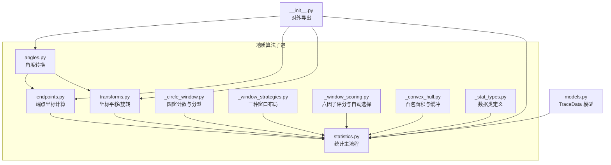
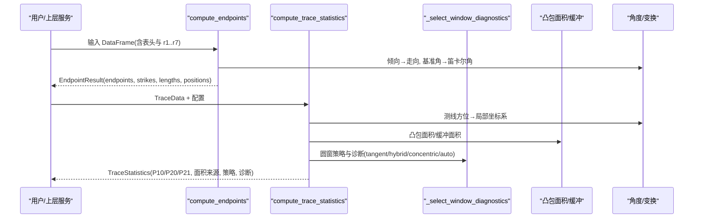
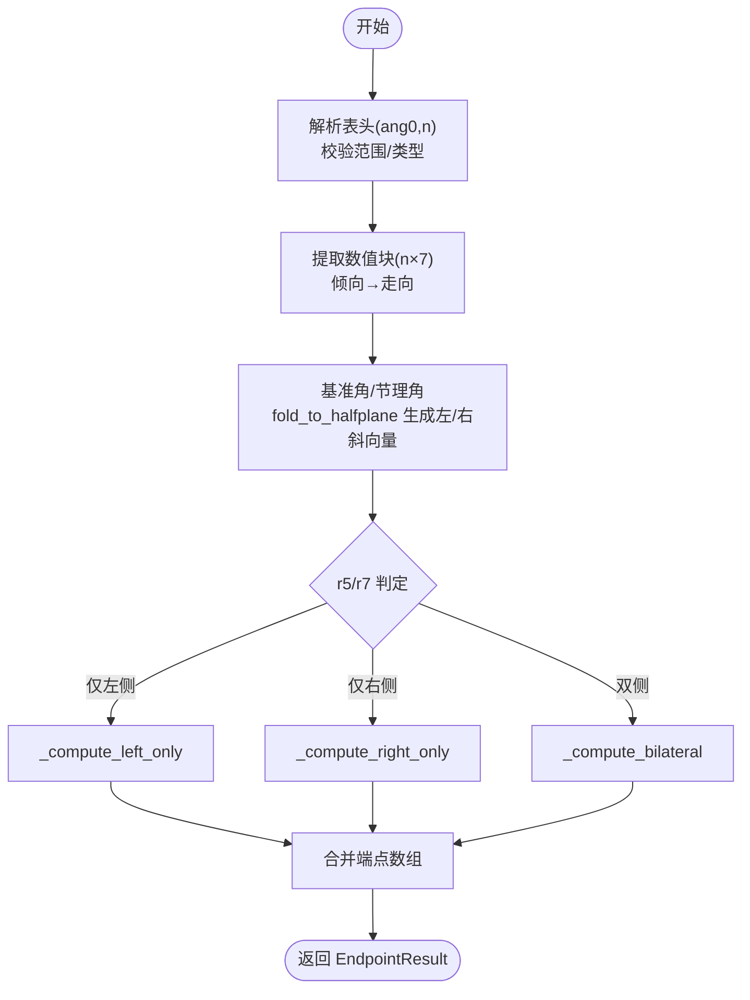
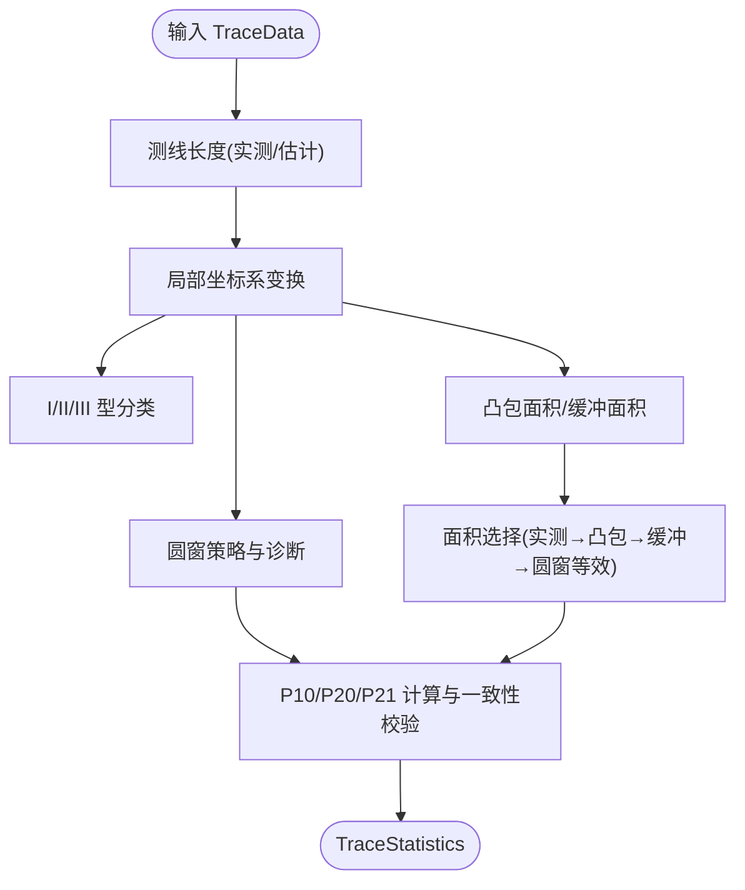
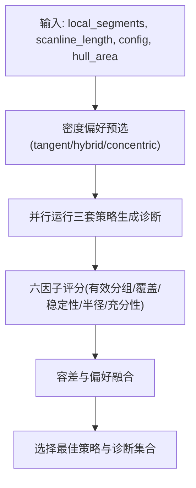
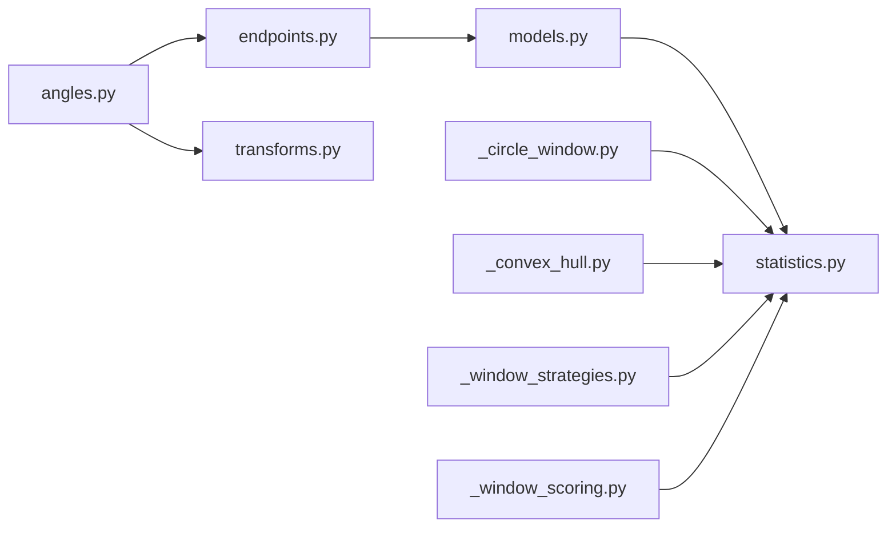

# 地质算法模块

<cite>
**本文引用的文件**   
- [trace_pipeline/geology/__init__.py](file://trace_pipeline/geology/__init__.py)
- [trace_pipeline/geology/endpoints.py](file://trace_pipeline/geology/endpoints.py)
- [trace_pipeline/geology/angles.py](file://trace_pipeline/geology/angles.py)
- [trace_pipeline/geology/transforms.py](file://trace_pipeline/geology/transforms.py)
- [trace_pipeline/geology/statistics.py](file://trace_pipeline/geology/statistics.py)
- [trace_pipeline/geology/_stat_types.py](file://trace_pipeline/geology/_stat_types.py)
- [trace_pipeline/geology/_circle_window.py](file://trace_pipeline/geology/_circle_window.py)
- [trace_pipeline/geology/_window_strategies.py](file://trace_pipeline/geology/_window_strategies.py)
- [trace_pipeline/geology/_window_scoring.py](file://trace_pipeline/geology/_window_scoring.py)
- [trace_pipeline/geology/_convex_hull.py](file://trace_pipeline/geology/_convex_hull.py)
- [trace_pipeline/models.py](file://trace_pipeline/models.py)
- [reference/matlab/Coordinate.m](file://reference/matlab/Coordinate.m)
- [tests/test_endpoints.py](file://tests/test_endpoints.py)
- [tests/test_statistics.py](file://tests/test_statistics.py)
- [tests/test_angles.py](file://tests/test_angles.py)
</cite>

## 目录
1. [引言](#引言)
2. [项目结构](#项目结构)
3. [核心组件](#核心组件)
4. [架构总览](#架构总览)
5. [详细组件分析](#详细组件分析)
6. [依赖关系分析](#依赖关系分析)
7. [性能与数值精度](#性能与数值精度)
8. [故障排查指南](#故障排查指南)
9. [结论](#结论)
10. [附录：调用示例与参数配置](#附录调用示例与参数配置)

## 引言
本技术文档面向 TracePipeline 的地质算法模块，聚焦综合法测量（测线法）的几何与统计计算。内容涵盖：
- 复数向量在二维空间中的坐标计算原理
- 端点坐标计算算法 compute_endpoints 的实现细节与 r₁–r₇ 测线记录的几何含义
- 统计分析方法：P₁₀/P₂₀/P₂₁ 密度指标、Mauldon 平均迹长估计、圆窗策略选择（tangent/hybrid/concentric/auto）
- 角度处理函数 fold_strike_angle 与坐标归一化变换 normalize_coordinates
- 数值精度验证（与 MATLAB 原型对齐）、边界条件与异常处理
- 具体调用示例与参数配置说明

## 项目结构
地质算法模块位于 trace_pipeline/geology 子包，按职责拆分为角度转换、端点计算、坐标变换、凸包面积、圆窗计数与评分、统计主流程等文件。顶层 __init__.py 统一导出对外 API。

图表来源
- [trace_pipeline/geology/__init__.py:1-36](file://trace_pipeline/geology/__init__.py#L1-L36)
- [trace_pipeline/geology/endpoints.py:1-418](file://trace_pipeline/geology/endpoints.py#L1-L418)
- [trace_pipeline/geology/angles.py:1-168](file://trace_pipeline/geology/angles.py#L1-L168)
- [trace_pipeline/geology/transforms.py:1-169](file://trace_pipeline/geology/transforms.py#L1-L169)
- [trace_pipeline/geology/_circle_window.py:1-269](file://trace_pipeline/geology/_circle_window.py#L1-L269)
- [trace_pipeline/geology/_window_strategies.py:1-185](file://trace_pipeline/geology/_window_strategies.py#L1-L185)
- [trace_pipeline/geology/_window_scoring.py:1-323](file://trace_pipeline/geology/_window_scoring.py#L1-L323)
- [trace_pipeline/geology/_convex_hull.py:1-208](file://trace_pipeline/geology/_convex_hull.py#L1-L208)
- [trace_pipeline/geology/statistics.py:1-391](file://trace_pipeline/geology/statistics.py#L1-L391)
- [trace_pipeline/geology/_stat_types.py:1-125](file://trace_pipeline/geology/_stat_types.py#L1-L125)
- [trace_pipeline/models.py:1-352](file://trace_pipeline/models.py#L1-L352)

章节来源
- [trace_pipeline/geology/__init__.py:1-36](file://trace_pipeline/geology/__init__.py#L1-L36)

## 核心组件
- 角度工具：方位角↔笛卡尔角、倾向→走向、走向折叠到 [-90°, 90°]、半平面折叠、玫瑰图半圆折叠
- 端点计算：从 Excel 表头解析与 r₁–r₇ 数据，向量化计算左右/双侧端点坐标
- 坐标变换：正象限平移、按走向旋转、再平移到非负区域
- 圆窗与评分：I/II/III 型分类、批量圆窗相交计数、三套布局（切圆/混合/同心）与自动选择
- 统计主流程：测线长度估算、露头面积回退链、P₁₀/P₂₀/P₂₁ 计算、一致性校验

章节来源
- [trace_pipeline/geology/angles.py:1-168](file://trace_pipeline/geology/angles.py#L1-L168)
- [trace_pipeline/geology/endpoints.py:1-418](file://trace_pipeline/geology/endpoints.py#L1-L418)
- [trace_pipeline/geology/transforms.py:1-169](file://trace_pipeline/geology/transforms.py#L1-L169)
- [trace_pipeline/geology/_circle_window.py:1-269](file://trace_pipeline/geology/_circle_window.py#L1-L269)
- [trace_pipeline/geology/_window_strategies.py:1-185](file://trace_pipeline/geology/_window_strategies.py#L1-L185)
- [trace_pipeline/geology/_window_scoring.py:1-323](file://trace_pipeline/geology/_window_scoring.py#L1-L323)
- [trace_pipeline/geology/statistics.py:1-391](file://trace_pipeline/geology/statistics.py#L1-L391)
- [trace_pipeline/geology/_stat_types.py:1-125](file://trace_pipeline/geology/_stat_types.py#L1-L125)
- [trace_pipeline/models.py:1-352](file://trace_pipeline/models.py#L1-L352)

## 架构总览
下图展示从原始表格到统计结果的主流程，包括端点计算、坐标局部化、圆窗诊断、面积回退与 P 值计算。

图表来源
- [trace_pipeline/geology/endpoints.py:295-411](file://trace_pipeline/geology/endpoints.py#L295-L411)
- [trace_pipeline/geology/statistics.py:212-391](file://trace_pipeline/geology/statistics.py#L212-L391)
- [trace_pipeline/geology/_window_scoring.py:235-323](file://trace_pipeline/geology/_window_scoring.py#L235-L323)
- [trace_pipeline/geology/_convex_hull.py:79-114](file://trace_pipeline/geology/_convex_hull.py#L79-L114)
- [trace_pipeline/geology/angles.py:28-102](file://trace_pipeline/geology/angles.py#L28-L102)

## 详细组件分析

### 综合法测量原理与数学基础（复数向量）
- 测线方向由方位角 azimuth 转换为笛卡尔角（东偏北逆时针），用于构建复数基向量
- 节理走向由倾向经分段映射得到，再通过半平面折叠确定左/右侧方向向量
- 以 z₁ = r₁·e^(i·θ_base) 为起点，沿垂直方向偏移 r₂，再沿斜向（fold_to_halfplane 结果）叠加 r₄/r₅ 或 r₆/r₇，得到左右端点
- 该实现与 MATLAB Coordinate.m 的复数路径一致，保证数值等价性

章节来源
- [trace_pipeline/geology/endpoints.py:1-418](file://trace_pipeline/geology/endpoints.py#L1-L418)
- [reference/matlab/Coordinate.m:1-111](file://reference/matlab/Coordinate.m#L1-L111)
- [trace_pipeline/geology/angles.py:28-148](file://trace_pipeline/geology/angles.py#L28-L148)

### 端点坐标计算算法 compute_endpoints
- 输入：DataFrame 首行包含测线走向 ang0、迹线条数 n；前 n 行包含 r₁–r₇ 及倾向列
- 步骤：
  - 解析表头并校验范围与类型
  - 提取数值块并将倾向转换为走向
  - 构造基准角与节理方向角，使用 fold_to_halfplane 生成左/右斜向单位复数向量
  - 根据 r₅/r₇ 是否为 0 划分三类情况，分别调用 _compute_left_only / _compute_right_only / _compute_bilateral
- 输出：EndpointResult，包含 endpoints(N,4)、joint_strikes、segment_lengths(r₅+r₇)、scanline_positions(r₁) 以及可选实测长度/面积

图表来源
- [trace_pipeline/geology/endpoints.py:98-206](file://trace_pipeline/geology/endpoints.py#L98-L206)
- [trace_pipeline/geology/endpoints.py:210-290](file://trace_pipeline/geology/endpoints.py#L210-L290)
- [trace_pipeline/geology/endpoints.py:295-411](file://trace_pipeline/geology/endpoints.py#L295-L411)

章节来源
- [trace_pipeline/geology/endpoints.py:1-418](file://trace_pipeline/geology/endpoints.py#L1-L418)

#### r₁–r₇ 测线记录的几何含义与坐标变换
- r₁：沿测线的位移（起点位置）
- r₂：垂直测线的横向偏移
- 倾向列：输入倾向，运行时转换为走向
- r₄/r₅：左侧两段迹长（r₄ 为靠近测线段，r₅ 为外侧段）
- r₆/r₇：右侧两段迹长（r₆ 为靠近测线段，r₇ 为外侧段）
- 坐标变换：将走向角折到 [-90°, 90°] 后旋转，使测线方向接近水平轴，便于后续可视化与统计

章节来源
- [trace_pipeline/geology/endpoints.py:52-66](file://trace_pipeline/geology/endpoints.py#L52-L66)
- [trace_pipeline/geology/angles.py:76-102](file://trace_pipeline/geology/angles.py#L76-L102)

### 统计分析方法
- 测线长度：优先采用实测值，否则基于 scanline_positions 的中位间距估计
- 露头面积四层回退：实测 → 原始凸包 → 缓冲凸包 → 圆窗等效面积（由 P₂₀ 反推）
- 观测迹长总长度：优先 segment 总和（r₅+r₇），其次端点欧氏距离总和，最后回退到“窗口估计均值 × 条数”
- P₁₀：迹线数 / 测线长度
- P₂₀/P₂₁：迹线数/面积 与 累计长度/面积；当面积不可用时回退到圆窗估计值
- 一致性校验：比较主 P₂₀/P₂₁ 与圆窗估计值的相对差异，超过自适应阈值则告警

图表来源
- [trace_pipeline/geology/statistics.py:51-166](file://trace_pipeline/geology/statistics.py#L51-L166)
- [trace_pipeline/geology/statistics.py:212-391](file://trace_pipeline/geology/statistics.py#L212-L391)
- [trace_pipeline/geology/_convex_hull.py:79-114](file://trace_pipeline/geology/_convex_hull.py#L79-L114)
- [trace_pipeline/geology/_circle_window.py:12-66](file://trace_pipeline/geology/_circle_window.py#L12-L66)

章节来源
- [trace_pipeline/geology/statistics.py:1-391](file://trace_pipeline/geology/statistics.py#L1-L391)
- [trace_pipeline/geology/_convex_hull.py:1-208](file://trace_pipeline/geology/_convex_hull.py#L1-L208)
- [trace_pipeline/geology/_circle_window.py:1-269](file://trace_pipeline/geology/_circle_window.py#L1-L269)

#### Mauldon 平均迹长估计原理
- 圆窗内通过 n₀/n₁/n₂ 统计得到 m = n₁ + 2n₂、q = 2n₀ + n₁
- 平均迹长 l_est = (π·R/2)·(m/q)，其中 R 为圆半径
- 该估计用于“窗口估计均值 × 条数”的回退路径，亦参与面积等效与一致性校验

章节来源
- [trace_pipeline/geology/_circle_window.py:186-191](file://trace_pipeline/geology/_circle_window.py#L186-L191)
- [trace_pipeline/geology/statistics.py:242-256](file://trace_pipeline/geology/statistics.py#L242-L256)

#### 圆窗策略选择算法（四种不同策略的适用场景）
- tangent（切圆）：适用于低密度或样本不足场景，沿测线两侧放置固定半径的多个切圆
- hybrid（混合）：对每个切割位置（cut_fraction）与侧向高度约束下，按 radius_fractions 生成多组候选
- concentric（同心）：以测线中点为中心，按 radius_fractions 生成同心圆
- auto（自动）：先按密度偏好预选（基于 hull_area 与 min_intersections），再对三套策略进行六因子加权评分，择优；若无可信候选则回退到密度偏好

图表来源
- [trace_pipeline/geology/_window_scoring.py:209-323](file://trace_pipeline/geology/_window_scoring.py#L209-L323)
- [trace_pipeline/geology/_window_strategies.py:52-185](file://trace_pipeline/geology/_window_strategies.py#L52-L185)

章节来源
- [trace_pipeline/geology/_window_scoring.py:1-323](file://trace_pipeline/geology/_window_scoring.py#L1-L323)
- [trace_pipeline/geology/_window_strategies.py:1-185](file://trace_pipeline/geology/_window_strategies.py#L1-L185)

### 角度处理函数与坐标归一化变换
- fold_strike_angle：将 0°–360° 走向角折叠到 [-90°, 90°] 并转弧度，修正参考 MATLAB 的分支逻辑缺陷
- fold_to_halfplane：将目标角折叠到以基准角为界的半平面内，确保左/右侧方向向量严格位于相应半平面
- normalize_coordinates：正象限平移 → 走向旋转 → 非负平移，形成规范化流水线

章节来源
- [trace_pipeline/geology/angles.py:76-148](file://trace_pipeline/geology/angles.py#L76-L148)
- [trace_pipeline/geology/transforms.py:127-169](file://trace_pipeline/geology/transforms.py#L127-L169)

## 依赖关系分析
- endpoints 依赖 angles 的 dip_to_strike 与 fold_to_halfplane
- statistics 依赖 _circle_window、_convex_hull、_window_scoring、_window_strategies 与 angles
- transforms 依赖 angles 的 fold_strike_angle
- models.TraceData 作为统计主流程的数据载体

图表来源
- [trace_pipeline/geology/endpoints.py:47-48](file://trace_pipeline/geology/endpoints.py#L47-L48)
- [trace_pipeline/geology/statistics.py:20-36](file://trace_pipeline/geology/statistics.py#L20-L36)
- [trace_pipeline/geology/transforms.py:16](file://trace_pipeline/geology/transforms.py#L16)
- [trace_pipeline/models.py:41-157](file://trace_pipeline/models.py#L41-L157)

章节来源
- [trace_pipeline/geology/endpoints.py:1-418](file://trace_pipeline/geology/endpoints.py#L1-L418)
- [trace_pipeline/geology/statistics.py:1-391](file://trace_pipeline/geology/statistics.py#L1-L391)
- [trace_pipeline/geology/transforms.py:1-169](file://trace_pipeline/geology/transforms.py#L1-L169)
- [trace_pipeline/models.py:1-352](file://trace_pipeline/models.py#L1-L352)

## 性能与数值精度
- 向量化实现：端点计算与圆窗计数均使用 NumPy 广播与批量矩阵运算，避免逐行 Python 循环
- 内存友好：就地修改预分配数组（端点计算内部函数）减少中间对象创建
- 数值精度：
  - 倾向→走向、半平面折叠、角度折叠等关键路径与 MATLAB 原型保持一致
  - 单元测试断言与 pytest.approx 控制误差，确保与 MATLAB 参考值在同一数量级且满足高精度要求
- 边界条件：
  - 空数据、非法表头、非有限值、负数长度、同时缺失左右迹长等均抛出明确错误
  - 自适应阈值随样本量衰减，避免小样本误判

章节来源
- [trace_pipeline/geology/endpoints.py:210-290](file://trace_pipeline/geology/endpoints.py#L210-L290)
- [trace_pipeline/geology/_circle_window.py:71-216](file://trace_pipeline/geology/_circle_window.py#L71-L216)
- [tests/test_endpoints.py:86-103](file://tests/test_endpoints.py#L86-L103)
- [tests/test_angles.py:49-57](file://tests/test_angles.py#L49-L57)

## 故障排查指南
- 常见错误与定位：
  - “输入表格为空/至少需要 N 列/无法解析表头”：检查 DataFrame 结构与首行列名
  - “r1 不能为负数/倾向必须在 [0,360)/r5 与 r7 不能同时为 0”：核对 Excel 列顺序与数据合法性
  - “scanline_positions 包含 NaN 或 inf”：清理输入数据
  - “margin 必须 ≥ 0”：检查坐标变换参数
- 日志与诊断：
  - 统计主流程会记录策略选择、面积来源、P 值来源与一致性告警
  - CircleWindowDiagnostic 提供 valid/invalid_reason 字段，便于定位无效窗口原因

章节来源
- [trace_pipeline/geology/endpoints.py:98-206](file://trace_pipeline/geology/endpoints.py#L98-L206)
- [trace_pipeline/geology/statistics.py:338-356](file://trace_pipeline/geology/statistics.py#L338-L356)
- [trace_pipeline/geology/_circle_window.py:219-249](file://trace_pipeline/geology/_circle_window.py#L219-L249)

## 结论
TracePipeline 地质算法模块以严格的数学基础与向量化实现为核心，提供了从端点坐标到密度统计的完整流水线。其优势在于：
- 与 MATLAB 原型保持高一致性，具备可追溯性与可重复性
- 圆窗策略自动选择结合六因子评分，兼顾稳健性与代表性
- 多层回退与一致性校验提升结果可信度与鲁棒性

## 附录：调用示例与参数配置

### 端点计算示例
- 输入：DataFrame，首行包含测线走向与迹线条数，前 n 行包含 r₁–r₇ 与倾向列
- 调用：compute_endpoints(df)
- 输出：EndpointResult，包含 endpoints、joint_strikes、segment_lengths、scanline_positions 等

章节来源
- [trace_pipeline/geology/endpoints.py:295-411](file://trace_pipeline/geology/endpoints.py#L295-L411)
- [tests/test_endpoints.py:49-84](file://tests/test_endpoints.py#L49-L84)

### 统计计算示例
- 输入：TraceData（可由 compute_endpoints 结果构造）+ TraceStatisticsConfig
- 调用：compute_trace_statistics(trace, config)
- 输出：TraceStatistics，包含 P₁₀/P₂₀/P₂₁、面积来源、策略、诊断等

章节来源
- [trace_pipeline/geology/statistics.py:212-391](file://trace_pipeline/geology/statistics.py#L212-L391)
- [tests/test_statistics.py:256-292](file://tests/test_statistics.py#L256-L292)

### 参数配置说明（TraceStatisticsConfig）
- cut_fractions：切割位置比例序列（如 0.25, 0.5, 0.75）
- radius_fractions：半径比例序列（如 1.0, 0.75, 0.5）
- min_intersections：最少相交迹线数（默认 5）
- window_strategy：auto/tangent/hybrid/concentric（默认 auto）
- auto_density_threshold：auto 策略粗估面密度阈值（默认 5.0）
- tangent_window_count：切圆每侧数量（默认 3）
- hull_buffer_ratio：缓冲凸包比例（默认 0.25）
- disagreement_threshold：面积差异阈值（None 表示自适应）

章节来源
- [trace_pipeline/geology/_stat_types.py:15-65](file://trace_pipeline/geology/_stat_types.py#L15-L65)