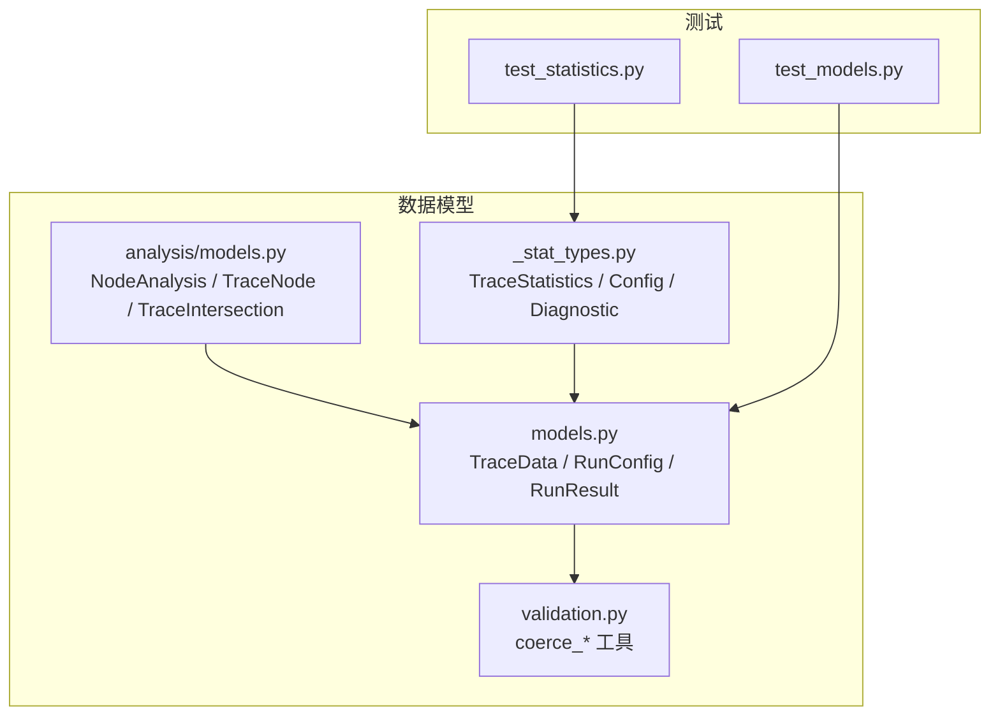
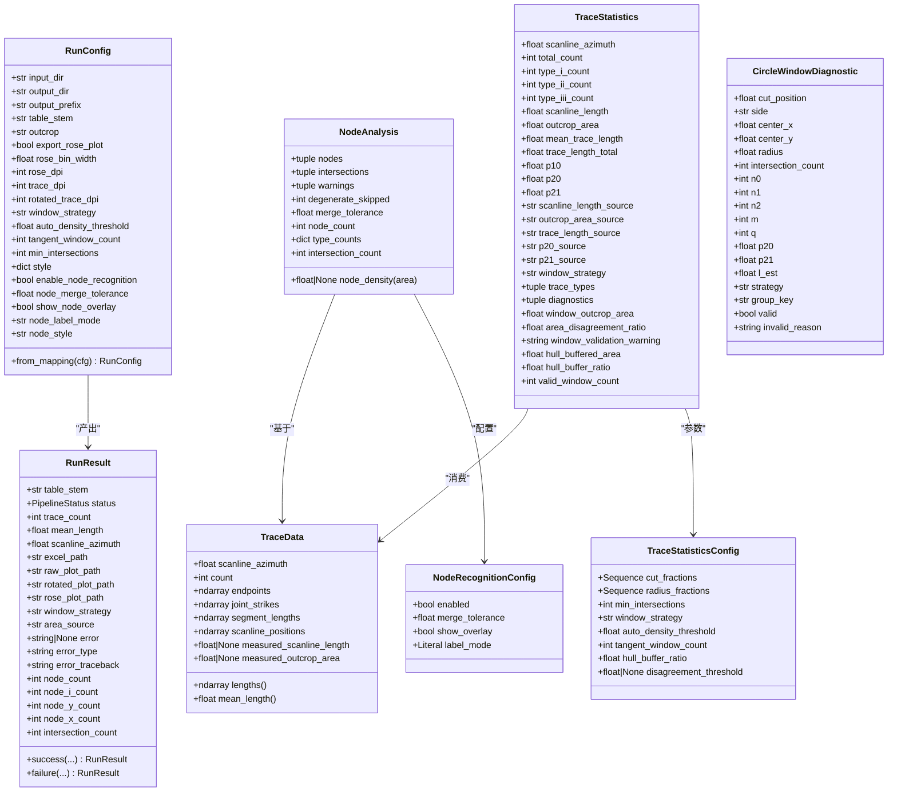
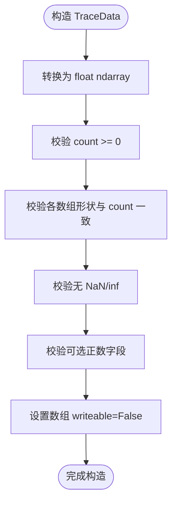
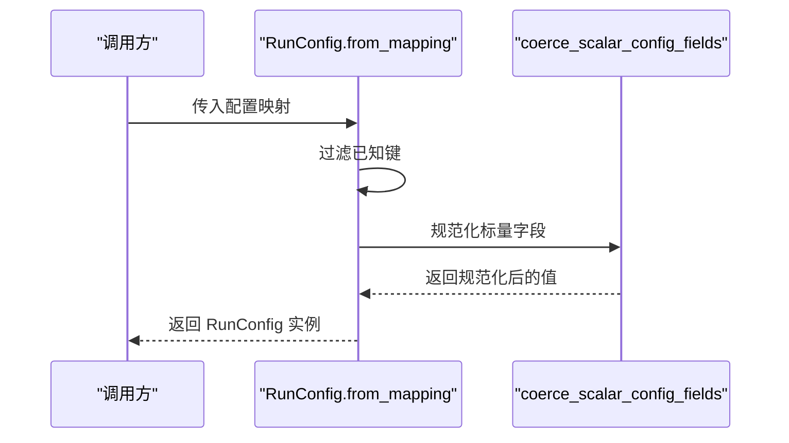
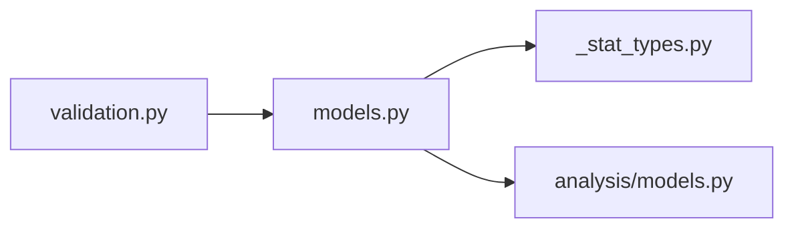

# 数据模型设计

<cite>
**本文引用的文件**   
- [trace_pipeline/models.py](file://trace_pipeline/models.py)
- [trace_pipeline/analysis/models.py](file://trace_pipeline/analysis/models.py)
- [trace_pipeline/geology/_stat_types.py](file://trace_pipeline/geology/_stat_types.py)
- [trace_pipeline/validation.py](file://trace_pipeline/validation.py)
- [tests/test_models.py](file://tests/test_models.py)
- [tests/test_statistics.py](file://tests/test_statistics.py)
</cite>

## 目录
1. [引言](#引言)
2. [项目结构](#项目结构)
3. [核心组件](#核心组件)
4. [架构总览](#架构总览)
5. [详细组件分析](#详细组件分析)
6. [依赖关系分析](#依赖关系分析)
7. [性能与内存优化](#性能与内存优化)
8. [故障排查指南](#故障排查指南)
9. [结论](#结论)
10. [附录：版本管理与向后兼容](#附录：版本管理与向后兼容)

## 引言
本文件围绕 TracePipeline 的数据模型进行系统化技术文档化，重点覆盖以下目标：
- 不可变数据模型的设计原则与实现（frozen dataclass）
- 核心数据类：TraceData、RunConfig、RunResult、TraceStatistics、NodeAnalysis 等结构与约束
- 数据验证机制与类型约束
- 数据模型之间的依赖关系与数据流转模式
- 创建、访问与转换的示例路径（以源码位置代替代码片段）
- 内存优化策略与性能考量
- 版本管理与向后兼容性保证的实现方法

## 项目结构
数据模型主要分布在如下模块中：
- trace_pipeline/models.py：核心运行数据模型（TraceData、RunConfig、RunResult）
- trace_pipeline/analysis/models.py：节点分析结果模型（NodeAnalysis、TraceNode、TraceIntersection、NodeRecognitionConfig）
- trace_pipeline/geology/_stat_types.py：统计相关模型（TraceStatistics、TraceStatisticsConfig、CircleWindowDiagnostic）
- trace_pipeline/validation.py：通用校验与类型强制转换工具
- tests/*：针对模型的单元测试，体现使用方式与边界条件

图表来源
- [trace_pipeline/models.py:1-352](file://trace_pipeline/models.py#L1-L352)
- [trace_pipeline/analysis/models.py:1-98](file://trace_pipeline/analysis/models.py#L1-L98)
- [trace_pipeline/geology/_stat_types.py:1-125](file://trace_pipeline/geology/_stat_types.py#L1-L125)
- [trace_pipeline/validation.py:1-112](file://trace_pipeline/validation.py#L1-L112)
- [tests/test_models.py:1-138](file://tests/test_models.py#L1-L138)
- [tests/test_statistics.py:1-292](file://tests/test_statistics.py#L1-L292)

章节来源
- [trace_pipeline/models.py:1-352](file://trace_pipeline/models.py#L1-L352)
- [trace_pipeline/analysis/models.py:1-98](file://trace_pipeline/analysis/models.py#L1-L98)
- [trace_pipeline/geology/_stat_types.py:1-125](file://trace_pipeline/geology/_stat_types.py#L1-L125)
- [trace_pipeline/validation.py:1-112](file://trace_pipeline/validation.py#L1-L112)
- [tests/test_models.py:1-138](file://tests/test_models.py#L1-L138)
- [tests/test_statistics.py:1-292](file://tests/test_statistics.py#L1-L292)

## 核心组件
本节概述各核心数据类的职责与关键属性。

- TraceData：单张迹线表的完整解析结果，包含测线走向角、迹线条数、端点坐标、节理走向、分段长度、测线位移以及可选的实测测线长度和露头面积。提供只读派生属性 lengths 与 mean_length。
- RunConfig：单次流水线运行的参数集合，支持从映射构造并执行字段级校验，提供 node_style 便捷读取。
- RunResult：单次流水线运行结果，封装状态、统计摘要、输出路径、错误信息与节点计数等。
- NodeAnalysis：节点分析结果，包含节点元组、相交事件元组、警告元组及衍生统计属性。
- TraceStatistics：统计结果，包含多种密度指标、来源标记、诊断信息以及窗口策略选择结果。
- TraceStatisticsConfig：统计计算参数，如分箱比例、半径比例、最小交点数、窗口策略、缓冲比等。
- CircleWindowDiagnostic：单个圆形取样窗的诊断记录，含计数、有效性标志与无效原因。
- NodeRecognitionConfig：节点识别配置，控制是否启用、合并容差、叠加显示与标签模式。

章节来源
- [trace_pipeline/models.py:38-157](file://trace_pipeline/models.py#L38-L157)
- [trace_pipeline/models.py:159-273](file://trace_pipeline/models.py#L159-L273)
- [trace_pipeline/models.py:275-352](file://trace_pipeline/models.py#L275-L352)
- [trace_pipeline/analysis/models.py:22-98](file://trace_pipeline/analysis/models.py#L22-L98)
- [trace_pipeline/geology/_stat_types.py:14-125](file://trace_pipeline/geology/_stat_types.py#L14-L125)

## 架构总览
下图展示数据模型之间的关系与典型数据流：输入 TraceData 经统计计算得到 TraceStatistics；RunConfig 驱动流程；RunResult 汇总结果；NodeAnalysis 描述节点拓扑与相交事件。

图表来源
- [trace_pipeline/models.py:38-352](file://trace_pipeline/models.py#L38-L352)
- [trace_pipeline/analysis/models.py:22-98](file://trace_pipeline/analysis/models.py#L22-L98)
- [trace_pipeline/geology/_stat_types.py:14-125](file://trace_pipeline/geology/_stat_types.py#L14-L125)

## 详细组件分析

### TraceData：不可变数据容器与派生属性缓存
- 设计要点
  - 使用 frozen=True 确保不可变性，防止运行时意外修改。
  - __post_init__ 中进行严格形状与数值校验，并将 numpy 数组设为只读（writeable=False）。
  - 通过 object.__setattr__ 在 frozen 对象上安全写入私有缓存字段（如 _lengths），避免破坏不可变性语义。
  - 提供 lengths 与 mean_length 派生属性，减少重复计算。
- 复杂度与性能
  - lengths 首次计算后缓存为只读 ndarray，后续 O(1) 返回。
  - 所有数值校验均为 O(N)，N 为迹线条数。
- 使用示例路径
  - 基本构造与访问：[tests/test_models.py:14-27](file://tests/test_models.py#L14-L27)
  - 负数 count 校验：[tests/test_models.py:28-37](file://tests/test_models.py#L28-L37)
  - 形状不一致校验：[tests/test_models.py:39-48](file://tests/test_models.py#L39-L48)
  - NaN/inf 校验：[tests/test_models.py:50-59](file://tests/test_models.py#L50-L59)
  - 可选正数校验：[tests/test_models.py:61-71](file://tests/test_models.py#L61-L71)
  - 只读数组断言：[tests/test_models.py:73-84](file://tests/test_models.py#L73-L84)
  - lengths 属性计算与只读性：[tests/test_models.py:85-98](file://tests/test_models.py#L85-L98)

图表来源
- [trace_pipeline/models.py:65-121](file://trace_pipeline/models.py#L65-L121)

章节来源
- [trace_pipeline/models.py:38-157](file://trace_pipeline/models.py#L38-L157)
- [tests/test_models.py:14-98](file://tests/test_models.py#L14-L98)

### RunConfig：配置构建与标量规范化
- 设计要点
  - 必填字段空值检查与 strip 规范化。
  - 调用 coerce_scalar_config_fields 对布尔、浮点、整数、枚举型字段进行统一规范化与范围校验。
  - from_mapping 工厂方法仅提取已知键，忽略未知键，保持向前兼容。
  - node_style 便捷读取自 style 字典。
- 使用示例路径
  - 基本构造与空字段校验：[tests/test_models.py:103-121](file://tests/test_models.py#L103-L121)
  - from_mapping 与未知键忽略：[tests/test_models.py:123-138](file://tests/test_models.py#L123-L138)
  - node_label_mode 从 style 继承：[tests/test_run_config.py:6-20](file://tests/test_run_config.py#L6-L20)

图表来源
- [trace_pipeline/models.py:236-267](file://trace_pipeline/models.py#L236-L267)
- [trace_pipeline/validation.py:107-112](file://trace_pipeline/validation.py#L107-L112)

章节来源
- [trace_pipeline/models.py:159-273](file://trace_pipeline/models.py#L159-L273)
- [trace_pipeline/validation.py:26-112](file://trace_pipeline/validation.py#L26-L112)
- [tests/test_models.py:103-138](file://tests/test_models.py#L103-L138)
- [tests/test_run_config.py:6-20](file://tests/test_run_config.py#L6-L20)

### RunResult：运行结果聚合
- 设计要点
  - 成功/失败两种构造器 success/failure，简化常见场景。
  - 包含统计摘要、输出路径、错误信息与节点计数等。
- 使用示例路径
  - 成功构造：[trace_pipeline/models.py:302-339](file://trace_pipeline/models.py#L302-L339)
  - 失败构造：[trace_pipeline/models.py:341-351](file://trace_pipeline/models.py#L341-L351)

章节来源
- [trace_pipeline/models.py:275-352](file://trace_pipeline/models.py#L275-L352)

### NodeAnalysis：节点分析与相交事件
- 设计要点
  - 使用 tuple 存储节点与相交事件，配合 frozen=True 保证不可变。
  - 提供 node_count、type_counts、intersection_count、node_density 等派生属性。
- 使用示例路径
  - 类型计数与密度计算：[trace_pipeline/analysis/models.py:79-98](file://trace_pipeline/analysis/models.py#L79-L98)

章节来源
- [trace_pipeline/analysis/models.py:22-98](file://trace_pipeline/analysis/models.py#L22-L98)

### TraceStatistics 与 TraceStatisticsConfig：统计模型与参数
- 设计要点
  - TraceStatisticsConfig 在 __post_init__ 中对序列、阈值、策略等进行严格校验与规范化。
  - TraceStatistics 包含丰富的来源标记与诊断信息，便于追溯计算过程。
  - CircleWindowDiagnostic 记录每个圆窗的详细计数与有效性。
- 使用示例路径
  - 统计入口与默认配置：[tests/test_statistics.py:278-282](file://tests/test_statistics.py#L278-L282)
  - 自定义窗口策略：[tests/test_statistics.py:283-292](file://tests/test_statistics.py#L283-L292)

章节来源
- [trace_pipeline/geology/_stat_types.py:14-125](file://trace_pipeline/geology/_stat_types.py#L14-L125)
- [tests/test_statistics.py:256-292](file://tests/test_statistics.py#L256-L292)

## 依赖关系分析
- models.py 依赖 validation.py 的标量规范化函数，用于 RunConfig 的字段校验。
- analysis/models.py 与 geology/_stat_types.py 不直接依赖 models.py，但业务逻辑中常以 TraceData 作为输入。
- statistics.py 消费 TraceData 并产出 TraceStatistics，内部还依赖凸包、圆窗等子模块（不在本文件范围内）。

图表来源
- [trace_pipeline/models.py:20-21](file://trace_pipeline/models.py#L20-L21)
- [trace_pipeline/validation.py:107-112](file://trace_pipeline/validation.py#L107-L112)

章节来源
- [trace_pipeline/models.py:1-352](file://trace_pipeline/models.py#L1-L352)
- [trace_pipeline/validation.py:1-112](file://trace_pipeline/validation.py#L1-L112)

## 性能与内存优化
- 不可变性与只读数组
  - frozen dataclass 阻止意外修改，提升并发安全性与可推理性。
  - 将 numpy 数组设置为 writeable=False，避免下游误写，降低拷贝开销。
- 派生属性缓存
  - TraceData.lengths 首次计算后缓存，避免重复计算欧氏距离。
- 批量与向量化
  - 统计计算大量使用 numpy 向量化操作，时间复杂度接近 O(N)。
- 自适应阈值与回退链
  - 面积与长度估算采用多层回退策略，避免异常路径导致崩溃。
- 建议
  - 对于大规模数据，优先复用已计算的派生属性（如 lengths）。
  - 谨慎处理中间大数组，及时释放或转为只读视图。

章节来源
- [trace_pipeline/models.py:133-151](file://trace_pipeline/models.py#L133-L151)
- [trace_pipeline/geology/statistics.py:212-391](file://trace_pipeline/geology/statistics.py#L212-L391)

## 故障排查指南
- TraceData 构造失败常见原因
  - count 为负数：[tests/test_models.py:28-37](file://tests/test_models.py#L28-L37)
  - 数组形状与 count 不一致：[tests/test_models.py:39-48](file://tests/test_models.py#L39-L48)
  - 包含 NaN/inf：[tests/test_models.py:50-59](file://tests/test_models.py#L50-L59)
  - 可选正数字段非正：[tests/test_models.py:61-71](file://tests/test_models.py#L61-L71)
- RunConfig 构造失败常见原因
  - 必填字段为空字符串：[tests/test_models.py:113-121](file://tests/test_models.py#L113-L121)
  - 标量字段类型或范围不合法（由 coerce_* 抛出）：[trace_pipeline/validation.py:26-112](file://trace_pipeline/validation.py#L26-L112)
- 统计计算异常定位
  - 检查有效窗口数量与诊断信息：[trace_pipeline/geology/_stat_types.py:122-125](file://trace_pipeline/geology/_stat_types.py#L122-L125)
  - 查看 P20/P21 来源与一致性告警：[trace_pipeline/geology/statistics.py:313-336](file://trace_pipeline/geology/statistics.py#L313-L336)

章节来源
- [tests/test_models.py:28-71](file://tests/test_models.py#L28-L71)
- [trace_pipeline/validation.py:26-112](file://trace_pipeline/validation.py#L26-L112)
- [trace_pipeline/geology/_stat_types.py:122-125](file://trace_pipeline/geology/_stat_types.py#L122-L125)
- [trace_pipeline/geology/statistics.py:313-336](file://trace_pipeline/geology/statistics.py#L313-L336)

## 结论
TracePipeline 的数据模型以 frozen dataclass 为核心，结合严格的 __post_init__ 校验与只读数组策略，实现了高内聚、低耦合且线程安全的不可变数据结构。通过派生属性缓存与向量化计算，兼顾了性能与可读性。RunConfig 的 from_mapping 与标量规范化机制提升了配置的健壮性与扩展性。整体设计为后续功能演进提供了清晰的契约与稳定的基座。

## 附录：版本管理与向后兼容
- 字段新增与废弃
  - 在 __post_init__ 中对新字段进行默认值与范围校验，旧字段保留默认值以保持兼容。
  - 对废弃字段可在 from_mapping 中显式忽略或记录弃用日志。
- 配置迁移
  - 利用 coerce_scalar_config_fields 集中管理标量字段的类型与范围，避免分散校验逻辑。
  - 在 RunConfig.from_mapping 中维护“已知键”白名单，自动忽略未知键，实现向前兼容。
- 数据模型演进
  - 使用 Optional 字段与默认值，逐步引入新能力而不破坏现有调用。
  - 对关键派生属性增加来源标记（如 source 字段），便于追踪变更影响。
- 测试保障
  - 针对边界条件与异常路径编写用例，确保行为稳定。
  - 参考用例路径：
    - 模型校验用例：[tests/test_models.py:14-98](file://tests/test_models.py#L14-L98)
    - 统计用例：[tests/test_statistics.py:256-292](file://tests/test_statistics.py#L256-L292)

章节来源
- [trace_pipeline/models.py:236-267](file://trace_pipeline/models.py#L236-L267)
- [trace_pipeline/validation.py:90-112](file://trace_pipeline/validation.py#L90-L112)
- [tests/test_models.py:14-98](file://tests/test_models.py#L14-L98)
- [tests/test_statistics.py:256-292](file://tests/test_statistics.py#L256-L292)