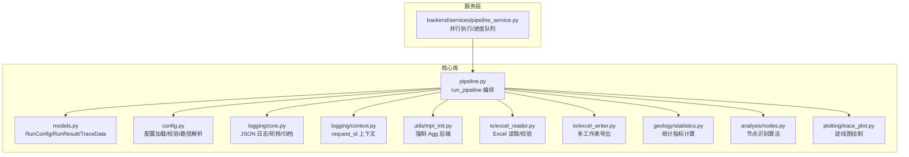
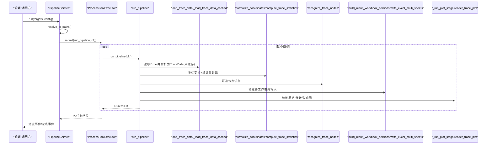
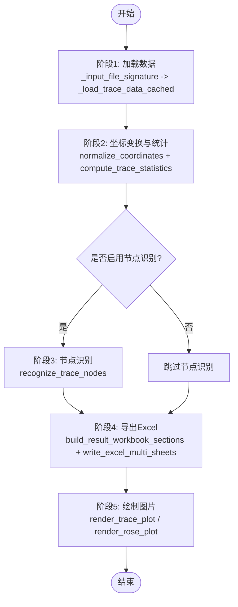
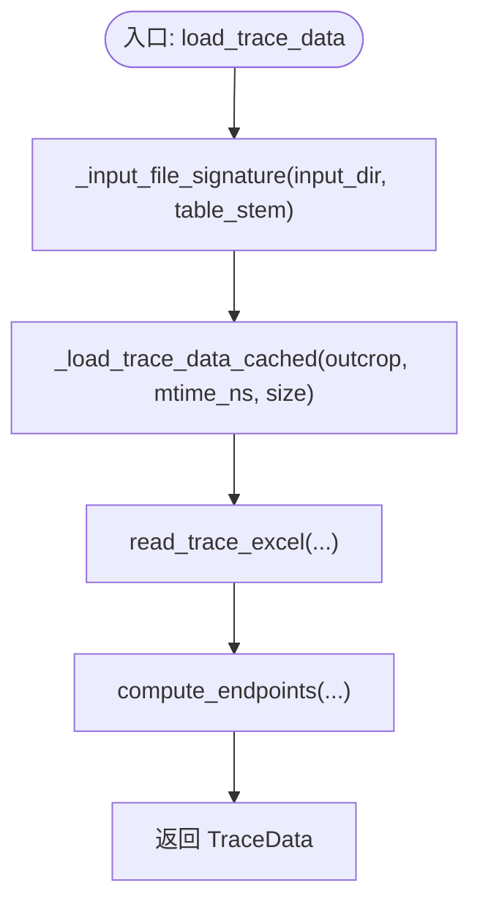
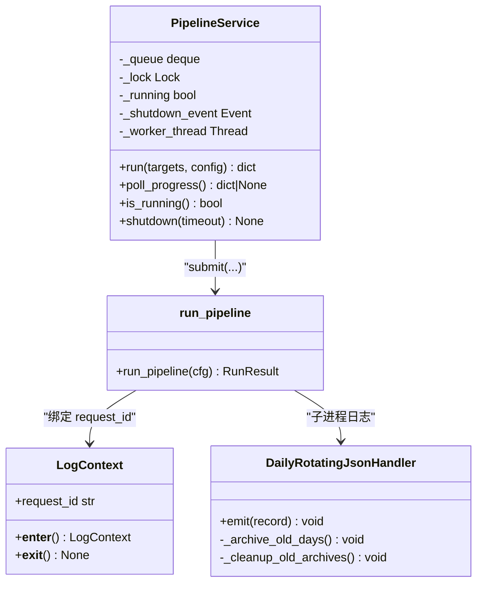
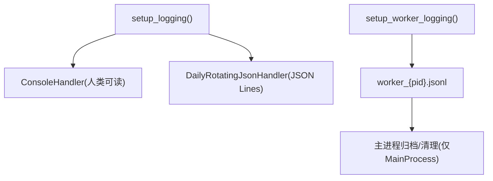
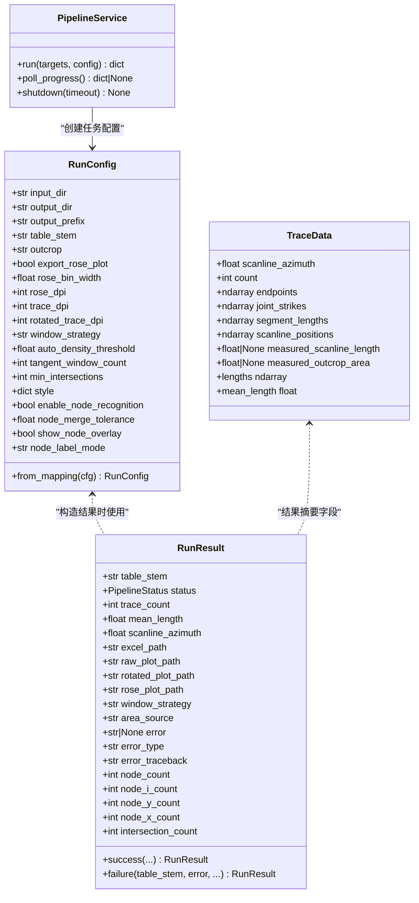
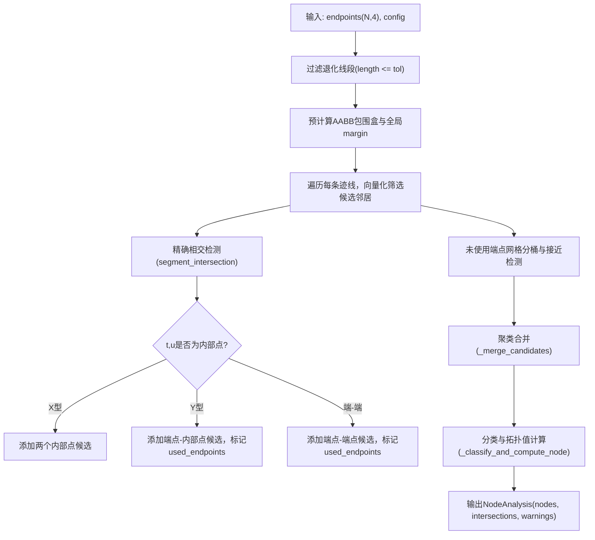
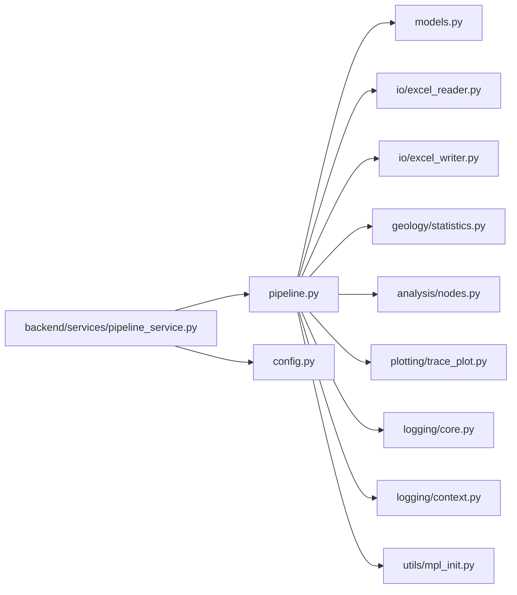

# 流水线编排引擎

<cite>
**本文引用的文件列表**
- [trace_pipeline/pipeline.py](file://trace_pipeline/pipeline.py)
- [backend/services/pipeline_service.py](file://backend/services/pipeline_service.py)
- [trace_pipeline/config.py](file://trace_pipeline/config.py)
- [trace_pipeline/models.py](file://trace_pipeline/models.py)
- [trace_pipeline/logging/core.py](file://trace_pipeline/logging/core.py)
- [trace_pipeline/logging/context.py](file://trace_pipeline/logging/context.py)
- [trace_pipeline/utils/mpl_init.py](file://trace_pipeline/utils/mpl_init.py)
- [trace_pipeline/io/excel_reader.py](file://trace_pipeline/io/excel_reader.py)
- [trace_pipeline/analysis/nodes.py](file://trace_pipeline/analysis/nodes.py)
- [trace_pipeline/geology/statistics.py](file://trace_pipeline/geology/statistics.py)
- [trace_pipeline/plotting/trace_plot.py](file://trace_pipeline/plotting/trace_plot.py)
- [trace_pipeline/io/excel_writer.py](file://trace_pipeline/io/excel_writer.py)
- [config.example.json](file://config.example.json)
</cite>

## 目录
1. [简介](#简介)
2. [项目结构](#项目结构)
3. [核心组件](#核心组件)
4. [架构总览](#架构总览)
5. [详细组件分析](#详细组件分析)
6. [依赖关系分析](#依赖关系分析)
7. [性能考量](#性能考量)
8. [故障排查指南](#故障排查指南)
9. [结论](#结论)
10. [附录：配置与扩展点](#附录配置与扩展点)

## 简介
本技术文档围绕 TracePipeline 的“五阶段”处理流水线展开，聚焦于 run_pipeline 的核心编排逻辑、阶段间数据传递、错误处理、进度监控与性能统计；深入解释缓存机制（_load_trace_data_cached）与文件签名验证策略；阐述多进程环境下的线程安全与 matplotlib 后端初始化；说明结构化日志系统设计与输出格式；并提供异常处理策略、用户友好错误消息生成、调试信息收集方法，以及流水线配置选项与自定义扩展点的实现方式。

## 项目结构
TracePipeline 采用分层模块化组织：
- trace_pipeline：核心算法与管线（数据处理、几何统计、节点识别、绘图、IO、日志、模型等）
- backend：服务层（GUI/Web 接口、并发调度、路径工具、缓存等）
- frontend：前端界面（Vue + TypeScript）
- tests：测试套件
- reference：参考实现与说明
- scripts：打包脚本

图表来源
- [trace_pipeline/pipeline.py:1-474](file://trace_pipeline/pipeline.py#L1-L474)
- [backend/services/pipeline_service.py:1-346](file://backend/services/pipeline_service.py#L1-L346)
- [trace_pipeline/config.py:1-326](file://trace_pipeline/config.py#L1-L326)
- [trace_pipeline/models.py:1-352](file://trace_pipeline/models.py#L1-L352)
- [trace_pipeline/logging/core.py:1-450](file://trace_pipeline/logging/core.py#L1-L450)
- [trace_pipeline/logging/context.py:1-144](file://trace_pipeline/logging/context.py#L1-L144)
- [trace_pipeline/utils/mpl_init.py:1-24](file://trace_pipeline/utils/mpl_init.py#L1-L24)
- [trace_pipeline/io/excel_reader.py:1-169](file://trace_pipeline/io/excel_reader.py#L1-L169)
- [trace_pipeline/analysis/nodes.py:1-417](file://trace_pipeline/analysis/nodes.py#L1-L417)
- [trace_pipeline/geology/statistics.py:1-391](file://trace_pipeline/geology/statistics.py#L1-L391)
- [trace_pipeline/plotting/trace_plot.py:1-565](file://trace_pipeline/plotting/trace_plot.py#L1-L565)
- [trace_pipeline/io/excel_writer.py:1-489](file://trace_pipeline/io/excel_writer.py#L1-L489)

章节来源
- [trace_pipeline/pipeline.py:1-474](file://trace_pipeline/pipeline.py#L1-L474)
- [backend/services/pipeline_service.py:1-346](file://backend/services/pipeline_service.py#L1-L346)
- [trace_pipeline/config.py:1-326](file://trace_pipeline/config.py#L1-L326)
- [trace_pipeline/models.py:1-352](file://trace_pipeline/models.py#L1-L352)

## 核心组件
- 运行配置与结果模型
  - RunConfig：不可变运行参数，包含输入输出路径、DPI、窗口策略、节点识别开关等字段，提供 from_mapping 工厂方法完成类型归一化与校验。
  - RunResult：不可变结果对象，封装成功/失败状态、统计摘要、产物路径、错误信息等。
  - TraceData：不可变数据容器，承载端点坐标、走向角、长度、位置序列及可选实测面积/测线长度，并内置派生属性（如 lengths、mean_length）。
- 流水线编排器
  - run_pipeline：串联五个阶段（数据加载 → 坐标变换 → 节点识别 → Excel 导出 → 可视化绘制），负责阶段间数据传递、计时、日志、错误处理与最终结果组装。
- 并发调度服务
  - PipelineService：后台线程 + ProcessPoolExecutor 并行执行多个目标，维护线程安全队列用于前端轮询进度，支持优雅关闭与取消。
- 配置系统
  - config.py：默认配置、JSON 覆盖、必填项校验、相对路径解析为绝对路径、CLI 覆盖合并、工作区目录保障。
- 日志系统
  - logging/core.py：JsonFormatter、DailyRotatingJsonHandler（按天目录存储、自动打包旧日志、单文件大小分片）、setup_logging/setup_worker_logging。
  - logging/context.py：基于 contextvars 的 request_id 传播与 timed 计时装饰器。
- 绘图与统计
  - plotting/trace_plot.py：自适应布局、图例、比例尺、指北针、统计框、节点覆盖层绘制。
  - geology/statistics.py：P10/P20/P21、圆窗策略、凸包面积选择回退链、一致性校验告警。
- IO
  - io/excel_reader.py：候选扩展名回退、工作表回退、文件大小上限、基础格式校验。
  - io/excel_writer.py：多工作表输出、样式与字体、中文混排富文本、冻结窗格。
- 节点识别
  - analysis/nodes.py：包围盒筛选、精确相交检测、端点接近聚类、拓扑分类（I/Y/X）。

章节来源
- [trace_pipeline/models.py:1-352](file://trace_pipeline/models.py#L1-L352)
- [trace_pipeline/pipeline.py:1-474](file://trace_pipeline/pipeline.py#L1-L474)
- [backend/services/pipeline_service.py:1-346](file://backend/services/pipeline_service.py#L1-L346)
- [trace_pipeline/config.py:1-326](file://trace_pipeline/config.py#L1-L326)
- [trace_pipeline/logging/core.py:1-450](file://trace_pipeline/logging/core.py#L1-L450)
- [trace_pipeline/logging/context.py:1-144](file://trace_pipeline/logging/context.py#L1-L144)
- [trace_pipeline/plotting/trace_plot.py:1-565](file://trace_pipeline/plotting/trace_plot.py#L1-L565)
- [trace_pipeline/geology/statistics.py:1-391](file://trace_pipeline/geology/statistics.py#L1-L391)
- [trace_pipeline/io/excel_reader.py:1-169](file://trace_pipeline/io/excel_reader.py#L1-L169)
- [trace_pipeline/io/excel_writer.py:1-489](file://trace_pipeline/io/excel_writer.py#L1-L489)
- [trace_pipeline/analysis/nodes.py:1-417](file://trace_pipeline/analysis/nodes.py#L1-L417)

## 架构总览
下图展示了从服务层到核心流水线的调用关系与数据流。

图表来源
- [backend/services/pipeline_service.py:100-346](file://backend/services/pipeline_service.py#L100-L346)
- [trace_pipeline/pipeline.py:230-474](file://trace_pipeline/pipeline.py#L230-L474)
- [trace_pipeline/io/excel_reader.py:36-106](file://trace_pipeline/io/excel_reader.py#L36-L106)
- [trace_pipeline/geology/statistics.py:212-391](file://trace_pipeline/geology/statistics.py#L212-L391)
- [trace_pipeline/analysis/nodes.py:160-417](file://trace_pipeline/analysis/nodes.py#L160-L417)
- [trace_pipeline/io/excel_writer.py:462-489](file://trace_pipeline/io/excel_writer.py#L462-L489)
- [trace_pipeline/plotting/trace_plot.py:443-565](file://trace_pipeline/plotting/trace_plot.py#L443-L565)

## 详细组件分析

### 五阶段流水线与 run_pipeline 核心逻辑
- 阶段 1：数据加载
  - 定位输入文件（.xlsx/.xls），计算文件签名（mtime_ns, size），通过 _load_trace_data_cached 进行 lru_cache 缓存，避免重复解析。
  - 返回 TraceData，包含走向角、端点、走向、长度、位置等。
- 阶段 2：坐标变换与统计
  - normalize_coordinates 将端点旋转到局部坐标系。
  - compute_trace_statistics 计算 P10/P20/P21、平均迹长、面积来源、窗口策略、一致性校验告警等。
  - 构建圆窗覆盖层与凸包覆盖层，供后续绘图使用。
- 阶段 3：节点识别（可选）
  - recognize_trace_nodes 基于包围盒筛选与精确相交检测，结合端点接近聚类，输出 I/Y/X 三类节点与交点事件。
  - 生成原始与旋转坐标系下的节点覆盖层。
- 阶段 4：Excel 导出
  - build_result_workbook_sections 组装基本信息、裂隙情况、计算数据、原始/旋转坐标、走向与长度、节点统计/明细/交点等区段。
  - write_excel_multi_sheets 写入多工作表并应用样式。
- 阶段 5：可视化绘制
  - render_trace_plot 绘制原始/旋转迹线图，可选玫瑰图；支持自适应布局、图例、比例尺、指北针、统计框、节点覆盖层。

图表来源
- [trace_pipeline/pipeline.py:230-474](file://trace_pipeline/pipeline.py#L230-L474)
- [trace_pipeline/io/excel_reader.py:36-106](file://trace_pipeline/io/excel_reader.py#L36-L106)
- [trace_pipeline/geology/statistics.py:212-391](file://trace_pipeline/geology/statistics.py#L212-L391)
- [trace_pipeline/analysis/nodes.py:160-417](file://trace_pipeline/analysis/nodes.py#L160-L417)
- [trace_pipeline/io/excel_writer.py:462-489](file://trace_pipeline/io/excel_writer.py#L462-L489)
- [trace_pipeline/plotting/trace_plot.py:443-565](file://trace_pipeline/plotting/trace_plot.py#L443-L565)

章节来源
- [trace_pipeline/pipeline.py:230-474](file://trace_pipeline/pipeline.py#L230-L474)

### 缓存机制与文件签名验证
- 文件签名
  - _input_file_signature 根据 input_dir 与 table_stem 定位 .xlsx/.xls，返回 (path, mtime_ns, size)。
- 缓存键与失效
  - _load_trace_data_cached 使用 lru_cache(maxsize=16)，键包含 outcrop、mtime_ns、size，确保文件内容或时间变化时缓存失效。
- 加载流程
  - load_trace_data 先计算签名，再调用缓存加载器，记录耗时与统计摘要。

图表来源
- [trace_pipeline/pipeline.py:50-95](file://trace_pipeline/pipeline.py#L50-L95)
- [trace_pipeline/io/excel_reader.py:36-106](file://trace_pipeline/io/excel_reader.py#L36-L106)

章节来源
- [trace_pipeline/pipeline.py:50-95](file://trace_pipeline/pipeline.py#L50-L95)

### 多进程环境与线程安全
- 子进程安全
  - run_pipeline 在子进程中强制设置 matplotlib 非交互后端（Agg），并重新配置样式；同时调用 setup_worker_logging 初始化独立日志处理器。
- 并发调度
  - PipelineService 使用 ProcessPoolExecutor 并行提交 run_pipeline 任务，max_workers 由 parallel_workers 与 CPU 核心数共同决定。
- 进度与取消
  - 后台线程维护线程安全队列，前端轮询获取进度；支持 shutdown_event 提前退出剩余任务。

图表来源
- [backend/services/pipeline_service.py:32-346](file://backend/services/pipeline_service.py#L32-L346)
- [trace_pipeline/pipeline.py:230-253](file://trace_pipeline/pipeline.py#L230-L253)
- [trace_pipeline/logging/core.py:148-305](file://trace_pipeline/logging/core.py#L148-L305)
- [trace_pipeline/logging/context.py:27-56](file://trace_pipeline/logging/context.py#L27-L56)

章节来源
- [backend/services/pipeline_service.py:100-346](file://backend/services/pipeline_service.py#L100-L346)
- [trace_pipeline/pipeline.py:230-253](file://trace_pipeline/pipeline.py#L230-L253)
- [trace_pipeline/utils/mpl_init.py:12-24](file://trace_pipeline/utils/mpl_init.py#L12-L24)
- [trace_pipeline/logging/core.py:401-450](file://trace_pipeline/logging/core.py#L401-L450)

### 日志系统与结构化日志格式
- JsonFormatter
  - 输出字段包括 timestamp、level、logger、module、funcName、lineno、message、request_id、exc_info、extra。
  - 对 NaN/inf 进行清洗，保证标准 JSON 输出。
- DailyRotatingJsonHandler
  - 按天目录存放 JSON Lines，主进程仅执行归档与清理，子进程写入 worker_{pid}.jsonl。
  - 单文件超过阈值自动分片，旧目录打包 zip 并删除原目录，保留最近 30 天压缩包。
- 上下文与计时
  - LogContext 绑定 request_id，timed/timed_ctx 提供函数级/块级计时与异常记录。

图表来源
- [trace_pipeline/logging/core.py:326-398](file://trace_pipeline/logging/core.py#L326-L398)
- [trace_pipeline/logging/core.py:401-450](file://trace_pipeline/logging/core.py#L401-L450)
- [trace_pipeline/logging/context.py:27-56](file://trace_pipeline/logging/context.py#L27-L56)

章节来源
- [trace_pipeline/logging/core.py:1-450](file://trace_pipeline/logging/core.py#L1-L450)
- [trace_pipeline/logging/context.py:1-144](file://trace_pipeline/logging/context.py#L1-L144)

### 异常处理与用户友好错误消息
- 统一错误处理
  - _handle_pipeline_error 记录错误类型、耗时、可选堆栈，返回 RunResult.failure。
- 特定异常友好提示
  - PermissionError：提示文件被占用或权限不足，建议关闭 Excel/WPS。
  - FileNotFoundError：提示输入文件不存在。
  - ValueError/KeyError/TypeError/IndexError/OSError：通用错误。
  - MemoryError/KeyboardInterrupt：向上传播，不吞没。
- 服务层捕获
  - PipelineService 在 as_completed 中捕获异常并转换为失败结果，附带错误类型与消息。

章节来源
- [trace_pipeline/pipeline.py:98-129](file://trace_pipeline/pipeline.py#L98-L129)
- [trace_pipeline/pipeline.py:450-474](file://trace_pipeline/pipeline.py#L450-L474)
- [backend/services/pipeline_service.py:222-305](file://backend/services/pipeline_service.py#L222-L305)

### 进度监控与性能统计
- 进度事件
  - PipelineService 在启动、每任务完成、全部完成时发出 progress/file_complete/complete 事件，包含 current/total/filename/message/result。
- 性能统计
  - run_pipeline 在每个阶段前后记录耗时（ms），并在日志 extra 中包含 stage/outcrop/duration_ms 等字段。
  - statistics 模块输出 P10/P20/P21、面积来源、窗口策略、一致性告警等关键指标。

章节来源
- [backend/services/pipeline_service.py:116-325](file://backend/services/pipeline_service.py#L116-L325)
- [trace_pipeline/pipeline.py:254-418](file://trace_pipeline/pipeline.py#L254-L418)
- [trace_pipeline/geology/statistics.py:338-391](file://trace_pipeline/geology/statistics.py#L338-L391)

### 数据模型与类关系

图表来源
- [trace_pipeline/models.py:41-352](file://trace_pipeline/models.py#L41-L352)
- [backend/services/pipeline_service.py:32-100](file://backend/services/pipeline_service.py#L32-L100)

章节来源
- [trace_pipeline/models.py:1-352](file://trace_pipeline/models.py#L1-L352)
- [backend/services/pipeline_service.py:1-100](file://backend/services/pipeline_service.py#L1-L100)

### 节点识别算法流程

图表来源
- [trace_pipeline/analysis/nodes.py:160-417](file://trace_pipeline/analysis/nodes.py#L160-L417)

章节来源
- [trace_pipeline/analysis/nodes.py:1-417](file://trace_pipeline/analysis/nodes.py#L1-L417)

## 依赖关系分析
- 模块耦合
  - pipeline.py 作为编排中心，依赖 models、io、geology、analysis、plotting、logging、utils。
  - backend/services/pipeline_service.py 依赖 trace_pipeline.pipeline.run_pipeline 与 trace_pipeline.config.resolve_io_paths。
- 外部依赖
  - numpy、pandas、openpyxl、matplotlib 为核心依赖。
- 潜在循环依赖
  - 当前结构未见明显循环导入；logging 与 utils 为底层支撑。

图表来源
- [trace_pipeline/pipeline.py:1-474](file://trace_pipeline/pipeline.py#L1-L474)
- [backend/services/pipeline_service.py:1-346](file://backend/services/pipeline_service.py#L1-L346)
- [trace_pipeline/config.py:1-326](file://trace_pipeline/config.py#L1-L326)

章节来源
- [trace_pipeline/pipeline.py:1-474](file://trace_pipeline/pipeline.py#L1-L474)
- [backend/services/pipeline_service.py:1-346](file://backend/services/pipeline_service.py#L1-L346)

## 性能考量
- 缓存与去重
  - lru_cache 基于文件签名避免重复解析；DirectoryChangeDetector/TTLCache 可用于更广泛的缓存场景（当前未在 pipeline 中使用）。
- 并行执行
  - ProcessPoolExecutor 并行度受 parallel_workers 与 CPU 核心数限制；spawn 上下文确保子进程独立初始化。
- 绘图优化
  - 节点覆盖层按类型分组批量 scatter；自适应 figure 尺寸保持物理尺度一致。
- 日志开销
  - JSON Lines 异步写入，单文件大小分片；子进程独立日志文件减少竞争。

[本节为通用指导，无需具体文件分析]

## 故障排查指南
- 常见错误与修复
  - 文件被占用/权限不足：关闭 Excel/WPS 后重试；检查输出目录权限。
  - 输入文件不存在：确认 input_dir 与 table_stem 正确，文件格式为 .xlsx/.xls。
  - 内存不足：降低并行度或 DPI，分批处理。
- 调试信息收集
  - 查看 logs 目录下当天 run_*.jsonl 与 worker_{pid}.jsonl，关注 stage、duration_ms、error、error_type。
  - 使用 request_id 关联一次处理的完整日志。
- 服务层问题
  - 若任务长时间未完成，检查是否有长时间绘图或 Excel 写入操作；可调用 shutdown(timeout) 优雅关闭。

章节来源
- [trace_pipeline/pipeline.py:450-474](file://trace_pipeline/pipeline.py#L450-L474)
- [backend/services/pipeline_service.py:74-95](file://backend/services/pipeline_service.py#L74-L95)
- [trace_pipeline/logging/core.py:148-305](file://trace_pipeline/logging/core.py#L148-L305)

## 结论
TracePipeline 的流水线编排引擎以 run_pipeline 为核心，清晰划分五阶段职责，配合健壮的错误处理、结构化日志、并行调度与绘图/导出能力，形成稳定高效的地质迹线处理方案。其缓存与文件签名策略有效避免重复计算，多进程与线程安全设计保障了可扩展性与可靠性。

[本节为总结性内容，无需具体文件分析]

## 附录：配置与扩展点

### 配置选项说明
- 基本路径与标识
  - input_dir/output_dir/output_prefix/table_stem/outcrop：输入输出目录、输出前缀、表名前缀、露头标识。
- 输出控制
  - export_rose_plot/rose_bin_width/rose_dpi/trace_dpi/rotated_trace_dpi：是否导出玫瑰图、分箱宽度、分辨率。
- 统计与窗口策略
  - window_strategy/auto_density_threshold/tangent_window_count/min_intersections：圆窗策略与阈值。
- 节点识别
  - enable_node_recognition/node_merge_tolerance/show_node_overlay/node_label_mode：是否启用节点识别、合并容差、是否显示覆盖层、标签模式。
- 并行与开发
  - parallel_workers/is_dev_mode：并行工作进程数、开发模式标志。

章节来源
- [trace_pipeline/config.py:56-79](file://trace_pipeline/config.py#L56-L79)
- [config.example.json:1-26](file://config.example.json#L1-L26)

### 自定义扩展点
- 新增阶段
  - 在 run_pipeline 中插入新阶段，定义输入/输出数据结构，遵循现有日志与错误处理模式。
- 自定义统计指标
  - 在 geology/statistics.py 中扩展计算逻辑，更新 TraceStatistics 与格式化输出。
- 自定义节点识别
  - 在 analysis/nodes.py 中替换或增强相交检测与聚类策略，调整 NodeRecognitionConfig。
- 自定义绘图图层
  - 在 plotting/trace_plot.py 中添加新的覆盖层（如热力图、密度场），并在 overlays 中提供构建函数。
- 自定义 Excel 输出
  - 在 io/excel_writer.py 中增加新的 ExcelSection，丰富报告内容。

[本节为概念性指导，无需具体文件分析]