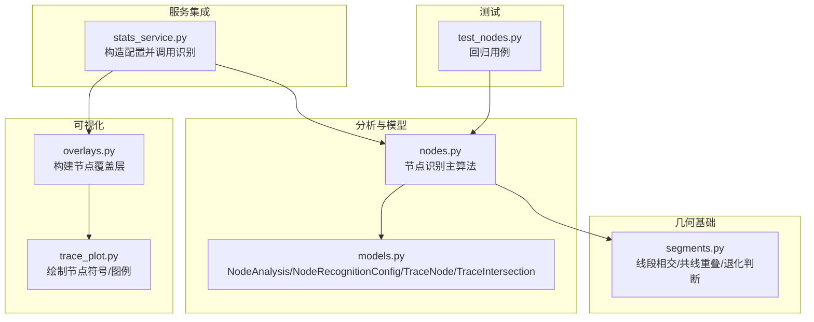
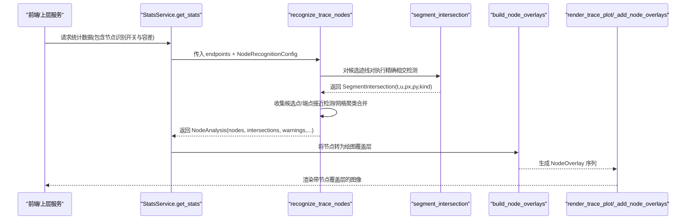
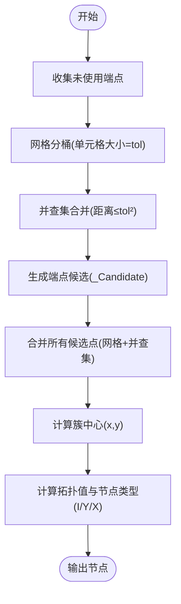
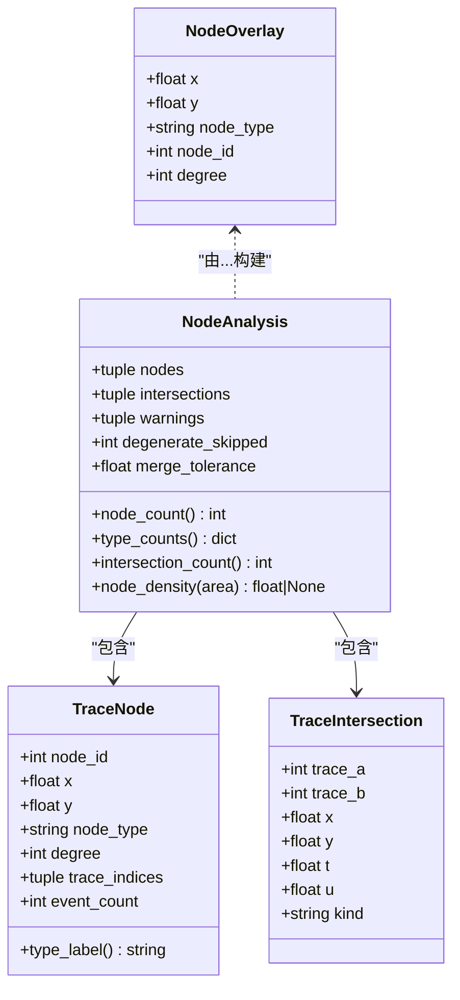
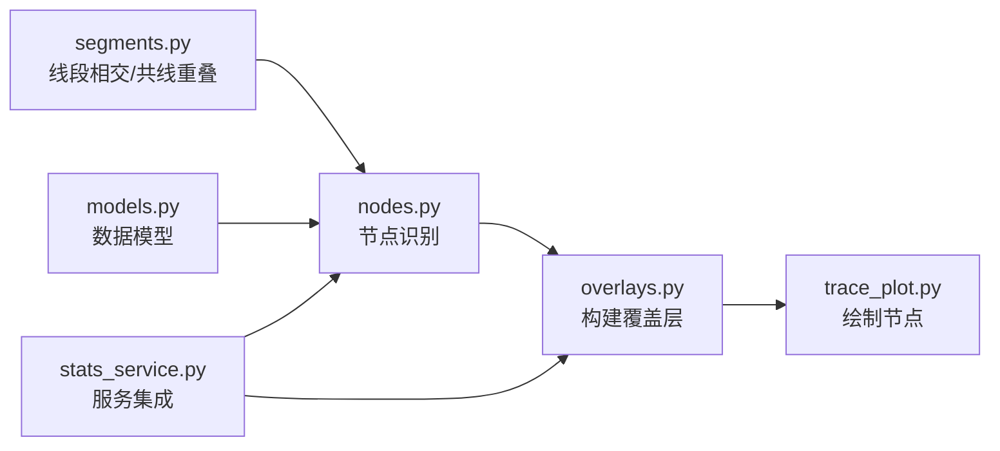

# 节点识别算法

<cite>
**本文引用的文件**   
- [trace_pipeline/analysis/nodes.py](file://trace_pipeline/analysis/nodes.py)
- [trace_pipeline/analysis/models.py](file://trace_pipeline/analysis/models.py)
- [trace_pipeline/geometry/segments.py](file://trace_pipeline/geometry/segments.py)
- [trace_pipeline/plotting/overlays.py](file://trace_pipeline/plotting/overlays.py)
- [trace_pipeline/plotting/trace_plot.py](file://trace_pipeline/plotting/trace_plot.py)
- [backend/services/stats_service.py](file://backend/services/stats_service.py)
- [tests/test_nodes.py](file://tests/test_nodes.py)
</cite>

## 目录
1. [引言](#引言)
2. [项目结构](#项目结构)
3. [核心组件](#核心组件)
4. [架构总览](#架构总览)
5. [详细组件分析](#详细组件分析)
6. [依赖关系分析](#依赖关系分析)
7. [性能与内存优化](#性能与内存优化)
8. [故障排查指南](#故障排查指南)
9. [结论](#结论)
10. [附录：调用示例与结果分析方法](#附录调用示例与结果分析方法)

## 引言
本技术文档聚焦于 TracePipeline 的“节点识别算法”，面向岩体节理拓扑中的 I/Y/X 型节点进行几何特征定义、判别标准与实现逻辑的系统性说明。文档涵盖线段相交检测、端点接近检测、空间聚类合并、容差参数设置与调优方法，并给出 NodeRecognitionConfig 配置项的作用与最佳实践；同时阐述节点分析结果的结构与指标（如节点类型统计、交点事件计数等），并提供可视化覆盖层构建逻辑、集成方式以及大规模数据处理下的性能优化策略。

## 项目结构
与节点识别相关的代码主要分布在以下模块：
- 分析与模型：nodes.py、models.py
- 几何基础：segments.py
- 可视化覆盖层：plotting/overlays.py、plotting/trace_plot.py
- 服务集成：backend/services/stats_service.py
- 单元测试：tests/test_nodes.py

图表来源
- [trace_pipeline/analysis/nodes.py:1-417](file://trace_pipeline/analysis/nodes.py#L1-L417)
- [trace_pipeline/analysis/models.py:1-98](file://trace_pipeline/analysis/models.py#L1-L98)
- [trace_pipeline/geometry/segments.py:1-197](file://trace_pipeline/geometry/segments.py#L1-L197)
- [trace_pipeline/plotting/overlays.py:1-156](file://trace_pipeline/plotting/overlays.py#L1-L156)
- [trace_pipeline/plotting/trace_plot.py:1-565](file://trace_pipeline/plotting/trace_plot.py#L1-L565)
- [backend/services/stats_service.py:1-380](file://backend/services/stats_service.py#L1-L380)
- [tests/test_nodes.py:1-149](file://tests/test_nodes.py#L1-L149)

章节来源
- [trace_pipeline/analysis/nodes.py:1-417](file://trace_pipeline/analysis/nodes.py#L1-L417)
- [trace_pipeline/analysis/models.py:1-98](file://trace_pipeline/analysis/models.py#L1-L98)
- [trace_pipeline/geometry/segments.py:1-197](file://trace_pipeline/geometry/segments.py#L1-L197)
- [trace_pipeline/plotting/overlays.py:1-156](file://trace_pipeline/plotting/overlays.py#L1-L156)
- [trace_pipeline/plotting/trace_plot.py:1-565](file://trace_pipeline/plotting/trace_plot.py#L1-L565)
- [backend/services/stats_service.py:1-380](file://backend/services/stats_service.py#L1-L380)
- [tests/test_nodes.py:1-149](file://tests/test_nodes.py#L1-L149)

## 核心组件
- 节点识别主函数 recognize_trace_nodes：输入迹线端点数组与配置，输出节点列表、相交事件、警告与元信息。
- 几何相交工具 segment_intersection：计算两条线段的相交事件（含端点/内部/平行重叠）。
- 数据模型：
  - NodeRecognitionConfig：控制是否启用、合并容差、覆盖层显示与标签模式。
  - TraceNode：单个节点的坐标、类型、度（拓扑值）、参与迹线索引、事件数。
  - TraceIntersection：两迹线之间的相交事件（含 t/u 参数与 kind）。
  - NodeAnalysis：聚合结果，提供 type_counts、intersection_count、node_density 等便捷属性。

章节来源
- [trace_pipeline/analysis/nodes.py:160-417](file://trace_pipeline/analysis/nodes.py#L160-L417)
- [trace_pipeline/geometry/segments.py:42-113](file://trace_pipeline/geometry/segments.py#L42-L113)
- [trace_pipeline/analysis/models.py:22-98](file://trace_pipeline/analysis/models.py#L22-L98)

## 架构总览
节点识别在整体系统中的调用路径如下：

图表来源
- [backend/services/stats_service.py:190-201](file://backend/services/stats_service.py#L190-L201)
- [trace_pipeline/analysis/nodes.py:160-417](file://trace_pipeline/analysis/nodes.py#L160-L417)
- [trace_pipeline/geometry/segments.py:42-113](file://trace_pipeline/geometry/segments.py#L42-L113)
- [trace_pipeline/plotting/overlays.py:117-131](file://trace_pipeline/plotting/overlays.py#L117-L131)
- [trace_pipeline/plotting/trace_plot.py:320-357](file://trace_pipeline/plotting/trace_plot.py#L320-L357)

## 详细组件分析

### 节点类型定义与判别标准
- I 型（孤立端点）：端点未与其他迹线接触，或仅通过端点接近被聚合成孤立点。
- Y 型（三叉节点）：一条迹线的端点落在另一条迹线内部（端-中接触），或拓扑值达到三叉条件。
- X 型（交叉节点）：两条迹线在各自内部位置相交（中-中接触）。

判别依据：
- 内部判定：使用 _is_interior(param, tol)，当参数位于 (tol, 1-tol) 区间时视为内部。
- 拓扑值计算：每条迹线贡献 2（内部穿过）或 1-2（端点参与），累加得到 degree。
- 分类规则：
  - 若内部参与迹线数量 ≥ 2 → X 型
  - 否则若内部参与迹线数量 = 1 或 degree ≥ 3 → Y 型
  - 否则 → I 型

章节来源
- [trace_pipeline/analysis/nodes.py:47-50](file://trace_pipeline/analysis/nodes.py#L47-L50)
- [trace_pipeline/analysis/nodes.py:121-158](file://trace_pipeline/analysis/nodes.py#L121-L158)

### 线段相交检测与事件分类
- 使用 segment_intersection 计算两条线段的相交事件，支持：
  - 非平行相交：返回 t、u、交点坐标 px/py，并标记 kind 为 endpoint/internal。
  - 平行且共线：通过 collinear_overlap 计算重叠区间，取中点作为代表交点，kind=parallel_overlap。
- 上层根据 t、u 是否处于内部区间进行分类：
  - internal & internal → X 型候选
  - endpoint & internal → Y 型候选（记录使用的端点）
  - endpoint & endpoint → 端-端接触（用于后续端点接近检测）

章节来源
- [trace_pipeline/geometry/segments.py:42-113](file://trace_pipeline/geometry/segments.py#L42-L113)
- [trace_pipeline/geometry/segments.py:116-177](file://trace_pipeline/geometry/segments.py#L116-L177)
- [trace_pipeline/analysis/nodes.py:276-319](file://trace_pipeline/analysis/nodes.py#L276-L319)

### 端点接近检测与空间聚类合并
- 端点接近检测：
  - 收集未被相交事件使用的端点，按网格分桶，基于距离阈值 tol 进行并查集合并，生成候选点。
- 候选点聚类合并：
  - 对所有候选点（来自相交与端点接近）进行空间网格 + 并查集聚类，合并容差 cluster_tol=max(tol, 0.01*mean_len)。
  - 每个簇中心作为最终节点坐标，并统计参与迹线与事件数。

图表来源
- [trace_pipeline/analysis/nodes.py:320-385](file://trace_pipeline/analysis/nodes.py#L320-L385)
- [trace_pipeline/analysis/nodes.py:78-118](file://trace_pipeline/analysis/nodes.py#L78-L118)

章节来源
- [trace_pipeline/analysis/nodes.py:320-385](file://trace_pipeline/analysis/nodes.py#L320-L385)
- [trace_pipeline/analysis/nodes.py:78-118](file://trace_pipeline/analysis/nodes.py#L78-L118)

### 容差参数设置与调优方法
- merge_tolerance：
  - 影响退化线段过滤、相交判定内部区间、端点接近检测与候选点聚类合并。
  - 默认 0.01，需大于 0。
- 聚类容差 cluster_tol：
  - 自动设置为 max(tol, 0.01*mean_len)，以平均迹线长度自适应。
- label_mode：
  - 控制节点标签显示模式（none/type/id），不影响识别逻辑，仅影响可视化标注。
- show_overlay：
  - 控制是否在图中显示节点覆盖层。

调优建议：
- 对于高密度网络，适当增大 merge_tolerance 以减少碎片化节点。
- 对于低密度或长迹线场景，可减小 merge_tolerance 以避免误合并。
- 观察 warnings 中的“跳过退化线段”提示，结合 mean_len 调整容差。

章节来源
- [trace_pipeline/analysis/models.py:22-36](file://trace_pipeline/analysis/models.py#L22-L36)
- [trace_pipeline/analysis/nodes.py:182-196](file://trace_pipeline/analysis/nodes.py#L182-L196)
- [trace_pipeline/analysis/nodes.py:407-416](file://trace_pipeline/analysis/nodes.py#L407-L416)

### 节点分析结果结构与属性
- NodeAnalysis.nodes：节点列表，包含 node_id、x、y、node_type、degree、trace_indices、event_count。
- NodeAnalysis.intersections：相交事件列表，包含 trace_a、trace_b、x、y、t、u、kind。
- NodeAnalysis.warnings：处理过程中的警告信息（如退化线段跳过）。
- NodeAnalysis.degenerate_skipped：跳过的退化线段数量。
- NodeAnalysis.merge_tolerance：实际使用的聚类合并容差。
- 便捷属性：
  - node_count：节点总数
  - type_counts：I/Y/X 类型计数
  - intersection_count：相交事件总数
  - node_density(area)：单位面积节点密度（需要有效面积）

章节来源
- [trace_pipeline/analysis/models.py:38-98](file://trace_pipeline/analysis/models.py#L38-L98)
- [trace_pipeline/analysis/nodes.py:387-416](file://trace_pipeline/analysis/nodes.py#L387-L416)

### 可视化覆盖层构建与集成
- build_node_overlays：将 NodeAnalysis.nodes 转换为 NodeOverlay 序列。
- build_rotated_node_overlays：将原始节点坐标旋转到测线坐标系。
- render_trace_plot/_add_node_overlays：按节点类型分组批量 scatter 绘制，提升性能；图例中包含节点类型及计数。

图表来源
- [trace_pipeline/plotting/overlays.py:117-131](file://trace_pipeline/plotting/overlays.py#L117-L131)
- [trace_pipeline/plotting/trace_plot.py:88-97](file://trace_pipeline/plotting/trace_plot.py#L88-L97)
- [trace_pipeline/plotting/trace_plot.py:320-357](file://trace_pipeline/plotting/trace_plot.py#L320-L357)
- [trace_pipeline/analysis/models.py:38-98](file://trace_pipeline/analysis/models.py#L38-L98)

章节来源
- [trace_pipeline/plotting/overlays.py:117-156](file://trace_pipeline/plotting/overlays.py#L117-L156)
- [trace_pipeline/plotting/trace_plot.py:320-357](file://trace_pipeline/plotting/trace_plot.py#L320-L357)

## 依赖关系分析
- nodes.py 依赖 segments.py 的 segment_intersection 与 collinear_overlap，用于精确相交与共线重叠处理。
- nodes.py 依赖 models.py 的数据类，用于配置与结果封装。
- stats_service.py 负责从配置构造 NodeRecognitionConfig 并调用识别，再将结果转换为覆盖层供前端展示。
- overlays.py 与 trace_plot.py 负责将节点结果映射到可视化对象并在图中绘制。

图表来源
- [trace_pipeline/geometry/segments.py:1-197](file://trace_pipeline/geometry/segments.py#L1-L197)
- [trace_pipeline/analysis/nodes.py:1-417](file://trace_pipeline/analysis/nodes.py#L1-L417)
- [trace_pipeline/analysis/models.py:1-98](file://trace_pipeline/analysis/models.py#L1-L98)
- [trace_pipeline/plotting/overlays.py:1-156](file://trace_pipeline/plotting/overlays.py#L1-L156)
- [trace_pipeline/plotting/trace_plot.py:1-565](file://trace_pipeline/plotting/trace_plot.py#L1-L565)
- [backend/services/stats_service.py:1-380](file://backend/services/stats_service.py#L1-L380)

章节来源
- [trace_pipeline/analysis/nodes.py:1-417](file://trace_pipeline/analysis/nodes.py#L1-L417)
- [trace_pipeline/geometry/segments.py:1-197](file://trace_pipeline/geometry/segments.py#L1-L197)
- [trace_pipeline/analysis/models.py:1-98](file://trace_pipeline/analysis/models.py#L1-L98)
- [trace_pipeline/plotting/overlays.py:1-156](file://trace_pipeline/plotting/overlays.py#L1-L156)
- [trace_pipeline/plotting/trace_plot.py:1-565](file://trace_pipeline/plotting/trace_plot.py#L1-L565)
- [backend/services/stats_service.py:1-380](file://backend/services/stats_service.py#L1-L380)

## 性能与内存优化
- 包围盒快速筛选：
  - 预计算每条迹线的 AABB 包围盒，向量化筛选可能相交的候选对，减少不必要的精确相交计算。
- 网格分桶与并查集：
  - 端点接近检测与候选点聚类均采用网格分桶 + 并查集，避免 O(N^2) 全量比较。
- NumPy 向量化：
  - 大量使用向量操作（hypot、column_stack、布尔掩码）降低循环开销。
- 退化线段过滤：
  - 提前剔除长度小于容差的退化线段，减少无效计算。
- 批量绘制：
  - 可视化阶段按节点类型分组批量 scatter，减少绘图调用次数。
- 坐标溢出防护：
  - 对极大坐标值发出警告，防止网格索引溢出导致异常。

章节来源
- [trace_pipeline/analysis/nodes.py:232-271](file://trace_pipeline/analysis/nodes.py#L232-L271)
- [trace_pipeline/analysis/nodes.py:320-385](file://trace_pipeline/analysis/nodes.py#L320-L385)
- [trace_pipeline/plotting/trace_plot.py:320-357](file://trace_pipeline/plotting/trace_plot.py#L320-L357)

## 故障排查指南
- 无节点或节点过少：
  - 检查 enable_node_recognition 是否开启；确认 merge_tolerance 是否过大导致过度合并。
  - 查看 warnings 中是否有“跳过退化线段”提示，必要时调整容差。
- 节点过多或碎片化：
  - 增大 merge_tolerance 或提高 cluster_tol（通过增大 merge_tolerance 间接提升）。
- 并行与内存问题：
  - 后端 PipelineService 支持多进程并行，注意系统内存限制；遇到 MemoryError 应减少并发或分批处理。
- 可视化不显示节点：
  - 确认 show_overlay 为 True；检查 label_mode 与样式配置；确保 has_nodes 为真。

章节来源
- [trace_pipeline/analysis/nodes.py:407-416](file://trace_pipeline/analysis/nodes.py#L407-L416)
- [backend/services/pipeline_service.py:225-233](file://backend/services/pipeline_service.py#L225-L233)
- [trace_pipeline/plotting/trace_plot.py:320-357](file://trace_pipeline/plotting/trace_plot.py#L320-L357)

## 结论
TracePipeline 的节点识别算法通过几何相交检测、端点接近检测与空间聚类合并，实现了 I/Y/X 型节点的稳健识别。其设计兼顾了性能与可扩展性，采用包围盒筛选、网格分桶与并查集等技术，有效降低了复杂度并提升了大规模数据处理能力。配合可视化覆盖层与服务集成，用户可在前后端统一体验下完成节点识别与分析。

## 附录：调用示例与结果分析方法
- 基本调用流程（参考测试用例）：
  - 构造 NodeRecognitionConfig（enabled=True，merge_tolerance=0.01）。
  - 准备端点数组 endpoints（N×4，列序 [x1,y1,x2,y2]）。
  - 调用 recognize_trace_nodes(endpoints, config) 获取 NodeAnalysis。
  - 读取 result.node_count、result.type_counts、result.intersection_count 等指标。
- 结果分析方法：
  - 类型统计：I/Y/X 三类节点数量之和等于 node_count。
  - 密度评估：在已知露头面积 area 的情况下，使用 node_density(area) 计算单位面积节点密度。
  - 可视化验证：通过 build_node_overlays 与 render_trace_plot 叠加节点覆盖层，直观校验识别效果。
- 典型场景参考：
  - 交叉节点（X 型）：两条迹线内部相交。
  - 端点接触（Y 型）：一条迹线端点落在另一条迹线内部。
  - 退化线段：长度小于容差，被跳过并产生警告。
  - 共线重叠：共线且存在重叠，产生节点。

章节来源
- [tests/test_nodes.py:25-131](file://tests/test_nodes.py#L25-L131)
- [backend/services/stats_service.py:190-201](file://backend/services/stats_service.py#L190-L201)
- [trace_pipeline/analysis/models.py:79-98](file://trace_pipeline/analysis/models.py#L79-L98)