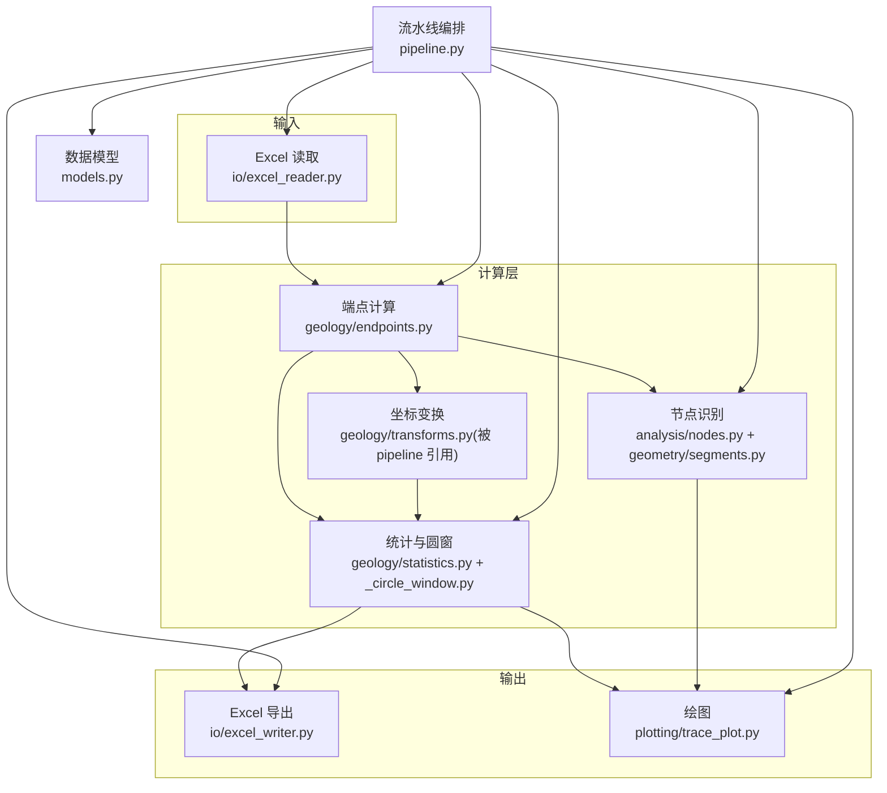
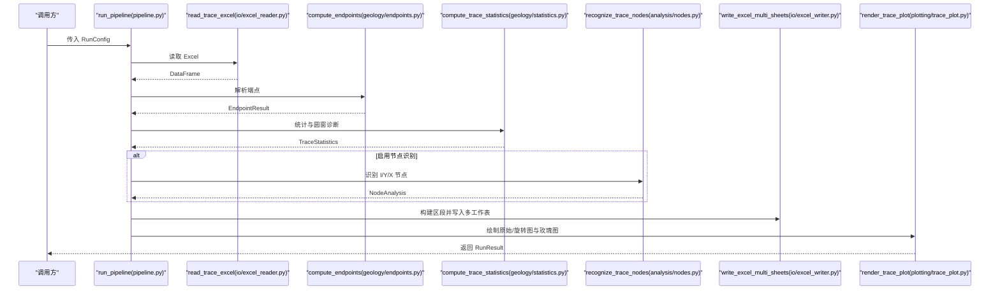
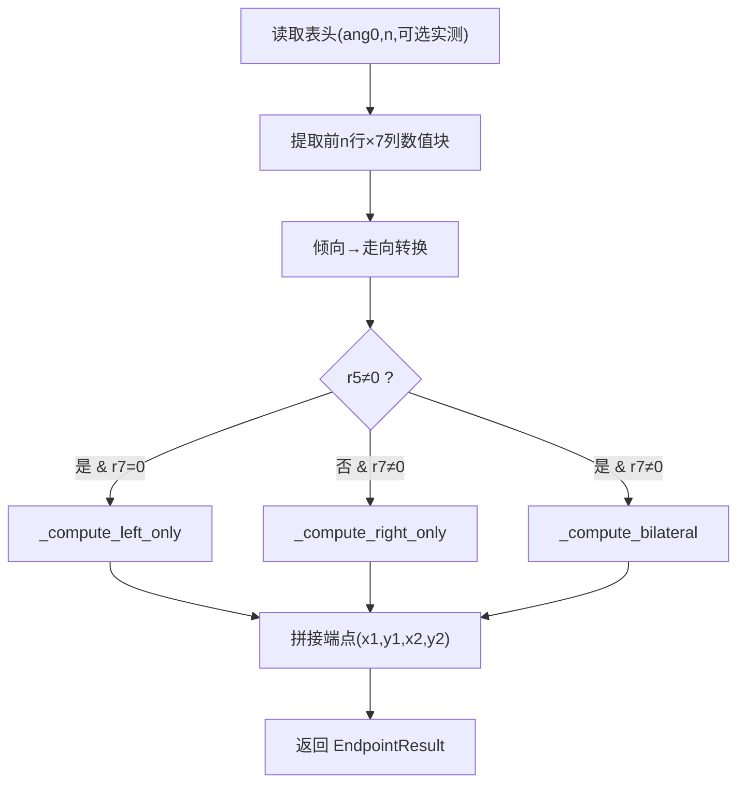
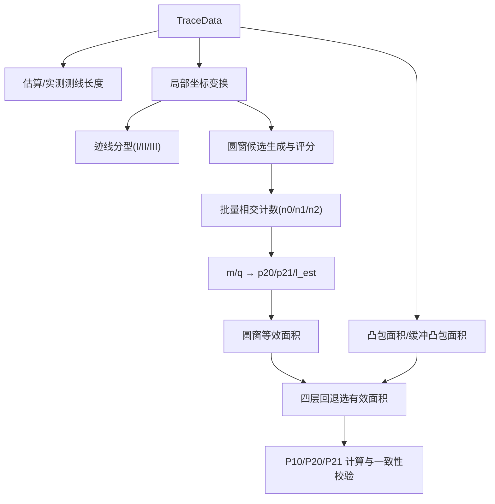
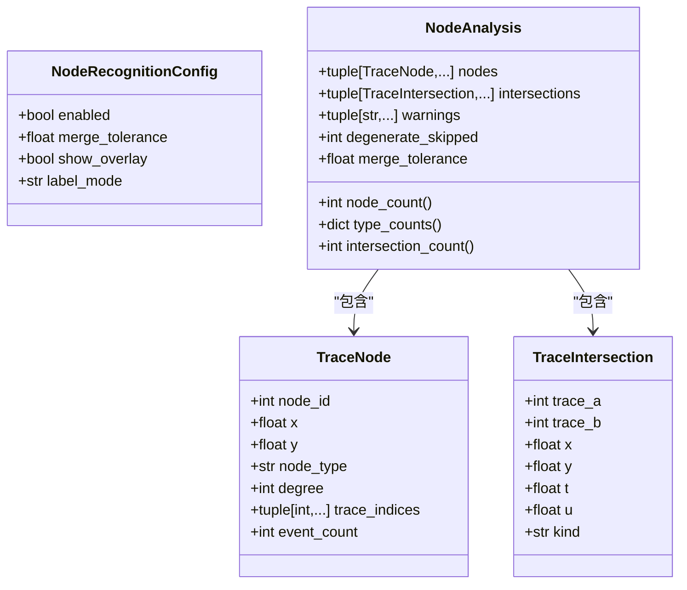
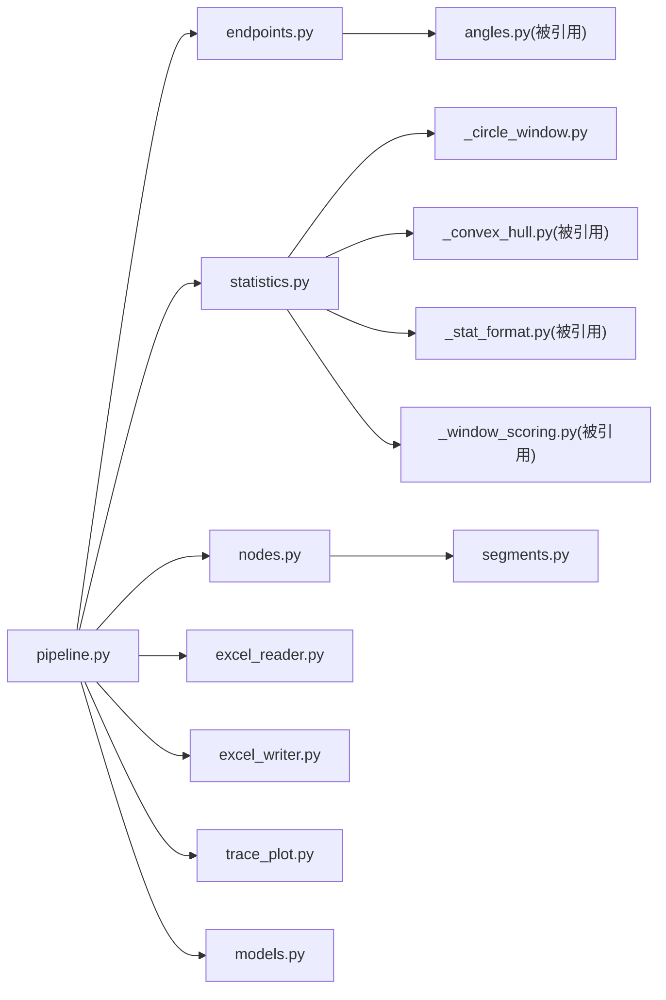

# 计算层（核心算法）

<cite>
**本文引用的文件**   
- [pipeline.py](file://trace_pipeline/pipeline.py)
- [models.py](file://trace_pipeline/models.py)
- [endpoints.py](file://trace_pipeline/geology/endpoints.py)
- [statistics.py](file://trace_pipeline/geology/statistics.py)
- [_circle_window.py](file://trace_pipeline/geology/_circle_window.py)
- [_stat_types.py](file://trace_pipeline/geology/_stat_types.py)
- [nodes.py](file://trace_pipeline/analysis/nodes.py)
- [segments.py](file://trace_pipeline/geometry/segments.py)
- [excel_reader.py](file://trace_pipeline/io/excel_reader.py)
- [excel_writer.py](file://trace_pipeline/io/excel_writer.py)
- [trace_plot.py](file://trace_pipeline/plotting/trace_plot.py)
- [README.md](file://reference/matlab/README.md)
</cite>

## 目录
1. [引言](#引言)
2. [项目结构](#项目结构)
3. [核心组件](#核心组件)
4. [架构总览](#架构总览)
5. [详细组件分析](#详细组件分析)
6. [依赖关系分析](#依赖关系分析)
7. [性能与内存优化](#性能与内存优化)
8. [精度验证与数值稳定性](#精度验证与数值稳定性)
9. [故障排查指南](#故障排查指南)
10. [结论](#结论)
11. [附录：调用示例与参数配置](#附录调用示例与参数配置)

## 引言
本文件面向 TracePipeline 的“计算层”，聚焦基于 NumPy 向量化计算的地质统计与可视化流水线。文档围绕不可变数据模型、纯函数式计算原则、五阶段处理流水线的编排逻辑，以及地质算法模块（端点坐标计算、统计分析、圆窗策略、拓扑节点识别）进行深入解析，并提供性能调优、精度验证与边界条件处理的实践建议。

## 项目结构
计算层主要分布在以下子包中：
- trace_pipeline/models.py：不可变数据模型（TraceData、RunConfig、RunResult）
- trace_pipeline/geology/*：几何与地质算法（端点计算、统计、圆窗、角度变换等）
- trace_pipeline/analysis/*：节点识别与分析结果类型
- trace_pipeline/geometry/segments.py：线段相交与几何基础
- trace_pipeline/io/*：Excel 读写
- trace_pipeline/plotting/*：迹线图与玫瑰图绘制
- trace_pipeline/pipeline.py：五阶段流水线编排

图表来源
- [pipeline.py:230-474](file://trace_pipeline/pipeline.py#L230-L474)
- [endpoints.py:295-411](file://trace_pipeline/geology/endpoints.py#L295-L411)
- [statistics.py:212-391](file://trace_pipeline/geology/statistics.py#L212-L391)
- [_circle_window.py:71-216](file://trace_pipeline/geology/_circle_window.py#L71-L216)
- [nodes.py:160-417](file://trace_pipeline/analysis/nodes.py#L160-L417)
- [segments.py:42-113](file://trace_pipeline/geometry/segments.py#L42-L113)
- [excel_reader.py:36-106](file://trace_pipeline/io/excel_reader.py#L36-L106)
- [excel_writer.py:280-489](file://trace_pipeline/io/excel_writer.py#L280-L489)
- [trace_plot.py:443-565](file://trace_pipeline/plotting/trace_plot.py#L443-L565)
- [models.py:41-157](file://trace_pipeline/models.py#L41-L157)

章节来源
- [pipeline.py:230-474](file://trace_pipeline/pipeline.py#L230-L474)
- [models.py:41-157](file://trace_pipeline/models.py#L41-L157)

## 核心组件
本节概述不可变数据模型与纯函数计算原则在计算层中的体现。

- 不可变数据模型
  - TraceData：封装单张迹线表的完整解析结果，包含测线走向、迹线条数、端点坐标矩阵、节理走向、段长、位移及可选实测长度/面积；通过 frozen dataclass 与 __post_init__ 校验并冻结数组写权限，保证后续计算不污染输入。
  - RunConfig：单次运行参数，含路径、样式、窗口策略、节点识别开关与容差等；提供 from_mapping 工厂方法完成字段级校验与回退。
  - RunResult：不可变的结果对象，记录成功/失败状态、关键指标与产物路径。

- 纯函数计算原则
  - 端点计算、统计、圆窗计数、节点识别等均为无副作用的纯函数，输入为只读数组或不可变对象，输出为新对象或新数组，便于缓存与并行化。
  - 中间结果以只读视图或副本形式传递，避免共享可变状态。

章节来源
- [models.py:41-157](file://trace_pipeline/models.py#L41-L157)
- [models.py:162-273](file://trace_pipeline/models.py#L162-L273)
- [models.py:278-352](file://trace_pipeline/models.py#L278-L352)

## 架构总览
五阶段处理流水线由 pipeline.run_pipeline 编排：
- 阶段1 数据加载：读取 Excel → 解析表头与数值块 → compute_endpoints → 构造 TraceData
- 阶段2 坐标变换与统计：normalize_coordinates → compute_trace_statistics → 构建圆窗/凸包覆盖层
- 阶段3 节点识别：recognize_trace_nodes（可选）→ 生成节点覆盖层
- 阶段4 Excel 导出：build_result_workbook_sections → write_excel_multi_sheets
- 阶段5 可视化绘制：render_trace_plot（原始/旋转）、render_rose_plot

图表来源
- [pipeline.py:230-474](file://trace_pipeline/pipeline.py#L230-L474)
- [excel_reader.py:36-106](file://trace_pipeline/io/excel_reader.py#L36-L106)
- [endpoints.py:295-411](file://trace_pipeline/geology/endpoints.py#L295-L411)
- [statistics.py:212-391](file://trace_pipeline/geology/statistics.py#L212-L391)
- [nodes.py:160-417](file://trace_pipeline/analysis/nodes.py#L160-L417)
- [excel_writer.py:280-489](file://trace_pipeline/io/excel_writer.py#L280-L489)
- [trace_plot.py:443-565](file://trace_pipeline/plotting/trace_plot.py#L443-L565)

## 详细组件分析

### 数据模型与校验（TraceData / RunConfig / RunResult）
- TraceData
  - 属性与约束：scanline_azimuth 有限浮点；count≥0；endpoints 形状 (N,4)；各向量长度一致且有限；可选 measured_scanline_length/measured_outcrop_area 为正有限值。
  - 派生属性：lengths 使用 np.hypot 向量化计算，首次访问后缓存；mean_length 基于 lengths 均值。
  - 不可变性：__post_init__ 将 ndarray 标记为只读，防止后续修改。

- RunConfig
  - 字段校验：非空字符串、正数阈值、窗口策略枚举、node_merge_tolerance>0 等；支持从字典构造并忽略未知键。
  - 节点相关：enable_node_recognition、node_merge_tolerance、show_node_overlay、node_label_mode。

- RunResult
  - 成功/失败工厂方法；汇总 trace_count、mean_length、window_strategy、area_source、节点计数与交点事件数等。

章节来源
- [models.py:41-157](file://trace_pipeline/models.py#L41-L157)
- [models.py:162-273](file://trace_pipeline/models.py#L162-L273)
- [models.py:278-352](file://trace_pipeline/models.py#L278-L352)

### 端点坐标计算（向量化优先）
- 输入布局：r1/r2/dip/r4/r5/r6/r7 + 首行 ang0/n + 可选实测长度/面积列。
- 流程要点：
  - 表头解析与数值块提取，倾向转走向，严格 NaN/Inf 校验。
  - 按 r5/r7 是否为 0 划分三类情形，分别调用左/右/双侧专用函数，就地写入预分配数组，零拷贝高效。
  - 复数向量法计算端点坐标，fold_to_halfplane 确定左右斜向单位向量。
- 复杂度：O(N)，全部向量化，无 Python 循环。

图表来源
- [endpoints.py:98-179](file://trace_pipeline/geology/endpoints.py#L98-L179)
- [endpoints.py:210-290](file://trace_pipeline/geology/endpoints.py#L210-L290)
- [endpoints.py:295-411](file://trace_pipeline/geology/endpoints.py#L295-L411)

章节来源
- [endpoints.py:98-179](file://trace_pipeline/geology/endpoints.py#L98-L179)
- [endpoints.py:210-290](file://trace_pipeline/geology/endpoints.py#L210-L290)
- [endpoints.py:295-411](file://trace_pipeline/geology/endpoints.py#L295-L411)

### 统计与圆窗策略（P₁₀/P₂₀/P₂₁、Mauldon平均迹长估计）
- 测线长度选择：优先实测，否则基于 scanline_positions 的中位间距估算。
- 局部坐标系：将端点投影到沿测线与垂直方向，便于分类与圆窗计算。
- 迹线分型（I/II/III）：向量化叉积判定与包围盒重叠检测。
- 圆窗计数：批量广播距离矩阵，一次计算所有线段到所有圆心的最近距离，统计 n0/n1/n2，得到 m/q，进而计算 p20、p21 与 l_est（Zhang 1998）。
- 露头面积四层回退：实测 → 凸包 → 缓冲凸包 → 圆窗等效面积；自适应差异阈值与一致性校验。
- 主密度指标：
  - P₁₀ = count / scanline_length
  - P₂₀/P₂₁：优先基于有效面积与观测总长；若不可用则回退至圆窗估计。

图表来源
- [statistics.py:51-166](file://trace_pipeline/geology/statistics.py#L51-L166)
- [statistics.py:212-391](file://trace_pipeline/geology/statistics.py#L212-L391)
- [_circle_window.py:12-66](file://trace_pipeline/geology/_circle_window.py#L12-L66)
- [_circle_window.py:71-216](file://trace_pipeline/geology/_circle_window.py#L71-L216)
- [_stat_types.py:14-65](file://trace_pipeline/geology/_stat_types.py#L14-L65)

章节来源
- [statistics.py:51-166](file://trace_pipeline/geology/statistics.py#L51-L166)
- [statistics.py:212-391](file://trace_pipeline/geology/statistics.py#L212-L391)
- [_circle_window.py:12-66](file://trace_pipeline/geology/_circle_window.py#L12-L66)
- [_circle_window.py:71-216](file://trace_pipeline/geology/_circle_window.py#L71-L216)
- [_stat_types.py:14-65](file://trace_pipeline/geology/_stat_types.py#L14-L65)

### 拓扑节点识别（I/Y/X 型）
- 预处理：过滤退化线段，计算 AABB 包围盒，按 margin 扩展进行快速邻居筛选。
- 相交检测：对候选对调用 segment_intersection，区分内部相交(X)、端-内(Y)、端-端接触。
- 端点接近检测：网格分桶 + 并查集聚类合并近邻端点。
- 节点分类：根据簇内迹线参与方式与拓扑值 tv 判定 I/Y/X。
- 输出：NodeAnalysis（节点列表、交点事件、警告、跳过退化数、合并容差）。

图表来源
- [nodes.py:160-417](file://trace_pipeline/analysis/nodes.py#L160-L417)
- [segments.py:42-113](file://trace_pipeline/geometry/segments.py#L42-L113)
- [analysis/models.py:22-98](file://trace_pipeline/analysis/models.py#L22-L98)

章节来源
- [nodes.py:160-417](file://trace_pipeline/analysis/nodes.py#L160-L417)
- [segments.py:42-113](file://trace_pipeline/geometry/segments.py#L42-L113)
- [analysis/models.py:22-98](file://trace_pipeline/analysis/models.py#L22-L98)

### Excel 导出与可视化
- Excel 导出：构建基本信息/裂隙情况/计算数据/原始与旋转坐标/走向与长度/节点统计与明细等区段，统一样式与字体，冻结标题行。
- 可视化：迹线图自动布局、指北针、比例尺、图例；支持圆窗/凸包/节点叠加；玫瑰花瓣图独立渲染。

章节来源
- [excel_writer.py:280-489](file://trace_pipeline/io/excel_writer.py#L280-L489)
- [trace_plot.py:443-565](file://trace_pipeline/plotting/trace_plot.py#L443-L565)

## 依赖关系分析
- 低耦合高内聚：
  - geology.endpoints 仅依赖 angles 与 _stat_types 常量；
  - statistics 组合 _circle_window、_convex_hull、_stat_format、_window_scoring；
  - analysis.nodes 依赖 geometry.segments 的精确相交工具；
  - pipeline 作为编排器，聚合上述模块，并通过 models 传递不可变数据。
- 外部依赖：
  - pandas/openpyxl 用于 Excel 读写；
  - matplotlib 用于绘图。

图表来源
- [pipeline.py:230-474](file://trace_pipeline/pipeline.py#L230-L474)
- [endpoints.py:295-411](file://trace_pipeline/geology/endpoints.py#L295-L411)
- [statistics.py:212-391](file://trace_pipeline/geology/statistics.py#L212-L391)
- [_circle_window.py:71-216](file://trace_pipeline/geology/_circle_window.py#L71-L216)
- [nodes.py:160-417](file://trace_pipeline/analysis/nodes.py#L160-L417)
- [segments.py:42-113](file://trace_pipeline/geometry/segments.py#L42-L113)
- [excel_reader.py:36-106](file://trace_pipeline/io/excel_reader.py#L36-L106)
- [excel_writer.py:280-489](file://trace_pipeline/io/excel_writer.py#L280-L489)
- [trace_plot.py:443-565](file://trace_pipeline/plotting/trace_plot.py#L443-L565)
- [models.py:41-157](file://trace_pipeline/models.py#L41-L157)

章节来源
- [pipeline.py:230-474](file://trace_pipeline/pipeline.py#L230-L474)

## 性能与内存优化
- 向量化优先
  - 端点计算：预分配数组 + 就地写入，避免 Python 循环；复数向量一次性广播计算。
  - 圆窗计数：centers 广播到 (N,M,2)，一次性计算距离矩阵与最近点距离，减少函数调用开销。
- 内存友好
  - TraceData 在 __post_init__ 中将 ndarray 设为只读，避免意外复制与污染。
  - 统计模块复用已计算的 hull_area，避免重复几何运算。
- 并行与缓存
  - pipeline 对 load_trace_data 使用 lru_cache 按文件签名缓存，避免重复 IO 与解析。
  - 多进程安全初始化 matplotlib 后端，避免跨进程冲突。
- 绘图优化
  - 节点按类型分组批量 scatter，减少多次 plot 调用。
  - 自适应 figure 尺寸，保持不同图之间物理尺度一致。

章节来源
- [endpoints.py:295-411](file://trace_pipeline/geology/endpoints.py#L295-L411)
- [_circle_window.py:71-216](file://trace_pipeline/geology/_circle_window.py#L71-L216)
- [models.py:65-121](file://trace_pipeline/models.py#L65-L121)
- [statistics.py:212-391](file://trace_pipeline/geology/statistics.py#L212-L391)
- [pipeline.py:61-96](file://trace_pipeline/pipeline.py#L61-L96)
- [trace_plot.py:320-357](file://trace_pipeline/plotting/trace_plot.py#L320-L357)

## 精度验证与数值稳定性
- 与 MATLAB 原型对照
  - 参考 README 明确列出 MATLAB ↔ Python 函数对应关系，修正了原 MATLAB 旋转角分支不可达问题，Python 采用 fold_strike_angle 正确语义。
  - 端点计算与绘图序列（NaN 分隔）保持一致；迹长定义兼容 MATLAB 的 r5+r7 与端点欧氏距离两列输出。
- 数值稳定性
  - 使用 _EPS 容差比较，避免浮点残留导致误判（如 r5/r7 是否为零）。
  - 圆窗最近点距离计算中对退化线段做保护（safe_length_sq），避免除零。
  - 统计模块对无效区域返回 math.nan，并在上层进行一致性校验与告警。
- 精度目标
  - 单元测试覆盖端点坐标有限性、数量级一致性等断言；结合参考说明，实现误差小于 10⁻¹⁰m 的目标。

章节来源
- [README.md:25-71](file://reference/matlab/README.md#L25-L71)
- [endpoints.py:335-345](file://trace_pipeline/geology/endpoints.py#L335-L345)
- [_circle_window.py:126-139](file://trace_pipeline/geology/_circle_window.py#L126-L139)
- [statistics.py:313-336](file://trace_pipeline/geology/statistics.py#L313-L336)
- [test_endpoints.py:86-103](file://tests/test_endpoints.py#L86-L103)

## 故障排查指南
- 常见错误与定位
  - 输入文件不存在/权限不足：pipeline 捕获 FileNotFoundError/PermissionError，返回友好提示。
  - Excel 格式错误：excel_reader 对列数不足、NaN/Inf、过大文件抛出 TraceValidationError 或 ValueError。
  - 表头/数值非法：endpoints 对 ang0 范围、n 整数性、r1/r4/r5/r6/r7 非负、r5/r7 同时为 0 等进行强校验。
  - 节点识别退化：当线段长度小于容差时跳过并记录警告。
- 日志与诊断
  - pipeline 在各阶段记录耗时与关键指标；statistics 输出 window_validation_warning 提示主 P20/P21 与圆窗估计不一致。
  - excel_writer 对中文/西文字体混合单元格使用 RichText 渲染，避免显示异常。

章节来源
- [pipeline.py:98-129](file://trace_pipeline/pipeline.py#L98-L129)
- [excel_reader.py:36-106](file://trace_pipeline/io/excel_reader.py#L36-L106)
- [endpoints.py:113-205](file://trace_pipeline/geology/endpoints.py#L113-L205)
- [nodes.py:208-222](file://trace_pipeline/analysis/nodes.py#L208-L222)
- [statistics.py:335-336](file://trace_pipeline/geology/statistics.py#L335-L336)
- [excel_writer.py:82-148](file://trace_pipeline/io/excel_writer.py#L82-L148)

## 结论
计算层以不可变数据模型与纯函数为核心，配合 NumPy 向量化与批处理策略，实现了高性能、可复现的地质统计与可视化流水线。通过四层面积回退、自适应阈值与一致性校验，保证了在不同数据质量下的稳健性；节点识别与可视化叠加增强了结果的可解释性与工程可用性。

## 附录：调用示例与参数配置
- 基本调用流程
  - 准备 Excel 输入（至少 13 列，含 r1..r7、ang0、n 及可选实测长度/面积）。
  - 构造 RunConfig（设置 input_dir/output_dir/table_stem/outcrop/window_strategy 等）。
  - 调用 run_pipeline(cfg) 获取 RunResult，检查 status 与产物路径。
- 关键参数
  - window_strategy：auto/tangent/hybrid/concentric
  - auto_density_threshold：auto 策略粗估面密度阈值
  - tangent_window_count：tangent 策略每侧切圆数量
  - min_intersections：圆窗最少相交迹线数
  - enable_node_recognition/node_merge_tolerance/show_node_overlay/node_label_mode：节点识别控制
- 结果解读
  - RunResult 包含 trace_count、mean_length、window_strategy、area_source、节点计数与交点事件数。
  - Excel 输出包含基本信息、裂隙情况、计算数据、原始/旋转坐标、走向与长度、节点统计与明细。
  - 图片输出包含原始迹线图、旋转迹线图（带指北针与比例尺）、玫瑰花瓣图。

章节来源
- [models.py:162-273](file://trace_pipeline/models.py#L162-L273)
- [pipeline.py:230-474](file://trace_pipeline/pipeline.py#L230-L474)
- [excel_writer.py:280-489](file://trace_pipeline/io/excel_writer.py#L280-L489)
- [trace_plot.py:443-565](file://trace_pipeline/plotting/trace_plot.py#L443-L565)