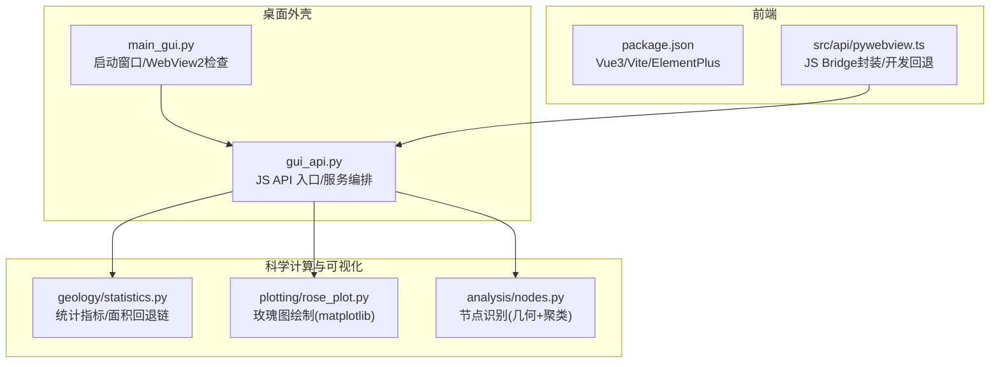
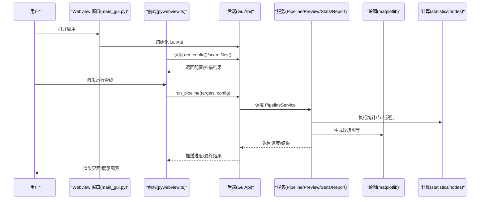
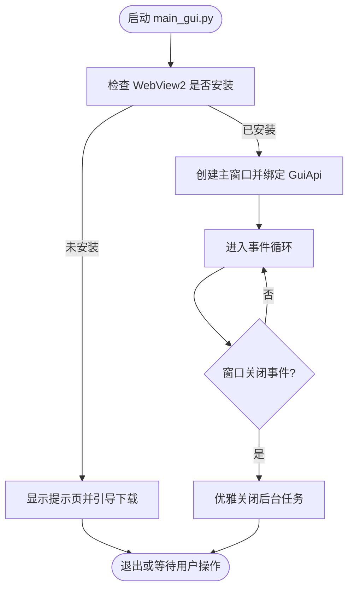
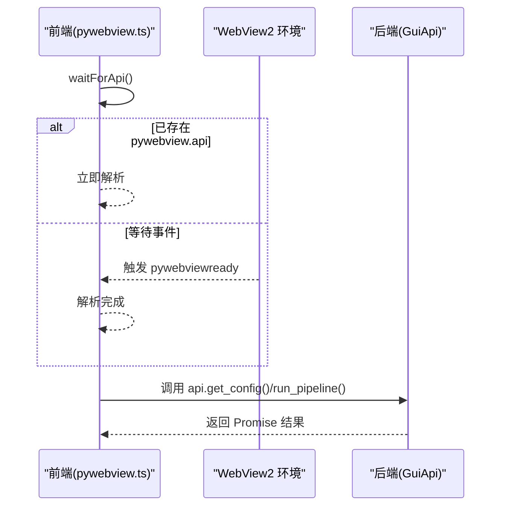
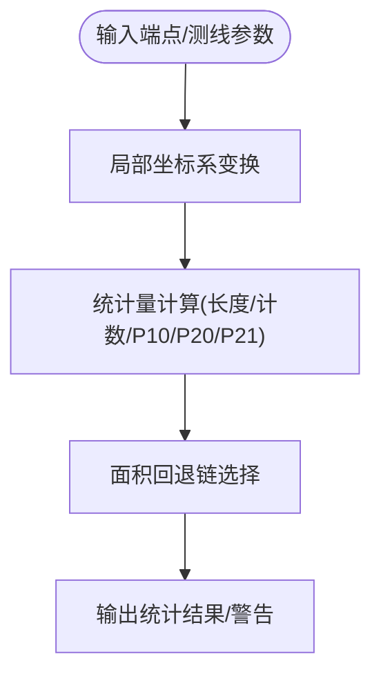
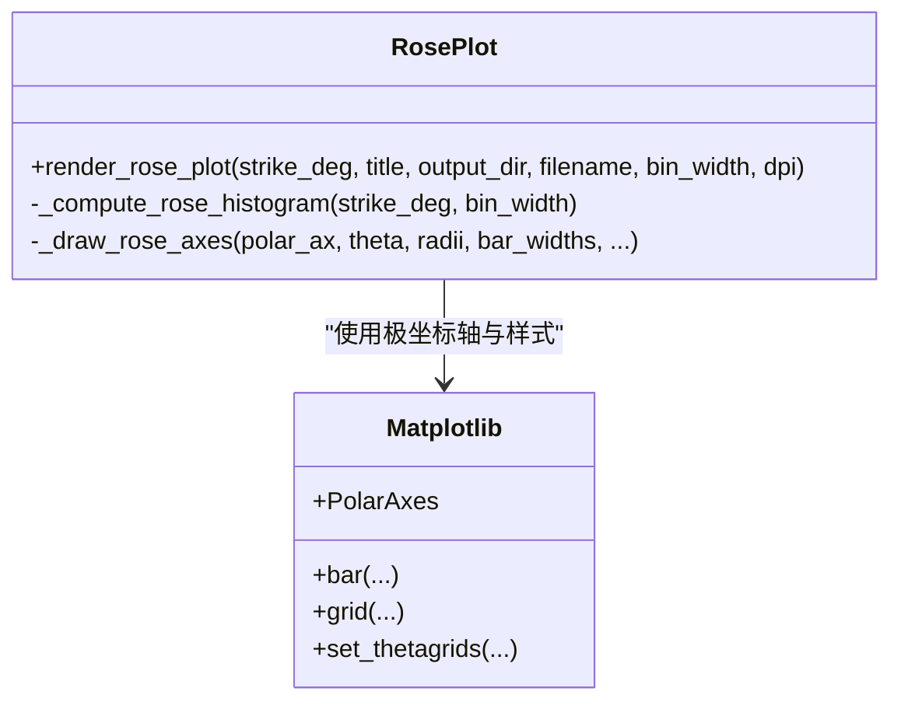
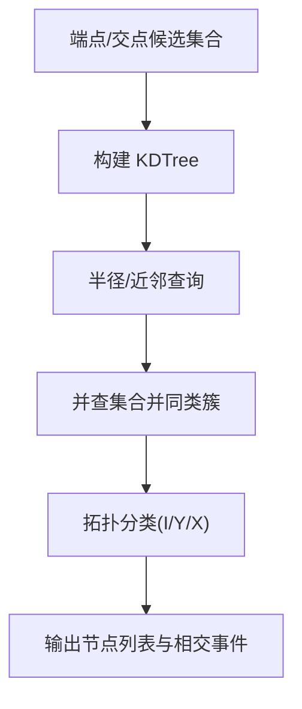
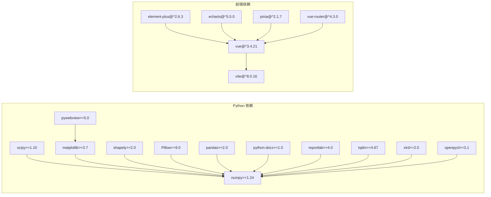

# 技术选型与决策

<cite>
**本文引用的文件**   
- [backend/main_gui.py](file://backend/main_gui.py)
- [backend/webview2_checker.py](file://backend/webview2_checker.py)
- [backend/gui_api.py](file://backend/gui_api.py)
- [frontend/package.json](file://frontend/package.json)
- [frontend/src/api/pywebview.ts](file://frontend/src/api/pywebview.ts)
- [pyproject.toml](file://pyproject.toml)
- [requirements.txt](file://requirements.txt)
- [TracePipeline.spec](file://TracePipeline.spec)
- [trace_pipeline/geology/statistics.py](file://trace_pipeline/geology/statistics.py)
- [trace_pipeline/plotting/rose_plot.py](file://trace_pipeline/plotting/rose_plot.py)
- [trace_pipeline/analysis/nodes.py](file://trace_pipeline/analysis/nodes.py)
</cite>

## 目录
1. [引言](#引言)
2. [项目结构](#项目结构)
3. [核心组件](#核心组件)
4. [架构总览](#架构总览)
5. [详细组件分析](#详细组件分析)
6. [依赖关系分析](#依赖关系分析)
7. [性能考量](#性能考量)
8. [故障排查指南](#故障排查指南)
9. [结论](#结论)
10. [附录：版本兼容矩阵与升级策略](#附录版本兼容矩阵与升级策略)

## 引言
本文件面向 TracePipeline 的技术选型，系统阐述桌面端 UI、前端框架、科学计算与可视化等关键技术的选择依据与权衡。重点覆盖：
- 为何选择 pywebview 而非 Electron（体积优势、Windows WebView2 集成、原生性能）
- Vue 3 Composition API 相比 Options API 的优势（类型推导、逻辑复用、性能优化）
- NumPy 广播与复数运算在地质计算中的性能优势（向量化替代循环、内存效率、精度保证）
- matplotlib 作为绘图引擎的选择原因（LaTeX 支持、高精度输出、样式定制能力）
- scipy KDTree 在节点识别中的空间索引优势
- 各技术版本的兼容性矩阵与升级策略
- 技术选型的权衡考虑与备选方案分析

## 项目结构
TracePipeline 采用前后端分离的桌面应用架构：
- 后端以 Python 提供业务服务并通过 pywebview 暴露 JS Bridge；
- 前端基于 Vue 3 + Vite + Element Plus 构建，通过 pywebview.ts 桥接调用后端方法；
- 科学计算与可视化集中在 trace_pipeline 包内，使用 numpy/scipy/matplotlib/shapely 等库实现。

图表来源
- [backend/main_gui.py:81-206](file://backend/main_gui.py#L81-L206)
- [backend/gui_api.py:52-110](file://backend/gui_api.py#L52-L110)
- [frontend/package.json:14-23](file://frontend/package.json#L14-L23)
- [frontend/src/api/pywebview.ts:150-185](file://frontend/src/api/pywebview.ts#L150-L185)
- [trace_pipeline/geology/statistics.py:106-166](file://trace_pipeline/geology/statistics.py#L106-L166)
- [trace_pipeline/plotting/rose_plot.py:106-140](file://trace_pipeline/plotting/rose_plot.py#L106-L140)
- [trace_pipeline/analysis/nodes.py:160-200](file://trace_pipeline/analysis/nodes.py#L160-L200)

章节来源
- [backend/main_gui.py:81-206](file://backend/main_gui.py#L81-L206)
- [backend/gui_api.py:52-110](file://backend/gui_api.py#L52-L110)
- [frontend/package.json:14-23](file://frontend/package.json#L14-L23)
- [frontend/src/api/pywebview.ts:150-185](file://frontend/src/api/pywebview.ts#L150-L185)

## 核心组件
- 桌面外壳与运行时
  - main_gui.py：负责初始化日志、检测 WebView2 Runtime、创建窗口、居中布局、注册关闭事件并优雅退出。
  - webview2_checker.py：跨平台安全地检测 WebView2 是否安装，并提供下载链接。
- 前端桥接层
  - src/api/pywebview.ts：统一封装后端 GuiApi 暴露的方法，提供“就绪等待”和“开发环境 mock 回退”，确保浏览器调试可用。
- 后端服务编排
  - gui_api.py：集中管理懒加载服务、线程锁、路径校验、图片缓存、报告进度队列等，是前端可调用的 JS API 入口。
- 科学计算与可视化
  - geology/statistics.py：测线统计指标计算，包含面积回退链、自适应阈值等。
  - plotting/rose_plot.py：基于 matplotlib 的极坐标玫瑰图绘制。
  - analysis/nodes.py：节点识别算法，含候选点聚类与拓扑分类。

章节来源
- [backend/main_gui.py:81-206](file://backend/main_gui.py#L81-L206)
- [backend/webview2_checker.py:35-60](file://backend/webview2_checker.py#L35-L60)
- [frontend/src/api/pywebview.ts:150-185](file://frontend/src/api/pywebview.ts#L150-L185)
- [backend/gui_api.py:52-110](file://backend/gui_api.py#L52-L110)
- [trace_pipeline/geology/statistics.py:106-166](file://trace_pipeline/geology/statistics.py#L106-L166)
- [trace_pipeline/plotting/rose_plot.py:106-140](file://trace_pipeline/plotting/rose_plot.py#L106-L140)
- [trace_pipeline/analysis/nodes.py:160-200](file://trace_pipeline/analysis/nodes.py#L160-L200)

## 架构总览
下图展示从用户点击到数据产出与可视化的端到端流程，体现 pywebview 桥接、服务编排与计算绘图的协作。

图表来源
- [backend/main_gui.py:163-206](file://backend/main_gui.py#L163-L206)
- [frontend/src/api/pywebview.ts:294-336](file://frontend/src/api/pywebview.ts#L294-L336)
- [backend/gui_api.py:52-110](file://backend/gui_api.py#L52-L110)
- [trace_pipeline/plotting/rose_plot.py:106-140](file://trace_pipeline/plotting/rose_plot.py#L106-L140)
- [trace_pipeline/geology/statistics.py:106-166](file://trace_pipeline/geology/statistics.py#L106-L166)
- [trace_pipeline/analysis/nodes.py:160-200](file://trace_pipeline/analysis/nodes.py#L160-L200)

## 详细组件分析

### 桌面外壳与 WebView2 集成（pywebview vs Electron）
- 体积优势：pywebview 直接复用系统 WebView2，不捆绑 Chromium，显著降低安装包体积与内存占用；Electron 需打包完整 Chromium，体积与资源开销更大。
- Windows 集成：通过 webview2_checker.py 检测注册表与常见路径，未安装时引导用户下载官方 Runtime，提升可移植性与用户体验。
- 原生性能：窗口创建、事件回调、拖拽/缩放等由操作系统与 WebView2 原生实现，减少中间层开销。
- 打包策略：TracePipeline.spec 显式声明 hiddenimports（如 webview.platforms.*、scipy.spatial 等），避免 PyInstaller 遗漏动态模块。

图表来源
- [backend/main_gui.py:98-133](file://backend/main_gui.py#L98-L133)
- [backend/webview2_checker.py:35-60](file://backend/webview2_checker.py#L35-L60)
- [TracePipeline.spec:43-100](file://TracePipeline.spec#L43-L100)

章节来源
- [backend/main_gui.py:98-133](file://backend/main_gui.py#L98-L133)
- [backend/webview2_checker.py:35-60](file://backend/webview2_checker.py#L35-L60)
- [TracePipeline.spec:43-100](file://TracePipeline.spec#L43-L100)

### 前端桥接与开发体验（pywebview.ts）
- 就绪等待：waitForApi 监听 pywebviewready 事件，超时放行，确保后端可用后再发起调用。
- 开发回退：当 pywebview 未定义（浏览器环境）时自动切换至 mockApi，保持前端独立开发与调试。
- 类型安全出口：为每个后端方法提供带默认参数的 TypeScript 包装，统一错误处理与返回值形态。

图表来源
- [frontend/src/api/pywebview.ts:167-185](file://frontend/src/api/pywebview.ts#L167-L185)
- [frontend/src/api/pywebview.ts:294-336](file://frontend/src/api/pywebview.ts#L294-L336)
- [backend/gui_api.py:52-110](file://backend/gui_api.py#L52-L110)

章节来源
- [frontend/src/api/pywebview.ts:167-185](file://frontend/src/api/pywebview.ts#L167-L185)
- [frontend/src/api/pywebview.ts:294-336](file://frontend/src/api/pywebview.ts#L294-L336)
- [backend/gui_api.py:52-110](file://backend/gui_api.py#L52-L110)

### 科学计算：NumPy 广播与复数运算
- 向量化替代循环：statistics.py 中大量使用 np.diff、np.unique、np.hypot、np.sum 等向量化操作，避免逐元素 Python 循环，显著提升吞吐。
- 内存效率：通过原地变换与视图切片减少中间数组分配，降低峰值内存。
- 精度保证：对数值边界进行 isfinite/_EPS 校验，避免 NaN/Inf 传播导致统计失真。
- 复数运算场景：在角度折叠、方向向量计算中，复数表示能简化旋转与投影操作，提高可读性与数值稳定性（结合 angles 模块）。

图表来源
- [trace_pipeline/geology/statistics.py:51-78](file://trace_pipeline/geology/statistics.py#L51-L78)
- [trace_pipeline/geology/statistics.py:106-166](file://trace_pipeline/geology/statistics.py#L106-L166)

章节来源
- [trace_pipeline/geology/statistics.py:51-78](file://trace_pipeline/geology/statistics.py#L51-L78)
- [trace_pipeline/geology/statistics.py:106-166](file://trace_pipeline/geology/statistics.py#L106-L166)

### 可视化：matplotlib 作为绘图引擎
- LaTeX 支持：便于在标题、轴标签中使用数学公式，满足科研出版需求。
- 高精度输出：支持高 DPI 导出（如 rose_plot 默认 400dpi），适合打印与论文插图。
- 样式定制：通过 style 与字体配置，统一全局视觉风格，适配不同平台字体与排版规范。
- 极坐标绘制：rose_plot.py 利用 PolarAxes 高效绘制玫瑰花瓣图，代码复用 _draw_rose_axes 消除重复逻辑。

图表来源
- [trace_pipeline/plotting/rose_plot.py:76-140](file://trace_pipeline/plotting/rose_plot.py#L76-L140)

章节来源
- [trace_pipeline/plotting/rose_plot.py:76-140](file://trace_pipeline/plotting/rose_plot.py#L76-L140)

### 节点识别：KDTree 的空间索引优势
- 背景：nodes.py 当前使用网格+并查集进行候选点聚类，具备良好可扩展性。
- KDTree 优势：对于大规模点集的最近邻查询与半径搜索，KDTree 可将 O(n^2) 近似复杂度降至 O(n log n)，显著加速候选点合并与邻近检测。
- 建议：在 nodes.py 中引入 scipy.spatial.KDTree 替换或辅助网格聚类，尤其在高密度裂隙网络下收益明显。

图表来源
- [trace_pipeline/analysis/nodes.py:78-118](file://trace_pipeline/analysis/nodes.py#L78-118)
- [trace_pipeline/analysis/nodes.py:160-200](file://trace_pipeline/analysis/nodes.py#L160-L200)

章节来源
- [trace_pipeline/analysis/nodes.py:78-118](file://trace_pipeline/analysis/nodes.py#L78-118)
- [trace_pipeline/analysis/nodes.py:160-200](file://trace_pipeline/analysis/nodes.py#L160-L200)

### Vue 3 Composition API 对比 Options API
- 更好的类型推导：配合 TypeScript 与 vue-tsc，Composition API 在组合函数与响应式状态上提供更强的静态检查与补全。
- 逻辑复用：将复杂业务逻辑抽取为组合函数，避免 Options API 中 data/methods/computed 分散导致的耦合。
- 性能优化：按需导入与惰性初始化，减少首屏负担；Pinia store 与组合函数协同，提升更新粒度与渲染效率。
- 工程化：Vite + Vue 3 生态成熟，构建速度快，开发体验佳。

章节来源
- [frontend/package.json:14-23](file://frontend/package.json#L14-L23)
- [frontend/src/main.ts:1-88](file://frontend/src/main.ts#L1-88)

## 依赖关系分析
- 后端核心依赖（Python）：numpy>=1.24、pandas>=2.0、matplotlib>=3.7、openpyxl>=3.1、Pillow>=9.0、scipy>=1.10、shapely>=2.0、pywebview>=5.0、python-docx>=1.0、reportlab>=4.0、tqdm>=4.67、xlrd>=2.0。
- 前端依赖（Node）：vue@^3.4.21、vite@^8.0.16、element-plus@^2.6.3、echarts@^5.5.0、pinia@^2.1.7、vue-router@^4.3.0 等。
- 打包与发布：PyInstaller 规格文件明确隐藏导入与数据资源，确保离线分发稳定。

图表来源
- [pyproject.toml:35-48](file://pyproject.toml#L35-L48)
- [requirements.txt:5-16](file://requirements.txt#L5-16)
- [frontend/package.json:14-23](file://frontend/package.json#L14-L23)

章节来源
- [pyproject.toml:35-48](file://pyproject.toml#L35-L48)
- [requirements.txt:5-16](file://requirements.txt#L5-16)
- [frontend/package.json:14-23](file://frontend/package.json#L14-L23)

## 性能考量
- 桌面壳层：pywebview 无 Chromium 冗余，启动更快、内存更低；窗口事件与拖拽由系统原生处理，交互更流畅。
- 前端渲染：Vue 3 响应式与 Pinia 状态管理，按需更新 DOM；ECharts 大数据量渲染友好。
- 科学计算：NumPy 向量化与 SciPy 空间索引（建议引入 KDTree）大幅降低时间复杂度；matplotlib 高 DPI 导出虽耗时但质量更高，建议在后台异步执行。
- I/O 与缓存：GuiApi 内置 TTL 图片缓存与目录变更检测，减少重复读取与渲染开销。

[本节为通用指导，无需具体文件引用]

## 故障排查指南
- WebView2 未安装
  - 现象：启动后弹出“需要安装 WebView2 Runtime”提示页。
  - 排查：确认 webview2_checker.py 检测逻辑与下载链接可达；检查注册表键值与 DLL 路径。
- 前端无法调用后端 API
  - 现象：浏览器环境下调用失败或返回空数据。
  - 排查：确认 waitForApi 是否超时放行；检查 pywebviewready 事件是否触发；在桌面环境中查看 console 日志。
- 打包后缺失模块
  - 现象：运行时报 ImportError（如 scipy.spatial、matplotlib.backends.backend_agg）。
  - 排查：核对 TracePipeline.spec 的 hiddenimports 是否包含所有动态子模块。

章节来源
- [backend/webview2_checker.py:35-60](file://backend/webview2_checker.py#L35-L60)
- [frontend/src/api/pywebview.ts:167-185](file://frontend/src/api/pywebview.ts#L167-L185)
- [TracePipeline.spec:43-100](file://TracePipeline.spec#L43-L100)

## 结论
- pywebview 在体积、系统集成与性能方面优于 Electron，特别适合 Windows 平台的轻量桌面应用。
- Vue 3 Composition API 在类型推导、逻辑复用与性能优化上具备显著优势，配合 Vite 生态提升开发效率。
- NumPy 向量化与 SciPy 空间索引是地质计算高性能的关键；matplotlib 在学术出版级绘图方面表现优异。
- 建议在节点识别中引入 KDTree 以提升大规模点集的处理效率；同时完善打包脚本与依赖锁定，保障部署一致性。

[本节为总结性内容，无需具体文件引用]

## 附录：版本兼容矩阵与升级策略
- Python 与核心库
  - Python >= 3.10（pyproject.toml 指定）
  - numpy >= 1.24、pandas >= 2.0、matplotlib >= 3.7、scipy >= 1.10、shapely >= 2.0、pywebview >= 5.0、openpyxl >= 3.1、Pillow >= 9.0、python-docx >= 1.0、reportlab >= 4.0、tqdm >= 4.67、xlrd >= 2.0
- Node 与前端
  - vue ^3.4.21、vite ^8.0.16、element-plus ^2.6.3、echarts ^5.5.0、pinia ^2.1.7、vue-router ^4.3.0
- 升级策略
  - 锁定依赖：提交 package-lock.json 与 requirements.txt，确保构建一致。
  - 渐进升级：先升级小版本，验证测试用例与打包产物；再评估大版本兼容性。
  - 风险缓解：对关键第三方（pywebview、matplotlib、scipy）准备降级分支与回滚脚本。
  - 自动化：CI 中增加多 Python 版本与 Node 版本矩阵测试，提前发现兼容性问题。

章节来源
- [pyproject.toml:9-48](file://pyproject.toml#L9-L48)
- [requirements.txt:5-16](file://requirements.txt#L5-16)
- [frontend/package.json:14-23](file://frontend/package.json#L14-L23)