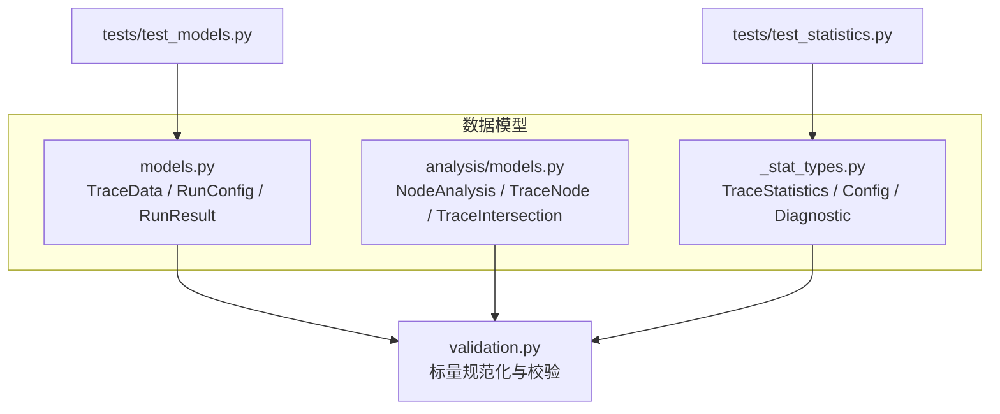
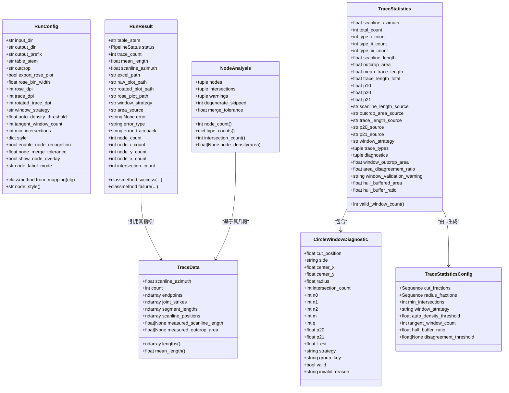
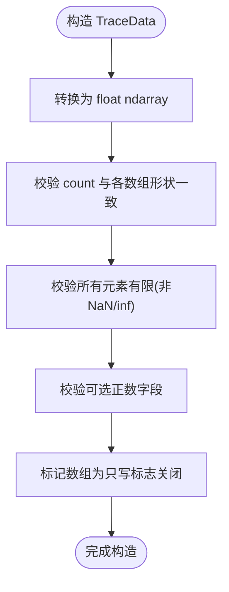
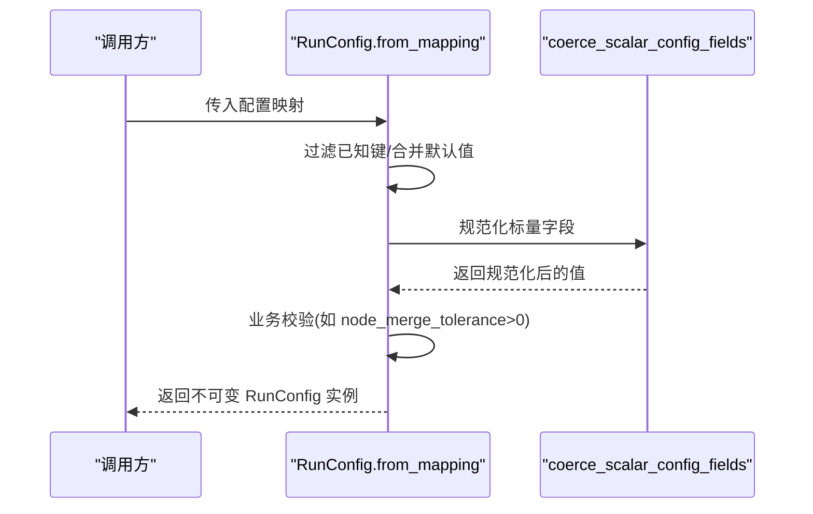
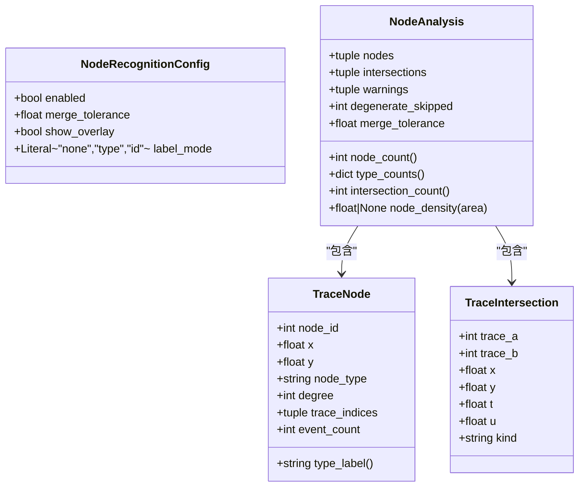
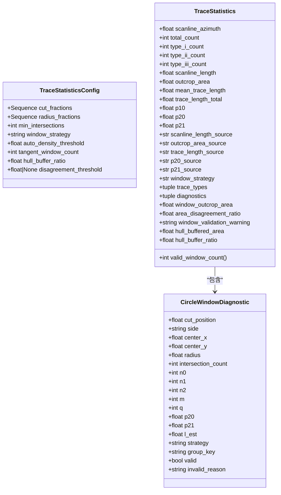
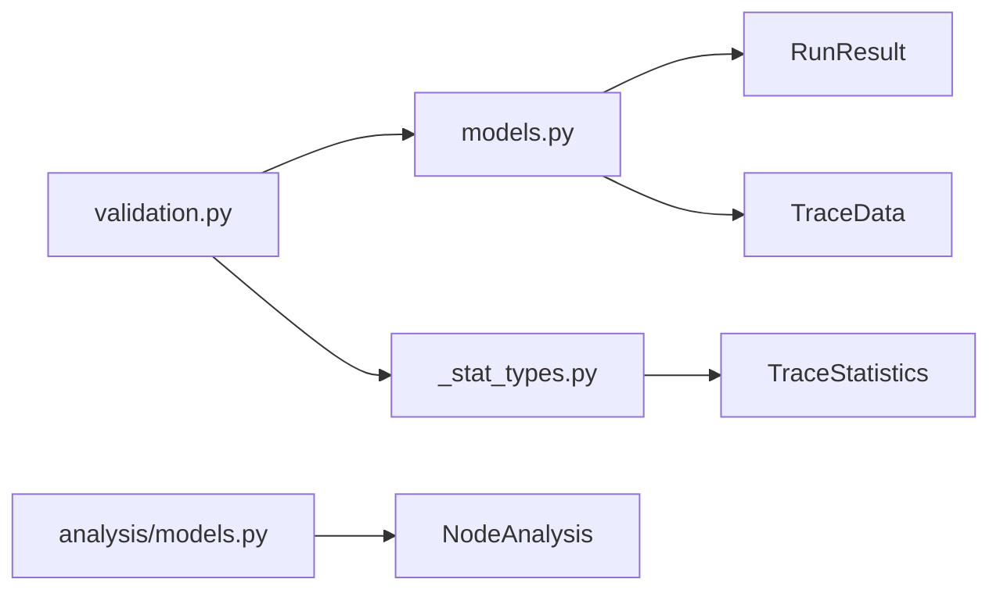

# 不可变数据模型设计

<cite>
**本文引用的文件**   
- [trace_pipeline/models.py](file://trace_pipeline/models.py)
- [trace_pipeline/analysis/models.py](file://trace_pipeline/analysis/models.py)
- [trace_pipeline/geology/_stat_types.py](file://trace_pipeline/geology/_stat_types.py)
- [trace_pipeline/validation.py](file://trace_pipeline/validation.py)
- [tests/test_models.py](file://tests/test_models.py)
- [tests/test_statistics.py](file://tests/test_statistics.py)
</cite>

## 目录
1. [引言](#引言)
2. [项目结构](#项目结构)
3. [核心组件](#核心组件)
4. [架构总览](#架构总览)
5. [详细组件分析](#详细组件分析)
6. [依赖关系分析](#依赖关系分析)
7. [性能与并发特性](#性能与并发特性)
8. [故障排查指南](#故障排查指南)
9. [结论](#结论)
10. [附录：使用示例](#附录使用示例)

## 引言
本设计文档聚焦于 TracePipeline 的不可变数据模型系统，围绕以下核心类展开：TraceData、RunConfig、RunResult、TraceStatistics、NodeAnalysis（及其相关类型）。文档将深入解释 frozen dataclass 的设计原则、属性访问器与 @property 计算属性的工作机制、数据验证规则与类型约束、默认值策略，以及不可变设计在多线程流水线中的安全性与优势。同时提供具体使用示例路径，帮助读者正确创建和操作这些对象。

## 项目结构
与不可变数据模型相关的代码主要分布在如下模块：
- trace_pipeline/models.py：定义 TraceData、RunConfig、RunResult 等核心不可变数据类
- trace_pipeline/analysis/models.py：定义节点分析相关不可变类型（NodeAnalysis、TraceNode、TraceIntersection、NodeRecognitionConfig）
- trace_pipeline/geology/_stat_types.py：定义统计结果与配置（TraceStatistics、CircleWindowDiagnostic、TraceStatisticsConfig）
- trace_pipeline/validation.py：通用校验与类型强制转换工具，被 models 与 config 共用
- tests/test_models.py、tests/test_statistics.py：覆盖构造、校验、派生属性与统计流程的行为

图表来源
- [trace_pipeline/models.py:1-352](file://trace_pipeline/models.py#L1-L352)
- [trace_pipeline/analysis/models.py:1-98](file://trace_pipeline/analysis/models.py#L1-L98)
- [trace_pipeline/geology/_stat_types.py:1-125](file://trace_pipeline/geology/_stat_types.py#L1-L125)
- [trace_pipeline/validation.py:1-112](file://trace_pipeline/validation.py#L1-L112)
- [tests/test_models.py:1-138](file://tests/test_models.py#L1-L138)
- [tests/test_statistics.py:1-292](file://tests/test_statistics.py#L1-L292)

章节来源
- [trace_pipeline/models.py:1-352](file://trace_pipeline/models.py#L1-L352)
- [trace_pipeline/analysis/models.py:1-98](file://trace_pipeline/analysis/models.py#L1-L98)
- [trace_pipeline/geology/_stat_types.py:1-125](file://trace_pipeline/geology/_stat_types.py#L1-L125)
- [trace_pipeline/validation.py:1-112](file://trace_pipeline/validation.py#L1-L112)
- [tests/test_models.py:1-138](file://tests/test_models.py#L1-L138)
- [tests/test_statistics.py:1-292](file://tests/test_statistics.py#L1-L292)

## 核心组件
本节概述各核心类的职责与设计要点：
- TraceData：单张迹线表的完整解析结果，包含端点坐标、走向角、长度、位置等；通过 __post_init__ 进行形状与数值合法性校验，并将内部 numpy 数组设为只读；提供 lengths、mean_length 等派生属性。
- RunConfig：单次运行参数，支持 from_mapping 工厂方法，统一标量字段规范化与必填项校验。
- RunResult：单次运行结果，封装成功/失败两种状态及关键指标与错误信息。
- NodeAnalysis 及相关类型：节点识别与分析结果，包含节点、相交事件、诊断告警等，并提供计数与密度计算等计算属性。
- TraceStatistics 及相关类型：统计结果与配置，涵盖测线长度、露头面积、P10/P20/P21 等指标，并附带圆窗诊断与一致性告警。

章节来源
- [trace_pipeline/models.py:38-157](file://trace_pipeline/models.py#L38-L157)
- [trace_pipeline/models.py:159-273](file://trace_pipeline/models.py#L159-L273)
- [trace_pipeline/models.py:275-352](file://trace_pipeline/models.py#L275-L352)
- [trace_pipeline/analysis/models.py:22-98](file://trace_pipeline/analysis/models.py#L22-L98)
- [trace_pipeline/geology/_stat_types.py:14-125](file://trace_pipeline/geology/_stat_types.py#L14-L125)

## 架构总览
下图展示了核心数据类之间的关系与依赖方向：

图表来源
- [trace_pipeline/models.py:38-157](file://trace_pipeline/models.py#L38-L157)
- [trace_pipeline/models.py:159-273](file://trace_pipeline/models.py#L159-L273)
- [trace_pipeline/models.py:275-352](file://trace_pipeline/models.py#L275-L352)
- [trace_pipeline/analysis/models.py:22-98](file://trace_pipeline/analysis/models.py#L22-L98)
- [trace_pipeline/geology/_stat_types.py:14-125](file://trace_pipeline/geology/_stat_types.py#L14-L125)

## 详细组件分析

### TraceData 设计与实现
- 不可变性：使用 @dataclass(frozen=True)，禁止实例化后修改字段。
- 数据校验：__post_init__ 中执行：
  - 将输入转换为 float 型 ndarray，并通过 object.__setattr__ 写入，确保 frozen 下仍可设置内部缓存或修正后的值。
  - 检查有限性（非 NaN/inf）、count 非负、各数组形状与 count 一致。
  - 可选正数字段（measured_scanline_length、measured_outcrop_area）必须为正有限浮点数或 None。
  - 将内部数组标记为只读（writeable=False），防止外部意外修改。
- 派生属性：
  - lengths：按端点欧氏距离计算，首次访问时缓存到 _lengths，后续直接返回；结果同样设为只读。
  - mean_length：基于 lengths 的平均值，空集返回 0.0。

图表来源
- [trace_pipeline/models.py:65-121](file://trace_pipeline/models.py#L65-L121)

章节来源
- [trace_pipeline/models.py:38-157](file://trace_pipeline/models.py#L38-L157)
- [tests/test_models.py:14-98](file://tests/test_models.py#L14-L98)

### RunConfig 设计与实现
- 不可变性：@dataclass(frozen=True)。
- 必填项与规范化：
  - __post_init__ 对表名、露头标识、输出前缀、输入/输出目录进行去空与标准化。
  - 调用 coerce_scalar_config_fields 对布尔、正整数、正浮点、窗口策略、标签模式等进行统一规范化与范围校验。
  - 额外业务校验：node_merge_tolerance 必须大于 0。
- 工厂方法：from_mapping 从字典提取已知键，忽略未知键，缺失可选字段回退到 dataclass 默认值；并从 style 子对象读取 node_label_mode 的默认值。
- 计算属性：node_style 从 style 字典读取预设样式。

图表来源
- [trace_pipeline/models.py:236-267](file://trace_pipeline/models.py#L236-L267)
- [trace_pipeline/validation.py:90-112](file://trace_pipeline/validation.py#L90-L112)

章节来源
- [trace_pipeline/models.py:159-273](file://trace_pipeline/models.py#L159-L273)
- [trace_pipeline/validation.py:26-112](file://trace_pipeline/validation.py#L26-L112)
- [tests/test_models.py:103-138](file://tests/test_models.py#L103-L138)

### RunResult 设计与实现
- 不可变性：@dataclass(frozen=True)。
- 状态枚举：PipelineStatus（SUCCESS/ERROR）。
- 工厂方法：
  - success：构建成功结果，填充关键指标与路径。
  - failure：构建失败结果，携带错误信息与堆栈。
- 用途：在流水线中作为不可变的“快照”，便于跨线程安全传递与持久化。

章节来源
- [trace_pipeline/models.py:23-35](file://trace_pipeline/models.py#L23-L35)
- [trace_pipeline/models.py:275-352](file://trace_pipeline/models.py#L275-L352)

### NodeAnalysis 及相关类型
- NodeRecognitionConfig：控制节点识别开关、合并容差、叠加显示与标签模式，并在 __post_init__ 中进行范围与取值校验。
- TraceNode：单个节点，包含 id、坐标、类型（I/Y/X）、度、关联迹线索引、事件计数；type_label 提供中文名称。
- TraceIntersection：两迹线相交事件，包含交点坐标与参数 t/u、类型（endpoint/internal/overlap）。
- NodeAnalysis：聚合节点与相交事件，提供 node_count、type_counts、intersection_count、node_density 等计算属性。

图表来源
- [trace_pipeline/analysis/models.py:22-98](file://trace_pipeline/analysis/models.py#L22-L98)

章节来源
- [trace_pipeline/analysis/models.py:22-98](file://trace_pipeline/analysis/models.py#L22-L98)

### TraceStatistics 及相关类型
- TraceStatisticsConfig：统计计算参数，包括分位数切分、半径比例、最小相交数、窗口策略、自动阈值、缓冲比例、不一致阈值等；在 __post_init__ 中对序列、范围与取值进行严格校验。
- CircleWindowDiagnostic：单个圆形取样窗的诊断结果，包含几何参数、计数、有效性、估计指标等。
- TraceStatistics：统计结果，包含 P10/P20/P21、测线长度、露头面积、平均迹长、来源标注、诊断与一致性告警等；valid_window_count 提供有效窗口计数。

图表来源
- [trace_pipeline/geology/_stat_types.py:14-125](file://trace_pipeline/geology/_stat_types.py#L14-L125)

章节来源
- [trace_pipeline/geology/_stat_types.py:14-125](file://trace_pipeline/geology/_stat_types.py#L14-L125)

## 依赖关系分析
- validation.py 提供纯函数式校验与类型强制转换，被 models.py 与 config 逻辑复用，避免循环依赖。
- TraceStatistics 的计算流程依赖 TraceData 的几何与统计基础数据。
- NodeAnalysis 的结果用于可视化与拓扑分析，通常由上层服务消费。

图表来源
- [trace_pipeline/validation.py:1-112](file://trace_pipeline/validation.py#L1-112)
- [trace_pipeline/models.py:1-352](file://trace_pipeline/models.py#L1-352)
- [trace_pipeline/geology/_stat_types.py:1-125](file://trace_pipeline/geology/_stat_types.py#L1-125)
- [trace_pipeline/analysis/models.py:1-98](file://trace_pipeline/analysis/models.py#L1-L98)

章节来源
- [trace_pipeline/validation.py:1-112](file://trace_pipeline/validation.py#L1-112)
- [trace_pipeline/models.py:1-352](file://trace_pipeline/models.py#L1-352)
- [trace_pipeline/geology/_stat_types.py:1-125](file://trace_pipeline/geology/_stat_types.py#L1-L125)
- [trace_pipeline/analysis/models.py:1-98](file://trace_pipeline/analysis/models.py#L1-L98)

## 性能与并发特性
- 不可变性带来的并发安全：frozen dataclass 保证实例一旦创建即不可变，天然适合在多进程/多线程间共享与传递，无需加锁。
- 派生属性缓存：TraceData.lengths 首次计算后缓存至 _lengths，避免重复计算开销；缓存写入采用 object.__setattr__ 以兼容 frozen 语义。
- 只读数组：内部 numpy 数组 flags.writeable=False，防止外部绕过 Python 层直接修改内存，提升鲁棒性与可预测性。
- 计算复杂度：
  - TraceData.lengths：O(N) 向量运算，N 为迹线条数。
  - TraceStatistics.valid_window_count：O(D)，D 为诊断数量。
  - NodeAnalysis.type_counts：O(K)，K 为节点数。

[本节为通用性能讨论，不直接分析具体文件]

## 故障排查指南
- TraceData 构造失败常见原因：
  - count 为负或与数组形状不一致。
  - 端点或角度包含 NaN/inf。
  - 可选正数字段为非正或非有限值。
- RunConfig 构造失败常见原因：
  - 必填字段为空字符串。
  - 标量字段类型或范围不符合规范（如 DPI 非正整数、窗口策略非法、merge_tolerance 非正）。
- RunResult 使用建议：
  - 优先使用 success/failure 工厂方法，避免遗漏必要字段。
- NodeAnalysis 与 TraceStatistics：
  - 注意诊断告警字段（window_validation_warning、area_disagreement_ratio），用于定位面积估算与一致性问题。

章节来源
- [trace_pipeline/models.py:65-121](file://trace_pipeline/models.py#L65-L121)
- [trace_pipeline/models.py:202-233](file://trace_pipeline/models.py#L202-L233)
- [trace_pipeline/analysis/models.py:31-36](file://trace_pipeline/analysis/models.py#L31-L36)
- [trace_pipeline/geology/_stat_types.py:27-64](file://trace_pipeline/geology/_stat_types.py#L27-L64)

## 结论
TracePipeline 的不可变数据模型系统通过 frozen dataclass、严格的 __post_init__ 校验、只读数组与派生属性缓存，构建了高内聚、低耦合且线程安全的中间表示。这种设计既保证了数据完整性与可追溯性，又提升了流水线在不同阶段之间的流转效率与可靠性。配合统一的标量规范化与校验工具，系统在易用性与健壮性之间取得了良好平衡。

[本节为总结性内容，不直接分析具体文件]

## 附录：使用示例
以下为典型用法的路径参考，展示如何正确创建与操作不可变对象：
- 构造 TraceData 并访问 lengths/mean_length：
  - [tests/test_models.py:14-98](file://tests/test_models.py#L14-L98)
- 使用 RunConfig.from_mapping 构建配置：
  - [tests/test_models.py:123-138](file://tests/test_models.py#L123-L138)
- 使用 RunResult.success/failure 构建结果：
  - [trace_pipeline/models.py:302-351](file://trace_pipeline/models.py#L302-L351)
- 构造 TraceStatisticsConfig 并计算统计结果：
  - [tests/test_statistics.py:278-292](file://tests/test_statistics.py#L278-L292)

章节来源
- [tests/test_models.py:14-138](file://tests/test_models.py#L14-L138)
- [trace_pipeline/models.py:302-351](file://trace_pipeline/models.py#L302-L351)
- [tests/test_statistics.py:278-292](file://tests/test_statistics.py#L278-L292)