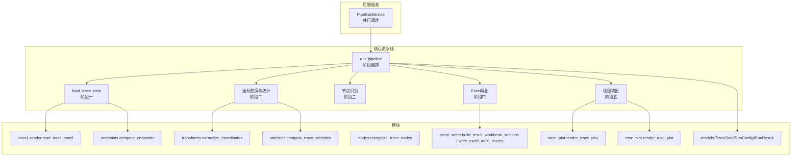
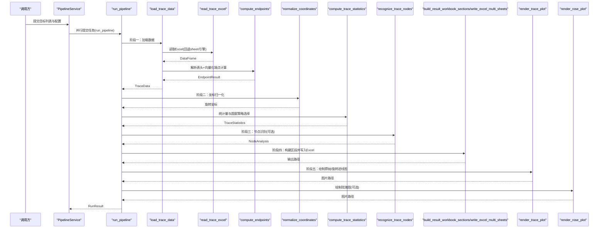
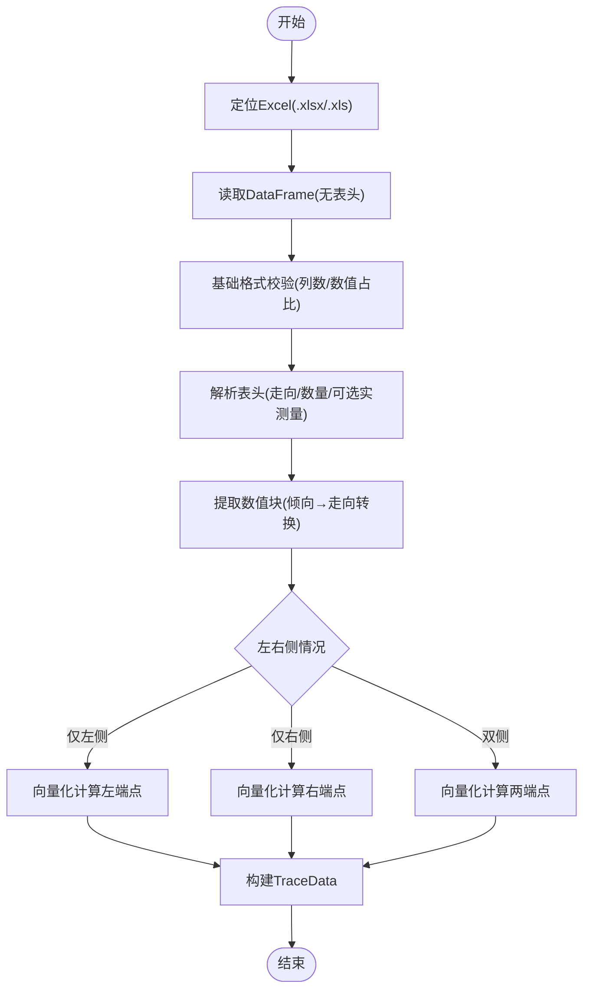
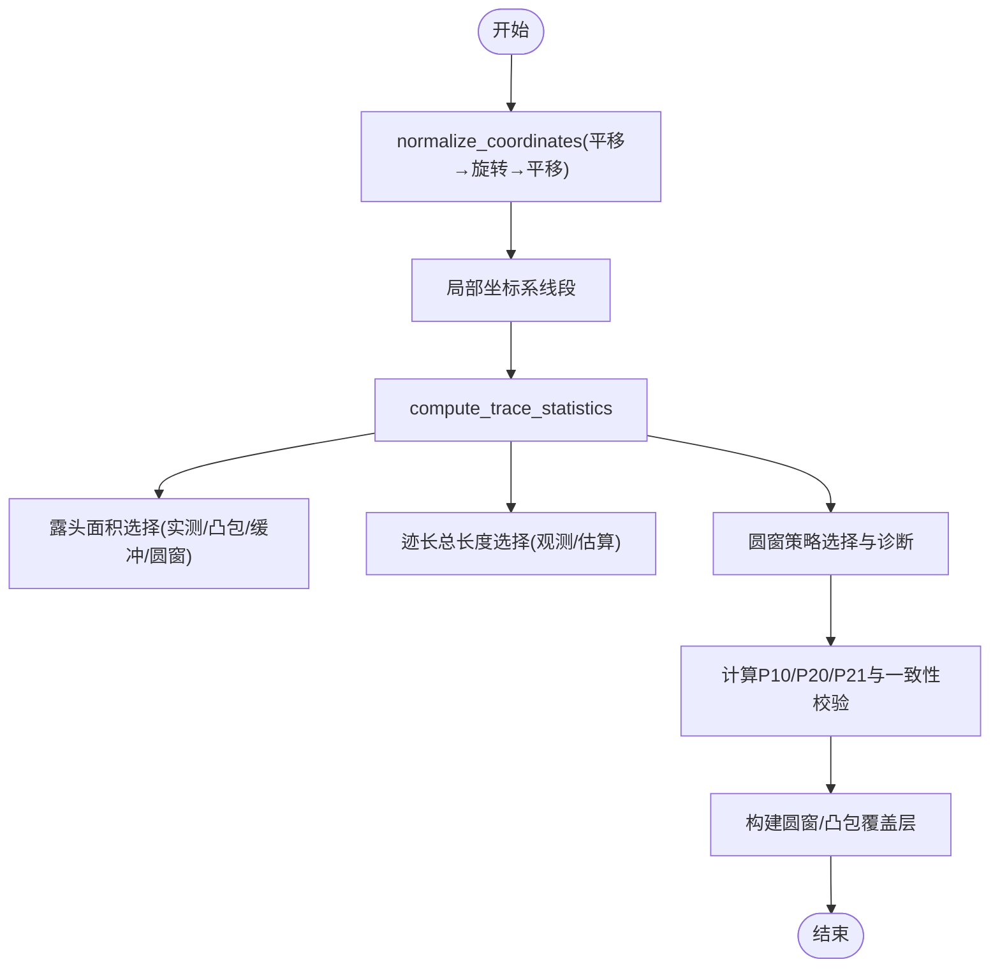
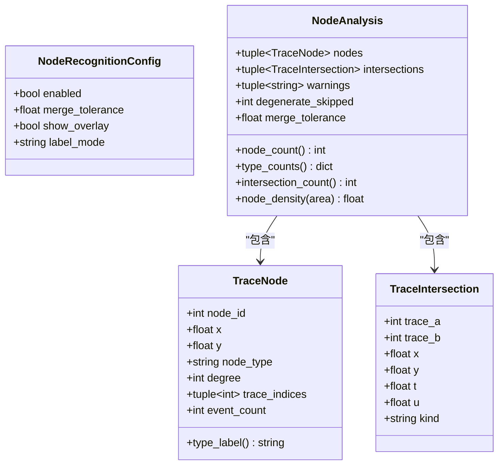
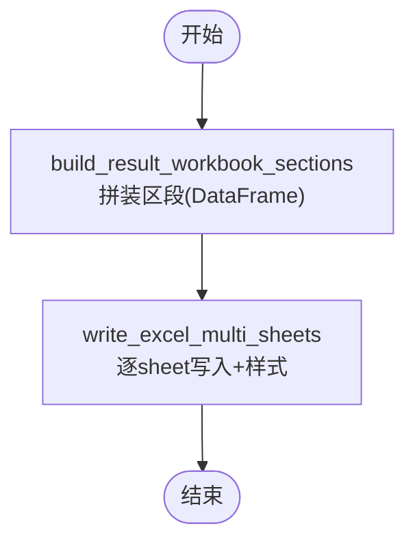
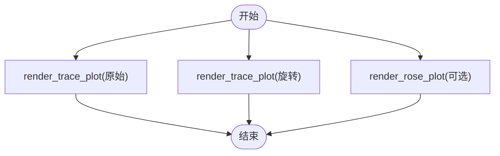
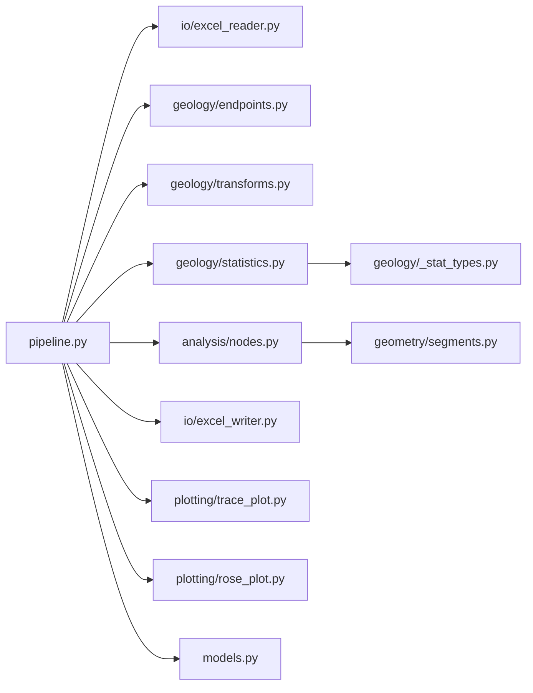

# 五阶段处理流水线

<cite>
**本文引用的文件**   
- [pipeline.py](file://trace_pipeline/pipeline.py)
- [models.py](file://trace_pipeline/models.py)
- [config.py](file://trace_pipeline/config.py)
- [excel_reader.py](file://trace_pipeline/io/excel_reader.py)
- [endpoints.py](file://trace_pipeline/geology/endpoints.py)
- [transforms.py](file://trace_pipeline/geology/transforms.py)
- [statistics.py](file://trace_pipeline/geology/statistics.py)
- [_stat_types.py](file://trace_pipeline/geology/_stat_types.py)
- [nodes.py](file://trace_pipeline/analysis/nodes.py)
- [models.py（节点分析）](file://trace_pipeline/analysis/models.py)
- [segments.py](file://trace_pipeline/geometry/segments.py)
- [excel_writer.py](file://trace_pipeline/io/excel_writer.py)
- [trace_plot.py](file://trace_pipeline/plotting/trace_plot.py)
- [rose_plot.py](file://trace_pipeline/plotting/rose_plot.py)
- [pipeline_service.py](file://backend/services/pipeline_service.py)
</cite>

## 目录
1. [简介](#简介)
2. [项目结构](#项目结构)
3. [核心组件](#核心组件)
4. [架构总览](#架构总览)
5. [详细组件分析](#详细组件分析)
6. [依赖关系分析](#依赖关系分析)
7. [性能考虑](#性能考虑)
8. [故障排查指南](#故障排查指南)
9. [结论](#结论)
10. [附录](#附录)

## 简介
本技术文档围绕 TracePipeline 的五阶段处理流水线展开，系统阐述每个阶段的职责、输入输出数据结构与处理逻辑，并说明阶段间的数据传递机制、错误处理策略与性能优化点。五个阶段分别为：
- 阶段一：数据加载（Excel定位→read_trace_excel解析→compute_endpoints端点计算→TraceData构建）
- 阶段二：坐标变换与统计（normalize_coordinates归一化→compute_trace_statistics统计分析→圆窗策略选择→凸包计算）
- 阶段三：节点识别（recognize_trace_nodes拓扑分析→并查集合并→I/Y/X型节点分类）
- 阶段四：Excel导出（build_result_workbook_sections多工作表构建→write_excel_multi_sheets格式化输出）
- 阶段五：绘图输出（render_trace_plot迹线图→render_rose_plot玫瑰图）

## 项目结构
TracePipeline 采用分层模块化组织：
- trace_pipeline：核心算法与流程编排（IO、地质计算、几何、分析、绘图、模型与配置）
- backend：服务层（并行调度、进度轮询、API封装）
- frontend：前端界面与交互
- tests：单元测试与集成测试
- reference：参考实现（MATLAB对照）

图表来源
- [pipeline.py:230-474](file://trace_pipeline/pipeline.py#L230-L474)
- [excel_reader.py:36-106](file://trace_pipeline/io/excel_reader.py#L36-L106)
- [endpoints.py:295-411](file://trace_pipeline/geology/endpoints.py#L295-L411)
- [transforms.py:127-144](file://trace_pipeline/geology/transforms.py#L127-L144)
- [statistics.py:212-391](file://trace_pipeline/geology/statistics.py#L212-L391)
- [nodes.py:160-417](file://trace_pipeline/analysis/nodes.py#L160-L417)
- [excel_writer.py:280-489](file://trace_pipeline/io/excel_writer.py#L280-L489)
- [trace_plot.py:443-565](file://trace_pipeline/plotting/trace_plot.py#L443-L565)
- [rose_plot.py:106-140](file://trace_pipeline/plotting/rose_plot.py#L106-L140)
- [models.py:41-157](file://trace_pipeline/models.py#L41-L157)

章节来源
- [pipeline.py:230-474](file://trace_pipeline/pipeline.py#L230-L474)
- [models.py:41-157](file://trace_pipeline/models.py#L41-L157)

## 核心组件
- TraceData：不可变数据容器，承载单张迹线表的完整解析结果（测线走向、端点、走向角、长度等），并在构造时进行严格校验与缓存派生属性。
- RunConfig：运行参数，含路径、DPI、窗口策略、节点识别开关等；提供 from_mapping 工厂方法完成字段级校验与类型规整。
- RunResult：运行结果，包含成功/失败状态、关键指标与产物路径。

章节来源
- [models.py:41-157](file://trace_pipeline/models.py#L41-L157)
- [models.py:162-273](file://trace_pipeline/models.py#L162-L273)
- [models.py:278-352](file://trace_pipeline/models.py#L278-L352)

## 架构总览
下图展示 run_pipeline 的端到端调用序列与各阶段产物流转。

图表来源
- [pipeline_service.py:100-346](file://backend/services/pipeline_service.py#L100-L346)
- [pipeline.py:230-474](file://trace_pipeline/pipeline.py#L230-L474)
- [excel_reader.py:36-106](file://trace_pipeline/io/excel_reader.py#L36-L106)
- [endpoints.py:295-411](file://trace_pipeline/geology/endpoints.py#L295-L411)
- [transforms.py:127-144](file://trace_pipeline/geology/transforms.py#L127-L144)
- [statistics.py:212-391](file://trace_pipeline/geology/statistics.py#L212-L391)
- [nodes.py:160-417](file://trace_pipeline/analysis/nodes.py#L160-L417)
- [excel_writer.py:280-489](file://trace_pipeline/io/excel_writer.py#L280-L489)
- [trace_plot.py:443-565](file://trace_pipeline/plotting/trace_plot.py#L443-L565)
- [rose_plot.py:106-140](file://trace_pipeline/plotting/rose_plot.py#L106-L140)

## 详细组件分析

### 阶段一：数据加载
- 职责
  - 定位输入 Excel（支持 .xlsx/.xls 自动回退）
  - 读取无表头 DataFrame，执行基础格式校验
  - 解析表头（测线走向、迹线条数、可选实测长度/面积）
  - 将倾向转换为走向，按左/右/双侧三种情况向量化计算端点坐标
  - 组装为 TraceData（不可变，带强校验）
- 输入/输出
  - 输入：input_dir, table_stem, outcrop
  - 输出：TraceData（含 endpoints、joint_strikes、segment_lengths、scanline_positions 等）
- 关键处理逻辑
  - Excel 读取：优先 .xlsx，缺失则回退 .xls；指定 sheet 不存在时回退首表；文件大小上限保护
  - 端点计算：基于复数向量与半平面折叠角度，分三类 mask 就地填充，避免循环
  - 数据校验：首行表头合法性、数值块 NaN/Inf 检查、r1/r4/r5/r6/r7 非负约束、r5/r7 同时为 0 的非法情形
- 错误处理
  - FileNotFoundError：未找到输入文件
  - TraceValidationError：Excel过大或列数不足
  - ValueError：表头/数值块不合法
- 性能优化
  - lru_cache 按文件签名缓存 TraceData
  - 纯向量化计算，零拷贝预分配数组
  - 仅对有效掩码区域计算，减少分支开销

图表来源
- [excel_reader.py:36-106](file://trace_pipeline/io/excel_reader.py#L36-L106)
- [endpoints.py:295-411](file://trace_pipeline/geology/endpoints.py#L295-L411)
- [pipeline.py:80-96](file://trace_pipeline/pipeline.py#L80-L96)

章节来源
- [excel_reader.py:36-106](file://trace_pipeline/io/excel_reader.py#L36-L106)
- [endpoints.py:295-411](file://trace_pipeline/geology/endpoints.py#L295-L411)
- [pipeline.py:80-96](file://trace_pipeline/pipeline.py#L80-L96)
- [models.py:41-157](file://trace_pipeline/models.py#L41-L157)

### 阶段二：坐标变换与统计
- 职责
  - 坐标规范化：正象限平移 → 按走向旋转 → 再次平移到非负区域
  - 统计量计算：P10/P20/P21、平均迹长、露头面积、圆窗策略选择与诊断
  - 生成覆盖层：圆窗与凸包（用于后续绘图）
- 输入/输出
  - 输入：TraceData、TraceStatisticsConfig
  - 输出：旋转坐标、TraceStatistics、圆窗覆盖层、凸包覆盖层
- 关键处理逻辑
  - normalize_coordinates：统一坐标系，便于后续统计与可视化
  - compute_trace_statistics：
    - 测线长度来源：实测优先，否则估计
    - 露头面积四层回退：实测→凸包→缓冲凸包→圆窗等效面积（自适应阈值）
    - 迹长总长度回退链：观测(segment/endpoint)→估算(window)
    - P10/P20/P21 计算与一致性校验（自适应阈值）
    - 圆窗策略选择：auto/tangent/hybrid/concentric，返回诊断对象
- 错误处理
  - 统计异常通过日志告警与诊断字段暴露，不中断主流程
- 性能优化
  - 局部坐标系投影一次完成，复用 hull_area 避免重复计算
  - 自适应阈值随样本量变化，降低误判率

图表来源
- [transforms.py:127-144](file://trace_pipeline/geology/transforms.py#L127-L144)
- [statistics.py:212-391](file://trace_pipeline/geology/statistics.py#L212-L391)
- [_stat_types.py:14-125](file://trace_pipeline/geology/_stat_types.py#L14-L125)

章节来源
- [transforms.py:127-144](file://trace_pipeline/geology/transforms.py#L127-L144)
- [statistics.py:212-391](file://trace_pipeline/geology/statistics.py#L212-L391)
- [_stat_types.py:14-125](file://trace_pipeline/geology/_stat_types.py#L14-L125)

### 阶段三：节点识别
- 职责
  - 检测迹线相交事件（X型）、端点接触（Y型）、孤立端点（I型）
  - 使用并查集进行空间聚类合并，输出节点与交点事件
- 输入/输出
  - 输入：endpoints (N,4)、NodeRecognitionConfig
  - 输出：NodeAnalysis（节点列表、交点事件、警告、跳过退化计数）
- 关键处理逻辑
  - 预处理：过滤退化线段、AABB包围盒快速筛选候选对
  - 精确相交检测：参数化求解，区分 endpoint/internal/parallel_overlap
  - 端点接近检测：网格分桶 + 并查集合并
  - 节点分类：根据拓扑值与内部参与迹线数判定 I/Y/X
- 错误处理
  - 退化线段跳过并记录警告
  - 坐标过大时发出溢出警告
- 性能优化
  - 向量化包围盒筛选、批量网格分桶、并查集 O(α(n)) 近似常数时间合并

图表来源
- [nodes.py:160-417](file://trace_pipeline/analysis/nodes.py#L160-L417)
- [models.py（节点分析）:22-98](file://trace_pipeline/analysis/models.py#L22-L98)
- [segments.py:42-113](file://trace_pipeline/geometry/segments.py#L42-L113)

章节来源
- [nodes.py:160-417](file://trace_pipeline/analysis/nodes.py#L160-L417)
- [models.py（节点分析）:22-98](file://trace_pipeline/analysis/models.py#L22-L98)
- [segments.py:42-113](file://trace_pipeline/geometry/segments.py#L42-L113)

### 阶段四：Excel导出
- 职责
  - 构建多工作表区段：基本信息、裂隙情况、计算数据、原始/旋转端点坐标、走向与长度、节点统计/明细/交点
  - 应用样式（中英文字体混合、冻结窗格、列宽自适应）
  - 写入 openpyxl 多 sheet 文件
- 输入/输出
  - 输入：TraceData、旋转坐标、TraceStatistics、NodeAnalysis
  - 输出：Excel 文件路径
- 关键处理逻辑
  - build_result_workbook_sections：拼装各 DataFrame 区段，校验形状一致性
  - write_excel_multi_sheets：逐 sheet 写入并应用标题、边框、对齐、数字格式、冻结窗格
- 错误处理
  - 形状不一致或包含 NaN/inf 直接抛出 ValueError
- 性能优化
  - 单次遍历设置样式并统计列宽，避免二次遍历

图表来源
- [excel_writer.py:280-489](file://trace_pipeline/io/excel_writer.py#L280-L489)

章节来源
- [excel_writer.py:280-489](file://trace_pipeline/io/excel_writer.py#L280-L489)

### 阶段五：绘图输出
- 职责
  - 绘制原始/旋转迹线图（含圆窗/凸包/节点覆盖层、指北针、比例尺、统计框、图例）
  - 绘制节理走向玫瑰花瓣图（极坐标柱状图）
- 输入/输出
  - 输入：端点/旋转坐标、统计信息、覆盖层、样式配置
  - 输出：PNG 图片路径
- 关键处理逻辑
  - render_trace_plot：自适应 figure 尺寸、图层叠加顺序、装饰元素布局
  - render_rose_plot：半圆折叠、直方图分箱、极坐标绘制
- 错误处理
  - 输入形状/数值校验，无效数据提前返回空图形或报错
- 性能优化
  - 节点按类型分组批量 scatter；背景透明支持；按需渲染图层

图表来源
- [trace_plot.py:443-565](file://trace_pipeline/plotting/trace_plot.py#L443-L565)
- [rose_plot.py:106-140](file://trace_pipeline/plotting/rose_plot.py#L106-L140)

章节来源
- [trace_plot.py:443-565](file://trace_pipeline/plotting/trace_plot.py#L443-L565)
- [rose_plot.py:106-140](file://trace_pipeline/plotting/rose_plot.py#L106-L140)

## 依赖关系分析
- 模块耦合
  - pipeline.py 作为编排器，集中导入 IO、地质计算、分析、绘图模块
  - models.py 提供不可变数据契约，贯穿全流程
  - statistics.py 依赖 _circle_window/_convex_hull/_window_scoring 子模块
  - nodes.py 依赖 geometry.segments 的精确相交算法
- 外部依赖
  - pandas/openpyxl：Excel读写
  - numpy：向量化计算
  - matplotlib：绘图
- 潜在循环依赖
  - 当前结构清晰，未见循环导入；各模块以函数式接口为主，降低耦合度

图表来源
- [pipeline.py:1-47](file://trace_pipeline/pipeline.py#L1-L47)
- [statistics.py:1-46](file://trace_pipeline/geology/statistics.py#L1-L46)
- [nodes.py:1-34](file://trace_pipeline/analysis/nodes.py#L1-L34)

章节来源
- [pipeline.py:1-47](file://trace_pipeline/pipeline.py#L1-L47)
- [statistics.py:1-46](file://trace_pipeline/geology/statistics.py#L1-L46)
- [nodes.py:1-34](file://trace_pipeline/analysis/nodes.py#L1-L34)

## 性能考虑
- 数据加载
  - 文件签名缓存（lru_cache）避免重复解析
  - 向量化端点计算，避免 Python 层循环
- 坐标变换与统计
  - 局部坐标系一次投影，复用 hull_area
  - 自适应阈值随样本量调整，减少不必要的降级
- 节点识别
  - AABB 包围盒快速筛选候选对
  - 网格分桶 + 并查集高效聚类
- Excel导出
  - 单次遍历设置样式并统计列宽
- 绘图输出
  - 节点按类型分组批量绘制
  - 自适应 figure 尺寸，避免过度渲染

[本节为通用指导，无需具体文件引用]

## 故障排查指南
- 常见错误与定位
  - 权限错误（PermissionError）：输出文件被占用（如 Excel/WPS 打开），关闭后重试
  - 文件不存在（FileNotFoundError）：检查 input_dir/table_stem/outcrop 配置
  - 数据格式错误（ValueError/TraceValidationError）：Excel 列数不足、NaN/Inf、表头不合法
  - 内存/键盘中断（MemoryError/KeyboardInterrupt）：提升硬件资源或中止任务
- 建议操作
  - 查看日志中的 stage 与 duration_ms 定位耗时阶段
  - 检查 TraceStatistics.window_validation_warning 与 area_disagreement_ratio
  - 确认节点识别容差与坐标范围，避免网格索引溢出

章节来源
- [pipeline.py:450-474](file://trace_pipeline/pipeline.py#L450-L474)
- [excel_reader.py:69-106](file://trace_pipeline/io/excel_reader.py#L69-L106)
- [statistics.py:314-336](file://trace_pipeline/geology/statistics.py#L314-L336)

## 结论
TracePipeline 的五阶段流水线以不可变数据模型为核心，结合向量化计算、自适应策略与稳健的错误处理，实现了从数据加载到可视化的全链路自动化。通过并行调度与缓存机制，系统在大规模数据集上仍保持良好性能与可维护性。

[本节为总结，无需具体文件引用]

## 附录
- 关键代码片段路径（示例）
  - 阶段一：Excel读取与端点计算
    - [read_trace_excel:36-106](file://trace_pipeline/io/excel_reader.py#L36-L106)
    - [compute_endpoints:295-411](file://trace_pipeline/geology/endpoints.py#L295-L411)
  - 阶段二：坐标变换与统计
    - [normalize_coordinates:127-144](file://trace_pipeline/geology/transforms.py#L127-L144)
    - [compute_trace_statistics:212-391](file://trace_pipeline/geology/statistics.py#L212-L391)
  - 阶段三：节点识别
    - [recognize_trace_nodes:160-417](file://trace_pipeline/analysis/nodes.py#L160-L417)
    - [segment_intersection:42-113](file://trace_pipeline/geometry/segments.py#L42-L113)
  - 阶段四：Excel导出
    - [build_result_workbook_sections:280-331](file://trace_pipeline/io/excel_writer.py#L280-L331)
    - [write_excel_multi_sheets:462-489](file://trace_pipeline/io/excel_writer.py#L462-L489)
  - 阶段五：绘图输出
    - [render_trace_plot:443-565](file://trace_pipeline/plotting/trace_plot.py#L443-L565)
    - [render_rose_plot:106-140](file://trace_pipeline/plotting/rose_plot.py#L106-L140)
- 异常降级处理示例
  - 露头面积四层回退：实测→凸包→缓冲凸包→圆窗等效面积
    - [select_effective_area:106-166](file://trace_pipeline/geology/statistics.py#L106-L166)
  - 节点识别退化线段跳过与警告
    - [recognize_trace_nodes 退化处理:208-222](file://trace_pipeline/analysis/nodes.py#L208-L222)