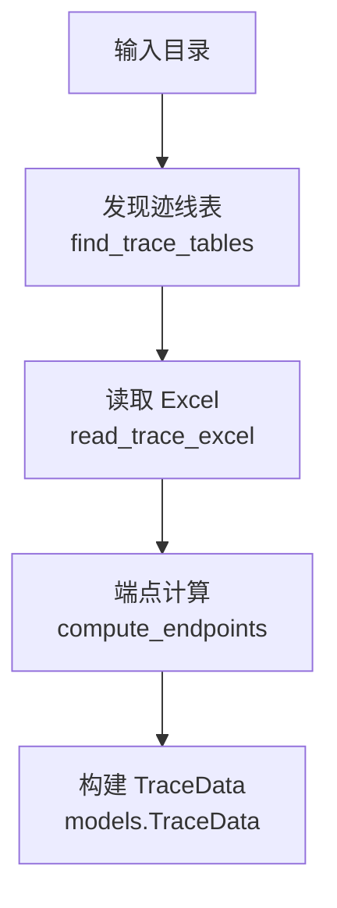
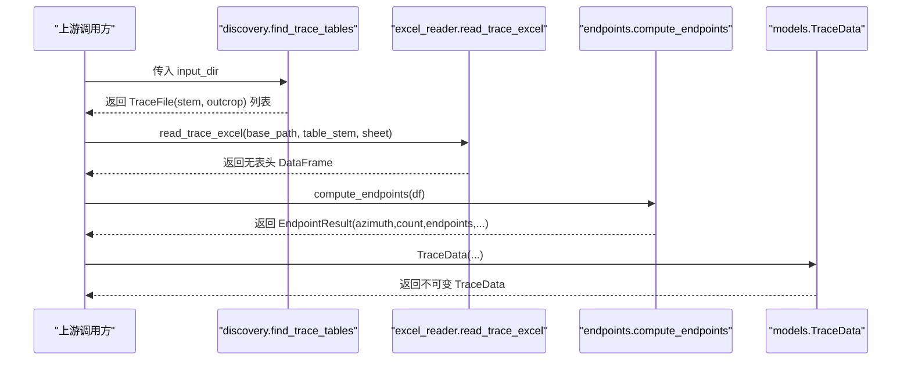
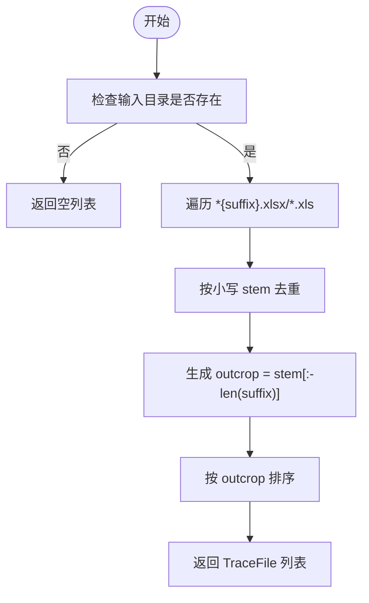
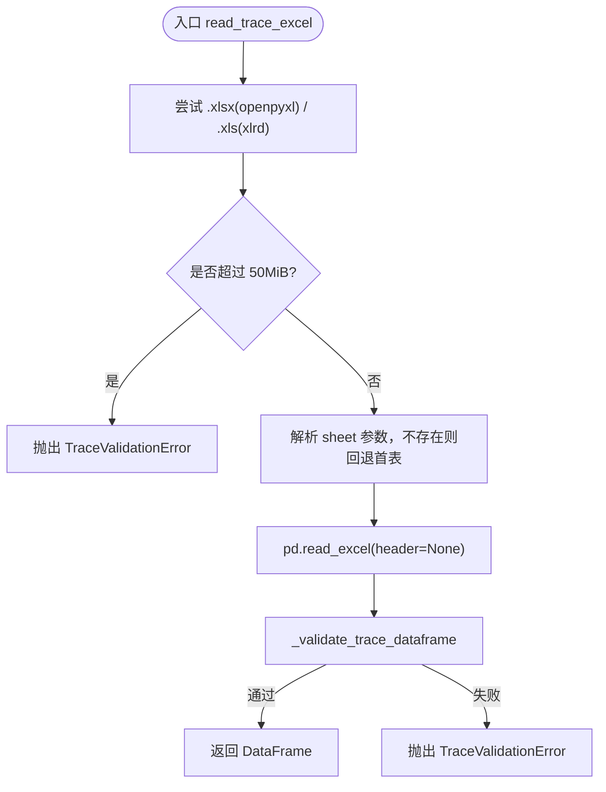
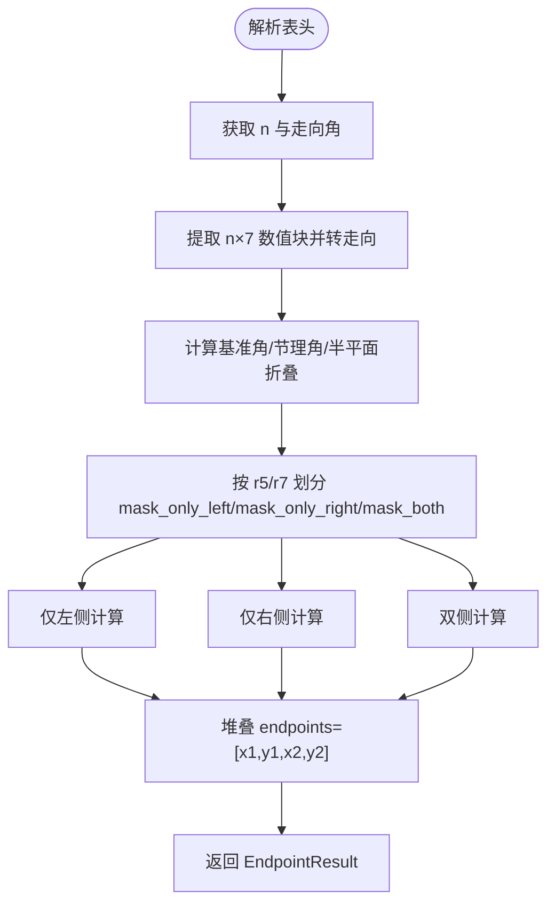
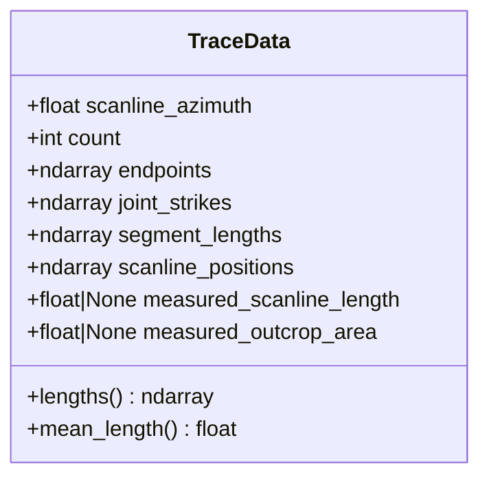
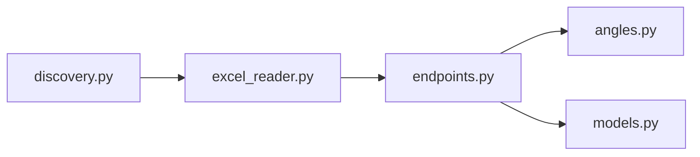

# 阶段一：数据加载与解析

<cite>
**本文引用的文件**   
- [trace_pipeline/io/discovery.py](file://trace_pipeline/io/discovery.py)
- [trace_pipeline/io/excel_reader.py](file://trace_pipeline/io/excel_reader.py)
- [trace_pipeline/geology/endpoints.py](file://trace_pipeline/geology/endpoints.py)
- [trace_pipeline/geology/angles.py](file://trace_pipeline/geology/angles.py)
- [trace_pipeline/models.py](file://trace_pipeline/models.py)
</cite>

## 目录
1. [简介](#简介)
2. [项目结构](#项目结构)
3. [核心组件](#核心组件)
4. [架构总览](#架构总览)
5. [详细组件分析](#详细组件分析)
6. [依赖关系分析](#依赖关系分析)
7. [性能考虑](#性能考虑)
8. [故障排查指南](#故障排查指南)
9. [结论](#结论)

## 简介
本章节聚焦五阶段处理流水线的“阶段一：数据加载与解析”，完整说明从输入文件签名定位、Excel 表读取与校验、端点坐标计算到构建不可变 TraceData 的全过程。文档涵盖输入文件格式要求（r₁–r₇ 测线记录）、数据验证规则、复数向量端点计算的数学原理，以及异常处理策略与性能优化技巧。

## 项目结构
阶段一涉及的模块按职责分层组织：
- 发现层：扫描输入目录，匹配迹线表文件（_process 后缀）
- 读取层：选择 Excel 引擎并读取工作表，执行基础格式校验
- 计算层：解析表头、提取数值矩阵、角度转换与端点坐标向量化计算
- 模型层：构造不可变的 TraceData 数据容器，提供派生属性与二次校验

图表来源
- [trace_pipeline/io/discovery.py:24-63](file://trace_pipeline/io/discovery.py#L24-L63)
- [trace_pipeline/io/excel_reader.py:36-106](file://trace_pipeline/io/excel_reader.py#L36-L106)
- [trace_pipeline/geology/endpoints.py:295-411](file://trace_pipeline/geology/endpoints.py#L295-L411)
- [trace_pipeline/models.py:41-121](file://trace_pipeline/models.py#L41-L121)

章节来源
- [trace_pipeline/io/discovery.py:1-63](file://trace_pipeline/io/discovery.py#L1-L63)
- [trace_pipeline/io/excel_reader.py:1-169](file://trace_pipeline/io/excel_reader.py#L1-L169)
- [trace_pipeline/geology/endpoints.py:1-418](file://trace_pipeline/geology/endpoints.py#L1-L418)
- [trace_pipeline/models.py:1-352](file://trace_pipeline/models.py#L1-L352)

## 核心组件
- 文件发现：根据文件名后缀 _process 与扩展名 .xlsx/.xls 进行匹配与去重，返回 outcrop 标识与 stem。
- Excel 读取：优先 .xlsx（openpyxl），缺失回退 .xls（xlrd）；支持 sheet 不存在时回退首表；内置文件大小上限与基础列数/数值性检查。
- 端点计算：解析表头（走向角、迹线条数、可选实测量），将倾向转为走向，使用复数向量在左/右/双侧三种情形下计算端点坐标。
- 数据模型：TraceData 为 frozen dataclass，包含严格形状与有限值校验，并提供长度等派生属性的惰性缓存。

章节来源
- [trace_pipeline/io/discovery.py:17-63](file://trace_pipeline/io/discovery.py#L17-L63)
- [trace_pipeline/io/excel_reader.py:16-106](file://trace_pipeline/io/excel_reader.py#L16-L106)
- [trace_pipeline/geology/endpoints.py:95-179](file://trace_pipeline/geology/endpoints.py#L95-L179)
- [trace_pipeline/models.py:41-121](file://trace_pipeline/models.py#L41-L121)

## 架构总览
阶段一的端到端调用序列如下：

图表来源
- [trace_pipeline/io/discovery.py:24-63](file://trace_pipeline/io/discovery.py#L24-L63)
- [trace_pipeline/io/excel_reader.py:36-106](file://trace_pipeline/io/excel_reader.py#L36-L106)
- [trace_pipeline/geology/endpoints.py:295-411](file://trace_pipeline/geology/endpoints.py#L295-L411)
- [trace_pipeline/models.py:41-121](file://trace_pipeline/models.py#L41-L121)

## 详细组件分析

### 组件A：输入文件发现与命名约定
- 匹配规则：文件名以 _process 结尾（不含扩展名），扩展名为 .xlsx 或 .xls；同名不同扩展名按首次发现去重（大小写不敏感）。
- 输出：TraceFile(stem, outcrop)，其中 outcrop 为去除 _process 后的前缀。
- 行为：目录不存在或无匹配时返回空列表，并记录日志。

图表来源
- [trace_pipeline/io/discovery.py:24-63](file://trace_pipeline/io/discovery.py#L24-L63)

章节来源
- [trace_pipeline/io/discovery.py:1-63](file://trace_pipeline/io/discovery.py#L1-L63)

### 组件B：Excel 读取与基础校验
- 引擎选择：优先 openpyxl（.xlsx），缺失则 xlrd（.xls）。
- Sheet 回退：若指定 sheet 不存在，直接回退首表，避免失败读取。
- 大小限制：超过 50 MiB 的 Excel 文件直接拒绝，抛出 TraceValidationError。
- 基础校验：至少 4 列（x1,y1,x2,y2）；对前若干行做数值性抽样检测，过低数值占比会记录警告。

图表来源
- [trace_pipeline/io/excel_reader.py:36-106](file://trace_pipeline/io/excel_reader.py#L36-L106)
- [trace_pipeline/io/excel_reader.py:109-126](file://trace_pipeline/io/excel_reader.py#L109-L126)
- [trace_pipeline/io/excel_reader.py:128-169](file://trace_pipeline/io/excel_reader.py#L128-L169)

章节来源
- [trace_pipeline/io/excel_reader.py:1-169](file://trace_pipeline/io/excel_reader.py#L1-L169)

### 组件C：端点计算与复数向量几何
- 表头解析：
  - 第 8 列：测线走向角（度），范围 [0, 360)
  - 第 9 列：迹线条数 n（正整数）
  - 第 12/13 列：实测测线长度/露头面积（可选，非正或非法则为 None）
- 数值块提取：
  - 取前 n 行 × 7 列（r1..r7），全部强制转换为浮点，含 NaN/Inf 立即报错
  - 倾向列（第 3 列）经 dip_to_strike 转为走向
- 几何计算（复数向量）：
  - 基准方向角：azimuth → 笛卡尔角（度）→ 弧度
  - 节理方向角：270° − joint_strike（模 360°）
  - 侧向判定：基于 r5/r7 是否大于容差区分仅左/仅右/双侧
  - 向量定义：
    - z1_base = r1 · exp(i·rad_base)
    - vec_perp_left/right = exp(i·(rad_base ± π/2))
    - vec_skew_left/right = exp(i·fold_to_halfplane(rad_base_deg, ang_joint, invert=False/True))
  - 三种情形的端点公式（就地写入预分配数组）：
    - 仅左侧：start = z1 + r2·L_perp + r4·L_skew；end = start + r5·L_skew
    - 仅右侧：start = z1 + r2·R_perp + r6·R_skew；end = start + r7·R_skew
    - 双侧：left = z1 + r2·L_perp + (r4+r5)·L_skew；right = z1 + r2·R_perp + (r6+r7)·R_skew
- 输出：EndpointResult 包含 azimuth、count、endpoints(N×4)、joint_strikes、segment_lengths(r5+r7)、scanline_positions(r1)、可选实测量。

图表来源
- [trace_pipeline/geology/endpoints.py:113-179](file://trace_pipeline/geology/endpoints.py#L113-L179)
- [trace_pipeline/geology/endpoints.py:210-290](file://trace_pipeline/geology/endpoints.py#L210-L290)
- [trace_pipeline/geology/endpoints.py:295-411](file://trace_pipeline/geology/endpoints.py#L295-L411)
- [trace_pipeline/geology/angles.py:28-70](file://trace_pipeline/geology/angles.py#L28-L70)
- [trace_pipeline/geology/angles.py:108-148](file://trace_pipeline/geology/angles.py#L108-L148)

章节来源
- [trace_pipeline/geology/endpoints.py:1-418](file://trace_pipeline/geology/endpoints.py#L1-L418)
- [trace_pipeline/geology/angles.py:1-168](file://trace_pipeline/geology/angles.py#L1-L168)

### 组件D：TraceData 不可变数据模型
- 字段含义：
  - scanline_azimuth：测线走向角（度），已规范化到 [0, 360)
  - count：迹线条数 ≥ 0
  - endpoints：端点坐标 (N, 4)，列序 [x1, y1, x2, y2]
  - joint_strikes：各节理走向角（度），长度 N
  - segment_lengths：沿测段的迹线长度 r5+r7，长度 N
  - scanline_positions：沿测线位移 r1，长度 N
  - measured_scanline_length/measured_outcrop_area：可选实测量，缺失为 None
- 构造后校验：
  - 类型与形状一致性（与 count 对齐）
  - 所有数值必须有限（非 NaN/Inf）
  - 可选实测量需为正有限浮点数
  - 内部 ndarray 标记为只读，确保不可变性
- 派生属性：
  - lengths：端点间欧氏距离，首次访问后缓存且只读
  - mean_length：平均长度（空时为 0.0）

图表来源
- [trace_pipeline/models.py:41-121](file://trace_pipeline/models.py#L41-L121)
- [trace_pipeline/models.py:133-156](file://trace_pipeline/models.py#L133-L156)

章节来源
- [trace_pipeline/models.py:1-352](file://trace_pipeline/models.py#L1-L352)

## 依赖关系分析
- discovery 独立于其他阶段，仅负责文件发现
- excel_reader 依赖 pandas 进行读取与基础校验
- endpoints 依赖 angles 的角度转换与半平面折叠函数
- models 作为最终数据载体，被上层流水线消费

图表来源
- [trace_pipeline/io/discovery.py:1-63](file://trace_pipeline/io/discovery.py#L1-L63)
- [trace_pipeline/io/excel_reader.py:1-169](file://trace_pipeline/io/excel_reader.py#L1-L169)
- [trace_pipeline/geology/endpoints.py:1-418](file://trace_pipeline/geology/endpoints.py#L1-L418)
- [trace_pipeline/geology/angles.py:1-168](file://trace_pipeline/geology/angles.py#L1-L168)
- [trace_pipeline/models.py:1-352](file://trace_pipeline/models.py#L1-L352)

章节来源
- [trace_pipeline/io/discovery.py:1-63](file://trace_pipeline/io/discovery.py#L1-L63)
- [trace_pipeline/io/excel_reader.py:1-169](file://trace_pipeline/io/excel_reader.py#L1-L169)
- [trace_pipeline/geology/endpoints.py:1-418](file://trace_pipeline/geology/endpoints.py#L1-L418)
- [trace_pipeline/geology/angles.py:1-168](file://trace_pipeline/geology/angles.py#L1-L168)
- [trace_pipeline/models.py:1-352](file://trace_pipeline/models.py#L1-L352)

## 性能考虑
- 文件发现：glob 排序与去重减少重复 IO，避免多次扫描。
- Excel 读取：
  - 优先 openpyxl，缺失再回退 xlrd，减少无效尝试
  - 预先解析 sheet 名称，避免失败读取开销
  - 文件大小上限保护，防止内存溢出
  - 基础校验仅采样前若干行，降低大表校验成本
- 端点计算：
  - 全向量化 numpy 操作，避免 Python 循环
  - 预分配结果数组并按掩码就地写入，减少中间对象
  - 角度与半平面折叠采用向量化实现
- 数据模型：
  - frozen dataclass 保证不可变性与安全性
  - 派生属性惰性缓存，避免重复计算

[本节为通用性能建议，无需具体文件引用]

## 故障排查指南
- 未找到迹线表
  - 现象：发现列表为空
  - 排查：确认输入目录存在、文件名以 _process 结尾、扩展名为 .xlsx/.xls
  - 参考路径：[trace_pipeline/io/discovery.py:24-63](file://trace_pipeline/io/discovery.py#L24-L63)
- Excel 文件过大
  - 现象：抛出 TraceValidationError，提示超过上限
  - 排查：拆分文件或压缩内容，确保单表 ≤ 50 MiB
  - 参考路径：[trace_pipeline/io/excel_reader.py:69-78](file://trace_pipeline/io/excel_reader.py#L69-L78)
- 工作表不存在
  - 现象：读取失败但自动回退首表
  - 排查：检查 sheet 名称是否正确，必要时显式指定有效 sheet
  - 参考路径：[trace_pipeline/io/excel_reader.py:109-126](file://trace_pipeline/io/excel_reader.py#L109-L126)
- 表头或数值错误
  - 现象：抛出 ValueError，指出走向角/迹线条数/NaN/Inf 等问题
  - 排查：修正表头范围与数据类型，确保 r1≥0、dip∈[0,360)、r4/r5/r6/r7≥0 且 r5/r7 不同时为 0
  - 参考路径：
    - [trace_pipeline/geology/endpoints.py:113-179](file://trace_pipeline/geology/endpoints.py#L113-L179)
    - [trace_pipeline/geology/endpoints.py:182-205](file://trace_pipeline/geology/endpoints.py#L182-L205)
- TraceData 构造失败
  - 现象：形状不一致或包含 NaN/Inf
  - 排查：核对 count 与各数组长度一致，确保数值有限
  - 参考路径：[trace_pipeline/models.py:65-121](file://trace_pipeline/models.py#L65-L121)

章节来源
- [trace_pipeline/io/discovery.py:24-63](file://trace_pipeline/io/discovery.py#L24-L63)
- [trace_pipeline/io/excel_reader.py:69-106](file://trace_pipeline/io/excel_reader.py#L69-L106)
- [trace_pipeline/geology/endpoints.py:113-205](file://trace_pipeline/geology/endpoints.py#L113-L205)
- [trace_pipeline/models.py:65-121](file://trace_pipeline/models.py#L65-L121)

## 结论
阶段一通过稳健的文件发现、健壮的 Excel 读取与严格的数值校验，结合高效的复数向量端点计算，最终产出不可变的 TraceData，为后续处理阶段提供高质量、可追溯的数据基座。其设计兼顾正确性、性能与可维护性，适合大规模地质迹线数据的自动化处理。