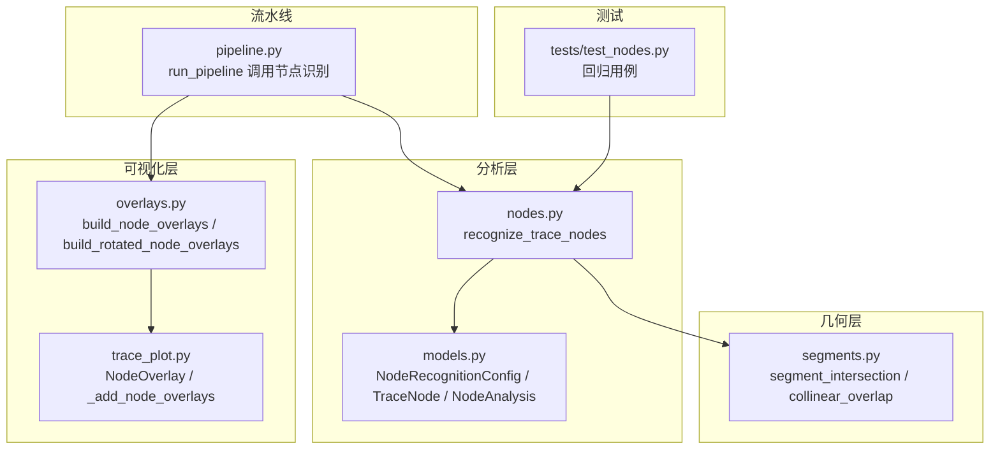
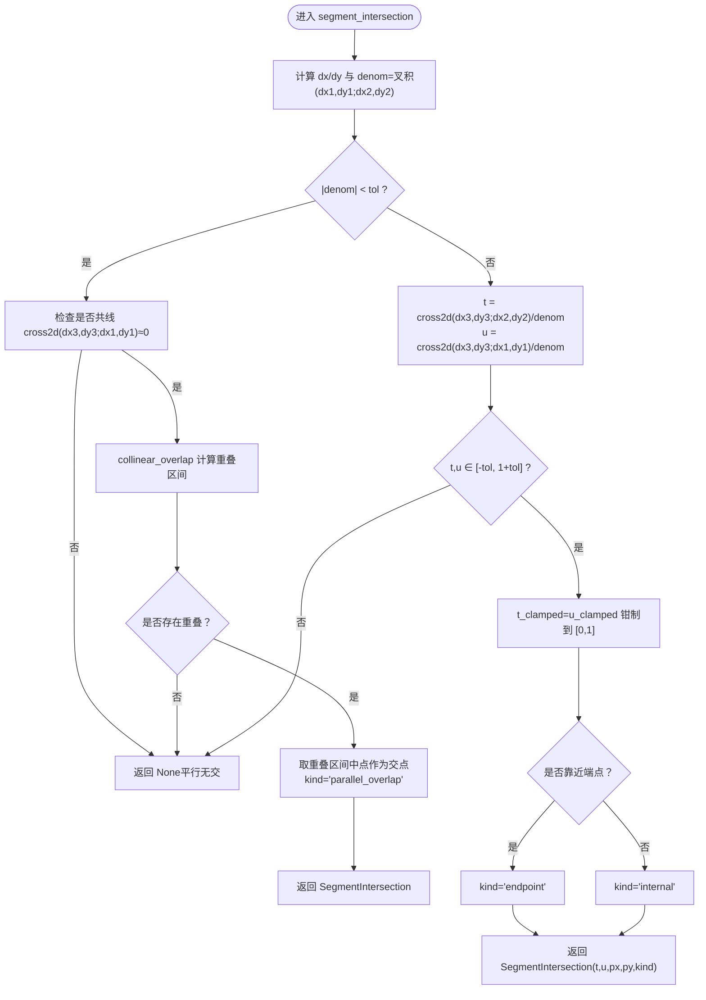
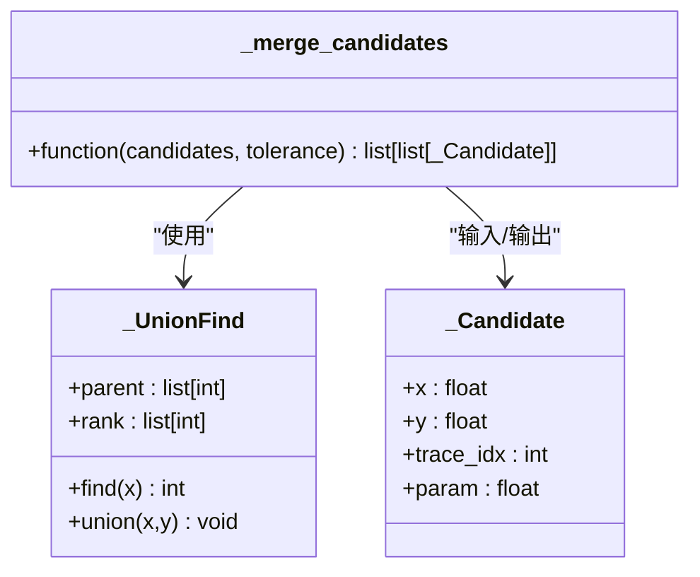
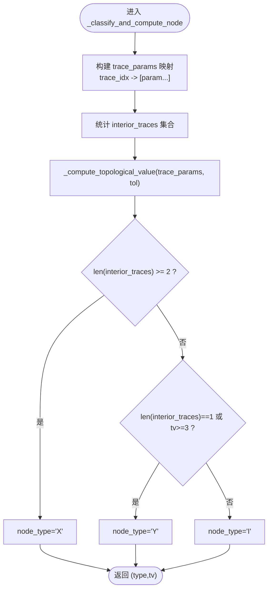
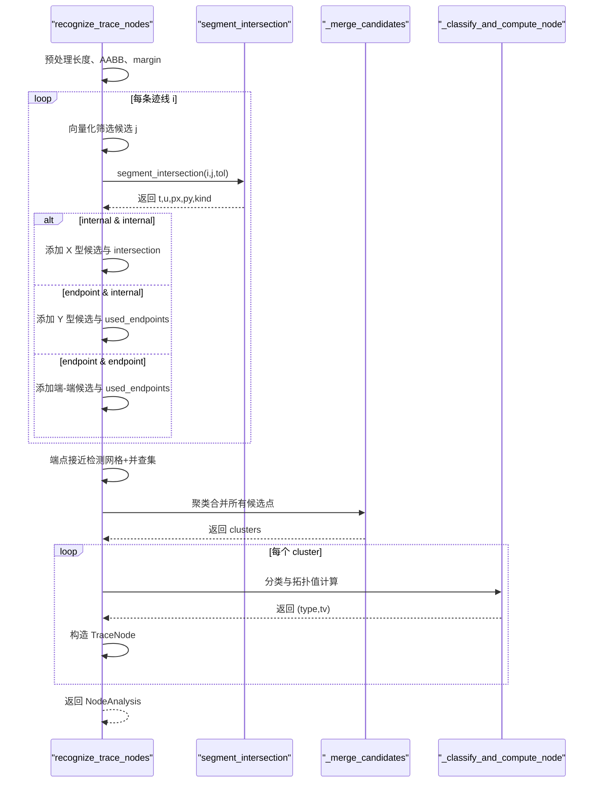
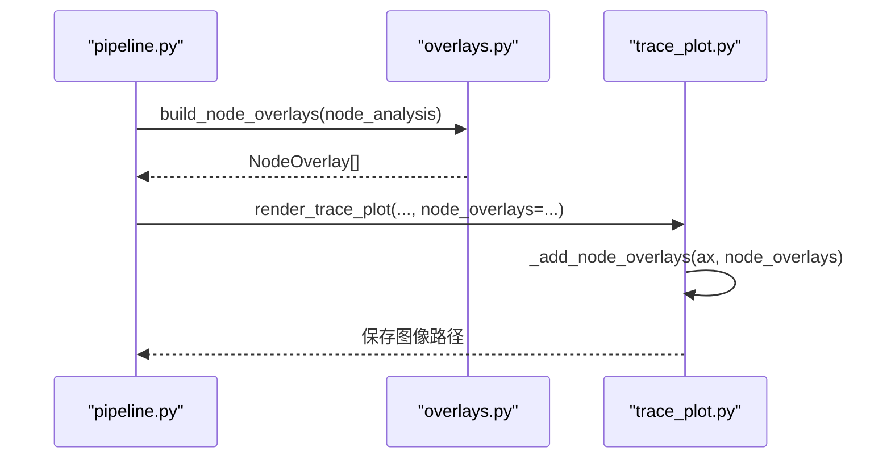
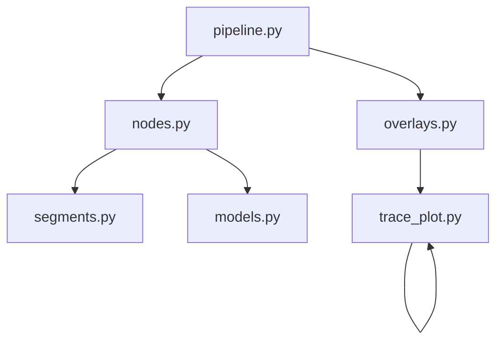

# 阶段三：节点识别与拓扑分析

<cite>
**本文引用的文件**
- [trace_pipeline/analysis/nodes.py](file://trace_pipeline/analysis/nodes.py)
- [trace_pipeline/analysis/models.py](file://trace_pipeline/analysis/models.py)
- [trace_pipeline/geometry/segments.py](file://trace_pipeline/geometry/segments.py)
- [trace_pipeline/plotting/overlays.py](file://trace_pipeline/plotting/overlays.py)
- [trace_pipeline/plotting/trace_plot.py](file://trace_pipeline/plotting/trace_plot.py)
- [trace_pipeline/pipeline.py](file://trace_pipeline/pipeline.py)
- [tests/test_nodes.py](file://tests/test_nodes.py)
</cite>

## 目录
1. [引言](#引言)
2. [项目结构](#项目结构)
3. [核心组件](#核心组件)
4. [架构总览](#架构总览)
5. [详细组件分析](#详细组件分析)
6. [依赖关系分析](#依赖关系分析)
7. [性能考量](#性能考量)
8. [故障排查指南](#故障排查指南)
9. [结论](#结论)
10. [附录](#附录)

## 引言
本章节聚焦五阶段处理流水线的第三阶段——“节点识别与拓扑分析”。该阶段负责在二维裂隙网络中，基于迹线端点坐标识别三类拓扑节点：I型（孤立端点）、Y型（三分叉）、X型（十字交叉），并输出节点集合、相交事件及统计信息。其核心算法流程包括：
- 交点检测：对候选迹线对进行几何相交判定，区分内部交叉、端点接触与共线重叠等情形；
- 并查集合并：将空间接近的候选事件聚类为同一节点；
- 节点分类：依据参与迹线的参数位置与拓扑值，确定节点类型与分支数。

本技术文档将从数据结构、数学原理、实现细节、可视化覆盖层生成与错误处理策略等方面展开，帮助读者深入理解并正确配置与使用节点识别功能。

## 项目结构
第三阶段涉及的核心代码分布在以下模块：
- 分析与模型定义：nodes.py、models.py
- 几何基础：segments.py
- 可视化覆盖层：overlays.py、trace_plot.py
- 流水线集成：pipeline.py
- 单元测试：test_nodes.py



图表来源
- [trace_pipeline/analysis/nodes.py:160-416](file://trace_pipeline/analysis/nodes.py#L160-L416)
- [trace_pipeline/analysis/models.py:22-98](file://trace_pipeline/analysis/models.py#L22-L98)
- [trace_pipeline/geometry/segments.py:42-113](file://trace_pipeline/geometry/segments.py#L42-L113)
- [trace_pipeline/plotting/overlays.py:117-156](file://trace_pipeline/plotting/overlays.py#L117-L156)
- [trace_pipeline/plotting/trace_plot.py:88-97](file://trace_pipeline/plotting/trace_plot.py#L88-L97)
- [trace_pipeline/pipeline.py:345-373](file://trace_pipeline/pipeline.py#L345-L373)
- [tests/test_nodes.py:22-149](file://tests/test_nodes.py#L22-L149)

章节来源
- [trace_pipeline/analysis/nodes.py:1-416](file://trace_pipeline/analysis/nodes.py#L1-L416)
- [trace_pipeline/analysis/models.py:1-98](file://trace_pipeline/analysis/models.py#L1-L98)
- [trace_pipeline/geometry/segments.py:1-197](file://trace_pipeline/geometry/segments.py#L1-L197)
- [trace_pipeline/plotting/overlays.py:1-156](file://trace_pipeline/plotting/overlays.py#L1-L156)
- [trace_pipeline/plotting/trace_plot.py:1-565](file://trace_pipeline/plotting/trace_plot.py#L1-L565)
- [trace_pipeline/pipeline.py:1-474](file://trace_pipeline/pipeline.py#L1-L474)
- [tests/test_nodes.py:1-149](file://tests/test_nodes.py#L1-L149)

## 核心组件
- recognize_trace_nodes：节点识别主函数，完成预处理、相交检测、端点接近检测、聚类合并与节点分类。
- _UnionFind：并查集类，用于传递性聚类合并。
- segment_intersection：线段相交检测，返回参数化交点与事件类型。
- NodeRecognitionConfig：节点识别配置项（开关、容差、标签模式等）。
- TraceNode / TraceIntersection / NodeAnalysis：结果数据模型。
- overlays 与 trace_plot：将节点结果转换为可视化覆盖层并在图中绘制。

章节来源
- [trace_pipeline/analysis/nodes.py:52-118](file://trace_pipeline/analysis/nodes.py#L52-L118)
- [trace_pipeline/analysis/nodes.py:160-416](file://trace_pipeline/analysis/nodes.py#L160-L416)
- [trace_pipeline/geometry/segments.py:42-113](file://trace_pipeline/geometry/segments.py#L42-L113)
- [trace_pipeline/analysis/models.py:22-98](file://trace_pipeline/analysis/models.py#L22-L98)
- [trace_pipeline/plotting/overlays.py:117-156](file://trace_pipeline/plotting/overlays.py#L117-L156)
- [trace_pipeline/plotting/trace_plot.py:320-357](file://trace_pipeline/plotting/trace_plot.py#L320-L357)

## 架构总览
下图展示了第三阶段在整体流水线中的位置与数据流：输入端点经节点识别得到节点与相交事件，随后被转换为可视化覆盖层，最终在原始与旋转坐标系下绘图输出。

```mermaid
sequenceDiagram
participant Pipe as "流水线 pipeline.py"
participant Nodes as "节点识别 nodes.py"
participant Segs as "几何 segments.py"
participant Over as "覆盖层 overlays.py"
participant Plot as "绘图 trace_plot.py"
Pipe->>Nodes : 调用 recognize_trace_nodes(endpoints, config)
Nodes->>Segs : 多次 segment_intersection(候选对)
Segs-->>Nodes : 返回 SegmentIntersection(t,u,px,py,kind)
Nodes->>Nodes : 收集候选点 + 端点接近检测 + 并查集聚类
Nodes-->>Pipe : 返回 NodeAnalysis(nodes, intersections, warnings)
Pipe->>Over : build_node_overlays(node_analysis)
Over-->>Plot : 生成 NodeOverlay 列表
Plot-->>Pipe : 渲染原始/旋转图并保存
```

图表来源
- [trace_pipeline/pipeline.py:345-373](file://trace_pipeline/pipeline.py#L345-L373)
- [trace_pipeline/analysis/nodes.py:160-416](file://trace_pipeline/analysis/nodes.py#L160-L416)
- [trace_pipeline/geometry/segments.py:42-113](file://trace_pipeline/geometry/segments.py#L42-L113)
- [trace_pipeline/plotting/overlays.py:117-156](file://trace_pipeline/plotting/overlays.py#L117-L156)
- [trace_pipeline/plotting/trace_plot.py:443-565](file://trace_pipeline/plotting/trace_plot.py#L443-L565)

## 详细组件分析

### 几何定义与交点检测算法
- 几何定义
  - 每条迹线由两个端点表示，形如 (x1,y1,x2,y2)。
  - 参数化表示：A(t)=a1+t*(a2-a1)，B(u)=b1+u*(b2-b1)，t,u∈[0,1]。
- 交点检测
  - 通过二维叉积计算分母与分子，求解 t,u。
  - 若分母接近零，视为平行或共线：
    - 共线且存在重叠时，取重叠区间中点作为代表交点，标记 kind="parallel_overlap"。
    - 否则无有效交点。
  - 非平行情况下，若 t,u 落在容差范围内，则计算交点坐标 px,py，并根据是否靠近端点标记 kind="endpoint" 或 "internal"。
- 退化线段
  - 长度小于容差的线段被视为退化，不参与后续检测。



图表来源
- [trace_pipeline/geometry/segments.py:42-113](file://trace_pipeline/geometry/segments.py#L42-L113)
- [trace_pipeline/geometry/segments.py:116-177](file://trace_pipeline/geometry/segments.py#L116-L177)

章节来源
- [trace_pipeline/geometry/segments.py:1-197](file://trace_pipeline/geometry/segments.py#L1-L197)

### 并查集数据结构与候选点聚类
- 并查集设计
  - 维护 parent 与 rank 数组，支持 find 路径压缩与 union 按秩合并。
- 网格分桶 + 并查集合并
  - 以 cell_size=max(tolerance, 1e-12) 构建二维网格，将候选点分配到对应单元格。
  - 遍历每个候选点的九宫格邻居，若距离平方 ≤ tolerance^2，则执行 union。
  - 最后按根节点分组，形成聚类簇。
- 端点接近检测
  - 对于未使用的端点，同样采用网格分桶与并查集合并，生成候选点并记录 used_endpoints。



图表来源
- [trace_pipeline/analysis/nodes.py:52-76](file://trace_pipeline/analysis/nodes.py#L52-L76)
- [trace_pipeline/analysis/nodes.py:78-118](file://trace_pipeline/analysis/nodes.py#L78-L118)
- [trace_pipeline/analysis/nodes.py:38-46](file://trace_pipeline/analysis/nodes.py#L38-L46)

章节来源
- [trace_pipeline/analysis/nodes.py:52-118](file://trace_pipeline/analysis/nodes.py#L52-L118)

### 节点分类规则与拓扑值计算
- 拓扑值计算
  - 对每个参与节点的迹线，统计其在节点处的参数集合（去重后）。
  - 若任一参数位于内部（不在端点邻域内），则该迹线贡献 2。
  - 否则，若该迹线在该节点处有两个端点参与，贡献 2；若仅一个端点参与，贡献 1。
  - 将所有迹线贡献相加得到拓扑值 tv。
- 分类标准
  - X 型：至少两条迹线在内部参与（len(interior_traces) ≥ 2）。
  - Y 型：仅一条迹线在内部参与，或拓扑值 ≥ 3。
  - I 型：其余情况（孤立端点）。
- 节点属性
  - node_type ∈ {"I","Y","X"}，degree=tv，trace_indices 为参与迹线索引集合，event_count 为该节点的事件数量。



图表来源
- [trace_pipeline/analysis/nodes.py:121-157](file://trace_pipeline/analysis/nodes.py#L121-L157)

章节来源
- [trace_pipeline/analysis/nodes.py:121-157](file://trace_pipeline/analysis/nodes.py#L121-L157)

### 完整识别流程与关键步骤
- 预处理
  - 计算迹线长度，过滤退化线段（长度 < merge_tolerance）。
  - 预计算 AABB 包围盒与全局扩展 margin，用于快速筛选候选对。
- 相交检测
  - 对每条迹线，向量化筛选可能重叠的邻居（索引更大以避免重复）。
  - 调用 segment_intersection 精确检测，根据 t,u 是否为内部参数分类为 X/Y/端-端事件。
  - 记录 intersections 与 candidates，并标记 used_endpoints。
- 端点接近检测
  - 收集未使用端点，网格分桶 + 并查集合并，生成候选点并更新 used_endpoints。
- 聚类合并
  - 对所有候选点执行网格 + 并查集聚类，得到 clusters。
- 节点生成
  - 对每个 cluster 计算中心坐标、参与迹线集合、类型与拓扑值，构造 TraceNode。
- 结果封装
  - 返回 NodeAnalysis，包含 nodes、intersections、warnings、degenerate_skipped、merge_tolerance。



图表来源
- [trace_pipeline/analysis/nodes.py:160-416](file://trace_pipeline/analysis/nodes.py#L160-L416)
- [trace_pipeline/geometry/segments.py:42-113](file://trace_pipeline/geometry/segments.py#L42-L113)

章节来源
- [trace_pipeline/analysis/nodes.py:160-416](file://trace_pipeline/analysis/nodes.py#L160-L416)

### 可视化覆盖层生成与绘制
- 覆盖层转换
  - build_node_overlays：将 NodeAnalysis.nodes 转为 NodeOverlay 序列。
  - build_rotated_node_overlays：将节点坐标旋转到测线坐标系。
- 绘制逻辑
  - render_trace_plot：接收 node_overlays，按类型分组批量 scatter 绘制，避免逐点开销。
  - 图例自适应：根据存在的节点类型动态显示图例条目。



图表来源
- [trace_pipeline/plotting/overlays.py:117-156](file://trace_pipeline/plotting/overlays.py#L117-L156)
- [trace_pipeline/plotting/trace_plot.py:320-357](file://trace_pipeline/plotting/trace_plot.py#L320-L357)
- [trace_pipeline/pipeline.py:345-373](file://trace_pipeline/pipeline.py#L345-L373)

章节来源
- [trace_pipeline/plotting/overlays.py:1-156](file://trace_pipeline/plotting/overlays.py#L1-L156)
- [trace_pipeline/plotting/trace_plot.py:1-565](file://trace_pipeline/plotting/trace_plot.py#L1-L565)
- [trace_pipeline/pipeline.py:1-474](file://trace_pipeline/pipeline.py#L1-L474)

### 配置选项与使用示例（以源码路径引用代替具体代码）
- 节点识别配置
  - enabled：是否启用节点识别。
  - merge_tolerance：几何检测与聚类合并容差（必须 > 0）。
  - show_overlay：是否在绘图中显示节点覆盖层。
  - label_mode：标签模式（none/type/id）。
- 流水线集成
  - run_pipeline 在阶段三根据 cfg.enable_node_recognition 与相关配置创建 NodeRecognitionConfig，调用 recognize_trace_nodes，并构建原始与旋转覆盖层。
- 参考路径
  - 配置定义与校验：[trace_pipeline/analysis/models.py:22-36](file://trace_pipeline/analysis/models.py#L22-L36)
  - 流水线调用与日志：[trace_pipeline/pipeline.py:345-373](file://trace_pipeline/pipeline.py#L345-L373)
  - 单元测试用例（交叉、端点接触、退化线段等）：[tests/test_nodes.py:22-149](file://tests/test_nodes.py#L22-L149)

章节来源
- [trace_pipeline/analysis/models.py:22-36](file://trace_pipeline/analysis/models.py#L22-L36)
- [trace_pipeline/pipeline.py:345-373](file://trace_pipeline/pipeline.py#L345-L373)
- [tests/test_nodes.py:22-149](file://tests/test_nodes.py#L22-L149)

## 依赖关系分析
- 直接依赖
  - nodes.py 依赖 geometry.segments.segment_intersection 与 analysis.models 的数据结构。
  - overlays.py 依赖 plotting.trace_plot.NodeOverlay 与 geology.transforms.normalize_points_like_lines。
  - pipeline.py 串联加载、变换、节点识别、导出与绘图。
- 间接依赖
  - 可视化样式与布局由 plotting.style 与 plotting._layout 提供。
- 潜在耦合
  - 节点识别与几何模块解耦良好，便于替换或优化相交算法。
  - 覆盖层与绘图模块通过 NodeOverlay 接口统一，利于扩展新的图层类型。



图表来源
- [trace_pipeline/analysis/nodes.py:160-416](file://trace_pipeline/analysis/nodes.py#L160-L416)
- [trace_pipeline/geometry/segments.py:42-113](file://trace_pipeline/geometry/segments.py#L42-L113)
- [trace_pipeline/analysis/models.py:22-98](file://trace_pipeline/analysis/models.py#L22-L98)
- [trace_pipeline/plotting/overlays.py:117-156](file://trace_pipeline/plotting/overlays.py#L117-L156)
- [trace_pipeline/plotting/trace_plot.py:88-97](file://trace_pipeline/plotting/trace_plot.py#L88-L97)
- [trace_pipeline/pipeline.py:345-373](file://trace_pipeline/pipeline.py#L345-L373)

章节来源
- [trace_pipeline/analysis/nodes.py:160-416](file://trace_pipeline/analysis/nodes.py#L160-L416)
- [trace_pipeline/geometry/segments.py:42-113](file://trace_pipeline/geometry/segments.py#L42-L113)
- [trace_pipeline/analysis/models.py:22-98](file://trace_pipeline/analysis/models.py#L22-L98)
- [trace_pipeline/plotting/overlays.py:117-156](file://trace_pipeline/plotting/overlays.py#L117-L156)
- [trace_pipeline/plotting/trace_plot.py:88-97](file://trace_pipeline/plotting/trace_plot.py#L88-L97)
- [trace_pipeline/pipeline.py:345-373](file://trace_pipeline/pipeline.py#L345-L373)

## 性能考量
- 向量化包围盒筛选：利用 NumPy 布尔掩码快速排除不可能相交的迹线对，降低 O(N^2) 常数因子。
- 网格分桶 + 并查集：将候选点聚类复杂度从 O(M^2) 降至近似 O(M log M) 或线性期望，M 为候选点数量。
- 批量绘制：按节点类型分组 scatter，减少 matplotlib 调用次数，提升渲染性能。
- 退化线段提前过滤：避免无效计算与噪声节点。
- 坐标溢出防护：当坐标绝对值过大时发出警告，防止网格索引溢出。

[本节为通用性能讨论，不直接分析具体文件]

## 故障排查指南
- 常见错误与处理
  - 文件权限不足：写入 Excel 或图片失败时，提示关闭已打开的输出文件并重试。
  - 输入文件不存在：明确提示检查路径。
  - 数值异常：ValueError/KeyError/TypeError/IndexError/OSError 统一捕获并记录。
  - 内存与中断：MemoryError 与 KeyboardInterrupt 直接抛出，便于上层处理。
- 节点识别特定问题
  - 退化线段过多：检查 merge_tolerance 设置，适当增大容差。
  - 坐标值过大：出现网格索引溢出警告时，建议归一化坐标或调整单位。
  - 无交点但期望有：确认 bbox_margin 与容忍度设置，必要时放宽 merge_tolerance。
- 参考路径
  - 统一错误处理：[trace_pipeline/pipeline.py:98-129](file://trace_pipeline/pipeline.py#L98-L129)
  - 节点识别警告与跳过：[trace_pipeline/analysis/nodes.py:208-222](file://trace_pipeline/analysis/nodes.py#L208-L222)
  - 坐标过大警告：[trace_pipeline/analysis/nodes.py:339-345](file://trace_pipeline/analysis/nodes.py#L339-L345)

章节来源
- [trace_pipeline/pipeline.py:98-129](file://trace_pipeline/pipeline.py#L98-L129)
- [trace_pipeline/analysis/nodes.py:208-222](file://trace_pipeline/analysis/nodes.py#L208-L222)
- [trace_pipeline/analysis/nodes.py:339-345](file://trace_pipeline/analysis/nodes.py#L339-L345)

## 结论
第三阶段的节点识别与拓扑分析通过严谨的几何相交检测、高效的并查集聚类与清晰的分类规则，实现了 I/Y/X 三种拓扑节点的可靠识别。结合可视化覆盖层与完善的错误处理，该阶段既保证了准确性，也兼顾了性能与可维护性。合理配置 merge_tolerance 与 label_mode，可在不同数据集上获得稳定且可视化的结果。

[本节为总结性内容，不直接分析具体文件]

## 附录
- 术语说明
  - 内部参数：t,u 严格位于 (tol, 1-tol) 区间，表示交点在迹线内部。
  - 端点参数：t,u 接近 0 或 1，表示交点在迹线端点附近。
  - 拓扑值：反映节点处各迹线的参与方式与分支数。
- 参考测试场景
  - 交叉产生 X 型节点：[tests/test_nodes.py:25-36](file://tests/test_nodes.py#L25-36)
  - 端点落在内部产生 Y 型节点：[tests/test_nodes.py:37-47](file://tests/test_nodes.py#L37-47)
  - 平行不共线无交点：[tests/test_nodes.py:75-89](file://tests/test_nodes.py#L75-89)
  - 共线重叠产生节点：[tests/test_nodes.py:91-101](file://tests/test_nodes.py#L91-101)
  - 退化线段跳过与警告：[tests/test_nodes.py:103-116](file://tests/test_nodes.py#L103-116)

章节来源
- [tests/test_nodes.py:25-116](file://tests/test_nodes.py#L25-L116)