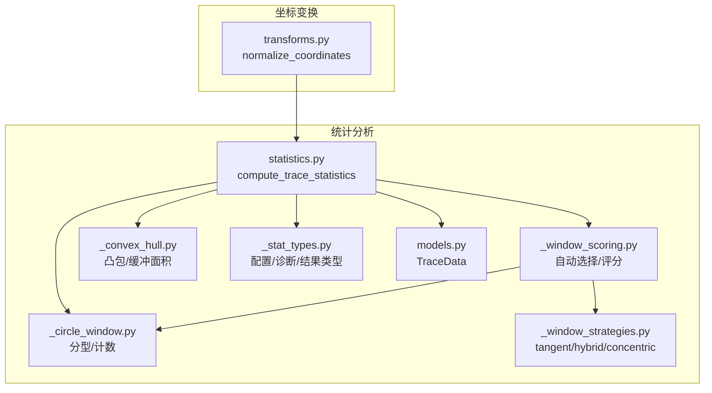
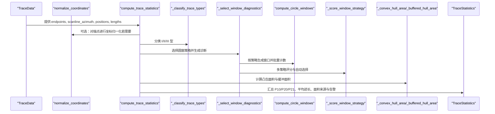
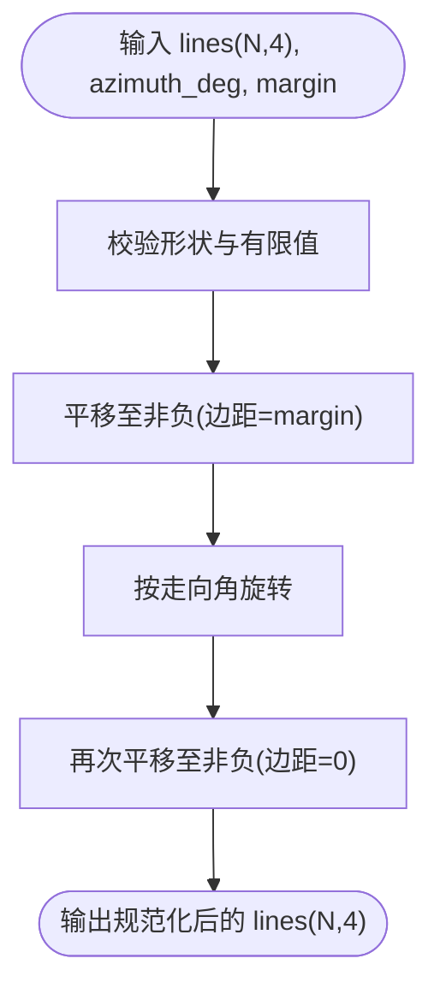
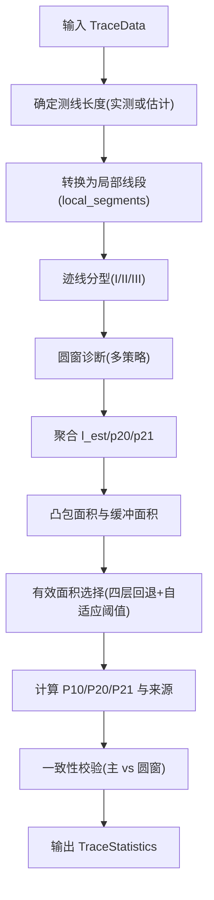
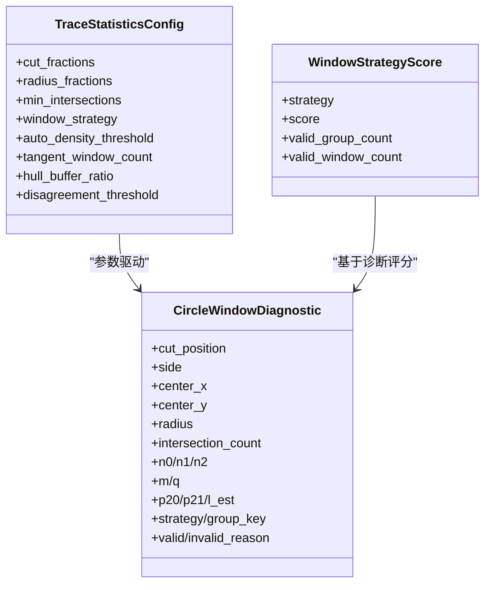
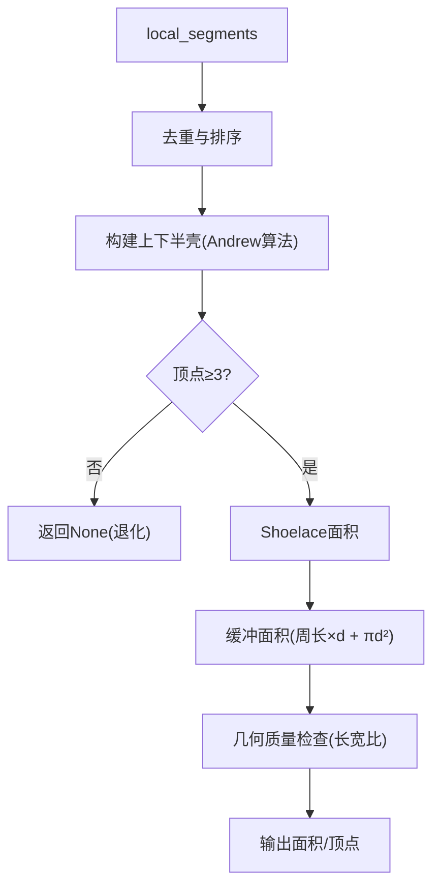
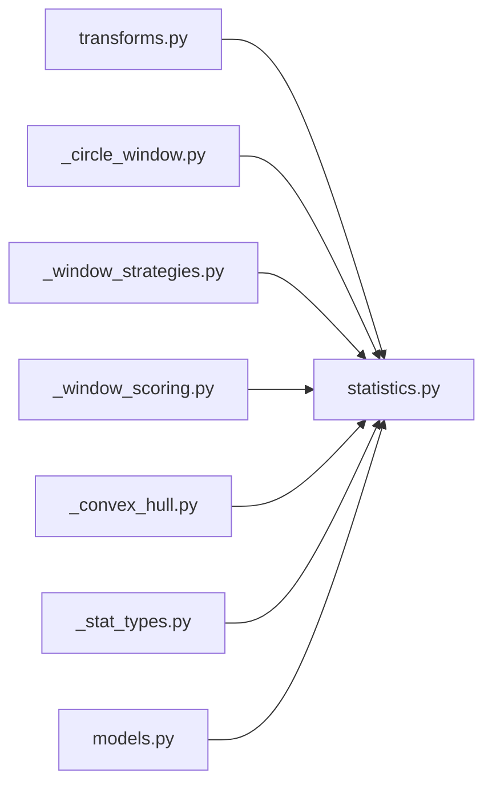

# 阶段二：坐标变换与统计分析

<cite>
**本文引用的文件列表**
- [trace_pipeline/geology/transforms.py](file://trace_pipeline/geology/transforms.py)
- [trace_pipeline/geology/statistics.py](file://trace_pipeline/geology/statistics.py)
- [trace_pipeline/geology/_circle_window.py](file://trace_pipeline/geology/_circle_window.py)
- [trace_pipeline/geology/_window_strategies.py](file://trace_pipeline/geology/_window_strategies.py)
- [trace_pipeline/geology/_window_scoring.py](file://trace_pipeline/geology/_window_scoring.py)
- [trace_pipeline/geology/_convex_hull.py](file://trace_pipeline/geology/_convex_hull.py)
- [trace_pipeline/geology/_stat_types.py](file://trace_pipeline/geology/_stat_types.py)
- [trace_pipeline/models.py](file://trace_pipeline/models.py)
- [tests/test_transforms.py](file://tests/test_transforms.py)
- [tests/test_statistics.py](file://tests/test_statistics.py)
</cite>

## 目录
1. [引言](#引言)
2. [项目结构](#项目结构)
3. [核心组件](#核心组件)
4. [架构总览](#架构总览)
5. [详细组件分析](#详细组件分析)
6. [依赖关系分析](#依赖关系分析)
7. [性能考量](#性能考量)
8. [故障排查指南](#故障排查指南)
9. [结论](#结论)
10. [附录](#附录)

## 引言
本文件聚焦五阶段处理流水线的第二阶段：坐标变换与统计分析。该阶段负责将原始迹线端点坐标归一化到测线局部坐标系，并在此基础上计算关键统计指标（P₁₀/P₂₀/P₂₁、平均迹长估计），同时自动选择最优圆窗策略，并通过凸包边界进行面积估算与一致性校验。文档将深入解析 normalize_coordinates 坐标归一化、compute_trace_statistics 统计指标计算、圆窗策略自动选择逻辑、以及凸包算法在地质分析中的应用，并提供不同配置下的行为差异与性能建议。

## 项目结构
第二阶段的核心代码集中在 geology 子包中，围绕“坐标变换”和“统计分析”两大主题组织：
- 坐标变换：transforms.py
- 统计分析主流程：statistics.py
- 圆窗计数与分型：_circle_window.py
- 圆窗策略布局：_window_strategies.py
- 圆窗评分与自动选择：_window_scoring.py
- 凸包与缓冲面积：_convex_hull.py
- 数据类型与配置：_stat_types.py
- 数据模型 TraceData：models.py

图表来源
- [trace_pipeline/geology/transforms.py:127-144](file://trace_pipeline/geology/transforms.py#L127-L144)
- [trace_pipeline/geology/statistics.py:212-391](file://trace_pipeline/geology/statistics.py#L212-L391)
- [trace_pipeline/geology/_circle_window.py:12-66](file://trace_pipeline/geology/_circle_window.py#L12-L66)
- [trace_pipeline/geology/_window_strategies.py:173-185](file://trace_pipeline/geology/_window_strategies.py#L173-L185)
- [trace_pipeline/geology/_window_scoring.py:235-323](file://trace_pipeline/geology/_window_scoring.py#L235-L323)
- [trace_pipeline/geology/_convex_hull.py:79-85](file://trace_pipeline/geology/_convex_hull.py#L79-L85)
- [trace_pipeline/geology/_stat_types.py:15-65](file://trace_pipeline/geology/_stat_types.py#L15-L65)
- [trace_pipeline/models.py:41-130](file://trace_pipeline/models.py#L41-L130)

章节来源
- [trace_pipeline/geology/transforms.py:1-169](file://trace_pipeline/geology/transforms.py#L1-L169)
- [trace_pipeline/geology/statistics.py:1-391](file://trace_pipeline/geology/statistics.py#L1-L391)
- [trace_pipeline/geology/_circle_window.py:1-269](file://trace_pipeline/geology/_circle_window.py#L1-L269)
- [trace_pipeline/geology/_window_strategies.py:1-185](file://trace_pipeline/geology/_window_strategies.py#L1-L185)
- [trace_pipeline/geology/_window_scoring.py:1-323](file://trace_pipeline/geology/_window_scoring.py#L1-L323)
- [trace_pipeline/geology/_convex_hull.py:1-208](file://trace_pipeline/geology/_convex_hull.py#L1-L208)
- [trace_pipeline/geology/_stat_types.py:1-125](file://trace_pipeline/geology/_stat_types.py#L1-L125)
- [trace_pipeline/models.py:1-200](file://trace_pipeline/models.py#L1-L200)

## 核心组件
- 坐标归一化 transform.normalize_coordinates：将原始坐标先平移至正象限，再按走向角旋转，最后再次平移到非负区域，确保后续几何计算稳定。
- 统计主入口 statistics.compute_trace_statistics：整合测线长度、迹线分型、圆窗诊断、凸包面积、观测与估计的迹长、P₁₀/P₂₀/P₂₁ 等指标，并进行一致性校验。
- 圆窗策略与自动选择：支持 tangent、hybrid（即 hybrid）、concentric 三种布局；auto 模式通过六因子加权评分与密度偏好回退选择最佳策略。
- 凸包边界：基于端点构建凸包，计算面积与缓冲面积，用于露头面积估算与一致性比较。

章节来源
- [trace_pipeline/geology/transforms.py:127-144](file://trace_pipeline/geology/transforms.py#L127-L144)
- [trace_pipeline/geology/statistics.py:212-391](file://trace_pipeline/geology/statistics.py#L212-L391)
- [trace_pipeline/geology/_window_scoring.py:235-323](file://trace_pipeline/geology/_window_scoring.py#L235-L323)
- [trace_pipeline/geology/_convex_hull.py:79-85](file://trace_pipeline/geology/_convex_hull.py#L79-L85)

## 架构总览
下图展示了第二阶段从输入 TraceData 到输出 TraceStatistics 的关键调用链与数据流。

图表来源
- [trace_pipeline/geology/statistics.py:212-391](file://trace_pipeline/geology/statistics.py#L212-L391)
- [trace_pipeline/geology/_window_scoring.py:235-323](file://trace_pipeline/geology/_window_scoring.py#L235-L323)
- [trace_pipeline/geology/_window_strategies.py:173-185](file://trace_pipeline/geology/_window_strategies.py#L173-L185)
- [trace_pipeline/geology/_circle_window.py:71-216](file://trace_pipeline/geology/_circle_window.py#L71-L216)
- [trace_pipeline/geology/_convex_hull.py:79-114](file://trace_pipeline/geology/_convex_hull.py#L79-L114)

## 详细组件分析

### 坐标归一化：normalize_coordinates
- 目标：将原始迹线端点坐标转换到以测线为基准的局部坐标系，保证数值稳定性与可比性。
- 步骤：
  - 平移至正象限（margin 控制留白）。
  - 按走向角旋转（角度折叠到标准范围）。
  - 再次平移至非负区域。
- 关键点：
  - 所有函数均为纯函数式，不修改入参，返回新数组。
  - 内部包含严格的形状与有限值校验，避免 NaN/inf 污染后续计算。
  - 提供 normalize_points_like_lines 以便对任意点集应用相同变换。

图表来源
- [trace_pipeline/geology/transforms.py:127-144](file://trace_pipeline/geology/transforms.py#L127-L144)
- [trace_pipeline/geology/transforms.py:86-122](file://trace_pipeline/geology/transforms.py#L86-L122)

章节来源
- [trace_pipeline/geology/transforms.py:1-169](file://trace_pipeline/geology/transforms.py#L1-L169)
- [tests/test_transforms.py:1-94](file://tests/test_transforms.py#L1-L94)

### 统计指标计算：compute_trace_statistics
- 输入：TraceData（含 endpoints、scanline_azimuth、segment_lengths、scanline_positions、可选 measured_scanline_length/measured_outcrop_area）。
- 主要流程：
  - 测线长度确定：优先实测，否则基于 scanline_positions 估计。
  - 局部坐标系转换：根据测线方位角将端点投影到沿测线与垂直方向。
  - 迹线分型：I/II/III 型分类（向量化实现）。
  - 圆窗诊断：自动生成多种策略的诊断结果，并聚合 l_est/p20/p21。
  - 凸包面积：计算端点凸包面积与缓冲面积（基于平均迹长与比例）。
  - 有效面积选择：四层回退（实测→凸包→缓冲凸包→圆窗等效面积），自适应阈值判断一致性。
  - P₁₀/P₂₀/P₂₁ 计算：结合有效面积与观测/估计迹长，输出最终指标及来源。
  - 一致性校验：主 P20/P21 与圆窗估计值的相对差异超过自适应阈值时发出警告。

图表来源
- [trace_pipeline/geology/statistics.py:212-391](file://trace_pipeline/geology/statistics.py#L212-L391)
- [trace_pipeline/geology/_circle_window.py:12-66](file://trace_pipeline/geology/_circle_window.py#L12-L66)
- [trace_pipeline/geology/_convex_hull.py:79-114](file://trace_pipeline/geology/_convex_hull.py#L79-L114)

章节来源
- [trace_pipeline/geology/statistics.py:1-391](file://trace_pipeline/geology/statistics.py#L1-L391)
- [trace_pipeline/models.py:41-130](file://trace_pipeline/models.py#L41-L130)
- [tests/test_statistics.py:1-200](file://tests/test_statistics.py#L1-L200)

### 圆窗策略与自动选择
- 支持的策略：
  - tangent（切圆）：沿测线两侧放置多个相切圆，适合低密度或样本不足场景。
  - hybrid（混合）：在多个切割位置与半径分数下组合左右侧窗口，兼顾空间覆盖与稳定性。
  - concentric（同心）：以测线中心为圆心，使用多个半径分数，适合高密度且分布均匀的场景。
- 自动选择逻辑（auto）：
  - 并行计算三种策略的诊断结果。
  - 六因子加权评分：有效分组数量、有效组占比、空间覆盖（侧向+沿测线）、稳定性（变异系数倒数）、半径大小、样本充分性。
  - 密度偏好回退：基于粗略面密度与期望相交数，优先推荐 tangent/hybrid/concentric。
  - 当存在有效候选时，选择得分最高者；若得分非正或无有效候选，回退到最保守策略（tangent）。

图表来源
- [trace_pipeline/geology/_stat_types.py:15-65](file://trace_pipeline/geology/_stat_types.py#L15-L65)
- [trace_pipeline/geology/_stat_types.py:67-89](file://trace_pipeline/geology/_stat_types.py#L67-L89)
- [trace_pipeline/geology/_window_scoring.py:170-206](file://trace_pipeline/geology/_window_scoring.py#L170-L206)

章节来源
- [trace_pipeline/geology/_window_strategies.py:1-185](file://trace_pipeline/geology/_window_strategies.py#L1-L185)
- [trace_pipeline/geology/_window_scoring.py:1-323](file://trace_pipeline/geology/_window_scoring.py#L1-L323)
- [trace_pipeline/geology/_stat_types.py:1-125](file://trace_pipeline/geology/_stat_types.py#L1-L125)

### 四种圆窗策略适用场景与选择逻辑
- tangent（切圆）：
  - 适用：低密度、样本不足、边缘效应显著。
  - 特点：每侧固定数量的切圆，半径由测线长度与配置决定，稳健但可能覆盖有限。
- fixed（固定）：
  - 说明：当前实现未提供名为 fixed 的策略；若需固定半径/位置，可通过 hybrid 的 cut_fractions/radius_fractions 配置近似实现。
- adaptive（自适应）：
  - 说明：当前实现未提供名为 adaptive 的策略；自适应体现在 auto 评分与密度偏好回退中。
- auto（自动）：
  - 适用：通用场景，自动权衡六种因素并回退到密度偏好。
  - 选择逻辑：评分最高者优先；若与密度偏好接近（容差内），倾向密度偏好；若无有效候选或非正得分，回退到 tangent。

注意：仓库中实际实现的策略集合为 tangent、hybrid、concentric，并在 auto 模式下进行智能选择。fixed 与 adaptive 并非独立策略名，而是通过配置与评分机制体现。

章节来源
- [trace_pipeline/geology/_window_scoring.py:209-233](file://trace_pipeline/geology/_window_scoring.py#L209-L233)
- [trace_pipeline/geology/_window_scoring.py:235-323](file://trace_pipeline/geology/_window_scoring.py#L235-L323)
- [trace_pipeline/geology/_window_strategies.py:173-185](file://trace_pipeline/geology/_window_strategies.py#L173-L185)

### Mauldon 平均迹长估计方法的数学原理
- 背景：Mauldon 方法利用圆窗内的端点计数 m 与相交计数 q 来估计平均迹长 l_est。
- 公式要点：
  - 在圆窗内，m = n1 + 2*n2（一端在圆内计一次，两端均在圆内计两次）。
  - q = 2*n0 + n1（两端均在圆外计两次，一端在圆内计一次）。
  - 平均迹长估计：l_est = (π * R / 2) * (m / q)，其中 R 为圆半径。
- 实现位置：
  - 圆窗计数与指标计算位于 _circle_window.py 的批量计数函数中，依据上述定义计算 p20、p21 与 l_est。
- 意义：
  - 该方法无需完整测量每条迹线的全长，仅依赖圆窗内的端点与相交信息，适用于野外快速采样与代表性评估。

章节来源
- [trace_pipeline/geology/_circle_window.py:170-192](file://trace_pipeline/geology/_circle_window.py#L170-L192)

### 凸包边界计算在地质分析中的应用
- 目的：用端点凸包近似露头边界，计算面积作为有效面积的一种来源；进一步通过缓冲面积修正边界不确定性。
- 算法要点：
  - 凸包构建：排序后上下半壳拼接，复杂度 O(n log n)。
  - 面积计算：Shoelace 公式，中心化提高大坐标精度。
  - 缓冲面积：基于 Minkowski 和近似，面积 = 原面积 + 周长×缓冲距离 + π×缓冲距离²。
  - 几何质量检查：点数足够、非退化、面积有限、非极度狭长（主轴长宽比限制）。
- 应用：
  - 与圆窗等效面积对比，触发一致性校验与降级回退，提升面积估计的鲁棒性。

图表来源
- [trace_pipeline/geology/_convex_hull.py:17-46](file://trace_pipeline/geology/_convex_hull.py#L17-L46)
- [trace_pipeline/geology/_convex_hull.py:49-57](file://trace_pipeline/geology/_convex_hull.py#L49-L57)
- [trace_pipeline/geology/_convex_hull.py:103-114](file://trace_pipeline/geology/_convex_hull.py#L103-L114)
- [trace_pipeline/geology/_convex_hull.py:186-208](file://trace_pipeline/geology/_convex_hull.py#L186-L208)

章节来源
- [trace_pipeline/geology/_convex_hull.py:1-208](file://trace_pipeline/geology/_convex_hull.py#L1-L208)

## 依赖关系分析
- 模块耦合：
  - statistics.py 依赖 transforms.py（可选坐标归一化）、_circle_window.py（分型与计数）、_window_strategies.py（策略布局）、_window_scoring.py（自动选择与评分）、_convex_hull.py（面积估算）、_stat_types.py（配置与结果类型）、models.py（输入数据模型）。
- 外部依赖：
  - numpy 用于向量化运算与线性代数。
  - math 用于基本数学函数。
- 潜在循环依赖：
  - 各模块单向依赖，未见循环引用。

图表来源
- [trace_pipeline/geology/statistics.py:212-391](file://trace_pipeline/geology/statistics.py#L212-L391)
- [trace_pipeline/geology/_window_scoring.py:235-323](file://trace_pipeline/geology/_window_scoring.py#L235-L323)
- [trace_pipeline/geology/_window_strategies.py:173-185](file://trace_pipeline/geology/_window_strategies.py#L173-L185)
- [trace_pipeline/geology/_circle_window.py:71-216](file://trace_pipeline/geology/_circle_window.py#L71-L216)
- [trace_pipeline/geology/_convex_hull.py:79-114](file://trace_pipeline/geology/_convex_hull.py#L79-L114)
- [trace_pipeline/geology/_stat_types.py:15-65](file://trace_pipeline/geology/_stat_types.py#L15-L65)
- [trace_pipeline/models.py:41-130](file://trace_pipeline/models.py#L41-L130)

章节来源
- [trace_pipeline/geology/statistics.py:1-391](file://trace_pipeline/geology/statistics.py#L1-L391)
- [trace_pipeline/geology/_window_scoring.py:1-323](file://trace_pipeline/geology/_window_scoring.py#L1-L323)
- [trace_pipeline/geology/_window_strategies.py:1-185](file://trace_pipeline/geology/_window_strategies.py#L1-L185)
- [trace_pipeline/geology/_circle_window.py:1-269](file://trace_pipeline/geology/_circle_window.py#L1-L269)
- [trace_pipeline/geology/_convex_hull.py:1-208](file://trace_pipeline/geology/_convex_hull.py#L1-L208)
- [trace_pipeline/geology/_stat_types.py:1-125](file://trace_pipeline/geology/_stat_types.py#L1-L125)
- [trace_pipeline/models.py:1-200](file://trace_pipeline/models.py#L1-L200)

## 性能考量
- 向量化批量计数：_count_circle_windows_batch 利用广播一次性计算 N 条线段与 M 个圆心的距离矩阵，避免 Python 层循环开销。
- 内存占用：N×M 距离矩阵在大样本或多窗口情况下可能较大，建议合理设置 min_intersections 与 radius_fractions 控制窗口数量。
- 凸包复杂度：O(n log n)，在大规模端点集上仍具良好性能；缓冲面积计算为 O(k)（k 为顶点数）。
- 自适应阈值：随样本量增大而收紧，有助于在高密度场景下更严格地筛选有效面积来源。
- 建议：
  - 调整 cut_fractions 与 radius_fractions 平衡覆盖度与计算成本。
  - 在 auto 模式下，若数据规模极大，可考虑固定 window_strategy 为 tangent 或 concentric 以降低评分开销。

[本节为一般性指导，不涉及具体文件分析]

## 故障排查指南
- 常见错误：
  - 输入形状不符：endpoints 必须为 (N,4)，positions 长度为 N。
  - 包含 NaN/inf：所有数值字段需为有限浮点数。
  - 无效 margin：必须 ≥ 0。
  - 圆窗策略非法：window_strategy 必须为 auto/tangent/hybrid/concentric。
  - 最小相交数过小：min_intersections 必须为正整数。
- 定位方法：
  - 查看 TraceStatistics.window_validation_warning 与 diagnostics.invalid_reason。
  - 检查 outcrop_area_source 与 p20_source/p21_source 的来源标记，确认是否发生降级。
  - 使用日志输出（logger.debug/logger.warning）了解自动选择过程与一致性校验告警。

章节来源
- [trace_pipeline/geology/transforms.py:29-46](file://trace_pipeline/geology/transforms.py#L29-L46)
- [trace_pipeline/geology/_stat_types.py:27-65](file://trace_pipeline/geology/_stat_types.py#L27-L65)
- [trace_pipeline/geology/statistics.py:313-336](file://trace_pipeline/geology/statistics.py#L313-L336)
- [tests/test_transforms.py:34-83](file://tests/test_transforms.py#L34-L83)
- [tests/test_statistics.py:73-95](file://tests/test_statistics.py#L73-L95)

## 结论
第二阶段通过严谨的坐标归一化与统计流水线，实现了从原始迹线到可靠密度指标（P₁₀/P₂₀/P₂₁）与平均迹长估计的完整计算。圆窗策略的自动选择与一致性校验提升了结果的可信度，凸包边界则为露头面积提供了稳健的替代来源。整体设计强调向量化性能与健壮的错误处理，适用于不同密度与采样条件下的地质分析需求。

[本节为总结性内容，不涉及具体文件分析]

## 附录

### 配置示例与结果差异（路径指引）
- 不同 window_strategy 的行为差异：
  - tangent：适合低密度，见 [trace_pipeline/geology/_window_strategies.py:87-129](file://trace_pipeline/geology/_window_strategies.py#L87-L129)
  - hybrid：多切割位置与半径分数组合，见 [trace_pipeline/geology/_window_strategies.py:52-84](file://trace_pipeline/geology/_window_strategies.py#L52-L84)
  - concentric：中心同心圆，见 [trace_pipeline/geology/_window_strategies.py:132-170](file://trace_pipeline/geology/_window_strategies.py#L132-L170)
- 自动选择与评分：
  - 六因子权重与评分函数，见 [trace_pipeline/geology/_window_scoring.py:20-30](file://trace_pipeline/geology/_window_scoring.py#L20-L30)、[trace_pipeline/geology/_window_scoring.py:178-206](file://trace_pipeline/geology/_window_scoring.py#L178-L206)
- 测试用例参考：
  - 坐标变换单元测试，见 [tests/test_transforms.py:1-94](file://tests/test_transforms.py#L1-L94)
  - 统计指标单元测试，见 [tests/test_statistics.py:1-200](file://tests/test_statistics.py#L1-L200)

章节来源
- [trace_pipeline/geology/_window_strategies.py:52-170](file://trace_pipeline/geology/_window_strategies.py#L52-L170)
- [trace_pipeline/geology/_window_scoring.py:20-30](file://trace_pipeline/geology/_window_scoring.py#L20-L30)
- [trace_pipeline/geology/_window_scoring.py:178-206](file://trace_pipeline/geology/_window_scoring.py#L178-L206)
- [tests/test_transforms.py:1-94](file://tests/test_transforms.py#L1-L94)
- [tests/test_statistics.py:1-200](file://tests/test_statistics.py#L1-L200)