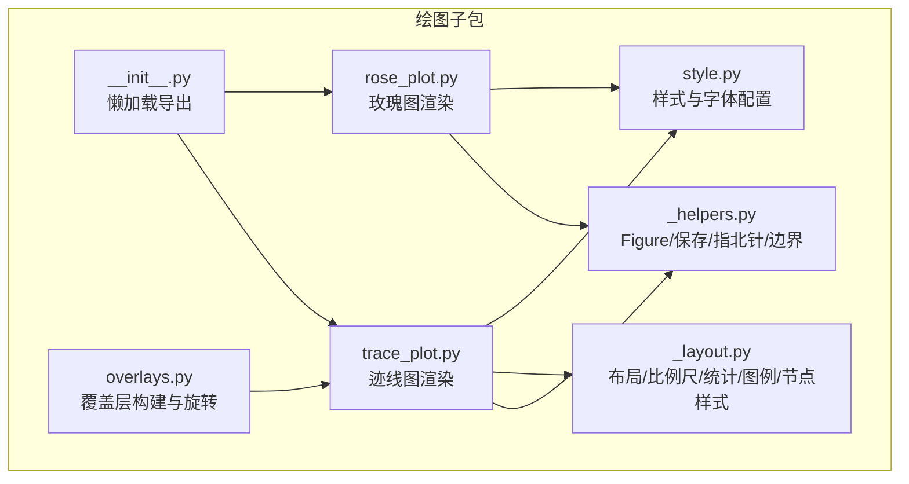
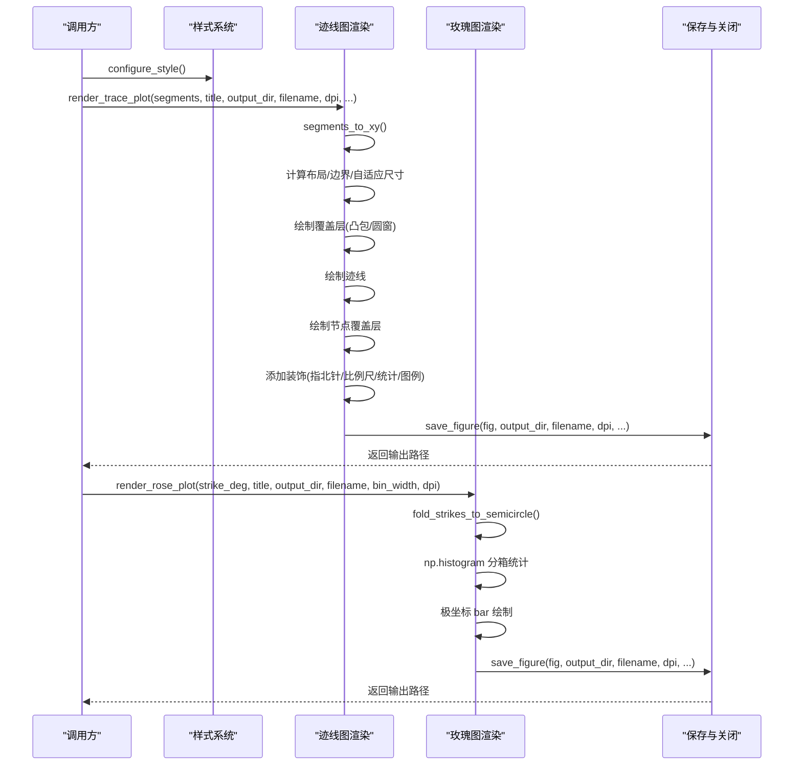
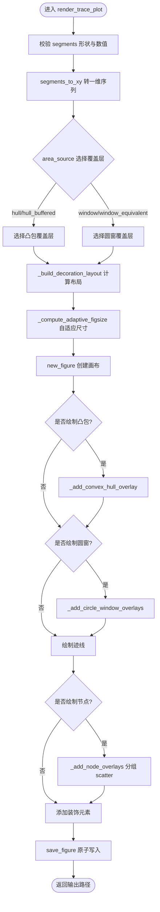
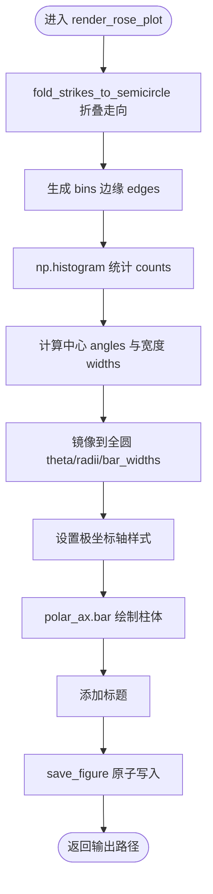
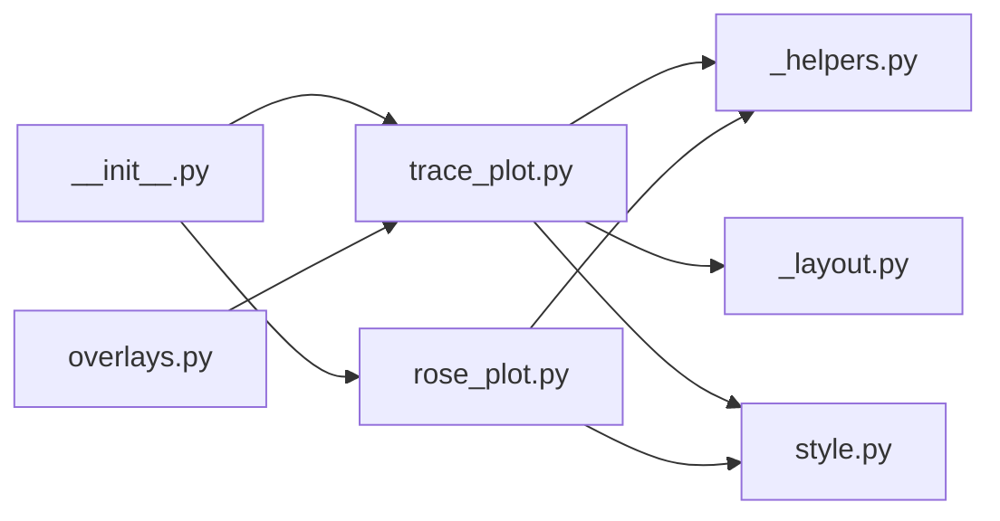

# 阶段五：可视化绘图输出

<cite>
**本文引用的文件**   
- [trace_pipeline/plotting/__init__.py](file://trace_pipeline/plotting/__init__.py)
- [trace_pipeline/plotting/trace_plot.py](file://trace_pipeline/plotting/trace_plot.py)
- [trace_pipeline/plotting/rose_plot.py](file://trace_pipeline/plotting/rose_plot.py)
- [trace_pipeline/plotting/style.py](file://trace_pipeline/plotting/style.py)
- [trace_pipeline/plotting/_helpers.py](file://trace_pipeline/plotting/_helpers.py)
- [trace_pipeline/plotting/_layout.py](file://trace_pipeline/plotting/_layout.py)
- [trace_pipeline/plotting/overlays.py](file://trace_pipeline/plotting/overlays.py)
- [tests/test_plotting.py](file://tests/test_plotting.py)
</cite>

## 目录
1. [简介](#简介)
2. [项目结构](#项目结构)
3. [核心组件](#核心组件)
4. [架构总览](#架构总览)
5. [详细组件分析](#详细组件分析)
6. [依赖关系分析](#依赖关系分析)
7. [性能与多分辨率输出](#性能与多分辨率输出)
8. [故障排查指南](#故障排查指南)
9. [结论](#结论)
10. [附录：使用示例路径](#附录使用示例路径)

## 简介
本章节聚焦于五阶段处理流水线的第五阶段——可视化绘图输出。该阶段负责将前序阶段产出的迹线数据、统计结果与覆盖层信息，渲染为高质量的可出版级图像，包括：
- 原始坐标系下的迹线图（含圆窗、凸包、节点标记等覆盖层）
- 旋转至测线坐标系后的迹线图（便于统一尺度比较）
- 节理走向玫瑰花瓣图（分箱统计与极坐标展示）
- 样式系统应用（字体、颜色、字号、全局参数）
- 多分辨率输出（DPI 配置与自适应尺寸）

文档将从代码级实现出发，解释各模块的职责、数据流、渲染顺序、样式覆盖机制、图层叠加策略以及 DPI 对输出质量的影响，并提供可复用的调用路径与优化建议。

## 项目结构
阶段五的绘图能力集中在 plotting 子包中，采用“入口函数 + 布局/辅助 + 样式”的分层组织方式：
- 顶层入口：__init__.py 提供按需懒加载导出，避免提前导入 matplotlib.pyplot
- 迹线图绘制：trace_plot.py 负责原始/旋转迹线图的核心渲染逻辑
- 玫瑰图绘制：rose_plot.py 负责极坐标直方图绘制与分箱计算
- 样式系统：style.py 管理 CJK/西文字体栈、全局 rcParams 与线程安全的样式覆盖
- 通用辅助：_helpers.py 提供 Figure 创建、保存、指北针几何、数据边界计算
- 共享布局：_layout.py 提供外框、比例尺带、统计框、图例、节点样式预设等
- 覆盖层构建：overlays.py 提供圆窗、凸包、节点覆盖层的构建与旋转到测线坐标系的工具

图表来源
- [trace_pipeline/plotting/__init__.py:1-36](file://trace_pipeline/plotting/__init__.py#L1-L36)
- [trace_pipeline/plotting/trace_plot.py:1-565](file://trace_pipeline/plotting/trace_plot.py#L1-L565)
- [trace_pipeline/plotting/rose_plot.py:1-140](file://trace_pipeline/plotting/rose_plot.py#L1-L140)
- [trace_pipeline/plotting/style.py:1-296](file://trace_pipeline/plotting/style.py#L1-L296)
- [trace_pipeline/plotting/_helpers.py:1-192](file://trace_pipeline/plotting/_helpers.py#L1-L192)
- [trace_pipeline/plotting/_layout.py:1-653](file://trace_pipeline/plotting/_layout.py#L1-L653)
- [trace_pipeline/plotting/overlays.py:1-156](file://trace_pipeline/plotting/overlays.py#L1-L156)

章节来源
- [trace_pipeline/plotting/__init__.py:1-36](file://trace_pipeline/plotting/__init__.py#L1-L36)

## 核心组件
- render_trace_plot：迹线图主入口，支持图层开关、背景透明、自适应尺寸、装饰元素（指北针、比例尺、统计框、图例）
- render_rose_plot：玫瑰图主入口，支持分箱宽度、极坐标轴样式、标题与 DPI 控制
- configure_style / apply_style_overrides：全局样式初始化与线程安全临时覆盖
- overlays 构建器：圆窗、凸包、节点覆盖层在原始/旋转坐标系下的生成与转换
- _layout 与 _helpers：布局解析、外框、比例尺带、统计框、图例、指北针几何与数据边界计算

章节来源
- [trace_pipeline/plotting/trace_plot.py:443-565](file://trace_pipeline/plotting/trace_plot.py#L443-L565)
- [trace_pipeline/plotting/rose_plot.py:106-140](file://trace_pipeline/plotting/rose_plot.py#L106-L140)
- [trace_pipeline/plotting/style.py:187-296](file://trace_pipeline/plotting/style.py#L187-L296)
- [trace_pipeline/plotting/overlays.py:33-156](file://trace_pipeline/plotting/overlays.py#L33-L156)
- [trace_pipeline/plotting/_layout.py:362-420](file://trace_pipeline/plotting/_layout.py#L362-L420)
- [trace_pipeline/plotting/_helpers.py:26-93](file://trace_pipeline/plotting/_helpers.py#L26-L93)

## 架构总览
阶段五的整体流程如下：
- 输入：TraceData（端点、走向角、长度等）、TraceStatistics（面积来源、诊断圆窗等）、NodeAnalysis（节点类型与位置）
- 覆盖层构建：根据统计数据与端点信息，生成圆窗、凸包、节点覆盖层；必要时旋转到测线坐标系
- 样式初始化：configure_style 设置字体族、数学文本、全局字号与线条粗细
- 迹线图渲染：segments_to_xy 将线段转为带 NaN 分隔的一维序列，按 zorder 分层绘制（底层覆盖层→迹线→节点→装饰）
- 玫瑰图渲染：fold_strikes_to_semicircle 折叠走向到半圆，np.histogram 分箱统计，极坐标 bar 绘制
- 输出：save_figure 原子写入 PNG，支持透明背景与 DPI 控制

图表来源
- [trace_pipeline/plotting/trace_plot.py:443-565](file://trace_pipeline/plotting/trace_plot.py#L443-L565)
- [trace_pipeline/plotting/rose_plot.py:106-140](file://trace_pipeline/plotting/rose_plot.py#L106-L140)
- [trace_pipeline/plotting/_helpers.py:42-93](file://trace_pipeline/plotting/_helpers.py#L42-L93)

## 详细组件分析

### 迹线图渲染（render_trace_plot）
- 输入与预处理
  - segments 为 (N, 4) 数组，列序 [x1, y1, x2, y2]
  - segments_to_xy 将线段转换为带 NaN 分隔的一维 X/Y 序列，使 matplotlib line plot 自动断开各段
- 覆盖层选择与有效性校验
  - area_source 决定显示“凸包/缓冲凸包”或“圆窗/等效圆窗”，并过滤无效圆窗（半径>0且坐标有限）
  - hull_overlay 仅在 area_source 为 hull/hull_buffered 时启用
- 布局与尺寸
  - _build_decoration_layout 基于数据范围与覆盖层扩展计算左右上下边距与比例尺长度
  - _compute_adaptive_figsize 依据目标物理比例（每米厘米数）自适应 figure 尺寸，限制在最小/最大区间
- 图层绘制顺序（zorder）
  - 底层：凸包或圆窗（二选一）
  - 中层：迹线
  - 上层：节点覆盖层（按类型分组批量 scatter 提升性能）
  - 装饰：指北针、比例尺带、统计框、图例
- 背景与透明
  - background_color 支持 "none"/"transparent" 以生成透明背景 PNG，便于后续叠加
- 输出
  - save_figure 原子写入，记录耗时日志，关闭图形对象

图表来源
- [trace_pipeline/plotting/trace_plot.py:151-170](file://trace_pipeline/plotting/trace_plot.py#L151-L170)
- [trace_pipeline/plotting/trace_plot.py:172-223](file://trace_pipeline/plotting/trace_plot.py#L172-L223)
- [trace_pipeline/plotting/trace_plot.py:225-281](file://trace_pipeline/plotting/trace_plot.py#L225-L281)
- [trace_pipeline/plotting/trace_plot.py:302-357](file://trace_pipeline/plotting/trace_plot.py#L302-L357)
- [trace_pipeline/plotting/trace_plot.py:420-441](file://trace_pipeline/plotting/trace_plot.py#L420-L441)
- [trace_pipeline/plotting/trace_plot.py:443-565](file://trace_pipeline/plotting/trace_plot.py#L443-L565)

章节来源
- [trace_pipeline/plotting/trace_plot.py:443-565](file://trace_pipeline/plotting/trace_plot.py#L443-L565)
- [trace_pipeline/plotting/_helpers.py:160-192](file://trace_pipeline/plotting/_helpers.py#L160-L192)
- [trace_pipeline/plotting/_layout.py:362-420](file://trace_pipeline/plotting/_layout.py#L362-L420)

### 玫瑰图渲染（render_rose_plot）
- 分箱算法
  - fold_strikes_to_semicircle 将走向折叠到半圆（消除反向重复），确保角度在 [0, 180)
  - edges 由 bin_width 生成，保证包含 0 与 180 边界
  - np.histogram 统计频数，centers 与 widths 用于极坐标 bar 的 theta 与宽度
  - 最终将半圆统计镜像到全圆（theta 拼接 centers 与 centers+180，radii/bar_widths 同样拼接）
- 极坐标轴绘制
  - set_theta_zero_location("N") 与 set_theta_direction(-1) 符合地质学惯例
  - grid、刻度、边框、标签字体统一应用
- 输出
  - 默认 DPI 较高（400），适合出版；支持自定义 figsize_cm 与 bin_width

图表来源
- [trace_pipeline/plotting/rose_plot.py:76-104](file://trace_pipeline/plotting/rose_plot.py#L76-L104)
- [trace_pipeline/plotting/rose_plot.py:106-140](file://trace_pipeline/plotting/rose_plot.py#L106-L140)

章节来源
- [trace_pipeline/plotting/rose_plot.py:76-104](file://trace_pipeline/plotting/rose_plot.py#L76-L104)
- [trace_pipeline/plotting/rose_plot.py:106-140](file://trace_pipeline/plotting/rose_plot.py#L106-L140)

### 样式系统（configure_style 与 apply_style_overrides）
- 字体栈与回退
  - 优先 Times New Roman 与宋体，检测可用字体并去重，构建 western/cjk_serif/cjk_sans 候选列表
  - 标题与正文分别提供 heading_font_kwargs/body_font_kwargs，避免 bold 缺失字重的警告
- 全局 rcParams
  - 设置 axes.linewidth、tick 大小、lines.linewidth、figure/savefig dpi、facecolor 等
  - mathtext.fontset=custom 指定数学文本字体，保证单位上标与英文数字一致
- 线程安全覆盖
  - apply_style_overrides 通过锁保护，仅覆盖已注册的样式键（如 trace_line_color、hull_fill_alpha、rose_bar_color 等）
  - 支持 label_font_size/global_font_size 覆盖全局字号，退出上下文自动恢复

章节来源
- [trace_pipeline/plotting/style.py:187-296](file://trace_pipeline/plotting/style.py#L187-L296)
- [trace_pipeline/plotting/style.py:22-46](file://trace_pipeline/plotting/style.py#L22-L46)

### 覆盖层构建（overlays.py）
- 圆窗覆盖层
  - build_raw_circle_overlays：从诊断信息提取圆心与半径，结合测线方位角转换为全局坐标
  - build_rotated_circle_overlays：将原始圆窗旋转到测线坐标系
- 凸包覆盖层
  - build_selected_hull_overlays：根据 outcrop_area_source 选择原始或缓冲凸包顶点，再旋转到测线坐标系
- 节点覆盖层
  - build_node_overlays：将节点分析结果转换为 NodeOverlay
  - build_rotated_node_overlays：旋转到测线坐标系

章节来源
- [trace_pipeline/plotting/overlays.py:33-156](file://trace_pipeline/plotting/overlays.py#L33-L156)

### 布局与装饰（_layout.py 与 _helpers.py）
- 布局解析
  - _resolve_layout 根据标题行数动态调整外框顶部高度，统计框占据右上区域，图例自适应高度
- 外框与面板
  - _add_outer_frame 绘制完整四边框；_blank_panel_axes 创建空白面板（无刻度、无边框）
- 比例尺带
  - _choose_scale_length 自适应选择 1/2/5×10ⁿ 规整长度；_add_scale_bar_band 在独立比例尺带中绘制
- 统计框
  - _add_statistics_box 半透明背景，行高自适应，单位规范化为 mathtext
- 图例
  - _render_legend 根据 items 与 styles 绘制图标与文本，支持迹线、凸包、圆窗、节点类型
- 指北针
  - add_data_north_arrow 在数据坐标下绘制箭头与 N 标签

章节来源
- [trace_pipeline/plotting/_layout.py:362-420](file://trace_pipeline/plotting/_layout.py#L362-L420)
- [trace_pipeline/plotting/_layout.py:447-569](file://trace_pipeline/plotting/_layout.py#L447-L569)
- [trace_pipeline/plotting/_layout.py:571-642](file://trace_pipeline/plotting/_layout.py#L571-L642)
- [trace_pipeline/plotting/_helpers.py:99-158](file://trace_pipeline/plotting/_helpers.py#L99-L158)

## 依赖关系分析
- 模块耦合
  - trace_plot.py 依赖 _helpers、_layout、style；overlays.py 提供覆盖层数据供 trace_plot 使用
  - rose_plot.py 依赖 style 与 _helpers；两者均通过 __init__.py 懒加载导出
- 外部依赖
  - matplotlib.pyplot 在 _helpers.py 中强制非交互后端后导入，避免 GUI 阻塞
  - numpy 用于向量化计算与分箱统计
- 潜在循环依赖
  - style.py 通过延迟导入 trace_plot 与 rose_plot 以避免循环依赖

图表来源
- [trace_pipeline/plotting/__init__.py:1-36](file://trace_pipeline/plotting/__init__.py#L1-L36)
- [trace_pipeline/plotting/trace_plot.py:1-35](file://trace_pipeline/plotting/trace_plot.py#L1-L35)
- [trace_pipeline/plotting/rose_plot.py:1-17](file://trace_pipeline/plotting/rose_plot.py#L1-L17)
- [trace_pipeline/plotting/_helpers.py:1-21](file://trace_pipeline/plotting/_helpers.py#L1-L21)
- [trace_pipeline/plotting/_layout.py:1-35](file://trace_pipeline/plotting/_layout.py#L1-L35)
- [trace_pipeline/plotting/overlays.py:1-31](file://trace_pipeline/plotting/overlays.py#L1-L31)

章节来源
- [trace_pipeline/plotting/__init__.py:1-36](file://trace_pipeline/plotting/__init__.py#L1-L36)

## 性能与多分辨率输出
- DPI 配置
  - 迹线图默认 300 DPI，玫瑰图默认 400 DPI；可通过 render_* 函数的 dpi 参数调整
  - 高分辨率提升细节清晰度，但增大内存与 I/O 时间；建议在批量输出时权衡
- 自适应尺寸
  - 迹线图根据数据跨度与目标物理比例（每米厘米数）计算 figure 尺寸，确保不同图之间 1m 的物理长度一致，利于面积比较
- 图层控制
  - include_trace/include_hull/include_circles/include_nodes/include_decorations 布尔开关可减少不必要的绘制开销
- 原子写入与透明背景
  - save_figure 先写临时文件再重命名，避免中断导致损坏；透明背景便于后续叠加
- 节点批量绘制
  - 按节点类型分组 scatter，减少多次调用开销

章节来源
- [trace_pipeline/plotting/trace_plot.py:44-50](file://trace_pipeline/plotting/trace_plot.py#L44-L50)
- [trace_pipeline/plotting/trace_plot.py:420-441](file://trace_pipeline/plotting/trace_plot.py#L420-L441)
- [trace_pipeline/plotting/trace_plot.py:320-357](file://trace_pipeline/plotting/trace_plot.py#L320-L357)
- [trace_pipeline/plotting/_helpers.py:42-93](file://trace_pipeline/plotting/_helpers.py#L42-L93)

## 故障排查指南
- 数据异常
  - segments 包含 NaN/inf 会抛出 ValueError；请检查端点坐标与长度数据
  - strike_deg 包含 NaN/inf 无法绘制玫瑰图；需清洗数据
- 空数据
  - 空 strikes 或空 segments 仍会生成有效 PNG（空图），但文件大小较小；测试用例验证了不崩溃行为
- 样式覆盖死锁
  - apply_style_overrides 使用线程锁保护，内部 render_trace_plot 不会死锁；测试覆盖了此场景
- 字体缺失
  - 未检测到 Times New Roman 或宋体会发出警告并使用回退字体；不影响渲染，但可能影响排版一致性

章节来源
- [trace_pipeline/plotting/_helpers.py:160-192](file://trace_pipeline/plotting/_helpers.py#L160-L192)
- [trace_pipeline/plotting/rose_plot.py:76-88](file://trace_pipeline/plotting/rose_plot.py#L76-L88)
- [tests/test_plotting.py:18-42](file://tests/test_plotting.py#L18-L42)
- [tests/test_plotting.py:87-98](file://tests/test_plotting.py#L87-L98)
- [trace_pipeline/plotting/style.py:216-220](file://trace_pipeline/plotting/style.py#L216-L220)

## 结论
阶段五的可视化绘图输出模块以清晰的职责划分与稳健的实现细节，提供了高质量的迹线图与玫瑰图渲染能力。通过样式系统的集中管理与线程安全的覆盖机制，用户可在不破坏全局状态的前提下定制外观；通过图层开关与自适应尺寸，兼顾了灵活性与性能。DPI 配置与原子写入策略进一步保障了输出的可靠性与出版级质量。

## 附录：使用示例路径
以下示例展示了如何调用阶段五的绘图接口，具体实现请参考对应测试文件中的断言与参数传递：
- 玫瑰图渲染与空数据处理
  - [tests/test_plotting.py:18-42](file://tests/test_plotting.py#L18-L42)
- 迹线图渲染、圆窗覆盖层、统计信息框与样式覆盖
  - [tests/test_plotting.py:44-98](file://tests/test_plotting.py#L44-L98)

章节来源
- [tests/test_plotting.py:18-98](file://tests/test_plotting.py#L18-L98)