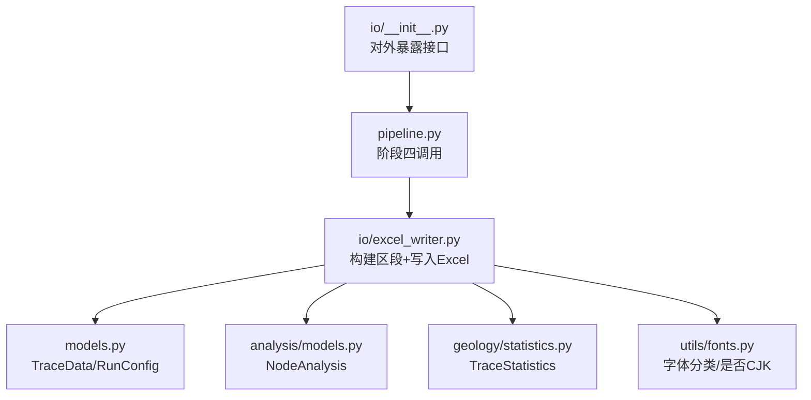
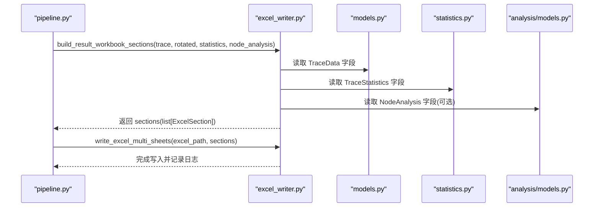
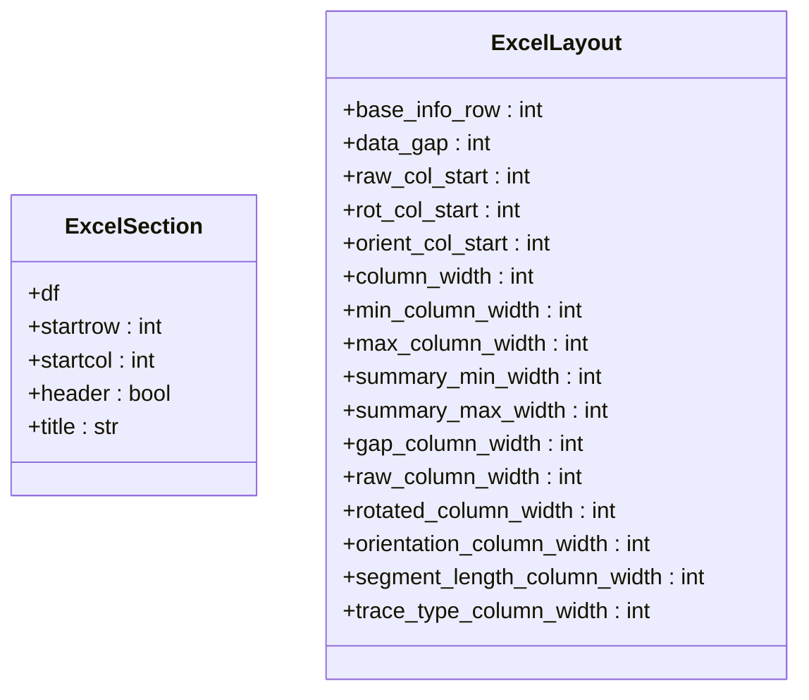
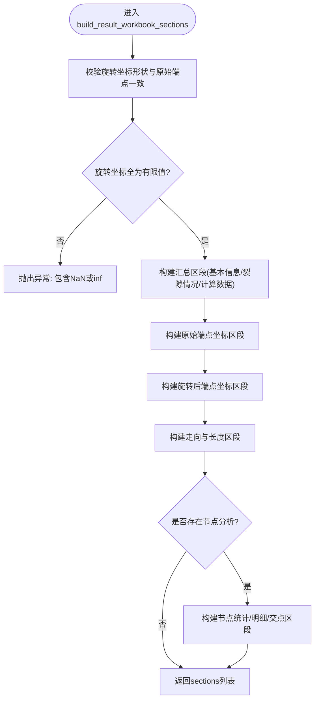
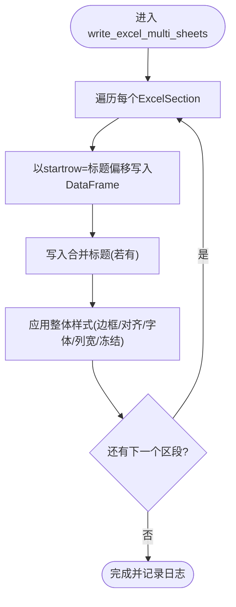
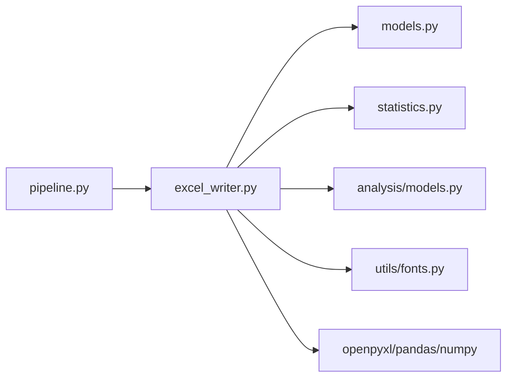

# 阶段四：Excel报告导出

<cite>
**本文引用的文件**   
- [trace_pipeline/io/excel_writer.py](file://trace_pipeline/io/excel_writer.py)
- [trace_pipeline/io/__init__.py](file://trace_pipeline/io/__init__.py)
- [trace_pipeline/pipeline.py](file://trace_pipeline/pipeline.py)
- [trace_pipeline/models.py](file://trace_pipeline/models.py)
- [trace_pipeline/analysis/models.py](file://trace_pipeline/analysis/models.py)
- [trace_pipeline/geology/statistics.py](file://trace_pipeline/geology/statistics.py)
- [trace_pipeline/utils/fonts.py](file://trace_pipeline/utils/fonts.py)
- [trace_pipeline/plotting/trace_plot.py](file://trace_pipeline/plotting/trace_plot.py)
</cite>

## 目录
1. [简介](#简介)
2. [项目结构](#项目结构)
3. [核心组件](#核心组件)
4. [架构总览](#架构总览)
5. [详细组件分析](#详细组件分析)
6. [依赖关系分析](#依赖关系分析)
7. [性能考量](#性能考量)
8. [故障排查指南](#故障排查指南)
9. [结论](#结论)
10. [附录](#附录)

## 简介
本章节聚焦五阶段处理流水线的第四阶段——Excel报告导出。该阶段负责将迹线数据、旋转坐标、统计结果与节点信息组织为多工作表Excel，并应用统一的格式与样式。核心流程包括：
- 构建多工作表区段：build_result_workbook_sections
- 写入多工作表Excel：write_excel_multi_sheets

输出文件包含“基本信息”“裂隙情况”“计算数据”“原始端点坐标”“旋转后端点坐标”“走向与长度”等若干工作表；当启用节点识别时，还会追加“节点统计”“节点明细”“节点交点”等工作表。

## 项目结构
Excel导出相关代码位于 trace_pipeline/io 子包中，由 pipeline 主流程在阶段四调用。

图表来源
- [trace_pipeline/pipeline.py:375-388](file://trace_pipeline/pipeline.py#L375-L388)
- [trace_pipeline/io/excel_writer.py:280-331](file://trace_pipeline/io/excel_writer.py#L280-L331)
- [trace_pipeline/io/__init__.py:1-22](file://trace_pipeline/io/__init__.py#L1-L22)

章节来源
- [trace_pipeline/pipeline.py:375-388](file://trace_pipeline/pipeline.py#L375-L388)
- [trace_pipeline/io/__init__.py:1-22](file://trace_pipeline/io/__init__.py#L1-L22)

## 核心组件
- ExcelSection：表示一个待写入的DataFrame区段（含标题行、起始行列位置、是否带列头）。
- ExcelLayout：控制各区域列起始位置、列宽、间距等布局参数。
- build_result_workbook_sections：根据输入数据构造多个ExcelSection（汇总、原始坐标、旋转坐标、走向与长度、可选节点信息）。
- write_excel_multi_sheets：遍历区段，逐个写入独立工作表，并统一设置标题、边框、对齐、冻结窗格等样式。

章节来源
- [trace_pipeline/io/excel_writer.py:37-70](file://trace_pipeline/io/excel_writer.py#L37-L70)
- [trace_pipeline/io/excel_writer.py:280-331](file://trace_pipeline/io/excel_writer.py#L280-L331)
- [trace_pipeline/io/excel_writer.py:462-489](file://trace_pipeline/io/excel_writer.py#L462-L489)

## 架构总览
阶段四在流水线中的位置与上下游关系如下：

图表来源
- [trace_pipeline/pipeline.py:375-388](file://trace_pipeline/pipeline.py#L375-L388)
- [trace_pipeline/io/excel_writer.py:280-331](file://trace_pipeline/io/excel_writer.py#L280-L331)
- [trace_pipeline/io/excel_writer.py:462-489](file://trace_pipeline/io/excel_writer.py#L462-L489)

## 详细组件分析

### 组件一：ExcelSection 与 ExcelLayout
- ExcelSection
  - df：要导出的pandas DataFrame
  - startrow/startcol：写入起点（当前实现固定从第0行第0列开始）
  - header：是否写入列名
  - title：工作表标题（为空则使用默认名称）
- ExcelLayout
  - base_info_row：汇总信息起始行
  - raw_col_start/rot_col_start/orient_col_start：三个汇总区块的列起始位置
  - column_width/min_column_width/max_column_width：通用列宽约束
  - summary_min_width/summary_max_width：汇总区块列宽范围
  - gap_column_width/raw_column_width/rotated_column_width/orientation_column_width/segment_length_column_width/trace_type_column_width：各列宽度建议值

图表来源
- [trace_pipeline/io/excel_writer.py:37-70](file://trace_pipeline/io/excel_writer.py#L37-L70)

章节来源
- [trace_pipeline/io/excel_writer.py:37-70](file://trace_pipeline/io/excel_writer.py#L37-L70)

### 组件二：build_result_workbook_sections 工作流程
该函数负责组装所有工作表区段，主要步骤：
- 校验输入形状与数值有效性（旋转坐标与原始端点形状一致且有限）
- 生成汇总区段（基本信息、裂隙情况、计算数据）
- 生成原始端点坐标、旋转后端点坐标、走向与长度三个数据表区段
- 若提供节点分析，追加节点统计、节点明细、节点交点区段

图表来源
- [trace_pipeline/io/excel_writer.py:280-331](file://trace_pipeline/io/excel_writer.py#L280-L331)
- [trace_pipeline/io/excel_writer.py:334-394](file://trace_pipeline/io/excel_writer.py#L334-L394)

章节来源
- [trace_pipeline/io/excel_writer.py:280-331](file://trace_pipeline/io/excel_writer.py#L280-L331)
- [trace_pipeline/io/excel_writer.py:334-394](file://trace_pipeline/io/excel_writer.py#L334-L394)

#### 生成的工作表结构与内容
- 基本信息
  - 测线走向、测线长度、平均迹长、露头面积（含来源标注）
- 裂隙情况
  - 迹线数量、I型/II型/III型裂隙数
- 计算数据
  - 线密度(P₁₀)、面密度(P₂₀)、面累计长度密度(P₂₁)、有效取样窗数量
  - 若存在窗口验证告警，附加“校验告警”项
- 原始端点坐标
  - 起点X、起点Y、终点X、终点Y
- 旋转后端点坐标
  - 旋转后起点X、旋转后起点Y、旋转后终点X、旋转后终点Y
- 走向与长度
  - 节理走向(°)、端点距离、测段长度(r5+r7)
  - 若提供统计数据，追加“迹线类型”列
- 节点统计（可选）
  - 节点总数、孤立端点(I)、三叉节点(Y)、交叉节点(X)、交点事件数、节点密度、合并容差、跳过退化线段数
- 节点明细（可选）
  - 节点ID、X、Y、类型、拓扑值、连接迹线、事件数
- 节点交点（可选）
  - 迹线A、迹线B、交点X、交点Y、参数t、参数u、事件类型

章节来源
- [trace_pipeline/io/excel_writer.py:193-273](file://trace_pipeline/io/excel_writer.py#L193-L273)
- [trace_pipeline/io/excel_writer.py:297-331](file://trace_pipeline/io/excel_writer.py#L297-L331)
- [trace_pipeline/io/excel_writer.py:334-394](file://trace_pipeline/io/excel_writer.py#L334-L394)

### 组件三：write_excel_multi_sheets 格式化输出
- 逐区段写入独立工作表，首行可写入合并标题
- 统一样式：
  - 标题行加粗、居中、浅蓝背景、细边框
  - 数据单元格居中对齐、细边框
  - 数字按整数/浮点数分别设置显示格式
  - 自动计算列宽并限制在合理区间
  - 冻结标题行与表头行
- 字体策略：
  - 中文标题使用黑体，正文使用宋体
  - 英文/数字使用Times New Roman
  - 混合文本通过CellRichText分段设置字体

图表来源
- [trace_pipeline/io/excel_writer.py:462-489](file://trace_pipeline/io/excel_writer.py#L462-L489)
- [trace_pipeline/io/excel_writer.py:400-460](file://trace_pipeline/io/excel_writer.py#L400-L460)

章节来源
- [trace_pipeline/io/excel_writer.py:400-460](file://trace_pipeline/io/excel_writer.py#L400-L460)
- [trace_pipeline/io/excel_writer.py:462-489](file://trace_pipeline/io/excel_writer.py#L462-L489)

### 与matplotlib绘图的集成方式
- Excel导出阶段本身不直接绘制图形，但会产出“走向与长度”等表格，供后续阶段引用。
- 第五阶段绘图模块基于matplotlib渲染原始迹线图、旋转迹线图与玫瑰图，文件名与路径遵循约定命名规则，便于报告服务在DOCX/PDF中插入图片。
- Excel与绘图通过输出目录下的文件进行间接关联：Excel不包含图像对象，但报告服务会根据约定文件名查找并嵌入图片。

章节来源
- [trace_pipeline/pipeline.py:390-410](file://trace_pipeline/pipeline.py#L390-L410)
- [trace_pipeline/plotting/trace_plot.py:443-565](file://trace_pipeline/plotting/trace_plot.py#L443-L565)

## 依赖关系分析
- 数据模型
  - TraceData：提供端点坐标、走向、长度、测线长度、露头面积等基础字段
  - TraceStatistics：提供各类统计量与来源标注
  - NodeAnalysis：提供节点统计与明细
- 工具库
  - openpyxl：Excel读写与样式
  - pandas：DataFrame到Excel的转换
  - numpy：数值数组操作
  - fonts：中英文字体分类与CJK检测

图表来源
- [trace_pipeline/pipeline.py:375-388](file://trace_pipeline/pipeline.py#L375-L388)
- [trace_pipeline/io/excel_writer.py:1-33](file://trace_pipeline/io/excel_writer.py#L1-L33)

章节来源
- [trace_pipeline/io/excel_writer.py:1-33](file://trace_pipeline/io/excel_writer.py#L1-L33)
- [trace_pipeline/models.py:41-157](file://trace_pipeline/models.py#L41-L157)
- [trace_pipeline/analysis/models.py](file://trace_pipeline/analysis/models.py)
- [trace_pipeline/geology/statistics.py](file://trace_pipeline/geology/statistics.py)
- [trace_pipeline/utils/fonts.py](file://trace_pipeline/utils/fonts.py)

## 性能考量
- 单遍遍历设置样式与列宽：在样式循环中同时统计最大文本长度，避免二次遍历整列，降低开销。
- 冻结窗格与批量设置：对表头和数据区域一次性设置边框、对齐与字体，减少重复操作。
- 数值格式优化：区分整数与浮点数设置number_format，提升可读性与渲染效率。
- 大文件写入：使用pandas.ExcelWriter上下文管理，确保资源释放与稳定写入。

[本节为通用指导，无需具体文件分析]

## 故障排查指南
- 常见错误与恢复
  - 形状不一致：旋转坐标与原始端点形状不一致将触发异常，需检查变换逻辑与输入一致性。
  - 非有限值：旋转坐标包含NaN或inf将触发异常，需在上游数据清洗或变换阶段修复。
  - 权限问题：写入被占用或无权限时会捕获PermissionError，提示关闭已打开的输出文件后重试。
  - 输入缺失：找不到输入文件时捕获FileNotFoundError，提示检查路径。
- 调试建议
  - 查看日志：导出完成后会记录Excel路径与耗时，便于定位问题。
  - 分步验证：先仅生成sections并打印其形状与列名，再执行写入，逐步缩小问题范围。

章节来源
- [trace_pipeline/io/excel_writer.py:280-294](file://trace_pipeline/io/excel_writer.py#L280-L294)
- [trace_pipeline/pipeline.py:450-474](file://trace_pipeline/pipeline.py#L450-L474)

## 结论
阶段四通过清晰的区段化设计与统一的样式规范，实现了结构化、可读性强的多工作表Excel导出。配合第五阶段的matplotlib绘图，形成完整的数据—可视化闭环。建议在扩展时优先复用ExcelLayout与现有区段构建函数，保持输出结构的一致性与可维护性。

[本节为总结性内容，无需具体文件分析]

## 附录

### 自定义工作表添加示例（概念性说明）
- 新增一个ExcelSection，指定df、startrow、startcol、header与title，将其加入sections列表即可在工作簿末尾新增一个工作表。
- 参考路径：
  - [trace_pipeline/io/excel_writer.py:280-331](file://trace_pipeline/io/excel_writer.py#L280-L331)
  - [trace_pipeline/io/excel_writer.py:462-489](file://trace_pipeline/io/excel_writer.py#L462-L489)

### 数据验证与错误恢复机制（概念性说明）
- 在构建区段前进行形状与数值校验，失败即抛出明确异常，便于上游修正。
- 在流水线层捕获常见异常并提供友好提示，保证流程健壮性。
- 参考路径：
  - [trace_pipeline/io/excel_writer.py:280-294](file://trace_pipeline/io/excel_writer.py#L280-L294)
  - [trace_pipeline/pipeline.py:450-474](file://trace_pipeline/pipeline.py#L450-L474)