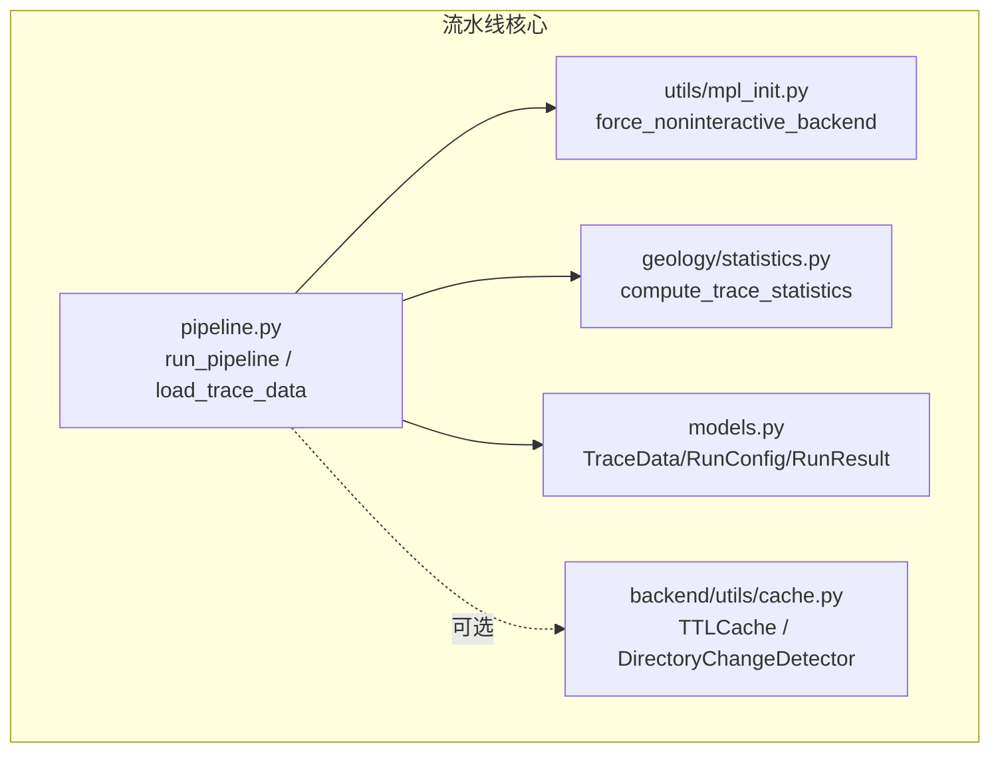
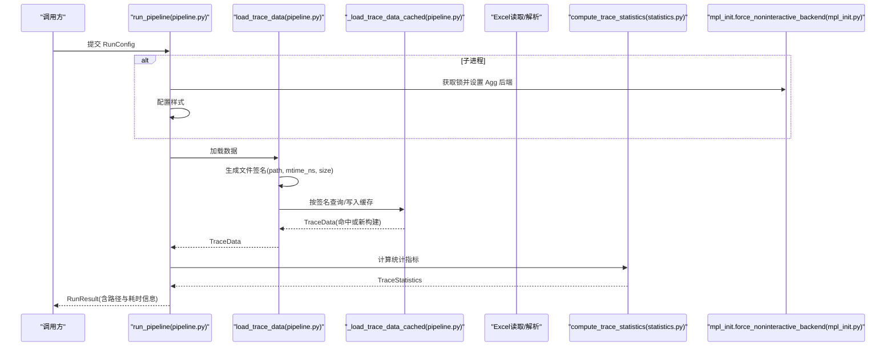
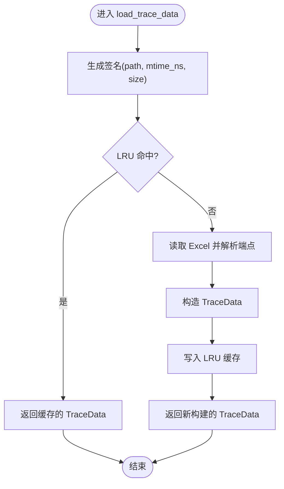
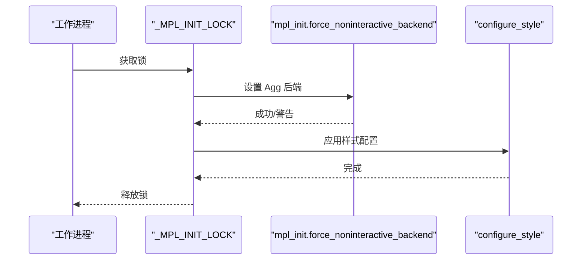
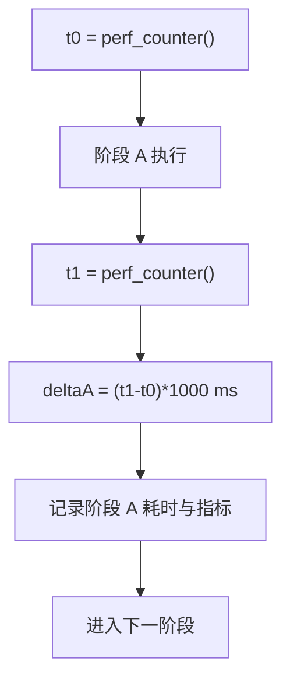
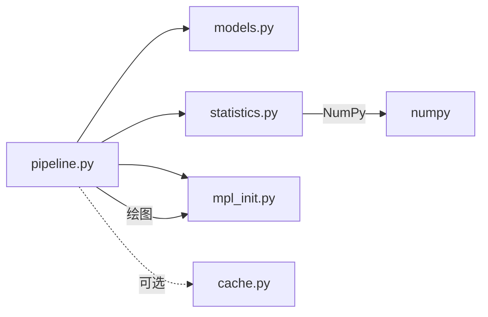

# 性能优化与缓存机制

<cite>
**本文引用的文件**   
- [pipeline.py](file://trace_pipeline/pipeline.py)
- [mpl_init.py](file://trace_pipeline/utils/mpl_init.py)
- [cache.py](file://backend/utils/cache.py)
- [statistics.py](file://trace_pipeline/geology/statistics.py)
- [models.py](file://trace_pipeline/models.py)
</cite>

## 目录
1. [简介](#简介)
2. [项目结构](#项目结构)
3. [核心组件](#核心组件)
4. [架构总览](#架构总览)
5. [详细组件分析](#详细组件分析)
6. [依赖关系分析](#依赖关系分析)
7. [性能考量](#性能考量)
8. [故障排查指南](#故障排查指南)
9. [结论](#结论)
10. [附录](#附录)

## 简介
本技术文档聚焦 TracePipeline 的性能优化策略与缓存机制，重点覆盖以下方面：
- 基于文件签名的 LRU 缓存实现（_load_trace_data_cached），以及 mtime_ns 与 size 双重验证如何确保缓存有效性。
- matplotlib 后端的多进程安全初始化流程，包括 _MPL_INIT_LOCK 线程锁的作用与 force_noninteractive_backend 的配置。
- 流水线中的时间统计机制，包括 perf_counter 高精度计时与阶段性耗时记录。
- 大数据量处理的优化策略，包括向量化计算、内存管理与并发处理。
- 性能监控指标与调优建议，包括缓存命中率、处理速度与资源使用情况的分析方法。

## 项目结构
围绕性能与缓存的关键代码主要分布在如下模块：
- trace_pipeline/pipeline.py：主流水线编排、阶段计时、多进程安全初始化、文件签名与 LRU 缓存入口。
- trace_pipeline/utils/mpl_init.py：强制非交互式后端（Agg）的幂等设置。
- backend/utils/cache.py：通用 TTL + LRU 缓存与目录变更检测工具（供上层服务复用）。
- trace_pipeline/geology/statistics.py：统计计算中大量使用 NumPy 向量化与回退策略，影响整体吞吐与稳定性。
- trace_pipeline/models.py：不可变数据模型与派生属性缓存（如长度缓存），减少重复计算。

图表来源
- [pipeline.py:230-253](file://trace_pipeline/pipeline.py#L230-L253)
- [mpl_init.py:12-24](file://trace_pipeline/utils/mpl_init.py#L12-L24)
- [cache.py:18-90](file://backend/utils/cache.py#L18-L90)
- [statistics.py:212-391](file://trace_pipeline/geology/statistics.py#L212-L391)
- [models.py:41-157](file://trace_pipeline/models.py#L41-L157)

章节来源
- [pipeline.py:1-120](file://trace_pipeline/pipeline.py#L1-L120)
- [mpl_init.py:1-24](file://trace_pipeline/utils/mpl_init.py#L1-L24)
- [cache.py:1-155](file://backend/utils/cache.py#L1-L155)
- [statistics.py:1-391](file://trace_pipeline/geology/statistics.py#L1-L391)
- [models.py:1-352](file://trace_pipeline/models.py#L1-L352)

## 核心组件
- 文件签名与 LRU 缓存加载器
  - 通过输入路径与文件名定位 Excel，并读取文件的 mtime_ns 与 st_size 作为“签名”参数传入 LRU 缓存键空间，避免同名不同内容导致的误命中。
  - 该函数内部完成 Excel 读取与端点解析，返回不可变的 TraceData。
- 多进程安全的 matplotlib 初始化
  - 在子进程中，使用全局线程锁保护 Agg 后端设置与样式配置，避免跨进程/线程冲突。
- 高精度计时与阶段日志
  - 使用 perf_counter 对关键阶段进行高精度计时，并通过结构化日志输出各阶段耗时与关键指标。
- 统计计算的向量化与回退策略
  - 统计模块广泛采用 NumPy 向量化运算，并在面积与迹长估算上提供多层回退，保证鲁棒性。
- 不可变数据模型与派生属性缓存
  - TraceData 为 frozen dataclass，内部将派生属性（如长度数组）缓存到实例字典，避免重复计算。

章节来源
- [pipeline.py:50-96](file://trace_pipeline/pipeline.py#L50-L96)
- [pipeline.py:230-253](file://trace_pipeline/pipeline.py#L230-L253)
- [pipeline.py:254-418](file://trace_pipeline/pipeline.py#L254-L418)
- [mpl_init.py:12-24](file://trace_pipeline/utils/mpl_init.py#L12-L24)
- [statistics.py:212-391](file://trace_pipeline/geology/statistics.py#L212-L391)
- [models.py:41-157](file://trace_pipeline/models.py#L41-L157)

## 架构总览
下图展示了单目标全流程在运行时的关键交互与数据流，包括缓存、绘图后端初始化、统计计算与结果输出。

图表来源
- [pipeline.py:230-418](file://trace_pipeline/pipeline.py#L230-L418)
- [pipeline.py:50-96](file://trace_pipeline/pipeline.py#L50-L96)
- [mpl_init.py:12-24](file://trace_pipeline/utils/mpl_init.py#L12-L24)
- [statistics.py:212-391](file://trace_pipeline/geology/statistics.py#L212-L391)

## 详细组件分析

### 基于文件签名的 LRU 缓存（_load_trace_data_cached）
- 设计要点
  - 输入签名由三部分组成：解析后的绝对父目录、mtime_ns（纳秒级修改时间）、st_size（文件大小）。三者共同构成稳定的缓存键，有效防止同名替换导致的数据不一致。
  - 使用 lru_cache(maxsize=16) 控制内存占用上限，适合典型批处理场景下的热点表重复访问。
  - 内部仅包含 I/O 与解析逻辑，返回不可变 TraceData，便于下游安全共享。
- 双重验证机制
  - mtime_ns 与 size 同时参与签名，任何一次外部修改都会改变至少一个字段，从而触发缓存失效与重建。
  - 若文件系统不支持高精度时间戳，仍可通过 size 变化捕获多数更新；二者结合提升可靠性。
- 复杂度与空间
  - 缓存键为三元组，哈希开销低；maxsize=16 限制最大条目数，LRU 淘汰策略保证内存稳定。
  - 命中时直接返回 TraceData，避免重复 I/O 与解析，显著降低端到端延迟。

图表来源
- [pipeline.py:50-96](file://trace_pipeline/pipeline.py#L50-L96)

章节来源
- [pipeline.py:50-96](file://trace_pipeline/pipeline.py#L50-L96)

### matplotlib 后端的多进程安全初始化
- 问题背景
  - 在多进程环境下，matplotlib 默认后端可能与 GUI 事件循环冲突，导致崩溃或无输出。
- 解决方案
  - 在子进程中，使用全局线程锁 _MPL_INIT_LOCK 保护后端切换与样式配置，确保幂等且线程安全。
  - 通过 force_noninteractive_backend() 强制使用 Agg 后端，避免显示设备依赖。
- 适用场景
  - 使用 ProcessPoolExecutor 并行处理多个露头数据时，每个工作进程独立初始化绘图后端，互不干扰。

图表来源
- [pipeline.py:230-253](file://trace_pipeline/pipeline.py#L230-L253)
- [mpl_init.py:12-24](file://trace_pipeline/utils/mpl_init.py#L12-L24)

章节来源
- [pipeline.py:230-253](file://trace_pipeline/pipeline.py#L230-L253)
- [mpl_init.py:12-24](file://trace_pipeline/utils/mpl_init.py#L12-L24)

### 流水线时间统计机制
- 高精度计时
  - 使用 time.perf_counter 在各阶段前后打点，计算毫秒级耗时，适用于短任务与长任务的高精度测量。
- 阶段性耗时记录
  - 数据加载、坐标变换、节点识别、Excel 导出、绘图等阶段均记录耗时与关键指标，便于定位瓶颈。
- 结构化日志
  - 通过 extra 字段附加 stage、duration_ms、trace_count 等元数据，便于聚合分析与可视化。

图表来源
- [pipeline.py:254-418](file://trace_pipeline/pipeline.py#L254-L418)

章节来源
- [pipeline.py:254-418](file://trace_pipeline/pipeline.py#L254-L418)

### 大数据量处理的优化策略
- 向量化计算
  - 统计模块大量使用 NumPy 向量化操作（如局部坐标系转换、距离计算、窗口策略评分），避免 Python 层循环，显著提升吞吐。
- 内存管理
  - TraceData 为 frozen dataclass，内部将派生属性（如 lengths）缓存至实例字典，避免重复计算与额外对象创建。
  - 数组写保护（writeable=False）减少意外修改带来的拷贝与一致性检查成本。
- 并发处理
  - 外层可结合 ProcessPoolExecutor 并行处理多个露头；子进程内通过线程锁保证绘图后端初始化安全。
- 回退策略
  - 面积与迹长估算采用多层回退（实测→凸包→缓冲凸包→圆窗等效面积），在异常或缺失数据下仍能产出合理结果。

章节来源
- [statistics.py:212-391](file://trace_pipeline/geology/statistics.py#L212-L391)
- [models.py:41-157](file://trace_pipeline/models.py#L41-L157)
- [pipeline.py:230-253](file://trace_pipeline/pipeline.py#L230-L253)

### 通用缓存与目录变更检测（TTLCache 与 DirectoryChangeDetector）
- TTLCache
  - 线程安全的 TTL + LRU 缓存，支持批量驱逐与显式失效接口，适合需要过期策略的服务层缓存。
- DirectoryChangeDetector
  - 维护目录浅层快照（文件名、类型、大小、mtime_ns），支持截断场景下的新增/删除检测，并提供 invalidate 重置能力。
  - 适用于输入目录动态变化的批处理场景，配合上层缓存策略提高一致性。

章节来源
- [cache.py:18-90](file://backend/utils/cache.py#L18-L90)
- [cache.py:92-155](file://backend/utils/cache.py#L92-L155)

## 依赖关系分析
- 模块耦合
  - pipeline.py 依赖 models.py（数据模型）、statistics.py（统计计算）、mpl_init.py（后端初始化）。
  - statistics.py 依赖 numpy 与角度/几何工具，但不反向依赖 pipeline。
  - cache.py 为通用工具，被上层服务按需引入，不与 pipeline 强耦合。
- 潜在循环依赖
  - 当前结构未见循环导入；各模块职责清晰，符合分层与单一职责原则。
- 外部依赖
  - numpy：向量化计算的核心。
  - matplotlib：仅在绘图阶段使用，且通过 Agg 后端规避 GUI 依赖。

图表来源
- [pipeline.py:1-120](file://trace_pipeline/pipeline.py#L1-L120)
- [statistics.py:1-45](file://trace_pipeline/geology/statistics.py#L1-L45)
- [mpl_init.py:1-24](file://trace_pipeline/utils/mpl_init.py#L1-L24)
- [cache.py:1-155](file://backend/utils/cache.py#L1-L155)

章节来源
- [pipeline.py:1-120](file://trace_pipeline/pipeline.py#L1-L120)
- [statistics.py:1-45](file://trace_pipeline/geology/statistics.py#L1-L45)
- [mpl_init.py:1-24](file://trace_pipeline/utils/mpl_init.py#L1-L24)
- [cache.py:1-155](file://backend/utils/cache.py#L1-L155)

## 性能考量
- 缓存命中率
  - 观察相同 table_stem 的多次运行，若 mtime_ns/size 未变化，应命中 LRU 缓存，显著缩短加载阶段耗时。
  - 建议在日志中增加缓存命中/未命中标记，便于统计命中率。
- 处理速度
  - 以 perf_counter 记录的各阶段 duration_ms 为依据，识别热点阶段（通常为 I/O 与绘图）。
  - 对于大图 DPI 与高分辨率玫瑰图，可适当调整 dpi 参数以降低渲染时间。
- 资源使用
  - 监控进程内存峰值，关注 TraceData 中大型数组的分配与释放；必要时在批处理间显式释放引用。
  - 多进程并行时，注意系统 CPU 与磁盘 I/O 饱和情况，合理设置进程池大小。
- 调优建议
  - 增大 LRU maxsize 以覆盖更多热点表（需权衡内存占用）。
  - 对超大目录启用 DirectoryChangeDetector，避免全量扫描导致的抖动。
  - 在统计计算中优先使用观测值（segment/endpoint），当缺失时再回退到估计值，保证准确性与效率平衡。

[本节为通用指导，无需列出具体文件来源]

## 故障排查指南
- 常见错误与处理
  - 权限不足/文件占用：捕获 PermissionError，提示关闭已打开的输出文件后重试。
  - 输入文件不存在：捕获 FileNotFoundError，提示检查路径。
  - 数据格式异常：捕获 ValueError/KeyError/TypeError/IndexError，记录原始错误并返回失败结果。
  - 内存不足/中断：MemoryError 与 KeyboardInterrupt 直接抛出，便于上层终止与清理。
- 诊断方法
  - 查看结构化日志中的 stage 与 duration_ms，快速定位耗时阶段。
  - 检查 RunResult.error_type 与 error_traceback，辅助定位根因。
  - 确认子进程中是否成功设置 Agg 后端，避免绘图阶段崩溃。

章节来源
- [pipeline.py:98-130](file://trace_pipeline/pipeline.py#L98-L130)
- [pipeline.py:450-474](file://trace_pipeline/pipeline.py#L450-L474)

## 结论
TracePipeline 在性能与稳定性方面采用了多项工程化实践：
- 基于文件签名的 LRU 缓存有效降低重复 I/O 与解析开销。
- 多进程安全的 matplotlib 初始化避免了后端冲突。
- 高精度计时与结构化日志为性能分析与调优提供了坚实基础。
- 向量化计算与回退策略提升了大数据量处理的鲁棒性与吞吐。
- 通用缓存与目录变更检测工具为上层服务提供了可扩展的能力。

[本节为总结性内容，无需列出具体文件来源]

## 附录
- 术语说明
  - LRU：最近最少使用淘汰策略。
  - TTL：生存时间（Time To Live）。
  - Agg：非交互式渲染后端，适合服务器环境。
- 相关接口参考
  - run_pipeline(cfg): 单次处理入口，返回 RunResult。
  - load_trace_data(input_dir, table_stem, outcrop): 带缓存的数据加载。
  - compute_trace_statistics(trace, config): 统计指标计算。
  - force_noninteractive_backend(): 设置 Agg 后端。

[本节为补充信息，无需列出具体文件来源]